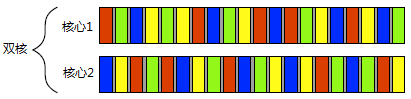
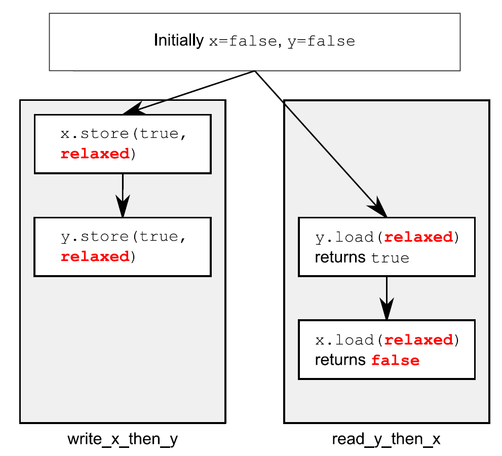
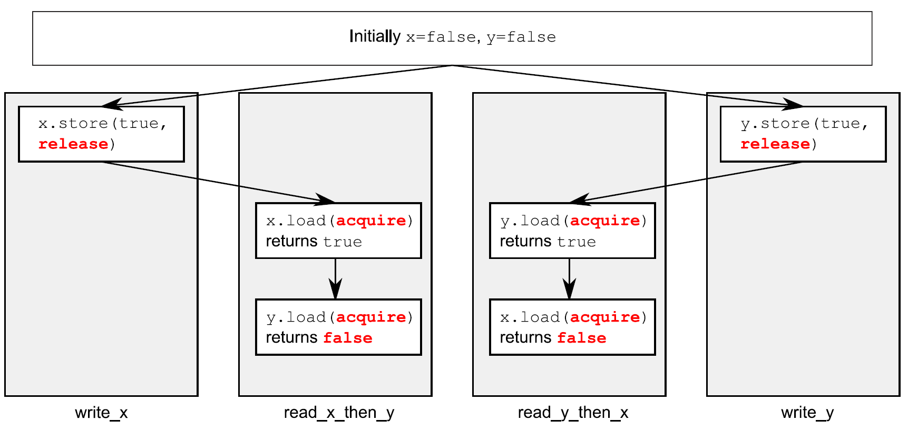
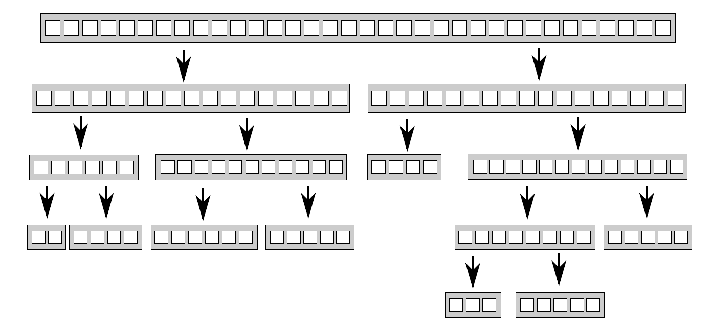
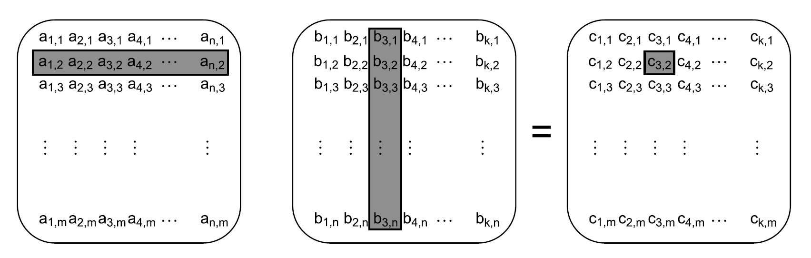

# 第1章 你好，C++的并发世界!

**本章主要内容**

- 何谓并发和多线程
- 应用程序为什么要使用并发和多线程
- C++的并发史
- 一个简单的C++多线程程序

令C++用户振奋的时刻到了。距初始的C++标准（1998年）发布13年后，C++标准委员会给语言本身，以及标准库，带来了一次重大的变革。

新C++标准（也被称为C++11或C++0x）在2011年发布，带来一系列的变革让C++编程更加简单和高效。

其中一个最重要的新特性就是对多线程的支持。

C++标准第一次承认多线程在语言中的存在，并在标准库中为多线程提供组件。这意味着使用C++编写与平台无关的多线程程序成为可能，也为可移植性提供了强有力的保证。与此同时，程序员们为提高应用的性能，对并发的关注也是与日俱增，特别在多线程编程方面。

本书是介绍如何使用C++11多线程来编写并发程序，及相关的语言特性和*库工具*(library facilities)。本书以“解释并发和多线程的含义，为什么要使用并发”作为起始点，在对“什么情况下不使用并发”进行阐述之后，将对C++支持的并发方式进行概述；最后，以一个简单的C++并发实例结束这一章。资深的多线程开发人员可以跳过前面的小节。在后面的几个章节中，会有更多的例子，以便大家对库工具进行更加深入的了解。本书最后，将会给出所有多线程与并发相关的C++标准库工具的全面参考。

问题来了，何谓并发?何谓多线程?


# 1.1 何谓并发

最简单和最基本的并发,是指两个或更多独立的活动同时发生。

并发在生活中随处可见，我们可以一边走路一边说话，也可以两只手同时作不同的动作，还有我们每个人都过着相互独立的生活——当我在游泳的时候，你可以看球赛，等等。

## 1.1.1 计算机系统中的并发

计算机领域的并发指的是在单个系统里同时执行多个独立的任务，而非顺序的进行一些活动。

计算机领域里，并发不是一个新事物：很多年前，一台计算机就能通过多任务操作系统的切换功能，同时运行多个应用程序；高端多处理器服务器在很早就已经实现了真正的并行计算。那“老东西”上有哪些“新东西”能让它在计算机领域越来越流行呢？——真正任务并行，而非一种错觉。

以前，大多数计算机只有一个处理器，具有单个*处理单元*(processing unit)或*核心*(core),如今还有很多这样的台式机。这种机器只能在某一时刻执行一个任务，不过它可以每秒进行多次任务切换。通过“这个任务做一会，再切换到别的任务，再做一会儿”的方式，让任务看起来是并行执行的。这种方式称为*任务切换*。如今,我们仍然将这样的系统称为*并发*:因为任务切换得太快，以至于无法感觉到任务在何时会被暂时挂起，而切换到另一个任务。任务切换会给用户和应用程序造成一种“并发的假象”。因为这种假象，当应用在任务切换的环境下和真正并发环境下执行相比，行为还是有着微妙的不同。特别是对内存模型不正确的假设(详见第5章),在多线程环境中可能不会出现(详见第10章)。

多处理器计算机用于服务器和高性能计算已有多年。基于单芯多核处理器(多核处理器)的台式机，也越来越大众化。无论拥有几个处理器，这些机器都能够真正的并行多个任务。我们称其为*硬件并发*(hardware concurrency)”。

图1.1显示了一个计算机处理恰好两个任务时的理想情景，每个任务被分为10个相等大小的块。在一个双核机器(具有两个处理核心)上，每个任务可以在各自的处理核心上执行。在单核机器上做任务切换时，每个任务的块交织进行。但它们中间有一小段分隔(图中所示灰色分隔条的厚度大于双核机器的分隔条);为了实现交织进行，系统每次从一个任务切换到另一个时都需要切换一次*上下文*(context switch)，任务切换也有时间开销。进行上下文的切换时，操作系统必须为当前运行的任务保存CPU的状态和指令指针，并计算出要切换到哪个任务，并为即将切换到的任务重新加载处理器状态。然后，CPU可能要将新任务的指令和数据的内存载入到缓存中，这会阻止CPU执行任何指令，从而造成的更多的延迟。


图 1.1 并发的两种方式：双核机器的真正并行 Vs. 单核机器的任务切换

有些处理器可以在一个核心上执行多个线程,但硬件并发在多处理器或多核系统上效果更加显著。*硬件线程*最重要的因素是数量,也就是硬件上可以并发运行多少独立的任务。即便是具有真正硬件并发的系统，也很容易拥有比硬件“可并行最大任务数”还要多的任务需要执行，所以任务切换在这些情况下仍然适用。例如，在一个典型的台式计算机上可能会有成百上千个的任务在运行，即便是在计算机处于空闲时，还是会有后台任务在运行。正是任务切换使得这些后台任务可以运行，并使得你可以同时运行文字处理器、编译器、编辑器和web浏览器(或其他应用的组合)。图1.2显示了四个任务在双核处理器上的任务切换，仍然是将任务整齐地划分为同等大小块的理想情况。实际上，许多因素会使得分割不均和调度不规则。部分因素将在第8章中讨论，那时我们再来看一看影响并行代码性能的因素。

无论应用程序在单核处理器，还是多核处理器上运行；也不论是任务切换还是真正的硬件并发，这里提到的技术、功能和类(本书所涉及的)都能使用得到。如何使用并发，将很大程度上取决于可用的硬件并发。我们将在第8章中再次讨论这个问题，并具体研究C++代码并行设计的问题。



图 1.2 四个任务在两个核心之间的切换

## 1.1.2 并发的途径

试想当两个程序员在两个独立的办公室一起做一个软件项目，他们可以安静地工作、不互相干扰，并且他们人手一套参考手册。但是，他们沟通起来就有些困难，比起可以直接互相交谈，他们必须使用电话、电子邮件或到对方的办公室进行直接交流。并且，管理两个办公室需要有一定的经费支出，还需要购买多份参考手册。

假设，让开发人员同在一间办公室办公，他们可以自由的对某个应用程序设计进行讨论，也可以在纸或白板上轻易的绘制图表，对设计观点进行辅助性阐释。现在，你只需要管理一个办公室，只要有一套参考资料就够了。遗憾的是，开发人员可能难以集中注意力，并且还可能存在资源共享的问题(比如，“参考手册哪去了?”)

以上两种方法，描绘了并发的两种基本途径。每个开发人员代表一个线程，每个办公室代表一个进程。第一种途径是每个进程只要一个线程，这就类似让每个开发人员拥有自己的办公室，而第二种途径是每个进程有多个线程，如同一个办公室里有两个开发人员。让我们在一个应用程序中简单的分析一下这两种途径。

##### 多进程并发

使用并发的第一种方法，是将应用程序分为多个独立的进程，它们在同一时刻运行，就像同时进行网页浏览和文字处理一样。如图1.3所示，独立的进程可以通过进程间常规的通信渠道传递讯息(信号、套接字、文件、管道等等)。不过，这种进程之间的通信通常不是设置复杂，就是速度慢，这是因为操作系统会在进程间提供了一定的保护措施，以避免一个进程去修改另一个进程的数据。还有一个缺点是，运行多个进程所需的固定开销：需要时间启动进程，操作系统需要内部资源来管理进程，等等。

当然，以上的机制也不是一无是处：操作系统在进程间提供附加的保护操作和更高级别的通信机制，意味着可以更容易编写安全的并发代码。实际上，在类似于Erlang的编程环境中，将进程作为并发的基本构造块。

使用多进程实现并发还有一个额外的优势———可以使用远程连接(可能需要联网)的方式，在不同的机器上运行独立的进程。虽然，这增加了通信成本，但在设计精良的系统上，这可能是一个提高并行可用行和性能的低成本方式。


图 1.3 一对并发运行的进程之间的通信

##### 多线程并发

并发的另一个途径，在单个进程中运行多个线程。线程很像轻量级的进程：每个线程相互独立运行，且线程可以在不同的指令序列中运行。但是，进程中的所有线程都共享地址空间，并且所有线程访问到大部分数据———全局变量仍然是全局的，指针、对象的引用或数据可以在线程之间传递。虽然，进程之间通常共享内存，但是这种共享通常是难以建立和管理的。因为，同一数据的内存地址在不同的进程中是不相同。图1.4展示了一个进程中的两个线程通过共享内存进行通信。


图 1.4 同一进程中的一对并发运行的线程之间的通信

地址空间共享，以及缺少线程间数据的保护，使得操作系统的记录工作量减小，所以使用多线程相关的开销远远小于使用多个进程。不过，共享内存的灵活性是有代价的：如果数据要被多个线程访问，那么程序员必须确保每个线程所访问到的数据是一致的(在本书第3、4、5和8章中会涉及，线程间数据共享可能会遇到的问题，以及如何使用工具来避免这些问题)。问题并非无解，只要在编写代码时适当地注意即可，这同样也意味着需要对线程通信做大量的工作。

多个单线程/进程间的通信(包含启动)要比单一进程中的多线程间的通信(包括启动)的开销大，若不考虑共享内存可能会带来的问题，多线程将会成为主流语言(包括`C++`)更青睐的并发途径。此外，`C++`标准并未对进程间通信提供任何原生支持，所以使用多进程的方式实现，这会依赖与平台相关的API。因此，本书只关注使用多线程的并发，并且在此之后所提到“并发”，均假设为多线程来实现。

了解并发后，让来看看为什么要使用并发。
# 1.2 为什么使用并发？

主要原因有两个：关注点分离(SOC)和性能。事实上，它们应该是使用并发的唯一原因；如果你观察得足够仔细，所有因素都可以归结到其中的一个原因(或者可能是两个都有。当然，除了像“就因为我愿意”这样的原因之外)。

## 1.2.1 为了分离关注点

编写软件时，分离关注点是个好主意；通过将相关的代码与无关的代码分离，可以使程序更容易理解和测试，从而减少出错的可能性。即使一些功能区域中的操作需要在同一时刻发生的情况下，依旧可以使用并发分离不同的功能区域；若不显式地使用并发，就得编写一个任务切换框架，或者在操作中主动地调用一段不相关的代码。

考虑一个有用户界面的处理密集型应用——DVD播放程序。这样的应用程序，应具备这两种功能：一，要从光盘中读出数据，对图像和声音进行解码，之后把解码出的信号输出至视频和音频硬件，从而实现DVD的无误播放；二，还需要接受来自用户的输入，当用户单击“暂停”、“返回菜单”或“退出”按键的时候执行对应的操作。当应用是单个线程时，应用需要在回放期间定期检查用户的输入，这就需要把“DVD播放”代码和“用户界面”代码放在一起，以便调用。如果使用多线程方式来分隔这些关注点，“用户界面”代码和“DVD播放”代码就不再需要放在一起：一个线程可以处理“用户界面”事件，另一个进行“DVD播放”。它们之间会有交互(用户点击“暂停”)，不过任务间需要人为的进行关联。

这会给响应性带来一些错觉，因为用户界面线程通常可以立即响应用户的请求，在当请求传达给忙碌线程，这时的相应可以是简单地显示代表忙碌的光标或“请等待”字样的消息。类似地，独立的线程通常用来执行那些必须在后台持续运行的任务，例如，桌面搜索程序中监视文件系统变化的任务。因为它们之间的交互清晰可辨，所以这种方式会使每个线程的逻辑变的更加简单。

在这种情况下，线程的数量不再依赖CPU中的可用内核的数量，因为对线程的划分是基于概念上的设计，而不是一种增加吞吐量的尝试。

## 1.2.2 为了性能

多处理器系统已经存在了几十年，但直到最近，它们也只在超级计算机、大型机和大型服务器系统中才能看到。然而，芯片制造商越来越倾向于多核芯片的设计，即在单个芯片上集成2、4、16或更多的处理器，从而获取更好的性能。因此，多核台式计算机、多核嵌入式设备，现在越来越普遍。它们计算能力的提高不是源自使单一任务运行的更快，而是并行运行多个任务。在过去，程序员曾坐看他们的程序随着处理器的更新换代而变得更快，无需他们这边做任何事。但是现在，就像Herb Sutter所说的，“没有免费的午餐了。”[1] *如果想要利用日益增长的计算能力，那就必须设计多任务并发式软件*。程序员必须留意这个，尤其是那些迄今都忽略并发的人们，现在很有必要将其加入工具箱中了。

两种方式利用并发提高性能：第一，将一个单个任务分成几部分，且各自并行运行，从而降低总运行时间。这就是任务并行（*task parallelism*）。虽然这听起来很直观，但它是一个相当复杂的过程，因为在各个部分之间可能存在着依赖。区别可能是在过程方面——一个线程执行算法的一部分，而另一个线程执行算法的另一个部分——或是在数据方面——每个线程在不同的数据部分上执行相同的操作（第二种方式）。后一种方法被称为数据并行（*data parallelism*）。

第一种并行方式影响的算法常被称为易并行(*embarrassingly parallel*)算法。尽管易并行算法的代码会让你感觉到头痛，但这对于你来说是一件好事：我曾遇到过自然并行(*naturally parallel*)和便利并发(*conveniently concurrent*)的算法。易并行算法具有良好的可扩展特性——当可用硬件线程的数量增加时，算法的并行性也会随之增加。这种算法能很好的体现*人多力量大*。如果算法中有不易并行的部分，你可以把算法划分成固定(不可扩展)数量的并行任务。第8章将会再来讨论，在线程之间划分任务的技巧。

第二种方法是使用可并行的方式，来解决更大的问题；与其同时处理一个文件，不如酌情处理2个、10个或20个。虽然，这是数据并行的一种应用(通过对多组数据同时执行相同的操作)，但着重点不同。处理一个数据块仍然需要同样的时间，但在相同的时间内处理了更多的数据。当然，这种方法也有限制，并非在所有情况下都是有益的。不过，这种方法所带来的吞吐量提升，可以让某些新功能成为可能，例如，可以并行处理图片的各部分，就能提高视频的分辨率。

## 1.2.3 什么时候不使用并发

知道何时**不使用**并发与知道何时**使用**它一样重要。基本上，不使用并发的唯一原因就是，收益比不上成本。使用并发的代码在很多情况下难以理解，因此编写和维护的多线程代码就会产生直接的脑力成本，同时额外的复杂性也可能引起更多的错误。除非潜在的性能增益足够大或关注点分离地足够清晰，能抵消所需的额外的开发时间以及与维护多线程代码相关的额外成本(代码正确的前提下)；否则，别用并发。

同样地，性能增益可能会小于预期；因为操作系统需要分配内核相关资源和堆栈空间，所以在启动线程时存在固有的开销，然后才能把新线程加入调度器中，所有这一切都需要时间。如果在线程上的任务完成得很快，那么任务实际执行的时间要比启动线程的时间小很多，这就会导致应用程序的整体性能还不如直接使用“产生线程”的方式。

此外，线程是有限的资源。如果让太多的线程同时运行，则会消耗很多操作系统资源，从而使得操作系统整体上运行得更加缓慢。不仅如此，因为每个线程都需要一个独立的堆栈空间，所以运行太多的线程也会耗尽进程的可用内存或地址空间。对于一个可用地址空间为4GB(32bit)的平坦架构的进程来说，这的确是个问题：如果每个线程都有一个1MB的堆栈(很多系统都会这样分配)，那么4096个线程将会用尽所有地址空间，不会给代码、静态数据或者堆数据留有任何空间。即便64位(或者更大)的系统不存在这种直接的地址空间限制，但其他资源有限：如果你运行了太多的线程，最终也是出会问题的。尽管线程池(参见第9章)可以用来限制线程的数量，但这也并不是什么灵丹妙药，它也有自己的问题。

当客户端/服务器(C/S)应用在服务器端为每一个链接启动一个独立的线程，对于少量的链接是可以正常工作的，但当同样的技术用于需要处理大量链接的高需求服务器时，也会因为线程太多而耗尽系统资源。在这种场景下，使用线程池可以对性能产生优化（参见第9章）。

最后，运行越多的线程，操作系统就需要做越多的上下文切换，每一次切换都需要耗费本可以花在有价值工作上的时间。所以在某些时候，增加一个额外的线程实际上会降低，而非提高应用程序的整体性能。为此，如果你试图得到系统的最佳性能，可以考虑使用硬件并发(或不用)，并调整运行线程的数量。

为性能而使用并发就像所有其他优化策略一样:它拥有大幅度提高应用性能的潜力，但它也可能使代码复杂化，使其更难理解，并更容易出错。因此，只有应用中具有显著增益潜力的性能关键部分，才值得并发化。当然，如果性能收益的潜力仅次于设计清晰或关注点分离，可能也值得使用多线程设计。

假设你已经决定确实要在应用中使用并发，无论是为了性能、关注点分离，亦或是因为*多线程星期一*(multithreading Monday)(译者：可能是学习多线程的意思)。

问题又来了，对于C++程序员来说，多线程意味着什么？

----------

[1] “The Free Lunch Is Over: A Fundamental Turn Toward Concurrency in Software,” Herb Sutter, Dr. Dobb’s Journal, 30(3), March 2005. http://www.gotw.ca/publications/concurrency-ddj.htm.
# 1.3 C++中的并发和多线程

通过多线程为C++并发提供标准化支持是件新鲜事。只有在C++11标准下，才能编写不依赖平台扩展的多线程代码。了解C++线程库中的众多规则前，先来了解一下其发展的历史。

## 1.3.1 C++多线程历史

C++98(1998)标准不承认线程的存在，并且各种语言要素的操作效果都以顺序抽象机的形式编写。不仅如此，内存模型也没有正式定义，所以在C++98标准下，没办法在缺少编译器相关扩展的情况下编写多线程应用程序。

当然，编译器供应商可以自由地向语言添加扩展，添加C语言中流行的多线程API———POSIX标准中的C标准和Microsoft Windows API中的那些———这就使得很多C++编译器供应商通过各种平台相关扩展来支持多线程。这种编译器支持一般受限于只能使用平台相关的C语言API，并且该C++运行库(例如,异常处理机制的代码)能在多线程情况下正常工作。因为编译器和处理器的实际表现很不错了，所以在少数编译器供应商提供正式的多线程感知内存模型之前，程序员们已经编写了大量的C++多线程程序了。

由于不满足于使用平台相关的C语言API来处理多线程，C++程序员们希望使用的类库能提供面向对象的多线程工具。像MFC这样的应用框架，如同Boost和ACE这样的已积累了多组类的通用C++类库，这些类封装了底层的平台相关API，并提供用来简化任务的高级多线程工具。各种类和库在细节方面差异很大，但在启动新线程的方面，总体构造却大同小异。一个为许多C++类和库共有的设计，同时也是为程序员提供很大便利的设计，也就是使用带锁的*获取资源即初始化*(RAII, Resource Acquisition Is Initialization)的习惯，来确保当退出相关作用域时互斥元解锁。

编写多线程代码需要坚实的编程基础，当前的很多C++编译器为多线程编程者提供了对应(平台相关)的API；当然，还有一些与平台无关的C++类库(例如:Boost和ACE)。正因为如此，程序员们可以通过这些API来实现多线程应用。不过，由于缺乏统一标准的支持，缺少统一的线程内存模型，进而导致一些问题，这些问题在跨硬件或跨平台相关的多线程应用上表现得尤为明显。

## 1.3.2 新标准支持并发

所有的这些随着C++11标准的发布而改变了，新标准中不仅有了一个全新的线程感知内存模型，C++标准库也扩展了：包含了用于管理线程(参见第2章)、保护共享数据(参见第3章)、线程间同步操作(参见第4章)，以及低级原子操作(参见第5章)的各种类。

新C++线程库很大程度上，是基于上文提到的C++类库的经验积累。特别是，Boost线程库作为新类库的主要模型，很多类与Boost库中的相关类有着相同名称和结构。随着C++标准的进步，Boost线程库也配合着C++标准在许多方面做出改变，因此之前使用Boost的用户将会发现自己非常熟悉C++11的线程库。

如本章起始提到的那样，支持并发仅仅是C++标准的变化之一，此外还有很多对于编程语言自身的改善，就是为了让程序员们的工作变得更加轻松。这些内容在本书的论述范围之外，但是其中的一些变化对于线程库本身及其使用方式产生了很大的影响。附录A会对这些特性做一些介绍。

新的C++标准直接支持原子操作，允许程序员通过定义语义的方式编写高效的代码，从而无需了解与平台相关的汇编指令。这对于试图编写高效、可移植代码的程序员们来说是一个好消息；编译器不仅可以搞定具体平台，还可以编写优化器来解释操作语义，从而让程序整体得到更好的优化。

## 1.3.3 C++线程库的效率

通常情况下，这是高性能计算开发者对C++的担忧之一。为了效率，C++类整合了一些底层工具。这样就需要了解相关使用高级工具和使用低级工具的开销差，这个开销差就是*抽象代价*(abstraction penalty)。

C++标准委员会在设计标准库时，特别是设计标准线程库的时候，就已经注意到了这点；目的就是在实现相同功能的前提下，直接使用底层API并不会带来过多的性能收益。因此，该类库在大部分主流平台上都能实现高效(带有非常低的抽象代价)。

C++标准委员会为了达到终极性能，需要确保C++能给那些要与硬件打交道的程序员，提供足够多的的底层工具。为了这个目的，伴随着新的内存模型，出现了一个综合的原子操作库，可用于直接控制单个位、字节、内部线程间同步，以及所有变化的可见性。原子类型和相应的操作现在可以在很多地方使用，而这些地方以前可能使用的是平台相关的汇编代码。使用了新标准的代码会具有更好的可移植性，而且更容易维护。

C++标准库也提供了更高级别的抽象和工具，使得编写多线程代码更加简单，并且不易出错。有时运用这些工具确实会带来性能开销，因为有额外的代码必须执行。但是，这种性能成本并不一定意味着更高的抽象代价；总体来看，这种性能开销并不比手工编写等效函数高，而且编译器可能会很好地内联大部分额外代码。

某些情况下，高级工具会提供一些额外的功能。大部分情况下这都不是问题，因为你没有为你不使用的那部分买单。在罕见的情况下，这些未使用的功能会影响其他代码的性能。如果你很看重程序的性能，并且高级工具带来的开销过高，你最好是通过较低级别的工具来实现你需要的功能。绝大多数情况下，额外增加的复杂性和出错几率都远大于性能的小幅提升带来的收益。即便是有证据确实表明瓶颈出现在C++标准库的工具中，也可能会归咎于低劣的应用设计，而非低劣的类库实现。例如，如果过多的线程竞争一个互斥单元，将会很明显的影响性能。与其在互斥操作上耗费时间，不如重新设计应用，减少互斥元上的竞争来得划算。如何减少应用中的竞争，会在第8章中再次提及。

在C++标准库没有提供所需的性能或行为时，就需要使用与平台相关的工具。

## 1.3.4 平台相关的工具

虽然C++线程库为多线程和并发处理提供了较全面的工具，但在某些平台上提供额外的工具。为了方便地访问那些工具的同时，又使用标准C++线程库，在C++线程库中提供一个`native_handle()`成员函数，允许通过使用平台相关API直接操作底层实现。就其本质而言，任何使用`native_handle()`执行的操作都是完全依赖于平台的，这超出了本书(同时也是标准C++库本身)的范围。

所以，使用平台相关的工具之前，要明白标准库能够做什么，那么下面通过一个栗子来展示下吧。
# 1.4 开始入门

ok！现在你有一个能与C++11标准兼容的编译器。接下来呢?一个C++多线程程序是什么样子呢?其实，它看上去和其他C++程序差不多，通常是变量、类以及函数的组合。唯一的区别在于某些函数可以并发运行，所以需要确保共享数据在并发访问时是安全的，详见第3章。当然，为了并发地运行函数，必须使用特定的函数以及对象来管理各个线程。

## 1.4.1 你好，并发世界

从一个经典的例子开始：一个打印“Hello World.”的程序。一个非常简单的在单线程中运行的Hello World程序如下所示，当我们谈到多线程时，它可以作为一个基准。

```C++C++
#include <iostream>
int main()
{
  std::cout << "Hello World\n";
}
```

这个程序所做的就是将“Hello World”写进标准输出流。让我们将它与下面清单所示的简单的“Hello, Concurrent World”程序做个比较，它启动了一个独立的线程来显示这个信息。

清单 1.1  一个简单的Hello, Concurrent World程序：

```C++
#include <iostream>
#include <thread>  //①
void hello()  //②
{
  std::cout << "Hello Concurrent World\n";
}
int main()
{
  std::thread t(hello);  //③
  t.join();  //④
}
```

第一个区别是增加了`#include <thread>`①,标准C++库中对多线程支持的声明在新的头文件中：管理线程的函数和类在`<thread>`中声明，而保护共享数据的函数和类在其他头文件中声明。

其次，打印信息的代码被移动到了一个独立的函数中②。因为每个线程都必须具有一个*初始函数*(initial function)，新线程的执行从这里开始。对于应用程序来说，初始线程是main()，但是对于其他线程，可以在`std::thread`对象的构造函数中指定——本例中，被命名为t③的`std::thread`对象拥有新函数hello()作为其初始函数。

下一个区别：与直接写入标准输出或是从main()调用hello()不同，该程序启动了一个全新的线程来实现，将线程数量一分为二——初始线程始于main()，而新线程始于hello()。

新的线程启动之后③，初始线程继续执行。如果它不等待新线程结束，它就将自顾自地继续运行到main()的结束，从而结束程序——有可能发生在新线程运行之前。这就是为什么在④这里调用`join()`的原因——详见第2章，这会导致调用线程(在main()中)等待与`std::thread`对象相关联的线程，即这个例子中的t。

这看起来仅仅为了将一条信息写入标准输出而做了大量的工作，确实如此——正如上文1.2.3节所描述的，一般来说并不值得为了如此简单的任务而使用多线程，尤其是在这期间初始线程并没做什么。本书后面的内容中，将通过实例来展示在哪些情景下使用多线程可以获得收益。
# 1.5 本章总结

本章中，提及了并发与多线程的含义,以及在你的应用程序中为什么你会选择使用(或不使用)它。还提及了多线程在C++中的发展历程，从1998标准中完全缺乏支持，经历了各种平台相关的扩展，再到新的C++11标准中具有合适的多线程支持。芯片制造商选择了以多核心的形式，使得更多任务可以同时执行的方式来增加处理能力，而不是增加单个核心的执行速度。在这个趋势下，C++多线程来的正是时候，它使得程序员们可以利用新的CPU，带来的更加强大的硬件并发。

使用1.4节中例子，展示C++标准库中的类和函数有多么的简单。C++中使用多线程并不复杂，复杂的是如何设计代码以实现其预期的行为。

尝试了1.4节的示例后，是时候看看更多实质性的内容了。

第2章中，我们将了解一下用于管理线程的类和函数。
# 第2章 线程管理

**本章主要内容**

- 启动新线程
- 等待线程与分离线程
- 线程唯一标识符

好的！看来你已经决定使用多线程了。先做点什么呢?启动线程、结束线程，还是如何监管线程？C++标准库中只需要管理`std::thread`关联的线程，无需把注意力放在其他方面。不过，标准库太灵活，所以管理起来不会太容易。

本章将从基本开始：启动一个线程，等待这个线程结束，或放在后台运行。再看看怎么给已经启动的线程函数传递参数，以及怎么将一个线程的所有权从当前`std::thread`对象移交给另一个。最后，再来确定线程数，以及识别特殊线程。
# 2.1 线程管理的基础

每个程序至少有一个线程：执行main\(\)函数的线程，其余线程有其各自的入口函数。线程与原始线程\(以main\(\)为入口函数的线程\)同时运行。如同main\(\)函数执行完会退出一样，当线程执行完入口函数后，线程也会退出。在为一个线程创建了一个`std::thread`对象后，需要等待这个线程结束；不过，线程需要先进行启动。下面就来启动线程。

## 2.1.1 启动线程

第1章中，线程在`std::thread`对象创建\(为线程指定任务\)时启动。最简单的情况下，任务也会很简单，通常是无参数无返回的函数。这种函数在其所属线程上运行，直到函数执行完毕，线程也就结束了。在一些极端情况下，线程运行时，任务中的函数对象需要通过某种通讯机制进行参数的传递，或者执行一系列独立操作;可以通过通讯机制传递信号，让线程停止。线程要做什么，以及什么时候启动，其实都无关紧要。总之，使用C++线程库启动线程，可以归结为构造`std::thread`对象：

```C++
void do_some_work();
std::thread my_thread(do_some_work);
```

为了让编译器识别`std::thread`类，这个简单的例子也要包含`<thread>`头文件。如同大多数C++标准库一样，`std::thread`可以用可调用类型构造，将带有函数调用符类型的实例传入`std::thread`类中，替换默认的构造函数。

```C++
class background_task
{
public:
  void operator()() const
  {
    do_something();
    do_something_else();
  }
};

background_task f;
std::thread my_thread(f);
```

代码中，提供的函数对象会复制到新线程的存储空间当中，函数对象的执行和调用都在线程的内存空间中进行。函数对象的副本应与原始函数对象保持一致，否则得到的结果会与我们的期望不同。

有件事需要注意，当把函数对象传入到线程构造函数中时，需要避免“[最令人头痛的语法解析](http://en.wikipedia.org/wiki/Most_vexing_parse)”\(_C++’s most vexing parse_, [中文简介](http://qiezhuifeng.diandian.com/post/2012-08-27/40038339477)\)。如果你传递了一个临时变量，而不是一个命名的变量；C++编译器会将其解析为函数声明，而不是类型对象的定义。

例如：

```C++
std::thread my_thread(background_task());
```

这里相当与声明了一个名为my\_thread的函数，这个函数带有一个参数\(函数指针指向没有参数并返回background\_task对象的函数\)，返回一个`std::thread`对象的函数，而非启动了一个线程。

使用在前面命名函数对象的方式，或使用多组括号①，或使用新统一的初始化语法②，可以避免这个问题。

如下所示：

```C++
std::thread my_thread((background_task()));  // 1
std::thread my_thread{background_task()};    // 2
```

使用lambda表达式也能避免这个问题。lambda表达式是C++11的一个新特性，它允许使用一个可以捕获局部变量的局部函数\(可以避免传递参数，参见2.2节\)。想要具体的了解lambda表达式，可以阅读附录A的A.5节。之前的例子可以改写为lambda表达式的类型：

```C++
std::thread my_thread([]{
  do_something();
  do_something_else();
});
```

启动了线程，你需要明确是要等待线程结束\(_加入式_——参见2.1.2节\)，还是让其自主运行\(_分离式_——参见2.1.3节\)。如果`std::thread`对象销毁之前还没有做出决定，程序就会终止\(`std::thread`的析构函数会调用`std::terminate()`\)。因此，即便是有异常存在，也需要确保线程能够正确的_加入_\(joined\)或_分离_\(detached\)。2.1.3节中，会介绍对应的方法来处理这两种情况。需要注意的是，必须在`std::thread`对象销毁之前做出决定，否则你的程序将会终止\(std::thread的析构函数会调用std::terminate\(\)，这时再去决定会触发相应异常\)。

如果不等待线程，就必须保证线程结束之前，可访问的数据得有效性。这不是一个新问题——单线程代码中，对象销毁之后再去访问，也会产生未定义行为——不过，线程的生命周期增加了这个问题发生的几率。

这种情况很可能发生在线程还没结束，函数已经退出的时候，这时线程函数还持有函数局部变量的指针或引用。下面的清单中就展示了这样的一种情况。

清单2.1  函数已经结束，线程依旧访问局部变量

```C++
struct func
{
  int& i;
  func(int& i_) : i(i_) {}
  void operator() ()
  {
    for (unsigned j=0 ; j<1000000 ; ++j)
    {
      do_something(i);           // 1. 潜在访问隐患：悬空引用
    }
  }
};

void oops()
{
  int some_local_state=0;
  func my_func(some_local_state);
  std::thread my_thread(my_func);
  my_thread.detach();          // 2. 不等待线程结束
}                              // 3. 新线程可能还在运行
```

这个例子中，已经决定不等待线程结束\(使用了detach\(\)②\)，所以当oops\(\)函数执行完成时③，新线程中的函数可能还在运行。如果线程还在运行，它就会去调用do\_something\(i\)函数①，这时就会访问已经销毁的变量。如同一个单线程程序——允许在函数完成后继续持有局部变量的指针或引用；当然，这从来就不是一个好主意——这种情况发生时，错误并不明显，会使多线程更容易出错。

处理这种情况的常规方法：使线程函数的功能齐全，将数据复制到线程中，而非复制到共享数据中。如果使用一个可调用的对象作为线程函数，这个对象就会复制到线程中，而后原始对象就会立即销毁。但对于对象中包含的指针和引用还需谨慎，例如清单2.1所示。使用一个能访问局部变量的函数去创建线程是一个糟糕的主意\(除非**十分确定**线程会在函数完成前结束\)。此外，可以通过join\(\)函数来确保线程在函数完成前结束。

## 2.1.2 等待线程完成

如果需要等待线程，相关的`std::thread`实例需要使用join\(\)。清单2.1中，将`my_thread.detach()`替换为`my_thread.join()`，就可以确保局部变量在线程完成后，才被销毁。在这种情况下，因为原始线程在其生命周期中并没有做什么事，使得用一个独立的线程去执行函数变得收益甚微，但在实际编程中，原始线程要么有自己的工作要做；要么会启动多个子线程来做一些有用的工作，并等待这些线程结束。

join\(\)是简单粗暴的等待线程完成或不等待。当你需要对等待中的线程有更灵活的控制时，比如，看一下某个线程是否结束，或者只等待一段时间\(超过时间就判定为超时\)。想要做到这些，你需要使用其他机制来完成，比如条件变量和_期待_\(futures\)，相关的讨论将会在第4章继续。调用join\(\)的行为，还清理了线程相关的存储部分，这样`std::thread`对象将不再与已经完成的线程有任何关联。这意味着，只能对一个线程使用一次join\(\);一旦已经使用过join\(\)，`std::thread`对象就不能再次加入了，当对其使用joinable\(\)时，将返回false。

## 2.1.3 特殊情况下的等待

如前所述，需要对一个还未销毁的`std::thread`对象使用join\(\)或detach\(\)。如果想要分离一个线程，可以在线程启动后，直接使用detach\(\)进行分离。如果打算等待对应线程，则需要细心挑选调用join\(\)的位置。当在线程运行之后产生异常，在join\(\)调用之前抛出，就意味着这次调用会被跳过。

避免应用被抛出的异常所终止，就需要作出一个决定。通常，当倾向于在无异常的情况下使用join\(\)时，需要在异常处理过程中调用join\(\)，从而避免生命周期的问题。下面的程序清单是一个例子。

清单 2.2 等待线程完成

```C++
struct func; // 定义在清单2.1中
void f()
{
  int some_local_state=0;
  func my_func(some_local_state);
  std::thread t(my_func);
  try
  {
    do_something_in_current_thread();
  }
  catch(...)
  {
    t.join();  // 1
    throw;
  }
  t.join();  // 2
}
```

清单2.2中的代码使用了`try/catch`块确保访问本地状态的线程退出后，函数才结束。当函数正常退出时，会执行到②处；当函数执行过程中抛出异常，程序会执行到①处。`try/catch`块能轻易的捕获轻量级错误，所以这种情况，并非放之四海而皆准。如需确保线程在函数之前结束——查看是否因为线程函数使用了局部变量的引用，以及其他原因——而后再确定一下程序可能会退出的途径，无论正常与否，可以提供一个简洁的机制，来做解决这个问题。

一种方式是使用“资源获取即初始化方式”\(RAII，Resource Acquisition Is Initialization\)，并且提供一个类，在析构函数中使用**join\(\)**，如同下面清单中的代码。看它如何简化f\(\)函数。

清单 2.3 使用RAII等待线程完成

```C++
class thread_guard
{
  std::thread& t;
public:
  explicit thread_guard(std::thread& t_):
    t(t_)
  {}
  ~thread_guard()
  {
    if(t.joinable()) // 1
    {
      t.join();      // 2
    }
  }
  thread_guard(thread_guard const&)=delete;   // 3
  thread_guard& operator=(thread_guard const&)=delete;
};

struct func; // 定义在清单2.1中

void f()
{
  int some_local_state=0;
  func my_func(some_local_state);
  std::thread t(my_func);
  thread_guard g(t);
  do_something_in_current_thread();
}    // 4
```

当线程执行到④处时，局部对象就要被逆序销毁了。因此，thread\_guard对象g是第一个被销毁的，这时线程在析构函数中被加入②到原始线程中。即使do\_something\_in\_current\_thread抛出一个异常，这个销毁依旧会发生。

在thread\_guard的析构函数的测试中，首先判断线程是否已加入①，如果没有会调用join\(\)②进行加入。这很重要，因为join\(\)只能对给定的对象调用一次，所以对给已加入的线程再次进行加入操作时，将会导致错误。

拷贝构造函数和拷贝赋值操作被标记为`=delete`③，是为了不让编译器自动生成它们。直接对一个对象进行拷贝或赋值是危险的，因为这可能会弄丢已经加入的线程。通过删除声明，任何尝试给thread\_guard对象赋值的操作都会引发一个编译错误。想要了解删除函数的更多知识，请参阅附录A的A.2节。

如果不想等待线程结束，可以_分离_\(_detaching\)线程，从而避免_异常安全\*\(exception-safety\)问题。不过，这就打破了线程与`std::thread`对象的联系，即使线程仍然在后台运行着，分离操作也能确保`std::terminate()`在`std::thread`对象销毁才被调用。

## 2.1.4 后台运行线程

使用detach\(\)会让线程在后台运行，这就意味着主线程不能与之产生直接交互。也就是说，不会等待这个线程结束；如果线程分离，那么就不可能有`std::thread`对象能引用它，分离线程的确在后台运行，所以分离线程不能被加入。不过C++运行库保证，当线程退出时，相关资源的能够正确回收，后台线程的归属和控制C++运行库都会处理。

通常称分离线程为_守护线程_\(daemon threads\),UNIX中守护线程是指，没有任何显式的用户接口，并在后台运行的线程。这种线程的特点就是长时间运行；线程的生命周期可能会从某一个应用起始到结束，可能会在后台监视文件系统，还有可能对缓存进行清理，亦或对数据结构进行优化。另一方面，分离线程的另一方面只能确定线程什么时候结束，_发后即忘_\(fire and forget\)的任务就使用到线程的这种方式。

如2.1.2节所示，调用`std::thread`成员函数detach\(\)来分离一个线程。之后，相应的`std::thread`对象就与实际执行的线程无关了，并且这个线程也无法加入：

```C++
std::thread t(do_background_work);
t.detach();
assert(!t.joinable());
```

为了从`std::thread`对象中分离线程\(前提是有可进行分离的线程\),不能对没有执行线程的`std::thread`对象使用detach\(\),也是join\(\)的使用条件，并且要用同样的方式进行检查——当`std::thread`对象使用t.joinable\(\)返回的是true，就可以使用t.detach\(\)。

试想如何能让一个文字处理应用同时编辑多个文档。无论是用户界面，还是在内部应用内部进行，都有很多的解决方法。虽然，这些窗口看起来是完全独立的，每个窗口都有自己独立的菜单选项，但他们却运行在同一个应用实例中。一种内部处理方式是，让每个文档处理窗口拥有自己的线程；每个线程运行同样的的代码，并隔离不同窗口处理的数据。如此这般，打开一个文档就要启动一个新线程。因为是对独立的文档进行操作，所以没有必要等待其他线程完成。因此，这里就可以让文档处理窗口运行在分离的线程上。

下面代码简要的展示了这种方法：

清单2.4 使用分离线程去处理其他文档

```C++
void edit_document(std::string const& filename)
{
  open_document_and_display_gui(filename);
  while(!done_editing())
  {
    user_command cmd=get_user_input();
    if(cmd.type==open_new_document)
    {
      std::string const new_name=get_filename_from_user();
      std::thread t(edit_document,new_name);  // 1
      t.detach();  // 2
    }
    else
    {
       process_user_input(cmd);
    }
  }
}
```

如果用户选择打开一个新文档，需要启动一个新线程去打开新文档①，并分离线程②。与当前线程做出的操作一样，新线程只不过是打开另一个文件而已。所以，edit\_document函数可以复用，通过传参的形式打开新的文件。

这个例子也展示了传参启动线程的方法：不仅可以向`std::thread`构造函数①传递函数名，还可以传递函数所需的参数\(实参\)。C++线程库的方式也不是很复杂。当然，也有其他方法完成这项功能，比如:使用一个带有数据成员的成员函数，代替一个需要传参的普通函数。


# 2.2 向线程函数传递参数

清单2.4中，向`std::thread`构造函数中的可调用对象，或函数传递一个参数很简单。需要注意的是，默认参数要拷贝到线程独立内存中，即使参数是引用的形式，也可以在新线程中进行访问。再来看一个例子：

```C++
void f(int i, std::string const& s);
std::thread t(f, 3, "hello");
```

代码创建了一个调用f(3, "hello")的线程。注意，函数f需要一个`std::string`对象作为第二个参数，但这里使用的是字符串的字面值，也就是`char const *`类型。之后，在线程的上下文中完成字面值向`std::string`对象的转化。需要特别要注意，当指向动态变量的指针作为参数传递给线程的情况，代码如下：

```C++
void f(int i,std::string const& s);
void oops(int some_param)
{
  char buffer[1024]; // 1
  sprintf(buffer, "%i",some_param);
  std::thread t(f,3,buffer); // 2
  t.detach();
}
```

这种情况下，buffer②是一个指针变量，指向本地变量，然后本地变量通过buffer传递到新线程中②。并且，函数有很有可能会在字面值转化成`std::string`对象之前*崩溃*(oops)，从而导致一些未定义的行为。并且想要依赖隐式转换将字面值转换为函数期待的`std::string`对象，但因`std::thread`的构造函数会复制提供的变量，就只复制了没有转换成期望类型的字符串字面值。

解决方案就是在传递到`std::thread`构造函数之前就将字面值转化为`std::string`对象：

```C++
void f(int i,std::string const& s);
void not_oops(int some_param)
{
  char buffer[1024];
  sprintf(buffer,"%i",some_param);
  std::thread t(f,3,std::string(buffer));  // 使用std::string，避免悬垂指针
  t.detach();
}
```

还可能遇到相反的情况：期望传递一个引用，但整个对象被复制了。当线程更新一个引用传递的数据结构时，这种情况就可能发生，比如：

```C++
void update_data_for_widget(widget_id w,widget_data& data); // 1
void oops_again(widget_id w)
{
  widget_data data;
  std::thread t(update_data_for_widget,w,data); // 2
  display_status();
  t.join();
  process_widget_data(data); // 3
}
```

虽然update_data_for_widget①的第二个参数期待传入一个引用，但是`std::thread`的构造函数②并不知晓；构造函数无视函数期待的参数类型，并盲目的拷贝已提供的变量。当线程调用update_data_for_widget函数时，传递给函数的参数是data变量内部拷贝的引用，而非数据本身的引用。因此，当线程结束时，内部拷贝数据将会在数据更新阶段被销毁，且process_widget_data将会接收到没有修改的data变量③。对于熟悉`std::bind`的开发者来说，问题的解决办法是显而易见的：可以使用`std::ref`将参数转换成引用的形式，从而可将线程的调用改为以下形式：

```C++
std::thread t(update_data_for_widget,w,std::ref(data));
```

在这之后，update_data_for_widget就会接收到一个data变量的引用，而非一个data变量拷贝的引用。

如果你熟悉`std::bind`，就应该不会对以上述传参的形式感到奇怪，因为`std::thread`构造函数和`std::bind`的操作都在标准库中定义好了，可以传递一个成员函数指针作为线程函数，并提供一个合适的对象指针作为第一个参数：

```C++
class X
{
public:
  void do_lengthy_work();
};
X my_x;
std::thread t(&X::do_lengthy_work,&my_x); // 1
```

这段代码中，新线程将my_x.do_lengthy_work()作为线程函数；my_x的地址①作为指针对象提供给函数。也可以为成员函数提供参数：`std::thread`构造函数的第三个参数就是成员函数的第一个参数，以此类推(代码如下，译者自加)。

```C++
class X
{
public:
  void do_lengthy_work(int);
};
X my_x;
int num(0);
std::thread t(&X::do_lengthy_work, &my_x, num);
```

有趣的是，提供的参数可以*移动*，但不能*拷贝*。"移动"是指:原始对象中的数据转移给另一对象，而转移的这些数据就不再在原始对象中保存了(译者：比较像在文本编辑的"剪切"操作)。`std::unique_ptr`就是这样一种类型(译者：C++11中的智能指针)，这种类型为动态分配的对象提供内存自动管理机制(译者：类似垃圾回收)。同一时间内，只允许一个`std::unique_ptr`实现指向一个给定对象，并且当这个实现销毁时，指向的对象也将被删除。*移动构造函数*(move constructor)和*移动赋值操作符*(move assignment operator)允许一个对象在多个`std::unique_ptr`实现中传递(有关"移动"的更多内容，请参考附录A的A.1.1节)。使用"移动"转移原对象后，就会留下一个*空指针*(NULL)。移动操作可以将对象转换成可接受的类型，例如:函数参数或函数返回的类型。当原对象是一个临时变量时，自动进行移动操作，但当原对象是一个命名变量，那么转移的时候就需要使用`std::move()`进行显示移动。下面的代码展示了`std::move`的用法，展示了`std::move`是如何转移一个动态对象到一个线程中去的：

```C++
void process_big_object(std::unique_ptr<big_object>);

std::unique_ptr<big_object> p(new big_object);
p->prepare_data(42);
std::thread t(process_big_object,std::move(p));
```

在`std::thread`的构造函数中指定`std::move(p)`,big_object对象的所有权就被首先转移到新创建线程的的内部存储中，之后传递给process_big_object函数。

标准线程库中和`std::unique_ptr`在所属权上有相似语义类型的类有好几种，`std::thread`为其中之一。虽然，`std::thread`实例不像`std::unique_ptr`那样能占有一个动态对象的所有权，但是它能占有其他资源：每个实例都负责管理一个执行线程。执行线程的所有权可以在多个`std::thread`实例中互相转移，这是依赖于`std::thread`实例的*可移动*且*不可复制*性。不可复制保性证了在同一时间点，一个`std::thread`实例只能关联一个执行线程；可移动性使得程序员可以自己决定，哪个实例拥有实际执行线程的所有权。
# 2.3 转移线程所有权

假设要写一个在后台启动线程的函数，想通过新线程返回的所有权去调用这个函数，而不是等待线程结束再去调用；或完全与之相反的想法：创建一个线程，并在函数中转移所有权，都必须要等待线程结束。总之，新线程的所有权都需要转移。

这就是移动引入`std::thread`的原因，C++标准库中有很多_资源占有_\(resource-owning\)类型，比如`std::ifstream`,`std::unique_ptr`还有`std::thread`都是可移动，但不可拷贝。这就说明执行线程的所有权可以在`std::thread`实例中移动，下面将展示一个例子。例子中，创建了两个执行线程，并且在`std::thread`实例之间\(t1,t2和t3\)转移所有权：

```C++
void some_function();
void some_other_function();
std::thread t1(some_function);            // 1
std::thread t2=std::move(t1);            // 2
t1=std::thread(some_other_function);    // 3
std::thread t3;                            // 4
t3=std::move(t2);                        // 5
t1=std::move(t3);                        // 6 赋值操作将使程序崩溃
```

首先，新线程开始与t1相关联。当显式使用`std::move()`创建t2后②，t1的所有权就转移给了t2。之后，t1和执行线程已经没有关联了；执行some\_function的函数现在与t2关联。

然后，与一个临时`std::thread`对象相关的线程启动了③。为什么不显式调用`std::move()`转移所有权呢？因为，所有者是一个临时对象——移动操作将会隐式的调用。

t3使用默认构造方式创建④，与任何执行线程都没有关联。调用`std::move()`将与t2关联线程的所有权转移到t3中⑤。因为t2是一个命名对象，需要显式的调用`std::move()`。移动操作⑤完成后，t1与执行some\_other\_function的线程相关联，t2与任何线程都无关联，t3与执行some\_function的线程相关联。

最后一个移动操作，将some\_function线程的所有权转移⑥给t1。不过，t1已经有了一个关联的线程\(执行some\_other\_function的线程\)，所以这里系统直接调用`std::terminate()`终止程序继续运行。这样做（不抛出异常，`std::terminate()`是[_noexcept_](http://www.baidu.com/link?url=5JjyAaqAzTTXfKVx1iXU2L1aR__8o4wfW4iotLW1BiUCTzDHjbGcX7Qx42FOcd0K4xe2MDFgL5r7BCiVClXCDq)函数\)是为了保证与`std::thread`的析构函数的行为一致。2.1.1节中，需要在线程对象被析构前，显式的等待线程完成，或者分离它；进行赋值时也需要满足这些条件\(说明：不能通过赋一个新值给`std::thread`对象的方式来"丢弃"一个线程\)。

`std::thread`支持移动，就意味着线程的所有权可以在函数外进行转移，就如下面程序一样。

清单2.5 函数返回`std::thread`对象

```C++
std::thread f()
{
  void some_function();
  return std::thread(some_function);
}

std::thread g()
{
  void some_other_function(int);
  std::thread t(some_other_function,42);
  return t;
}
```

当所有权可以在函数内部传递，就允许`std::thread`实例可作为参数进行传递，代码如下：

```C++
void f(std::thread t);
void g()
{
  void some_function();
  f(std::thread(some_function));
  std::thread t(some_function);
  f(std::move(t));
}
```

`std::thread`支持移动的好处是可以创建thread\_guard类的实例\(定义见 清单2.3\)，并且拥有其线程的所有权。当thread\_guard对象所持有的线程已经被引用，移动操作就可以避免很多不必要的麻烦；这意味着，当某个对象转移了线程的所有权后，它就不能对线程进行加入或分离。为了确保线程程序退出前完成，下面的代码里定义了scoped\_thread类。现在，我们来看一下这段代码：

清单2.6 scoped\_thread的用法

```C++
class scoped_thread
{
  std::thread t;
public:
  explicit scoped_thread(std::thread t_):                 // 1
    t(std::move(t_))
  {
    if(!t.joinable())                                     // 2
      throw std::logic_error(“No thread”);
  }
  ~scoped_thread()
  {
    t.join();                                            // 3
  }
  scoped_thread(scoped_thread const&)=delete;
  scoped_thread& operator=(scoped_thread const&)=delete;
};

struct func; // 定义在清单2.1中

void f()
{
  int some_local_state;
  scoped_thread t(std::thread(func(some_local_state)));    // 4
  do_something_in_current_thread();
}                                                        // 5
```

与清单2.3相似，不过这里新线程是直接传递到scoped\_thread中④，而非创建一个独立的命名变量。当主线程到达f\(\)函数的末尾时，scoped\_thread对象将会销毁，然后加入③到的构造函数①创建的线程对象中去。而在清单2.3中的thread\_guard类，就要在析构的时候检查线程是否"可加入"。这里把检查放在了构造函数中②，并且当线程不可加入时，抛出异常。

`std::thread`对象的容器，如果这个容器是移动敏感的\(比如，标准中的`std::vector<>`\)，那么移动操作同样适用于这些容器。了解这些后，就可以写出类似清单2.7中的代码，代码量产了一些线程，并且等待它们结束。

清单2.7 量产线程，等待它们结束

```C++
void do_work(unsigned id);

void f()
{
  std::vector<std::thread> threads;
  for(unsigned i=0; i < 20; ++i)
  {
    threads.push_back(std::thread(do_work,i)); // 产生线程
  } 
  std::for_each(threads.begin(),threads.end(),
                  std::mem_fn(&std::thread::join)); // 对每个线程调用join()
}
```

我们经常需要线程去分割一个算法的总工作量，所以在算法结束的之前，所有的线程必须结束。清单2.7说明线程所做的工作都是独立的，并且结果仅会受到共享数据的影响。如果f\(\)有返回值，这个返回值就依赖于线程得到的结果。在写入返回值之前，程序会检查使用共享数据的线程是否终止。操作结果在不同线程中转移的替代方案，我们会在第4章中再次讨论。

将`std::thread`放入`std::vector`是向线程自动化管理迈出的第一步：并非为这些线程创建独立的变量，并且将他们直接加入，可以把它们当做一个组。创建一组线程\(数量在运行时确定\)，可使得这一步迈的更大，而非像清单2.7那样创建固定数量的线程。


# 2.4 运行时决定线程数量

`std::thread::hardware_concurrency()`在新版C++标准库中是一个很有用的函数。这个函数将返回能同时并发在一个程序中的线程数量。例如，多核系统中，返回值可以是CPU核芯的数量。返回值也仅仅是一个提示，当系统信息无法获取时，函数也会返回0。但是，这也无法掩盖这个函数对启动线程数量的帮助。

清单2.8实现了一个并行版的`std::accumulate`。代码中将整体工作拆分成小任务交给每个线程去做，其中设置最小任务数，是为了避免产生太多的线程。程序可能会在操作数量为0的时候抛出异常。比如，`std::thread`构造函数无法启动一个执行线程，就会抛出一个异常。在这个算法中讨论异常处理，已经超出现阶段的讨论范围，这个问题我们将在第8章中再来讨论。

清单2.8 原生并行版的`std::accumulate`

```C++
template<typename Iterator,typename T>
struct accumulate_block
{
  void operator()(Iterator first,Iterator last,T& result)
  {
    result=std::accumulate(first,last,result);
  }
};

template<typename Iterator,typename T>
T parallel_accumulate(Iterator first,Iterator last,T init)
{
  unsigned long const length=std::distance(first,last);

  if(!length) // 1
    return init;

  unsigned long const min_per_thread=25;
  unsigned long const max_threads=
      (length+min_per_thread-1)/min_per_thread; // 2

  unsigned long const hardware_threads=
      std::thread::hardware_concurrency();

  unsigned long const num_threads=  // 3
      std::min(hardware_threads != 0 ? hardware_threads : 2, max_threads);

  unsigned long const block_size=length/num_threads; // 4

  std::vector<T> results(num_threads);
  std::vector<std::thread> threads(num_threads-1);  // 5

  Iterator block_start=first;
  for(unsigned long i=0; i < (num_threads-1); ++i)
  {
    Iterator block_end=block_start;
    std::advance(block_end,block_size);  // 6
    threads[i]=std::thread(     // 7
        accumulate_block<Iterator,T>(),
        block_start,block_end,std::ref(results[i]));
    block_start=block_end;  // 8
  }
  accumulate_block<Iterator,T>()(
      block_start,last,results[num_threads-1]); // 9
  std::for_each(threads.begin(),threads.end(),
       std::mem_fn(&std::thread::join));  // 10

  return std::accumulate(results.begin(),results.end(),init); // 11
}
```

函数看起来很长，但不复杂。如果输入的范围为空①，就会得到init的值。反之，如果范围内多于一个元素时，都需要用范围内元素的总数量除以线程(块)中最小任务数，从而确定启动线程的最大数量②，这样能避免无谓的计算资源的浪费。比如，一台32芯的机器上，只有5个数需要计算，却启动了32个线程。

计算量的最大值和硬件支持线程数中，较小的值为启动线程的数量③。因为上下文频繁的切换会降低线程的性能，所以你肯定不想启动的线程数多于硬件支持的线程数量。当`std::thread::hardware_concurrency()`返回0，你可以选择一个合适的数作为你的选择；在本例中,我选择了"2"。你也不想在一台单核机器上启动太多的线程，因为这样反而会降低性能，有可能最终让你放弃使用并发。

每个线程中处理的元素数量,是范围中元素的总量除以线程的个数得出的④。对于分配是否得当，我们会在后面讨论。

现在，确定了线程个数，通过创建一个`std::vector<T>`容器存放中间结果，并为线程创建一个`std::vector<std::thread>`容器⑤。这里需要注意的是，启动的线程数必须比num_threads少1个，因为在启动之前已经有了一个线程(主线程)。

使用简单的循环来启动线程：block_end迭代器指向当前块的末尾⑥，并启动一个新线程为当前块累加结果⑦。当迭代器指向当前块的末尾时，启动下一个块⑧。

启动所有线程后，⑨中的线程会处理最终块的结果。对于分配不均，因为知道最终块是哪一个，那么这个块中有多少个元素就无所谓了。

当累加最终块的结果后，可以等待`std::for_each`⑩创建线程的完成(如同在清单2.7中做的那样)，之后使用`std::accumulate`将所有结果进行累加⑪。

结束这个例子之前，需要明确：T类型的加法运算不满足结合律(比如，对于float型或double型，在进行加法操作时，系统很可能会做截断操作)，因为对范围中元素的分组，会导致parallel_accumulate得到的结果可能与`std::accumulate`得到的结果不同。同样的，这里对迭代器的要求更加严格：必须都是向前迭代器，而`std::accumulate`可以在只传入迭代器的情况下工作。对于创建出results容器，需要保证T有默认构造函数。对于算法并行，通常都要这样的修改；不过，需要根据算法本身的特性，选择不同的并行方式。算法并行会在第8章有更加深入的讨论。需要注意的：因为不能直接从一个线程中返回一个值，所以需要传递results容器的引用到线程中去。另一个办法，通过地址来获取线程执行的结果；第4章中，我们将使用*期望*(futures)完成这种方案。

当线程运行时，所有必要的信息都需要传入到线程中去，包括存储计算结果的位置。不过，并非总需如此：有时候这是识别线程的可行方案，可以传递一个标识数，例如清单2.7中的i。不过，当需要标识的函数在调用栈的深层，同时其他线程也可调用该函数，那么标识数就会变的捉襟见肘。好消息是在设计C++的线程库时，就有预见了这种情况，在之后的实现中就给每个线程附加了唯一标识符。
# 2.5 标识线程

线程标识类型是`std::thread::id`，可以通过两种方式进行检索。第一种，可以通过调用`std::thread`对象的成员函数`get_id()`来直接获取。如果`std::thread`对象没有与任何执行线程相关联，`get_id()`将返回`std::thread::type`默认构造值，这个值表示“无线程”。第二种，当前线程中调用`std::this_thread::get_id()`(这个函数定义在`<thread>`头文件中)也可以获得线程标识。

`std::thread::id`对象可以自由的拷贝和对比,因为标识符就可以复用。如果两个对象的`std::thread::id`相等，那它们就是同一个线程，或者都“无线程”。如果不等，那么就代表了两个不同线程，或者一个有线程，另一没有线程。

线程库不会限制你去检查线程标识是否一样，`std::thread::id`类型对象提供相当丰富的对比操作；比如，提供为不同的值进行排序。这意味着允许程序员将其当做为容器的键值，做排序，或做其他方式的比较。按默认顺序比较不同值的`std::thread::id`，所以这个行为可预见的：当`a<b`，`b<c`时，得`a<c`，等等。标准库也提供`std::hash<std::thread::id>`容器，所以`std::thread::id`也可以作为无序容器的键值。

`std::thread::id`实例常用作检测线程是否需要进行一些操作，比如：当用线程来分割一项工作(如清单2.8)，主线程可能要做一些与其他线程不同的工作。这种情况下，启动其他线程前，它可以将自己的线程ID通过`std::this_thread::get_id()`得到，并进行存储。就是算法核心部分(所有线程都一样的),每个线程都要检查一下，其拥有的线程ID是否与初始线程的ID相同。

```C++
std::thread::id master_thread;
void some_core_part_of_algorithm()
{
  if(std::this_thread::get_id()==master_thread)
  {
    do_master_thread_work();
  }
  do_common_work();
}
```

另外，当前线程的`std::thread::id`将存储到一个数据结构中。之后在这个结构体中对当前线程的ID与存储的线程ID做对比，来决定操作是被“允许”，还是“需要”(permitted/required)。

同样，作为线程和本地存储不适配的替代方案，线程ID在容器中可作为键值。例如，容器可以存储其掌控下每个线程的信息，或在多个线程中互传信息。

`std::thread::id`可以作为一个线程的通用标识符，当标识符只与语义相关(比如，数组的索引)时，就需要这个方案了。也可以使用输出流(`std::cout`)来记录一个`std::thread::id`对象的值。

```C++
std::cout<<std::this_thread::get_id();
```

具体的输出结果是严格依赖于具体实现的，C++标准的唯一要求就是要保证ID比较结果相等的线程，必须有相同的输出。
# 2.6 本章总结

本章讨论了C++标准库中基本的线程管理方式：启动线程，等待结束和不等待结束(因为需要它们运行在后台)。并了解应该如何在线程启动前，向线程函数中传递参数，如何转移线程的所有权，如何使用线程组来分割任务。最后，讨论了使用线程标识来确定关联数据，以及特殊线程的特殊解决方案。虽然，现在已经可以纯粹的依赖线程，使用独立的数据，做独立的任务(如同清单2.8)，但在某些情况下，线程确实需要有共享数据。第3章会讨论共享数据和线程的直接关系。第4章会讨论在(有/没有)共享数据情况下的线程同步操作。
# 第3章 线程间共享数据

**本章主要内容**

- 共享数据带来的问题
- 使用互斥量保护数据
- 数据保护的替代方案

上一章中，我们已经对线程管理有所了解了，现在让我们来看一下“共享数据的那些事”。

想象一下，你和你的朋友合租一个公寓，公寓中只有一个厨房和一个卫生间。当你的朋友在卫生间时，你就会不能使用了(除非你们特别好，好到可以在同时使用一个房间)。这个问题也会出现在厨房，假如:厨房里有一个组合式烤箱，当在烤香肠的时候，也在做蛋糕，就可能得到我们不想要的食物(香肠味的蛋糕)。此外，在公共空间将一件事做到一半时，发现某些需要的东西被别人借走，或是当离开的一段时间内有些东西被变动了地方，这都会令我们不爽。

同样的问题，也困扰着线程。当线程在访问共享数据的时候，必须定一些规矩，用来限定线程可访问的数据位。还有，一个线程更新了共享数据，需要对其他线程进行通知。从易用性的角度，同一进程中的多个线程进行数据共享，有利有弊。错误的共享数据使用是产生并发bug的一个主要原因，并且后果要比香肠味的蛋糕更加严重。

本章就以在C++中进行安全的数据共享为主题。避免上述及其他潜在问题的发生的同时，将共享数据的优势发挥到最大。
# 3.1 共享数据带来的问题

当涉及到共享数据时，问题很可能是因为共享数据修改所导致。如果共享数据是只读的，那么只读操作不会影响到数据，更不会涉及对数据的修改，所以所有线程都会获得同样的数据。但是，当一个或多个线程要修改共享数据时，就会产生很多麻烦。这种情况下，就必须小心谨慎，才能确保一切所有线程都工作正常。

*不变量*(invariants)的概念对程序员们编写的程序会有一定的帮助——对于特殊结构体的描述；比如，“变量包含列表中的项数”。不变量通常会在一次更新中被破坏，特别是比较复杂的数据结构，或者一次更新就要改动很大的数据结构。

双链表中每个节点都有一个指针指向列表中下一个节点，还有一个指针指向前一个节点。其中不变量就是节点A中指向“下一个”节点B的指针，还有前向指针。为了从列表中删除一个节点，其两边节点的指针都需要更新。当其中一边更新完成时，不变量就被破坏了，直到另一边也完成更新；在两边都完成更新后，不变量就又稳定了。

从一个列表中删除一个节点的步骤如下(如图3.1)

1. 找到要删除的节点N
2. 更新前一个节点指向N的指针，让这个指针指向N的下一个节点
3. 更新后一个节点指向N的指针，让这个指正指向N的前一个节点
4. 删除节点N


图3.1 从一个双链表中删除一个节点

图中b和c在相同的方向上指向和原来已经不一致了，这就破坏了不变量。

线程间潜在问题就是修改共享数据，致使不变量遭到破坏。当不做些事来确保在这个过程中不会有其他线程进行访问的话，可能就有线程访问到刚刚删除一边的节点；这样的话，线程就读取到要删除节点的数据(因为只有一边的连接被修改，如图3.1(b))，所以不变量就被破坏。破坏不变量的后果是多样，当其他线程按从左往右的顺序来访问列表时，它将跳过被删除的节点。在一方面，如有第二个线程尝试删除图中右边的节点，那么可能会让数据结构产生永久性的损坏，使程序崩溃。无论结果如何，都是并行代码常见错误：条件竞争。

## 3.1.1 条件竞争

假设你去电影院买电影票。如果去的是一家大电影院，有很多收银台，很多人就可以在同一时间买电影票。当另一个收银台也在卖你想看的这场电影的电影票，那么你的座位选择范围就取决于在之前已预定的座位。当只有少量的座位剩下，这就意味着，这可能是一场抢票比赛，看谁能抢到最后一张票。这就是一个条件竞争的例子：你的座位(或者你的电影票)都取决于两种购买方式的相对顺序。

并发中竞争条件的形成，取决于一个以上线程的相对执行顺序，每个线程都抢着完成自己的任务。大多数情况下，即使改变执行顺序，也是良性竞争，其结果可以接受。例如，有两个线程同时向一个处理队列中添加任务，因为系统提供的不变量保持不变，所以谁先谁后都不会有什么影响。当不变量遭到破坏时，才会产生条件竞争，比如双向链表的例子。并发中对数据的条件竞争通常表示为恶性条件竞争，我们对不产生问题的良性条件竞争不感兴趣。`C++`标准中也定义了数据竞争这个术语，一种特殊的条件竞争：并发的去修改一个独立对象(参见5.1.2节)，数据竞争是(可怕的)未定义行为的起因。

恶性条件竞争通常发生于完成对多于一个的数据块的修改时，例如，对两个连接指针的修改(如图3.1)。因为操作要访问两个独立的数据块，独立的指令将会对数据块将进行修改，并且其中一个线程可能正在进行时，另一个线程就对数据块进行了访问。因为出现的概率太低，条件竞争很难查找，也很难复现。如CPU指令连续修改完成后，即使数据结构可以让其他并发线程访问，问题再次复现的几率也相当低。当系统负载增加时，随着执行数量的增加，执行序列的问题复现的概率也在增加，这样的问题只可能会出现在负载比较大的情况下。条件竞争通常是时间敏感的，所以程序以调试模式运行时，它们常会完全消失，因为调试模式会影响程序的执行时间(即使影响不多)。

当你以写多线程程序为生，条件竞争就会成为你的梦魇；编写软件时，我们会使用大量复杂的操作，用来避免恶性条件竞争。

## 3.1.2 避免恶性条件竞争

这里提供一些方法来解决恶性条件竞争，最简单的办法就是对数据结构采用某种保护机制，确保只有进行修改的线程才能看到不变量被破坏时的中间状态。从其他访问线程的角度来看，修改不是已经完成了，就是还没开始。`C++`标准库提供很多类似的机制，下面会逐一介绍。

另一个选择是对数据结构和不变量的设计进行修改，修改完的结构必须能完成一系列不可分割的变化，也就是保证每个不变量保持稳定的状态，这就是所谓的无锁编程。不过，这种方式很难得到正确的结果。如果到这个级别，无论是内存模型上的细微差异，还是线程访问数据的能力，都会让工作变的复杂。内存模型将在第5章讨论，无锁编程将在第7章讨论。

另一种处理条件竞争的方式是，使用事务的方式去处理数据结构的更新(这里的"处理"就如同对数据库进行更新一样)。所需的一些数据和读取都存储在事务日志中，然后将之前的操作合为一步，再进行提交。当数据结构被另一个线程修改后，或处理已经重启的情况下，提交就会无法进行，这称作为“软件事务内存”。理论研究中，这是一个很热门的研究领域。这个概念将不会在本书中再进行介绍，因为在`C++`中没有对STM进行直接支持。但是，基本思想会在后面提及。

保护共享数据结构的最基本的方式，是使用C++标准库提供的互斥量。
# 3.2 使用互斥量保护共享数据

当程序中有共享数据，肯定不想让其陷入条件竞争，或是不变量被破坏。那么，将所有访问共享数据结构的代码都标记为互斥岂不是更好？这样任何一个线程在执行这些代码时，其他任何线程试图访问共享数据结构，就必须等到那一段代码执行结束。于是，一个线程就不可能会看到被破坏的不变量，除非它本身就是修改共享数据的线程。

当访问共享数据前，使用互斥量将相关数据锁住，再当访问结束后，再将数据解锁。线程库需要保证，当一个线程使用特定互斥量锁住共享数据时，其他的线程想要访问锁住的数据，都必须等到之前那个线程对数据进行解锁后，才能进行访问。这就保证了所有线程能看到共享数据，而不破坏不变量。

互斥量是`C++`中一种最通用的数据保护机制，但它不是“银弹”；精心组织代码来保护正确的数据(见3.2.2节)，并在接口内部避免竞争条件(见3.2.3节)是非常重要的。但互斥量自身也有问题，也会造成死锁(见3.2.4节)，或是对数据保护的太多(或太少)(见3.2.8节)。

## 3.2.1 C++中使用互斥量

C++中通过实例化`std::mutex`创建互斥量，通过调用成员函数lock()进行上锁，unlock()进行解锁。不过，不推荐实践中直接去调用成员函数，因为调用成员函数就意味着，必须记住在每个函数出口都要去调用unlock()，也包括异常的情况。C++标准库为互斥量提供了一个RAII语法的模板类`std::lock_guard`，其会在构造的时候提供已锁的互斥量，并在析构的时候进行解锁，从而保证了一个已锁的互斥量总是会被正确的解锁。下面的程序清单中，展示了如何在多线程程序中，使用`std::mutex`构造的`std::lock_guard`实例，对一个列表进行访问保护。`std::mutex`和`std::lock_guard`都在`<mutex>`头文件中声明。

清单3.1 使用互斥量保护列表

```C++
#include <list>
#include <mutex>
#include <algorithm>

std::list<int> some_list;    // 1
std::mutex some_mutex;    // 2

void add_to_list(int new_value)
{
  std::lock_guard<std::mutex> guard(some_mutex);    // 3
  some_list.push_back(new_value);
}

bool list_contains(int value_to_find)
{
  std::lock_guard<std::mutex> guard(some_mutex);    // 4
  return std::find(some_list.begin(),some_list.end(),value_to_find) != some_list.end();
}
```

清单3.1中有一个全局变量①，这个全局变量被一个全局的互斥量保护②。add_to_list()③和list_contains()④函数中使用`std::lock_guard<std::mutex>`，使得这两个函数中对数据的访问是互斥的：list_contains()不可能看到正在被add_to_list()修改的列表。

虽然某些情况下，使用全局变量没问题，但在大多数情况下，互斥量通常会与保护的数据放在同一个类中，而不是定义成全局变量。这是面向对象设计的准则：将其放在一个类中，就可让他们联系在一起，也可对类的功能进行封装，并进行数据保护。在这种情况下，函数add_to_list和list_contains可以作为这个类的成员函数。互斥量和要保护的数据，在类中都需要定义为private成员，这会让访问数据的代码变的清晰，并且容易看出在什么时候对互斥量上锁。当所有成员函数都会在调用时对数据上锁，结束时对数据解锁，那么就保证了数据访问时不变量不被破坏。

当然，也不是总是那么理想，聪明的你一定注意到了：当其中一个成员函数返回的是保护数据的指针或引用时，会破坏对数据的保护。具有访问能力的指针或引用可以访问(并可能修改)被保护的数据，而不会被互斥锁限制。互斥量保护的数据需要对接口的设计相当谨慎，要确保互斥量能锁住任何对保护数据的访问，并且不留后门。

## 3.2.2 精心组织代码来保护共享数据

使用互斥量来保护数据，并不是仅仅在每一个成员函数中都加入一个`std::lock_guard`对象那么简单；一个迷失的指针或引用，将会让这种保护形同虚设。不过，检查迷失指针或引用是很容易的，只要没有成员函数通过返回值或者输出参数的形式向其调用者返回指向受保护数据的指针或引用，数据就是安全的。如果你还想往祖坟上刨，就没这么简单了。在确保成员函数不会传出指针或引用的同时，检查成员函数是否通过指针或引用的方式来调用也是很重要的(尤其是这个操作不在你的控制下时)。函数可能没在互斥量保护的区域内，存储着指针或者引用，这样就很危险。更危险的是：将保护数据作为一个运行时参数，如同下面清单中所示那样。

清单3.2 无意中传递了保护数据的引用

```C++
class some_data
{
  int a;
  std::string b;
public:
  void do_something();
};

class data_wrapper
{
private:
  some_data data;
  std::mutex m;
public:
  template<typename Function>
  void process_data(Function func)
  {
    std::lock_guard<std::mutex> l(m);
    func(data);    // 1 传递“保护”数据给用户函数
  }
};

some_data* unprotected;

void malicious_function(some_data& protected_data)
{
  unprotected=&protected_data;
}

data_wrapper x;
void foo()
{
  x.process_data(malicious_function);    // 2 传递一个恶意函数
  unprotected->do_something();    // 3 在无保护的情况下访问保护数据
}
```

例子中process_data看起来没有任何问题，`std::lock_guard`对数据做了很好的保护，但调用用户提供的函数func①，就意味着foo能够绕过保护机制将函数`malicious_function`传递进去②，在没有锁定互斥量的情况下调用`do_something()`。

这段代码的问题在于根本没有保护，只是将所有可访问的数据结构代码标记为互斥。函数`foo()`中调用`unprotected->do_something()`的代码未能被标记为互斥。这种情况下，C++线程库无法提供任何帮助，只能由程序员来使用正确的互斥锁来保护数据。从乐观的角度上看，还是有方法可循的：切勿将受保护数据的指针或引用传递到互斥锁作用域之外，无论是函数返回值，还是存储在外部可见内存，亦或是以参数的形式传递到用户提供的函数中去。

虽然这是在使用互斥量保护共享数据时常犯的错误，但绝不仅仅是一个潜在的陷阱而已。下一节中，你将会看到，即便是使用了互斥量对数据进行了保护，条件竞争依旧可能存在。

## 3.2.3 发现接口内在的条件竞争

因为使用了互斥量或其他机制保护了共享数据，就不必再为条件竞争所担忧吗？并不是，你依旧需要确定数据受到了保护。回想之前双链表的例子，为了能让线程安全地删除一个节点，需要确保防止对这三个节点(待删除的节点及其前后相邻的节点)的并发访问。如果只对指向每个节点的指针进行访问保护，那就和没有使用互斥量一样，条件竞争仍会发生——除了指针，整个数据结构和整个删除操作需要保护。这种情况下最简单的解决方案就是使用互斥量来保护整个链表，如清单3.1所示。

尽管链表的个别操作是安全的，但不意味着你就能走出困境；即使在一个很简单的接口中，依旧可能遇到条件竞争。例如，构建一个类似于`std::stack`结构的栈(清单3.3)，除了构造函数和swap()以外，需要对`std::stack`提供五个操作：push()一个新元素进栈，pop()一个元素出栈，top()查看栈顶元素，empty()判断栈是否是空栈，size()了解栈中有多少个元素。即使修改了top()，使其返回一个拷贝而非引用(即遵循了3.2.2节的准则)，对内部数据使用一个互斥量进行保护，不过这个接口仍存在条件竞争。这个问题不仅存在于基于互斥量实现的接口中，在无锁实现的接口中，条件竞争依旧会产生。这是接口的问题，与其实现方式无关。

清单3.3 `std::stack`容器的实现

```C++
template<typename T,typename Container=std::deque<T> >
class stack
{
public:
  explicit stack(const Container&);
  explicit stack(Container&& = Container());
  template <class Alloc> explicit stack(const Alloc&);
  template <class Alloc> stack(const Container&, const Alloc&);
  template <class Alloc> stack(Container&&, const Alloc&);
  template <class Alloc> stack(stack&&, const Alloc&);
  
  bool empty() const;
  size_t size() const;
  T& top();
  T const& top() const;
  void push(T const&);
  void push(T&&);
  void pop();
  void swap(stack&&);
};
```

虽然empty()和size()可能在被调用并返回时是正确的，但其的结果是不可靠的；当它们返回后，其他线程就可以自由地访问栈，并且可能push()多个新元素到栈中，也可能pop()一些已在栈中的元素。这样的话，之前从empty()和size()得到的结果就有问题了。

特别地，当栈实例是非共享的，如果栈非空，使用empty()检查再调用top()访问栈顶部的元素是安全的。如下代码所示：

```C++
stack<int> s;
if (! s.empty()){    // 1
  int const value = s.top();    // 2
  s.pop();    // 3
  do_something(value);
}
```

以上是单线程安全代码：对一个空栈使用top()是未定义行为。对于共享的栈对象，这样的调用顺序就不再安全了，因为在调用empty()①和调用top()②之间，可能有来自另一个线程的pop()调用并删除了最后一个元素。这是一个经典的条件竞争，使用互斥量对栈内部数据进行保护，但依旧不能阻止条件竞争的发生，这就是接口固有的问题。

怎么解决呢？问题发生在接口设计上，所以解决的方法也就是改变接口设计。有人会问：怎么改？在这个简单的例子中，当调用top()时，发现栈已经是空的了，那么就抛出异常。虽然这能直接解决这个问题，但这是一个笨拙的解决方案，这样的话，即使empty()返回false的情况下，你也需要异常捕获机制。本质上，这样的改变会让empty()成为一个多余函数。

当仔细的观察过之前的代码段，就会发现另一个潜在的条件竞争在调用top()②和pop()③之间。假设两个线程运行着前面的代码，并且都引用同一个栈对象s。这并非罕见的情况，当为性能而使用线程时，多个线程在不同的数据上执行相同的操作是很平常的，并且共享同一个栈可以将工作分摊给它们。假设，一开始栈中只有两个元素，这时任一线程上的empty()和top()都存在竞争，只需要考虑可能的执行顺序即可。

当栈被一个内部互斥量所保护时，只有一个线程可以调用栈的成员函数，所以调用可以很好地交错，并且do_something()是可以并发运行的。在表3.1中，展示一种可能的执行顺序。

表3.1 一种可能执行顺序

| Thread A                   | Thread B                   |
| -------------------------- | -------------------------- |
| if (!s.empty);             |                            |
|                            | if(!s.empty);              |
| int const value = s.top(); |                            |
|                            | int const value = s.top(); |
| s.pop();                   |                            |
| do_something(value);       | s.pop();                   |
|                            | do_something(value);       |

当线程运行时，调用两次top()，栈没被修改，所以每个线程能得到同样的值。不仅是这样，在调用top()函数调用的过程中(两次)，pop()函数都没有被调用。这样，在其中一个值再读取的时候，虽然不会出现“写后读”的情况，但其值已被处理了两次。这种条件竞争，比未定义的empty()/top()竞争更加严重；虽然其结果依赖于do_something()的结果，但因为看起来没有任何错误，就会让这个Bug很难定位。

这就需要接口设计上有较大的改动，提议之一就是使用同一互斥量来保护top()和pop()。Tom Cargill[1]指出当一个对象的拷贝构造函数在栈中抛出一个异常，这样的处理方式就会有问题。在Herb Sutter[2]看来，这个问题可以从“异常安全”的角度完美解决，不过潜在的条件竞争，可能会组成一些新的组合。

说一些大家没有意识到的问题：假设有一个`stack<vector<int>>`，vector是一个动态容器，当你拷贝一个vetcor，标准库会从堆上分配很多内存来完成这次拷贝。当这个系统处在重度负荷，或有严重的资源限制的情况下，这种内存分配就会失败，所以vector的拷贝构造函数可能会抛出一个`std::bad_alloc`异常。当vector中存有大量元素时，这种情况发生的可能性更大。当pop()函数返回“弹出值”时(也就是从栈中将这个值移除)，会有一个潜在的问题：这个值被返回到调用函数的时候，栈才被改变；但当拷贝数据的时候，调用函数抛出一个异常会怎么样？ 如果事情真的发生了，要弹出的数据将会丢失；它的确从栈上移出了，但是拷贝失败了！`std::stack`的设计人员将这个操作分为两部分：先获取顶部元素(top())，然后从栈中移除(pop())。这样，在不能安全的将元素拷贝出去的情况下，栈中的这个数据还依旧存在，没有丢失。当问题是堆空间不足，应用可能会释放一些内存，然后再进行尝试。

不幸的是，这样的分割却制造了本想避免或消除的条件竞争。幸运的是，我们还有的别的选项，但是使用这些选项是要付出代价的。

**选项1： 传入一个引用**

第一个选项是将变量的引用作为参数，传入pop()函数中获取想要的“弹出值”：

```C++
std::vector<int> result;
some_stack.pop(result);
```

大多数情况下，这种方式还不错，但有明显的缺点：需要构造出一个栈中类型的实例，用于接收目标值。对于一些类型，这样做是不现实的，因为临时构造一个实例，从时间和资源的角度上来看，都是不划算。对于其他的类型，这样也不总能行得通，因为构造函数需要的一些参数，在代码的这个阶段不一定可用。最后，需要可赋值的存储类型，这是一个重大限制：即使支持移动构造，甚至是拷贝构造(从而允许返回一个值)，很多用户自定义类型可能都不支持赋值操作。

**选项2：无异常抛出的拷贝构造函数或移动构造函数**

对于有返回值的pop()函数来说，只有“异常安全”方面的担忧(当返回值时可以抛出一个异常)。很多类型都有拷贝构造函数，它们不会抛出异常，并且随着新标准中对“右值引用”的支持(详见附录A，A.1节)，很多类型都将会有一个移动构造函数，即使他们和拷贝构造函数做着相同的事情，它也不会抛出异常。一个有用的选项可以限制对线程安全的栈的使用，并且能让栈安全的返回所需的值，而不会抛出异常。

虽然安全，但非可靠。尽管能在编译时可使用`std::is_nothrow_copy_constructible`和`std::is_nothrow_move_constructible`类型特征，让拷贝或移动构造函数不抛出异常，但是这种方式的局限性太强。用户自定义的类型中，会有不抛出异常的拷贝构造函数或移动构造函数的类型， 那些有抛出异常的拷贝构造函数，但没有移动构造函数的类型往往更多（这种情况会随着人们习惯于C++11中的右值引用而有所改变)。如果这些类型不能被存储在线程安全的栈中，那将是多么的不幸。

**、选项3：返回指向弹出值的指针**

第三个选择是返回一个指向弹出元素的指针，而不是直接返回值。指针的优势是自由拷贝，并且不会产生异常，这样你就能避免Cargill提到的异常问题了。缺点就是返回一个指针需要对对象的内存分配进行管理，对于简单数据类型(比如：int)，内存管理的开销要远大于直接返回值。对于选择这个方案的接口，使用`std::shared_ptr`是个不错的选择；不仅能避免内存泄露(因为当对象中指针销毁时，对象也会被销毁)，而且标准库能够完全控制内存分配方案，也就不需要new和delete操作。这种优化是很重要的：因为堆栈中的每个对象，都需要用new进行独立的内存分配，相较于非线程安全版本，这个方案的开销相当大。

**选项4：“选项1 + 选项2”或 “选项1 + 选项3”**

对于通用的代码来说，灵活性不应忽视。当你已经选择了选项2或3时，再去选择1也是很容易的。这些选项提供给用户，让用户自己选择对于他们自己来说最合适，最经济的方案。

**例：定义线程安全的堆栈**

清单3.4中是一个接口没有条件竞争的堆栈类定义，它实现了选项1和选项3：重载了pop()，使用一个局部引用去存储弹出值，并返回一个`std::shared_ptr<>`对象。它有一个简单的接口，只有两个函数：push()和pop();

清单3.4 线程安全的堆栈类定义(概述)

```C++
#include <exception>
#include <memory>  // For std::shared_ptr<>

struct empty_stack: std::exception
{
  const char* what() const throw();
};

template<typename T>
class threadsafe_stack
{
public:
  threadsafe_stack();
  threadsafe_stack(const threadsafe_stack&);
  threadsafe_stack& operator=(const threadsafe_stack&) = delete; // 1 赋值操作被删除

  void push(T new_value);
  std::shared_ptr<T> pop();
  void pop(T& value);
  bool empty() const;
};
```

削减接口可以获得最大程度的安全,甚至限制对栈的一些操作。栈是不能直接赋值的，因为赋值操作已经删除了①(详见附录A，A.2节)，并且这里没有swap()函数。栈可以拷贝的，假设栈中的元素可以拷贝。当栈为空时，pop()函数会抛出一个empty_stack异常，所以在empty()函数被调用后，其他部件还能正常工作。如选项3描述的那样，使用`std::shared_ptr`可以避免内存分配管理的问题，并避免多次使用new和delete操作。堆栈中的五个操作，现在就剩下三个：push(), pop()和empty()(这里empty()都有些多余)。简化接口更有利于数据控制，可以保证互斥量将一个操作完全锁住。下面的代码将展示一个简单的实现——封装`std::stack<>`的线程安全堆栈。

清单3.5 扩充(线程安全)堆栈

```C++
#include <exception>
#include <memory>
#include <mutex>
#include <stack>

struct empty_stack: std::exception
{
  const char* what() const throw() {
	return "empty stack!";
  };
};

template<typename T>
class threadsafe_stack
{
private:
  std::stack<T> data;
  mutable std::mutex m;
  
public:
  threadsafe_stack()
	: data(std::stack<T>()){}
  
  threadsafe_stack(const threadsafe_stack& other)
  {
    std::lock_guard<std::mutex> lock(other.m);
    data = other.data; // 1 在构造函数体中的执行拷贝
  }

  threadsafe_stack& operator=(const threadsafe_stack&) = delete;

  void push(T new_value)
  {
    std::lock_guard<std::mutex> lock(m);
    data.push(new_value);
  }
  
  std::shared_ptr<T> pop()
  {
    std::lock_guard<std::mutex> lock(m);
    if(data.empty()) throw empty_stack(); // 在调用pop前，检查栈是否为空
	
    std::shared_ptr<T> const res(std::make_shared<T>(data.top())); // 在修改堆栈前，分配出返回值
    data.pop();
    return res;
  }
  
  void pop(T& value)
  {
    std::lock_guard<std::mutex> lock(m);
    if(data.empty()) throw empty_stack();
	
    value=data.top();
    data.pop();
  }
  
  bool empty() const
  {
    std::lock_guard<std::mutex> lock(m);
    return data.empty();
  }
};
```

堆栈可以拷贝——拷贝构造函数对互斥量上锁，再拷贝堆栈。构造函数体中①的拷贝使用互斥量来确保复制结果的正确性，这样的方式比成员初始化列表好。

之前对top()和pop()函数的讨论中，恶性条件竞争已经出现，因为锁的粒度太小，需要保护的操作并未全覆盖到。不过，锁住的颗粒过大同样会有问题。还有一个问题，一个全局互斥量要去保护全部共享数据，在一个系统中存在有大量的共享数据时，因为线程可以强制运行，甚至可以访问不同位置的数据，抵消了并发带来的性能提升。在第一版为多处理器系统设计Linux内核中，就使用了一个全局内核锁。虽然这个锁能正常工作，但在双核处理系统的上的性能要比两个单核系统的性能差很多，四核系统就更不能提了。太多请求去竞争占用内核，使得依赖于处理器运行的线程没有办法很好的工作。随后修正的Linux内核加入了一个细粒度锁方案，因为少了很多内核竞争，这时四核处理系统的性能就和单核处理的四倍差不多了。

使用多个互斥量保护所有的数据，细粒度锁也有问题。如前所述，当增大互斥量覆盖数据的粒度时，只需要锁住一个互斥量。但是，这种方案并非放之四海皆准，比如：互斥量正在保护一个独立类的实例；这种情况下，锁的状态的下一个阶段，不是离开锁定区域将锁定区域还给用户，就是有独立的互斥量去保护这个类的全部实例。当然，这两种方式都不理想。

一个给定操作需要两个或两个以上的互斥量时，另一个潜在的问题将出现：死锁。与条件竞争完全相反——不同的两个线程会互相等待，从而什么都没做。

## 3.2.4 死锁：问题描述及解决方案

试想有一个玩具，这个玩具由两部分组成，必须拿到这两个部分，才能够玩。例如，一个玩具鼓，需要一个鼓锤和一个鼓才能玩。现在有两个小孩，他们都很喜欢玩这个玩具。当其中一个孩子拿到了鼓和鼓锤时，那就可以尽情的玩耍了。当另一孩子想要玩，他就得等待另一孩子玩完才行。再试想，鼓和鼓锤被放在不同的玩具箱里，并且两个孩子在同一时间里都想要去敲鼓。之后，他们就去玩具箱里面找这个鼓。其中一个找到了鼓，并且另外一个找到了鼓锤。现在问题就来了，除非其中一个孩子决定让另一个先玩，他可以把自己的那部分给另外一个孩子；但当他们都紧握着自己所有的部分而不给予，那么这个鼓谁都没法玩。

现在没有孩子去争抢玩具，但线程有对锁的竞争：一对线程需要对他们所有的互斥量做一些操作，其中每个线程都有一个互斥量，且等待另一个解锁。这样没有线程能工作，因为他们都在等待对方释放互斥量。这种情况就是死锁，它的最大问题就是由两个或两个以上的互斥量来锁定一个操作。

避免死锁的一般建议，就是让两个互斥量总以相同的顺序上锁：总在互斥量B之前锁住互斥量A，就永远不会死锁。某些情况下是可以这样用，因为不同的互斥量用于不同的地方。不过，事情没那么简单，比如：当有多个互斥量保护同一个类的独立实例时，一个操作对同一个类的两个不同实例进行数据的交换操作，为了保证数据交换操作的正确性，就要避免数据被并发修改，并确保每个实例上的互斥量都能锁住自己要保护的区域。不过，选择一个固定的顺序(例如，实例提供的第一互斥量作为第一个参数，提供的第二个互斥量为第二个参数)，可能会适得其反：**在参数交换了之后**，两个线程试图在相同的两个实例间进行数据交换时，程序又死锁了！

很幸运，C++标准库有办法解决这个问题，`std::lock`——可以一次性锁住多个(两个以上)的互斥量，并且没有副作用(死锁风险)。下面的程序清单中，就来看一下怎么在一个简单的交换操作中使用`std::lock`。

清单3.6 交换操作中使用`std::lock()`和`std::lock_guard`

```C++
// 这里的std::lock()需要包含<mutex>头文件
class some_big_object;
void swap(some_big_object& lhs,some_big_object& rhs);
class X
{
private:
  some_big_object some_detail;
  std::mutex m;
public:
  X(some_big_object const& sd):some_detail(sd){}

  friend void swap(X& lhs, X& rhs)
  {
    if(&lhs==&rhs)
      return;
    std::lock(lhs.m,rhs.m); // 1
    std::lock_guard<std::mutex> lock_a(lhs.m,std::adopt_lock); // 2
    std::lock_guard<std::mutex> lock_b(rhs.m,std::adopt_lock); // 3
    swap(lhs.some_detail,rhs.some_detail);
  }
};
```

首先，检查参数是否是不同的实例，因为操作试图获取`std::mutex`对象上的锁，所以当其被获取时，结果很难预料。(一个互斥量可以在同一线程上多次上锁，标准库中`std::recursive_mutex`提供这样的功能。详情见3.3.3节)。然后，调用`std::lock()`①锁住两个互斥量，并且两个`std:lock_guard`实例已经创建好②③。提供`std::adopt_lock`参数除了表示`std::lock_guard`对象可获取锁之外，还将锁交由`std::lock_guard`对象管理，而不需要`std::lock_guard`对象再去构建新的锁。

这样，就能保证在大多数情况下，函数退出时互斥量能被正确的解锁(保护操作可能会抛出一个异常)，也允许使用一个简单的“return”作为返回。还有，需要注意的是，当使用`std::lock`去锁lhs.m或rhs.m时，可能会抛出异常；这种情况下，异常会传播到`std::lock`之外。当`std::lock`成功的获取一个互斥量上的锁，并且当其尝试从另一个互斥量上再获取锁时，就会有异常抛出，第一个锁也会随着异常的产生而自动释放，所以`std::lock`要么将两个锁都锁住，要不一个都不锁。

虽然`std::lock`可以在这情况下(获取两个以上的锁)避免死锁，但它没办法帮助你获取其中一个锁。这时，不得不依赖于开发者的纪律性(译者：也就是经验)，来确保你的程序不会死锁。这并不简单：死锁是多线程编程中一个令人相当头痛的问题，并且死锁经常是不可预见的，因为在大多数时间里，所有工作都能很好的完成。不过，也一些相对简单的规则能帮助写出“无死锁”的代码。

## 3.2.5 避免死锁的进阶指导

虽然锁是产生死锁的一般原因，但也不排除死锁出现在其他地方。无锁的情况下，仅需要每个`std::thread`对象调用join()，两个线程就能产生死锁。这种情况下，没有线程可以继续运行，因为他们正在互相等待。这种情况很常见，一个线程会等待另一个线程，其他线程同时也会等待第一个线程结束，所以三个或更多线程的互相等待也会发生死锁。为了避免死锁，这里的指导意见为：当机会来临时，不要拱手让人。以下提供一些个人的指导建议，如何识别死锁，并消除其他线程的等待。

**避免嵌套锁**

第一个建议往往是最简单的：一个线程已获得一个锁时，再别去获取第二个。如果能坚持这个建议，因为每个线程只持有一个锁，锁上就不会产生死锁。即使互斥锁造成死锁的最常见原因，也可能会在其他方面受到死锁的困扰(比如：线程间的互相等待)。当你需要获取多个锁，使用一个`std::lock`来做这件事(对获取锁的操作上锁)，避免产生死锁。

**避免在持有锁时调用用户提供的代码**

第二个建议是次简单的：因为代码是用户提供的，你没有办法确定用户要做什么；用户程序可能做任何事情，包括获取锁。你在持有锁的情况下，调用用户提供的代码；如果用户代码要获取一个锁，就会违反第一个指导意见，并造成死锁(有时，这是无法避免的)。当你正在写一份通用代码，例如3.2.3中的栈，每一个操作的参数类型，都在用户提供的代码中定义，就需要其他指导意见来帮助你。

**使用固定顺序获取锁**

当硬性条件要求你获取两个以上(包括两个)的锁，并且不能使用`std::lock`单独操作来获取它们;那么最好在每个线程上，用固定的顺序获取它们获取它们(锁)。3.2.4节中提到一种当需要获取两个互斥量时，避免死锁的方法：关键是如何在线程之间，以一定的顺序获取锁。一些情况下，这种方式相对简单。比如，3.2.3节中的栈——每个栈实例中都内置有互斥量，但是对数据成员存储的操作上，栈就需要带调用用户提供的代码。虽然，可以添加一些约束，对栈上存储的数据项不做任何操作，对数据项的处理仅限于栈自身。这会给用户提供的栈增加一些负担，但是一个容器很少去访问另一个容器中存储的数据，即使发生了也会很明显，所以这对于通用栈来说并不是一个特别沉重的负担。

其他情况下，这就不会那么简单了，例如：3.2.4节中的交换操作，这种情况下你可能同时锁住多个互斥量(但是有时不会发生)。当回看3.1节中那个链表连接例子时，将会看到列表中的每个节点都会有一个互斥量保护。为了访问列表，线程必须获取他们感兴趣节点上的互斥锁。当一个线程删除一个节点，它必须获取三个节点上的互斥锁：将要删除的节点，两个邻接节点(因为他们也会被修改)。同样的，为了遍历链表，线程必须保证在获取当前节点的互斥锁前提下，获得下一个节点的锁，要保证指向下一个节点的指针不会同时被修改。一旦下一个节点上的锁被获取，那么第一个节点的锁就可以释放了，因为没有持有它的必要性了。

这种“手递手”锁的模式允许多个线程访问列表，为每一个访问的线程提供不同的节点。但是，为了避免死锁，节点必须以同样的顺序上锁：如果两个线程试图用互为反向的顺序，使用“手递手”锁遍历列表，他们将执行到列表中间部分时，发生死锁。当节点A和B在列表中相邻，当前线程可能会同时尝试获取A和B上的锁。另一个线程可能已经获取了节点B上的锁，并且试图获取节点A上的锁——经典的死锁场景。

当A、C节点中的B节点正在被删除时，如果有线程在已获取A和C上的锁后，还要获取B节点上的锁时，当一个线程遍历列表的时候，这样的情况就可能发生死锁。这样的线程可能会试图首先锁住A节点或C节点(根据遍历的方向)，但是后面就会发现，它无法获得B上的锁，因为线程在执行删除任务的时候，已经获取了B上的锁，并且同时也获取了A和C上的锁。

这里提供一种避免死锁的方式，定义遍历的顺序，所以一个线程必须先锁住A才能获取B的锁，在锁住B之后才能获取C的锁。这将消除死锁发生的可能性，在不允许反向遍历的列表上。类似的约定常被用来建立其他的数据结构。

**使用锁的层次结构**

虽然，这对于定义锁的顺序，的确是一个特殊的情况，但锁的层次的意义在于提供对运行时约定是否被坚持的检查。这个建议需要对你的应用进行分层，并且识别在给定层上所有可上锁的互斥量。当代码试图对一个互斥量上锁，在该层锁已被低层持有时，上锁是不允许的。你可以在运行时对其进行检查，通过分配层数到每个互斥量上，以及记录被每个线程上锁的互斥量。下面的代码列表中将展示两个线程如何使用分层互斥。

清单3.7 使用层次锁来避免死锁

```C++
hierarchical_mutex high_level_mutex(10000); // 1
hierarchical_mutex low_level_mutex(5000);  // 2

int do_low_level_stuff();

int low_level_func()
{
  std::lock_guard<hierarchical_mutex> lk(low_level_mutex); // 3
  return do_low_level_stuff();
}

void high_level_stuff(int some_param);

void high_level_func()
{
  std::lock_guard<hierarchical_mutex> lk(high_level_mutex); // 4
  high_level_stuff(low_level_func()); // 5
}

void thread_a()  // 6
{
  high_level_func();
}

hierarchical_mutex other_mutex(100); // 7
void do_other_stuff();

void other_stuff()
{
  high_level_func();  // 8
  do_other_stuff();
}

void thread_b() // 9
{
  std::lock_guard<hierarchical_mutex> lk(other_mutex); // 10
  other_stuff();
}
```

thread_a()⑥遵守规则，所以它运行的没问题。另一方面，thread_b()⑨无视规则，因此在运行的时候肯定会失败。thread_a()调用high_level_func()，让high_level_mutex④上锁(其层级值为10000①)，为了获取high_level_stuff()的参数对互斥量上锁，之后调用low_level_func()⑤。low_level_func()会对low_level_mutex上锁，这就没有问题了，因为这个互斥量有一个低层值5000②。

thread_b()运行就不会顺利了。首先，它锁住了other_mutex⑩，这个互斥量的层级值只有100⑦。这就意味着，超低层级的数据已被保护。当other_stuff()调用high_level_func()⑧时，就违反了层级结构：high_level_func()试图获取high_level_mutex，这个互斥量的层级值是10000，要比当前层级值100大很多。因此hierarchical_mutex将会产生一个错误，可能会是抛出一个异常，或直接终止程序。在层级互斥量上产生死锁，是不可能的，因为互斥量本身会严格遵循约定顺序，进行上锁。这也意味，当多个互斥量在是在同一级上时，不能同时持有多个锁，所以“手递手”锁的方案需要每个互斥量在一条链上，并且每个互斥量都比其前一个有更低的层级值，这在某些情况下无法实现。

例子也展示了另一点，`std::lock_guard<>`模板与用户定义的互斥量类型一起使用。虽然hierarchical_mutex不是`C++`标准的一部分，但是它写起来很容易；一个简单的实现在列表3.8中展示出来。尽管它是一个用户定义类型，它可以用于`std::lock_guard<>`模板中，因为它的实现有三个成员函数为了满足互斥量操作：lock(), unlock() 和 try_lock()。虽然你还没见过try_lock()怎么使用，但是其使用起来很简单：当互斥量上的锁被一个线程持有，它将返回false，而不是等待调用的线程，直到能够获取互斥量上的锁为止。在`std::lock()`的内部实现中，try_lock()会作为避免死锁算法的一部分。

列表3.8 简单的层级互斥量实现

```C++
class hierarchical_mutex
{
  std::mutex internal_mutex;
  
  unsigned long const hierarchy_value;
  unsigned long previous_hierarchy_value;
  
  static thread_local unsigned long this_thread_hierarchy_value;  // 1
  
  void check_for_hierarchy_violation()
  {
    if(this_thread_hierarchy_value <= hierarchy_value)  // 2
    {
      throw std::logic_error(“mutex hierarchy violated”);
    }
  }
  
  void update_hierarchy_value()
  {
    previous_hierarchy_value=this_thread_hierarchy_value;  // 3
    this_thread_hierarchy_value=hierarchy_value;
  }
  
public:
  explicit hierarchical_mutex(unsigned long value):
      hierarchy_value(value),
      previous_hierarchy_value(0)
  {}
  
  void lock()
  {
    check_for_hierarchy_violation();
    internal_mutex.lock();  // 4
    update_hierarchy_value();  // 5
  }
  
  void unlock()
  {
    this_thread_hierarchy_value=previous_hierarchy_value;  // 6
    internal_mutex.unlock();
  }
  
  bool try_lock()
  {
    check_for_hierarchy_violation();
    if(!internal_mutex.try_lock())  // 7
      return false;
    update_hierarchy_value();
    return true;
  }
};
thread_local unsigned long
     hierarchical_mutex::this_thread_hierarchy_value(ULONG_MAX);  // 8
```

这里重点是使用了thread_local的值来代表当前线程的层级值：this_thread_hierarchy_value①。它被初始化为最大值⑧，所以最初所有线程都能被锁住。因为其声明中有thread_local，所以每个线程都有其拷贝副本，这样线程中变量状态完全独立，当从另一个线程进行读取时，变量的状态也完全独立。参见附录A，A.8节，有更多与thread_local相关的内容。

所以，第一次线程锁住一个hierarchical_mutex时，this_thread_hierarchy_value的值是ULONG_MAX。由于其本身的性质，这个值会大于其他任何值，所以会通过check_for_hierarchy_vilation()②的检查。在这种检查方式下，lock()代表内部互斥锁已被锁住④。一旦成功锁住，你可以更新层级值了⑤。

当你现在锁住另一个hierarchical_mutex时，还持有第一个锁，this_thread_hierarchy_value的值将会显示第一个互斥量的层级值。第二个互斥量的层级值必须小于已经持有互斥量检查函数②才能通过。

现在，最重要的是为当前线程存储之前的层级值，所以你可以调用unlock()⑥对层级值进行保存；否则，就锁不住任何互斥量(第二个互斥量的层级数高于第一个互斥量)，即使线程没有持有任何锁。因为保存了之前的层级值，只有当持有internal_mutex③，且在解锁内部互斥量⑥之前存储它的层级值，才能安全的将hierarchical_mutex自身进行存储。这是因为hierarchical_mutex被内部互斥量的锁所保护着。

try_lock()与lock()的功能相似，除了在调用internal_mutex的try_lock()⑦失败时，不能持有对应锁，所以不必更新层级值，并直接返回false。

虽然是运行时检测，但是它没有时间依赖性——不必去等待那些导致死锁出现的罕见条件。同时，设计过程需要去拆分应用，互斥量在这样的情况下可以消除可能导致死锁的可能性。这样的设计练习很有必要去做一下，即使你之后没有去做，代码也会在运行时进行检查。

**超越锁的延伸扩展**

如我在本节开头提到的那样，死锁不仅仅会发生在锁之间；死锁也会发生在任何同步构造中(可能会产生一个等待循环)，因此这方面也需要有指导意见，例如：要去避免获取嵌套锁等待一个持有锁的线程是一个很糟糕的决定，因为线程为了能继续运行可能需要获取对应的锁。类似的，如果去等待一个线程结束，它应该可以确定这个线程的层级，这样一个线程只需要等待比起层级低的线程结束即可。可以用一个简单的办法去确定，以添加的线程是否在同一函数中被启动，如同在3.1.2节和3.3节中描述的那样。

当代码已经能规避死锁，`std::lock()`和`std::lock_guard`能组成简单的锁覆盖大多数情况，但是有时需要更多的灵活性。在这些情况，可以使用标准库提供的`std::unique_lock`模板。如` std::lock_guard`，这是一个参数化的互斥量模板类，并且它提供很多RAII类型锁用来管理`std::lock_guard`类型，可以让代码更加灵活。

## 3.2.6 std::unique_lock——灵活的锁

`std::unqiue_lock`使用更为自由的不变量，这样`std::unique_lock`实例不会总与互斥量的数据类型相关，使用起来要比`std:lock_guard`更加灵活。首先，可将`std::adopt_lock`作为第二个参数传入构造函数，对互斥量进行管理；也可以将`std::defer_lock`作为第二个参数传递进去，表明互斥量应保持解锁状态。这样，就可以被`std::unique_lock`对象(不是互斥量)的lock()函数的所获取，或传递`std::unique_lock`对象到`std::lock()`中。清单3.6可以轻易的转换为清单3.9，使用`std::unique_lock`和`std::defer_lock`①，而非`std::lock_guard`和`std::adopt_lock`。代码长度相同，几乎等价，唯一不同的就是：`std::unique_lock`会占用比较多的空间，并且比`std::lock_guard`稍慢一些。保证灵活性要付出代价，这个代价就是允许`std::unique_lock`实例不带互斥量：信息已被存储，且已被更新。

清单3.9 交换操作中`std::lock()`和`std::unique_lock`的使用

```C++
class some_big_object;
void swap(some_big_object& lhs,some_big_object& rhs);
class X
{
private:
  some_big_object some_detail;
  std::mutex m;
public:
  X(some_big_object const& sd):some_detail(sd){}
  friend void swap(X& lhs, X& rhs)
  {
    if(&lhs==&rhs)
      return;
    std::unique_lock<std::mutex> lock_a(lhs.m,std::defer_lock); // 1 
    std::unique_lock<std::mutex> lock_b(rhs.m,std::defer_lock); // 1 std::def_lock 留下未上锁的互斥量
    std::lock(lock_a,lock_b); // 2 互斥量在这里上锁
    swap(lhs.some_detail,rhs.some_detail);
  }
};
```

列表3.9中，因为`std::unique_lock`支持lock(), try_lock()和unlock()成员函数，所以能将`std::unique_lock`对象传递到`std::lock()`②。这些同名的成员函数在低层做着实际的工作，并且仅更新`std::unique_lock`实例中的标志，来确定该实例是否拥有特定的互斥量，这个标志是为了确保unlock()在析构函数中被正确调用。如果实例拥有互斥量，那么析构函数必须调用unlock()；但当实例中没有互斥量时，析构函数就不能去调用unlock()。这个标志可以通过owns_lock()成员变量进行查询。

可能如你期望的那样，这个标志被存储在某个地方。因此，`std::unique_lock`对象的体积通常要比`std::lock_guard`对象大，当使用`std::unique_lock`替代`std::lock_guard`，因为会对标志进行适当的更新或检查，就会做些轻微的性能惩罚。当`std::lock_guard`已经能够满足你的需求，那么还是建议你继续使用它。当需要更加灵活的锁时，最好选择`std::unique_lock`，因为它更适合于你的任务。你已经看到一个递延锁的例子，另外一种情况是锁的所有权需要从一个域转到另一个域。

## 3.2.7 不同域中互斥量所有权的传递

`std::unique_lock`实例没有与自身相关的互斥量，一个互斥量的所有权可以通过移动操作，在不同的实例中进行传递。某些情况下，这种转移是自动发生的，例如:当函数返回一个实例；另些情况下，需要显式的调用`std::move()`来执行移动操作。从本质上来说，需要依赖于源值是否是左值——一个实际的值或是引用——或一个右值——一个临时类型。当源值是一个右值，为了避免转移所有权过程出错，就必须显式移动成左值。`std::unique_lock`是可移动，但不可赋值的类型。附录A，A.1.1节有更多与移动语句相关的信息。

一种使用可能是允许一个函数去锁住一个互斥量，并且将所有权移到调用者上，所以调用者可以在这个锁保护的范围内执行额外的动作。

下面的程序片段展示了：函数get_lock()锁住了互斥量，然后准备数据，返回锁的调用函数：

```C++
std::unique_lock<std::mutex> get_lock()
{
  extern std::mutex some_mutex;
  std::unique_lock<std::mutex> lk(some_mutex);
  prepare_data();
  return lk;  // 1
}
void process_data()
{
  std::unique_lock<std::mutex> lk(get_lock());  // 2
  do_something();
}
```

lk在函数中被声明为自动变量，它不需要调用`std::move()`，可以直接返回①(编译器负责调用移动构造函数)。process_data()函数直接转移`std::unique_lock`实例的所有权②，调用do_something()可使用的正确数据(数据没有受到其他线程的修改)。

通常这种模式会用于已锁的互斥量，其依赖于当前程序的状态，或依赖于传入返回类型为`std::unique_lock`的函数(或以参数返回)。这样的用法不会直接返回锁，不过网关类的一个数据成员可用来确认已经对保护数据的访问权限进行上锁。这种情况下，所有的访问都必须通过网关类：当你想要访问数据，需要获取网关类的实例(如同前面的例子，通过调用get_lock()之类函数)来获取锁。之后你就可以通过网关类的成员函数对数据进行访问。当完成访问，可以销毁这个网关类对象，将锁进行释放，让别的线程来访问保护数据。这样的一个网关类可能是可移动的(所以他可以从一个函数进行返回)，在这种情况下锁对象的数据必须是可移动的。

`std::unique_lock`的灵活性同样也允许实例在销毁之前放弃其拥有的锁。可以使用unlock()来做这件事，如同一个互斥量：`std::unique_lock`的成员函数提供类似于锁定和解锁互斥量的功能。`std::unique_lock`实例在销毁前释放锁的能力，当锁没有必要在持有的时候，可以在特定的代码分支对其进行选择性的释放。这对于应用性能来说很重要，因为持有锁的时间增加会导致性能下降，其他线程会等待这个锁的释放，避免超越操作。

## 3.2.8 锁的粒度

3.2.3节中，已经对锁的粒度有所了解：锁的粒度是一个*摆手术语*(hand-waving term)，用来描述通过一个锁保护着的数据量大小。*一个细粒度锁*(a fine-grained lock)能够保护较小的数据量，*一个粗粒度锁*(a coarse-grained lock)能够保护较多的数据量。选择粒度对于锁来说很重要，为了保护对应的数据，保证锁有能力保护这些数据也很重要。我们都知道，在超市等待结账的时候，正在结账的顾客突然意识到他忘了拿蔓越莓酱，然后离开柜台去拿，并让其他的人都等待他回来；或者当收银员，准备收钱时，顾客才去翻钱包拿钱，这样的情况都会让等待的顾客很无奈。当每个人都检查了自己要拿的东西，且能随时为拿到的商品进行支付，那么的每件事都会进行的很顺利。

这样的道理同样适用于线程：如果很多线程正在等待同一个资源(等待收银员对自己拿到的商品进行清点)，当有线程持有锁的时间过长，这就会增加等待的时间(别等到结账的时候，才想起来蔓越莓酱没拿)。在可能的情况下，锁住互斥量的同时只能对共享数据进行访问；试图对锁外数据进行处理。特别是做一些费时的动作，比如：对文件的输入/输出操作进行上锁。文件输入/输出通常要比从内存中读或写同样长度的数据慢成百上千倍，所以除非锁已经打算去保护对文件的访问，要么执行输入/输出操作将会将延迟其他线程执行的时间，这很没有必要(因为文件锁阻塞住了很多操作)，这样多线程带来的性能效益会被抵消。

`std::unique_lock`在这种情况下工作正常，在调用unlock()时，代码不需要再访问共享数据；而后当再次需要对共享数据进行访问时，就可以再调用lock()了。下面代码就是这样的一种情况：

```C++
void get_and_process_data()
{
  std::unique_lock<std::mutex> my_lock(the_mutex);
  some_class data_to_process=get_next_data_chunk();
  my_lock.unlock();  // 1 不要让锁住的互斥量越过process()函数的调用
  result_type result=process(data_to_process);
  my_lock.lock(); // 2 为了写入数据，对互斥量再次上锁
  write_result(data_to_process,result);
}
```

不需要让锁住的互斥量越过对process()函数的调用，所以可以在函数调用①前对互斥量手动解锁，并且在之后对其再次上锁②。

这能表示只有一个互斥量保护整个数据结构时的情况，不仅可能会有更多对锁的竞争，也会增加锁持锁的时间。较多的操作步骤需要获取同一个互斥量上的锁，所以持有锁的时间会更长。成本上的双重打击也算是为向细粒度锁转移提供了双重激励和可能。

如同上面的例子，锁不仅是能锁住合适粒度的数据，还要控制锁的持有时间，以及什么操作在执行的同时能够拥有锁。一般情况下，执行必要的操作时，尽可能将持有锁的时间缩减到最小。这也就意味有一些浪费时间的操作，比如：获取另外一个锁(即使你知道这不会造成死锁)，或等待输入/输出操作完成时没有必要持有一个锁(除非绝对需要)。

清单3.6和3.9中，交换操作需要锁住两个互斥量，其明确要求并发访问两个对象。假设用来做比较的是一个简单的数据类型(比如:int类型)，将会有什么不同么？int的拷贝很廉价，所以可以很容易的进行数据复制，并且每个被比较的对象都持有该对象的锁，在比较之后进行数据拷贝。这就意味着，在最短时间内持有每个互斥量，并且你不会在持有一个锁的同时再去获取另一个。下面的清单中展示了一个在这样情景中的Y类，并且展示了一个相等比较运算符的等价实现。

列表3.10 比较操作符中一次锁住一个互斥量

```C++
class Y
{
private:
  int some_detail;
  mutable std::mutex m;
  int get_detail() const
  {
    std::lock_guard<std::mutex> lock_a(m);  // 1
    return some_detail;
  }
public:
  Y(int sd):some_detail(sd){}

  friend bool operator==(Y const& lhs, Y const& rhs)
  {
    if(&lhs==&rhs)
      return true;
    int const lhs_value=lhs.get_detail();  // 2
    int const rhs_value=rhs.get_detail();  // 3
    return lhs_value==rhs_value;  // 4
  }
};
```

在这个例子中，比较操作符首先通过调用get_detail()成员函数检索要比较的值②③，函数在索引值时被一个锁保护着①。比较操作符会在之后比较索引出来的值④。注意：虽然这样能减少锁持有的时间，一个锁只持有一次(这样能消除死锁的可能性)，这里有一个微妙的语义操作同时对两个锁住的值进行比较。

列表3.10中，当操作符返回true时，那就意味着在这个时间点上的lhs.some_detail与在另一个时间点的rhs.some_detail相同。这两个值在读取之后，可能会被任意的方式所修改；两个值会在②和③处进行交换，这样就会失去比较的意义。等价比较可能会返回true，来表明这两个值时相等的，实际上这两个值相等的情况可能就发生在一瞬间。这样的变化要小心，语义操作是无法改变一个问题的比较方式：当你持有锁的时间没有达到整个操作时间，就会让自己处于条件竞争的状态。

有时，只是没有一个合适粒度级别，因为并不是所有对数据结构的访问都需要同一级的保护。这个例子中，就需要寻找一个合适的机制，去替换`std::mutex`。

-------

[1] Tom Cargill, “Exception Handling: A False Sense of Security,” in C++ Report 6, no. 9 (November–December 1994). Also available at http://www.informit.com/content/images/020163371x/supplements/Exception_Handling_Article.html.

[2] Herb Sutter, Exceptional C++: 47 Engineering Puzzles, Programming Problems, and Solutions (Addison Wesley Pro-fessional, 1999).

# 3.3 保护共享数据的替代设施

互斥量是最通用的机制，但其并非保护共享数据的唯一方式。这里有很多替代方式可以在特定情况下，提供更加合适的保护。

一个特别极端(但十分常见)的情况就是，共享数据在并发访问和初始化时(都需要保护)，但是之后需要进行隐式同步。这可能是因为数据作为只读方式创建，所以没有同步问题；或者因为必要的保护作为对数据操作的一部分，所以隐式的执行。任何情况下，数据初始化后锁住一个互斥量，纯粹是为了保护其初始化过程(这是没有必要的)，并且这会给性能带来不必要的冲击。出于以上的原因，`C++`标准提供了一种纯粹保护共享数据初始化过程的机制。

## 3.3.1 保护共享数据的初始化过程

假设你与一个共享源，构建代价很昂贵,可能它会打开一个数据库连接或分配出很多的内存。

*延迟初始化*(Lazy initialization)在单线程代码很常见——每一个操作都需要先对源进行检查，为了了解数据是否被初始化，然后在其使用前决定，数据是否需要初始化：

```C++
std::shared_ptr<some_resource> resource_ptr;
void foo()
{
  if(!resource_ptr)
  {
    resource_ptr.reset(new some_resource);  // 1
  }
  resource_ptr->do_something();
}
```

当共享数据对于并发访问是安全的，①是转为多线程代码时，需要保护的，但是下面天真的转换会使得线程资源产生不必要的序列化。这是因为每个线程必须等待互斥量，为了确定数据源已经初始化了。

清单 3.11 使用一个互斥量的延迟初始化(线程安全)过程

```C++
std::shared_ptr<some_resource> resource_ptr;
std::mutex resource_mutex;

void foo()
{
  std::unique_lock<std::mutex> lk(resource_mutex);  // 所有线程在此序列化 
  if(!resource_ptr)
  {
    resource_ptr.reset(new some_resource);  // 只有初始化过程需要保护 
  }
  lk.unlock();
  resource_ptr->do_something();
}
```

这段代码相当常见了，也足够表现出没必要的线程化问题，很多人能想出更好的一些的办法来做这件事，包括声名狼藉的双重检查锁模式：

```C++
void undefined_behaviour_with_double_checked_locking()
{
  if(!resource_ptr)  // 1
  {
    std::lock_guard<std::mutex> lk(resource_mutex);
    if(!resource_ptr)  // 2
    {
      resource_ptr.reset(new some_resource);  // 3
    }
  }
  resource_ptr->do_something();  // 4
}
```

指针第一次读取数据不需要获取锁①，并且只有在指针为NULL时才需要获取锁。然后，当获取锁之后，指针会被再次检查一遍② (这就是双重检查的部分)，避免另一的线程在第一次检查后再做初始化，并且让当前线程获取锁。

这个模式为什么声名狼藉呢？因为这里有潜在的条件竞争，未被锁保护的读取操作①没有与其他线程里被锁保护的写入操作③进行同步。因此就会产生条件竞争，这个条件竞争不仅覆盖指针本身，还会影响到其指向的对象；即使一个线程知道另一个线程完成对指针进行写入，它可能没有看到新创建的some_resource实例，然后调用do_something()④后，得到不正确的结果。这个例子是在一种典型的条件竞争——数据竞争，`C++`标准中这就会被指定为“未定义行为”。这种竞争肯定是可以避免的。可以阅读第5章，那里有更多对内存模型的讨论，包括数据竞争的构成。

C++标准委员会也认为条件竞争的处理很重要，所以C++标准库提供了`std::once_flag`和`std::call_once`来处理这种情况。比起锁住互斥量，并显式的检查指针，每个线程只需要使用`std::call_once`，在`std::call_once`的结束时，就能安全的知道指针已经被其他的线程初始化了。使用`std::call_once`比显式使用互斥量消耗的资源更少，特别是当初始化完成后。下面的例子展示了与清单3.11中的同样的操作，这里使用了`std::call_once`。在这种情况下，初始化通过调用函数完成，同样这样操作使用类中的函数操作符来实现同样很简单。如同大多数在标准库中的函数一样，或作为函数被调用，或作为参数被传递，`std::call_once`可以和任何函数或可调用对象一起使用。

```C++
std::shared_ptr<some_resource> resource_ptr;
std::once_flag resource_flag;  // 1

void init_resource()
{
  resource_ptr.reset(new some_resource);
}

void foo()
{
  std::call_once(resource_flag,init_resource);  // 可以完整的进行一次初始化
  resource_ptr->do_something();
}
```

在这个例子中，`std::once_flag`①和初始化好的数据都是命名空间区域的对象，但是`std::call_once()`可仅作为延迟初始化的类型成员，如同下面的例子一样：

清单3.12 使用`std::call_once`作为类成员的延迟初始化(线程安全)

```C++
class X
{
private:
  connection_info connection_details;
  connection_handle connection;
  std::once_flag connection_init_flag;

  void open_connection()
  {
    connection=connection_manager.open(connection_details);
  }
public:
  X(connection_info const& connection_details_):
      connection_details(connection_details_)
  {}
  void send_data(data_packet const& data)  // 1
  {
    std::call_once(connection_init_flag,&X::open_connection,this);  // 2
    connection.send_data(data);
  }
  data_packet receive_data()  // 3
  {
    std::call_once(connection_init_flag,&X::open_connection,this);  // 2
    return connection.receive_data();
  }
};
```

例子中第一个调用send_data()①或receive_data()③的线程完成初始化过程。使用成员函数open_connection()去初始化数据，也需要将this指针传进去。和其在在标准库中的函数一样，其接受可调用对象，比如`std::thread`的构造函数和`std::bind()`，通过向`std::call_once()`②传递一个额外的参数来完成这个操作。

值得注意的是，`std::mutex`和`std::one_flag`的实例就不能拷贝和移动，所以当你使用它们作为类成员函数，如果你需要用到他们，你就得显示定义这些特殊的成员函数。

还有一种情形的初始化过程中潜存着条件竞争：其中一个局部变量被声明为static类型。这种变量的在声明后就已经完成初始化；对于多线程调用的函数，这就意味着这里有条件竞争——抢着去定义这个变量。在很多在前C++11编译器(译者：不支持C++11标准的编译器)，在实践过程中，这样的条件竞争是确实存在的，因为在多线程中，每个线程都认为他们是第一个初始化这个变量线程；或一个线程对变量进行初始化，而另外一个线程要使用这个变量时，初始化过程还没完成。在C++11标准中，这些问题都被解决了：初始化及定义完全在一个线程中发生，并且没有其他线程可在初始化完成前对其进行处理，条件竞争终止于初始化阶段，这样比在之后再去处理好的多。在只需要一个全局实例情况下，这里提供一个`std::call_once`的替代方案

```C++
class my_class;
my_class& get_my_class_instance()
{
  static my_class instance;  // 线程安全的初始化过程
  return instance;
}
```

多线程可以安全的调用get_my_class_instance()①函数，不用为数据竞争而担心。

对于很少有更新的数据结构来说，只在初始化时保护数据。在大多数情况下，这种数据结构是只读的，并且多线程对其并发的读取也是很愉快的，不过一旦数据结构需要更新，就会产生竞争。

## 3.3.2 保护很少更新的数据结构

试想，为了将域名解析为其相关IP地址，我们在缓存中的存放了一张DNS入口表。通常，给定DNS数目在很长的一段时间内保持不变。虽然，在用户访问不同网站时，新的入口可能会被添加到表中，但是这些数据可能在其生命周期内保持不变。所以定期检查缓存中入口的有效性，就变的十分重要了；但是，这也需要一次更新，也许这次更新只是对一些细节做了改动。

虽然更新频度很低，但更新也有可能发生，并且当这个可缓存被多个线程访问，这个缓存就需要处于更新状态时得到保护，这也为了确保每个线程读到都是有效数据。

没有使用专用数据结构时，这种方式是符合预期，并且为并发更新和读取特别设计的(更多的例子在第6和第7章中介绍)。这样的更新要求线程独占数据结构的访问权，直到其完成更新操作。当更新完成，数据结构对于并发多线程访问又会是安全的。使用`std::mutex`来保护数据结构，显的有些反应过度(因为在没有发生修改时，它将削减并发读取数据的可能性)。这里需要另一种不同的互斥量，这种互斥量常被称为“读者-作者锁”，因为其允许两种不同的使用方式：一个“作者”线程独占访问和共享访问，让多个“读者”线程并发访问。

虽然这样互斥量的标准提案已经交给标准委员会，但是`C++`标准库依旧不会提供这样的互斥量[3]。因为建议没有被采纳，这个例子在本节中使用的是Boost库提供的实现(Boost采纳了这个建议)。你将在第8章中看到，这种锁的也不能包治百病，其性能依赖于参与其中的处理器数量，同样也与读者和作者线程的负载有关。为了确保增加复杂度后还能获得性能收益，目标系统上的代码性能就很重要。

比起使用`std::mutex`实例进行同步，不如使用`boost::shared_mutex`来做同步。对于更新操作，可以使用`std::lock_guard<boost::shared_mutex>`和`std::unique_lock<boost::shared_mutex>`上锁。作为`std::mutex`的替代方案，与`std::mutex`所做的一样，这就能保证更新线程的独占访问。因为其他线程不需要去修改数据结构，所以其可以使用`boost::shared_lock<boost::shared_mutex>`获取访问权。这与使用`std::unique_lock`一样，除非多线程要在同时获取同一个`boost::shared_mutex`上有共享锁。唯一的限制：当任一线程拥有一个共享锁时，这个线程就会尝试获取一个独占锁，直到其他线程放弃他们的锁；同样的，当任一线程拥有一个独占锁时，其他线程就无法获得共享锁或独占锁，直到第一个线程放弃其拥有的锁。

如同之前描述的那样，下面的代码清单展示了一个简单的DNS缓存，使用`std::map`持有缓存数据，使用`boost::shared_mutex`进行保护。

清单3.13 使用`boost::shared_mutex`对数据结构进行保护

```C++
#include <map>
#include <string>
#include <mutex>
#include <boost/thread/shared_mutex.hpp>

class dns_entry;

class dns_cache
{
  std::map<std::string,dns_entry> entries;
  mutable boost::shared_mutex entry_mutex;
public:
  dns_entry find_entry(std::string const& domain) const
  {
    boost::shared_lock<boost::shared_mutex> lk(entry_mutex);  // 1
    std::map<std::string,dns_entry>::const_iterator const it=
       entries.find(domain);
    return (it==entries.end())?dns_entry():it->second;
  }
  void update_or_add_entry(std::string const& domain,
                           dns_entry const& dns_details)
  {
    std::lock_guard<boost::shared_mutex> lk(entry_mutex);  // 2
    entries[domain]=dns_details;
  }
};
```

清单3.13中，find_entry()使用`boost::shared_lock<>`来保护共享和只读权限①；这就使得多线程可以同时调用find_entry()，且不会出错。另一方面，update_or_add_entry()使用`std::lock_guard<>`实例，当表格需要更新时②，为其提供独占访问权限；update_or_add_entry()函数调用时，独占锁会阻止其他线程对数据结构进行修改，并且阻止线程调用find_entry()。

## 3.3.3 嵌套锁

当一个线程已经获取一个`std::mutex`时(已经上锁)，并对其再次上锁，这个操作就是错误的，并且继续尝试这样做的话，就会产生未定义行为。然而，在某些情况下，一个线程尝试获取同一个互斥量多次，而没有对其进行一次释放是可以的。之所以可以，是因为`C++`标准库提供了`std::recursive_mutex`类。其功能与`std::mutex`类似，除了你可以从同一线程的单个实例上获取多个锁。互斥量锁住其他线程前，你必须释放你拥有的所有锁，所以当你调用lock()三次时，你也必须调用unlock()三次。正确使用`std::lock_guard<std::recursive_mutex>`和`std::unique_lock<std::recursive_mutex>`可以帮你处理这些问题。

大多数情况下，当你需要嵌套锁时，就要对你的设计进行改动。嵌套锁一般用在可并发访问的类上，所以其拥互斥量保护其成员数据。每个公共成员函数都会对互斥量上锁，然后完成对应的功能，之后再解锁互斥量。不过，有时成员函数会调用另一个成员函数，这种情况下，第二个成员函数也会试图锁住互斥量，这就会导致未定义行为的发生。“变通的”解决方案会将互斥量转为嵌套锁，第二个成员函数就能成功的进行上锁，并且函数能继续执行。

但是，这样的使用方式是不推荐的，因为其过于草率，并且不合理。特别是，当锁被持有时，对应类的不变量通常正在被修改。这意味着，当不变量正在改变的时候，第二个成员函数还需要继续执行。一个比较好的方式是，从中提取出一个函数作为类的私有成员，并且让其他成员函数都对其进行调用，这个私有成员函数不会对互斥量进行上锁(在调用前必须获得锁)。然后，你仔细考虑一下，在这种情况调用新函数时，数据的状态。

-------

[3] Howard E. Hinnant, “Multithreading API for C++0X—A Layered Approach,” C++ Standards Committee Paper N2094, http://www.open-std.org/jtc1/sc22/wg21/docs/papers/2006/n2094.html.

# 3.4 本章总结

本章讨论了当两个线程间的共享数据发生恶性条件竞争会带来多么严重的灾难，还讨论了如何使用`std::mutex`，和如何避免这些问题。如你所见，互斥量并不是灵丹妙药，其还有自己的问题(比如：死锁)，虽然C++标准库提供了一类工具来避免这些(例如：`std::lock()`)。你还见识了一些用于避免死锁的先进技术，之后了解了锁所有权的转移，以及一些围绕如何选取适当粒度锁产生的问题。最后，讨论了在具体情况下，数据保护的替代方案，例如:`std::call_once()`和`boost::shared_mutex`。

还有一个方面没有涉及到，那就是等待其他线程作为输入的情况。我们的线程安全栈，仅是在栈为空时，抛出一个异常，所以当一个线程要等待其他线程向栈压入一个值时(这是一个线程安全栈的主要用途之一)，它不得不多次尝试去弹出一个值，当捕获抛出的异常时，再次进行尝试。这种消耗资源的检查，没有任何意义。并且，不断的检查会影响系统中其他线程的运行，这反而会妨碍程序的进展。我们需要一些方法让一个线程等待其他线程完成任务，但在等待过程中不占用CPU。第4章中，会去建立一些工具，用于保护共享数据，还会介绍一些线程同步操作的机制；第6章中，如何构建更大型的可复用的数据类型。
# 第4章 同步并发操作

**本章主要内容**

- 等待事件
- 带有期望的等待一次性事件
- 在限定时间内等待
- 使用同步操作简化代码

在上一章中，我们看到各种在线程间保护共享数据的方法。当你不仅想要保护数据，还想对单独的线程进行同步。例如，在第一个线程完成前，可能需要等待另一个线程执行完成。通常情况下，线程会等待一个特定事件的发生，或者等待某一条件达成(为true)。这可能需要定期检查“任务完成”标识，或将类似的东西放到共享数据中，但这与理想情况还是差很多。像这种情况就需要在线程中进行同步，`C++`标准库提供了一些工具可用于同步操作，形式上表现为*条件变量*(condition variables)和*期望*(futures)。

在本章，将讨论如何使用条件变量等待事件，以及介绍期望，和如何使用它简化同步操作。
# 4.1 等待一个事件或其他条件

假设你在旅游，而且正在一辆在夜间运行的火车上。在夜间，如何在正确的站点下车呢？一种方法是整晚都要醒着，然后注意到了哪一站。这样，你就不会错过你要到达的站点，但是这样会让你感到很疲倦。另外，你可以看一下时间表，估计一下火车到达目的地的时间，然后在一个稍早的时间点上设置闹铃，然后你就可以安心的睡会了。这个方法听起来也很不错，也没有错过你要下车的站点，但是当火车晚点的时候，你就要被过早的叫醒了。当然，闹钟的电池也可能会没电了，并导致你睡过站。理想的方式是，无论是早或晚，只要当火车到站的时候，有人或其他东西能把你唤醒，就好了。

这和线程有什么关系呢？好吧，让我们来联系一下。当一个线程等待另一个线程完成任务时，它会有很多选择。第一，它可以持续的检查共享数据标志(用于做保护工作的互斥量)，直到另一线程完成工作时对这个标志进行重设。不过，就是一种浪费：线程消耗宝贵的执行时间持续的检查对应标志，并且当互斥量被等待线程上锁后，其他线程就没有办法获取锁，这样线程就会持续等待。因为以上方式对等待线程限制资源，并且在完成时阻碍对标识的设置。这种情况类似与，保持清醒状态和列车驾驶员聊了一晚上：驾驶员不得不缓慢驾驶，因为你分散了他的注意力，所以火车需要更长的时间，才能到站。同样的，等待的线程会等待更长的时间，这些线程也在消耗着系统资源。

第二个选择是在等待线程在检查间隙，使用`std::this_thread::sleep_for()`进行周期性的间歇(详见4.3节)：

```C++
bool flag;
std::mutex m;

void wait_for_flag()
{
  std::unique_lock<std::mutex> lk(m);
  while(!flag)
  {
    lk.unlock();  // 1 解锁互斥量
    std::this_thread::sleep_for(std::chrono::milliseconds(100));  // 2 休眠100ms
    lk.lock();   // 3 再锁互斥量
  }
}
```

这个循环中，在休眠前②，函数对互斥量进行解锁①，并且在休眠结束后再对互斥量进行上锁，所以另外的线程就有机会获取锁并设置标识。

这个实现就进步很多，因为当线程休眠时，线程没有浪费执行时间，但是很难确定正确的休眠时间。太短的休眠和没有休眠一样，都会浪费执行时间；太长的休眠时间，可能会让任务等待线程醒来。休眠时间过长是很少见的情况，因为这会直接影响到程序的行为，当在高节奏游戏中，它意味着丢帧，或在一个实时应用中超越了一个时间片。

第三个选择(也是优先的选择)是，使用C++标准库提供的工具去等待事件的发生。通过另一线程触发等待事件的机制是最基本的唤醒方式(例如：流水线上存在额外的任务时)，这种机制就称为“条件变量”。从概念上来说，一个条件变量会与多个事件或其他条件相关，并且一个或多个线程会等待条件的达成。当某些线程被终止时，为了唤醒等待线程(允许等待线程继续执行)终止的线程将会向等待着的线程广播“条件达成”的信息。

## 4.1.1 等待条件达成

C++标准库对条件变量有两套实现：`std::condition_variable`和`std::condition_variable_any`。这两个实现都包含在`<condition_variable>`头文件的声明中。两者都需要与一个互斥量一起才能工作(互斥量是为了同步)；前者仅限于与`std::mutex`一起工作，而后者可以和任何满足最低标准的互斥量一起工作，从而加上了*_any*的后缀。因为` std::condition_variable_any`更加通用，这就可能从体积、性能，以及系统资源的使用方面产生额外的开销，所以`std::condition_variable`一般作为首选的类型，当对灵活性有硬性要求时，我们才会去考虑`std::condition_variable_any`。

所以，如何使用`std::condition_variable`去处理之前提到的情况——当有数据需要处理时，如何唤醒休眠中的线程对其进行处理？以下清单展示了一种使用条件变量做唤醒的方式。

清单4.1 使用`std::condition_variable`处理数据等待

```C++
std::mutex mut;
std::queue<data_chunk> data_queue;  // 1
std::condition_variable data_cond;

void data_preparation_thread()
{
  while(more_data_to_prepare())
  {
    data_chunk const data=prepare_data();
    std::lock_guard<std::mutex> lk(mut);
    data_queue.push(data);  // 2
    data_cond.notify_one();  // 3
  }
}

void data_processing_thread()
{
  while(true)
  {
    std::unique_lock<std::mutex> lk(mut);  // 4
    data_cond.wait(
         lk,[]{return !data_queue.empty();});  // 5
    data_chunk data=data_queue.front();
    data_queue.pop();
    lk.unlock();  // 6
    process(data);
    if(is_last_chunk(data))
      break;
  }
}
```

首先，你拥有一个用来在两个线程之间传递数据的队列①。当数据准备好时，使用`std::lock_guard`对队列上锁，将准备好的数据压入队列中②，之后线程会对队列中的数据上锁。然后调用`std::condition_variable`的notify_one()成员函数，对等待的线程(如果有等待线程)进行通知③。

在另外一侧，你有一个正在处理数据的线程，这个线程首先对互斥量上锁，但在这里`std::unique_lock`要比`std::lock_guard`④更加合适——且听我细细道来。线程之后会调用`std::condition_variable`的成员函数wait()，传递一个锁和一个lambda函数表达式(作为等待的条件⑤)。Lambda函数是`C++11`添加的新特性，它可以让一个匿名函数作为其他表达式的一部分，并且非常合适作为标准函数的谓词，例如wait()函数。在这个例子中，简单的lambda函数`[]{return !data_queue.empty();}`会去检查data_queue是否不为空，当data_queue不为空——那就意味着队列中已经准备好数据了。附录A的A.5节有Lambda函数更多的信息。

wait()会去检查这些条件(通过调用所提供的lambda函数)，当条件满足(lambda函数返回true)时返回。如果条件不满足(lambda函数返回false)，wait()函数将解锁互斥量，并且将这个线程(上段提到的处理数据的线程)置于阻塞或等待状态。当准备数据的线程调用notify_one()通知条件变量时，处理数据的线程从睡眠状态中苏醒，重新获取互斥锁，并且对条件再次检查，在条件满足的情况下，从wait()返回并继续持有锁。当条件不满足时，线程将对互斥量解锁，并且重新开始等待。这就是为什么用`std::unique_lock`而不使用`std::lock_guard`——等待中的线程必须在等待期间解锁互斥量，并在这这之后对互斥量再次上锁，而`std::lock_guard`没有这么灵活。如果互斥量在线程休眠期间保持锁住状态，准备数据的线程将无法锁住互斥量，也无法添加数据到队列中；同样的，等待线程也永远不会知道条件何时满足。

清单4.1使用了一个简单的lambda函数用于等待⑤，这个函数用于检查队列何时不为空，不过任意的函数和可调用对象都可以传入wait()。当你已经写好了一个函数去做检查条件(或许比清单中简单检查要复杂很多)，那就可以直接将这个函数传入wait()；不一定非要放在一个lambda表达式中。在调用wait()的过程中，一个条件变量可能会去检查给定条件若干次；然而，它总是在互斥量被锁定时这样做，当且仅当提供测试条件的函数返回true时，它就会立即返回。当等待线程重新获取互斥量并检查条件时，如果它并非直接响应另一个线程的通知，这就是所谓的*伪唤醒*(spurious wakeup)。因为任何伪唤醒的数量和频率都是不确定的，这里不建议使用一个有副作用的函数做条件检查。当你这样做了，就必须做好多次产生副作用的心理准备。

解锁`std::unique_lock`的灵活性，不仅适用于对wait()的调用；它还可以用于有待处理但还未处理的数据⑥。处理数据可能是一个耗时的操作，并且如你在第3章见到的，你就知道持有锁的时间过长是一个多么糟糕的主意。

使用队列在多个线程中转移数据(如清单4.1)是很常见的。做得好的话，同步操作可以限制在队列本身，同步问题和条件竞争出现的概率也会降低。鉴于这些好处，现在从清单4.1中提取出一个通用线程安全的队列。

## 4.1.2 使用条件变量构建线程安全队列

当你正在设计一个通用队列时，花一些时间想想有哪些操作需要添加到队列实现中去，就如之前在3.2.3节看到的线程安全的栈。可以看一下C++标准库提供的实现，找找灵感；`std::queue<>`容器的接口展示如下：

清单4.2 `std::queue`接口

```C++
template <class T, class Container = std::deque<T> >
class queue {
public:
  explicit queue(const Container&);
  explicit queue(Container&& = Container());
  template <class Alloc> explicit queue(const Alloc&);
  template <class Alloc> queue(const Container&, const Alloc&);
  template <class Alloc> queue(Container&&, const Alloc&);
  template <class Alloc> queue(queue&&, const Alloc&);

  void swap(queue& q);

  bool empty() const;
  size_type size() const;

  T& front();
  const T& front() const;
  T& back();
  const T& back() const;

  void push(const T& x);
  void push(T&& x);
  void pop();
  template <class... Args> void emplace(Args&&... args);
};
```

当你忽略构造、赋值以及交换操作时，你就剩下了三组操作：1. 对整个队列的状态进行查询(empty()和size());2.查询在队列中的各个元素(front()和back())；3.修改队列的操作(push(), pop()和emplace())。这就和3.2.3中的栈一样了，因此你也会遇到在固有接口上的条件竞争。因此，你需要将front()和pop()合并成一个函数调用，就像之前在栈实现时合并top()和pop()一样。与清单4.1中的代码不同的是：当使用队列在多个线程中传递数据时，接收线程通常需要等待数据的压入。这里我们提供pop()函数的两个变种：try_pop()和wait_and_pop()。try_pop() ，尝试从队列中弹出数据，总会直接返回(当有失败时)，即使没有值可检索；wait_and_pop()，将会等待有值可检索的时候才返回。当你使用之前栈的方式来实现你的队列，你实现的队列接口就可能会是下面这样：

清单4.3 线程安全队列的接口

```C++
#include <memory> // 为了使用std::shared_ptr

template<typename T>
class threadsafe_queue
{
public:
  threadsafe_queue();
  threadsafe_queue(const threadsafe_queue&);
  threadsafe_queue& operator=(
      const threadsafe_queue&) = delete;  // 不允许简单的赋值

  void push(T new_value);

  bool try_pop(T& value);  // 1
  std::shared_ptr<T> try_pop();  // 2

  void wait_and_pop(T& value);
  std::shared_ptr<T> wait_and_pop();

  bool empty() const;
};
```

就像之前对栈做的那样，在这里你将很多构造函数剪掉了，并且禁止了对队列的简单赋值。和之前一样，你也需要提供两个版本的try_pop()和wait_for_pop()。第一个重载的try_pop()①在引用变量中存储着检索值，所以它可以用来返回队列中值的状态；当检索到一个变量时，他将返回true，否则将返回false(详见A.2节)。第二个重载②就不能做这样了，因为它是用来直接返回检索值的。当没有值可检索时，这个函数可以返回NULL指针。

那么问题来了，如何将以上这些和清单4.1中的代码相关联呢？好吧，我们现在就来看看怎么去关联。你可以从之前的代码中提取push()和wait_and_pop()，如以下清单所示。

清单4.4 从清单4.1中提取push()和wait_and_pop()

```C++
#include <queue>
#include <mutex>
#include <condition_variable>

template<typename T>
class threadsafe_queue
{
private:
  std::mutex mut;
  std::queue<T> data_queue;
  std::condition_variable data_cond;
public:
  void push(T new_value)
  {
    std::lock_guard<std::mutex> lk(mut);
    data_queue.push(new_value);
    data_cond.notify_one();
  }

  void wait_and_pop(T& value)
  {
    std::unique_lock<std::mutex> lk(mut);
    data_cond.wait(lk,[this]{return !data_queue.empty();});
    value=data_queue.front();
    data_queue.pop();
  }
};
threadsafe_queue<data_chunk> data_queue;  // 1

void data_preparation_thread()
{
  while(more_data_to_prepare())
  {
    data_chunk const data=prepare_data();
    data_queue.push(data);  // 2
  }
}

void data_processing_thread()
{
  while(true)
  {
    data_chunk data;
    data_queue.wait_and_pop(data);  // 3
    process(data);
    if(is_last_chunk(data))
      break;
  }
}
```

线程队列的实例中包含有互斥量和条件变量，所以独立的变量就不需要了①，并且调用push()也不需要外部同步②。当然，wait_and_pop()还要兼顾条件变量的等待③。

另一个wait_and_pop()函数的重载写起来就很琐碎了，剩下的函数就像从清单3.5实现的栈中一个个的粘过来一样。最终的队列实现如下所示。

清单4.5 使用条件变量的线程安全队列(完整版)

```C++
#include <queue>
#include <memory>
#include <mutex>
#include <condition_variable>

template<typename T>
class threadsafe_queue
{
private:
  mutable std::mutex mut;  // 1 互斥量必须是可变的 
  std::queue<T> data_queue;
  std::condition_variable data_cond;
public:
  threadsafe_queue()
  {}
  threadsafe_queue(threadsafe_queue const& other)
  {
    std::lock_guard<std::mutex> lk(other.mut);
    data_queue=other.data_queue;
  }

  void push(T new_value)
  {
    std::lock_guard<std::mutex> lk(mut);
    data_queue.push(new_value);
    data_cond.notify_one();
  }

  void wait_and_pop(T& value)
  {
    std::unique_lock<std::mutex> lk(mut);
    data_cond.wait(lk,[this]{return !data_queue.empty();});
    value=data_queue.front();
    data_queue.pop();
  }

  std::shared_ptr<T> wait_and_pop()
  {
    std::unique_lock<std::mutex> lk(mut);
    data_cond.wait(lk,[this]{return !data_queue.empty();});
    std::shared_ptr<T> res(std::make_shared<T>(data_queue.front()));
    data_queue.pop();
    return res;
  }

  bool try_pop(T& value)
  {
    std::lock_guard<std::mutex> lk(mut);
    if(data_queue.empty())
      return false;
    value=data_queue.front();
    data_queue.pop();
    return true;
  }

  std::shared_ptr<T> try_pop()
  {
    std::lock_guard<std::mutex> lk(mut);
    if(data_queue.empty())
      return std::shared_ptr<T>();
    std::shared_ptr<T> res(std::make_shared<T>(data_queue.front()));
    data_queue.pop();
    return res;
  }

  bool empty() const
  {
    std::lock_guard<std::mutex> lk(mut);
    return data_queue.empty();
  }
};
```

empty()是一个const成员函数，并且传入拷贝构造函数的other形参是一个const引用；因为其他线程可能有这个类型的非const引用对象，并调用变种成员函数，所以这里有必要对互斥量上锁。如果锁住互斥量是一个可变操作，那么这个互斥量对象就会标记为可变的①，之后他就可以在empty()和拷贝构造函数中上锁了。

条件变量在多个线程等待同一个事件时，也是很有用的。当线程用来分解工作负载，并且只有一个线程可以对通知做出反应，与清单4.1中使用的结构完全相同；运行多个数据实例——*处理线程*(processing thread)。当新的数据准备完成，调用notify_one()将会触发一个正在执行wait()的线程，去检查条件和wait()函数的返回状态(因为你仅是向data_queue添加一个数据项)。 这里不保证线程一定会被通知到，即使只有一个等待线程被通知时，所有处线程也有可能都在处理数据。

另一种可能是，很多线程等待同一事件，对于通知他们都需要做出回应。这会发生在共享数据正在初始化的时候，当处理线程可以使用同一数据时，就要等待数据被初始化(有不错的机制可用来应对；可见第3章，3.3.1节)，或等待共享数据的更新，比如，*定期重新初始化*(periodic reinitialization)。在这些情况下，准备线程准备数据数据时，就会通过条件变量调用notify_all()成员函数，而非直接调用notify_one()函数。顾名思义，这就是全部线程在都去执行wait()(检查他们等待的条件是否满足)的原因。

当等待线程只等待一次，当条件为true时，它就不会再等待条件变量了，所以一个条件变量可能并非同步机制的最好选择。尤其是，条件在等待一组可用的数据块时。在这样的情况下，*期望*(future)就是一个适合的选择。
# 4.2 使用期望等待一次性事件

假设你乘飞机去国外度假。当你到达机场，并且办理完各种登机手续后，你还需要等待机场广播通知你登机，可能要等很多个小时。你可能会在候机室里面找一些事情来打发时间，比如：读书，上网，或者来一杯价格不菲的机场咖啡，不过从根本上来说你就在等待一件事情：机场广播能够登机的时间。给定的飞机班次再之后没有可参考性；当你在再次度假的时候，你可能会等待另一班飞机。

`C++`标准库模型将这种一次性事件称为*期望*(future)。当一个线程需要等待一个特定的一次性事件时，在某种程度上来说它就需要知道这个事件在未来的表现形式。之后，这个线程会周期性(较短的周期)的等待或检查，事件是否触发(检查信息板)；在检查期间也会执行其他任务(品尝昂贵的咖啡)。另外，在等待任务期间它可以先执行另外一些任务，直到对应的任务触发，而后等待期望的状态会变为*就绪*(ready)。一个“期望”可能是数据相关的(比如，你的登机口编号)，也可能不是。当事件发生时(并且期望状态为就绪)，这个“期望”就不能被重置。

在C++标准库中，有两种“期望”，使用两种类型模板实现，声明在<future>头文件中: 唯一*期望*(unique futures)(`std::future<>`)和*共享期望*(shared futures)(`std::shared_future<>`)。这是仿照`std::unique_ptr`和`std::shared_ptr`。`std::future`的实例只能与一个指定事件相关联，而`std::shared_future`的实例就能关联多个事件。后者的实现中，所有实例会在同时变为就绪状态，并且他们可以访问与事件相关的任何数据。这种数据关联与模板有关，比如`std::unique_ptr` 和`std::shared_ptr`的模板参数就是相关联的数据类型。在与数据无关的地方，可以使用`std::future<void>`与`std::shared_future<void>`的特化模板。虽然，我希望用于线程间的通讯，但是“期望”对象本身并不提供同步访问。当多个线程需要访问一个独立“期望”对象时，他们必须使用互斥量或类似同步机制对访问进行保护，如在第3章提到的那样。不过，在你将要阅读到的4.2.5节中，多个线程会对一个`std::shared_future<>`实例的副本进行访问，而不需要期望同步，即使他们是同一个异步结果。

最基本的一次性事件，就是一个后台运行出的计算结果。在第2章中，你已经了解了`std::thread` 执行的任务不能有返回值，并且我能保证，这个问题将在使用“期望”后解决——现在就来看看是怎么解决的。

### 4.2.1 带返回值的后台任务

假设，你有一个需要长时间的运算，你需要其能计算出一个有效的值，但是你现在并不迫切需要这个值。可能你已经找到了生命、宇宙，以及万物的答案，就像道格拉斯·亚当斯[1]一样。你可以启动一个新线程来执行这个计算，但是这就意味着你必须关注如何传回计算的结果，因为`std::thread`并不提供直接接收返回值的机制。这里就需要`std::async`函数模板(也是在头文`<future>`中声明的)了。

当任务的结果你不着急要时，你可以使用`std::async`启动一个异步任务。与`std::thread`对象等待的方式不同，`std::async`会返回一个`std::future`对象，这个对象持有最终计算出来的结果。当你需要这个值时，你只需要调用这个对象的get()成员函数；并且会阻塞线程直到“期望”状态为就绪为止；之后，返回计算结果。下面清单中代码就是一个简单的例子。

清单4.6 使用`std::future`从异步任务中获取返回值

```C++
#include <future>
#include <iostream>

int find_the_answer_to_ltuae();
void do_other_stuff();
int main()
{
  std::future<int> the_answer=std::async(find_the_answer_to_ltuae);
  do_other_stuff();
  std::cout<<"The answer is "<<the_answer.get()<<std::endl;
}
```

与`std::thread` 做的方式一样，`std::async`允许你通过添加额外的调用参数，向函数传递额外的参数。当第一个参数是一个指向成员函数的指针，第二个参数提供有这个函数成员类的具体对象(不是直接的，就是通过指针，还可以包装在`std::ref`中)，剩余的参数可作为成员函数的参数传入。否则，第二个和随后的参数将作为函数的参数，或作为指定可调用对象的第一个参数。就如`std::thread`，当参数为*右值*(rvalues)时，拷贝操作将使用移动的方式转移原始数据。这就允许使用“只移动”类型作为函数对象和参数。来看一下下面的程序清单：

 清单4.7 使用`std::async`向函数传递参数
 
```C++
#include <string>
#include <future>
struct X
{
  void foo(int,std::string const&);
  std::string bar(std::string const&);
};
X x;
auto f1=std::async(&X::foo,&x,42,"hello");  // 调用p->foo(42, "hello")，p是指向x的指针
auto f2=std::async(&X::bar,x,"goodbye");  // 调用tmpx.bar("goodbye")， tmpx是x的拷贝副本
struct Y
{
  double operator()(double);
};
Y y;
auto f3=std::async(Y(),3.141);  // 调用tmpy(3.141)，tmpy通过Y的移动构造函数得到
auto f4=std::async(std::ref(y),2.718);  // 调用y(2.718)
X baz(X&);
std::async(baz,std::ref(x));  // 调用baz(x)
class move_only
{
public:
  move_only();
  move_only(move_only&&)
  move_only(move_only const&) = delete;
  move_only& operator=(move_only&&);
  move_only& operator=(move_only const&) = delete;
  
  void operator()();
};
auto f5=std::async(move_only());  // 调用tmp()，tmp是通过std::move(move_only())构造得到
```

在默认情况下，“期望”是否进行等待取决于`std::async`是否启动一个线程，或是否有任务正在进行同步。在大多数情况下(估计这就是你想要的结果)，但是你也可以在函数调用之前，向`std::async`传递一个额外参数。这个参数的类型是`std::launch`，还可以是`std::launch::defered`，用来表明函数调用被延迟到wait()或get()函数调用时才执行，`std::launch::async` 表明函数必须在其所在的独立线程上执行，`std::launch::deferred | std::launch::async`表明实现可以选择这两种方式的一种。最后一个选项是默认的。当函数调用被延迟，它可能不会在运行了。如下所示：

```C++
auto f6=std::async(std::launch::async,Y(),1.2);  // 在新线程上执行
auto f7=std::async(std::launch::deferred,baz,std::ref(x));  // 在wait()或get()调用时执行
auto f8=std::async(
              std::launch::deferred | std::launch::async,
              baz,std::ref(x));  // 实现选择执行方式
auto f9=std::async(baz,std::ref(x));
f7.wait();  //  调用延迟函数
```

在本章的后面和第8章中，你将会再次看到这段程序，使用`std::async`会让分割算法到各个任务中变的容易，这样程序就能并发的执行了。不过，这不是让一个`std::future`与一个任务实例相关联的唯一方式；你也可以将任务包装入一个`std::packaged_task<>`实例中，或通过编写代码的方式，使用`std::promise<>`类型模板显示设置值。与`std::promise<>`对比，`std::packaged_task<>`具有更高层的抽象，所以我们从“高抽象”的模板说起。

### 4.2.2 任务与期望

`std::packaged_task<>`对一个函数或可调用对象，绑定一个期望。当`std::packaged_task<>` 对象被调用，它就会调用相关函数或可调用对象，将期望状态置为就绪，返回值也会被存储为相关数据。这可以用在构建线程池的结构单元(可见第9章)，或用于其他任务的管理，比如在任务所在线程上运行任务，或将它们顺序的运行在一个特殊的后台线程上。当一个粒度较大的操作可以被分解为独立的子任务时，其中每个子任务就可以包含在一个`std::packaged_task<>`实例中，之后这个实例将传递到任务调度器或线程池中。对任务的细节进行抽象，调度器仅处理`std::packaged_task<>`实例，而非处理单独的函数。

`std::packaged_task<>`的模板参数是一个函数签名，比如void()就是一个没有参数也没有返回值的函数，或int(std::string&, double*)就是有一个非const引用的`std::string`和一个指向double类型的指针，并且返回类型是int。当你构造出一个`std::packaged_task<>`实例时，你必须传入一个函数或可调用对象，这个函数或可调用的对象需要能接收指定的参数和返回可转换为指定返回类型的值。类型可以不完全匹配；你可以用一个int类型的参数和返回一个float类型的函数，来构建`std::packaged_task<double(double)>`的实例，因为在这里，类型可以隐式转换。

指定函数签名的返回类型可以用来标识，从get_future()返回的`std::future<>`的类型，不过函数签名的参数列表，可用来指定“打包任务”的函数调用操作符。例如，模板偏特化`std::packaged_task<std::string(std::vector<char>*,int)>`将在下面的代码清单中使用。

清单4.8 `std::packaged_task<>`的偏特化

```C++
template<>
class packaged_task<std::string(std::vector<char>*,int)>
{
public:
  template<typename Callable>
  explicit packaged_task(Callable&& f);
  std::future<std::string> get_future();
  void operator()(std::vector<char>*,int);
};
```

这里的`std::packaged_task`对象是一个可调用对象，并且它可以包含在一个`std::function`对象中，传递到`std::thread`对象中，就可作为线程函数；传递另一个函数中，就作为可调用对象，或可以直接进行调用。当`std::packaged_task`作为一个函数调用时，可为函数调用操作符提供所需的参数，并且返回值作为异步结果存储在`std::future`，可通过get_future()获取。你可以把一个任务包含入`std::packaged_task`，并且在检索期望之前，需要将`std::packaged_task`对象传入，以便调用时能及时的找到。

当你需要异步任务的返回值时，你可以等待期望的状态变为“就绪”。下面的代码就是这么个情况。

**线程间传递任务**

很多图形架构需要特定的线程去更新界面，所以当一个线程需要界面的更新时，它需要发出一条信息给正确的线程，让特定的线程来做界面更新。`std::packaged_task`提供了完成这种功能的一种方法，且不需要发送一条自定义信息给图形界面相关线程。下面来看看代码。

清单4.9 使用`std::packaged_task`执行一个图形界面线程

```C++
#include <deque>
#include <mutex>
#include <future>
#include <thread>
#include <utility>

std::mutex m;
std::deque<std::packaged_task<void()> > tasks;

bool gui_shutdown_message_received();
void get_and_process_gui_message();

void gui_thread()  // 1
{
  while(!gui_shutdown_message_received())  // 2
  {
    get_and_process_gui_message();  // 3
    std::packaged_task<void()> task;
    {
      std::lock_guard<std::mutex> lk(m);
      if(tasks.empty())  // 4
        continue;
      task=std::move(tasks.front());  // 5
      tasks.pop_front();
    }
    task();  // 6
  }
}

std::thread gui_bg_thread(gui_thread);

template<typename Func>
std::future<void> post_task_for_gui_thread(Func f)
{
  std::packaged_task<void()> task(f);  // 7
  std::future<void> res=task.get_future();  // 8
  std::lock_guard<std::mutex> lk(m);  // 9
  tasks.push_back(std::move(task));  // 10
  return res;
}
```

这段代码十分简单：图形界面线程①循环直到收到一条关闭图形界面的信息后关闭②，进行轮询界面消息处理③，例如用户点击，和执行在队列中的任务。当队列中没有任务④，它将再次循环；除非，他能在队列中提取出一个任务⑤，然后释放队列上的锁，并且执行任务⑥。这里，“期望”与任务相关，当任务执行完成时，其状态会被置为“就绪”状态。

将一个任务传入队列，也很简单：提供的函数⑦可以提供一个打包好的任务，可以通过这个任务⑧调用get_future()成员函数获取“期望”对象，并且在任务被推入列表⑨之前，“期望”将返回调用函数⑩。当需要知道线程执行完任务时，向图形界面线程发布消息的代码，会等待“期望”改变状态；否则，则会丢弃这个“期望”。

这个例子使用`std::packaged_task<void()>`创建任务，其包含了一个无参数无返回值的函数或可调用对象(如果当这个调用有返回值时，返回值会被丢弃)。这可能是最简单的任务，如你之前所见，`std::packaged_task`也可以用于一些复杂的情况——通过指定一个不同的函数签名作为模板参数，你不仅可以改变其返回类型(因此该类型的数据会存在期望相关的状态中)，而且也可以改变函数操作符的参数类型。这个例子可以简单的扩展成允许任务运行在图形界面线程上，且接受传参，还有通过`std::future`返回值，而不仅仅是完成一个指标。

这些任务能作为一个简单的函数调用来表达吗？还有，这些任务的结果能从很多地方得到吗？这些情况可以使用第三种方法创建“期望”来解决：使用`std::promise`对值进行显示设置。

### 4.2.3 使用std::promises

当你有一个应用，需要处理很多网络连接，它会使用不同线程尝试连接每个接口，因为这能使网络尽早联通，尽早执行程序。当连接较少的时候，这样的工作没有问题(也就是线程数量比较少)。不幸的是，随着连接数量的增长，这种方式变的越来越不合适；因为大量的线程会消耗大量的系统资源，还有可能造成上下文频繁切换(当线程数量超出硬件可接受的并发数时)，这都会对性能有影响。最极端的例子就是，因为系统资源被创建的线程消耗殆尽，系统连接网络的能力会变的极差。在不同的应用程序中，存在着大量的网络连接，因此不同应用都会拥有一定数量的线程(可能只有一个)来处理网络连接，每个线程处理可同时处理多个连接事件。

考虑一个线程处理多个连接事件，来自不同的端口连接的数据包基本上是以乱序方式进行处理的；同样的，数据包也将以乱序的方式进入队列。在很多情况下，另一些应用不是等待数据成功的发送，就是等待一批(新的)来自指定网络接口的数据接收成功。

`std::promise<T>`提供设定值的方式(类型为T)，这个类型会和后面看到的`std::future<T>` 对象相关联。一对`std::promise/std::future`会为这种方式提供一个可行的机制；在期望上可以阻塞等待线程，同时，提供数据的线程可以使用组合中的“承诺”来对相关值进行设置，以及将“期望”的状态置为“就绪”。

可以通过get_future()成员函数来获取与一个给定的`std::promise`相关的`std::future`对象，就像是与`std::packaged_task`相关。当“承诺”的值已经设置完毕(使用set_value()成员函数)，对应“期望”的状态变为“就绪”，并且可用于检索已存储的值。当你在设置值之前销毁`std::promise`，将会存储一个异常。在4.2.4节中，会详细描述异常是如何传送到线程的。

清单4.10中，是单线程处理多接口的实现，如同我们所说的那样。在这个例子中，你可以使用一对`std::promise<bool>/std::future<bool>`找出一块传出成功的数据块；与“期望”相关值只是一个简单的“成功/失败”标识。对于传入包，与“期望”相关的数据就是数据包的有效负载。

清单4.10 使用“承诺”解决单线程多连接问题

```C++
#include <future>

void process_connections(connection_set& connections)
{
  while(!done(connections))  // 1
  {
    for(connection_iterator  // 2
            connection=connections.begin(),end=connections.end();
          connection!=end;
          ++connection)
    {
      if(connection->has_incoming_data())  // 3
      {
        data_packet data=connection->incoming();
        std::promise<payload_type>& p=
            connection->get_promise(data.id);  // 4
        p.set_value(data.payload);
      }
      if(connection->has_outgoing_data())  // 5
      {
        outgoing_packet data=
            connection->top_of_outgoing_queue();
        connection->send(data.payload);
        data.promise.set_value(true);  // 6
      }
    }
  }
}
```

函数process_connections()中，直到done()返回true①为止。每一次循环，程序都会依次的检查每一个连接②，检索是否有数据③或正在发送已入队的传出数据⑤。这里假设输入数据包是具有ID和有效负载的(有实际的数在其中)。一个ID映射到一个`std::promise`(可能是在相关容器中进行的依次查找)④，并且值是设置在包的有效负载中的。对于传出包，包是从传出队列中进行检索的，实际上从接口直接发送出去。当发送完成，与传出数据相关的“承诺”将置为true，来表明传输成功⑥。这是否能映射到实际网络协议上，取决于网络所用协议；这里的“承诺/期望”组合方式可能会在特殊的情况下无法工作，但是它与一些操作系统支持的异步输入/输出结构类似。

上面的代码完全不理会异常，它可能在想象的世界中，一切工作都会很好的执行，但是这有悖常理。有时候磁盘满载，有时候你会找不到东西，有时候网络会断，还有时候数据库会奔溃。当你需要某个操作的结果时，你就需要在对应的线程上执行这个操作，因为代码可以通过一个异常来报告错误；不过使用`std::packaged_task`或`std::promise`，就会带来一些不必要的限制(在所有工作都正常的情况下)。因此，C++标准库提供了一种在以上情况下清理异常的方法，并且允许他们将异常存储为相关结果的一部分。

### 4.2.4 为“期望”存储“异常”

看完下面短小的代码段，思考一下，当你传递-1到square_root()中时，它将抛出一个异常，并且这个异常将会被调用者看到：

```C++
double square_root(double x)
{
  if(x<0)
  {
    throw std::out_of_range(“x<0”);
  }
  return sqrt(x);
}
```

假设调用square_root()函数不是当前线程，

```C++
double y=square_root(-1);
```

你将这样的调用改为异步调用：

```C++
std::future<double> f=std::async(square_root,-1);
double y=f.get();
```

如果行为是完全相同的时候，其结果是理想的；在任何情况下，y获得函数调用的结果，当线程调用f.get()时，就能再看到异常了，即使在一个单线程例子中。

好吧，事实的确如此：函数作为`std::async`的一部分时，当在调用时抛出一个异常，那么这个异常就会存储到“期望”的结果数据中，之后“期望”的状态被置为“就绪”，之后调用get()会抛出这个存储的异常。(注意：标准级别没有指定重新抛出的这个异常是原始的异常对象，还是一个拷贝；不同的编译器和库将会在这方面做出不同的选择)。当你将函数打包入`std::packaged_task`任务包中后，在这个任务被调用时，同样的事情也会发生；当打包函数抛出一个异常，这个异常将被存储在“期望”的结果中，准备在调用get()再次抛出。

当然，通过函数的显式调用，`std::promise`也能提供同样的功能。当你希望存入的是一个异常而非一个数值时，你就需要调用set_exception()成员函数，而非set_value()。这通常是用在一个catch块中，并作为算法的一部分，为了捕获异常，使用异常填充“承诺”：

```C++
extern std::promise<double> some_promise;
try
{
  some_promise.set_value(calculate_value());
}
catch(...)
{
  some_promise.set_exception(std::current_exception());
}
```

这里使用了`std::current_exception()`来检索抛出的异常；可用`std::copy_exception()`作为一个替换方案，`std::copy_exception()`会直接存储一个新的异常而不抛出：

```C++
some_promise.set_exception(std::copy_exception(std::logic_error("foo ")));
```

这就比使用try/catch块更加清晰，当异常类型是已知的，它就应该优先被使用；不是因为代码实现简单，而是它给编译器提供了极大的代码优化空间。

另一种向“期望”中存储异常的方式是，在没有调用“承诺”上的任何设置函数前，或正在调用包装好的任务时，销毁与`std::promise`或`std::packaged_task`相关的“期望”对象。在这任何情况下，当“期望”的状态还不是“就绪”时，调用`std::promise`或`std::packaged_task`的析构函数，将会存储一个与`std::future_errc::broken_promise`错误状态相关的`std::future_error`异常；通过创建一个“期望”，你可以构造一个“承诺”为其提供值或异常；你可以通过销毁值和异常源，去违背“承诺”。在这种情况下，编译器没有在“期望”中存储任何东西，等待线程可能会永远的等下去。

直到现在，所有例子都在用`std::future`。不过，`std::future`也有局限性，在很多线程在等待的时候，只有一个线程能获取等待结果。当多个线程需要等待相同的事件的结果，你就需要使用`std::shared_future`来替代`std::future`了。

### 4.2.5 多个线程的等待

虽然`std::future`可以处理所有在线程间数据转移的必要同步，但是调用某一特殊` std::future`对象的成员函数，就会让这个线程的数据和其他线程的数据不同步。当多线程在没有额外同步的情况下，访问一个独立的`std::future`对象时，就会有数据竞争和未定义的行为。这是因为：`std::future`模型独享同步结果的所有权，并且通过调用get()函数，一次性的获取数据，这就让并发访问变的毫无意义——只有一个线程可以获取结果值，因为在第一次调用get()后，就没有值可以再获取了。

如果你的并行代码没有办法让多个线程等待同一个事件，先别太失落；`std::shared_future`可以来帮你解决。因为`std::future`是只移动的，所以其所有权可以在不同的实例中互相传递，但是只有一个实例可以获得特定的同步结果；而`std::shared_future`实例是可拷贝的，所以多个对象可以引用同一关联“期望”的结果。

在每一个`std::shared_future`的独立对象上成员函数调用返回的结果还是不同步的，所以为了在多个线程访问一个独立对象时，避免数据竞争，必须使用锁来对访问进行保护。优先使用的办法：为了替代只有一个拷贝对象的情况，可以让每个线程都拥有自己对应的拷贝对象。这样，当每个线程都通过自己拥有的`std::shared_future`对象获取结果，那么多个线程访问共享同步结果就是安全的。可见图4.1。

 

图4.1 使用多个`std::shared_future`对象来避免数据竞争

有可能会使用`std::shared_future`的地方，例如，实现类似于复杂的电子表格的并行执行；每一个单元格有单一的终值，这个终值可能是有其他单元格中的数据通过公式计算得到的。公式计算得到的结果依赖于其他单元格，然后可以使用一个`std::shared_future`对象引用第一个单元格的数据。当每个单元格内的所有公式并行执行后，这些任务会以期望的方式完成工作；不过，当其中有计算需要依赖其他单元格的值，那么它就会被阻塞，直到依赖单元格的数据准备就绪。这将让系统在最大程度上使用可用的硬件并发。

`std::shared_future`的实例同步`std::future`实例的状态。当`std::future`对象没有与其他对象共享同步状态所有权，那么所有权必须使用`std::move`将所有权传递到`std::shared_future`，其默认构造函数如下：

```C++
std::promise<int> p;
std::future<int> f(p.get_future());
assert(f.valid());  // 1 "期望" f 是合法的
std::shared_future<int> sf(std::move(f));
assert(!f.valid());  // 2 "期望" f 现在是不合法的
assert(sf.valid());  // 3 sf 现在是合法的
```

这里，“期望”f开始是合法的①，因为它引用的是“承诺”p的同步状态，但是在转移sf的状态后，f就不合法了②，而sf就是合法的了③。

如其他可移动对象一样，转移所有权是对右值的隐式操作，所以你可以通过`std::promise`对象的成员函数get_future()的返回值，直接构造一个`std::shared_future`对象，例如：

```C++
std::promise<std::string> p;
std::shared_future<std::string> sf(p.get_future());  // 1 隐式转移所有权
```

这里转移所有权是隐式的；用一个右值构造`std::shared_future<>`，得到`std::future<std::string>`类型的实例①。

`std::future`的这种特性，可促进`std::shared_future`的使用，容器可以自动的对类型进行推断，从而初始化这个类型的变量(详见附录A，A.6节)。`std::future`有一个share()成员函数，可用来创建新的`std::shared_future` ，并且可以直接转移“期望”的所有权。这样也就能保存很多类型，并且使得代码易于修改：

```C++
std::promise< std::map< SomeIndexType, SomeDataType, SomeComparator,
     SomeAllocator>::iterator> p;
auto sf=p.get_future().share();
```

在这个例子中，sf的类型推到为`std::shared_future<std::map<SomeIndexType, SomeDataType, SomeComparator, SomeAllocator>::iterator>`，一口气还真的很难念完。当比较器或分配器有所改动，你只需要对“承诺”的类型进行修改即可；“期望”的类型会自动更新，与“承诺”的修改进行匹配。

有时候你需要限定等待一个事件的时间，不论是因为你在时间上有硬性规定(一段指定的代码需要在某段时间内完成)，还是因为在事件没有很快的触发时，有其他必要的工作需要特定线程来完成。为了处理这种情况，很多等待函数具有用于指定超时的变量。

--------

[1] 在《银河系漫游指南》(*The Hitchhiker’s Guide to the Galaxy*)中, 计算机在经过深度思考后，将“人生之匙和宇宙万物”的答案确定为42。
# 4.3 限定等待时间

之前介绍过的所有阻塞调用，将会阻塞一段不确定的时间，将线程挂起直到等待的事件发生。在很多情况下，这样的方式很不错，但是在其他一些情况下，你就需要限制一下线程等待的时间了。这允许你发送一些类似“我还存活”的信息，无论是对交互式用户，或是其他进程，亦或当用户放弃等待，你可以按下“取消”键直接终止等待。

介绍两种可能是你希望指定的超时方式：一种是“时延”的超时方式，另一种是“绝对”超时方式。第一种方式，需要指定一段时间(例如，30毫秒)；第二种方式，就是指定一个时间点(例如，协调世界时[UTC]17:30:15.045987023，2011年11月30日)。多数等待函数提供变量，对两种超时方式进行处理。处理持续时间的变量以“_for”作为后缀，处理绝对时间的变量以"_until"作为后缀。

所以，当`std::condition_variable`的两个成员函数wait_for()和wait_until()成员函数分别有两个负载，这两个负载都与wait()成员函数的负载相关——其中一个负载只是等待信号触发，或时间超期，亦或是一个虚假的唤醒，并且醒来时，会检查锁提供的谓词，并且只有在检查为true时才会返回(这时条件变量的条件达成)，或直接而超时。

在我们观察使用超时函数的细节前，让我们来检查一下时间在C++中指定的方式，就从时钟开始吧！

### 4.3.1 时钟

对于C++标准库来说，时钟就是时间信息源。特别是，时钟是一个类，提供了四种不同的信息：

* 现在时间

* 时间类型

* 时钟节拍

* 通过时钟节拍的分布，判断时钟是否稳定

时钟的当前时间可以通过调用静态成员函数now()从时钟类中获取；例如，`std::chrono::system_clock::now()`是将返回系统时钟的当前时间。特定的时间点类型可以通过time_point的数据typedef成员来指定，所以some_clock::now()的类型就是some_clock::time_point。

时钟节拍被指定为1/x(x在不同硬件上有不同的值)秒，这是由时间周期所决定——一个时钟一秒有25个节拍，因此一个周期为`std::ratio<1, 25>`，当一个时钟的时钟节拍每2.5秒一次，周期就可以表示为`std::ratio<5, 2>`。当时钟节拍直到运行时都无法知晓，可以使用一个给定的应用程序运行多次，周期可以用执行的平均时间求出，其中最短的时间可能就是时钟节拍，或者是直接写在手册当中。这就不保证在给定应用中观察到的节拍周期与指定的时钟周期相匹配。

当时钟节拍均匀分布(无论是否与周期匹配)，并且不可调整，这种时钟就称为稳定时钟。当is_steady静态数据成员为true时，表明这个时钟就是稳定的，否则，就是不稳定的。通常情况下，`std::chrono::system_clock`是不稳定的，因为时钟是可调的，即是这种是完全自动适应本地账户的调节。这种调节可能造成的是，首次调用now()返回的时间要早于上次调用now()所返回的时间，这就违反了节拍频率的均匀分布。稳定闹钟对于超时的计算很重要，所以C++标准库提供一个稳定时钟`std::chrono::steady_clock`。C++标准库提供的其他时钟可表示为`std::chrono::system_clock`(在上面已经提到过)，它代表了系统时钟的“实际时间”，并且提供了函数可将时间点转化为time_t类型的值；`std::chrono::high_resolution_clock` 可能是标准库中提供的具有最小节拍周期(因此具有最高的精度[分辨率])的时钟。它实际上是typedef的另一种时钟，这些时钟和其他与时间相关的工具，都被定义在<chrono>库头文件中。

我们马上来看一下时间点是如何表示的，但在这之前，我们先看一下持续时间是怎么表示的。

### 4.3.2 时延

时延是时间部分最简单的；`std::chrono::duration<>`函数模板能够对时延进行处理(线程库使用到的所有C++时间处理工具，都在`std::chrono`命名空间内)。第一个模板参数是一个类型表示(比如，int，long或double)，第二个模板参数是制定部分，表示每一个单元所用秒数。例如，当几分钟的时间要存在short类型中时，可以写成`std::chrono::duration<short, std::ratio<60, 1>>`，因为60秒是才是1分钟，所以第二个参数写成`std::ratio<60, 1>`。另一方面，当需要将毫秒级计数存在double类型中时，可以写成`std::chrono::duration<double, std::ratio<1, 1000>>`，因为1秒等于1000毫秒。

标准库在`std::chrono`命名空间内，为延时变量提供一系列预定义类型：nanoseconds[纳秒] , microseconds[微秒] , milliseconds[毫秒] , seconds[秒] , minutes[分]和hours[时]。比如，你要在一个合适的单元表示一段超过500年的时延，预定义类型可充分利用了大整型，来表示所要表示的时间类型。当然，这里也定义了一些国际单位制(SI, [法]le Système international d'unités)分数，可从`std::atto(10^(-18))`到`std::exa(10^(18))`(题外话：当你的平台支持128位整型);也可以指定自定义时延类型，例如，`std::duration<double, std::centi>`，就可以使用一个double类型的变量表示1/100。

当不要求截断值的情况下(时转换成秒是没问题，但是秒转换成时就不行)时延的转换是隐式的。显示转换可以由`std::chrono::duration_cast<>`来完成。

```C++
std::chrono::milliseconds ms(54802);
std::chrono::seconds s=
       std::chrono::duration_cast<std::chrono::seconds>(ms);
```

这里的结果就是截断的，而不是进行了舍入，所以s最后的值将为54。

延迟支持计算，所以你能够对两个时延变量进行加减，或者是对一个时延变量乘除一个常数(模板的第一个参数)来获得一个新延迟变量。例如，5*seconds(1)与seconds(5)或minutes(1)-seconds(55)一样。在时延中可以通过count()成员函数获得单位时间的数量。例如，`std::chrono::milliseconds(1234).count()`就是1234。

基于时延的等待可由`std::chrono::duration<>`来完成。例如，你等待一个“期望”状态变为就绪已经35毫秒：

```C++
std::future<int> f=std::async(some_task);
if(f.wait_for(std::chrono::milliseconds(35))==std::future_status::ready)
  do_something_with(f.get());
```

等待函数会返回一个状态值，来表示等待是超时，还是继续等待。在这种情况下，你可以等待一个“期望”，所以当函数等待超时时，会返回`std::future_status::timeout`；当“期望”状态改变，函数会返回`std::future_status::ready`；当“期望”的任务延迟了，函数会返回`std::future_status::deferred`。基于时延的等待是使用内部库提供的稳定时钟，来进行计时的；所以，即使系统时钟在等待时被调整(向前或向后)，35毫秒的时延在这里意味着，的确耗时35毫秒。当然，难以预料的系统调度和不同操作系统的时钟精度都意味着：在线程中，从调用到返回的实际时间可能要比35毫秒长。

时延中没有特别好的办法来处理以上情况，所以我们暂且停下对时延的讨论。现在，我们就要来看看“时间点”是怎么样工作的。

### 4.3.3 时间点

时钟的时间点可以用`std::chrono::time_point<>`的类型模板实例来表示，实例的第一个参数用来指定所要使用的时钟，第二个函数参数用来表示时间的计量单位(特化的`std::chrono::duration<>`)。一个时间点的值就是时间的长度(在指定时间的倍数内)，例如，指定“unix时间戳”(*epoch*)为一个时间点。时间戳是时钟的一个基本属性，但是不可以直接查询，或在C++标准中已经指定。通常，unix时间戳表示1970年1月1日 00:00，即计算机启动应用程序时。时钟可能共享一个时间戳，或具有独立的时间戳。当两个时钟共享一个时间戳时，其中一个time_point类型可以与另一个时钟类型中的time_point相关联。这里，虽然你无法知道unix时间戳是什么，但是你可以通过对指定time_point类型使用time_since_epoch()来获取时间戳。这个成员函数会返回一个时延值，这个时延值是指定时间点到时钟的unix时间戳锁用时。

例如，你可能指定了一个时间点`std::chrono::time_point<std::chrono::system_clock, std::chrono::minutes>`。这就与系统时钟有关，且实际中的一分钟与系统时钟精度应该不相同(通常差几秒)。

你可以通过`std::chrono::time_point<>`实例来加/减时延，来获得一个新的时间点，所以`std::chrono::hight_resolution_clock::now() + std::chrono::nanoseconds(500)`将得到500纳秒后的时间。当你知道一块代码的最大时延时，这对于计算绝对时间的超时是一个好消息，当等待时间内，等待函数进行多次调用；或，非等待函数且占用了等待函数时延中的时间。

你也可以减去一个时间点(二者需要共享同一个时钟)。结果是两个时间点的时间差。这对于代码块的计时是很有用的，例如：

```C++
auto start=std::chrono::high_resolution_clock::now();
do_something();
auto stop=std::chrono::high_resolution_clock::now();
std::cout<<”do_something() took “
  <<std::chrono::duration<double,std::chrono::seconds>(stop-start).count()
  <<” seconds”<<std::endl;
```

`std::chrono::time_point<>`实例的时钟参数可不仅是能够指定unix时间戳的。当你想一个等待函数(绝对时间超时的方式)传递时间点时，时间点的时钟参数就被用来测量时间。当时钟变更时，会产生严重的后果，因为等待轨迹随着时钟的改变而改变，并且知道调用时钟的now()成员函数时，才能返回一个超过超时时间的值。当时钟向前调整，这就有可能减小等待时间的总长度(与稳定时钟的测量相比)；当时钟向后调整，就有可能增加等待时间的总长度。

如你期望的那样，后缀为_unitl的(等待函数的)变量会使用时间点。通常是使用某些时钟的`::now()`(程序中一个固定的时间点)作为偏移，虽然时间点与系统时钟有关，可以使用`std::chrono::system_clock::to_time_point()` 静态成员函数，在用户可视时间点上进行调度操作。例如，当你有一个对多等待500毫秒的，且与条件变量相关的事件，你可以参考如下代码：

清单4.11 等待一个条件变量——有超时功能

```C++
#include <condition_variable>
#include <mutex>
#include <chrono>

std::condition_variable cv;
bool done;
std::mutex m;

bool wait_loop()
{
  auto const timeout= std::chrono::steady_clock::now()+
      std::chrono::milliseconds(500);
  std::unique_lock<std::mutex> lk(m);
  while(!done)
  {
    if(cv.wait_until(lk,timeout)==std::cv_status::timeout)
      break;
  }
  return done;
}
```

这种方式是我们推荐的，当你没有什么事情可以等待时，可在一定时限中等待条件变量。在这种方式中，循环的整体长度是有限的。如你在4.1.1节中所见，当使用条件变量(且无事可待)时，你就需要使用循环，这是为了处理假唤醒。当你在循环中使用wait_for()时，你可能在等待了足够长的时间后结束等待(在假唤醒之前)，且下一次等待又开始了。这可能重复很多次，使得等待时间无边无际。

到此，有关时间点超时的基本知识你已经了解了。现在，让我们来了解一下如何在函数中使用超时。

### 4.3.4 具有超时功能的函数

使用超时的最简单方式就是，对一个特定线程添加一个延迟处理；当这个线程无所事事时，就不会占用可供其他线程处理的时间。你在4.1节中看过一个例子，你循环检查“done”标志。两个处理函数分别是`std::this_thread::sleep_for()`和`std::this_thread::sleep_until()`。他们的工作就像一个简单的闹钟：当线程因为指定时延而进入睡眠时，可使用sleep_for()唤醒；或因指定时间点睡眠的，可使用sleep_until唤醒。sleep_for()的使用如同在4.1节中的例子，有些事必须在指定时间范围内完成，所以耗时在这里就很重要。另一方面，sleep_until()允许在某个特定时间点将调度线程唤醒。这有可能在晚间备份，或在早上6:00打印工资条时使用，亦或挂起线程直到下一帧刷新时进行视频播放。

当然，休眠只是超时处理的一种形式；你已经看到了，超时可以配合条件变量和“期望”一起使用。超时甚至可以在尝试获取一个互斥锁时(当互斥量支持超时时)使用。`std::mutex`和`std::recursive_mutex`都不支持超时锁，但是`std::timed_mutex`和`std::recursive_timed_mutex`支持。这两种类型也有try_lock_for()和try_lock_until()成员函数，可以在一段时期内尝试，或在指定时间点前获取互斥锁。表4.1展示了C++标准库中支持超时的函数。参数列表为“延时”(*duration*)必须是`std::duration<>`的实例，并且列出为*时间点*(time_point)必须是`std::time_point<>`的实例。

表4.1 可接受超时的函数

<table border=1>
  <td>类型/命名空间</td>
  <td>函数</td>
  <td>返回值</td>
<tr>
  <td rowspan=2> std::this_thread[namespace] </td>
  <td> sleep_for(duration) </td>
  <td rowspan=2td>
</tr>
<tr>
  <td>sleep_until(time_point)</td>
</tr>
<tr>
  <td rowspan = 2>std::condition_variable 或 std::condition_variable_any</td>
  <td>wait_for(lock, duration)</td>
  <td rowspan = 2>std::cv_status::time_out 或 std::cv_status::no_timeout</td>
</tr>
<tr>
  <td>wait_until(lock, time_point)</td>
</tr>
<tr>
  <td rowspan = 2> </td>
  <td> wait_for(lock, duration, predicate)</td>
  <td rowspan = 2>bool —— 当唤醒时，返回谓词的结果</td>
</tr>
<tr>
  <td>wait_until(lock, duration, predicate)</td>
</tr>
<tr>
  <td rowspan = 2>std::timed_mutex 或 std::recursive_timed_mutex</td>
  <td>try_lock_for(duration)</td>
  <td rowspan = 2> bool —— 获取锁时返回true，否则返回fasle</td>
</tr>
<tr>
  <td>try_lock_until(time_point)</td>
</tr>
<tr>
  <td rowspan = 2>std::unique_lock&lt;TimedLockable&gt;</td>
  <td>unique_lock(lockable, duration)</td>
  <td>N/A —— 对新构建的对象调用owns_lock();</td>
</tr>
<tr>
  <td>unique_lock(lockable, time_point)</td>
  <td>当获取锁时返回true，否则返回false</td>
</tr>
<tr>
  <td rowspan = 2></td>
  <td>try_lock_for(duration)</td>
  <td rowspan = 2>bool —— 当获取锁时返回true，否则返回false</td>
</tr>
<tr>
  <td>try_lock_until(time_point)</td>
</tr>
<tr>
  <td rowspan = 3>std::future&lt;ValueType&gt;或std::shared_future&lt;ValueType&gt;</td>
  <td>wait_for(duration)</td>
  <td>当等待超时，返回std::future_status::timeout</td>
</tr>
<tr>
  <td rowspan = 2>wait_until(time_point)</td>
  <td>当“期望”准备就绪时，返回std::future_status::ready</td>
</tr>
<tr>
  <td>当“期望”持有一个为启动的延迟函数，返回std::future_status::deferred</td>
</tr>
</table>

现在，我们讨论的机制有：条件变量、“期望”、“承诺”还有打包的任务。是时候从更高的角度去看待这些机制，怎么样使用这些机制，简化线程的同步操作。
# 4.4 使用同步操作简化代码

同步工具的使用在本章称为构建块，你可以之关注那些需要同步的操作，而非具体使用的机制。当需要为程序的并发时，这是一种可以帮助你简化你的代码的方式，提供更多的函数化的方法。比起在多个线程间直接共享数据，每个任务拥有自己的数据会应该会更好，并且结果可以对其他线程进行广播，这就需要使用“期望”来完成了。

### 4.4.1 使用“期望”的函数化编程

术语*函数化编程*(functional programming)引用于一种编程方式，这种方式中的函数结果只依赖于传入函数的参数，并不依赖外部状态。当一个函数与数学概念相关时，当你使用相同的函数调用这个函数两次，这两次的结果会完全相同。`C++`标准库中很多与数学相关的函数都有这个特性，例如，sin(正弦),cos(余弦)和sqrt(平方根)；当然，还有基本类型间的简单运算，例如，3+3，6*9，或1.3/4.7。一个纯粹的函数不会改变任何外部状态，并且这种特性完全限制了函数的返回值。

很容易想象这是一种什么样的情况，特别是当并行发生时，因为在第三章时我们讨论过，很多问题发生在共享数据上。当共享数据没有被修改，那么就不存在条件竞争，并且没有必要使用互斥量去保护共享数据。这可对编程进行极大的简化，例如Haskell语言[2]，在Haskell中函数默认就是这么的“纯粹”；这种纯粹对的方式，在并发编程系统中越来越受欢迎。因为大多数函数都是纯粹的，那么非纯粹的函数对共享数据的修改就显得更为突出，所以其很容易适应应用的整体结构。

函数化编程的好处，并不限于那些将“纯粹”作为默认方式(范型)的语言。`C++`是一个多范型的语言，其也可以写出FP类型的程序。在`C++11`中这种方式要比`C++98`简单许多，因为`C++11`支持lambda表达式(详见附录A，A.6节)，还加入了[Boost](http://zh.wikipedia.org/wiki/Boost_C%2B%2B_Libraries)和[TR1](http://zh.wikipedia.org/wiki/C%2B%2B_Technical_Report_1)中的`std::bind`，以及自动可以自行推断类型的自动变量(详见附录A，A.7节)。“期望”作为拼图的最后一块，它使得*函数化编程模式并发化*(FP-style concurrency)在`C++`中成为可能；一个“期望”对象可以在线程间互相传递，并允许其中一个计算结果依赖于另外一个的结果，而非对共享数据的显式访问。

**快速排序 FP模式版**

为了描述在*函数化*(PF)并发中使用“期望”，让我们来看看一个简单的实现——快速排序算法。该算法的基本思想很简单：给定一个数据列表，然后选取其中一个数为“中间”值，之后将列表中的其他数值分成两组——一组比中间值大，另一组比中间值小。之后对小于“中间”值的组进行排序，并返回排序好的列表；再返回“中间”值；再对比“中间”值大的组进行排序，并返回排序的列表。图4.2中展示了10个整数在这种方式下进行排序的过程。


图4.2 FP-模式的递归排序

下面清单中的代码是FP-模式的顺序实现，它需要传入列表，并且返回一个列表，而非与`std::sort()`做同样的事情。
(译者：`std::sort()`是无返回值的，因为参数接收的是迭代器，所以其可以对原始列表直进行修改与排序。可参考[sort()](http://www.cplusplus.com/reference/algorithm/sort/?kw=sort))

清单4.12 快速排序——顺序实现版

```C++
template<typename T>
std::list<T> sequential_quick_sort(std::list<T> input)
{
  if(input.empty())
  {
    return input;
  }
  std::list<T> result;
  result.splice(result.begin(),input,input.begin());  // 1
  T const& pivot=*result.begin();  // 2

  auto divide_point=std::partition(input.begin(),input.end(),
             [&](T const& t){return t<pivot;});  // 3

  std::list<T> lower_part;
  lower_part.splice(lower_part.end(),input,input.begin(),
             divide_point);  // 4
  auto new_lower(
             sequential_quick_sort(std::move(lower_part)));  // 5
  auto new_higher(
             sequential_quick_sort(std::move(input)));  // 6

  result.splice(result.end(),new_higher);  // 7
  result.splice(result.begin(),new_lower);  // 8
  return result;
}
```

虽然接口的形式是FP模式的，但当你使用FP模式时，你需要做大量的拷贝操作，所以在内部你会使用“普通”的命令模式。你选择第一个数为“中间”值，使用splice()①将输入的首个元素(中间值)放入结果列表中。虽然这种方式产生的结果可能不是最优的(会有大量的比较和交换操作)，但是对`std::list`做任何事都需要花费较长的时间，因为链表是遍历访问的。你知道你想要什么样的结果，所以你可以直接将要使用的“中间”值提前进行拼接。现在你还需要使用“中间”值进行比较，所以这里使用了一个引用②，为了避免过多的拷贝。之后，你可以使用`std::partition`将序列中的值分成小于“中间”值的组和大于“中间”值的组③。最简单的方法就是使用lambda函数指定区分的标准；使用已获取的引用避免对“中间”值的拷贝(详见附录A，A.5节，更多有关lambda函数的信息)。

`std::partition()`对列表进行重置，并返回一个指向首元素(*不*小于“中间”值)的迭代器。迭代器的类型全称可能会很长，所以你可以使用auto类型说明符，让编译器帮助你定义迭代器类型的变量(详见附录A，A.7节)。

现在，你已经选择了FP模式的接口；所以，当你要使用递归对两部分排序是，你将需要创建两个列表。你可以用splice()函数来做这件事，将input列表小于divided_point的值移动到新列表lower_part④中。其他数继续留在input列表中。而后，你可以使用递归调用⑤⑥的方式，对两个列表进行排序。这里显式使用`std::move()`将列表传递到类函数中，这种方式还是为了避免大量的拷贝操作。最终，你可以再次使用splice()，将result中的结果以正确的顺序进行拼接。new_higher指向的值放在“中间”值的后面⑦，new_lower指向的值放在“中间”值的前面⑧。

**快速排序 FP模式线程强化版**

因为还是使用函数化模式，所以使用“期望”很容易将其转化为并行的版本，如下面的程序清单所示。其中的操作与前面相同，不同的是它们现在并行运行。

清单4.13 快速排序——“期望”并行版

```C++
template<typename T>
std::list<T> parallel_quick_sort(std::list<T> input)
{
  if(input.empty())
  {
    return input;
  }
  std::list<T> result;
  result.splice(result.begin(),input,input.begin());
  T const& pivot=*result.begin();

  auto divide_point=std::partition(input.begin(),input.end(),
                [&](T const& t){return t<pivot;});
  
  std::list<T> lower_part;
  lower_part.splice(lower_part.end(),input,input.begin(),
                divide_point);

  std::future<std::list<T> > new_lower(  // 1
                std::async(&parallel_quick_sort<T>,std::move(lower_part)));

  auto new_higher(
                parallel_quick_sort(std::move(input)));  // 2

  result.splice(result.end(),new_higher);  // 3
  result.splice(result.begin(),new_lower.get());  // 4
  return result;
}
```

这里最大的变化是，当前线程不对小于“中间”值部分的列表进行排序，使用`std::async()`①在另一线程对其进行排序。大于部分列表，如同之前一样，使用递归的方式进行排序②。通过递归调用parallel_quick_sort()，你就可以利用可用的硬件并发了。`std::async()`会启动一个新线程，这样当你递归三次时，就会有八个线程在运行了；当你递归十次(对于大约有1000个元素的列表)，如果硬件能处理这十次递归调用，你将会创建1024个执行线程。当运行库认为这样做产生了太多的任务时(也许是因为数量超过了硬件并发的最大值)，运行库可能会同步的切换新产生的任务。当任务过多时(已影响性能)，这些任务应该在使用get()函数获取的线程上运行，而不是在新线程上运行，这样就能避免任务向线程传递的开销。值的注意的是，这完全符合`std::async`的实现，为每一个任务启动一个线程(甚至在任务超额时；在`std::launch::deferred`没有明确规定的情况下)；或为了同步执行所有任务(在`std::launch::async`有明确规定的情况下)。当你依赖运行库的自动缩放，建议你去查看一下你的实现文档，了解一下将会有怎么样的行为表现。

比起使用`std::async()`，你可以写一个spawn_task()函数对`std::packaged_task`和`std::thread`做简单的包装，如清单4.14中的代码所示；你需要为函数结果创建一个`std::packaged_task`对象， 可以从这个对象中获取“期望”，或在线程中执行它，返回“期望”。其本身并不提供太多的好处(并且事实上会造成大规模的超额任务)，但是它会为转型成一个更复杂的实现铺平道路，将会实现向一个队列添加任务，而后使用线程池的方式来运行它们。我们将在第9章再讨论线程池。使用`std::async`更适合于当你知道你在干什么，并且要完全控制在线程池中构建或执行过任务的线程。

清单4.14 spawn_task的简单实现

```C++
template<typename F,typename A>
std::future<std::result_of<F(A&&)>::type>
   spawn_task(F&& f,A&& a)
{
  typedef std::result_of<F(A&&)>::type result_type;
  std::packaged_task<result_type(A&&)>
       task(std::move(f)));
  std::future<result_type> res(task.get_future());
  std::thread t(std::move(task),std::move(a));
  t.detach();
  return res;
}
```

其他先不管，回到parallel_quick_sort函数。因为你只是直接递归去获取new_higher列表，你可以如之前一样对new_higher进行拼接③。但是，new_lower列表是`std::future<std::list<T>>`的实例，而非是一个简单的列表，所以你需要调用get()成员函数在调用splice()④之前去检索数值。在这之后，等待后台任务完成，并且将结果移入splice()调用中；get()返回一个包含结果的右值引用，所以这个结果是可以移出的(详见附录A，A.1.1节，有更多有关右值引用和移动语义的信息)。

即使假设，使用`std::async()`是对可用硬件并发最好的选择，但是这样的并行实现对于快速排序来说，依然不是最理想的。其中，`std::partition`做了很多工作，即使做了依旧是顺序调用，但就现在的情况来说，已经足够好了。如果你对实现最快并行的可能性感兴趣的话，你可以去查阅一些学术文献。

因为避开了共享易变数据，函数化编程可算作是并发编程的范型；并且也是*通讯顺序进程*(CSP,Communicating Sequential Processer[3],)的范型，这里线程理论上是完全分开的，也就是没有共享数据，但是有通讯通道允许信息在不同线程间进行传递。这种范型被[Erlang语言](http://www.erlang.org)所采纳，并且在[MPI](http://www.mpi-forum.org)(*Message Passing Interface*，消息传递接口)上常用来做C和`C++`的高性能运算。现在你应该不会在对学习它们而感到惊奇了吧，因为只需遵守一些约定，`C++`就能支持它们；在接下来的一节中，我们会讨论实现这种方式。

### 4.4.2 使用消息传递的同步操作

CSP的概念十分简单：当没有共享数据，每个线程就可以进行独立思考，其行为纯粹基于其所接收到的信息。每个线程就都有一个状态机：当线程收到一条信息，它将会以某种方式更新其状态，并且可能向其他线程发出一条或多条信息，对于消息的处理依赖于线程的初始化状态。这是一种正式写入这些线程的方式，并且以有限状态机的模式实现，但是这不是唯一的方案；状态机可以在应用程序中隐式实现。这种方法咋任何给定的情况下，都更加依赖于特定情形下明确的行为要求和编程团队的专业知识。无论你选择用什么方式去实现每个线程，任务都会分成独立的处理部分，这样会消除潜在的混乱(数据共享并发)，这样就让编程变的更加简单，且拥有低错误率。

真正通讯顺序处理是没有共享数据的，所有消息都是通过消息队列传递，但是因为`C++`线程共享一块地址空间，所以达不到真正通讯顺序处理的要求。这里就需要有一些约定了：作为一款应用或者是一个库的作者，我们有责任确保在我们的实现中，线程不存在共享数据。当然，为了线程间的通信，消息队列是必须要共享的，具体的细节可以包含在库中。

试想，有一天你要为实现ATM(自动取款机)写一段代码。这段代码需要处理，人们尝试取钱时和银行之间的交互情况，以及控制物理器械接受用户的卡片，显示适当的信息，处理按钮事件，吐出现金，还有退还用户的卡。

一种处理所有事情的方法是让代码将所有事情分配到三个独立线程上去：一个线程去处理物理机械，一个去处理ATM机的逻辑，还有一个用来与银行通讯。这些线程可以通过信息进行纯粹的通讯，而非共享任何数据。比如，当有人在ATM机上插入了卡片或者按下按钮，处理物理机械的线程将会发送一条信息到逻辑线程上，并且逻辑线程将会发送一条消息到机械线程，告诉机械线程可以分配多少钱，等等。

一种为ATM机逻辑建模的方式是将其当做一个状态机。线程的每一个状态都会等待一条可接受的信息，这条信息包含需要处理的内容。这可能会让线程过渡到一个新的状态，并且循环继续。在图4.3中将展示，有状态参与的一个简单是实现。在这个简化实现中，系统在等待一张卡插入。当有卡插入时，系统将会等待用户输入它的PIN(类似身份码的东西)，每次输入一个数字。用户可以将最后输入的数字删除。当数字输入完成，PIN就需要验证。当验证有问题，你的程序就需要终止，就需要为用户退出卡，并且继续等待其他人将卡插入到机器中。当PIN验证通过，你的程序要等待用户取消交易或选择取款。当用户选择取消交易，你的程序就可以结束，并返还卡片。当用户选择取出一定量的现金，你的程序就要在吐出现金和返还卡片前等待银行方面的确认，或显示“余额不足”的信息，并返还卡片。很明显，一个真正的ATM机要考虑的东西更多、更复杂，但是我们来说这样描述已经足够了。


图4.3 一台ATM机的状态机模型(简化)

我们已经为你的ATM机逻辑设计了一个状态机，你可以使用一个类实现它，这个类中有一个成员函数可以代表每一个状态。每一个成员函数可以等待从指定集合中传入的信息，以及当他们到达时进行处理，这就有可能触发原始状态向另一个状态的转化。每种不同的信息类型由一个独立的struct表示。清单4.15展示了ATM逻辑部分的简单实现(在以上描述的系统中，有主循环和对第一状态的实现)，并且一直在等待卡片插入。

如你所见，所有信息传递所需的的同步，完全包含在“信息传递”库中(基本实现在附录C中，是清单4.15代码的完整版)

清单4.15 ATM逻辑类的简单实现

```C++
struct card_inserted
{
  std::string account;
};

class atm
{
  messaging::receiver incoming;
  messaging::sender bank;
  messaging::sender interface_hardware;
  void (atm::*state)();

  std::string account;
  std::string pin;

  void waiting_for_card()  // 1
  {
    interface_hardware.send(display_enter_card());  // 2
    incoming.wait().  // 3
      handle<card_inserted>(
      [&](card_inserted const& msg)  // 4
      {
       account=msg.account;
       pin="";
       interface_hardware.send(display_enter_pin());
       state=&atm::getting_pin;
      }
    );
  }
  void getting_pin();
public:
  void run()  // 5
  {
    state=&atm::waiting_for_card;  // 6
    try
    {
      for(;;)
      {
        (this->*state)();  // 7
      }
    }
    catch(messaging::close_queue const&)
    {
    }
  }
};
```

如之前提到的，这个实现对于实际ATM机的逻辑来说是非常简单的，但是他能让你感受到信息传递编程的方式。这里无需考虑同步和并发问题，只需要考虑什么时候接收信息和发送信息即可。为ATM逻辑所设的状态机运行在独立的线程上，与系统的其他部分一起，比如与银行通讯的接口，以及运行在独立线程上的终端接口。这种程序设计的方式被称为*参与者模式*([Actor model](http://zh.wikipedia.org/wiki/%E5%8F%83%E8%88%87%E8%80%85%E6%A8%A1%E5%BC%8F))——在系统中有很多独立的(运行在一个独立的线程上)参与者，这些参与者会互相发送信息，去执行手头上的任务，并且它们不会共享状态，除非是通过信息直接传入的。

运行从run()成员函数开始⑤，其将会初始化waiting_for_card⑥的状态，然后反复执行当前状态的成员函数(无论这个状态时怎么样的)⑦。状态函数是简易atm类的成员函数。wait_for_card函数①依旧很简单：它发送一条信息到接口，让终端显示“等待卡片”的信息②，之后就等待传入一条消息进行处理③。这里处理的消息类型只能是card_inserted类的，这里使用一个lambda函数④对其进行处理。当然，你可以传递任何函数或函数对象，去处理函数，但对于一个简单的例子来说，使用lambda表达式是最简单的方式。注意handle()函数调用是连接到wait()函数上的；当收到的信息类型与处理类型不匹配，收到的信息会被丢弃，并且线程继续等待，直到接收到一条类型匹配的消息。

lambda函数自身，只是将用户的账号信息缓存到一个成员变量中去，并且清除PIN信息，再发送一条消息到硬件接口，让显示界面提示用户输入PIN，然后将线程状态改为“获取PIN”。当消息处理程序结束，状态函数就会返回，然后主循环会调用新的状态函数⑦。

如图4.3，getting_pin状态函数会负载一些，因为其要处理三个不同的信息类型。具体代码展示如下：

清单4.16 简单ATM实现中的getting_pin状态函数

```C++
void atm::getting_pin()
{
  incoming.wait()
    .handle<digit_pressed>(  // 1
      [&](digit_pressed const& msg)
      {
        unsigned const pin_length=4;
        pin+=msg.digit;
        if(pin.length()==pin_length)
        {
          bank.send(verify_pin(account,pin,incoming));
          state=&atm::verifying_pin;
        }
      }
      )
    .handle<clear_last_pressed>(  // 2
      [&](clear_last_pressed const& msg)
      {
        if(!pin.empty())
        {
          pin.resize(pin.length()-1);
        }
      }
      )
    .handle<cancel_pressed>(  // 3
      [&](cancel_pressed const& msg)
      {
        state=&atm::done_processing;
      }
      );
}
```

这次需要处理三种消息类型，所以wait()函数后面接了三个handle()函数调用①②③。每个handle()都有对应的消息类型作为模板参数，并且将消息传入一个lambda函数中(其获取消息类型作为一个参数)。因为这里的调用都被连接在了一起，wait()的实现知道它是等待一条digit_pressed消息，或是一条clear_last_pressed肖息，亦或是一条cancel_pressed消息，其他的消息类型将会被丢弃。

这次当你获取一条消息时，无需再去改变状态。比如，当你获取一条digit_pressed消息时，你仅需要将其添加到pin中，除非那些数字是最终的输入。(清单4.15中)主循环⑦将会再次调用getting_pin()去等待下一个数字(或清除数字，或取消交易)。

这里对应的动作如图4.3所示。每个状态盒的实现都由一个不同的成员函数构成，等待相关信息并适当的更新状态。

如你所见，在一个并发系统中这种编程方式可以极大的简化任务的设计，因为每一个线程都完全被独立对待。因此，在使用多线程去分离关注点时，需要你明确如何分配线程之间的任务。

---------

[2] 详见 http://www.haskell.org/.

[3] 《通信顺序进程》(*Communicating Sequential Processes*), C.A.R. Hoare, Prentice Hall, 1985. 免费在线阅读地址 http://www.usingcsp.com/cspbook.pdf.
# 4.5 本章总结

同步操作对于使用并发编写一款多线程应用来说，是很重要的一部分：如果没有同步，线程基本上就是独立的，也可写成单独的应用，因其任务之间的相关性，它们可作为一个群体直接执行。本章，我们讨论了各式各样的同步操作，从基本的条件变量，到“期望”、“承诺”，再到打包任务。我们也讨论了替代同步的解决方案：函数化模式编程，完全独立执行的函数，不会受到外部环境的影响；还有，消息传递模式，以消息子系统为中介，向线程异步的发送消息。

我们已经讨论了很多C++中的高层工具，现在我们来看一下底层工具是如何让一切都工作的：C++内存模型和原子操作。
# 第5章 C++内存模型和原子类型操作

**本章主要内容**

- C++11内存模型详解
- 标准库提供的原子类型
- 使用各种原子类型
- 原子操作实现线程同步功能

C++11标准中，有一个十分重要特性，常被程序员们所忽略。它不是一个新语法特性，也不是新工具，它就是多线程(感知)内存模型。内存模型没有明确的定义基本部件应该如何工作的话，之前介绍的那些工具就无法正常工作。那为什么大多数程序员都没有注意到它呢？当你使用互斥量保护你的数据和条件变量，或者是“期望”上的信号事件时，对于互斥量*为什么*能起到这样作用，大多数人不会去关心。只有当你试图去“接触硬件”，你才能详尽的了解到内存模型是如何起作用的。

C++是一个系统级别的编程语言，标准委员会的目标之一就是不需要比`C++`还要底层的高级语言。`C++`应该向程序员提供足够的灵活性，无障碍的去做他们想要做的事情；当需要的时候，可以让他们“接触硬件”。原子类型和原子操作就允许他们“接触硬件”，并提供底层级别的同步操作，通常会将常规指令数缩减到1~2个CPU指令。

本章，我们将讨论内存模型的基本知识，而后再了解一下原子类型和操作，最后了解与原子类型操作相关的各种同步。这个过程会比较复杂：除非你已经打算使用原子操作(比如，第7章的无锁数据结构)同步你的代码，否则，就没有必要了解过多的细节。

让我们先轻松愉快的来看一下有关内存模型的基本知识。
# 5.1 内存模型基础

这里从两方面来讲内存模型：一方面是基本结构，这与事务在内存中是怎样布局的有关；另一方面就是并发。对于并发基本结构很重要，特别是在低层原子操作。所以我将会从基本结构讲起。`C++`中它与所有的对象和内存位置有关。

## 5.1.1 对象和内存位置

在一个`C++`程序中的所有数据都是由对象(objects)构成。这不是说你可以创建一个int的衍生类，或者是基本类型中存在有成员函数，或是像在Smalltalk和Ruby语言下讨论程序那样——“一切都是对象”。“对象”仅仅是对C++数据构建块的一个声明。`C++`标准定义类对象为“存储区域”，但对象还是可以将自己的特性赋予其他对象，比如，其类型和生命周期。

像int或float这样的对象就是简单基本类型；当然，也有用户定义类的实例。一些对象(比如，数组，衍生类的实例，特殊（具有非静态数据成员）类的实例)拥有子对象，但是其他对象就没有。

无论对象是怎么样的一个类型，一个对象都会存储在一个或多个内存位置上。每一个内存位置不是一个标量类型的对象，就是一个标量类型的子对象，比如，unsigned short、my_class*或序列中的相邻位域。当你使用位域，就需要注意：虽然相邻位域中是不同的对象，但仍视其为相同的内存位置。如图5.1所示，将一个struct分解为多个对象，并且展示了每个对象的内存位置。


图5.1 分解一个struct，展示不同对象的内存位置

首先，完整的struct是一个有多个子对象(每一个成员变量)组成的对象。位域bf1和bf2共享同一个内存位置(int是4字节、32位类型)，并且`std::string`类型的对象s由内部多个内存位置组成，但是其他的每个成员都拥有自己的内存位置。注意，位域宽度为0的bf3是如何与bf4分离，并拥有各自的内存位置的。(译者注：图中bf3是一个错误展示，在`C++`和C中规定，宽度为0的一个未命名位域强制下一位域对齐到其下一type边界，其中type是该成员的类型。这里使用命名变量为0的位域，可能只是想展示其与bf4是如何分离的。有关位域的更多可以参考[wiki](https://en.wikipedia.org/wiki/Bit_field)的页面)。

这里有四个需要牢记的原则：

1. 每一个变量都是一个对象，包括作为其成员变量的对象。
2. 每个对象至少占有一个内存位置。
3. 基本类型都有确定的内存位置(无论类型大小如何，即使他们是相邻的，或是数组的一部分)。
4. 相邻位域是相同内存中的一部分。

我确定你会好奇，这些在并发中有什么作用，那么下面就让我们来见识一下。

## 5.1.2 对象、内存位置和并发

这部分对于`C++`的多线程应用来说是至关重要的：所有东西都在内存中。当两个线程访问不同的内存位置时，不会存在任何问题，一切都工作顺利。而另一种情况下，当两个线程访问同一个内存位置，你就要小心了。如果没有线程更新内存位置上的数据，那还好；只读数据不需要保护或同步。当有线程对内存位置上的数据进行修改，那就有可能会产生条件竞争，就如第3章所述的那样。

为了避免条件竞争，两个线程就需要一定的执行顺序。第一种方式，如第3章所述那样，使用互斥量来确定访问的顺序；当同一互斥量在两个线程同时访问前被锁住，那么在同一时间内就只有一个线程能够访问到对应的内存位置，所以后一个访问必须在前一个访问之后。另一种方式是使用原子操作同步机制(详见5.2节中对于原子操作的定义)，决定两个线程的访问顺序。使用原子操作来规定顺序在5.3节中会有介绍。当多于两个线程访问同一个内存地址时，对每个访问这都需要定义一个顺序。

如果不去规定两个不同线程对同一内存地址访问的顺序，那么访问就不是原子的；并且，当两个线程都是“作者”时，就会产生数据竞争和未定义行为。

以下的声明由为重要：未定义的行为是`C++`中最黑暗的角落。根据语言的标准，一旦应用中有任何未定义的行为，就很难预料会发生什么事情；因为，未定义行为是难以预料的。我就知道一个未定义行为的特定实例，让某人的显示器起火的案例。虽然，这种事情应该不会发生在你身上，但是数据竞争绝对是一个严重的错误，并且需要不惜一切代价避免它。

另一个重点是：当程序中的对同一内存地址中的数据访问存在竞争，你可以使用原子操作来避免未定义行为。当然，这不会影响竞争的产生——原子操作并没有指定访问顺序——但原子操作把程序拉回了定义行为的区域内。

在我们了解原子操作前，还有一个有关对象和内存地址的概念需要重点了解：修改顺序。

## 5.1.3 修改顺序

每一个在C++程序中的对象，都有(由程序中的所有线程对象)确定好的修改顺序，在的初始化开始阶段确定。在大多数情况下，这个顺序不同于执行中的顺序，但是在给定的执行程序中，所有线程都需要遵守这顺序。如果对象不是一个原子类型(将在5.2节详述)，你必要确保有足够的同步操作，来确定每个线程都遵守了变量的修改顺序。当不同线程在不同序列中访问同一个值时，你可能就会遇到数据竞争或未定义行为(详见5.1.2节)。如果你使用原子操作，编译器就有责任去替你做必要的同步。

这一要求意味着：投机执行是不允许的，因为当线程按修改顺序访问一个特殊的输入，之后的读操作，必须由线程返回较新的值，并且之后的写操作必须发生在修改顺序之后。同样的，在同一线程上允许读取对象的操作，要不返回一个已写入的值，要不在对象的修改顺序后(也就是在读取后)再写入另一个值。虽然，所有线程都需要遵守程序中每个独立对象的修改顺序，但它们没有必要遵守在独立对象上的相对操作顺序。在5.3.3节中会有更多关于不同线程间操作顺序的内容。

所以，什么是原子操作？它如何来规定顺序？接下来的一节中，会为你揭晓答案。


# 5.2 `C++`中的原子操作和原子类型

_原子操作_ 是个不可分割的操作。
在系统的所有线程中，你是不可能观察到原子操作完成了一半这种情况的；
它要么就是做了，要么就是没做，只有这两种可能。
如果从对象读取值的加载操作是 _原子_ 的，而且对这个对象的所有修改操作也是 _原子_ 的，
那么加载操作得到的值要么是对象的初始值，要么是某次修改操作存入的值。

另一方面，非原子操作可能会被另一个线程观察到只完成一半。
如果这个操作是一个存储操作，那么其他线程看到的值，可能既不是存储前的值，也不是存储的值，而是别的什么值。
如果这个非原子操作是一个加载操作，它可能先取到对象的一部分，然后值被另一个线程修改，然后它再取到剩余的部分，
所以它取到的既不是第一个值，也不是第二个值，而是两个值的某种组合。
正如第三章所讲的，这一下成了一个容易出问题的竞争冒险，
但在这个层面上它可能就构成了 _数据竞争_ （见5.1节），就成了未定义行为。

在`C++`中，多数时候你需要一个原子类型来得到原子的操作，我们来看一下这些类型。

## 5.2.1 标准原子类型

标准 _原子类型_ 定义在头文件`<atomic>`中。
这些类型上的所有操作都是原子的，在语言定义中只有这些类型的操作是原子的，不过你可以用互斥锁来 _模拟_ 原子操作。
实际上，标准原子类型自己的实现就可能是这样模拟出来的：
它们(几乎)都有一个`is_lock_free()`成员函数，
这个函数让用户可以查询某原子类型的操作是直接用的原子指令(`x.is_lock_free()`返回`true`)，
还是编译器和库内部用了一个锁(`x.is_lock_free()`返回`false`)。

只用`std::atomic_flag`类型不提供is_lock_free()成员函数。这个类型是一个简单的布尔标志，并且在这种类型上的操作都需要是无锁的；当你有一个简单无锁的布尔标志时，你可以使用其实现一个简单的锁，并且实现其他基础的原子类型。当你觉得“真的很简单”时，就说明：在`std::atomic_flag`对象明确初始化后，做查询和设置(使用test_and_set()成员函数)，或清除(使用clear()成员函数)都很容易。这就是：无赋值，无拷贝，没有测试和清除，没有其他任何操作。

剩下的原子类型都可以通过特化`std::atomic<>`类型模板而访问到，并且拥有更多的功能，但可能不都是无锁的(如之前解释的那样)。在最流行的平台上，期望原子变量都是无锁的内置类型(例如`std::atomic<int>`和`std::atomic<void*>`)，但这没有必要。你在后面将会看到，每个特化接口所反映出的类型特点；位操作(如&=)就没有为普通指针所定义，所以它也就不能为原子指针所定义。

除了直接使用`std::atomic<>`类型模板外，你可以使用在表5.1中所示的原子类型集。由于历史原因，原子类型已经添加入`C++`标准中，这些备选类型名可能参考相应的`std::atomic<>`特化类型，或是特化的基类。在同一程序中混合使用备选名与`std::atomic<>`特化类名，会使代码的移植大打折扣。

表5.1 标准原子类型的备选名和与其相关的`std::atomic<>`特化类

| 原子类型 | 相关特化类 |
| ------------ | -------------- |
| atomic_bool | std::atomic&lt;bool> |
| atomic_char | std::atomic&lt;char> |
| atomic_schar | std::atomic&lt;signed char> |
| atomic_uchar | std::atomic&lt;unsigned char> |
| atomic_int | std::atomic&lt;int> |
| atomic_uint | std::atomic&lt;unsigned> |
| atomic_short | std::atomic&lt;short> |
| atomic_ushort | std::atomic&lt;unsigned short> |
| atomic_long | std::atomic&lt;long> |
| atomic_ulong | std::atomic&lt;unsigned long> |
| atomic_llong | std::atomic&lt;long long> |
| atomic_ullong | std::atomic&lt;unsigned long long> |
| atomic_char16_t | std::atomic&lt;char16_t> |
| atomic_char32_t | std::atomic&lt;char32_t> |
| atomic_wchar_t | std::atomic&lt;wchar_t> |

C++标准库不仅提供基本原子类型，还定义了与原子类型对应的非原子类型，就如同标准库中的`std::size_t`。如表5.2所示这些类型:

表5.2 标准原子类型定义(typedefs)和对应的内置类型定义(typedefs)

| 原子类型定义 | 标准库中相关类型定义 |
| ------------ | -------------- |
| atomic_int_least8_t | int_least8_t |
| atomic_uint_least8_t | uint_least8_t |
| atomic_int_least16_t | int_least16_t |
| atomic_uint_least16_t | uint_least16_t |
| atomic_int_least32_t | int_least32_t |
| atomic_uint_least32_t | uint_least32_t |
| atomic_int_least64_t | int_least64_t |
| atomic_uint_least64_t | uint_least64_t |
| atomic_int_fast8_t | int_fast8_t |
| atomic_uint_fast8_t | uint_fast8_t |
| atomic_int_fast16_t | int_fast16_t |
| atomic_uint_fast16_t | uint_fast16_t |
| atomic_int_fast32_t | int_fast32_t |
| atomic_uint_fast32_t | uint_fast32_t |
| atomic_int_fast64_t | int_fast64_t |
| atomic_uint_fast64_t | uint_fast64_t |
| atomic_intptr_t | intptr_t |
| atomic_uintptr_t | uintptr_t |
| atomic_size_t | size_t |
| atomic_ptrdiff_t | ptrdiff_t |
| atomic_intmax_t | intmax_t |
| atomic_uintmax_t | uintmax_t |

好多种类型！不过，它们有一个相当简单的模式；对于标准类型进行typedef T，相关的原子类型就在原来的类型名前加上atomic_的前缀：atomic_T。除了singed类型的缩写是s，unsigned的缩写是u，和long long的缩写是llong之外，这种方式也同样适用于内置类型。对于`std::atomic<T>`模板，使用对应的T类型去特化模板的方式，要好于使用别名的方式。

通常，标准原子类型是不能拷贝和赋值，他们没有拷贝构造函数和拷贝赋值操作。但是，因为可以隐式转化成对应的内置类型，所以这些类型依旧支持赋值，可以使用load()和store()成员函数，exchange()、compare_exchange_weak()和compare_exchange_strong()。它们都支持复合赋值符：+=, -=, *=, |= 等等。并且使用整型和指针的特化类型还支持 ++ 和 --。当然，这些操作也有功能相同的成员函数所对应：fetch_add(), fetch_or() 等等。赋值操作和成员函数的返回值要么是被存储的值(赋值操作)，要么是操作前的值(命名函数)。这就能避免赋值操作符返回引用。为了获取存储在引用的的值，代码需要执行单独的读操作，从而允许另一个线程在赋值和读取进行的同时修改这个值，这也就为条件竞争打开了大门。

`std::atomic<>`类模板不仅仅一套特化的类型，其作为一个原发模板也可以使用用户定义类型创建对应的原子变量。因为，它是一个通用类模板，操作被限制为load(),store()(赋值和转换为用户类型), exchange(), compare_exchange_weak()和compare_exchange_strong()。

每种函数类型的操作都有一个可选内存排序参数，这个参数可以用来指定所需存储的顺序。在5.3节中，会对存储顺序选项进行详述。现在，只需要知道操作分为三类：

1. Store操作，可选如下顺序：memory_order_relaxed, memory_order_release, memory_order_seq_cst。
2. Load操作，可选如下顺序：memory_order_relaxed, memory_order_consume, memory_order_acquire, memory_order_seq_cst。
3. Read-modify-write(读-改-写)操作，可选如下顺序：memory_order_relaxed, memory_order_consume, memory_order_acquire, memory_order_release, memory_order_acq_rel, memory_order_seq_cst。
所有操作的默认顺序都是memory_order_seq_cst。

现在，让我们来看一下每个标准原子类型进行的操作，就从`std::atomic_flag`开始吧。

## 5.2.2 std::atomic_flag的相关操作

`std::atomic_flag`是最简单的标准原子类型，它表示了一个布尔标志。这个类型的对象可以在两个状态间切换：设置和清除。它就是那么的简单，只作为一个构建块存在。我从未期待这个类型被使用，除非在十分特别的情况下。正因如此，它将作为讨论其他原子类型的起点，因为它会展示一些原子类型使用的通用策略。

`std::atomic_flag`类型的对象必须被ATOMIC_FLAG_INIT初始化。初始化标志位是“清除”状态。这里没得选择；这个标志总是初始化为“清除”：

```C++
std::atomic_flag f = ATOMIC_FLAG_INIT;
```

这适用于任何对象的声明，并且可在任意范围内。它是唯一需要以如此特殊的方式初始化的原子类型，但它也是唯一保证无锁的类型。如果`std::atomic_flag`是静态存储的，那么就的保证其是静态初始化的，也就意味着没有初始化顺序问题；在首次使用时，其都需要初始化。

当你的标志对象已初始化，那么你只能做三件事情：销毁，清除或设置(查询之前的值)。这些事情对应的函数分别是：clear()成员函数，和test_and_set()成员函数。clear()和test_and_set()成员函数可以指定好内存顺序。clear()是一个存储操作，所以不能有memory_order_acquire或memory_order_acq_rel语义，但是test_and_set()是一个“读-改-写”操作，所有可以应用于任何内存顺序标签。每一个原子操作，默认的内存顺序都是memory_order_seq_cst。例如：

```C++
f.clear(std::memory_order_release);  // 1
bool x=f.test_and_set();  // 2
```

这里，调用clear()①明确要求，使用释放语义清除标志，当调用test_and_set()②使用默认内存顺序设置表示，并且检索旧值。

你不能拷贝构造另一个`std::atomic_flag`对象；并且，你不能将一个对象赋予另一个`std::atomic_flag`对象。这并不是`std::atomic_flag`特有的，而是所有原子类型共有的。一个原子类型的所有操作都是原子的，因赋值和拷贝调用了两个对象，这就就破坏了操作的原子性。在这样的情况下，拷贝构造和拷贝赋值都会将第一个对象的值进行读取，然后再写入另外一个。对于两个独立的对象，这里就有两个独立的操作了，合并这两个操作必定是不原子的。因此，操作就不被允许。

有限的特性集使得`std::atomic_flag`非常适合于作自旋互斥锁。初始化标志是“清除”，并且互斥量处于解锁状态。为了锁上互斥量，循环运行test_and_set()直到旧值为false，就意味着这个线程已经被设置为true了。解锁互斥量是一件很简单的事情，将标志清除即可。实现如下面的程序清单所示：

清单5.1 使用`std::atomic_flag`实现自旋互斥锁

```C++
class spinlock_mutex
{
  std::atomic_flag flag;
public:
  spinlock_mutex():
    flag(ATOMIC_FLAG_INIT)
  {}
  void lock()
  {
    while(flag.test_and_set(std::memory_order_acquire));
  }
  void unlock()
  {
    flag.clear(std::memory_order_release);
  }
};
```

这样的互斥量是最最基本的，但是它已经足够`std::lock_guard<>`使用了(详见第3章)。其本质就是在lock()中等待，所以这里几乎不可能有竞争的存在，并且可以确保互斥。当我们看到内存顺序语义时，你将会看到它们是如何对一个互斥锁保证必要的强制顺序的。这个例子将在5.3.6节中展示。

由于`std::atomic_flag`局限性太强，因为它没有非修改查询操作，它甚至不能像普通的布尔标志那样使用。所以，你最好使用`std::atomic<bool>`，接下来让我们看看应该如何使用它。

## 5.2.3 std::atomic<bool>的相关操作

最基本的原子整型类型就是`std::atomic<bool>`。如你所料，它有着比`std::atomic_flag`更加齐全的布尔标志特性。虽然它依旧不能拷贝构造和拷贝赋值，但是你可以使用一个非原子的bool类型构造它，所以它可以被初始化为true或false，并且你也可以从一个非原子bool变量赋值给`std::atomic<bool>`的实例：

```C++
std::atomic<bool> b(true);
b=false;
```

另一件需要注意的事情时，非原子bool类型的赋值操作不同于通常的操作(转换成对应类型的引用，再赋给对应的对象)：它返回一个bool值来代替指定对象。这是在原子类型中，另一种常见的模式：赋值操作通过返回值(返回相关的非原子类型)完成，而非返回引用。如果一个原子变量的引用被返回了，任何依赖与这个赋值结果的代码都需要显式加载这个值，潜在的问题是，结果可能会被另外的线程所修改。通过使用返回非原子值进行赋值的方式，你可以避免这些多余的加载过程，并且得到的值就是实际存储的值。

虽然有内存顺序语义指定，但是使用store()去写入(true或false)还是好于`std::atomic_flag`中限制性很强的clear()。同样的，test_and_set()函数也可以被更加通用的exchange()成员函数所替换，exchange()成员函数允许你使用你新选的值替换已存储的值，并且自动的检索原始值。`std::atomic<bool>`也支持对值的普通(不可修改)查找，其会将对象隐式的转换为一个普通的bool值，或显示的调用load()来完成。如你预期，store()是一个存储操作，而load()是一个加载操作。exchange()是一个“读-改-写”操作：

```C++
std::atomic<bool> b;
bool x=b.load(std::memory_order_acquire);
b.store(true);
x=b.exchange(false, std::memory_order_acq_rel);
```

`std::atomic<bool>`提供多个“读-改-写”的操作，exchange()操作只是其中之一；它还介绍了一种新的存储方式：当当前值与预期值一致时，存储新值的操作。

**存储一个新值(或旧值)取决于当前值**

这是一种新型操作，叫做“比较/交换”，它的形式表现为compare_exchange_weak()和compare_exchange_strong()成员函数。“比较/交换”操作是原子类型编程的基石；它比较原子变量的当前值和一个期望值，当两值相等时，存储提供值。当两值不等，期望值就会被更新为原子变量中的值。“比较/交换”函数值是一个bool变量，当返回true时执行存储操作，当false则更新期望值。

对于compare_exchange_weak()函数，当原始值与预期值一致时，存储也可能会不成功；在这个例子中变量的值不会发生改变，并且compare_exchange_weak()的返回是false。这可能发生在缺少单条CAS操作(“比较-交换”指令)的机器上，当处理器不能保证这个操作能够自动的完成——可能是因为线程的操作将指令队列从中间关闭，并且另一个线程安排的指令将会被操作系统所替换(这里线程数多于处理器数量)。这被称为“伪失败”(*spurious failure*)，因为造成这种情况的原因是时间，而不是变量值。

因为compare_exchange_weak()可以“伪失败”，所以这里通常使用一个循环：

```C++
bool expected=false;
extern atomic<bool> b; // 设置些什么
while(!b.compare_exchange_weak(expected,true) && !expected);
```

在这个例子中，循环中expected的值始终是false，表示compare_exchange_weak()会莫名的失败。

另一方面，如果实际值与期望值不符，compare_exchange_strong()就能保证值返回false。这就能消除对循环的需要，就可以知道是否成功的改变了一个变量，或已让另一个线程完成。

如果你想要改变变量值，且无论初始值是什么(可能是根据当前值更新了的值)，更新后的期望值将会变更有用；经历每次循环的时候，期望值都会重新加载，所以当没有其他线程同时修改期望时，循环中对compare_exchange_weak()或compare_exchange_strong()的调用都会在下一次(第二次)成功。如果值的计算很容易存储，那么使用compare_exchange_weak()能更好的避免一个双重循环的执行，即使compare_exchange_weak()可能会“伪失败”(因此compare_exchange_strong()包含一个循环)。另一方面，如果值计算的存储本身是耗时的，那么当期望值不变时，使用compare_exchange_strong()可以避免对值的重复计算。对于`std::atomic<bool>`这些都不重要——毕竟只可能有两种值——但是对于其他的原子类型就有较大的影响了。

 “比较/交换”函数很少对两个拥有内存顺序的参数进行操作，这就就允许内存顺序语义在成功和失败的例子中有所不同；其可能是对memory_order_acq_rel语义的一次成功调用，而对memory_order_relaxed语义的一次失败的调动。一次失败的“比较/交换”将不会进行存储，所以“比较/交换”操作不能拥有memeory_order_release或memory_order_acq_rel语义。因此，这里不保证提供的这些值能作为失败的顺序。你也不能提供比成功顺序更加严格的失败内存顺序；当你需要memory_order_acquire或memory_order_seq_cst作为失败语序，那必须要如同“指定它们是成功语序”那样去做。

如果你没有指定失败的语序，那就假设和成功的顺序是一样的，除了release部分的顺序：memory_order_release变成memory_order_relaxed，并且memoyr_order_acq_rel变成memory_order_acquire。如果你都不指定，他们默认顺序将为memory_order_seq_cst，这个顺序提供了对成功和失败的全排序。下面对compare_exchange_weak()的两次调用是等价的：

```C++
std::atomic<bool> b;
bool expected;
b.compare_exchange_weak(expected,true,
  memory_order_acq_rel,memory_order_acquire);
b.compare_exchange_weak(expected,true,memory_order_acq_rel);
```

我在5.3节中会详解对于不同内存顺序选择的结果。

`std::atomic<bool>`和`std::atomic_flag`的不同之处在于，`std::atomic<bool>`不是无锁的；为了保证操作的原子性，其实现中需要一个内置的互斥量。当处于特殊情况时，你可以使用is_lock_free()成员函数，去检查`std::atomic<bool>`上的操作是否无锁。这是另一个，除了`std::atomic_flag`之外，所有原子类型都拥有的特征。

第二简单的原子类型就是特化原子指针——`std::atomic<T*>`，接下来就看看它是如何工作的吧。

## 5.2.4 std::atomic<T*>:指针运算

原子指针类型，可以使用内置类型或自定义类型T，通过特化`std::atomic<T*>`进行定义，就如同使用bool类型定义`std::atomic<bool>`类型一样。虽然接口几乎一致，但是它的操作是对于相关的类型的指针，而非bool值本身。就像`std::atomic<bool>`，虽然它既不能拷贝构造，也不能拷贝赋值，但是他可以通过合适的类型指针进行构造和赋值。如同成员函数is_lock_free()一样，`std::atomic<T*>`也有load(), store(), exchange(), compare_exchange_weak()和compare_exchage_strong()成员函数，与`std::atomic<bool>`的语义相同，获取与返回的类型都是T*，而不是bool。

`std::atomic<T*>`为指针运算提供新的操作。基本操作有fetch_add()和fetch_sub()提供，它们在存储地址上做原子加法和减法，为+=, -=, ++和--提供简易的封装。对于内置类型的操作，如你所预期：如果x是`std::atomic<Foo*>`类型的数组的首地址，然后x+=3让其偏移到第四个元素的地址，并且返回一个普通的`Foo*`类型值，这个指针值是指向数组中第四个元素。fetch_add()和fetch_sub()的返回值略有不同(所以x.ftech_add(3)让x指向第四个元素，并且函数返回指向第一个元素的地址)。这种操作也被称为“交换-相加”，并且这是一个原子的“读-改-写”操作，如同exchange()和compare_exchange_weak()/compare_exchange_strong()一样。正像其他操作那样，返回值是一个普通的`T*`值，而非是`std::atomic<T*>`对象的引用，所以调用代码可以基于之前的值进行操作：

```C++
class Foo{};
Foo some_array[5];
std::atomic<Foo*> p(some_array);
Foo* x=p.fetch_add(2);  // p加2，并返回原始值
assert(x==some_array);
assert(p.load()==&some_array[2]);
x=(p-=1);  // p减1，并返回原始值
assert(x==&some_array[1]);
assert(p.load()==&some_array[1]);
```

函数也允许内存顺序语义作为给定函数的参数：

```C++
p.fetch_add(3,std::memory_order_release);
```

因为fetch_add()和fetch_sub()都是“读-改-写”操作，它们可以拥有任意的内存顺序标签，以及加入到一个释放序列中。指定的语序不可能是操作符的形式，因为没办法提供必要的信息：这些形式都具有memory_order_seq_cst语义。

剩下的原子类型基本上都差不多：它们都是整型原子类型，并且都拥有同样的接口(除了相关的内置类型不一样)。下面我们就看看这一类类型。

## 5.2.5 标准的原子整型的相关操作

如同普通的操作集合一样(load(), store(), exchange(), compare_exchange_weak(), 和compare_exchange_strong())，在`std::atomic<int>`和`std::atomic<unsigned long long>`也是有一套完整的操作可以供使用：fetch_add(), fetch_sub(), fetch_and(), fetch_or(), fetch_xor()，还有复合赋值方式((+=, -=, &=, |=和^=)，以及++和--(++x, x++, --x和x--)。虽然对于普通的整型来说，这些复合赋值方式还不完全，但也十分接近完整了：只有除法、乘法和移位操作不在其中。因为，整型原子值通常用来作计数器，或者是掩码，所以以上操作的缺失显得不是那么重要；如果需要，额外的操作可以将compare_exchange_weak()放入循环中完成。

对于`std::atomic<T*>`类型紧密相关的两个函数就是fetch_add()和fetch_sub()；函数原子化操作，并且返回旧值，而符合赋值运算会返回新值。前缀加减和后缀加减与普通用法一样：++x对变量进行自加，并且返回新值；而x++对变量自加，返回旧值。正如你预期的那样，在这两个例子中，结果都是相关整型的一个值。

我们已经看过所有基本原子类型；剩下的就是`std::atomic<>`类型模板，而非其特化类型。那么接下来让我们来了解一下`std::atomic<>`类型模板。

## 5.2.6 std::atomic<>主要类的模板

主模板的存在，在除了标准原子类型之外，允许用户使用自定义类型创建一个原子变量。不是任何自定义类型都可以使用`std::atomic<>`的：需要满足一定的标准才行。为了使用`std::atomic<UDT>`(UDT是用户定义类型)，这个类型必须有拷贝赋值运算符。这就意味着这个类型不能有任何虚函数或虚基类，以及必须使用编译器创建的拷贝赋值操作。不仅仅是这些，自定义类型中所有的基类和非静态数据成员也都需要支持拷贝赋值操作。这(基本上)就允许编译器使用memcpy()，或赋值操作的等价操作，因为它们的实现中没有用户代码。

最后，这个类型必须是“位可比的”(*bitwise equality comparable*)。这与对赋值的要求差不多；你不仅需要确定，一个UDT类型对象可以使用memcpy()进行拷贝，还要确定其对象可以使用memcmp()对位进行比较。之所以要求这么多，是为了保证“比较/交换”操作能正常的工作。

以上严格的限制都是依据第3章中的一个建议：不要将锁定区域内的数据，以引用或指针的形式，作为参数传递给用户提供的函数。通常情况下，编译器不会为`std::atomic<UDT>`类型生成无锁代码，所以它将对所有操作使用一个内部锁。如果用户提供的拷贝赋值或比较操作被允许，那么这就需要传递保护数据的引用作为一个参数，这就有悖于指导意见了。当原子操作需要时，运行库也可自由的使用单锁，并且运行库允许用户提供函数持有锁，这样就有可能产生死锁(或因为做一个比较操作，而阻塞了其他的线程)。最终，因为这些限制可以让编译器将用户定义的类型看作为一组原始字节，所以编译器可以对`std::atomic<UDT>`直接使用原子指令(因此实例化一个特殊无锁结构)。

注意，虽然使用`std::atomic<float>`或`std::atomic<double>`（内置浮点类型满足使用memcpy和memcmp的标准），但是它们在compare_exchange_strong函数中的表现可能会令人惊讶。当存储的值与当前值相等时，这个操作也可能失败，可能因为旧值是一个不同方式的表达。这就不是对浮点数的原子计算操作了。在使用compare_exchange_strong函数的过程中，你可能会遇到相同的结果，如果你使用`std::atomic<>`特化一个用户自定义类型，且这个类型定义了比较操作，而这个比较操作与memcmp又有不同——操作可能会失败，因为两个相等的值拥有不同的表达方式。

如果你的UDT类型的大小如同(或小于)一个int或`void*`类型时，大多数平台将会对`std::atomic<UDT>`使用原子指令。有些平台可能会对用户自定义类型(两倍于int或`void*`的大小)特化的`std::atmic<>`使用原子指令。这些平台通常支持所谓的“双字节比较和交换”([double-word-compare-and-swap](http://en.wikipedia.org/wiki/Double_compare-and-swap)，*DWCAS*)指令，这个指令与compare_exchange_xxx相关联着。这种指令的支持，对于写无锁代码是有很大的帮助，具体的内容会在第7章讨论。

以上的限制也意味着有些事情你不能做，比如，创建一个`std::atomic<std::vector<int>>`类型。这里不能使用包含有计数器，标志指针和简单数组的类型，作为特化类型。虽然这不会导致任何问题，但是，越是复杂的数据结构，就有越多的操作要去做，而非只有赋值和比较。如果这种情况发生了，你最好使用`std::mutex`保证数据能被必要的操作所保护，就像第3章描述的。

当使用用户定义类型T进行实例化时，`std::atomic<T>`的可用接口就只有: load(), store(), exchange(), compare_exchange_weak(), compare_exchange_strong()和赋值操作，以及向类型T转换的操作。表5.3列举了每一个原子类型所能使用的操作。


表5.3 每一个原子类型所能使用的操作

## 5.2.7 原子操作的非成员函数

直到现在，我都还没有去描述成员函数对原子类型操作的形式。但是，在不同的原子类型中也有等价的非成员函数存在。大多数非成员函数的命名与对应成员函数有关，但是需要“atomic_”作为前缀(比如，`std::atomic_load()`)。这些函数都会被不同的原子类型所重载。在指定一个内存序列标签时，他们会分成两种：一种没有标签，另一种将“_explicit”作为后缀，并且需要一个额外的参数，或将内存顺序作为标签，亦或只有标签(例如，`std::atomic_store(&atomic_var,new_value)`与`std::atomic_store_explicit(&atomic_var,new_value,std::memory_order_release`)。不过，原子对象被成员函数隐式引用，所有非成员函数都持有一个指向原子对象的指针(作为第一个参数)。

例如，`std::atomic_is_lock_free()`只有一种类型(虽然会被其他类型所重载)，并且对于同一个对象a，`std::atomic_is_lock_free(&a)`返回值与a.is_lock_free()相同。同样的，`std::atomic_load(&a)`和a.load()的作用一样，但需要注意的是，与a.load(std::memory_order_acquire)等价的操作是`std::atomic_load_explicit(&a, std::memory_order_acquire)`。

非成员函数的设计是为了要与C语言兼容，在C中只能使用指针，而不能使用引用。例如，compare_exchange_weak()和compare_exchange_strong()成员函数的第一个参数(期望值)是一个引用，而`std::atomic_compare_exchange_weak()`(第一个参数是指向对象的指针)的第二个参数是一个指针。`std::atomic_compare_exchange_weak_explicit()`也需要指定成功和失败的内存序列，而“比较/交换”成员函数都有一个单内存序列形式(默认是`std::memory_order_seq_cst`)，重载函数可以分别获取成功和失败内存序列。

对`std::atomic_flag`的操作是“反潮流”的，在那些操作中它们“标志”的名称为：`std::atomic_flag_test_and_set()`和`std::atomic_flag_clear()`，但是以“_explicit”为后缀的额外操作也能够指定内存顺序：`std::atomic_flag_test_and_set_explicit()`和`std::atomic_flag_clear_explicit()`。

C++标准库也对在一个原子类型中的`std::shared_ptr<>`智能指针类型提供非成员函数。这打破了“只有原子类型，才能提供原子操作”的原则，这里`std::shared_ptr<>`肯定不是原子类型。但是，C++标准委员会感觉对此提供额外的函数是很重要的。可使用的原子操作有：load, store, exchange和compare/exchange，这些操作重载了标准原子类型的操作，并且获取一个`std::shared_ptr<>*`作为第一个参数：

```C++
std::shared_ptr<my_data> p;
void process_global_data()
{
  std::shared_ptr<my_data> local=std::atomic_load(&p);
  process_data(local);
}
void update_global_data()
{
  std::shared_ptr<my_data> local(new my_data);
  std::atomic_store(&p,local);
}
```

作为和原子操作一同使用的其他类型，也提供“_explicit”变量，允许你指定所需的内存顺序，并且`std::atomic_is_lock_free()`函数可以用来确定实现是否使用锁，来保证原子性。

如之前的描述，标准原子类型不仅仅是为了避免数据竞争所造成的未定义操作，它们还允许用户对不同线程上的操作进行强制排序。这种强制排序是数据保护和同步操作的基础，例如，`std::mutex`和`std::future<>`。所以，让我继续了解本章的真实意义：内存模型在并发方面的细节，如何使用原子操作同步数据和强制排序。

# 5.3 同步操作和强制排序

假设你有两个线程，一个向数据结构中填充数据，另一个读取数据结构中的数据。为了避免恶性条件竞争，第一个线程设置一个标志，用来表明数据已经准备就绪，并且第二个线程在这个标志设置前不能读取数据。下面的程序清单就是这样的情况。

清单5.2 不同线程对数据的读写

```C++
#include <vector>
#include <atomic>
#include <iostream>

std::vector<int> data;
std::atomic<bool> data_ready(false);

void reader_thread()
{
  while(!data_ready.load())  // 1
  {
    std::this_thread::sleep(std::milliseconds(1));
  }
  std::cout<<"The answer="<<data[0]<<"\m";  // 2
}
void writer_thread()
{
  data.push_back(42);  // 3
  data_ready=true;  // 4
}
```

先把等待数据的低效循环①放在一边（你需要这个循环，否则想要在线程间共享数据就是不切实际的：数据的每一项都必须是原子的）。你已经知道，当非原子读②和写③对同一数据结构进行无序访问时，将会导致未定义行为的发生，因此这个循环就是确保访问循序被严格的遵守的。

强制访问顺序是由对`std::atomic<bool>`类型的data_ready变量进行操作完成的；这些操作通过*[先行发生](http://en.wikipedia.org/wiki/Happened-before)*(happens-before)和*同步发生*(synchronizes-with)确定必要的顺序。写入数据③的操作，在写入data_ready标志④的操作前发生，并且读取标志①发生在读取数据②之前。当data_ready①为true，写操作就会与读操作同步，建立一个“先行发生”关系。因为“先行发生”是可传递的，所以写入数据③先行于写入标志④，这两个行为又先行于读取标志的操作①，之前的操作都先行于读取数据②，这样你就拥有了强制顺序：写入数据先行于读取数据，其他没问题了。图5.2展示了先行发生在两线程间的重要性。我向读者线程的while循环中添加了一对迭代。


图5.2 对非原子操作，使用原子操作对操作进行强制排序

所有事情看起来非常直观：对一个值来说，写操作必然先于读操作！在默认它们都是原子操作的时候，这无疑是正确的(这就是原子操作为默认属性的原因)，不过这里需要详细说明：原子操作对于排序要求，也有其他的选项，会在稍后进行详述。

现在，你已经了解了“先行发生”和“同步发生”操作，也是时候看看他们真正的意义了。我将从“同步发生”开始说起。

## 5.3.1 同步发生

“同步发生”只能在原子类型之间进行操作。例如对一个数据结构进行操作(对互斥量上锁)，如果数据结构包含有原子类型，并且操作内部执行了一定的原子操作，那么这些操作就是同步发生关系。从根本上说，这种关系只能来源于对原子类型的操作。

“同步发生”的基本想法是：在变量x进行适当标记的原子写操作W，同步与对x进行适当标记的原子读操作，读取的是W操作写入的内容；或是在W之后，同一线程上的原子写操作对x写入的值；亦或是任意线程对x的一系列原子读-改-写操作(例如，fetch_add()或compare_exchange_weak())。这里，第一个线程读取到的值是W操作写入的(详见5.3.4节)。

先将“适当的标记”放在一边，因为所有对原子类型的操作，默认都是适当标记的。这实际上就是：如果线程A存储了一个值，并且线程B读取了这个值，线程A的存储操作与线程B的载入操作就是同步发生的关系，如同清单5.2所示的那样。

我确信你假设过，所有细微的差别都在“适当的标记”中。`C++`内存模型允许为原子类型提供各种约束顺序，并且这个标记我们已经提过了。内存排序的各种选项和它们如何与同步发生的关系，将会在5.3.3节中讨论。

让我们先退一步，再来看一下“先行发生”关系。

## 5.3.2 先行发生

“先行发生”关系是一个程序中，基本构建块的操作顺序；它指定了某个操作去影响另一个操作。对于单线程来说，就简单了：当一个操作排在另一个之后，那么这个操作就是先行执行的。这意味着，如果源码中操作A发生在操作B之前，那么A就先行于B发生。你可以回看清单5.2：对data的写入③先于对data_ready④的写入。如果操作在同时发生，因为操作间无序执行，通常情况下，它们就没有先行关系了。这就是另一种排序未被指定的情况。下面的程序会输出“1，2”或“2，1”，因为两个get_num()的执行顺序未被指定。

清单5.3 对于参数中的函数调用顺序是未指定顺序的

```C++
#include <iostream>
void foo(int a,int b)
{
  std::cout<<a<<”,”<<b<<std::endl;
}
int get_num()
{
  static int i=0;
  return ++i;
}
int main()
{
  foo(get_num(),get_num());  // 无序调用get_num()
}
```

这种情况下，操作在单一声明中是可测序的，例如，逗号操作符的使用，或一个表达式的结果作为一个参数传给另一个表达式。但在通常情况下，操作在单一声明中是不可测序的，所以对其无法先行安排顺序(也就没有先行发生了)。当然，所有操作在一个声明中先行于在下一个声明中的操作。

这只是对之前单线程排序规则的重述，放在这里有什么新意吗？有新意的是线程间的互相作用：如果操作A在线程上，并且线程先行于另一线程上的操作B，那么A就先行于B。这也没什么：你只是添加了一个新关系(线程间的先行)，但当你正在编写多线程程序时，是就这是一个至关重要的关系了。

从基本层面上讲，线程间的先行比较简单，并且依赖与同步关系(详见5.3.1节):如果操作A在一个线程上，与另一个线程上的操作B同步，那么A就线程间先行于B。这同样是一个传递关系：如果A线程间先行于B，并且B线程间先行于C，那么A就线程间先行于C。你可以回看一下清单5.2。

线程间先行可以与排序先行关系相结合：如果操作A排序先行于操作B，并且操作B线程间先行于操作C，那么A线程间先行于C。同样的，如果A同步于B，并且B排序先于C，那么A线程间先行于C。两者的结合，意味着当你对数据进行一系列修改(单线程)时，为线程后续执行C，只需要对可见数据进行一次同步。

这些是线程间强制排序操作的关键规则，也是让清单5.2正常运行的因素。并在数据依赖上有一些细微的差别，你马上就会看到。为了让你理解这些差别，需要讲述一下原子操作使用的内存排序标签，以及这些标签和同步发生之间的联系。

## 5.3.3 原子操作的内存顺序

这里有六个内存序列选项可应用于对原子类型的操作：memory_order_relaxed, memory_order_consume, memory_order_acquire, memory_order_release, memory_order_acq_rel, 以及memory_order_seq_cst。除非你为特定的操作指定一个序列选项，要不内存序列选项对于所有原子类型默认都是memory_order_seq_cst。虽然有六个选项，但是它们仅代表三种内存模型：排序一致序列(*sequentially consistent*)，获取-释放序列(*memory_order_consume, memory_order_acquire, memory_order_release和memory_order_acq_rel*)，和自由序列(*memory_order_relaxed*)。

这些不同的内存序列模型，在不同的CPU架构下，功耗是不一样的。例如，基于处理器架构的可视化精细操作的系统，比起其他系统，添加的同步指令可被排序一致序列使用(在获取-释放序列和自由序列之前)，或被获取-释放序列调用(在自由序列之前)。如果这些系统有多个处理器，这些额外添加的同步指令可能会消耗大量的时间，从而降低系统整体的性能。另一方面，CPU使用的是x86或x86-64架构(例如，使用Intel或AMD处理器的台式电脑)，使用这种架构的CPU不需要任何对获取-释放序列添加额外的指令(没有保证原子性的必要了)，并且，即使是排序一致序列，对于加载操作也不需要任何特殊的处理，不过在进行存储时，有点额外的消耗。

不同种类的内存序列模型，允许专家利用其提升与更细粒度排序相关操作的性能。当默认使用排序一致序列(相较于其他序列，它是最简单的)时，对于在那些不大重要的情况下是有利的。

选择使用哪个模型，或为了了解与序列相关的代码，为什么选择不同的内存模型，是需要了解一个重要的前提，那就是不同模型是如何影响程序的行为。让我们来看一下选择每个操作序列和同步相关的结果。

**排序一致队列**

默认序列命名为排序一致，是因为程序中的行为从任意角度去看，序列顺序都保持一致。如果原子类型实例上的所有操作都是序列一致的，那么一个多线程程序的行为，就以某种特殊的排序执行，好像单线程那样。这是目前来看，最容易理解的内存序列，这也就是将其设置为默认的原因：所有线程都必须了解，不同的操作也遵守相同的顺序。因为其简单的行为，可以使用原子变量进行编写。通过不同的线程，你可以写出所有序列上可能的操作，这样就可以消除那些不一致，以及验证你代码的行为是否与预期相符。这也就意味着，所有操作都不能重排序；如果你的代码，在一个线程中，将一个操作放在另一个操作前面，那么这个顺序就必须让其他所有的线程所了解。

从同步的角度看，对于同一变量，排序一致的存储操作同步相关于同步一致的载入操作。这就提供了一种对两个(以上)线程操作的排序约束，但是排序一致的功能要比排序约束大的多。所以，对于使用排序一致原子操作的系统上的任一排序一致的原子操作，都会在对值进行存储以后，再进行加载。清单5.4就是这种一致性约束的演示。这种约束不是线程在自由内存序列中使用原子操作；这些线程依旧可以知道，操作以不同顺序排列，所以你必须使用排序一致操作，去保证在多线的情况下有加速的效果。

不过，简单是要付出代价的。在一个多核若排序的机器上，它会加强对性能的惩罚，因为整个序列中的操作都必须在多个处理器上保持一致，可能需要对处理器间的同步操作进行扩展(代价很昂贵！)。即便如此，一些处理器架构(比如通用x86和x86-64架构)就提供了相对廉价的序列一致，所以你需要考虑使用序列一致对性能的影响，这就需要你去查阅你目标处理器的架构文档，进行更多的了解。

以下清单展示了序列一致的行为，对于x和y的加载和存储都显示标注为memory_order_seq_cst，不过在这段代码中，标签可能会忽略，因为其是默认项。

清单5.4 全序——序列一致

```C++
#include <atomic>
#include <thread>
#include <assert.h>

std::atomic<bool> x,y;
std::atomic<int> z;

void write_x()
{
  x.store(true,std::memory_order_seq_cst);  // 1
}

void write_y()
{
  y.store(true,std::memory_order_seq_cst);  // 2
}
void read_x_then_y()
{
  while(!x.load(std::memory_order_seq_cst));
  if(y.load(std::memory_order_seq_cst))  // 3
    ++z;
}
void read_y_then_x()
{
  while(!y.load(std::memory_order_seq_cst));
  if(x.load(std::memory_order_seq_cst))  // 4
    ++z;
}
int main()
{
  x=false;
  y=false;
  z=0;
  std::thread a(write_x);
  std::thread b(write_y);
  std::thread c(read_x_then_y);
  std::thread d(read_y_then_x);
  a.join();
  b.join();
  c.join();
  d.join();
  assert(z.load()!=0);  // 5
}
```

assert⑤语句是永远不会触发的，因为不是存储x的操作①发生，就是存储y的操作②发生。如果在read_x_then_y中加载y③返回false，那是因为存储x的操作肯定发生在存储y的操作之前，那么在这种情况下在read_y_then_x中加载x④必定会返回true，因为while循环能保证在某一时刻y是true。因为memory_order_seq_cst的语义需要一个单全序将所有操作都标记为memory_order_seq_cst，这就暗示着“加载y并返回false③”与“存储y①”的操作，有一个确定的顺序。只有一个全序时，如果一个线程看到x==true，随后又看到y==false，这就意味着在总序列中存储x的操作发生在存储y的操作之前。

当然，因为所有事情都是对称的，所以就有可能以其他方式发生，比如，加载x④的操作返回false，或强制加载y③的操作返回true。在这两种情况下，z都等于1。当两个加载操作都返回true，z就等于2，所以任何情况下，z都不能是0。

当read_x_then_y知道x为true，并且y为false，那么这些操作就有“先发执行”关系了，如图5.3所示。


图5.3 序列一致与先发执行

虚线始于read_x_then_y中对y的加载操作，到达write_y中对y的存储，其暗示了排序关系需要保持序列一致：在操作的全局操作顺序memory_order_seq_cst中，加载操作必须在存储操作之前发生，就产生了图中的结果。

序列一致是最简单、直观的序列，但是他也是最昂贵的内存序列，因为它需要对所有线程进行全局同步。在一个多处理系统上，这就需要处理期间进行大量并且费时的信息交换。

为了避免这种同步消耗，你需要走出序列一致的世界，并且考虑使用其他内存序列。

**非排序一致内存模型**

当你踏出序列一致的世界，所有事情就开始变的复杂。可能最需要处理的问题就是：再也不会有全局的序列了。这就意味着不同线程看到相同操作，不一定有着相同的顺序，还有对于不同线程的操作，都会整齐的，一个接着另一个执行的想法是需要摒弃的。不仅是你有没有考虑事情真的同时发生的问题，还有线程没必要去保证一致性。为了写出(或仅是了解)任何一段使用非默认内存序列的代码，要想做这件事情，那么之前的那句话就是至关重要的。你要知道，这不仅仅是编译器可以重新排列指令的问题。即使线程运行相同的代码，它们都能拒绝遵循事件发生的顺序，因为操作在其他线程上没有明确的顺序限制；因为不同的CPU缓存和内部缓冲区，在同样的存储空间中可以存储不同的值。这非常重要，这里我再重申一遍：线程没必要去保证一致性。

不仅是要摒弃交错执行操作的想法，你还要放弃使用编译器或处理器重排指令的想法。在没有明确的顺序限制下，唯一的要求就是，所有线程都要统一对每一个独立变量的修改顺序。对不同变量的操作可以体现在不同线程的不同序列上，提供的值要与任意附加顺序限制保持一致。

踏出排序一致世界后，最好的示范就是使用memory_order_relaxed对所有操作进行约束。如果你已经对其有所了解，那么你可以跳到获取-释放序列继续阅读，获取-释放序列允许你选择在操作间引入顺序关系(并且收回你的理智)。

**自由序列**

在原子类型上的操作以自由序列执行，没有任何同步关系。在同一线程中对于同一变量的操作还是服从先发执行的关系，但是这里不同线程几乎不需要相对的顺序。唯一的要求是，在访问同一线程中的单个原子变量不能重排序；当一个给定线程已经看到一个原子变量的特定值，线程随后的读操作就不会去检索变量较早的那个值。当使用memory_order_relaxed，就不需要任何额外的同步，对于每个变量的修改顺序只是线程间共享的事情。

为了演示如何不去限制你的非限制操作，你只需要两个线程，就如同下面代码清单那样。

清单5.5 非限制操作只有非常少的顺序要求

```C++
#include <atomic>
#include <thread>
#include <assert.h>

std::atomic<bool> x,y;
std::atomic<int> z;

void write_x_then_y()
{
  x.store(true,std::memory_order_relaxed);  // 1
  y.store(true,std::memory_order_relaxed);  // 2
}
void read_y_then_x()
{
  while(!y.load(std::memory_order_relaxed));  // 3
  if(x.load(std::memory_order_relaxed))  // 4
    ++z;
}
int main()
{
  x=false;
  y=false;
  z=0;
  std::thread a(write_x_then_y);
  std::thread b(read_y_then_x);
  a.join();
  b.join();
  assert(z.load()!=0);  // 5
}
```

这次assert⑤可能会触发，因为加载x的操作④可能读取到false，即使加载y的操作③读取到true，并且存储x的操作①先发与存储y的操作②。x和y是两个不同的变量，所以这里没有顺序去保证每个操作产生相关值的可见性。

非限制操作对于不同变量可以自由重排序，只要它们服从任意的先发执行关系即可(比如，在同一线程中)。它们不会引入同步相关的顺序。清单5.5中的先发执行关系如图5.4所示(只是其中一个可能的结果)。尽管，在不同的存储/加载操作间有着先发执行关系，这里不是在一对存储于载入之间了，所以载入操作可以看到“违反”顺序的存储操作。



图5.4 非限制原子操作与先发执行

让我们来看一个略微复杂的例子，其有三个变量和五个线程。

清单5.6 非限制操作——多线程版

```C++
#include <thread>
#include <atomic>
#include <iostream>

std::atomic<int> x(0),y(0),z(0);  // 1
std::atomic<bool> go(false);  // 2

unsigned const loop_count=10;

struct read_values
{
  int x,y,z;
};

read_values values1[loop_count];
read_values values2[loop_count];
read_values values3[loop_count];
read_values values4[loop_count];
read_values values5[loop_count];

void increment(std::atomic<int>* var_to_inc,read_values* values)
{
  while(!go)
    std::this_thread::yield();  // 3 自旋，等待信号
  for(unsigned i=0;i<loop_count;++i)
  {
    values[i].x=x.load(std::memory_order_relaxed);
    values[i].y=y.load(std::memory_order_relaxed);
    values[i].z=z.load(std::memory_order_relaxed);
    var_to_inc->store(i+1,std::memory_order_relaxed);  // 4
    std::this_thread::yield();
  }
}

void read_vals(read_values* values)
{
  while(!go)
    std::this_thread::yield(); // 5 自旋，等待信号
  for(unsigned i=0;i<loop_count;++i)
  {
    values[i].x=x.load(std::memory_order_relaxed);
    values[i].y=y.load(std::memory_order_relaxed);
    values[i].z=z.load(std::memory_order_relaxed);
    std::this_thread::yield();
  }
}

void print(read_values* v)
{
  for(unsigned i=0;i<loop_count;++i)
  {
    if(i)
      std::cout<<",";
    std::cout<<"("<<v[i].x<<","<<v[i].y<<","<<v[i].z<<")";
  }
  std::cout<<std::endl;
}

int main()
{
  std::thread t1(increment,&x,values1);
  std::thread t2(increment,&y,values2);
  std::thread t3(increment,&z,values3);
  std::thread t4(read_vals,values4);
  std::thread t5(read_vals,values5);

  go=true;  // 6 开始执行主循环的信号

  t5.join();
  t4.join();
  t3.join();
  t2.join();
  t1.join();

  print(values1);  // 7 打印最终结果
  print(values2);
  print(values3);
  print(values4);
  print(values5);
}
```

这段代码本质上很简单。你拥有三个全局原子变量①和五个线程。每一个线程循环10次，使用memory_order_relaxed读取三个原子变量的值，并且将它们存储在一个数组上。其中三个线程每次通过循环④来更新其中一个原子变量，这时剩下的两个线程就只负责读取。当所有线程都“加入”，就能打印出来每个线程存到数组上的值了。

原子变量go②用来确保循环在同时退出。启动线程是昂贵的操作，并且没有明确的延迟，第一个线程可能在最后一个线程开始前结束。每个线程都在等待go变为true前都在进行循环③⑤，并且一旦go设置为true所有线程都会开始运行⑥。

程序一种可能的输出为：

```C++
(0,0,0),(1,0,0),(2,0,0),(3,0,0),(4,0,0),(5,7,0),(6,7,8),(7,9,8),(8,9,8),(9,9,10)
(0,0,0),(0,1,0),(0,2,0),(1,3,5),(8,4,5),(8,5,5),(8,6,6),(8,7,9),(10,8,9),(10,9,10)
(0,0,0),(0,0,1),(0,0,2),(0,0,3),(0,0,4),(0,0,5),(0,0,6),(0,0,7),(0,0,8),(0,0,9)
(1,3,0),(2,3,0),(2,4,1),(3,6,4),(3,9,5),(5,10,6),(5,10,8),(5,10,10),(9,10,10),(10,10,10)
(0,0,0),(0,0,0),(0,0,0),(6,3,7),(6,5,7),(7,7,7),(7,8,7),(8,8,7),(8,8,9),(8,8,9)
```

前三行中线程都做了更新，后两行线程只是做读取。每三个值都是一组x，y和z，并按照这样的顺序依次循环。对于输出，需要注意的一些事是：

1. 第一组值中x增1，第二组值中y增1，并且第三组中z增1。
2. x元素只在给定集中增加，y和z也一样，但是增加是不均匀的，并且相对顺序在所有线程中都不同。
3. 线程3看不到x或y的任何更新；他能看到的只有z的更新。这并不妨碍别的线程观察z的更新，并同时观察x和y的更新。

对于非限制操作，这个结果是合法的，但是不是唯一合法的输出。任意组值都用三个变量保持一致，值从0到10依次递增，并且线程递增给定变量，所以打印出来的值在0到10的范围内都是合法的。

**了解自由排序**

为了了解自由序列是如何工作的，先将每一个变量想象成一个在独立房间中拿着记事本的人。他的记事本上是一组值的列表。你可以通过打电话的方式让他给你一个值，或让他写下一个新值。如果你告诉他写下一个新值，他会将这个新值写在表的最后。如果你让他给你一个值，他会从列表中读取一个值给你。

在你第一次与这个人交谈时，如果你问他要一个值，他可能会给你现在列表中的任意值。如果之后你再问他要一个值，它可能会再给你同一个值，或将列表后面的值给你，他不会给你列表上端的值。如果你让他写一个值，并且随后再问他要一个值，他要不就给你你刚告诉他的那个值，要不就是一个列表下端的值。

试想当他的笔记本上开始有5，10，23，3，1，2这几个数。如果你问他索要一个值，你可能获取这几个数中的任意一个。如果他给你10，那么下次再问他要值的时候可能会再给你10，或者10后面的数，但绝对不会是5。如果那你问他要了五次，他就可能回答“10，10，1，2，2”。如果你让他写下42，他将会把这个值添加在列表的最后。如果你再问他要值，他可能会告诉你“42”，直到有其他值写在了后面并且他认为他愿意将那个数告诉你。

现在，想象你有个朋友叫Carl，他也有那个计数员的电话。Carl也可以打电话给计算员，让他写下一个值或获取一个值，他对Carl回应的规则和你是一样的。他只有一部电话，所以他一次只能处理一个人的请求，所以他记事本上的列表是一个简单的列表。但是，你让他写下一个新值的时候，不意味着他会将这个消息告诉Carl，反之亦然。如果Carl从他那里获取一个值“23”，之后因为你告诉他写下42，这不意味着下次他会将这件事告诉Carl。他可能会告诉Carl任意一个值，23，3，1，2，42亦或是67(是Fred在你之后告诉他的)。他会很高兴的告诉Carl“23，3，3，1，67”，与你告诉他的值完全不一致。这就像它在使用便签跟踪告诉每个人的数，就像图5.5那样。


图5.5 计数员的笔记

现在，想象一下，不仅仅只有一个人在房间里，而是在一个小农场里，每个人都有一部电话和一个笔记本。这就是我们的原子变量。每一个变量拥有他们自己的修改顺序(笔记上的简单数值列表)，但是每个原子变量之间没有任何关系。如果每一个调用者(你，Carl，Anne，Dave和Fred)是一个线程，那么对每个操作使用memory_order_relaxed你就会得到上面的结果。这里还有些事情你可以告诉在小房子的人，例如，“写下这个值，并且告诉我现在列表中的最后一个值”(exchange)，或“写下这个值，当列表的最后一个值为某值；如果不是，告诉我看我是不是猜对了”(compare_exchange_strong)，但是这都不影响一般性原则。

如果你仔细想想清单5.5的逻辑，那么write_x_then_y就像某人打电话给房子x里的人，并且告诉他写下true，之后打电话给在y房间的另一个人，告诉他写下true。线程反复执行调用read_y_then_x，就像打电话给房间y的人问他要值，直到要到true，然后打电话给房间x的，继续问他要值。在x房间中的人有义务告诉你在他列表中任意指定的值，他也是有权利所false的。

这就让自由的原子操作变得难以处理。他们必须与原子操作结合使用，这些原子操作必须有较强的排序语义，为了让内部线程同步变得更有用。我强烈建议避免自由的原子操作，除非它们是硬性要求的，并且在使用它们的时候需要十二分的谨慎。给出的不直观的结果，就像是清单5.5中使用双线程和双变量的结果一样，不难想象在有更多线程和更多变量时，其会变的更加复杂。

要想获取额外的同步，且不使用全局排序一致，可以使用*获取-释放序列*(acquire-release ordering)。

**获取-释放序列**

这个序列是*自由序列*(relaxed ordering)的加强版；虽然操作依旧没有统一的顺序，但是在这个序列引入了同步。在这种序列模型中，原子加载就是*获取*(acquire)操作(memory_order_acquire)，原子存储就是*释放*(memory_order_release)操作，原子读-改-写操作(例如fetch_add()或exchange())在这里，不是“获取”，就是“释放”，或者两者兼有的操作(memory_order_acq_rel)。这里，同步在线程释放和获取间是*成对的*(pairwise)。释放操作与获取操作同步，这样就能读取已写入的值。这意味着不同线程看到的序列虽还是不同，但这些序列都是受限的。下面列表中是使用获取-释放序列(而非序列一致方式)，对清单5.4的一次重写。

清单5.7 获取-释放不意味着统一操作顺序

```C++
#include <atomic>
#include <thread>
#include <assert.h>

std::atomic<bool> x,y;
std::atomic<int> z;
void write_x()
{
  x.store(true,std::memory_order_release);
}
void write_y()
{
  y.store(true,std::memory_order_release);
}
void read_x_then_y()
{
  while(!x.load(std::memory_order_acquire));
  if(y.load(std::memory_order_acquire))  // 1
    ++z;
}
void read_y_then_x()
{
  while(!y.load(std::memory_order_acquire));
  if(x.load(std::memory_order_acquire))  // 2
    ++z;
}
int main()
{
  x=false;
  y=false;
  z=0;
  std::thread a(write_x);
  std::thread b(write_y);
  std::thread c(read_x_then_y);
  std::thread d(read_y_then_x);
  a.join();
  b.join();
  c.join();
  d.join();
  assert(z.load()!=0); // 3
}
```

在这个例子中断言③可能会触发(就如同自由排序那样)，因为可能在加载x②和y①的时候，读取到的是false。因为x和y是由不同线程写入，所以序列中的每一次释放到获取都不会影响到其他线程的操作。

图5.6展示了清单5.7的先行关系，对于读取的结果，两个(读取)线程看到的是两个完全不同的世界。如前所述，这可能是因为这里没有对先行顺序进行强制规定导致的。



图5.6 获取-释放，以及先行过程

为了了解获取-释放序列有什么优点，你需要考虑将两次存储由一个线程来完成，就像清单5.5那样。当你需要使用memory_order_release改变y中的存储，并且使用memory_order_acquire来加载y中的值，就像下面程序清单所做的那样，而后，就会影响到序列中对x的操作。

清单5.8 获取-释放操作会影响序列中的释放操作

```C++
#include <atomic>
#include <thread>
#include <assert.h>

std::atomic<bool> x,y;
std::atomic<int> z;

void write_x_then_y()
{
  x.store(true,std::memory_order_relaxed);  // 1 
  y.store(true,std::memory_order_release);  // 2
}
void read_y_then_x()
{
  while(!y.load(std::memory_order_acquire));  // 3 自旋，等待y被设置为true
  if(x.load(std::memory_order_relaxed))  // 4
    ++z;
}
int main()
{
  x=false;
  y=false;
  z=0;
  std::thread a(write_x_then_y);
  std::thread b(read_y_then_x);
  a.join();
  b.join();
  assert(z.load()!=0);  // 5
}
```

最后，读取y③时会得到true，和存储时写入的一样②。因为存储使用的是memory_order_release，读取使用的是memory_order_acquire，存储就与读取就同步了。因为这两个操作是由同一个线程完成的，所以存储x①先行于加载y②。对y的存储同步与对y的加载，存储x也就先行于对y的加载，并且扩展先行于x的读取。因此，加载x的值必为true，并且断言⑤不会触发。如果对于y的加载不是在while循环中，那么情况可能就会有所不同；加载y的时候可能会读取到false，在这种情况下对于读取到的x是什么值，就没有要求了。为了保证同步，加载和释放操作必须成对。所以，无论有何影响，释放操作存储的值，必须要让获取操作看到。当存储如②或加载如③，都是一个释放操作时，对x的访问就无序了，也就无法保证④处读到的是true，并且还会触发断言。

你也可以将获取-释放序列与之前提到记录员和他的小隔间相关联，不过你可能需要添加很多东西到这个模型中。首先，试想每个存储操作做一部分更新，那么当你电话给一个人，让他写下一个数字，你也需要告诉他更新哪一部分：“请在423组中写下99”。对于某一组的最后一个值的存储，你也需要告诉那个人：“请写下147，这是最后存储在423组的值”。小隔间中的人会即使写下这一信息，以及告诉他的值。这个就是存储-释放操作的模型。下一次，你告诉另外一个人写下一组值时，你需要改变组号：“请在组424中写入41”

当你询问一个时，你就要做出一个选择：你要不就仅仅询问一个值(这就是一次自由加载，这种情况下，小隔间中的人会给你的)，要不询问一个值以及其关于组的信息(是否是某组中的最后一个，这就是加载-获取模型)。当你询问组信息，且值不是组中的最后一个，隔间中的人会这样告诉你，“这个值是987，它是一个‘普通’值”，但当这个值是最后一个时，他会告诉你：“数字为987，这个值是956组的最后一个，来源于Anne”。现在，获取-释放的语义就很明确了：当你查询一个值，你告诉他你知道到所有组后，她会低头查看他的列表，看你知道的这些数，是不是在对应组的最后，并且告诉你那个值的属性，或继续在列表中查询。

如何理解这个模型中获取-释放的语义？让我们看一下我们的例子。首先，线程a运行write_x_then_y函数，然后告诉在x屋的记录员，“请写下true作为组1的一部分，信息来源于线程a”，之后记录员工整的写下了这些信息。而后，线程a告诉在y屋的记录员，“请写下true作为组1的一部分，信息来源于线程a”。在此期间，线程b运行read_y_then_x。线程b持续向y屋的记录员询问值与组的信息，直到它听到记录员说“true”。记录员可能不得不告诉他很多遍，不过最终记录员还是说了“true”。y屋的记录员不仅仅是说“true”，他还要说“组1最后是由线程a写入”。

现在，线程b会持续询问x屋的记录员，但这次他会说“请给我一个值，我知道这个值是组1的值，并且是由线程a写入的”。所以现在，x屋中的记录员就开始查找组1中由线程a写入的值。这里他注意到，他写入的值是true，同样也是他列表中的最后一个值，所以它必须读出这个值；否则，他讲打破这个游戏的规则。

当你回看5.3.2节中对“线程间先行”的定义，一个很重要的特性就是它的传递：当A线程间先行于B，并且B线程间先行于C，那么A就线程间先行于C。这就意味着，获取-释放序列可以在若干线程间使用同步数据，甚至可以在“中间”线程接触到这些数据前，使用这些数据。

**与同步传递相关的获取-释放序列**

为了考虑传递顺序，你至少需要三个线程。第一个线程用来修改共享变量，并且对其中一个做“存储-释放”处理。然后第二个线程使用“加载-获取”读取由“存储-释放”操作过的变量，并且再对第二个变量进行“存储-释放”操作。最后，由第三个线程通过“加载-获取”读取第二个共享变量。提供“加载-获取”操作，来读取被“存储-释放”操作写入的值，是为了保证同步关系，这里即便是中间线程没有对共享变量做任何操作，第三个线程也可以读取被第一个线程操作过的变量。下面的代码可以用来描述这样的场景。

清单5.9 使用获取和释放顺序进行同步传递

```C++
std::atomic<int> data[5];
std::atomic<bool> sync1(false),sync2(false);

void thread_1()
{
  data[0].store(42,std::memory_order_relaxed);
  data[1].store(97,std::memory_order_relaxed);
  data[2].store(17,std::memory_order_relaxed);
  data[3].store(-141,std::memory_order_relaxed);
  data[4].store(2003,std::memory_order_relaxed);
  sync1.store(true,std::memory_order_release);  // 1.设置sync1
}

void thread_2()
{
  while(!sync1.load(std::memory_order_acquire));  // 2.直到sync1设置后，循环结束
  sync2.store(true,std::memory_order_release);  // 3.设置sync2
}
void thread_3()
{
  while(!sync2.load(std::memory_order_acquire));   // 4.直到sync1设置后，循环结束
  assert(data[0].load(std::memory_order_relaxed)==42);
  assert(data[1].load(std::memory_order_relaxed)==97);
  assert(data[2].load(std::memory_order_relaxed)==17);
  assert(data[3].load(std::memory_order_relaxed)==-141);
  assert(data[4].load(std::memory_order_relaxed)==2003);
}
```

尽管thread_2只接触到变量syn1②和sync2③，不过这对于thread_1和thread_3的同步就足够了，这就能保证断言不会触发。首先，thread_1将数据存储到data中先行于存储sync1①（它们在同一个线程内）。因为加载sync1①的是一个while循环，它最终会看到thread_1存储的值(是从“释放-获取”对的后半对获取)。因此，对于sync1的存储先行于最终对于sync1的加载(在while循环中)。thread_3的加载操作④，位于存储sync2③操作的前面(也就是先行)。存储sync2③因此先行于thread_3的加载④，加载又先行于存储sync2③，存储sync2又先行于加载sync2④，加载syn2又先行于加载data。因此，thread_1存储数据到data的操作先行于thread_3中对data的加载，并且保证断言都不会触发。

在这个例子中，你可以将sync1和sync2，通过在thread_2中使用“读-改-写”操作(memory_order_acq_rel)，将其合并成一个独立的变量。其中会使用compare_exchange_strong()来保证thread_1对变量只进行一次更新：

```C++
std::atomic<int> sync(0);
void thread_1()
{
  // ...
  sync.store(1,std::memory_order_release);
}

void thread_2()
{
  int expected=1;
  while(!sync.compare_exchange_strong(expected,2,
              std::memory_order_acq_rel))
    expected=1;
}
void thread_3()
{
  while(sync.load(std::memory_order_acquire)<2);
  // ...
}
```

如果你使用“读-改-写”操作，选择语义就很重要了。在这个例子中，你想要同时进行获取和释放的语义，所以memory_order_acq_rel是一个合适的选择，但你也可以使用其他序列。使用memory_order_acquire语义的fetch_sub是不会和任何东西同步的，即使它存储了一个值，这是因为其没有释放操作。同样的，使用memory_order_release语义的fetch_or也不会和任何存储操作进行同步，因为对于fetch_or的读取，并不是一个获取操作。使用memory_order_acq_rel语义的“读-改-写”操作，每一个动作都包含获取和释放操作，所以可以和之前的存储操作进行同步，并且可以对随后的加载操作进行同步，就像上面例子中那样。

如果你将“获取-释放”操作和“序列一致”操作进行混合，“序列一致”的加载动作，就像使用了获取语义的加载操作；并且序列一致的存储操作，就如使用了释放语义的存储。“序列一致”的读-改-写操作行为，就像同时使用了获取和释放的操作。“自由操作”依旧那么自由，但其会和额外的同步进行绑定（也就是使用“获取-释放”的语义）。

尽管潜在的结果并不那么直观，每个使用锁的同学都不得不去解决同一个序列问题：锁住互斥量是一个获取操作，并且解锁这个互斥量是一个释放操作。随着互斥量的增多，你必须确保同一个互斥量在你读取变量或修改变量的时候是锁住的，并且同样适合于这里；你的获取和释放操作必须在同一个变量上，以保证访问顺序。当数据被一个互斥量所保护时，锁的性质就保证得到的结果是没有区别的，因为锁住与解锁的操作都是序列一致的操作。同样的，当你对原子变量使用获取和释放序列，为的是构建一个简单的锁，那么这里的代码必然要使用锁，即使内部操作不是序列一致的，其外部表现将会是序列一致的。

当你的原子操作不需要严格的序列一致序列，成对同步的“获取-释放”序列可以提供，比全局序列一致性操作，更加低廉的潜在同步。这里还需要对心理代价进行权衡，为了保证序列能够正常的工作，还要保证非直观的跨线程行为是没有问题的。

**获取-释放序列和memory_order_consume的数据相关性**

在介绍本章节的时候，我说过，memory_order_consume是“获取-释放”序列模型的一部分，但是在前面我们没有对其进行过多的讨论。这是因为memory_order_consume很特别：它完全依赖于数据，并且其展示了与线程间先行关系(可见5.3.2节)的不同之处。

这里有两种新关系用来处理数据依赖：*前序依赖*(dependency-ordered-before)和*携带依赖*(carries-a-dependency-to)。就像*前列*(sequenced-before)，携带依赖对于数据依赖的操作，严格应用于一个独立线程和其基本模型；如果A操作结果要使用操作B的操作数，而后A将携带依赖于B。如果A操作的结果是一个标量，比如int，而后的携带依赖关系仍然适用于，当A的结果存储在一个变量中，并且这个变量需要被其他操作使用。这个操作是也是可以传递的，所以当A携带依赖B，并且B携带依赖C，就额可以得出A携带依赖C的关系。

当其不影响线程间的先行关系时，对于同步来说，这并未带来任何的好处，但是它做到：当A前序依赖B，那么A线程间也前序依赖B。

这种内存序列的一个很重要使用方式，是在原子操作载入指向数据的指针时。当使用memory_order_consume作为加载语义，并且memory_order_release作为之前的存储语义，你要保证指针指向的值是已同步的，并且不需要对其他任何非独立数据施加任何同步要求。下面的代码就展示了这么一个场景。

清单5.10 使用`std::memroy_order_consume`同步数据

```C++
struct X
{
int i;
std::string s;
};

std::atomic<X*> p;
std::atomic<int> a;

void create_x()
{
  X* x=new X;
  x->i=42;
  x->s="hello";
  a.store(99,std::memory_order_relaxed);  // 1
  p.store(x,std::memory_order_release);  // 2
}

void use_x()
{
  X* x;
  while(!(x=p.load(std::memory_order_consume)))  // 3
    std::this_thread::sleep(std::chrono::microseconds(1));
  assert(x->i==42);  // 4
  assert(x->s=="hello");  // 5
  assert(a.load(std::memory_order_relaxed)==99);  // 6
}

int main()
{
  std::thread t1(create_x);
  std::thread t2(use_x);
  t1.join();
  t2.join();
}
```

尽管，对a的存储①在存储p②之前，并且存储p的操作标记为memory_order_release，加载p③的操作标记为memory_order_consume，这就意味着存储p仅先行那些需要加载p的操作。同样，也意味着X结构体中数据成员所在的断言语句④⑤不会被触发，这是因为对x变量操作的表达式对加载p的操作携带有依赖。另一方面，对于加载变量a⑥的断言就不能确定是否会被触发；这个操作并不依赖于p的加载操作，所以这里没法保证数据已经被读取。当然，这个情况也是很明显的，因为这个操作被标记为memory_order_relaxed。

有时，你不想为携带依赖增加其他的开销。你想让编译器在寄存器中缓存这些值，以及优化重排序操作代码，而不是对这些依赖大惊小怪。这种情况下，你可以使用`std::kill_dependecy()`来显式打破依赖链。`std::kill_dependency()`是一个简单的函数模板，其会复制提供的参数给返回值，但是依旧会打破依赖链。例如，当你拥有一个全局的只读数组，当其他线程对数组索引进行检索时，你使用的是`std::memory_order_consume`，那么你可以使用`std::kill_dependency()`让编译器知道这里不需要重新读取该数组的内容，就像下面的例子一样：

```C++
int global_data[]={ … };
std::atomic<int> index;

void f()
{
  int i=index.load(std::memory_order_consume);
  do_something_with(global_data[std::kill_dependency(i)]);
}
```

当然，你不需要在如此简单的场景下使用`std::memory_order_consume`，但是你可以在类似情况，且代码较为复杂时，调用`std::kill_dependency()`。你必须记住，这是为了优化，所以这种方式必须谨慎使用，并且需要性能数据证明其存在的意义。

现在，我们已经讨论了所有基本内存序列，是时候看看更加复杂的同步关系了————释放队列。

## 5.3.4 释放队列与同步

回到5.3.1节，我提到过，通过其他线程，即使有(有序的)多个“读-改-写”操作(所有操作都已经做了适当的标记)在存储和加载操作之间，你依旧可以获取原子变量存储与加载的同步关系。现在，我已经讨论所有可能使用到的内存序列“标签”，我在这里可以做一个简单的概述。当存储操作被标记为memory_order_release，memory_order_acq_rel或memory_order_seq_cst，加载被标记为memory_order_consum，memory_order_acquire或memory_order_sqy_cst，并且操作链上的每一加载操作都会读取之前操作写入的值，因此链上的操作构成了一个释放序列(*release sequence*)，并且初始化存储同步(对应memory_order_acquire或memory_order_seq_cst)或是前序依赖(对应memory_order_consume)的最终加载。操作链上的任何原子“读-改-写”操作可以拥有任意个存储序列(甚至是memory_order_relaxed)。

为了了解这些操作意味着什么，以及其重要性，考虑一个atomic<int>用作对一个共享队列的元素进行计数：

清单5.11 使用原子操作从队列中读取数据

```C++
#include <atomic>
#include <thread>

std::vector<int> queue_data;
std::atomic<int> count;

void populate_queue()
{
  unsigned const number_of_items=20;
  queue_data.clear();
  for(unsigned i=0;i<number_of_items;++i)
  {
    queue_data.push_back(i);
  }

  count.store(number_of_items,std::memory_order_release);  // 1 初始化存储
}

void consume_queue_items()
{
  while(true)
  {
    int item_index;
    if((item_index=count.fetch_sub(1,std::memory_order_acquire))<=0)  // 2 一个“读-改-写”操作
    {
      wait_for_more_items();  // 3 等待更多元素
      continue;
    }
    process(queue_data[item_index-1]);  // 4 安全读取queue_data
  }
}

int main()
{
  std::thread a(populate_queue);
  std::thread b(consume_queue_items);
  std::thread c(consume_queue_items);
  a.join();
  b.join();
  c.join();
}
```

一种处理方式是让线程产生数据，并存储到一个共享缓存中，而后调用count.store(number_of_items, memory_order_release)①让其他线程知道数据是可用的。线程群消耗着队列中的元素，之后可能调用count.fetch_sub(1, memory_order_acquire)②向队列索取一个元素，不过在这之前，需要对共享缓存进行完整的读取④。一旦count归零，那么队列中就没有更多的元素了，当元素耗尽时线程必须等待③。

当有一个消费者线程时还好，fetch_sub()是一个带有memory_order_acquire的读取操作，并且存储操作是带有memory_order_release语义，所以这里存储与加载同步，线程是可以从缓存中读取元素的。当有两个读取线程时，第二个fetch_sub()操作将看到被第一个线程修改的值，且没有值通过store写入其中。先不管释放序列的规则，这里第二个线程与第一个线程不存在先行关系，并且其对共享缓存中值的读取也不安全，除非第一个fetch_sub()是带有memory_order_release语义的，这个语义为两个消费者线程间建立了不必要的同步。无论是释放序列的规则，还是带有memory_order_release语义的fetch_sub操作，第二个消费者看到的是一个空的queue_data，无法从其获取任何数据，并且这里还会产生条件竞争。幸运的是，第一个fetch_sub()对释放顺序做了一些事情，所以store()能同步与第二个fetch_sub()操作。这里，两个消费者线程间不需要同步关系。这个过程在图5.7中展示，其中虚线表示的就是释放顺序，实线表示的是先行关系。


图5.7 清单5.11中对队列操作的释放顺序

操作链中可以有任意数量的链接，但是提供的都是“读-改-写”操作，比如fetch_sub()，store()，每一个都会与使用memory_order_acquire语义的操作进行同步。在这里例子中，所有链接都是一样的，并且都是获取操作，但它们可由不同内存序列语义组成的操作混合。(译者：也就是不是单纯的获取操作)

虽然，大多数同步关系，是对原子变量的操作应用了内存序列，但这里依旧有必要额外介绍一个对排序的约束——栅栏(*fences*)。

## 5.3.5 栅栏

如果原子操作库缺少了栅栏，那么这个库就是不完整的。栅栏操作会对内存序列进行约束，使其无法对任何数据进行修改，典型的做法是与使用memory_order_relaxed约束序的原子操作一起使用。栅栏属于全局操作，执行栅栏操作可以影响到在线程中的其他原子操作。因为这类操作就像画了一条任何代码都无法跨越的线一样，所以栅栏操作通常也被称为*内存栅栏*(memory barriers)。回忆一下5.3.3节，自由操作可以使用编译器或者硬件的方式，在独立的变量上自由的进行重新排序。不过，栅栏操作就会限制这种自由，并且会介绍之前没有介绍到的“先行”和“同步”关系。

我们给在不同线程上的两个原子操作中添加一个栅栏，代码如下所示：

清单5.12 栅栏可以让自由操作变的有序

```C++
#include <atomic>
#include <thread>
#include <assert.h>

std::atomic<bool> x,y;
std::atomic<int> z;

void write_x_then_y()
{
  x.store(true,std::memory_order_relaxed);  // 1
  std::atomic_thread_fence(std::memory_order_release);  // 2
  y.store(true,std::memory_order_relaxed);  // 3
}

void read_y_then_x()
{
  while(!y.load(std::memory_order_relaxed));  // 4
  std::atomic_thread_fence(std::memory_order_acquire);  // 5
  if(x.load(std::memory_order_relaxed))  // 6
    ++z;
}

int main()
{
  x=false;
  y=false;
  z=0;
  std::thread a(write_x_then_y);
  std::thread b(read_y_then_x);
  a.join();
  b.join();
  assert(z.load()!=0);  // 7
}
```

释放栅栏②与获取栅栏⑤同步，这是因为加载y的操作④读取的是在③处存储的值。所以，在①处存储x先行于⑥处加载x，最后x读取出来必为true，并且断言不会被触发⑦。原先不带栅栏的存储和加载x都是无序的，并且断言是可能会触发的。需要注意的是，这两个栅栏都是必要的：你需要在一个线程中进行释放，然后在另一个线程中进行获取，这样才能构建出同步关系。

在这个例子中，如果存储y的操作③标记为memory_order_release，而非memory_order_relaxed的话，释放栅栏②也会对这个操作产生影响。同样的，当加载y的操作④标记为memory_order_acquire时，获取栅栏⑤也会对之产生影响。使用栅栏的一般想法是：当一个获取操作能看到释放栅栏操作后的存储结果，那么这个栅栏就与获取操作同步；并且，当加载操作在获取栅栏操作前，看到一个释放操作的结果，那么这个释放操作同步于获取栅栏。当然，你也可以使用双边栅栏操作，举一个简单的例子，当一个加载操作在获取栅栏前，看到一个值有存储操作写入，且这个存储操作发生在释放栅栏后，那么释放栅栏与获取栅栏是同步的。

虽然，栅栏同步依赖于读取/写入的操作发生于栅栏之前/后，但是这里有一点很重要：同步点，就是栅栏本身。当你执行清单5.12中的write_x_then_y，并且在栅栏操作之后对x进行写入，就像下面的代码一样。这里，触发断言的条件就不保证一定为true了，尽管写入x的操作在写入y的操作之前发生。

```C++
void write_x_then_y()
{
  std::atomic_thread_fence(std::memory_order_release);
  x.store(true,std::memory_order_relaxed);
  y.store(true,std::memory_order_relaxed);
}
```

这里里的两个操作，就不会被栅栏分开，并且也不再有序。只有当栅栏出现在存储x和存储y操作之间，这个顺序是硬性的。当然，栅栏是否存在不会影响任何拥有先行关系的执行序列，这种情况是因为一些其他原子操作。

这个例子，以及本章中的其他例子，变量使用的都是完整的原子类型。不过，正真的好处在于，使用原子操作去执行一个序列，可以避免对于一些数据竞争的未定义行为，可以会看一下清单5.2。

## 5.3.6 原子操作对非原子的操作排序

当你使用一个普通的非原子bool类型来替换清单5.12中的x(就如同你下面看到的代码)，行为和替换前完全一样。

清单5.13 使用非原子操作执行序列

```C++
#include <atomic>
#include <thread>
#include <assert.h>

bool x=false;  // x现在是一个非原子变量
std::atomic<bool> y;
std::atomic<int> z;

void write_x_then_y()
{
  x=true;  // 1 在栅栏前存储x
  std::atomic_thread_fence(std::memory_order_release);
  y.store(true,std::memory_order_relaxed);  // 2 在栅栏后存储y
}

void read_y_then_x()
{
  while(!y.load(std::memory_order_relaxed));  // 3 在#2写入前，持续等待
  std::atomic_thread_fence(std::memory_order_acquire);
  if(x)  // 4 这里读取到的值，是#1中写入
    ++z;
}
int main()
{
  x=false;
  y=false;
  z=0;
  std::thread a(write_x_then_y);
  std::thread b(read_y_then_x);
  a.join();
  b.join();
  assert(z.load()!=0);  // 5 断言将不会触发
}
```

栅栏仍然为存储x①和存储y②，还有加载y③和加载x④提供一个执行序列，并且这里仍然有一个先行关系，在存储x和加载x之间，所以断言⑤不会被触发。②中的存储和③中对y的加载，都必须是原子操作；否则，将会在y上产生条件竞争，不过一旦读取线程看到存储到y的操作，栅栏将会对x执行有序的操作。这个执行顺序意味着，x上不存在条件竞争，即使它被另外的线程修改或被其他线程读取。

不仅是栅栏可对非原子操作排序。你在清单5.10中看到memory_order_release/memory_order_consume对，也可以用来排序非原子访问，为的是可以动态分配对象，并且本章中的许多例子都可以使用普通的非原子操作，去替代标记为memory_order_relaxed的操作。

对非原子操作的排序，可以通过使用原子操作进行，这里“前序”作为“先行”的一部分，就显得十分重要了。如果一个非原子操作是“序前”于一个原子操作，并且这个原子操作需要“先行”与另一个线程的一个操作，那么这个非原子操作也就“先行”于在另外线程的那个操作了。 这一序列操作，就是在清单5.13中对x的操作，并且这也就是清单5.2能工作的原因。对于C++标准库的高阶同步工具来说，这些都是基本，例如互斥量和条件变量。可以回看它们都是如何工作的，可以对清单5.1中简单的自旋锁展开更加深入的思考。

使用`std::memory_order_acquire`序列的lock()操作是在flag.test_and_set()上的一个循环，并且使用`std::memory_order_release`序列的unlock()调用flag.clear()。当第一个线程调用lock()时，标志最初是没有的，所以第一次调用test_and_set()将会设置标志，并且返回false，表示线程现在已锁，并且结束循环。之后，线程可以自由的修改由互斥量保护的数据。这时，任何想要调用lock()的线程，将会看到已设置的标志，而后会被test_and_set()中的循环所阻塞。

当线程带锁线程完成对保护数据的修改，它会调用unlock()，相当于调用带有`std::memory_order_release`语义的flag.clear()。这与随后其他线程访问flag.test_and_set()时调用lock()同步(见5.3.1节)，这是因为对lock()的调用带有`std::memory_order_acquire`语义。因为对于保护数据的修改，必须先于unlock()的调用，所以修改“先行”于unlock()，并且还“先行”于之后第二个线程对lock()的调用(因为同步关系是在unlock()和lock()中产生的)，还“先行”于当第二个线程获取锁后，对保护数据的任何访问。

虽然，其他互斥量的内部实现不尽相同，不过基本原理都是一样的:在某一内存位置上，lock()作为一个获取操作存在，在同样的位置上unlock()作为一个释放操作存在。

# 5.4 本章总结

在本章中，已经对`C++`11内存模型的底层只是进行详尽的了解，并且了解了原子操作能在线程间提供基本的同步。这里包含基本的原子类型，由`std::atomic<>`类模板特化后提供；接口，以及对于这些类型的操作，还要有对内存序列选项的各种复杂细节，都由原始`std::atomic<>`类模板提供。

我们也了解了栅栏，了解其如何让执行序列中，对原子类型的操作同步成对。最后，我们回顾了本章开始的一些例子，了解了原子操作可以在不同线程上的非原子操作间，进行有序执行。

在下一章中，我们将看到如何使用高阶同步工具，以及原子操作并发访问的高效容器设计，还有我们将写一些并行处理数据的算法。
# 第6章 基于锁的并发数据结构设计

**本章主要内容**

- 并发数据结构设计的意义
- 指导如何设计
- 实现为并发设计的数据结构

在上一章中，我们对底层原子操作和内存模型有了详尽的了解。在本章中，我们将先将底层的东西放在一边(将会在第7章再次提及)，来对数据结构做一些讨论。

数据结构的选择，对于程序来说，是其解决方案的重要组成部分，当然，并行程序也不例外。如果一种数据结构可以被多个线程所访问，其要不就是绝对不变的(其值不会发生变化，并且不需同步)，要不程序就要对数据结构进行正确的设计，以确保其能在多线程环境下能够(正确的)同步。一种选择是使用独立的互斥量，其可以锁住需要保护的数据(这种方法已经在第3和第4章中提到)，另一种选择是设计一种能够并发访问的数据结构。

在设计并发数据结构时，你可以使用基本多线程应用中的构建块(之前章节中有提及)，比如，互斥量和条件变量。当然，你也已经在之前的章节的例子中看到，怎样联合不同的构建块，对数据结构进行写入，并且保证这些构建块都是在并发环境下是线程安全的。

在本章，我们将了解一些并发数据结构设计的基本准则。然后，我们将再次重温锁和条件变量的基本构建块。最后，会去了解更为复杂的数据结构。在第7章，我们将了解，如何正确的“返璞归真”，并使用第5章提到的原子操作，去构建无锁的数据结构。

好吧！多说无益，让我们来看一下并发数据结构的设计，都需要些*什么*。
# 6.1 为并发设计的意义何在？ 

设计并发数据结构，意味着多个线程可以并发的访问这个数据结构，线程可对这个数据结构做相同或不同的操作，并且每一个线程都能在自己的自治域中看到该数据结构。且在多线程环境下，无数据丢失和损毁，所有的数据需要维持原样，且无条件竞争。这样的数据结构，称之为“线程安全”的数据结构。通常情况下，当多个线程对数据结构进行同一并发操作是安全的，但不同操作则需要单线程独立访问数据结构。或相反，当线程执行不同的操作时，对同一数据结构的并发操作是安全的，而多线程执行同样的操作，则会出现问题。

实际的设计意义并不止上面提到的那样：这就意味着，要为线程提供并发访问数据结构的机会。本质上，是使用互斥量提供互斥特性：在互斥量的保护下，同一时间内只有一个线程可以获取互斥锁。互斥量为了保护数据，显式的阻止了线程对数据结构的并发访问。

这被称为*串行化*(serialzation)：线程轮流访问被保护的数据。这其实是对数据进行串行的访问，而非并发。因此，你需要对数据结构的设计进行仔细斟酌，确保其能真正并发访问。虽然，一些数据结构有着比其他数据结构多的并发访问范围，但是在所有情况下的思路都是一样的：减少保护区域，减少序列化操作，就能提升并发访问的潜力。

在我们进行数据结构的设计之前，让我们快速的浏览一下，在并发设计中的指导建议。

## 6.1.1 数据结构并发设计的指导与建议(指南)

如之前提到的，当设计并发数据结构时，有两方面需要考量：一是确保访问是安全的，二是能真正的并发访问。在第3章的时候，已经对如何保证数据结构是线程安全的做过简单的描述：

- 确保无线程能够看到，数据结构的“不变量”破坏时的状态。

- 小心那些会引起条件竞争的接口，提供完整操作的函数，而非操作步骤。

- 注意数据结构的行为是否会产生异常，从而确保“不变量”的状态稳定。

- 将死锁的概率降到最低。使用数据结构时，需要限制锁的范围，且避免嵌套锁的存在。

在你思考设计细节前，你还需要考虑这个数据结构对于使用者来说有什么限制；当一个线程通过一个特殊的函数对数据结构进行访问时，那么还有哪些函数能被其他的线程安全调用呢？

这是一个很重要的问题，普通的构造函数和析构函数需要独立访问数据结构，所以用户在使用的时候，就不能在构造函数完成前，或析构函数完成后对数据结构进行访问。当数据结构支持赋值操作，swap()，或拷贝构造时，作为数据结构的设计者，即使数据结构中有大量的函数被线程所操纵时，你也需要保证这些操作在并发环境下是安全的(或确保这些操作能够独立访问)，以保证并发访问时不会出现错误。

第二个方面是，确保真正的并发访问。这里没法提供更多的指导意见；不过，作为一个数据结构的设计者，在设计数据结构时，自行考虑以下问题：

- 锁的范围中的操作，是否允许在锁外执行？

- 数据结构中不同的区域是否能被不同的互斥量所保护？

- 所有操作都需要同级互斥量保护吗？

- 能否对数据结构进行简单的修改，以增加并发访问的概率，且不影响操作语义？

这些问题都源于一个指导思想：如何让序列化访问最小化，让真实并发最大化？允许线程并发读取的数据结构并不少见，而对数据结构的修改，必须是单线程独立访问。这种结构，类似于`boost::shared_mutex`。同样的，这种数据结构也很常见——支持在多线程执行不同的操作时，并序列化执行相同的操作的线程(你很快就能看到)。

最简单的线程安全结构，通常使用的是互斥量和锁，对数据进行保护。虽然，这么做还是有问题（如同在第3中提到的那样），不过这样相对简单，且保证只有一个线程在同一时间对数据结构进行一次访问。为了让你轻松的设计线程安全的数据结构，接下来了解一下基于锁的数据结构，以及第7章将提到的无锁并发数据结构的设计。

# 6.2 基于锁的并发数据结构

基于锁的并发数据结构设计，需要确保访问线程持有锁的时间最短。对于只有一个互斥量的数据结构来说，这十分困难。需要保证数据不被锁之外的操作所访问到，并且还要保证不会在固有结构上产生条件竞争(如第3章所述)。当你使用多个互斥量来保护数据结构中不同的区域时，问题会暴露的更加明显，当操作需要获取多个互斥锁时，就有可能产生死锁。所以，在设计时，使用多个互斥量时需要格外小心。

在本节中，你将使用6.1.1节中的指导建议，来设计一些简单的数据结构——使用互斥量和锁的方式来保护数据。每一个例子中，都是在保证数据结构是线程安全的前提下，对数据结构并发访问的概率(机会)进行提高。

我们先来看看在第3章中*栈*的实现，这个实现就是一个十分简单的数据结构，它只使用了一个互斥量。但是，这个结构是线程安全的吗？它离真正的并发访问又有多远呢？

## 6.2.1 线程安全栈——使用锁

我们先把第3章中线程安全的栈拿过来看看：(这里试图实现一个线程安全版的`std:stack<>`)

清单6.1 线程安全栈的类定义

```C++
#include <exception>

struct empty_stack: std::exception
{
  const char* what() const throw();
};

template<typename T>
class threadsafe_stack
{
private:
  std::stack<T> data;
  mutable std::mutex m;
public:
  threadsafe_stack(){}
  threadsafe_stack(const threadsafe_stack& other)
  {
    std::lock_guard<std::mutex> lock(other.m);
    data=other.data;
  }

  threadsafe_stack& operator=(const threadsafe_stack&) = delete;

  void push(T new_value)
  {
    std::lock_guard<std::mutex> lock(m);
    data.push(std::move(new_value));  // 1
  }
  std::shared_ptr<T> pop()
  {
    std::lock_guard<std::mutex> lock(m);
    if(data.empty()) throw empty_stack();  // 2
    std::shared_ptr<T> const res(
      std::make_shared<T>(std::move(data.top())));  // 3
    data.pop();  // 4
    return res;
  }
  void pop(T& value)
  {
    std::lock_guard<std::mutex> lock(m);
    if(data.empty()) throw empty_stack();
    value=std::move(data.top());  // 5
    data.pop();  // 6
  }
  bool empty() const
  {
    std::lock_guard<std::mutex> lock(m);
    return data.empty();
  }
};
```

来看看指导意见是如何应用的。

首先，互斥量m能保证基本的线程安全，那就是对每个成员函数进行加锁保护。这就保证在同一时间内，只有一个线程可以访问到数据，所以能够保证，数据结构的“不变量”被破坏时，不会被其他线程看到。

其次，在empty()和pop()成员函数之间会存在潜在的竞争，不过代码会在pop()函数上锁时，显式的查询栈是否为空，所以这里的竞争是非恶性的。pop()通过对弹出值的直接返回，就可避免`std::stack<>`中top()和pop()两成员函数之间的潜在竞争。

再次，这个类中也有一些异常源。对互斥量上锁可能会抛出异常，因为上锁操作是每个成员函数所做的第一个操作，所以这是极其罕见的(因为这意味这问题不在锁上，就是在系统资源上)。因无数据修改，所以其是安全的。因解锁一个互斥量是不会失败的，所以段代码很安全，并且使用`std::lock_guard<>`也能保证互斥量上锁的状态。

对data.push()①的调用可能会抛出一个异常，不是拷贝/移动数据值时，就是内存不足的时候。不管是哪种，`std::stack<>`都能保证其实安全的，所以这里也没有问题。

在第一个重载pop()中，代码可能会抛出一个empty_stack的异常②，不过数据没有被修改，所以其是安全的。对于res的创建③，也可能会抛出一个异常，这有两方面的原因：对`std::make_shared`的调用，可能无法分配出足够的内存去创建新的对象，并且内部数据需要对新对象进行引用；或者，在拷贝或移动构造到新分配的内存中返回时抛出异常。两种情况下，c++运行库和标准库能确保这里不会出现内存泄露，并且新创建的对象(如果有的话)都能被正确销毁。因为没有对栈进行任何修改，所以这里也不会有问题。当调用data.pop()④时，其能确保不抛出异常，并且返回结果，所以这个重载pop()函数“异常-安全”。

第二个重载pop()类似，除了在拷贝赋值或移动赋值的时候会抛出异常⑤，当构造一个新对象和一个`std::shared_ptr`实例时都不会抛出异常。同样，在调用data.pop()⑥（这个成员函数保证不会抛出异常）之前，依旧没有对数据结构进行修改，所以这个函数也为“异常-安全”。

最后，empty()也不会修改任何数据，所以也是“异常-安全”函数。

当调用持有一个锁的用户代码时，这里有两个地方可能会产生死锁：进行拷贝构造或移动构造(①，③)和在对数据项进行拷贝赋值或移动赋值操作⑤的时候；还有一个潜在死锁的地方在于用户定义的操作符new。当这些函数，无论是以直接调用栈的成员函数的方式，还是在成员函数进行操作时，对已经插入或删除的数据进行操作的方式，对锁进行获取，都可能造成死锁。不过，用户要对栈负责，当栈未对一个数据进行拷贝或分配时，用户就不能想当然的将其添加到栈中。

所有成员函数都使用`st::lock_guard<>`来保护数据，所以栈的成员函数能有“线程安全”的表现。当然，构造与析构函数不是“线程安全”的，不过这也不成问题，因为对实例的构造与析构只能有一次。调用一个不完全构造对象或是已销毁对象的成员函数，无论在那种编程方式下，都不可取。所以，用户就要保证在栈对象完成构建前，其他线程无法对其进行访问；并且，一定要保证在栈对象销毁后，所有线程都要停止对其进行访问。

即使在多线程情况下，并发的调用成员函数是安全的(因为使用锁)，也要保证在单线程的情况下，数据结构做出正确反应。序列化线程会隐性的限制程序性能，这就是栈争议声最大的地方：当一个线程在等待锁时，它就会无所事事。同样的，对于栈来说，等待添加元素也是没有意义的，所以当一个线程需要等待时，其会定期检查empty()或pop()，以及对empty_stack异常进行关注。这样的现实会限制栈的实现的方式，在线程等待的时候，会浪费宝贵的资源去检查数据，或是要求用户写写外部等待和提示代码(例如，使用条件变量)，这就使内部锁失去存在的意义——这就意味着资源的浪费。第4章中的队列，就是一种使用条件内部变量进行等待的数据结构，接下来我们就来了解一下。

## 6.2.2 线程安全队列——使用锁和条件变量

第4章中的线程安全队列，在清单6.2中重现一下。和使用仿`std::stack<>`建立的栈很像，这里队列的建立也是参照了`std::queue<>`。不过，与标准容器的接口不同，我们要设计的是能在多线程下安全并发访问的数据结构。

清单6.2 使用条件变量实现的线程安全队列

```C++
template<typename T>
class threadsafe_queue
{
private:
  mutable std::mutex mut;
  std::queue<T> data_queue;
  std::condition_variable data_cond;

public:
  threadsafe_queue()
  {}

  void push(T new_value)
  {
    std::lock_guard<std::mutex> lk(mut);
    data_queue.push(std::move(data));
    data_cond.notify_one();  // 1
  }

  void wait_and_pop(T& value)  // 2
  {
    std::unique_lock<std::mutex> lk(mut);
    data_cond.wait(lk,[this]{return !data_queue.empty();});
    value=std::move(data_queue.front());
    data_queue.pop();
  }

  std::shared_ptr<T> wait_and_pop()  // 3
  {
    std::unique_lock<std::mutex> lk(mut);
    data_cond.wait(lk,[this]{return !data_queue.empty();});  // 4
    std::shared_ptr<T> res(
      std::make_shared<T>(std::move(data_queue.front())));
    data_queue.pop();
    return res;
  }

  bool try_pop(T& value)
  {
    std::lock_guard<std::mutex> lk(mut);
    if(data_queue.empty())
      return false;
    value=std::move(data_queue.front());
    data_queue.pop();
    return true;
  }

  std::shared_ptr<T> try_pop()
  {
    std::lock_guard<std::mutex> lk(mut);
    if(data_queue.empty())
      return std::shared_ptr<T>();  // 5
    std::shared_ptr<T> res(
      std::make_shared<T>(std::move(data_queue.front())));
    data_queue.pop();
    return res;
  }

  bool empty() const
  {
    std::lock_guard<std::mutex> lk(mut);
    return data_queue.empty();
  }
};
```

除了在push()①中调用data_cond.notify_one()，以及wait_and_pop()②③，6.2中对队列的实现与6.1中对栈的实现十分相近。两个重载try_pop()除了在队列为空时抛出异常，其他的与6.1中pop()函数完全一样。不同的是，在6.1中对值的检索会返回一个bool值，而在6.2中，当指针指向空值的时候会返回NULL指针⑤，这同样也是实现栈的一个有效途径。所以，即使排除掉wait_and_pop()函数，之前对栈的分析依旧适用于这里。

wiat_and_pop()函数是等待队列向栈进行输入的一个解决方案；比起持续调用empty()，等待线程调用wait_and_pop()函数和数据结构处理等待中的条件变量的方式要好很多。对于data_cond.wait()的调用，直到队列中有一个元素的时候，才会返回，所以你就不用担心会出现一个空队列的情况了，还有，数据会一直被互斥锁保护。因为不变量这里并未发生变化，所以函数不会添加新的条件竞争或是死锁的可能。

异常安全在这里的会有一些变化，当不止一个线程等待对队列进行推送操作是，只会有一个线程，因得到data_cond.notify_one()，而继续工作着。但是，如果这个工作线程在wait_and_pop()中抛出一个异常，例如：构造新的`std::shared_ptr<>`对象④时抛出异常，那么其他线程则会永世长眠。当这种情况是不可接受时，这里的调用就需要改成data_cond.notify_all()，这个函数将唤醒所有的工作线程，不过，当大多线程发现队列依旧是空时，又会耗费很多资源让线程重新进入睡眠状态。第二种替代方案是，当有异常抛出的时候，让wait_and_pop()函数调用notify_one()，从而让个另一个线程可以去尝试索引存储的值。第三种替代方案就是，将`std::shared_ptr<>`的初始化过程移到push()中，并且存储`std::shared_ptr<>`实例，而非直接使用数据的值。将`std::shared_ptr<>`拷贝到内部`std::queue<>`中，就不会抛出异常了，这样wait_and_pop()又是安全的了。下面的程序清单，就是根据第三种方案进行修改的。

清单6.3 持有`std::shared_ptr<>`实例的线程安全队列

```C++
template<typename T>
class threadsafe_queue
{
private:
  mutable std::mutex mut;
  std::queue<std::shared_ptr<T> > data_queue;
  std::condition_variable data_cond;
public:
  threadsafe_queue()
  {}

  void wait_and_pop(T& value)
  {
    std::unique_lock<std::mutex> lk(mut);
    data_cond.wait(lk,[this]{return !data_queue.empty();});
    value=std::move(*data_queue.front());  // 1
    data_queue.pop();
  }

  bool try_pop(T& value)
  {
    std::lock_guard<std::mutex> lk(mut);
    if(data_queue.empty())
      return false;
    value=std::move(*data_queue.front());  // 2
    data_queue.pop();
    return true;
  }

  std::shared_ptr<T> wait_and_pop()
  {
    std::unique_lock<std::mutex> lk(mut);
    data_cond.wait(lk,[this]{return !data_queue.empty();});
    std::shared_ptr<T> res=data_queue.front();  // 3
    data_queue.pop();
    return res;
  }

  std::shared_ptr<T> try_pop()
  {
    std::lock_guard<std::mutex> lk(mut);
    if(data_queue.empty())
      return std::shared_ptr<T>();
    std::shared_ptr<T> res=data_queue.front();  // 4
    data_queue.pop();
    return res;
  }

  void push(T new_value)
  {
    std::shared_ptr<T> data(
    std::make_shared<T>(std::move(new_value)));  // 5
    std::lock_guard<std::mutex> lk(mut);
    data_queue.push(data);
    data_cond.notify_one();
  }

  bool empty() const
  {
    std::lock_guard<std::mutex> lk(mut);
    return data_queue.empty();
  }
};
```

为让`std::shared_ptr<>`持有数据的结果显而易见：弹出函数会持有一个变量的引用，为了接收这个新值，必须对存储的指针进行解引用①，②；并且，在返回到调用函数前，弹出函数都会返回一个`std::shared_ptr<>`实例，这里实例可以在队列中做检索③，④。

`std::shared_ptr<>`持有数据的好处：新的实例分配结束时，不会被锁在push()⑤当中(而在清单6.2中，只能在pop()持有锁时完成)。因为内存分配操作的需要在性能上付出很高的代价(性能较低)，所以使用`std::shared_ptr<>`的方式对队列的性能有很大的提升，其减少了互斥量持有的时间，允许其他线程在分配内存的同时，对队列进行其他的操作。

如同栈的例子，使用互斥量保护整个数据结构，不过会限制队列对并发的支持；虽然，多线程可能被队列中的各种成员函数所阻塞，但是仍有一个线程能在任意时间内进行工作。不过，这种限制的部分来源是因为在实现中使用了`std::queue<>`；因为使用标准容器的原因，数据处于保护中。要对数据结构实现进行具体的控制，需要提供更多细粒度锁，来完成更高级的并发。

## 6.2.3 线程安全队列——使用细粒度锁和条件变量

在清单6.2和6.3中，使用一个互斥量对一个*数据队列*(data_queue)进行保护。为了使用细粒度锁，需要看一下队列内部的组成结构，并且将一个互斥量与每个数据相关联。

对于队列来说，最简单的数据结构就是单链表了，就如图6.1那样。队列里包含一个头指针，其指向链表中的第一个元素，并且每一个元素都会指向下一个元素。从队列中删除数据，其实就是将头指针指向下一个元素，并将之前头指针指向的值进行返回。

向队列中添加元素是要从结尾进行的。为了做到这点，队列里还有一个尾指针，其指向链表中的最后一个元素。新节点的加入将会改变尾指针的next指针，之前最后一个元素将会指向新添加进来的元素，新添加进来的元素的next将会使新的尾指针。当链表为空时，头/尾指针皆为NULL。


图6.1 用单链表表示的队列

下面的清单中的代码，是一个简单队列的实现，基于清单6.2代码的精简版本；因为这个队列仅供单线程使用，所以这实现中只有一个try_pop()函数；并且，没有wait_and_pop()函数。

清单6.4 队列实现——单线程版

```C++
template<typename T>
class queue
{
private:
  struct node
  {
    T data;
    std::unique_ptr<node> next;

    node(T data_):
    data(std::move(data_))
    {}
  };

  std::unique_ptr<node> head;  // 1
  node* tail;  // 2

public:
  queue()
  {}
  queue(const queue& other)=delete;
  queue& operator=(const queue& other)=delete;
  std::shared_ptr<T> try_pop()
  {
    if(!head)
    {
      return std::shared_ptr<T>();
    }
    std::shared_ptr<T> const res(
      std::make_shared<T>(std::move(head->data)));
    std::unique_ptr<node> const old_head=std::move(head);
    head=std::move(old_head->next);  // 3
    return res;
  }

  void push(T new_value)
  {
    std::unique_ptr<node> p(new node(std::move(new_value)));
    node* const new_tail=p.get();
    if(tail)
    {
      tail->next=std::move(p);  // 4
    }
    else
    {
      head=std::move(p);  // 5
    }
    tail=new_tail;  // 6
  }
};
```

首先，注意在清单呢6.4中使用了`std::unique_ptr<node>`来管理节点，因为其能保证节点(其引用数据的值)在删除时候，不需要使用delete操作显式删除。这样的关系链表，管理着从头结点到尾节点的每一个原始指针。

虽然，这种实现对于单线程来说没什么问题，但是，当你在多线程情况下，尝试使用细粒度锁时，就会出现问题。因为在给定的实现中有两个数据项(head①和tail②)；即使，使用两个互斥量，来保护头指针和尾指针，也会出现问题。

显而易见的问题就是push()可以同时修改头指针⑤和尾指针⑥，所以push()函数会同时获取两个互斥量。虽然会将两个互斥量都上锁，但这还不是太糟糕的问题。糟糕的问题是push()和pop()都能访问next指针指向的节点：push()可更新tail->next④，而后try_pop()读取read->next③。当队列中只有一个元素时，head==tail，所以head->next和tail->next是同一个对象，并且这个对象需要保护。不过，“在同一个对象在未被head和tail同时访问时，push()和try_pop()锁住的是同一个锁”，就不对了。所以，你就没有比之间实现更好的选择了。这里会“柳暗花明又一村”吗？

**通过分离数据实现并发**

你可以使用“预分配一个虚拟节点(无数据)，确保这个节点永远在队列的最后，用来分离头尾指针能访问的节点”的办法，走出这个困境。对于一个空队列来说，head和tail都属于虚拟指针，而非空指针。这个办法挺好，因为当队列为空时，try_pop()不能访问head->next了。当添加一个节点入队列时(这时有真实节点了)，head和tail现在指向不同的节点，所以就不会在head->next和tail->next上产生竞争。这里的缺点是，你必须额外添加一个间接层次的指针数据，来做虚拟节点。下面的代码描述了这个方案如何实现。

清单6.5 带有虚拟节点的队列

```C++
template<typename T>
class queue
{
private:
  struct node
  {
    std::shared_ptr<T> data;  // 1
    std::unique_ptr<node> next;
  };

  std::unique_ptr<node> head;
  node* tail;

public:
  queue():
    head(new node),tail(head.get())  // 2
  {}
  queue(const queue& other)=delete;
  queue& operator=(const queue& other)=delete;

  std::shared_ptr<T> try_pop()
  {
    if(head.get()==tail)  // 3
    {
      return std::shared_ptr<T>();
    }
    std::shared_ptr<T> const res(head->data);  // 4
    std::unique_ptr<node> old_head=std::move(head);
    head=std::move(old_head->next);  // 5
    return res;  // 6
  }

  void push(T new_value)
  {
    std::shared_ptr<T> new_data(
      std::make_shared<T>(std::move(new_value)));  // 7
    std::unique_ptr<node> p(new node);  //8
    tail->data=new_data;  // 9
    node* const new_tail=p.get();
    tail->next=std::move(p);
    tail=new_tail;
  }
};
```

try_pop()不需要太多的修改。首先，你可以拿head和tail③进行比较，这就要比检查指针是否为空的好，因为虚拟节点意味着head不可能是空指针。head是一个`std::unique_ptr<node>`对象，你需要使用head.get()来做比较。其次，因为node现在存在数据指针中①，你就可以对指针进行直接检索④，而非构造一个T类型的新实例。push()函数改动最大：首先，你必须在堆上创建一个T类型的实例，并且让其与一个`std::shared_ptr<>`对象相关联⑦(节点使用`std::make_shared`就是为了避免内存二次分配，避免增加引用次数)。创建的新节点就成为了虚拟节点，所以你不需要为new_value提供构造函数⑧。反而这里你需要将new_value的副本赋给之前的虚拟节点⑨。最终，为了让虚拟节点存在在队列中，你不得不使用构造函数来创建它②。

那么现在，我确信你会对如何对如何修改队列，让其变成一个线程安全的队列感到惊讶。好吧，现在的push()只能访问tail，而不能访问head，这就是一个进步try_pop()可以访问head和tail，但是tail只需在最初进行比较，所以所存在的时间很短。重大的提升在于，虚拟节点意味着try_pop()和push()不能对同一节点进行操作，所以这里已经不再需要互斥了。那么，你只需要使用一个互斥量来保护head和tail就够了。那么，现在应该锁哪里？

我们的目的是为了最大程度的并发化，所以你需要上锁的时间，要尽可能的小。push()很简单：互斥量需要对tail的访问进行上锁，这就意味着你需要对每一个新分配的节点进行上锁⑧，还有在你对当前尾节点进行赋值的时候⑨也需要上锁。锁需要持续到函数结束时才能解开。

try_pop()就不简单了。首先，你需要使用互斥量锁住head，一直到head弹出。实际上，互斥量决定了哪一个线程来进行弹出操作。一旦head被改变⑤，你才能解锁互斥量；当在返回结果时，互斥量就不需要进行上锁了⑥。这使得访问tail需要一个尾互斥量。因为，你需要只需要访问tail一次，且只有在访问时才需要互斥量。这个操作最好是通过函数进行包装。事实上，因为代码只有在成员需要head时，互斥量才上锁，这项也需要包含在包装函数中。最终代码如下所示。

清单6.6 线程安全队列——细粒度锁版

```C++
template<typename T>
class threadsafe_queue
{
private:
  struct node
  {
    std::shared_ptr<T> data;
    std::unique_ptr<node> next;
  };
  std::mutex head_mutex;
  std::unique_ptr<node> head;
  std::mutex tail_mutex;
  node* tail;

  node* get_tail()
  {
    std::lock_guard<std::mutex> tail_lock(tail_mutex);
    return tail;
  }

  std::unique_ptr<node> pop_head()
  {
    std::lock_guard<std::mutex> head_lock(head_mutex);
    if(head.get()==get_tail())
    {
      return nullptr;
    }
    std::unique_ptr<node> old_head=std::move(head);
    head=std::move(old_head->next);
    return old_head;
  }
public:
  threadsafe_queue():
  head(new node),tail(head.get())
  {}
  threadsafe_queue(const threadsafe_queue& other)=delete;
  threadsafe_queue& operator=(const threadsafe_queue& other)=delete;

  std::shared_ptr<T> try_pop()
  {
     std::unique_ptr<node> old_head=pop_head();
     return old_head?old_head->data:std::shared_ptr<T>();
  }

  void push(T new_value)
  {
    std::shared_ptr<T> new_data(
      std::make_shared<T>(std::move(new_value)));
    std::unique_ptr<node> p(new node);
    node* const new_tail=p.get();
    std::lock_guard<std::mutex> tail_lock(tail_mutex);
    tail->data=new_data;
    tail->next=std::move(p);
    tail=new_tail;
  }
};
```

让我们用挑剔的目光来看一下上面的代码，并考虑6.1.1节中给出的指导意见。在你观察不变量前，你需要确定的状态有：

- tail->next == nullptr

- tail->data == nullptr

- head == taill(意味着空列表)

- 单元素列表 head->next = tail

- 在列表中的每一个节点x，x!=tail且x->data指向一个T类型的实例，并且x->next指向列表中下一个节点。x->next == tail意味着x就是列表中最后一个节点

- 顺着head的next节点找下去，最终会找到tail

这里的push()很简单：仅修改了被tail_mutex的数据，因为新的尾节点是一个空节点，并且其data和next都为旧的尾节点(实际上的尾节点)设置好，所以其能维持不变量的状态。

有趣的部分在于try_pop()上。事实证明，不仅需要对tail_mutex上锁，来保护对tail的读取；还要保证在从头读取数据时，不会产生数据竞争。如果没有这些互斥量，当一个线程调用try_pop()的同时，另一个线程调用push()，那么这里操作顺序将不可预测。尽管，每一个成员函数都持有一个互斥量，这些互斥量能保护数据不会同时被多个线程访问到；并且，队列中的所有数据来源，都是通过调用push()得到的。因为线程可能会无序的方位同一数据，所以这里就会有数据竞争(正如你在第5章看到的那样)，以及未定义行为。幸运的是，在get_tail()中的tail_mutex解决了所有的问题。因为调用get_tail()将会锁住同名锁，就像push()一样，这就为两个操作规定好了顺序。要不就是get_tail()在push()之前被调用，这种情况下，线程可以看到旧的尾节点，要不就是在push()之后完成，这种情况下，线程就能看到tail的新值，以及新数据前的真正tail的值。

当get_tail()调用前，head_mutex已经上锁，这一步也是很重要的哦。如果不这样，调用pop_head()时就会被get_tail()和head_mutex所卡住，因为其他线程调用try_pop()(以及pop_head())时，都需要先获取锁，然后阻止从下面的过程中初始化线程：

```C++
std::unique_ptr<node> pop_head() // 这是个有缺陷的实现
{
  node* const old_tail=get_tail();  // ① 在head_mutex范围外获取旧尾节点的值
  std::lock_guard<std::mutex> head_lock(head_mutex);

  if(head.get()==old_tail)  // ②
  {
    return nullptr;
  }
  std::unique_ptr<node> old_head=std::move(head);
  head=std::move(old_head->next);  // ③
  return old_head;
}
```

这是一个有缺陷的实现，调用get_tail()是在锁的范围之外，你可能也许会发现head和tail，在你初始化线程，并获取head_mutex时，发生了改变。并且，不只是返回尾节点时，返回的不是尾节点了，其值甚至都不列表中的值了。即使head是最后一个节点，这也意味着head和old_tail②比较失败。因此，当你更新head③时，可能会将head移到tail之后，这样的话就意味着数据结构遭到了破坏。在正确实现中(清单6.6)，需要保证在head_mutex保护的范围内调用get_tail()。这就能保证没有其他线程能对head进行修改，并且tail会向正确的方向移动(当有新节点添加进来时)，这样就很安全了。head不会传递给get_tail()的返回值，所以不变量的状态时稳定的。

当使用pop_head()更新head时(从队列中删除节点)，互斥量就已经上锁了，并且try_pop()可以提取数据，并在确实有个数据的时候删除一个节点(若没有数据，则返回`std::shared_ptr<>`的空实例)，因为只有一个线程可以访问这个节点，所以根据我们所掌握的知识，认为这个操作是安全的。

接下来，外部接口就相当于清单6.2代码中的子集了，所以同样的分析结果：对于固有接口来说，不存在条件竞争。

异常是很有趣的东西。虽然，你已经改变了数据的分配模式，但是异常可能从别的地方袭来。try_pop()中的对锁的操作会产生异常，并直到锁获取才能对数据进行修改。因此，try_pop()是异常安全的。另一方面，push()可以在堆上新分配出一个T的实例，以及一个node的新实例，这里可能会抛出异常。但是，所有分配的对象都赋给了智能指针，那么当异常发生时，他们就会被释放掉。一旦锁被获取，push()中的操作就不会抛出异常，所以push()也是异常安全的。

因为没有修改任何接口，所以不会死锁。在实现内部也不会有死锁；唯一需要获取两个锁的是pop_head()，这个函数需要获取head_mutex和tail_mutex，所以不会产生死锁。

那么剩下的问题就都在实际并发的可行性上了。这个结构对并发访问的考虑要多于清单6.2中的代码，因为这里锁粒度更加的小，并且更多的数据不在锁的保护范围内。比如，在push()中，新节点和新数据的分配都不需要锁来保护。这就意味着多线程情况下，节点及数据的分配是“安全”并发的。同一时间内，只有一个线程可以将它的节点和数据添加到队列中，所以代码中只是简单使用了指针赋值的形式，相较于基于`std::queue<>`的实现中，对于`std::queue<>`的内部操作进行上锁，这个结构中就不需要了。

同样，try_pop()持有tail_mutex也只有很短的时间，只为保护对tail的读取。因此，当有数据push进队列后，try_pop()几乎及可以完全并发调用了。同样在执行中，对head_mutex的持有时间也是极短的。当并发访问时，这就会增加对try_pop()的访问次数；且只有一个线程，在同一时间内可以访问pop_head()，且多线程情况下可以删除队列中的旧节点，并且安全的返回数据。

**等待数据弹出**

OK，所以清单6.6提供了一个使用细粒度锁的线程安全队列，不过只有try_pop()可以并发访问(且只有一个重载存在)。那么在清单6.2中方便的wait_and_pop()呢？你能通过细粒度锁实现一个相同功能的接口吗？

当然，答案是“是的”，不过的确有些困难，困难在哪里？修改push()是相对简单的：只需要在函数体末尾添加data_cond.notify_ont()函数的调用即可(如同清单6.2中那样)。当然，事实并没有那么简单：你使用细粒度锁，是为了保证最大程度的并发。当将互斥量和notify_one()混用的时，如果被通知的线程在互斥量解锁后被唤醒，那么这个线程就不得不等待互斥量上锁。另一方面，当解锁操作在notify_one()之前调用，那么互斥量可能会等待线程醒来，来获取互斥锁(假设没有其他线程对互斥量上锁)。这可能是一个微小的改动，但是对于一些情况来说，就显的很重要了。

wait_and_pop()就有些复杂了，因为需要确定在哪里等待，也就是函数在哪里执行，并且需要确定哪些互斥量需要上锁。等待的条件是“队列非空”，这就意味着head!=tail。这样写的话，就需要同时获取head_mutex和tail_mutex，并对其进行上锁，不过在清单6.6中已经使用tail_mutex来保护对tail的读取，以及不用和自身记性比较，所以这种逻辑也同样适用于这里。如果有函数让head!=get_tail()，你只需要持有head_mutex，然后你就可以使用锁，对data_cond.wait()的调用进行保护。当你将等待逻辑添加入结构当中，那么实现的方式与try_pop()基本上是一样的。

对于try_pop()和wait_and_pop()的重载都需要深思熟虑。当你将返回`std::shared_ptr<>`替换为从“old_head后索引出的值，并且拷贝赋值给value参数”进行返回时，那么这里将会存在异常安全问题。数据项在互斥锁未上锁的情况下被删除，将剩下的数据返回给调用者。不过，当拷贝赋值抛出异常(可能性很大)时，数据项将会丢失，因为它没有被返回队列原来的位置上。

当T类型有无异常抛出的移动赋值操作，或无异常抛出的交换操作时，你可以使用它，不过，你肯定更喜欢一种通用的解决方案，无论T是什么类型，这个方案都能使用。在这种情况下，在节点从列表中删除前，你就不得不将有可能抛出异常的代码，放在锁保护的范围内，来保证异常安全性。这也就意味着你需要对pop_head()进行重载，查找索引值在列表改动前的位置。

相比之下，empty()就更加的简单:只需要锁住head_mutex，并且检查head==get_tail()(详见清单6.10)就可以了。最终的代码，在清单6.7，6.8，6.9和6.10中。

清单6.7 可上锁和等待的线程安全队列——内部机构及接口

```C++
template<typename T>
class threadsafe_queue
{
private:
  struct node
  {
    std::shared_ptr<T> data;
    std::unique_ptr<node> next;
  };

  std::mutex head_mutex;
  std::unique_ptr<node> head;
  std::mutex tail_mutex;
  node* tail;
  std::condition_variable data_cond;
public:
  threadsafe_queue():
    head(new node),tail(head.get())
  {}
  threadsafe_queue(const threadsafe_queue& other)=delete;
  threadsafe_queue& operator=(const threadsafe_queue& other)=delete;

  std::shared_ptr<T> try_pop();
  bool try_pop(T& value);
  std::shared_ptr<T> wait_and_pop();
  void wait_and_pop(T& value);
  void push(T new_value);
  bool empty();
};
```

向队列中添加新节点是相当简单的——下面的实现与上面的代码差不多。

清单6.8 可上锁和等待的线程安全队列——推入新节点

```C++
template<typename T>
void threadsafe_queue<T>::push(T new_value)
{
  std::shared_ptr<T> new_data(
  std::make_shared<T>(std::move(new_value)));
  std::unique_ptr<node> p(new node);
  {
    std::lock_guard<std::mutex> tail_lock(tail_mutex);
    tail->data=new_data;
    node* const new_tail=p.get();
    tail->next=std::move(p);
    tail=new_tail;
  }
  data_cond.notify_one();
}
```

如同之前所提到的，复杂部分都在pop那边，所以提供帮助性函数去简化这部分就很重要了。下一个清单中将展示wait_and_pop()的实现，以及先关的帮助函数。

清单6.9 可上锁和等待的线程安全队列——wait_and_pop()

```C++
template<typename T>
class threadsafe_queue
{
private:
  node* get_tail()
  {
    std::lock_guard<std::mutex> tail_lock(tail_mutex);
    return tail;
  }

  std::unique_ptr<node> pop_head()  // 1
  {
    std::unique_ptr<node> old_head=std::move(head);
    head=std::move(old_head->next);
    return old_head;
  }

  std::unique_lock<std::mutex> wait_for_data()  // 2
  {
    std::unique_lock<std::mutex> head_lock(head_mutex);
    data_cond.wait(head_lock,[&]{return head.get()!=get_tail();});
    return std::move(head_lock);  // 3
  }

  std::unique_ptr<node> wait_pop_head()
  {
    std::unique_lock<std::mutex> head_lock(wait_for_data());  // 4
    return pop_head();
  }

  std::unique_ptr<node> wait_pop_head(T& value)
  {
    std::unique_lock<std::mutex> head_lock(wait_for_data());  // 5
    value=std::move(*head->data);
    return pop_head();
  }
public:
  std::shared_ptr<T> wait_and_pop()
  {
    std::unique_ptr<node> const old_head=wait_pop_head();
    return old_head->data;
  }

  void wait_and_pop(T& value)
  {
    std::unique_ptr<node> const old_head=wait_pop_head(value);
  }
};
```

清单6.9中所示的pop部分的实现中有一些帮助函数来降低代码的复杂度，例如pop_head()①和wait_for_data()②，这些函数分别是删除头结点和等待队列中有数据弹出的。wait_for_data()特别值得关注，因为其不仅等待使用lambda函数对条件变量进行等待，而且它还会将锁的实例返回给调用者③。这就需要确保同一个锁在执行与wait_pop_head()重载④⑤的相关操作时，已持有锁。pop_head()是对try_pop()代码的复用，将在下面进行展示：

清单6.10 可上锁和等待的线程安全队列——try_pop()和empty()

```C++
template<typename T>
class threadsafe_queue
{
private:
  std::unique_ptr<node> try_pop_head()
  {
    std::lock_guard<std::mutex> head_lock(head_mutex);
    if(head.get()==get_tail())
    {
      return std::unique_ptr<node>();
    }
    return pop_head();
  }

  std::unique_ptr<node> try_pop_head(T& value)
  {
    std::lock_guard<std::mutex> head_lock(head_mutex);
    if(head.get()==get_tail())
    {
      return std::unique_ptr<node>();
    }
    value=std::move(*head->data);
    return pop_head();
  }
public:
  std::shared_ptr<T> try_pop()
  {
    std::unique_ptr<node> old_head=try_pop_head();
    return old_head?old_head->data:std::shared_ptr<T>();
  }

  bool try_pop(T& value)
  {
    std::unique_ptr<node> const old_head=try_pop_head(value);
    return old_head;
  }

  bool empty()
  {
    std::lock_guard<std::mutex> head_lock(head_mutex);
    return (head.get()==get_tail());
  }
};
```

这个队列的实现将作为第7章无锁队列的基础。这是一个无界队列;线程可以持续向队列中添加数据项，即使没有元素被删除。与之相反的就是有界队列，在有界队列中，队列在创建的时候最大长度就已经是固定的了。当有界队列满载时，尝试在向其添加元素的操作将会失败或者阻塞，直到有元素从队列中弹出。在任务执行时(详见第8章)，有界队列对于线程间的工作花费是很有帮助的。其会阻止线程对队列进行填充，并且可以避免线程从较远的地方对数据项进行索引。

无界队列的实现，很容易扩展成，可在push()中等待跳进变量的定长队列。相对于等待队列中具有数据项(pop()执行完成后)，你就需要等待队列中数据项小于最大值就可以了。对于有界队列更多的讨论，已经超出了本书的范围，就不再多说；现在越过队列，向更加复杂的数据结构进发。

# 6.3 基于锁设计更加复杂的数据结构

栈和队列都很简单：接口相对固定，并且它们应用于比较特殊的情况。并不是所有数据结构都像它们一样简单；大多数数据结构支持更加多样化的操作。原则上，这将增大并行的可能性，但是也让对数据保护变得更加困难，因为要考虑对所有能访问到的部分。当为了并发访问对数据结构进行设计时，这一系列原有的操作，就变得越发重要，需要重点处理。

先来看看，在查询表的设计中，所遇到的一些问题。

## 6.3.1 编写一个使用锁的线程安全查询表

查询表或字典是一种类型的值(键值)和另一种类型的值进行关联(映射的方式)。一般情况下，这样的结构允许代码通过键值对相关的数据值进行查询。在`C++`标准库中，这种相关工具有：`std::map<>`, `std::multimap<>`, `std::unordered_map<>`以及`std::unordered_multimap<>`。

查询表的使用与栈和队列不同。栈和队列上，几乎每个操作都会对数据结构进行修改，不是添加一个元素，就是删除一个，而对于查询表来说，几乎不需要什么修改。清单3.13中有个例子，是一个简单的域名系统(DNS)缓存，其特点是，相较于`std::map<>`削减了很多的接口。和队列和栈一样，标准容器的接口不适合多线程进行并发访问，因为这些接口在设计的时候都存在固有的条件竞争，所以这些接口需要砍掉，以及重新修订。

并发访问时，`std::map<>`接口最大的问题在于——迭代器。虽然，在多线程访问(或修改)容器时，可能会有提供安全访问的迭代器，但这就问题棘手之处。要想正确的处理迭代器，你可能会碰到下面这个问题：当迭代器引用的元素被其他线程删除时，迭代器在这里就是个问题了。线程安全的查询表，第一次接口削减，需要绕过迭代器。`std::map<>`(以及标准库中其他相关容器)给定的接口对于迭代器的依赖是很严重的，其中有些接口需要先放在一边，先对一些简单接口进行设计。

查询表的基本操作有：

- 添加一对“键值-数据”

- 修改指定键值所对应的数据

- 删除一组值

- 通过给定键值，获取对应数据

容器也有一些操作是非常有用的，比如：查询容器是否为空，键值列表的完整快照和“键值-数据”的完整快照。

如果你坚持之前的线程安全指导意见，例如：不要返回一个引用，并且用一个简单的互斥锁对每一个成员函数进行上锁，以确保每一个函数线程安全。最有可能的条件竞争在于，当一对“键值-数据”加入时；当两个线程都添加一个数据，那么肯定一个先一个后。一种方式是合并“添加”和“修改”操作，为一个成员函数，就像清单3.13对域名系统缓存所做的那样。

从接口角度看，有一个问题很是有趣，那就是*任意*(if any)部分获取相关数据。一种选择是允许用户提供一个“默认”值，在键值没有对应值的时候进行返回：

```C++
mapped_type get_value(key_type const& key, mapped_type default_value);
```

在种情况下，当default_value没有明确的给出时，默认构造出的mapped_type实例将被使用。也可以扩展成返回一个`std::pair<mapped_type, bool>`来代替mapped_type实例，其中bool代表返回值是否是当前键对应的值。另一个选择是，返回一个有指向数据的智能指针；当指针的值是NULL时，那么这个键值就没有对应的数据。

如我们之前所提到的，当接口确定时，那么(假设没有接口间的条件竞争)就需要保证线程安全了，可以通过对每一个成员函数使用一个互斥量和一个简单的锁，来保护底层数据。不过，当独立的函数对数据结构进行读取和修改时，就会降低并发的可能性。一个选择是使用一个互斥量去面对多个读者线程，或一个作者线程，如同在清单3.13中对`boost::shared_mutex`的使用一样。虽然，这将提高并发访问的可能性，但是在同一时间内，也只有一个线程能对数据结构进行修改。理想很美好，现实很骨感？我们应该能做的更好！

**为细粒度锁设计一个映射结构**

在对队列的讨论中(在6.2.3节)，为了允许细粒度锁能正常工作，需要对于数据结构的细节进行仔细的考虑，而非直接使用已存在的容器，例如`std::map<>`。这里列出三个常见关联容器的方式：

- 二叉树，比如：红黑树

- 有序数组

- 哈希表

二叉树的方式，不会对提高并发访问的概率；每一个查找或者修改操作都需要访问根节点，因此，根节点需要上锁。虽然，访问线程在向下移动时，这个锁可以进行释放，但相比横跨整个数据结构的单锁，并没有什么优势。

有序数组是最坏的选择，因为你无法提前言明数组中哪段是有序的，所以你需要用一个锁将整个数组锁起来。

那么就剩哈希表了。假设有固定数量的桶，每个桶都有一个键值(关键特性)，以及散列函数。这就意味着你可以安全的对每个桶上锁。当你再次使用互斥量(支持多读者单作者)时，你就能将并发访问的可能性增加N倍，这里N是桶的数量。当然，缺点也是有的：对于键值的操作，需要有合适的函数。C++标准库提供`std::hash<>`模板，可以直接使用。对于特化的类型，比如int，以及通用库类型`std::string`，并且用户可以简单的对键值类型进行特化。如果你去效仿标准无序容器，并且获取函数对象的类型作为哈希表的模板参数，用户可以选择是否特化`std::hash<>`的键值类型，或者提供一个独立的哈希函数。

那么，让我们来看一些代码吧。怎样的实现才能完成一个线程安全的查询表？下面就是一种方式。

清单6.11 线程安全的查询表

```C++
template<typename Key,typename Value,typename Hash=std::hash<Key> >
class threadsafe_lookup_table
{
private:
  class bucket_type
  {
  private:
    typedef std::pair<Key,Value> bucket_value;
    typedef std::list<bucket_value> bucket_data;
    typedef typename bucket_data::iterator bucket_iterator;

    bucket_data data;
    mutable boost::shared_mutex mutex;  // 1

    bucket_iterator find_entry_for(Key const& key) const  // 2
    {
      return std::find_if(data.begin(),data.end(),
      [&](bucket_value const& item)
      {return item.first==key;});
    }
  public:
    Value value_for(Key const& key,Value const& default_value) const
    {
      boost::shared_lock<boost::shared_mutex> lock(mutex);  // 3
      bucket_iterator const found_entry=find_entry_for(key);
      return (found_entry==data.end())?
        default_value:found_entry->second;
    }

    void add_or_update_mapping(Key const& key,Value const& value)
    {
      std::unique_lock<boost::shared_mutex> lock(mutex);  // 4
      bucket_iterator const found_entry=find_entry_for(key);
      if(found_entry==data.end())
      {
        data.push_back(bucket_value(key,value));
      }
      else
      {
        found_entry->second=value;
      }
    }

    void remove_mapping(Key const& key)
    {
      std::unique_lock<boost::shared_mutex> lock(mutex);  // 5
      bucket_iterator const found_entry=find_entry_for(key);
      if(found_entry!=data.end())
      {
        data.erase(found_entry);
      }
    }
  };

  std::vector<std::unique_ptr<bucket_type> > buckets;  // 6
  Hash hasher;

  bucket_type& get_bucket(Key const& key) const  // 7
  {
    std::size_t const bucket_index=hasher(key)%buckets.size();
    return *buckets[bucket_index];
  }

public:
  typedef Key key_type;
  typedef Value mapped_type;

  typedef Hash hash_type;
  threadsafe_lookup_table(
    unsigned num_buckets=19,Hash const& hasher_=Hash()):
    buckets(num_buckets),hasher(hasher_)
  {
    for(unsigned i=0;i<num_buckets;++i)
    {
      buckets[i].reset(new bucket_type);
    }
  }

  threadsafe_lookup_table(threadsafe_lookup_table const& other)=delete;
  threadsafe_lookup_table& operator=(
    threadsafe_lookup_table const& other)=delete;

  Value value_for(Key const& key,
                  Value const& default_value=Value()) const
  {
    return get_bucket(key).value_for(key,default_value);  // 8
  }

  void add_or_update_mapping(Key const& key,Value const& value)
  {
    get_bucket(key).add_or_update_mapping(key,value);  // 9
  }

  void remove_mapping(Key const& key)
  {
    get_bucket(key).remove_mapping(key);  // 10
  }
};
```

这个实现中使用了`std::vector<std::unique_ptr<bucket_type>>`⑥来保存桶，其允许在构造函数中指定构造桶的数量。默认为19个，其是一个任意的[质数](http://zh.wikipedia.org/zh-cn/%E7%B4%A0%E6%95%B0);哈希表在有质数个桶时，工作效率最高。每一个桶都会被一个`boost::shared_mutex`①实例锁保护，来允许并发读取，或对每一个桶，只有一个线程对其进行修改。

因为桶的数量是固定的，所以get_bucket()⑦可以无锁调用，⑧⑨⑩也都一样。并且对桶的互斥量上锁，要不就是共享(只读)所有权的时候③，要不就是在获取唯一(读/写)权的时候④⑤。这里的互斥量，可适用于每个成员函数。

这三个函数都使用到了find_entry_for()成员函数②，在桶上用来确定数据是否在桶中。每一个桶都包含一个“键值-数据”的`std::list<>`列表，所以添加和删除数据，就会很简单。

已经从并发的角度考虑了，并且所有成员都会被互斥锁保护，所以这样的实现就是“异常安全”的吗？value_for是不能修改任何值的，所以其不会有问题；如果value_for抛出异常，也不会对数据结构有任何影响。remove_mapping修改链表时，将会调用erase，不过这就能保证没有异常抛出，那么这里也是安全的。那么就剩add_or_update_mapping了，其可能会在其两个if分支上抛出异常。push_back是异常安全的，如果有异常抛出，其也会将链表恢复成原来的状态，所以这个分支是没有问题的。唯一的问题就是在赋值阶段，这将替换已有的数据；当复制阶段抛出异常，用于原依赖的始状态没有改变。不过，这不会影响数据结构的整体，以及用户提供类型的属性，所以你可以放心的将问题交给用户处理。

在本节开始时，我提到查询表的一个*可有可无*(nice-to-have)的特性，会将选择当前状态的快照，例如，一个`std::map<>`。这将要求锁住整个容器，用来保证拷贝副本的状态是可以索引的，这将要求锁住所有的桶。因为对于查询表的“普通”的操作，需要在同一时间获取一个桶上的一个锁，而这个操作将要求查询表将所有桶都锁住。因此，只要每次以相同的顺序进行上锁(例如，递增桶的索引值)，就不会产生死锁。实现如下所示：

清单6.12 获取整个threadsafe_lookup_table作为一个`std::map<>`

```C++
std::map<Key,Value> threadsafe_lookup_table::get_map() const
{
  std::vector<std::unique_lock<boost::shared_mutex> > locks;
  for(unsigned i=0;i<buckets.size();++i)
  {
    locks.push_back(
      std::unique_lock<boost::shared_mutex>(buckets[i].mutex));
  }
  std::map<Key,Value> res;
  for(unsigned i=0;i<buckets.size();++i)
  {
    for(bucket_iterator it=buckets[i].data.begin();
        it!=buckets[i].data.end();
        ++it)
    {
      res.insert(*it);
    }
  }
  return res;
}
```

清单6.11中的查询表实现，就增大的并发访问的可能性，这个查询表作为一个整体，通过单独的操作，对每一个桶进行锁定，并且通过使用`boost::shared_mutex`允许读者线程对每一个桶进行并发访问。如果细粒度锁和哈希表结合起来，会更有效的增加并发的可能性吗？

在下一节中，你将使用到一个线程安全列表(支持迭代器)。

## 6.3.2 编写一个使用锁的线程安全链表

链表类型是数据结构中的一个基本类型，所以应该是比较好修改成线程安全的，对么？其实这取决于你要添加什么样的功能，这其中需要你提供迭代器的支持。为了让基本数据类型的代码不会太复杂，我去掉了一些功能。迭代器的问题在于，STL类的迭代器需要持有容器内部属于的引用。当容器可被其他线程修改时，有时这个引用还是有效的；实际上，这里就需要迭代器持有锁，对指定的结构中的部分进行上锁。在给定STL类迭代器的生命周期中，让其完全脱离容器的控制是很糟糕的。

替代方案就是提供迭代函数，例如，将for_each作为容器本身的一部分。这就能让容器来对迭代的部分进行负责和锁定，不过这将违反第3章指导意见对避免死锁建议。为了让for_each在任何情况下都有用，在其持有内部锁的时候，必须调用用户提供的代码。不仅如此，而且需要传递一个对容器中元素的引用到用户代码中，为的就是让用户代码对容器中的元素进行操作。你可以为了避免传递引用，而传出一个拷贝到用户代码中；不过当数据很大时，拷贝所要付出的代价也很大。

所以，可以将避免死锁的工作(因为用户提供的操作需要获取内部锁)，还有避免对引用(不被锁保护)进行存储时的条件竞争，交给用户去做。这样的链表就可以被查询表所使用了，这样很安全，因为你知道这里的实现不会有任何问题。

那么剩下的问题就是哪些操作需要列表所提供。如果你愿在花点时间看一下清单6.11和6.12中的代码，你会看到下面这些操作是需要的：

- 向列表添加一个元素

- 当某个条件满足时，就从链表中删除某个元素

- 当某个条件满足时，从链表中查找某个元素

- 当某个条件满足时，更新链表中的某个元素

- 将当前容器中链表中的每个元素，复制到另一个容器中

提供了这些操作，我们的链表才能是一个比较好的通用容器，这将帮助我们添加更多功能，比如，在指定位置上插入元素，不过这对于我们查询表来说就没有必要了，所以这里就算是给读者们留的一个作业吧。

使用细粒度锁最初的想法，是为了让链表每个节点都拥有一个互斥量。当链表很长时，那么就会有很多的互斥量!这样的好处是对于链表中每一个独立的部分，都能实现真实的并发：其真正感兴趣的是对持有的节点群进行上锁，并且在移动到下一个节点的时，对当前节点进行释放。下面的清单中将展示这样的一个链表实现。

清单6.13 线程安全链表——支持迭代器

```C++
template<typename T>
class threadsafe_list
{
  struct node  // 1
  {
    std::mutex m;
    std::shared_ptr<T> data;
    std::unique_ptr<node> next;
    node():  // 2
      next()
    {}

    node(T const& value):  // 3
      data(std::make_shared<T>(value))
    {}
  };

  node head;

public:
  threadsafe_list()
  {}

  ~threadsafe_list()
  {
    remove_if([](node const&){return true;});
  }

  threadsafe_list(threadsafe_list const& other)=delete;
  threadsafe_list& operator=(threadsafe_list const& other)=delete;

  void push_front(T const& value)
  {
    std::unique_ptr<node> new_node(new node(value));  // 4
    std::lock_guard<std::mutex> lk(head.m);
    new_node->next=std::move(head.next);  // 5
    head.next=std::move(new_node);  // 6
  }

  template<typename Function>
  void for_each(Function f)  // 7
  {
    node* current=&head;
    std::unique_lock<std::mutex> lk(head.m);  // 8
    while(node* const next=current->next.get())  // 9
    {
      std::unique_lock<std::mutex> next_lk(next->m);  // 10
      lk.unlock();  // 11
      f(*next->data);  // 12
      current=next;
      lk=std::move(next_lk);  // 13
    }
  }

  template<typename Predicate>
  std::shared_ptr<T> find_first_if(Predicate p)  // 14
  {
    node* current=&head;
    std::unique_lock<std::mutex> lk(head.m);
    while(node* const next=current->next.get())
    {
      std::unique_lock<std::mutex> next_lk(next->m);
      lk.unlock();
      if(p(*next->data))  // 15
      {
         return next->data;  // 16
      }
      current=next;
      lk=std::move(next_lk);
    }
    return std::shared_ptr<T>();
  }

  template<typename Predicate>
  void remove_if(Predicate p)  // 17
  {
    node* current=&head;
    std::unique_lock<std::mutex> lk(head.m);
    while(node* const next=current->next.get())
    {
      std::unique_lock<std::mutex> next_lk(next->m);
      if(p(*next->data))  // 18
      {
        std::unique_ptr<node> old_next=std::move(current->next);
        current->next=std::move(next->next);
        next_lk.unlock();
      }  // 20
      else
      {
        lk.unlock();  // 21
        current=next;
        lk=std::move(next_lk);
      }
    }
  }
};
```

清单6.13中的threadsafe_list<>是一个单链表，可从node的结构①中看出。一个默认构造的node，作为链表的head，其next指针②指向的是NULL。新节点都是被push_front()函数添加进去的；构造第一个新节点④，其将会在堆上分配内存③来对数据进行存储，同时将next指针置为NULL。然后，你需要获取head节点的互斥锁，为了让设置next的值⑤，也就是插入节点到列表的头部，让头节点的head.next指向这个新节点⑥。目前，还没有什么问题：你只需要锁住一个互斥量，就能将一个新的数据添加进入链表，所以这里不存在死锁的问题。同样，(缓慢的)内存分配操作在锁的范围外，所以锁能保护需要更新的一对指针。那么，现在来看一下迭代功能。

首先，来看一下for_each()⑦。这个操作需要对队列中的每个元素执行Function(函数指针)；在大多数标准算法库中，都会通过传值方式来执行这个函数，这里要不就传入一个通用的函数，要不就传入一个有函数操作的类型对象。在这种情况下，这个函数必须接受类型为T的值作为参数。在链表中，会有一个“手递手”的上锁过程。在这个过程开始时，你需要锁住head及节点⑧的互斥量。然后，安全的获取指向下一个节点的指针(使用get()获取，这是因为你对这个指针没有所有权)。当指针不为NULL⑨，为了继续对数据进行处理，就需要对指向的节点进行上锁⑩。当你已经锁住了那个节点，就可以对上一个节点进行释放了⑪，并且调用指定函数⑫。当函数执行完成时，你就可以更新当前指针所指向的节点(刚刚处理过的节点)，并且将所有权从next_lk移动移动到lk⑬。因为for_each传递的每个数据都是能被Function接受的，所以当需要的时，需要拷贝到另一个容器的时，或其他情况时，你都可以考虑使用这种方式更新每个元素。如果函数的行为没什么问题，这种方式是完全安全的，因为在获取节点互斥锁时，已经获取锁的节点正在被函数所处理。

find_first_if()⑭和for_each()很相似；最大的区别在于find_first_if支持函数(谓词)在匹配的时候返回true，在不匹配的时候返回false⑮。当条件匹配，只需要返回找到的数据⑯，而非继续查找。你可以使用for_each()来做这件事，不过在找到之后，继续做查找就是没有意义的了。

remove_if()⑰就有些不同了，因为这个函数会改变链表；所以，你就不能使用for_each()来实现这个功能。当函数(谓词)返回true⑱，对应元素将会移除，并且更新current->next⑲。当这些都做完，你就可以释放next指向节点的锁。当`std::unique_ptr<node>`的移动超出链表范围⑳，这个节点将被删除。这种情况下，你就不需要更新当前节点了，因为你只需要修改next所指向的下一个节点就可以。当函数(谓词)返回false，那么移动的操作就和之前一样了(21)。

那么，所有的互斥量中会有死锁或条件竞争吗？答案无疑是“否”，这里要看提供的函数(谓词)是否有良好的行为。迭代通常都是使用一种方式，都是从head节点开始，并且在释放当前节点锁之前，将下一个节点的互斥量锁住，所以这里就不可能会有不同线程有不同的上锁顺序。唯一可能出现条件竞争的地方就是在remove_if()⑳中删除已有节点的时候。因为，这个操作在解锁互斥量后进行(其导致的未定义行为，可对已上锁的互斥量进行破坏)。不过，在考虑一阵后，可以确定这的确是安全的，因为你还持有前一个节点(当前节点)的互斥锁，所以不会有新的线程尝试去获取你正在删除的那个节点的互斥锁。

这里并发概率有多大呢？细粒度锁要比单锁的并发概率大很多，那我们已经获得了吗？是的，你已经获取了：同一时间内，不同线程可以在不同节点上工作，无论是其使用for_each()对每一个节点进行处理，使用find_first_if()对数据进行查找，还是使用remove_if()删除一些元素。不过，因为互斥量必须按顺序上锁，那么线程就不能交叉进行工作。当一个线程耗费大量的时间对一个特殊节点进行处理，那么其他线程就必须等待这个处理完成。在完成后，其他线程才能到达这个节点。
# 6.4 本章总结

本章开篇，我们讨论了设计并发数据结构的意义，以及给出了一些指导意见。然后，通过设计一些通用的数据结构(栈，队列，哈希表和单链表)，探究了在指导意见在实现这些数据结构的应用，并使用锁来保护数据和避免数据竞争。那么现在，你应该回看一下本章实现的那些数据结构，再回顾一下如何增加并发访问的几率，和哪里会存在潜在条件竞争。

在第7章中，我们将看一下如何避免锁完全锁定，使用底层原子操作来提供必要访问顺序约束，并给出一些指导意见。
# 第7章 无锁并发数据结构设计

**本章主要内容**

- 设计无锁并发数据结构
- 无锁结构中内存管理技术
- 对无锁数据结构设计的简单指导

上一章中，我们了解了在设计并发数据结构时会遇到的问题，根据指导意见指引，确定设计的安全性。对一些通用数据结构进行检查，并查看使用互斥锁对共享数据进行保护的实现例子。第一组例子就是使用单个互斥量来保护整个数据结构，但之后的例子就会使用多个锁来保护数据结构的不同部分，并且允许对数据结构进行更高级别的并发访问。

互斥量是一个强大的工具，其可以保证在多线程情况下可以安全的访问数据结构，并且不会有条件竞争或破坏不变量的情况存在。对于使用互斥量的代码，其原因也是很简单的：就是让互斥量来保护数据。不过，这并不会如你所想的那样；你可以回看一下第3章，回顾一下死锁形成的原因，再回顾一下基于锁的队列和查询表的例子，看一下细粒度锁是如何影响并发的。如果你能写出一个无锁并发安全的数据结构，那么就能避免这些问题。

在本章中，我们还会使用原子操作(第5章介绍)的“内存序”特性，并使用这个特性来构建无锁数据结构。设计这样的数据结构时，要格外的小心，因为这样的数据机构不是那么容易正确实现的，并且让其失败的条件很难复现。我们将从无锁数据的定义开始；而后，将继续通过几个例子来了解使用无锁数据结构的意义，最后给出一些通用的指导意见。
# 7.1 定义和意义

使用互斥量、条件变量，以及“期望”来同步阻塞数据的算法和数据结构。应用调用库函数，将会挂起一个执行线程，直到其他线程完成某个特定的动作。库函数将调用阻塞操作来对线程进行阻塞，在阻塞移除前，线程无法继续自己的任务。通常，操作系统会完全挂起一个阻塞线程(并将其时间片交给其他线程)，直到其被其他线程“解阻塞”；“解阻塞”的方式很多，比如解锁一个互斥锁、通知条件变量达成，或让“期望”就绪。

不使用阻塞库的数据结构和算法，被称为无阻塞结构。不过，无阻塞的数据结构并非都是无锁的，那么就让我们见识一下各种各样的无阻塞数据结构吧！

## 7.1.1 非阻塞数据结构

在第5章中，我们使用`std::atomic_flag`实现了一个简单的自旋锁。一起回顾一下这段代码。

清单7.1 使用`std::atomic_flag`实现了一个简单的自旋锁

```C++
class spinlock_mutex
{
  std::atomic_flag flag;
public:
  spinlock_mutex():
    flag(ATOMIC_FLAG_INIT)
  {}
  void lock()
  {
    while(flag.test_and_set(std::memory_order_acquire));
  }
  void unlock()
  {
    flag.clear(std::memory_order_release);
  }
};
```

这段代码没有调用任何阻塞函数，lock()只是让循环持续调用test_and_set()，并返回false。这就是为什么取名为“自旋锁”的原因——代码“自旋”于循环当中。所以，这里没有阻塞调用，任意代码使用互斥量来保护共享数据都是非阻塞的。不过，自旋锁并不是无锁结构。这里用了一个锁，并且一次能锁住一个线程。让我们来看一下无锁结构的具体定义，这将有助于你判断哪些类型的数据结构是无锁的。

## 7.1.2 无锁数据结构

作为无锁结构，就意味着线程可以并发的访问这个数据结构。线程不能做相同的操作；一个无锁队列可能允许一个线程进行压入数据，另一个线程弹出数据，当有两个线程同时尝试添加元素时，这个数据结构将被破坏。不仅如此，当其中一个访问线程被调度器中途挂起时，其他线程必须能够继续完成自己的工作，而无需等待挂起线程。

具有“比较/交换”操作的数据结构，通常在“比较/交换”实现中都有一个循环。使用“比较/交换”操作的原因：当有其他线程同时对指定数据的修改时，代码将尝试恢复数据。当其他线程被挂起时，“比较/交换”操作执行成功，那么这样的代码就是无锁的。当执行失败时，就需要一个自旋锁了，且这个结构就是“非阻塞-有锁”的结构。

无锁算法中的循环会让一些线程处于“饥饿”状态。如有线程在“错误”时间执行，那么第一个线程将会不停得尝试自己所要完成的操作(其他程序继续执行)。“无锁-无等待”数据结构，就为了避免这种问题存在的。

## 7.1.3 无等待数据结构

无等待数据结构就是：首先，是无锁数据结构；并且，每个线程都能在有限的步数内完成操作，暂且不管其他线程是如何工作的。由于会和别的线程产生冲突，所以算法可以进行无数次尝试，因此并不是无等待的。

正确实现一个无锁的结构是十分困难的。因为，要保证每一个线程都能在有限步骤里完成操作，就需要保证每一个操作可以被一次性执行完成；当有线程执行某个操作时，不会让其他线程的操作失败。这就会让算法中所使用到的操作变的相当复杂。

考虑到获取无锁或无等待的数据结构所有权都很困难，那么就有理由来写一个数据结构了；需要保证的是，所要得获益要大于实现成本。那么，就先来找一下实现成本和所得获益的平衡点吧！

## 7.1.4 无锁数据结构的利与弊

使用无锁结构的主要原因：将并发最大化。使用基于锁的容器，会让线程阻塞或等待；互斥锁削弱了结构的并发性。在无锁数据结构中，某些线程可以逐步执行。在无等待数据结构中，无论其他线程当时在做什么，每一个线程都可以转发进度。这种理想的方式实现起来很难。结构太简单，反而不容易写，因为其就是一个自旋锁。

使用无锁数据结构的第二个原因就是鲁棒性。当一个线程在获取一个锁时被杀死，那么数据结构将被永久性的破坏。不过，当线程在无锁数据结构上执行操作，在执行到一半死亡时，数据结构上的数据没有丢失(除了线程本身的数据)，其他线程依旧可以正常执行。

另一方面，当不能限制访问数据结构的线程数量时，就需要注意不变量的状态，或选择替代品来保持不变量的状态。同时，还需要注意操作的顺序约束。为了避免未定义行为，及相关的数据竞争，就必须使用原子操作对修改操作进行限制。不过，仅使用原子操作时不够的；需要确定被其他线程看到的修改，是遵循正确的顺序。

因为，没有任何锁(有可能存在活锁)，死锁问题不会困扰无锁数据结构。活锁的产生是，两个线程同时尝试修改数据结构，但每个线程所做的修改操作都会让另一个线程重启，所以两个线程就会陷入循环，多次的尝试完成自己的操作。试想有两个人要过独木桥，当两个人从两头向中间走的时候，他们会在中间碰到，然后不得不再走回出发的地方，再次尝试过独木桥。这里，要打破僵局，除非有人先到独木桥的另一端(或是商量好了，或是走的快，或纯粹是运气)，要不这个循环将一直重复下去。不过活锁的存在时间并不久，因为其依赖于线程调度。所以其只是对性能有所消耗，而不是一个长期的问题；但这个问题仍需要关注。根据定义，无等待的代码不会被活锁所困扰，因其操作执行步骤是有上限的。换个角度，无等待的算法要比等待算法的复杂度高，且即使没有其他线程访问数据结构，也可能需要更多步骤来完成对应操作。

这就是“无锁-无等待”代码的缺点：虽然提高了并发访问的能力，减少了单个线程的等待时间，但是其可能会将整体性能拉低。首先，原子操作的无锁代码要慢于无原子操作的代码，原子操作就相当于无锁数据结构中的锁。不仅如此，硬件必须通过同一个原子变量对线程间的数据进行同步。在第8章，你将看到与“乒乓”缓存相关的原子变量(多个线程访问同时进行访问)，将会成为一个明显的性能瓶颈。在提交代码之前，无论是基于锁的数据结构，还是无锁的数据结构，对性能的检查是很重要的(最坏的等待时间，平均等待时间，整体执行时间，或者其他指标)。

让我们先来看几个例子。
# 7.2 无锁数据结构的例子

为了演示一些在设计无锁数据结构中所使用到的技术，我们将看到一些无锁实现的简单数据结构。这里不仅要在每个例子中描述一个有用的数据结构实现，还将使用这些例子的某些特别之处来阐述对于无锁数据结构的设计。

如之前所提到的，无锁结构依赖与原子操作和内存序及相关保证，以确保多线程以正确的顺序访问数据结构。最初，所有原子操作默认使用的是memory_order_seq_cst内存序；因为简单，所以使用(所有memory_order_seq_cst都遵循一种顺序)。不过，在后面的例子中，我们将会降低内存序的要求，使用memory_order_acquire, memory_order_release, 甚至memory_order_relaxed。虽然这个例子中没有直接的使用锁，但需要注意的是对`std::atomic_flag`的使用。一些平台上的无锁结构实现(实际上在C++的标准库的实现中)，使用了内部锁(详见第5章)。另一些平台上，基于锁的简单数据结构可能会更适合;当然，还有很多平台不能一一说明；在选择一种实现前，需要明确需求，并且配置各种选项以满足要求。

那么，回到数据结构上来吧，最简单的数据结构——栈。

## 7.2.1 写一个无锁的线程安全栈

栈的要求很简单：查询顺序是添加顺序的逆序——先入后出(LIFO)。所以，要确保一个值安全的添加入栈就十分重要，因为很可能在添加后，马上被其他线程索引，同时确保只有一个线程能索引到给定值也是很重要。最简单的栈就是链表，head指针指向第一个节点(可能是下一个被索引到的节点)，并且每个节点依次指向下一个节点。

在这样的情况下，添加一个节点相对来说很简单：

1. 创建一个新节点。
2. 将当新节点的next指针指向当前的head节点。
3. 让head节点指向新节点。

在单线程的上下文中，这种方式没有问题，不过当多线程对栈进行修改时，这几步就不够用了。至关重要的是，当有两个线程同时添加节点的时候，在第2步和第3步的时候会产生条件竞争：一个线程可能在修改head的值时，另一个线程正在执行第2步，并且在第3步中对head进行更新。这就会使之前那个线程的工作被丢弃，亦或是造成更加糟糕的后果。在了解如何解决这个条件竞争之前，还要注意一个很重要的事：当head更新，并指向了新节点时，另一个线程就能读取到这个节点了。因此，在head设置为指向新节点前，让新节点完全准备就绪就变得很重要了；因为，在这之后就不能对节点进行修改了。

OK，那如何应对讨厌的条件竞争呢？答案就是：在第3步的时候使用一个原子“比较/交换”操作，来保证当步骤2对head进行读取时，不会对head进行修改。当有修改时，可以循环“比较/交换”操作。下面的代码就展示了，不用锁来实现线程安全的push()函数。

清单7.2 不用锁实现push()

```C++
template<typename T>
class lock_free_stack
{
private:
  struct node
  {
    T data;
    node* next;

    node(T const& data_):  // 1
     data(data_)
    {}
  };

  std::atomic<node*> head;
public:
  void push(T const& data)
  {
    node* const new_node=new node(data); // 2
    new_node->next=head.load();  // 3
    while(!head.compare_exchange_weak(new_node->next,new_node));  // 4
  }
};
```

上面代码近乎能匹配之前所说的三个步骤：创建一个新节点②，设置新节点的next指针指向当前head③，并设置head指针指向新节点④。node结构用其自身的构造函数来进行数据填充①，必须保证节点在构造完成后随时能被弹出。之后需要使用compare_exchange_weak()来保证在被存储到new_node->next的head指针和之前的一样③。代码的亮点是使用“比较/交换”操作：当其返回false时，因为比较失败(例如，head被其他线程锁修改)，会使用head中的内容更新new_node->next(第一个参数)的内容。循环中不需要每次都重新加载head指针，因为编译器会帮你完成这件事。同样，因为循环可能直接就失败了，所以这里使用compare_exchange_weak要好于使用compare_exchange_strong(详见第5章)。

所以，这里暂时不需要pop()操作，可以先快速检查一下push()的实现是否有违指导意见。这里唯一一个能抛出异常的地方就构造新node的时候①，不过其会自行处理，且链表中的内容没有被修改，所以这里是安全的。因为在构建数据的时候，是将其作为node的一部分作为存储的，并且使用compare_exchange_weak()来更新head指针，所以这里没有恶性的条件竞争。“比较/交换”成功时，节点已经准备就绪，且随时可以提取。因为这里没有锁，所以就不存在死锁的情况，这里的push()函数实现的很成功。

那么，你现在已经有往栈中添加数据的方法了，现在需要删除数据的方法。其步骤如下，也很简单：

1. 读取当前head指针的值。
2. 读取head->next。
3. 设置head到head->next。
4. 通过索引node，返回data数据。
5. 删除索引节点。

但在多线程环境下，就不像看起来那么简单了。当有两个线程要从栈中移除数据，两个线程可能在步骤1中读取到同一个head(值相同)。当其中一个线程处理到步骤5，而另一个线程还在处理步骤2时，这个还在处理步骤2的线程将会解引用一个悬空指针。这只是写无锁代码所遇到的最大问题之一，所以现在只能跳过步骤5，让节点泄露。

另一个问题就是：当两个线程读取到同一个head值，他们将返回同一个节点。这就违反了栈结构的意图，所以你需要避免这样的问题产生。你可以像在push()函数中解决条件竞争那样来解决这个问题：使用“比较/交换”操作更新head。当“比较/交换”操作失败时，不是一个新节点已被推入，就是其他线程已经弹出了想要弹出的节点。无论是那种情况，都得返回步骤1(“比较/交换”操作将会重新读取head)。

当“比较/交换”成功，就可以确定当前线程是弹出给定节点的唯一线程，之后就可以放心的执行步骤4了。这里先看一下pop()的雏形：

```C++
template<typename T>
class lock_free_stack
{
public:
  void pop(T& result)
  {
    node* old_head=head.load();
    while(!head.compare_exchange_weak(old_head,old_head->next));
    result=old_head->data;
  }
};
```

虽然这段代码很优雅，但这里还有两个节点泄露的问题。首先，这段代码在空链表的时候不工作：当head指针式一个空指针时，当要访问next指针时，将引起未定义行为。这很容易通过对nullptr的检查进行修复(在while循环中)，要不对空栈抛出一个异常，要不返回一个bool值来表明成功与否。

第二个问题就是异常安全问题。当在第3章中介绍栈结构时，了解了在返回值的时候会出现异常安全问题：当有异常被抛出时，复制的值将丢失。在这种情况下，传入引用是一种可以接受的解决方案；因为这样就能保证，当有异常抛出时，栈上的数据不会丢失。不幸的是，不能这样做；只能在单一线程对值进行返回的时候，才进行拷贝，以确保拷贝操作的安全性，这就意味着在拷贝结束后这个节点就被删除了。因此，通过引用获取返回值的方式就没有任何优势：直接返回也是可以的。若想要安全的返回值，你必须使用第3章中的其他方法：返回指向数据值的(智能)指针。

当返回的是智能指针时，就能返回nullptr以表明没有值可返回，但是要求在堆上对智能指针进行内存分配。将分配过程做为pop()的一部分时(也没有更好的选择了)，堆分配时可能会抛出一个异常。与此相反，可以在push()操作中对内存进行分配——无论怎样，都得对node进行内存分配。返回一个`std::shared_ptr<>`不会抛出异常，所以在pop()中进行分配就是安全的。将上面的观点放在一起，就能看到如下的代码。

清单7.3 带有节点泄露的无锁栈

```C++
template<typename T>
class lock_free_stack
{
private:
  struct node
  {
    std::shared_ptr<T> data;  // 1 指针获取数据
    node* next;

    node(T const& data_):
      data(std::make_shared<T>(data_))  // 2 让std::shared_ptr指向新分配出来的T
    {}
  };

  std::atomic<node*> head;
public:
  void push(T const& data)
  {
    node* const new_node=new node(data);
    new_node->next=head.load();
    while(!head.compare_exchange_weak(new_node->next,new_node));
  }
  std::shared_ptr<T> pop()
  {
    node* old_head=head.load();
    while(old_head && // 3 在解引用前检查old_head是否为空指针
      !head.compare_exchange_weak(old_head,old_head->next));
    return old_head ? old_head->data : std::shared_ptr<T>();  // 4
  }
};
```

智能指针指向当前数据①，这里必须在堆上为数据分配内存(在node结构体中)②。而后，在compare_exchage_weak()循环中③，需要在old_head指针前，检查指针是否为空。最终，如果存在相关节点，那么将会返回相关节点的值；当不存在时，将返回一个空指针④。注意，结构是无锁的，但并不是无等待的，因为在push()和pop()函数中都有while循环，当compare_exchange_weak()总是失败的时候，循环将会无限循环下去。

## 7.2.2 停止内存泄露：使用无锁数据结构管理内存

第一次了解pop()时，为了避免条件竞争(当有线程删除一个节点的同时，其他线程还持有指向该节点的指针，并且要解引用)选择了带有内存泄露的节点。但是，不论什么样的`C++`程序，存在内存泄露都不可接受。所以，现在来解决这个问题！

基本问题在于，当要释放一个节点时，需要确认其他线程没有持有这个节点。当只有一个线程调用pop()，就可以放心的进行释放。当节点添加入栈后，push()就不会与节点有任何的关系了，所以只有调用pop()函数的线程与已加入节点有关，并且能够安全的将节点删除。

另一方面，当栈同时处理多线程对pop()的调用时，就需要知道节点在什么时候被删除。这实际上就需要你写一个节点专用的垃圾收集器。这听起来有些可怖，同时也相当棘手，不过并不是多么糟糕：这里需要检查节点，并且检查哪些节点被pop()访问。不需要对push()中的节点有所担心，因为这些节点推到栈上以后，才能被访问到，而多线程只能通过pop()访问同一节点。

当没有线程调用pop()时，这时可以删除栈上的任意节点。因此，当添加节点到“可删除”列表中时，就能从中提取数据了。而后，当没有线程通过pop()访问节点时，就可以安全的删除这些节点了。那怎么知道没有线程调用pop()了呢？很简单——计数即可。当计数器数值增加时，就是有节点推入；当减少时，就是有节点被删除。这样从“可删除”列表中删除节点就很安全了，直到计数器的值为0为止。当然，这个计数器必须是原子的，这样它才能在多线程的情况下正确的进行计数。下面的清单中，展示了修改后的pop()函数，有些支持功能的实现将在清单7.5中给出。

清单7.4 没有线程通过pop()访问节点时，就对节点进行回收

```C++
template<typename T>
class lock_free_stack
{
private:
  std::atomic<unsigned> threads_in_pop;  // 1 原子变量
  void try_reclaim(node* old_head);
public:
  std::shared_ptr<T> pop()
  {
    ++threads_in_pop;  // 2 在做事之前，计数值加1
    node* old_head=head.load();
    while(old_head &&
      !head.compare_exchange_weak(old_head,old_head->next));
    std::shared_ptr<T> res;
    if(old_head)
    { 
      res.swap(old_head->data);  // 3 回收删除的节点
    }
    try_reclaim(old_head);  // 4 从节点中直接提取数据，而非拷贝指针
    return res;
  }
};
```

threads_in_pop①原子变量用来记录有多少线程试图弹出栈中的元素。当pop()②函数调用的时候，计数器加一；当调用try_reclaim()时，计数器减一，当这个函数被节点调用时，说明这个节点已经被删除④。因为暂时不需要将节点删除，可以通过swap()函数来删除节点上的数据③(而非只是拷贝指针)，当不再需要这些数据的时候，这些数据会自动删除，而不是持续存在着(因为这里还有对未删除节点的引用)。接下来看一下try_reclaim()是如何实现的。

清单7.5 采用引用计数的回收机制

```C++
template<typename T>
class lock_free_stack
{
private:
  std::atomic<node*> to_be_deleted;

  static void delete_nodes(node* nodes)
  {
    while(nodes)
    {
      node* next=nodes->next;
      delete nodes;
      nodes=next;
    }
  }
  void try_reclaim(node* old_head)
  {
    if(threads_in_pop==1)  // 1
    {
      node* nodes_to_delete=to_be_deleted.exchange(nullptr);  // 2 声明“可删除”列表
      if(!--threads_in_pop)  // 3 是否只有一个线程调用pop()？
      {
        delete_nodes(nodes_to_delete);  // 4
      }
      else if(nodes_to_delete)  // 5
      {
         chain_pending_nodes(nodes_to_delete);  // 6
      }
      delete old_head;  // 7
    }
    else
    {
      chain_pending_node(old_head);  // 8
      --threads_in_pop;
    }
  }
  void chain_pending_nodes(node* nodes)
  {
    node* last=nodes;
    while(node* const next=last->next)  // 9 让next指针指向链表的末尾
    {
      last=next;
    }
    chain_pending_nodes(nodes,last);
  }

  void chain_pending_nodes(node* first,node* last)
  {
    last->next=to_be_deleted;  // 10
    while(!to_be_deleted.compare_exchange_weak(  // 11 用循环来保证last->next的正确性
      last->next,first));
    }
    void chain_pending_node(node* n)
    {
      chain_pending_nodes(n,n);  // 12
    }
};
```

回收节点时①，threads_in_pop的数值是1，也就是当前线程正在对pop()进行访问，这时就可以安全的将节点进行删除了⑦(将等待节点删除也是安全的)。当数值不是1时，删除任何节点都不安全，所以需要向等待列表中继续添加节点⑧。

假设在某一时刻，threads_in_pop的值为1。那就可以尝试回收等待列表，如果不回收，节点就会继续等待，直到整个栈被销毁。要做到回收，首先要通过一个原子exchange操作声明②删除列表，并将计数器减一③。如果之后计数的值为0，就意味着没有其他线程访问等待节点链表。出现新的等待节点时，不必为其烦恼，因为它们将被安全的回收。而后，可以使用delete_nodes对链表进行迭代，并将其删除④。

当计数值在减后不为0，回收节点就不安全；所以如果存在⑤，就需要将其挂在等待删除链表之后⑥，这种情况会发生在多个线程同时访问数据结构的时候。一些线程在第一次测试threads_in_pop①和对“回收”链表的声明②操作间调用pop()，这可能新填入一个已经被线程访问的节点到链表中。在图7.1中，线程C添加节点Y到to_be_deleted链表中，即使线程B仍将其引用作为old_head，之后会尝试访问其next指针。在线程A删除节点的时候，会造成线程B发生未定义的行为。


图7.1 三个线程同时调用pop()，说明为什么要在try_reclaim()对声明节点进行删除前，对threads_in_pop进行检查。

为了将等待删除的节点添加入等待删除链表，需要复用节点的next指针将等待删除节点链接在一起。在这种情况下，将已存在的链表链接到删除链表后面，通过遍历的方式找到链表的末尾⑨，将最后一个节点的next指针替换为当前to_be_deleted指针⑩，并且将链表中的第一个节点作为新的to_be_deleted指针进行存储⑪。这里需要在循环中使用compare_exchange_weak来保证，通过其他线程添加进来的节点不会发生内存泄露。这样，在链表发生改变时，更新next指针很方便。添加单个节点是一种特殊情况，因为这需要将这个节点作为第一个节点，同时也是最后一个节点进行添加⑫。

在低负荷的情况下，这种方式没有问题，因为在没有线程访问pop()，有一个合适的静态指针。不过，这只是一个瞬时的状态，也就是为什么在回收前，需要检查threads_in_pop计数为0③的原因；同样也是删除节点⑦前进行对计数器检查的原因。删除节点是一项耗时的工作，并且希望其他线程能对链表做的修改越小越好。从第一次发现threads_in_pop是1，到尝试删除节点，会用很长的时间，这样就会让线程有机会调用pop()，会让threads_in_pop不为0，阻止节点的删除操作。

在高负荷的情况，不会存在静态；因为，其他线程在初始化之后，都能进入pop()。在这样的情况下，to_ne_deleted链表将会无界的增加，并且会再次泄露。当这里不存在任何静态的情况时，就得为回收节点寻找替代机制。关键是要确定没有线程访问一个给定节点，那么这个节点就能被回收。现在，最简单的替换机制就是使用*风险指针*(hazard pointer)。

## 7.2.3 检测使用风险指针(不可回收)的节点

“风险指针”这个术语引用于Maged Michael的技术发现[1]。之所以这样叫，是因为删除一个节点可能会让其他引用其的线程处于危险之中。当其他线程持有这个删除的节点的指针，并且解引用进行操作的时候，将会出现未定义行为。这里的基本观点就是，当有线程去访问要被(其他线程)删除的对象时，会先设置对这个对象设置一个风险指针，而后通知其他线程，删除这个指针是一个危险的行为。一旦这个对象不再被需要，那么就可以清除风险指针了。如果了解牛津/剑桥的龙舟比赛，那么这里使用到的机制和龙舟比赛开赛时差不多：每个船上的舵手都举起手来，以表示他们还没有准备好。只要有舵手的手是举着的，那么裁判就不能让比赛开始。当所有舵手的手都放下后，比赛才能开始；在比赛还未开始或感觉自己船队的情况有变时，舵手可以再次举手。

当线程想要删除一个对象，那么它就必须检查系统中其他线程是否持有风险指针。当没有风险指针的时候，那么它就可以安全删除对象。否则，它就必须等待风险指针的消失了。这样，线程就得周期性的检查其想要删除的对象是否能安全删除。

看起来很简单，在`C++`中应该怎么做呢？

首先，需要一个地点能存储指向访问对象的指针，这个地点就是风险指针。这个地点必须能让所有线程看到，需要其中一些线程可以对数据结构进行访问。如何正确和高效的分配这些线程，的确是一个挑战，所以这个问题可以放在后面解决，而后假设你有一个get_hazard_pointer_for_current_thread()的函数，这个函数可以返回风险指针的引用。当你读取一个指针，并且想要解引用它的时候，你就需要这个函数——在这种情况下head数值源于下面的列表：

```C++
std::shared_ptr<T> pop()
{
  std::atomic<void*>& hp=get_hazard_pointer_for_current_thread();
  node* old_head=head.load();  // 1
  node* temp;
  do
  {
    temp=old_head;
    hp.store(old_head);  // 2
    old_head=head.load();
  } while(old_head!=temp); // 3
  // ...
}
```

在while循环中就能保证node不会在读取旧head指针①时，以及在设置风险指针的时被删除了。这种模式下，其他线程不知道有线程对这个给定的节点进行了访问。幸运的是，当旧head节点要被删除时，head本身是要改变的，所以需要对head进行检查，并持续循环，直到head指针中的值与风险指针中的值相同③。使用风险指针，如同依赖对已删除对象的引用。当使用默认的new和delete操作对风险指针进行操作时，会出现未定义行为，所以需要确定实现是否支持这样的操作，或使用自定义分配器来保证这种用法的正确性。

现在已经设置了风险指针，那就可以对pop()进行处理了，基于现在了解到的安全知识，这里不会有其他线程来删除节点。啊哈！这里每一次重新加载old_head时，解引用刚刚读取到的指针时，就需要更新风险指针。当从链表中提取一个节点时，就可以将风险指针清除了。如果没有其他风险指针引用节点，就可以安全的删除节点了；否则，就需要将其添加到链表中，之后再将其删除。下面的代码就是对该方案的完整实现。

清单7.6 使用风险指针实现的pop()

```C++
std::shared_ptr<T> pop()
{
  std::atomic<void*>& hp=get_hazard_pointer_for_current_thread();
  node* old_head=head.load();
  do
  {
    node* temp;
    do  // 1 直到将风险指针设为head指针
    {
      temp=old_head;
      hp.store(old_head);
      old_head=head.load();
    } while(old_head!=temp);
  }
  while(old_head &&
    !head.compare_exchange_strong(old_head,old_head->next));
  hp.store(nullptr);  // 2 当声明完成，清除风险指针
  std::shared_ptr<T> res;
  if(old_head)
  {
    res.swap(old_head->data);
    if(outstanding_hazard_pointers_for(old_head))  // 3 在删除之前对风险指针引用的节点进行检查
    {
      reclaim_later(old_head);  // 4
    }
    else
    {
      delete old_head;  // 5
    }
    delete_nodes_with_no_hazards();  // 6
  }
  return res;
}
```

首先，循环内部会对风险指针进行设置，在当“比较/交换”操作失败会重载old_head，再次进行设置①。使用compare_exchange_strong()，是因为需要在循环内部做一些实际的工作：当compare_exchange_weak()伪失败后，风险指针将被重置(没有必要)。这个过程能保证风险指针在解引用(old_head)之前，能被正确的设置。当已声明了一个风险指针，那么就可以将其清除了②。如果想要获取一个节点，就需要检查其他线程上的风险指针，检查是否有其他指针引用该节点③。如果有，就不能删除节点，只能将其放在链表中，之后再进行回收④；如果没有，就能直接将这个节点删除了⑤。最后，如果需要对任意节点进行检查，可以调用reclaim_later()。如果链表上没有任何风险指针引用节点，就可以安全的删除这些节点⑥。当有节点持有风险指针，就只能让下一个调用pop()的线程离开。

当然，这些函数——get_hazard_pointer_for_current_thread(), reclaim_later(), outstanding_hazard_pointers_for(), 和delete_nodes_with_no_hazards()——的实现细节我们还没有看到，先来看看它们是如何工作的。

为线程分配风险指针实例的具体方案：使用get_hazard_pointer_for_current_thread()与程序逻辑的关系并不大(不过会影响效率，接下会看到具体的情况)。可以使用一个简单的结构体：固定长度的“线程ID-指针”数组。get_hazard_pointer_for_curent_thread()就可以通过这个数据来找到第一个释放槽，并将当前线程的ID放入到这个槽中。当线程退出时，槽就再次置空，可以通过默认构造`std::thread::id()`将线程ID放入槽中。这个实现就如下所示：

清单7.7 get_hazard_pointer_for_current_thread()函数的简单实现

```C++
unsigned const max_hazard_pointers=100;
struct hazard_pointer
{
  std::atomic<std::thread::id> id;
  std::atomic<void*> pointer;
};
hazard_pointer hazard_pointers[max_hazard_pointers];

class hp_owner
{
  hazard_pointer* hp;

public:
  hp_owner(hp_owner const&)=delete;
  hp_owner operator=(hp_owner const&)=delete;
  hp_owner():
    hp(nullptr)
  {
    for(unsigned i=0;i<max_hazard_pointers;++i)
    {
      std::thread::id old_id;
      if(hazard_pointers[i].id.compare_exchange_strong(  // 6 尝试声明风险指针的所有权
         old_id,std::this_thread::get_id()))
      {
        hp=&hazard_pointers[i];
        break;  // 7
      }
    }
    if(!hp)  // 1
    {
      throw std::runtime_error("No hazard pointers available");
    }
  }

  std::atomic<void*>& get_pointer()
  {
    return hp->pointer;
  }

  ~hp_owner()  // 2
  {
    hp->pointer.store(nullptr);  // 8
    hp->id.store(std::thread::id());  // 9
  }
};

std::atomic<void*>& get_hazard_pointer_for_current_thread()  // 3
{
  thread_local static hp_owner hazard;  // 4 每个线程都有自己的风险指针
  return hazard.get_pointer();  // 5
}
```

get_hazard_pointer_for_current_thread()的实现看起来很简单③：一个hp_owner④类型的thread_local(本线程所有)变量，用来存储当前线程的风险指针，可以返回这个变量所持有的指针⑤。之后的工作：第一次有线程调用这个函数时，新hp_owner实例就被创建。这个实例的构造函数⑥，会通过查询“所有者/指针”表，寻找没有所有者的记录。其用compare_exchange_strong()来检查某个记录是否有所有者，并进行析构②。当compare_exchange_strong()失败，其他线程的拥有这个记录，所以可以继续执行下去。当交换成功，当前线程就拥有了这条记录，而后对其进行存储，并停止搜索⑦。当遍历了列表也没有找到物所有权的记录①，就说明有很多线程在使用风险指针，所以这里将抛出一个异常。

一旦hp_owner实例被一个给定的线程所创建，那么之后的访问将会很快，因为指针在缓存中，所以表不需要再次遍历。

当线程退出时，hp_owner的实例将会被销毁。析构函数会在`std::thread::id()`设置拥有者ID前，将指针重置为nullptr,这样就允许其他线程对这条记录进行复用⑧⑨。

实现get_hazard_pointer_for_current_thread()后，outstanding_hazard_pointer_for()实现就简单了：只需要对风险指针表进行搜索，就可以找到对应记录。

```C++
bool outstanding_hazard_pointers_for(void* p)
{
  for(unsigned i=0;i<max_hazard_pointers;++i)
  {
    if(hazard_pointers[i].pointer.load()==p)
    {
      return true;
    }
  }
  return false;
}
```

实现都不需要对记录的所有者进行验证：没有所有者的记录会是一个空指针，所以比较代码将总返回false，通过这种方式将代码简化。

reclaim_later()和delete_nodes_with_no_hazards()可以对简单的链表进行操作；reclaim_later()只是将节点添加到列表中，delete_nodes_with_no_hazards()就是搜索整个列表，并将无风险指针的记录进行删除。下面将展示它们的具体实现。

清单7.8 回收函数的简单实现

```C++
template<typename T>
void do_delete(void* p)
{
  delete static_cast<T*>(p);
}

struct data_to_reclaim
{
  void* data;
  std::function<void(void*)> deleter;
  data_to_reclaim* next;

  template<typename T>
  data_to_reclaim(T* p):  // 1
    data(p),
    deleter(&do_delete<T>),
    next(0)
  {}

  ~data_to_reclaim()
  {
    deleter(data);  // 2
  }
};

std::atomic<data_to_reclaim*> nodes_to_reclaim;

void add_to_reclaim_list(data_to_reclaim* node)  // 3
{
  node->next=nodes_to_reclaim.load();
  while(!nodes_to_reclaim.compare_exchange_weak(node->next,node));
}

template<typename T>
void reclaim_later(T* data)  // 4
{
  add_to_reclaim_list(new data_to_reclaim(data));  // 5
}

void delete_nodes_with_no_hazards()
{
  data_to_reclaim* current=nodes_to_reclaim.exchange(nullptr);  // 6
  while(current)
  {
    data_to_reclaim* const next=current->next;
    if(!outstanding_hazard_pointers_for(current->data))  // 7
    {
      delete current;  // 8
    }
    else
    {
      add_to_reclaim_list(current);  // 9
    }
    current=next;
  }
}
```

首先，reclaim_later()是一个函数模板④。因为风险指针是一个通用解决方案，所以这里就不能将栈节点的类型写死。使用`std::atomic<void*>`对风险指针进行存储。需要对任意类型的指针进行处理，不过不能使用`void*`形式，因为当要删除数据项时，delete操作只能对实际类型指针进行操作。data_to_reclaim的构造函数处理的就很优雅：reclaim_later()只是为指针创建一个data_to_reclaim的实例，并且将实例添加到回收链表中⑤。add_to_reclaim_list()③就是使用compare_exchange_weak()循环来访问链表头(就如你之前看到的那样)。

当将节点添加入链表时，data_to_reclaim的析构函数不会被调用；析构函数会在没有风险指针指向节点的时候调用，这也就是delete_nodes_with_no_hazards()的作用。

delete_nodes_with_no_hazards()将已声明的链表节点进行回收，使用的是exchange()函数⑥(这个步骤简单且关键，是为了保证只有一个线程回收这些节点)。这样，其他线程就能自由将节点添加到链表中，或在不影响回收指定节点线程的情况下，对节点进行回收。

只要有节点存在于链表中，就需要检查每个节点，查看节点是否被风险指针所指向⑦。如果没有风险指针，那么就可以安全的将记录删除(并且清除存储的数据)⑧。否则，就只能将这个节点添加到链表的后面，再进行回收⑨。

虽然这个实现很简单，也的确安全的回收了被删除的节点，不过这个过程增加了很多开销。遍历风险指针数组需要检查max_hazard_pointers原子变量，并且每次pop()调用时，都需要再检查一遍。原子操作很耗时——在台式CPU上，100次原子操作要比100次非原子操作慢——所以，这里pop()成为了性能瓶颈。这种方式，不仅需要遍历节点的风险指针链表，还要遍历等待链表上的每一个节点。显然，这种方式很糟糕。当有max_hazard_pointers在链表中，那么就需要检查max_hazard_pointers多个已存储的风险指针。我去！还有更好一点的方法吗？

**对风险指针(较好)的回收策略**

当然有更好的办法。这里只展示一个风险指针的简单实现，来帮助解释技术问题。首先，要考虑的是内存性能。比起对回收链表上的每个节点进行检查都要调用pop()，除非有超过max_hazard_pointer数量的节点存在于链表之上，要不就不需要尝试回收任何节点。这样就能保证至少有一个节点能够回收，如果只是等待链表中的节点数量达到max_hazard_pointers+1，那比之前的方案也没好到哪里去。当获取了max_hazard_pointers数量的节点时，可以调用pop()对节点进行回收，所以这样也不是很好。不过，当有2max_hazard_pointers个节点在列表中时，就能保证至少有max_hazard_pointers可以被回收，在再次尝试回收任意节点前，至少会对pop()有max_hazard_pointers次调用。这就很不错了。比起检查max_hazard_pointers个节点就调用max_hazard_pointers次pop()(而且还不一定能回收节点)，当检查2max_hazard_pointers个节点时，每max_hazard_pointers次对pop()的调用，就会有max_hazard_pointers个节点能被回收。这就意味着，对两个节点检查调用pop()，其中就有一个节点能被回收。

这个方法有个缺点(有增加内存使用的情况)：就是得对回收链表上的节点进行计数，这就意味着要使用原子变量，并且还有很多线程争相对回收链表进行访问。如果还有多余的内存，可以增加内存的使用来实现更好的回收策略：每个线程中的都拥有其自己的回收链表，作为线程的本地变量。这样就不需要原子变量进行计数了。这样的话，就需要分配max_hazard_pointers x max_hazard_pointers个节点。所有节点被回收完毕前时，有线程退出，那么其本地链表可以像之前一样保存在全局中，并且添加到下一个线程的回收链表中，让下一个线程对这些节点进行回收。

风险指针另一个缺点：与IBM申请的专利所冲突[2]。要让写的软件在一个国家中使用，那么就必须拥有合法的知识产权，所以需要拥有合适的许可证。这对所有无锁的内存回收技术都适用(这是一个活跃的研究领域)，所以很多大公司都会有自己的专利。你可能会问，“为什么用了这么大的篇幅来介绍一个大多数人都没办法的技术呢？”，这公平性的问题。首先，使用这种技术可能不需要买一个许可证。比如，当你使用GPL下的免费软件许可来进行软件开发，那么你的软件将会包含到IBM不主张声明中。其次，也是很重要的，在设计无锁代码的时候，还需要从使用的技术角度进行思考，比如，高消耗的原子操作。

所以，是否有非专利的内存回收技术，且能被大多数人所使用呢？很幸运，的确有。引用计数就是这样一种机制。

## 7.2.4 检测使用引用计数的节点

回到7.2.2节的问题，“想要删除节点还能被其他读者线程访问，应该怎么办?"。当能安全并精确的识别，节点是否还被引用，以及没有线程访问这些节点的具体时间，以便将对应节点进行删除。风险指针是通过将使用中的节点存放到链表中，解决问题。而引用计数是通过对每个节点上访问的线程数量进行统计，解决问题。

看起来简单粗暴……不，优雅；实际上管理起来却是很困难：首先，你会想到的就是由`std::shared_ptr<>`来完成这个任务，其是有内置引用计数的指针。不幸的是，虽然`std::shared_ptr<>`上的一些操作是原子的，不过其也不能保证是无锁的。智能指针上的原子操作和对其他原子类型的操作并没有什么不同，但是`std::shared_ptr<>`旨在用于有多个上下文的情况下，并且在无锁结构中使用原子操作，无异于对该类增加了很多性能开销。如果平台支持`std::atomic_is_lock_free(&some_shared_ptr)`实现返回true，那么所有内存回收问题就都迎刃而解了。使用`std::shared_ptr<node>`构成的链表实现，如下所示：

清单7.9 无锁栈——使用无锁`std::shared_ptr<>`的实现

```C++
template<typename T>
class lock_free_stack
{
private:
  struct node
  {
    std::shared_ptr<T> data;
    std::shared_ptr<node> next;
    node(T const& data_):
      data(std::make_shared<T>(data_))
    {}
  };

  std::shared_ptr<node> head;
public:
  void push(T const& data)
  {
    std::shared_ptr<node> const new_node=std::make_shared<node>(data);
    new_node->next=head.load();
    while(!std::atomic_compare_exchange_weak(&head,
        &new_node->next,new_node));
  }
  std::shared_ptr<T> pop()
  {
    std::shared_ptr<node> old_head=std::atomic_load(&head);
    while(old_head && !std::atomic_compare_exchange_weak(&head,
        &old_head,old_head->next));
    return old_head ? old_head->data : std::shared_ptr<T>();
  }
};
```

在一些情况下，使用`std::shared_ptr<>`实现的结构并非无锁，这就需要手动管理引用计数。

一种方式是对每个节点使用两个引用计数：内部计数和外部计数。两个值的总和就是对这个节点的引用数。外部计数记录有多少指针指向节点，即在指针每次进行读取的时候，外部计数加一。当线程结束对节点的访问时，内部计数减一。指针在读取时，外部计数加一；在读取结束时，内部计数减一。

当不需要“外部计数-指针”对时(该节点就不能被多线程所访问了)，在外部计数减一和在被弃用的时候，内部计数将会增加。当内部计数等于0，那么就没有指针对该节点进行引用，就可以将该节点安全的删除。使用原子操作来更新共享数据也很重要。现在，就让我们来看一下使用这种技术实现的无锁栈，只有确定节点能安全删除的情况下，才能进行节点回收。

下面程序清单中就展示了内部数据结构，以及对push()简单优雅的实现。

清单7.10 使用分离引用计数的方式推送一个节点到无锁栈中

```C++
template<typename T>
class lock_free_stack
{
private:
  struct node;

  struct counted_node_ptr  // 1
  {
    int external_count;
    node* ptr;
  };

  struct node
  {
    std::shared_ptr<T> data;
    std::atomic<int> internal_count;  // 2
    counted_node_ptr next;  // 3

    node(T const& data_):
      data(std::make_shared<T>(data_)),
      internal_count(0)
    {}
  };

  std::atomic<counted_node_ptr> head;  // 4

public:
  ~lock_free_stack()
  {
    while(pop());
  }

  void push(T const& data)  // 5
  {
    counted_node_ptr new_node;
    new_node.ptr=new node(data);
    new_node.external_count=1;
    new_node.ptr->next=head.load();
    while(!head.compare_exchange_weak(new_node.ptr->next,new_node));
  }
};
```

外部计数包含在counted_node_ptr的指针中①，且这个结构体会被node中的next指针③和内部计数②用到。counted_node_ptr是一个简单的结构体，所以可以使用特化`std::atomic<>`模板来对链表的头指针进行声明④。

且counted_node_ptr体积够小，能够让`std::atomic<counted_node_ptr>`无锁。在一些平台上支持双字比较和交换操作，可以直接对结构体进行操作。当你的平台不支持这样的操作时，最好使用`std::shared_ptr<>`变量(如清单7.9那样)；当类型的体积过大，超出了平台支持指令，那么原子`std::atomic<>`将使用锁来保证其操作的原子性(从而会让你的“无锁”算法“基于锁”来完成)。另外，如果想要限制计数器的大小，需要已知平台上指针所占的空间(比如，地址空间只剩下48位，而一个指针就要占64位)，可以将计数存在一个指针空间内，不过为了适应平台，也可以存在一个机器字当中。这样的技巧需要对特定系统有足够的了解，当然已经超出本书讨论的范围。

push()相对简单⑤，可以构造一个counted_node_ptr实例，去引用新分配出来的(带有相关数据的)node，并且将node中的next指针设置为当前head。之后使用compare_exchange_weak()对head的值进行设置，就像之前代码清单中所示。因为internal_count刚被设置，所以其值为0，并且external_count是1。因为这是一个新节点，那么这个节点只有一个外部引用(head指针)。

通常，pop()都有一个从繁到简的过程，实现代码如下。

清单7.11 使用分离引用计数从无锁栈中弹出一个节点

```C++
template<typename T>
class lock_free_stack
{
private:
  void increase_head_count(counted_node_ptr& old_counter)
  {
    counted_node_ptr new_counter;

    do
    {
      new_counter=old_counter;
      ++new_counter.external_count;
    }
    while(!head.compare_exchange_strong(old_counter,new_counter));  // 1

    old_counter.external_count=new_counter.external_count;
  }
public:
  std::shared_ptr<T> pop()
  {
    counted_node_ptr old_head=head.load();
    for(;;)
    {
      increase_head_count(old_head);
      node* const ptr=old_head.ptr;  // 2
      if(!ptr)
      {
        return std::shared_ptr<T>();
      }
      if(head.compare_exchange_strong(old_head,ptr->next))  // 3
      {
        std::shared_ptr<T> res;
        res.swap(ptr->data);  // 4

        int const count_increase=old_head.external_count-2;  // 5

        if(ptr->internal_count.fetch_add(count_increase)==  // 6
           -count_increase)
        {
          delete ptr;
        }

        return res;  // 7
      }
      else if(ptr->internal_count.fetch_sub(1)==1)
      {
        delete ptr;  // 8
      }
    }
  }
};
```

当加载head的值之后，就必须将外部引用加一，是为了表明这个节点正在引用，并且保证在解引用时的安全性。在引用计数增加前解引用指针，那么就会有线程能够访问这个节点，从而当前引用指针就成为了一个悬空指针。这就是将引用计数分离的主要原因：通过增加外部引用计数，保证指针在访问期间的合法性。在compare_exchange_strong()的循环中①完成增加，通过比较和设置整个结构体来保证指针不会在同一时间内被其他线程修改。

当计数增加，就能安全的解引用ptr，并读取head指针的值，就能访问指向的节点②。如果指针是空指针，那么将会访问到链表的最后。当指针不为空时，就能尝试对head调用compare_exchange_strong()来删除这个节点③。

当compare_exchange_strong()成功时，就拥有对应节点的所有权，并且可以和data进行交换④，然后返回。这样数据就不会持续保存，因为其他线程也会对栈进行访问，所以会有其他指针指向这个节点。而后，可以使用原子操作fetch_add⑥，将外部计数加到内部计数中去。如果现在引用计数为0，那么之前的值(fetch_add返回的值)，在相加之前肯定是一个负数，这种情况下就可以将节点删除。这里需要注意的是，相加的值要比外部引用计数少2⑤;当节点已经从链表中删除，就要减少一次计数，并且这个线程无法再次访问指定节点，所以还要再减一。无论节点是否被删除，都能完成操作，所以可以将获取的数据进行返回⑦。

当“比较/交换”③失败，就说明其他线程在之前把对应节点删除了，或者其他线程添加了一个新的节点到栈中。无论是哪种原因，需要通过“比较/交换”的调用，对具有新值的head重新进行操作。不过，首先需要减少节点(要删除的节点)上的引用计数。这个线程将再也没有办法访问这个节点了。如果当前线程是最后一个持有引用(因为其他线程已经将这个节点从栈上删除了)的线程，那么内部引用计数将会为1，所以减一的操作将会让计数器为0。这样，你就能在循环⑧进行之前将对应节点删除了。

目前，使用默认`std::memory_order_seq_cst`内存序来规定原子操作的执行顺序。在大多数系统中，这种操作方式都很耗时，且同步操作的开销要高于内存序。现在，就可以考虑对数据结构的逻辑进行修改，对数据结构的部分放宽内存序要求；就没有必要在栈上增加过度的开销了。现在让我们来检查一下栈的操作，并且扪心自问，这里能对一些操作使用更加宽松的内存序么？如果使用了，能确保同级安全吗？

## 7.2.5 应用于无锁栈上的内存模型

在修改内存序之前，需要检查一下操作之间的依赖关系。而后，再去确定适合这种需求关系的最小内存序。为了保证这种方式能够工作，需要在从线程的视角进行观察。其中最简单的视角就是，向栈中推入一个数据项，之后让其他线程从栈中弹出这个数据。

即使在简单的例子中，都需要三个重要的数据参与。1、counted_node_ptr转移的数据head。2、head引用的node。3、节点所指向的数据项。

做push()的线程，会先构造数据项和节点，再设置head。做pop()的线程，会先加载head的值，再做在循环中对head做“比较/交换”操作，并增加引用计数，再读取对应的node节点，获取next的指向的值，现在就可以看到一组需求关系。next的值是普通的非原子对象，所以为了保证读取安全，这里必须确定存储(推送线程)和加载(弹出线程)的先行关系。因为唯一的原子操作就是push()函数中的compare_exchange_weak()，这里需要释放操作来获取两个线程间的先行关系，这里compare_exchange_weak()必须是`std::memory_order_release`或更严格的内存序。当compare_exchange_weak()调用失败，什么都不会改变，并且可以持续循环下去，所以使用`std::memory_order_relaxed`就足够了。

```C++
void push(T const& data)
{
  counted_node_ptr new_node;
  new_node.ptr=new node(data);
  new_node.external_count=1;
  new_node.ptr->next=head.load(std::memory_order_relaxed)
  while(!head.compare_exchange_weak(new_node.ptr->next,new_node,
    std::memory_order_release,std::memory_order_relaxed));
}
```

那pop()的实现呢？为了确定先行关系，必须在访问next值之前使用`std::memory_order_acquire`或更严格内存序的操作。因为，在increase_head_count()中使用compare_exchange_strong()就获取next指针指向的旧值，所以想要其获取成功就需要确定内存序。如同调用push()那样，当交换失败，循环会继续，所以在失败的时候使用松散的内存序：

```C++
void increase_head_count(counted_node_ptr& old_counter)
{
  counted_node_ptr new_counter;

  do
  {
    new_counter=old_counter;
    ++new_counter.external_count;
  }
  while(!head.compare_exchange_strong(old_counter,new_counter,
        std::memory_order_acquire,std::memory_order_relaxed));

  old_counter.external_count=new_counter.external_count;
}
```

当compare_exchange_strong()调用成功，那么ptr中的值就被存到old_counter中。存储操作是push()中的一个释放操作，并且compare_exchange_strong()操作是一个获取操作，现在存储同步于加载，并且能够获取先行关系。因此，在push()中存储ptr的值，要先行于在pop()中对ptr->next的访问。现在的操作就安全了。

要注意的是，内存序对head.load()的初始化并不妨碍分析，所以现在就可以使用`std::memory_order_relaxed`。

接下来，compare_exchange_strong()将old_head.ptr->next设置为head。是否需要做什么来保证操作线程中的数据完整性呢？当交换成功，你就能访问ptr->data，所以这里需要保证在push()线程中已经对ptr->data进行了存储(在加载之前)。在increase_head_count()中的获取操作，能保证与push()线程中的存储和“比较/交换”同步。这里的先行关系是：在push()线程中存储数据，先行于存储head指针；调用increase_head_count()先行于对ptr->data的加载。即使，pop()中的“比较/交换”操作使用`std::memory_order_relaxed`，这些操作还是能正常运行。唯一不同的地方就是，调用swap()让ptr->data有所变化，且没有其他线程可以对同一节点进行操作(这就是“比较/交换”操作的作用)。

当compare_exchange_strong()失败，那么新值就不会去更新old_head，继续循环。这里，已确定在increase_head_count()中使用`std::memory_order_acquire`内存序的可行性，所以这里使用`std::memory_order_relaxed`也可以。

其他线程呢？是否需要设置一些更为严格的内存序来保证其他线程的安全呢？回答是“不用”。因为，head只会因“比较/交换”操作有所改变；对于“读-改-写”操作来说，push()中的“比较/交换”操作是构成释放序列的一部分。因此，即使有很多线程在同一时间对head进行修改，push()中的compare_exchange_weak()与increase_head_count()(读取已存储的值)中的compare_exchange_strong()也是同步的。

剩余操作就可以用来处理fetch_add()操作(用来改变引用计数的操作)，因为已知其他线程不可能对该节点的数据进行修改，所以从节点中返回数据的线程可以继续执行。不过，当线程获取其他线程修改后的值时，就代表操作失败(swap()是用来提取数据项的引用)。那么，为了避免数据竞争，需要保证swap()先行于delete操作。一种简单的解决办法，在“成功返回”分支中对fetch_add()使用`std::memory_order_release`内存序，在“再次循环”分支中对fetch_add()使用`std::memory_order_qcquire`内存序。不过，这就有点矫枉过正：只有一个线程做delete操作(将引用计数设置为0的线程)，所以只有这个线程需要获取操作。幸运的是，因为fetch_add()是一个“读-改-写”操作，是释放序列的一部分，所以可以使用一个额外的load()做获取。当“再次循环”分支将引用计数减为0时，fetch_add()可以重载引用计数，这里使用`std::memory_order_acquire`为了保持需求的同步关系；并且，fetch_add()本身可以使用`std::memory_order_relaxed`。使用新pop()的栈实现如下。

清单7.12 基于引用计数和松散原子操作的无锁栈

```C++
template<typename T>
class lock_free_stack
{
private:
  struct node;
  struct counted_node_ptr
  {
    int external_count;
    node* ptr;
  };

  struct node
  {
    std::shared_ptr<T> data;
    std::atomic<int> internal_count;
    counted_node_ptr next;

    node(T const& data_):
      data(std::make_shared<T>(data_)),
      internal_count(0)
    {}
  };

  std::atomic<counted_node_ptr> head;

  void increase_head_count(counted_node_ptr& old_counter)
  {
    counted_node_ptr new_counter;
   
    do
    {
      new_counter=old_counter;
      ++new_counter.external_count;
    }
    while(!head.compare_exchange_strong(old_counter,new_counter,
                                        std::memory_order_acquire,
                                        std::memory_order_relaxed));
    old_counter.external_count=new_counter.external_count;
  }
public:
  ~lock_free_stack()
  {
    while(pop());
  }

  void push(T const& data)
  {
    counted_node_ptr new_node;
    new_node.ptr=new node(data);
    new_node.external_count=1;
    new_node.ptr->next=head.load(std::memory_order_relaxed)
    while(!head.compare_exchange_weak(new_node.ptr->next,new_node,
                                      std::memory_order_release,
                                      std::memory_order_relaxed));
  }
  std::shared_ptr<T> pop()
  {
    counted_node_ptr old_head=
       head.load(std::memory_order_relaxed);
    for(;;)
    {
      increase_head_count(old_head);
      node* const ptr=old_head.ptr;
      if(!ptr)
      {
        return std::shared_ptr<T>();
      }
      if(head.compare_exchange_strong(old_head,ptr->next,
                                      std::memory_order_relaxed))
      {
        std::shared_ptr<T> res;
        res.swap(ptr->data);

        int const count_increase=old_head.external_count-2;

        if(ptr->internal_count.fetch_add(count_increase,
              std::memory_order_release)==-count_increase)
        {
          delete ptr;
        }

        return res;
      }
      else if(ptr->internal_count.fetch_add(-1,
                   std::memory_order_relaxed)==1)
      {
        ptr->internal_count.load(std::memory_order_acquire);
        delete ptr;
      }
    }
  }
};
```

这是一种锻炼，不过锻炼要告一段落了，我们已经获得比之前好很多的栈实现。在深思熟虑后，通过使用更多的松散操作，在不影响并发性的同时提高性能。实现中的pop()有37行，而功能等同于清单6.1中的那7行的基于锁的栈实现，和清单7.2中无内存管理的无锁栈实现。对于接下来要设计的无锁队列，将看到类似的情况：无锁结构的复杂性，主要在于内存的管理。

## 7.2.6 写一个无锁的线程安全队列

队列的提供的挑战与栈的有些不同，因为push()和pop()在队列中，操作的不是同一个地方。因此，同步的需求就不一样了。需要保证对一端的修改是正确的，且对另一端是可见的。不过，在清单6.6中队列有一个try_pop()成员函数，其作用和清单7.2中简单的无锁栈的pop()功能差不多，那么就可以合理的假设无锁代码都很相似。这是为什么呢？

如果将清单6.6中的代码作为基础，就需要两个node指针：head和tail。可以让多线程对它们进行访问，所以这两个节点最好是原子的，这样就不用考虑互斥问题了。让我们对清单6.6中的代码做一些修改，并且看一下应该从哪里开始设计。先来看一下下面的代码。

清单7.13 单生产者/单消费者模型下的无锁队列

```C++
template<typename T>
class lock_free_queue
{
private:
  struct node
  {
    std::shared_ptr<T> data;
    node* next;
    
    node():
       next(nullptr)
    {}
  };

  std::atomic<node*> head;
  std::atomic<node*> tail;

  node* pop_head()
  {
    node* const old_head=head.load();
    if(old_head==tail.load())  // 1
    {
      return nullptr;
    }
    head.store(old_head->next);
    return old_head;
  }
public:
  lock_free_queue():
      head(new node),tail(head.load())
  {}

  lock_free_queue(const lock_free_queue& other)=delete;
  lock_free_queue& operator=(const lock_free_queue& other)=delete;

  ~lock_free_queue()
  {
    while(node* const old_head=head.load())
    {
      head.store(old_head->next);
      delete old_head;
    }
  }
  std::shared_ptr<T> pop()
  {
    node* old_head=pop_head();
    if(!old_head)
    {
      return std::shared_ptr<T>();
    }

    std::shared_ptr<T> const res(old_head->data);  // 2
    delete old_head;
    return res;
  }

  void push(T new_value)
  {
    std::shared_ptr<T> new_data(std::make_shared<T>(new_value));
    node* p=new node;  // 3
    node* const old_tail=tail.load();  // 4
    old_tail->data.swap(new_data);  // 5
    old_tail->next=p;  // 6
    tail.store(p);  // 7
  }
};
```

一眼望去，这个实现并没什么不好，当只有一个线程调用一次push()，且只有一个线程调用pop()。在这种情况下，队列完美工作。push()和pop()之间的先行关系就很重要了，这直接关系到获取到的data。对tail的存储⑦同步于对tail的加载①；存储之前节点的data指针⑤先行于存储tail；并且，加载tail先行于加载data指针②，所以对data的存储要先行于加载，一切都没问题。因此，这是一个完美的*单生产者，单消费者*(SPSC, single-producer, single-consume)队列。

问题在于当多线程对push()或pop()并发调用。先看一下push()：如果有两个线程并发调用push()，那么它们会新分配两个节点作为虚拟节点③，也会读取到相同的tail值④，因此也会同时修改同一个节点，同时设置data和next指针⑤⑥。明显的数据竞争！

pop_head()函数也有类似的问题。当有两个线程并发的调用这个函数时，这两个线程就会读取到同一个head中同样的值，并且会同时通过next指针去复写旧值。两个线程现在都能索引到同一个节点——真是一场灾难！这里，不仅要保证只有一个pop()线程可以访问给定项，还要保证其他线程在读取head指针时，可以安全的访问节点中的next。这就和无锁栈中pop()的问题一样了，那么就有很多解决方案可以在这里使用。

pop()的问题解决了，那么push()呢？问题在于为了获取push()和pop()间的先行关系，就需要在为虚拟节点设置数据项前，更新tail指针。这就意味着，并发访问push()时，因为每个线程所读取到的是同一个tail指针，所以线程会为同一个数据项进行竞争。

**多线程下的push()**

第一个选择是在两个真实节点中添加一个虚拟节点。这种方法，需要当前tail节点更新next指针，这样让节点看起来像一个原子变量。当一个线程成功将next指针指向一个新节点，就说明其成功的添加了一个指针；否则，就不得不再次读取tail，并重新对指针进行添加。这里就需要对pop()进行简单的修改，为了消除持有空指针的节点再次进行循环。这个方法的缺点：每次pop()函数的调用，通常都要删除两个节点，每次添加一个节点，都需要分配双份内存。

第二个选择是让data指针原子化，并通过“比较/交换”操作对其进行设置。如果“比较/交换”成功，就说明你能获取tail指针，并能够安全的对其next指针进行设置，也就是更新tail。因为有其他线程对数据进行了存储，所以会导致“比较/交换”操作的失败，这时就要重新读取tail，重新循环。当原子操作对于`std::shared_ptr<>`是无锁的，那么就可以轻松一下了。如果不是，你就需要一个替代方案了；一种可能是让pop()函数返回一个`std::unique_ptr<>`(毕竟，这个指针指针只能引用指定对象)，并且将数据作为一个普通指针存储在队列中的方案。这就需要队列支持存储`std::atomic<T*>`类型，对于compare_exchange_strong()的调用就很有必要了。当使用的是类似于清单7.11中的引用计数模式，来解决多线程对pop()和push()的访问。

清单7.14 push()的第一次修订(不正确的)

```C++
void push(T new_value)
{
  std::unique_ptr<T> new_data(new T(new_value));
  counted_node_ptr new_next;
  new_next.ptr=new node;
  new_next.external_count=1;
  for(;;)
  {
    node* const old_tail=tail.load();  // 1
    T* old_data=nullptr;
    if(old_tail->data.compare_exchange_strong(
      old_data,new_data.get()))  // 2
    {
      old_tail->next=new_next;
      tail.store(new_next.ptr);  // 3
      new_data.release();
      break;
    }
  }
}
```

使用引用计数方案可以避免竞争，不过竞争不只在push()中。可以再看一下7.14中的修订版push()，与栈中模式相同：加载一个原子指针①，并且对该指针解引用②。同时，另一个线程可以对指针进行更新③，最终回收该节点(在pop()中)。当节点回收后，再对指针进行解引用，就对导致未定义行为。啊哈！这里有个诱人的方案，就是给tail也添加计数器，就像给head做的那样，不过队列中的节点的next指针中都已经拥有了一个外部计数。在同一个节点上有两个外部计数，为了避免过早的删除节点，这就是对之前引用计数方案的修改。通过对node结构中外部计数器数量的统计，解决这个问题。当外部计数器销毁时，统计值减一(将对应的外部计数添加到内部)。当内部计数是0，且没有外部计数器时，对应节点就可以被安全删除了。这个技术，是我查阅Joe Seigh的*原子指针+*项目[5]的时候看到的。下面push()的实现就使用的就是这种方案。

清单7.15 使用带有引用计数tail，实现的无锁队列中的push()

```C++
template<typename T>
class lock_free_queue
{
private:
  struct node;
  struct counted_node_ptr
  {
    int external_count;
    node* ptr;
  };

  std::atomic<counted_node_ptr> head;
  std::atomic<counted_node_ptr> tail;  // 1

  struct node_counter
  {
    unsigned internal_count:30;
    unsigned external_counters:2;  // 2
  };

  struct node
  {
    std::atomic<T*> data;
    std::atomic<node_counter> count;  // 3
    counted_node_ptr next;

    node()
    {
      node_counter new_count;
      new_count.internal_count=0;
      new_count.external_counters=2;  // 4
      count.store(new_count);

      next.ptr=nullptr;
      next.external_count=0;
     }
  };
public:
  void push(T new_value)
  {
    std::unique_ptr<T> new_data(new T(new_value));
    counted_node_ptr new_next;
    new_next.ptr=new node;
    new_next.external_count=1;
    counted_node_ptr old_tail=tail.load();

    for(;;)
    {
      increase_external_count(tail,old_tail);  // 5

      T* old_data=nullptr;
      if(old_tail.ptr->data.compare_exchange_strong(  // 6
           old_data,new_data.get()))
      {
        old_tail.ptr->next=new_next;
        old_tail=tail.exchange(new_next);
        free_external_counter(old_tail);  // 7
        new_data.release();
        break;
      }
      old_tail.ptr->release_ref();
    }
  }
};
```

清单7.15中，tail和head一样都是atomic<counted_node_ptr>类型①，并且node结构体中用count成员变量替换了之前的internal_count③。count成员变量包括了internal_count和外部external_counters成员②。注意，这里你需要2bit的external_counters，因为最多就有两个计数器。因为使用了位域，所以就将internal_count指定为30bit的值，就能保证计数器的总体大小是32bit。内部计数值就有充足的空间来保证这个结构体能放在一个机器字中(包括32位和64位平台)。重要的是，为的就是避免条件竞争，将结构体作为一个单独的实体来更新。让结构体的大小保持在一个机器字内，对其的操作就如同原子操作一样，还可以在多个平台上使用。

node初始化时，internal_count设置为0，external_counter设置为2④，因为当新节点加入队列中时，都会被tail和上一个节点的next指针所指向。push()与清单7.14中的实现很相似，除了为了对tail中的值进行解引用，需要调用节点data成员变量的compare_exchange_strong()成员函数⑥保证值的正确性；在这之前还要调用increase_external_count()增加计数器的计数⑤，而后在对尾部的旧值调用free_external_counter()⑦。

push()处理完毕，再来看一下pop()。下面的实现，是将清单7.11中的引用计数pop()与7.13中队列弹出pop()混合的版本。

清单7.16 使用尾部引用计数，将节点从无锁队列中弹出

```C++
template<typename T>
class lock_free_queue
{
private:
  struct node
  {
    void release_ref();
  };
public:
  std::unique_ptr<T> pop()
  {
    counted_node_ptr old_head=head.load(std::memory_order_relaxed);  // 1
    for(;;)
    {
      increase_external_count(head,old_head);  // 2
      node* const ptr=old_head.ptr;
      if(ptr==tail.load().ptr)
      {
        ptr->release_ref();  // 3
        return std::unique_ptr<T>();
      }
      if(head.compare_exchange_strong(old_head,ptr->next))  // 4
      {
        T* const res=ptr->data.exchange(nullptr);
        free_external_counter(old_head);  // 5
        return std::unique_ptr<T>(res);
      }
      ptr->release_ref();  // 6
    }
  }
};
```

在进入循环，并将加载值的外部计数增加②之前，需要加载old_head值作为启动①。当head与tail节点相同的时候，就能对引用进行释放③，因为这时队列中已经没有数据，所以返回的是空指针。如果队列中还有数据，可以尝试使用compare_exchange_strong()来做声明④。与7.11中的栈一样，将外部计数和指针做为一个整体进行比较的；当外部计数或指针有所变化时，需要将引用释放后，再次进行循环⑥。当交换成功时，已声明的数据就归你所有，那么为已弹出节点释放外部计数后⑤，就能把对应的指针返回给调用函数了。当两个外部引用计数都被释放，且内部计数降为0时，节点就可以被删除。对应的引用计数函数将会在7.17,7.18和7.19中展示。

清单7.17 在无锁队列中释放一个节点引用

```C++
template<typename T>
class lock_free_queue
{
private:
  struct node
  {
    void release_ref()
    {
      node_counter old_counter=
        count.load(std::memory_order_relaxed);
      node_counter new_counter;
      do
      {
        new_counter=old_counter;
        --new_counter.internal_count;  // 1
      }
      while(!count.compare_exchange_strong(  // 2
            old_counter,new_counter,
            std::memory_order_acquire,std::memory_order_relaxed));
      if(!new_counter.internal_count &&
         !new_counter.external_counters)
      {
        delete this;  // 3
      }
    }
  };
};
```

node::release_ref()的实现，只是对7.11中lock_free_stack::pop()进行小幅度的修改得到。不过，7.11中的代码仅是处理单个外部计数的情况，所以想要修改internal_count①，只需要使用fetch_sub就能让count结构体自动更新。因此，需要一个“比较/交换”循环②。降低internal_count时，在内外部计数都为0时，就代表这是最后一次引用，之后就可以将这个节点删除③。

清单7.18 从无锁队列中获取一个节点的引用

```C++
template<typename T>
class lock_free_queue
{
private:
  static void increase_external_count(
    std::atomic<counted_node_ptr>& counter,
    counted_node_ptr& old_counter)
  {
    counted_node_ptr new_counter;
    do
    {
      new_counter=old_counter;
      ++new_counter.external_count;
    }
    while(!counter.compare_exchange_strong(
      old_counter,new_counter,
      std::memory_order_acquire,std::memory_order_relaxed));

    old_counter.external_count=new_counter.external_count;
  }
};
```

清单7.18展示的是另一方面。这次，并不是对引用的释放，会得到一个新引用，并增加外部计数的值。increase_external_count()和7.12中的increase_head_count()很相似，不同的是increase_external_count()这里作为静态成员函数，通过将外部计数器作为第一个参数传入函数，对其进行更新，而非只操作一个固定的计数器。

清单7.19 无锁队列中释放节点外部计数器

```C++
template<typename T>
class lock_free_queue
{
private:
  static void free_external_counter(counted_node_ptr &old_node_ptr)
  {
    node* const ptr=old_node_ptr.ptr;
    int const count_increase=old_node_ptr.external_count-2;
    
    node_counter old_counter=
      ptr->count.load(std::memory_order_relaxed);
    node_counter new_counter;
    do
    {
      new_counter=old_counter;
      --new_counter.external_counters;  // 1
      new_counter.internal_count+=count_increase;  // 2
    }
    while(!ptr->count.compare_exchange_strong(  // 3
           old_counter,new_counter,
           std::memory_order_acquire,std::memory_order_relaxed));

    if(!new_counter.internal_count &&
       !new_counter.external_counters)
    {
      delete ptr;  // 4
    }
  }
};
```

与increase_external_count()对应的是free_external_counter()。这里的代码和7.11中的lock_free_stack::pop()类似，不过做了一些修改用来处理external_counters计数。使用单个compare_exchange_strong()对计数结构体中的两个计数器进行更新③，就像之前release_ref()降低internal_count一样。和7.11中一样，internal_count会进行更新②，并且external_counters将会减一①。当内外计数值都为0，就没有更多的节点可以被引用，所以节点就可以安全的删除④。这个操作需要作为独立的操作来完成(因此需要“比较/交换”循环)，来避免条件竞争。如果将两个计数器分开来更新，在两个线程的情况下，可能都会认为自己最后一个引用者，从而将节点删除，最后导致未定义行为。

虽然现在的队列工作正常，且无竞争，但是还是有一个性能问题。当一个线程对old_tail.ptr->data成功的完成compare_exchange_strong()(7.15中的⑥)，就可以执行push()操作；并且，能确定没有其他线程在同时执行push()操作。这里，让其他线程看到有新值的加入，要比只看到空指针的好，因此在compare_exchange_strong()调用失败的时候，线程就会继续循环。这就是忙等待，这种方式会消耗CPU的运算周期，且什么事情都没做。因此，忙等待这就是一个锁。push()的首次调用，是要在其他线程完成后，将阻塞去除后才能完成，所以这里的实现只是*半无锁*(no longer lock-free)结构。不仅如此，还有当线程被阻塞的时候，操作系统会给不同的线程以不同优先级，用于获取互斥锁。在当前情况下，不可能出现不同优先级的情况，所以阻塞线程将会浪费CPU的运算周期，直到第一个线程完成其操作。处理的技巧出自于“无锁技巧包”：等待线程可以帮助push()线程完成操作。

**无锁队列中的线程间互助**

为了恢复代码无锁的属性，就需要让等待线程，在push()线程没什么进展时，做一些事情，就是帮进展缓慢的线程完成其工作。

在这种情况下，可以知道线程应该去做什么：尾节点的next指针需要指向一个新的虚拟节点，且tail指针之后也要更新。因为虚拟节点都是一样的，所以是谁创建的都不重要。当将next指针放入一个原子节点中时，就可以使用compare_exchange_strong()来设置next指针。当next指针已经被设置，就可以使用compare_exchange_weak()循环对tail进行设置，能保证next指针始终引用的是同一个原始节点。如果引用的不是同一个原始节点，那么其他部分就已经更新，可以停止尝试再次循环。这个需求只需要对pop()进行微小的改动，其目的就是为了加载next指针；这个实现将在下面展示。

清单7.20 修改pop()用来帮助push()完成工作

```C++
template<typename T>
class lock_free_queue
{
private:
  struct node
  {
    std::atomic<T*> data;
    std::atomic<node_counter> count;
    std::atomic<counted_node_ptr> next;  // 1
  };
public:
  std::unique_ptr<T> pop()
  {
    counted_node_ptr old_head=head.load(std::memory_order_relaxed);
    for(;;)
    {
      increase_external_count(head,old_head);
      node* const ptr=old_head.ptr;
      if(ptr==tail.load().ptr)
      {
        return std::unique_ptr<T>();
      }
      counted_node_ptr next=ptr->next.load();  // 2
      if(head.compare_exchange_strong(old_head,next))
      {
        T* const res=ptr->data.exchange(nullptr);
        free_external_counter(old_head);
        return std::unique_ptr<T>(res);
      } 
      ptr->release_ref();
    }
  }
};
```

如之前所说，改变很简单：next指针线程就是原子的①，所以load②也是原子的。在这个例子中，可以使用默认memory_order_seq_cst内存序，所以这里可以忽略对load()的显式调用，并且依赖于加载对象隐式转换成counted_node_ptr，不过这里的显式调用就可以用来提醒：哪里需要显式添加内存序。

以下代码对push()有更多的展示。

清单7.21 无锁队列中简单的帮助性push()的实现

```C++
template<typename T>
class lock_free_queue
{
private:
  void set_new_tail(counted_node_ptr &old_tail,  // 1
                    counted_node_ptr const &new_tail)
  {
    node* const current_tail_ptr=old_tail.ptr;
    while(!tail.compare_exchange_weak(old_tail,new_tail) &&  // 2
          old_tail.ptr==current_tail_ptr);
    if(old_tail.ptr==current_tail_ptr)  // 3
      free_external_counter(old_tail);  // 4
    else
      current_tail_ptr->release_ref();  // 5
  }
public:
  void push(T new_value)
  {
    std::unique_ptr<T> new_data(new T(new_value));
    counted_node_ptr new_next;
    new_next.ptr=new node;
    new_next.external_count=1;
    counted_node_ptr old_tail=tail.load();

    for(;;)
    {
      increase_external_count(tail,old_tail);

      T* old_data=nullptr;
      if(old_tail.ptr->data.compare_exchange_strong(  // 6
         old_data,new_data.get()))
      {
        counted_node_ptr old_next={0};
        if(!old_tail.ptr->next.compare_exchange_strong(  // 7
           old_next,new_next))
        {
          delete new_next.ptr;  // 8
          new_next=old_next;  // 9
        }
        set_new_tail(old_tail, new_next);
        new_data.release();
        break;
      }
      else  // 10
      {
        counted_node_ptr old_next={0};
        if(old_tail.ptr->next.compare_exchange_strong(  // 11
           old_next,new_next))
        {
          old_next=new_next;  // 12
          new_next.ptr=new node;  // 13
        }
        set_new_tail(old_tail, old_next);  // 14
      }
    }
  }
};
```

与清单7.15中的原始push()相似，不过还是有些不同。当对data进行设置⑥，就需要对另一线程帮忙的情况进行处理，在else分支就是具体的帮助⑩。

对节点中的data指针进行设置⑥时，新版push()对next指针的更新使用的是compare_exchange_strong()⑦(这里使用compare_exchange_strong()来避免循环),当交换失败，就能知道另有线程对next指针进行设置，所以就可以删除一开始分配的那个新节点⑧。还需要获取next指向的值——其他线程对tail指针设置的值。

对tail指针的更新，实际在set_new_tail()中完成①。这里使用一个compare_exchange_weak()循环②来更新tail，如果其他线程尝试push()一个节点时，external_count部分将会改变。不过，当其他线程成功的修改了tail指针时，就不能对其值进行替换；否则，队列中的循环将会结束，这是一个相当糟糕的主意。因此，当“比较/交换”操作失败的时候，就需要保证ptr加载值要与tail指向的值相同。当新旧ptr相同时，循环退出③，这就代表对tail的设置已经完成，所以需要释放旧外部计数器④。当ptr值不一样时，那么另一线程可能已经将计数器释放了，所以这里只需要对该线程持有的单次引用进行释放即可⑤。

当线程调用push()时，未能在循环阶段对data指针进行设置，那么这个线程可以帮助成功的线程完成更新。首先，会尝试更新next指针，让其指向该线程分配出来的新节点⑪。当指针更新成功，就可以将这个新节点作为新的tail节点⑫，且需要分配另一个新节点，用来管理队列中新推送的数据项⑬。在再进入循环之前，可以通过调用set_new_tail来设置tail节点⑭。

读者可能已经意识到，比起大量的new和delete操作，这样的代码更加短小精悍，因为新节点实在push()中被分配，而在pop()中被销毁。因此，内存分配器的效率也需要考虑到；一个糟糕的分配器可能会让无锁容器的扩展特性消失的一干二净。选择和实现高效的分配器，已经超出了本书的范围，不过需要牢记的是：测试以及衡量分配器效率最好的办法，就是对使用前和使用后进行比较。为优化内存分配，包括每个线程有自己的分配器，以及使用回收列表对节点进行回收，而非将这些节点返回给分配器。

例子已经足够多了；那么，让我们从这些例子中提取出一些指导建议吧。

-------

[1] “Safe Memory Reclamation for Dynamic Lock-Free Objects Using Atomic Reads and Writes,” Maged M.Michael, *in PODC ’02: Proceedings of the Twenty-first Annual Symposium on Principles of Distributed Computing* (2002), ISBN 1-58113-485-1.

[2] Maged M. Michael, U.S. Patent and Trademark Office application number 20040107227, “Method for efficient implementation of dynamic lock-free data structures with safe memory reclamation.”

[3] GNU General Public License http://www.gnu.org/licenses/gpl.html.

[4] IBM Statement of Non-Assertion of Named Patents Against OSS, http://www.ibm.com/ibm/licensing/patents/pledgedpatents.pdf.

[5] Atomic Ptr Plus Project, http://atomic-ptr-plus.sourceforge.net/.
# 7.3 对于设计无锁数据结构的指导建议

本章中的例子中，看到了一些复杂的代码可让无锁结构工作正常。如果要设计自己的数据结构，一些指导建议可以帮助你找到设计重点。第6章中关于并发通用指导建议还适用，不过这里需要更多的建议。我从例子中抽取了几个实用的指导建议，在你设计无锁结构数据的时候就可以直接引用。

## 7.3.1 指导建议：使用`std::memory_order_seq_cst`的原型

`std::memory_order_seq_cst`比起其他内存序要简单的多，因为所有操作都将其作为总序。本章的所有例子，都是从`std::memory_order_seq_cst`开始，只有当基本操作正常工作的时候，才放宽内存序的选择。在这种情况下，使用其他内存序就是进行优化(早起可以不用这样做)。通常，当你看整套代码对数据结构的操作后，才能决定是否要放宽该操作的内存序选择。所以，尝试放宽选择，可能会让你轻松一些。在测试后的时候，工作的代码可能会很复杂(不过，不能完全保证内存序正确)。除非你有一个算法检查器，可以系统的测试，线程能看到的所有可能性组合，这样就能保证指定内存序的正确性(这样的测试的确存在)，仅是执行实现代码是远远不够的。

## 7.3.2 指导建议：对无锁内存的回收策略

这里与无锁代码最大的区别就是内存管理。当有其他线程对节点进行访问的时候，节点无法被任一线程删除；为避免过多的内存使用，还是希望这个节点在能删除的时候尽快删除。本章中介绍了三种技术来保证内存可以被安全的回收：

- 等待无线程对数据结构进行访问时，删除所有等待删除的对象。

- 使用风险指针来标识正在被线程访问的对象。

- 对对象进行引用计数，当没有线程对对象进行引用时，将其删除。

在所有例子中，主要的想法都是使用一种方式去跟踪指定对象上的线程访问数量，当没有现成对对象进行引用的时候，将对象删除。当然，在无锁数据结构中，还有很多方式可以用来回收内存。例如，理想情况下使用一个垃圾收集器。比起算法来说，其实现更容易一些。只需要让回收器知道，当节点没被引用的时候，回收节点，就可以了。

其他替代方案就是循环使用节点，只在数据结构被销毁的时候才将节点完全删除。因为节点能被复用，那么就不会有非法的内存，所以这就能避免未定义行为的发生。这种方式的缺点：产生“ABA问题”。

## 7.3.3 指导建议：小心[ABA问题](https://en.wikipedia.org/wiki/ABA_problem)

在“基于比较/交换”的算法中要格外小心“ABA问题”。其流程是:

1. 线程1读取原子变量x，并且发现其值是A。
2. 线程1对这个值进行一些操作，比如，解引用(当其是一个指针的时候)，或做查询，或其他操作。
3. 操作系统将线程1挂起。
4. 其他线程对x执行一些操作，并且将其值改为B。
5. 另一个线程对A相关的数据进行修改(线程1持有)，让其不再合法。可能会在释放指针指向的内存时，代码产生剧烈的反应(大问题)；或者只是修改了相关值而已(小问题)。
6. 再来一个线程将x的值改回为A。如果A是一个指针，那么其可能指向一个新的对象，只是与旧对象共享同一个地址而已。
7. 线程1继续运行，并且对x执行“比较/交换”操作，将A进行对比。这里，“比较/交换”成功(因为其值还是A)，不过这是一个*错误的A*(the wrong A value)。从第2步中读取的数据不再合法，但是线程1无法言明这个问题，并且之后的操作将会损坏数据结构。

本章提到的算法不存在这个问题，不过在无锁的算法中，这个问题很常见。解决这个问题的一般方法是，让变量x中包含一个ABA计数器。“比较/交换”会对加入计数器的x进行操作。每次的值都不一样，计数随之增长，所以在x还是原值的前提下，即使有线程对x进行修改，“比较/交换”还是会失败。

“ABA问题”在使用释放链表和循环使用节点的算法中很是普遍，而将节点返回给分配器，则不会引起这个问题。

## 7.3.4 指导建议：识别忙等待循环和帮助其他线程

在最终队列的例子中，已经见识到线程在执行push操作时，必须等待另一个push操作流程的完成。等待线程就会被孤立，将会陷入到忙等待循环中，当线程尝试失败的时候，会继续循环，这样就会浪费CPU的计算周期。当忙等待循环结束时，就像一个阻塞操作解除，和使用互斥锁的行为一样。通过对算法的修改，当之前的线程还没有完成操作前，让等待线程执行未完成的步骤，就能让忙等待的线程不再被阻塞。在队列例中，需要将一个数据成员转换为一个原子变量，而不是使用非原子变量和使用“比较/交换”操作来做这件事；要是在更加复杂的数据结构中，这将需要更加多的变化来满足需求。
# 7.4 本章总结

从第6章中的基于锁的数据结构起，本章简要的描述了一些无锁数据结构的实现(通过实现栈和队列)。在这个过程中，需要小心使用原子操作的内存序，为了保证无数据竞争，以及让每个线程看到一个预制相关的数据结构。也能了解到，在无锁结构中对内存的管理是越来越难。还有，如何通过帮助线程的方式，来避免忙等待循环。

设计无锁数据结构是一项很困难的任务，并且很容易犯错；不过，这样的数据结构在某些重要情况下可对其性能进行扩展。但愿，通过本章的的一些例子，以及一些指导意见，可以帮助你设计出自己的无锁数据结构，或是实现一份研究报告中的数据结构，或用以发现离职同事代码中的bug。

不管在线程间共享怎么样的数据，你需要考虑数据结构如何使用，并且怎么样在线程间同步数据。通过设计并发访问的数据结构，就能对数据结构的功能进行封装，其他部分的代码就着重于对数据的执行，而非数据的同步。你将会在第8章中看到类似的行为：将并发数据结构转为一般的并发代码。并行算法是使用多线程的方式提高性能，因为算法需要工作线程共享它们的数据，所以对并发数据结构的选择就很关键了。
# 第8章 并发代码设计

**本章主要内容**

- 线程间划分数据的技术
- 影响并发代码性能的因素
- 性能因素是如何影响数据结构的设计
- 多线程代码中的异常安全
- 可扩展性
- 并行算法的实现

之前章节着重于介绍使用`C++`11中的新工具来写并发代码。在第6、7章中我们了解到，如何使用这些工具来设计可并发访问的基本数据结构。这就好比一个木匠，其不仅要知道如何做一个合页，一个组合柜，或一个桌子；并发的代码的使用，要比使用/设计基本数据结构频繁的多。要将眼界放宽，就需要构建更大的结构，进行高效的工作。我将使用多线程化的`C++`标准库算法作为例子，不过这里的原则也适用于对其他应用程序的扩展。

认真思考如何进行并发化设计，对于每个编程项目来说都很重要。不过，写多线程代码的时候，需要考虑的因素比写序列化代码多得多。不仅包括一般性因素，例如：封装，耦合和聚合(这些在很多软件设计书籍中有很详细的介绍)，还要考虑哪些数据需要共享，如何同步访问数据，哪些线程需要等待哪些线程，等等。

本章将会关注这些问题，从高层(但也是基本的)考虑，如何使用线程，哪些代码应该在哪些线程上执行；以及，这将如何影响代码的清晰度，并从底层细节上了解，如何构建共享数据来优化性能。

那么就先来看一下，如何在线程间划分工作。
# 8.1 线程间划分工作的技术

试想，你被要求负责建造一座房子。为了完成任务，你需要挖地基、砌墙、添加水暖、接入电线，等等。理论上，如果你很擅长建造屋子，那么这些事情都可以由你来完成，但是这样就要花费很长很长时间，并且需要不断的切换任务。或者，你可以雇佣一些人来帮助你完成房子的建造。那么现在你需要决定雇多少人，以及雇佣人员具有什么样的技能。比如，你可以雇几个人，这几个人什么都会。现在你还得不断的切换任务，不过因为雇佣了很多人，就要比之前的速度快很多。

或者，你可以雇佣一个包工队(专家组)，由瓦工，木匠，电工和水管工组成。你的包工队员只做其擅长的，所以当没有水暖任务时，水管工会坐在那里休息，喝茶或咖啡。因为人多的缘故，要比之前一个人的速度快很多，并且水管工在收拾厕所的时候，电工可以将电线连接到厨房，不过当没有属于自己的任务时，有人就会休息。即使有人在休息，你可能还是能感觉到包工队要比雇佣一群什么都会的人快。包工队不需要更换工具，并且每个人的任务都要比会的人做的快。是快还是慢，取决于特定的情况——需要尝试，进行观察。

即使雇佣包工队，你依旧可以选择人数不同的团队(可能在一个团队中，瓦工的数量超过电工)。同样，这会是一种补足，并且在建造不止一座房子的时候，会改变整体效率。即使水管工没有太多的任务，在建造过一次房子后，你依旧能让他总是处于忙碌的状态。当包工队无事可做的时候，你是不会给他们钱的；即使每次工作只有那么几个人工作，你还需要负担整个团队的开销。

建造例子已经足够说明问题；这与线程所做的事情有什么关系呢？好吧，这些问题也会发生在线程上。你需要决定使用多少个线程，并且这些线程应该去做什么。还需要决定是使用“全能”的线程去完成所有的任务，还是使用“专业”线程只去完成一件事情，或将两种方法混合。使用并发的时候，需要作出诸多选择来驱动并发，这里的选择会决定代码的性能和清晰度。因此，这里的选择至关重要，所以在你设计应用程序的结构时，再作出适当的决定。在本节中，将看到很多划分任务的技术，就先从线程间划分数据开始吧！

## 8.1.1 在线程处理前对数据进行划分

最简单的并行算法，就是并行化的`std::for_each`，其会对一个数据集中每个元素执行同一个操作。为了并行化该算法，可以为数据集中每个元素分配一个处理线程。如何划分才能获得最佳的性能，很大程度上取决于数据结构实现的细节，在之后有关性能问题的章节会再提及此问题。

最简单的分配方式：第一组N个元素分配一个线程，下一组N个元素再分配一个线程，以此类推，如图8.1所示。不管数据怎么分，每个线程都会对分配给它的元素进行操作，不过并不会和其他线程进行沟通，直到处理完成。


图8.1 向线程分发连续的数据块

使用过*MPI*(Message Passing Interface)[1]和OpenMP[2]的人对这个结构一定很熟悉：一项任务被分割成多个，放入一个并行任务集中，执行线程独立的执行这些任务，结果在会有主线程中合并。这种方式在2.4节中的accumulate的例子中使用过了；在这个例子中，所有并行任务和主线程的任务都是累加和。对于for_each来说，主线程将无事可做，因为这个计算不需要最终处理。

最后一步对于并行程序来说十分重要；如清单2.8中那样原始的实现，最后一步就是一个串行的。不过，这一步同样也是能被并行化的；accumulate实际上是一个递减操作，所以清单2.8中，当线程数量大于一个线程上最小处理项时，可以对accumulate进行递归调用。或者，工作线程就像做一个完整的任务一样，对步骤进行递减，而非每次都产生新的线程。

虽然这个技术十分强大，但是并不是哪都适用。有时不能像之前那样，对任务进行整齐的划分，因为只有对数据进行处理后，才能进行明确的划分。这里特别适用了递归算法，就像快速排序；下面就来看看这种特别的方式。

## 8.1.2 递归划分

快速排序有两个最基本的步骤：将数据划分到中枢元素之前或之后，然后对中枢元素之前和之后的两半数组再次进行快速排序。这里不能通过对数据的简单划分达到并行，因为，只有在一次排序结束后，才能知道哪些项在中枢元素之前和之后。当要对这种算法进行并行化，很自然的会想到使用递归。每一级的递归都会多次调用quick_sort函数，因为需要知道哪些元素在中枢元素之前和之后。递归调用是完全独立的，因为其访问的是不同的数据集，并且每次迭代都能并发执行。图8.2展示了这样的递归划分。



图 8.2 递归划分数据

在第4章中，已经见过这种实现。比起对大于和小于的数据块递归调用函数，使用`std::async()`可以为每一级生成小于数据块的异步任务。使用`std::async()`时，`C++`线程库就能决定何时让一个新线程执行任务，以及同步执行任务。

重要的是：对一个很大的数据集进行排序时，当每层递归都产生一个新线程，最后就会产生大量的线程。你会看到其对性能的影响，如果有太多的线程存在，那么你的应用将会运行的很慢。如果数据集过于庞大，会将线程耗尽。那么在递归的基础上进行任务的划分，就是一个不错的主意；你只需要将一定数量的数据打包后，交给线程即可。`std::async()`可以出里这种简单的情况，不过这不是唯一的选择。

另一种选择是使用`std::thread::hardware_concurrency()`函数来确定线程的数量，就像在清单2.8中的并行版accumulate()一样。然后，你可以将已排序的数据推到线程安全的栈上(如第6、7章中提及的栈)。当线程无所事事，不是已经完成对自己数据块的梳理，就是在等待一组排序数据的产生；线程可以从栈上获取这组数据，并且对其排序。

下面的代码就是使用以上方式进行的实现。

清单8.1 使用栈的并行快速排序算法——等待数据块排序

```C++
template<typename T>
struct sorter  // 1
{
  struct chunk_to_sort
  {
    std::list<T> data;
    std::promise<std::list<T> > promise;
  };

  thread_safe_stack<chunk_to_sort> chunks;  // 2
  std::vector<std::thread> threads;  // 3
  unsigned const max_thread_count;
  std::atomic<bool> end_of_data;

  sorter():
    max_thread_count(std::thread::hardware_concurrency()-1),
    end_of_data(false)
  {}

  ~sorter()  // 4
  {
    end_of_data=true;  // 5

    for(unsigned i=0;i<threads.size();++i)
    {
      threads[i].join();  // 6
    }
  }

  void try_sort_chunk()
  {
    boost::shared_ptr<chunk_to_sort > chunk=chunks.pop();  // 7
    if(chunk)
    {
      sort_chunk(chunk);  // 8
    }
  }

  std::list<T> do_sort(std::list<T>& chunk_data)  // 9
  {
    if(chunk_data.empty())
    {
      return chunk_data;
    }

    std::list<T> result;
    result.splice(result.begin(),chunk_data,chunk_data.begin());
    T const& partition_val=*result.begin();

    typename std::list<T>::iterator divide_point=  // 10
       std::partition(chunk_data.begin(),chunk_data.end(),
        [&](T const& val){return val<partition_val;});

    chunk_to_sort new_lower_chunk;
    new_lower_chunk.data.splice(new_lower_chunk.data.end(),
       chunk_data,chunk_data.begin(),
       divide_point);

    std::future<std::list<T> > new_lower=
      new_lower_chunk.promise.get_future();
    chunks.push(std::move(new_lower_chunk));  // 11
    if(threads.size()<max_thread_count)  // 12
    {
      threads.push_back(std::thread(&sorter<T>::sort_thread,this));
    }

    std::list<T> new_higher(do_sort(chunk_data));

    result.splice(result.end(),new_higher);
    while(new_lower.wait_for(std::chrono::seconds(0)) !=
       std::future_status::ready)  // 13
    {
      try_sort_chunk();  // 14
    }

    result.splice(result.begin(),new_lower.get());
    return result;
  }

  void sort_chunk(boost::shared_ptr<chunk_to_sort> const& chunk)
  {
    chunk->promise.set_value(do_sort(chunk->data));  // 15
  }

  void sort_thread()
  {
    while(!end_of_data)  // 16
    {
      try_sort_chunk();  // 17
      std::this_thread::yield();  // 18
    }
  }
};

template<typename T>
std::list<T> parallel_quick_sort(std::list<T> input)  // 19
{
  if(input.empty())
  {
    return input;
  }
  sorter<T> s;

  return s.do_sort(input);  // 20
}
```

这里，parallel_quick_sort函数⑲代表了sorter类①的功能，其支持在栈上简单的存储无序数据块②，并且对线程进行设置③。do_sort成员函数⑨主要做的就是对数据进行划分⑩。相较于对每一个数据块产生一个新的线程，这次会将这些数据块推到栈上⑪；并在有备用处理器⑫的时候，产生新线程。因为小于部分的数据块可能由其他线程进行处理，那么就得等待这个线程完成⑬。为了让所有事情顺利进行(只有一个线程和其他所有线程都忙碌时)，当线程处于等待状态时⑭，就让当前线程尝试处理栈上的数据。try_sort_chunk只是从栈上弹出一个数据块⑦，并且对其进行排序⑧，将结果存在promise中，让线程对已经存在于栈上的数据块进行提取⑮。

当end_of_data没有被设置时⑯，新生成的线程还在尝试从栈上获取需要排序的数据块⑰。在循环检查中，也要给其他线程机会⑱，可以从栈上取下数据块进行更多的操作。这里的实现依赖于sorter类④对线程的清理。当所有数据都已经排序完成，do_sort将会返回(即使还有工作线程在运行)，所以主线程将会从parallel_quick_sort⑳中返回，在这之后会销毁sorter对象。析构函数会设置end_of_data标志⑤，以及等待所有线程完成工作⑥。标志的设置将终止线程函数内部的循环⑯。

在这个方案中，不用为spawn_task产生的无数线程所困扰，并且也不用再依赖`C++`线程库，为你选择执行线程的数量(就像`std::async()`那样)。该方案制约线程数量的值就是`std::thread::hardware_concurrency()`的值，这样就能避免任务过于频繁的切换。不过，这里还有两个问题：线程管理和线程通讯。要解决这两个问题就要增加代码的复杂程度。虽然，线程对数据项是分开处理的，不过所有对栈的访问，都可以向栈添加新的数据块，并且移出数据块以作处理。这里重度的竞争会降低性能(即使使用无锁(无阻塞)栈)，原因将会在后面提到。

这个方案使用到了一个特殊的线程池——所有线程的任务都来源于一个等待链表，然后线程会去完成任务，完成任务后会再来链表提取任务。这个线程池很有问题(包括对工作链表的竞争)，这个问题的解决方案将在第9章提到。关于多处理器的问题，将会在本章后面的章节中做出更为详细的介绍(详见8.2.1)。

几种划分方法：1，处理前划分；2，递归划分(都需要事先知道数据的长度固定)，还有上面的那种划分方式。事情并非总是这样好解决；当数据是动态生成，或是通过外部输入，那么这里的办法就不适用了。在这种情况下，基于任务类型的划分方式，就要好于基于数据的划分方式。

## 8.1.3 通过任务类型划分工作

虽然为每个线程分配不同的数据块，但工作的划分(无论是之前就划分好，还是使用递归的方式划分)仍然在理论阶段，因为这里每个线程对每个数据块的操作是相同的。而另一种选择是让线程做专门的工作，也就是每个线程做不同的工作，就像水管工和电工在建造一所屋子的时候所做的不同工作那样。线程可能会对同一段数据进行操作，但它们对数据进行不同的操作。

对分工的排序，也就是从并发分离关注结果；每个线程都有不同的任务，这就意味着真正意义上的线程独立。其他线程偶尔会向特定线程交付数据，或是通过触发事件的方式来进行处理；不过总体而言，每个线程只需要关注自己所要做的事情即可。其本身就是基本良好的设计，每一段代码只对自己的部分负责。

**分离关注**

当有多个任务需要持续运行一段时间，或需要及时进行处理的事件(比如，按键事件或传入网络数据)，且还有其他任务正在运行时，单线程应用采用的是单职责原则处理冲突。单线程的世界中，代码会执行任务A(部分)后，再去执行任务B(部分)，再检查按钮事件，再检查传入的网络包，然后在循环回去，执行任务A。这将会使得任务A复杂化，因为需要存储完成状态，以及定期从主循环中返回。如果在循环中添加了很多任务，那么程序将运行的很慢；并且用户会发现，在他/她按下按键后，很久之后才会有反应。我确定你已经在一些程序中见过这种情况：你给程序分配一项任务后，发现接口会封锁，直到这项任务完成。

当使用独立线程执行任务时，操作系统会帮你处理接口问题。在执行任务A时，线程可以专注于执行任务，而不用为保存状态从主循环中返回。操作系统会自动保存状态，当需要的时候，将线程切换到任务B或任务C。如果目标系统是带有多核或多个处理器，任务A和任务B可很可能真正的并发执行。这样处理按键时间或网络包的代码，就能及时执行了。所有事情都完成的很好，用户得到了及时的响应；当然，作为开发者只需要写具体操作的代码即可，不用再将控制分支和使用用户交互混在一起了。

听起来不错，玫瑰色的愿景呀。事实真像上面所说的那样简单？一切取决于细节。如果每件事都是独立的，那么线程间就不需要交互，这样的话一切都很简单了。不幸的是，现实没那么美好。后台那些优雅的任务，经常会被用户要求做一些事情，并且它们需要通过更新用户接口的方式，来让用户知道它们完成了任务。或者，用户可能想要取消任务，这就需要用户向接口发送一条消息，告知后台任务停止运行。这两种情况都需要认真考虑，设计，以及适当的同步，不过这里担心的部分还是分离的。用户接口线程只能处理用户接口，当其他线程告诉该线程要做什么时，用户接口线程会进行更新。同样，后台线程只运行它们所关注的任务；只是，有时会发生“允许任务被其他线程所停止”的情况。在这两种情况下，后台线程需要照顾来自其他线程的请求，线程本身只知道它们请求与自己的任务有所关联。

多线程下有两个危险需要分离关注。第一个是对错误担忧的分离，主要表现为线程间共享着很多的数据，或者不同的线程要相互等待；这两种情况都是因为线程间很密切的交互。当这种情况发生，就需要看一下为什么需要这么多交互。当所有交互都有关于同样的问题，就应该使用单线程来解决，并将引用同一原因的线程提取出来。或者，当有两个线程需要频繁的交流，且没有其他线程时，那么就可以将这两个线程合为一个线程。

当通过任务类型对线程间的任务进行划分时，不应该让线程处于完全隔离的状态。当多个输入数据集需要使用同样的操作序列，可以将序列中的操作分成多个阶段，来让每个线程执行。

**划分任务序列**

当任务会应用到相同操作序列，去处理独立的数据项时，就可以使用*流水线*(pipeline)系统进行并发。这好比一个物理管道：数据流从管道一端进入，在进行一系列操作后，从管道另一端出去。

使用这种方式划分工作，可以为流水线中的每一阶段操作创建一个独立线程。当一个操作完成，数据元素会放在队列中，以供下一阶段的线程提取使用。这就允许第一个线程在完成对于第一个数据块的操作，并要对第二个数据块进行操作时，第二个线程可以对第一个数据块执行管线中的第二个操作。

这就是在线程间划分数据的一种替代方案(如8.1.1描述)；这种方式适合于操作开始前，且对输入数据处长度不清楚的情况。例如，数据来源可能是从网络，或者可能是通过扫描文件系统来确定要处理的文件。

流水线对于队列中耗时的操作处理的也很合理；通过对线程间任务的划分，就能对应用的性能所有改善。假设有20个数据项，需要在四核的机器上处理，并且每一个数据项需要四个步骤来完成操作，每一步都需要3秒来完成。如果你将数据分给了四个线程，那么每个线程上就有5个数据项要处理。假设在处理的时候，没有其他线程对处理过程进行影响，在12秒后4个数据项处理完成，24秒后8个数据项处理完成，以此类推。当20个数据项都完成操作，就需要1分钟的时间。在管线中就会完全不同。四步可以交给四个内核。那么现在，第一个数据项可以被每一个核进行处理，所以其还是会消耗12秒。的确，在12秒后你就能得到一个处理过的数据项，这相较于数据划分并没有好多少。不过，当流水线流动起来，事情就会不一样了；在第一个核处理第一个数据项后，数据项就会交给下一个内核，所以第一个核在处理完第一个数据项后，其还可以对第二个数据项进行处理。那么在12秒后，每3秒将会得到一个已处理的数据项，这就要好于每隔12秒完成4个数据项。

为什么整批处理的时间要长于流水线呢？因为你需要在最终核开始处理第一个元素前等待9秒。更平滑的操作，能在某些情况下获益更多。考虑如下情况：当一个系统用来播放高清数字视频。为了让视频能够播放，你至少要保证25帧每秒的解码速度。同样的，这些图像需要有均匀的间隔，才会给观众留有连续播放的感觉；一个应用可以在1秒解码100帧，不过在解完就需要暂停1s的时候，这个应用就没有意义了。另一方面，观众能接受在视频开始播放的时候有一定的延迟。这种情况，并行使用流水线就能得到稳定的解码率。

看了这么多线程间划分工作的技术，接下来让我们来看一下在多线程系统中有哪些因素会影响性能，并且这些因素是如何影响你选择划分方案的。

----------

[1] http://www.mpi-forum.org/

[2] http://www.openmp.org/

# 8.2 影响并发代码性能的因素

`多处理系统中，使用并发的方式来提高代码的效率时，你需要了解一下有哪些因素会影响并发的效率。即使已经使用多线程对关注进行分离，还需要确定是否会对性能造成负面影响。因为，在16核机器上应用的速度与单核机器相当时，用户是不会打死你的。

之后你会看到，在多线程代码中有很多因素会影响性能——对线程处理的数据做一些简单的改动(其他不变)，都可能对性能产生戏剧性的效果。所以，多言无益，让我们来看一下这些因素吧，从明显的开始：目标系统有多少个处理器？

## 8.2.1 有多少个处理器？

处理器个数是影响多线程应用的首要因素。在某些情况下，你对目标硬件会很熟悉，并且针对硬件进行设计，并在目标系统或副本上进行测量。如果是这样，那你很幸运；不过，要知道这些都是很奢侈的。你可能在一个类似的平台上进行开发，不过你所使用的平台与目标平台的差异很大。例如，你可能会在一个双芯或四芯的系统上做开发，不过你的用户系统可能就只有一个处理器(可能有很多芯)，或多个单芯处理器，亦或是多核多芯的处理器。在不同的平台上，并发程序的行为和性能特点就可能完全不同，所以你需要仔细考虑那些地方会被影响到，如果会被影响，就需要在不同平台上进行测试。

一个单核16芯的处理器和四核双芯或十六核单芯的处理器相同：在任何系统上，都能运行16个并发线程。当线程数量少于16个时，会有处理器处于空闲状态(除非系统同时需要运行其他应用，不过我们暂时忽略这种可能性)。另一方面，当多于16个线程在运行的时候(都没有阻塞或等待)，应用将会浪费处理器的运算时间在线程间进行切换，如第1章所述。这种情况发生时，我们称其为*超额认购*(oversubscription)。

为了扩展应用线程的数量，与硬件所支持的并发线程数量一致，`C++`标准线程库提供了`std::thread::hardware_concurrency()`。使用这个函数就能知道在给定硬件上可以扩展的线程数量了。

需要谨慎使用`std::thread::hardware_concurrency()`，因为代码不会考虑有其他运行在系统上的线程(除非已经将系统信息进行共享)。最坏的情况就是，多线程同时调用`std::thread::hardware_concurrency()`函数来对线程数量进行扩展，这样将导致庞大的超额认购。`std::async()`就能避免这个问题，因为标准库会对所有的调用进行适当的安排。同样，谨慎的使用线程池也可以避免这个问题。

不过，即使你已经考虑到所有在应用中运行的线程，程序还要被同时运行的其他程序所影响。虽然，在单用户系统中，使用多个CPU密集型应用程序很罕见，但在某些领域，这种情况就很常见了。虽然系统能提供选择线程数量的机制，但这种机制已经超出`C++`标准的范围。这里的一种选择是使用与`std::async()`类似的工具，来为所有执行异步任务的线程的数量做考虑；另一种选择就是，限制每个应用使用的处理芯个数。我倒是希望，这种限制能反映到`std::thread::hardware_concurrency()`上面(不能保证)。如果你需要处理这种情况，可以看一下你所使用的系统说明，了解一下是否有相关选项可供使用。

理想算法可能会取决于问题规模与处理单元的比值。大规模并行系统中有很多的处理单元，算法可能就会同时执行很多操作，让应用更快的结束；这就要快于执行较少操作的平台，因为该平台上的每一个处理器只能执行很少的操作。

随着处理器数量的增加，另一个问题就会来影响性能：多个处理器尝试访问同一个数据。

## 8.2.2 数据争用与乒乓缓存

当两个线程并发的在不同处理器上执行，并且对同一数据进行读取，通常不会出现问题；因为数据将会拷贝到每个线程的缓存中，并且可以让两个处理器同时进行处理。不过，当有线程对数据进行修改的时候，这个修改需要更新到其他核芯的缓存中去，就要耗费一定的时间。根据线程的操作性质，以及使用到的内存序，这样的修改可能会让第二个处理器停下来，等待硬件内存更新缓存中的数据。即便是精确的时间取决于硬件的物理结构，不过根据CPU指令，这是一个特别特别慢的操作，相当于执行成百上千个独立指令。

思考下面简短的代码段：

```C++
std::atomic<unsigned long> counter(0);
void processing_loop()
{
  while(counter.fetch_add(1,std::memory_order_relaxed)<100000000)
  {
    do_something();
  }
}
```

counter变量是全局的，所以任何线程都能调用processing_loop()去修改同一个变量。因此，当新增加的处理器时，counter变量必须要在缓存内做一份拷贝，再改变自己的值，或其他线程以发布的方式对缓存中的拷贝副本进行更新。即使用`std::memory_order_relaxed`，编译器不会为任何数据做同步操作，fetch_add是一个“读-改-写”操作，因此就要对最新的值进行检索。如果另一个线程在另一个处理器上执行同样的代码，counter的数据需要在两个处理器之间进行传递，那么这两个处理器的缓存中间就存有counter的最新值(当counter的值增加时)。如果do_something()足够短，或有很多处理器来对这段代码进行处理时，处理器将会互相等待；一个处理器准备更新这个值，另一个处理器正在修改这个值，所以该处理器就不得不等待第二个处理器更新完成，并且完成更新传递时，才能执行更新。这种情况被称为*高竞争*(high contention)。如果处理器很少需要互相等待，那么这种情况就是*低竞争*(low contention)。

在这个循环中，counter的数据将在每个缓存中传递若干次。这就叫做*乒乓缓存*(cache ping-pong)，这种情况会对应用的性能有着重大的影响。当一个处理器因为等待缓存转移而停止运行时，这个处理器就不能做任何事情，所以对于整个应用来说，这就是一个坏消息。

你可能会想，这种情况不会发生在你身上；因为，你没有使用任何循环。你确定吗？那么互斥锁呢？如果你需要在循环中放置一个互斥量，那么你的代码就和之前从数据访问的差不多了。为了锁住互斥量，另一个线程必须将数据进行转移，就能弥补处理器的互斥性，并且对数据进行修改。当这个过程完成时，将会再次对互斥量进行修改，并对线程进行解锁，之后互斥数据将会传递到下一个需要互斥量的线程上去。转移时间，就是第二个线程等待第一个线程释放互斥量的时间：

```C++
std::mutex m;
my_data data;
void processing_loop_with_mutex()
{
  while(true)
  {
    std::lock_guard<std::mutex> lk(m);
    if(done_processing(data)) break;
  }
}
```

接下来看看最糟糕的部分：数据和互斥量已经准备好让多个线程进访问之后，当系统中的核心数和处理器数量增加时，很可能看到高竞争，以及一个处理器等待其他处理器的情况。如果在多线程情况下，能更快的对同样级别的数据进行处理，线程就会对数据和互斥量进行竞争。这里有很多这样的情况，很多线程会同时尝试对互斥量进行获取，或者同时访问变量，等等。

互斥量的竞争通常不同于原子操作的竞争，最简单的原因是，互斥量通常使用操作系统级别的序列化线程，而非处理器级别的。如果有足够的线程去执行任务，当有线程在等待互斥量时，操作系统会安排其他线程来执行任务，而处理器只会在其他线程运行在目标处理器上时，让该处理器停止工作。不过，对互斥量的竞争，将会影响这些线程的性能；毕竟，只能让一个线程在同一时间运行。

回顾第3章，一个很少更新的数据结构可以被一个“单作者，多读者”互斥量(详见3.3.2)。乒乓缓存效应可以抵消互斥所带来的收益(工作量不利时)，因为所有线程访问数据(即使是读者线程)都会对互斥量进行修改。随着处理器对数据的访问次数增加，对于互斥量的竞争就会增加，并且持有互斥量的缓存行将会在核芯中进行转移，因此会增加不良的锁获取和释放次数。有一些方法可以改善这个问题，其本质就是让互斥量对多行缓存进行保护，不过这样的互斥量需要自己去实现。

如果乒乓缓存是一个糟糕的现象，那么该怎么避免它呢？在本章后面，答案会与提高并发潜能的指导意见相结合：减少两个线程对同一个内存位置的竞争。

虽然，要实现起来并不简单。即使给定内存位置被一个线程所访问，可能还是会有乒乓缓存的存在,是因为另一种叫做*伪共享*(false sharing)的效应。

## 8.2.3 伪共享

处理器缓存通常不会用来处理在单个存储位置，但其会用来处理称为*缓存行*(cache lines)的内存块。内存块通常大小为32或64字节，实际大小需要由正在使用着的处理器模型来决定。因为硬件缓存进处理缓存行大小的内存块，较小的数据项就在同一内存行的相邻内存位置上。有时，这样的设定还是挺不错：当线程访问的一组数据是在同一数据行中，对于应用的性能来说就要好于向多个缓存行进行传播。不过，当在同一缓存行存储的是无关数据，且需要被不同线程访问，这就会造成性能问题。

假设你有一个int类型的数组，并且有一组线程可以访问数组中的元素，且对数组的访问很频繁(包括更新)。通常int类型的大小要小于一个缓存行，同一个缓存行中可以存储多个数据项。因此，即使每个线程都能对数据中的成员进行访问，硬件缓存还是会产生乒乓缓存。每当线程访问0号数据项，并对其值进行更新时，缓存行的所有权就需要转移给执行该线程的处理器，这仅是为了让更新1号数据项的线程获取1号线程的所有权。缓存行是共享的(即使没有数据存在)，因此使用*伪共享*来称呼这种方式。这个问题的解决办法就是对数据进行构造，让同一线程访问的数据项存在临近的内存中(就像是放在同一缓存行中)，这样那些能被独立线程访问的数据将分布在相距很远的地方，并且可能是存储在不同的缓存行中。在本章接下来的内容中看到，这种思路对代码和数据设计的影响。

如果多线程访问同一内存行是一种糟糕的情况，那么在单线程下的内存布局将会如何带来哪些影响呢？

## 8.2.4 如何让数据紧凑？

伪共享发生的原因：某个线程所要访问的数据过于接近另一线程的数据，另一个是与数据布局相关的陷阱会直接影响单线程的性能。问题在于数据过于接近：当数据能被单线程访问时，那么数据就已经在内存中展开，就像是分布在不同的缓存行上。另一方面，当内存中有能被单线程访问紧凑的数据时，就如同数据分布在同一缓存行上。因此，当数据已传播，那么将会有更多的缓存行将会从处理器的缓存上加载数据，这会增加访问内存的延迟，以及降低数据的系能(与紧凑的数据存储地址相比较)。

同样的，如果数据已传播，在给定缓存行上就即包含于当前线程有关和无关的数据。在极端情况下，当有更多的数据存在于缓存中，你会对数据投以更多的关注，而非这些数据去做了什么。这就会浪费宝贵的缓存空间，增加处理器缓存缺失的情况，即使这个数据项曾经在缓存中存在过，还需要从主存中添加对应数据项到缓存中，因为在缓存中其位置已经被其他数据所占有。

现在，对于单线程代码来说就很关键了，何至于此呢？原因就是*任务切换*(task switching)。如果系统中的线程数量要比核芯多，每个核上都要运行多个线程。这就会增加缓存的压力，为了避免伪共享，努力让不同线程访问不同缓存行。因此，当处理器切换线程的时候，就要对不同内存行上的数据进行重新加载(当不同线程使用的数据跨越了多个缓存行时)，而非对缓存中的数据保持原样(当线程中的数据都在同一缓存行时)。

如果线程数量多于内核或处理器数量，操作系统可能也会选择将一个线程安排给这个核芯一段时间，之后再安排给另一个核芯一段时间。因此就需要将缓存行从一个内核上，转移到另一个内核上；这样的话，就需要转移很多缓存行，也就意味着要耗费很多时间。虽然，操作系统通常避免这样的情况发生，不过当其发生的时候，对性能就会有很大的影响。

当有超级多的线程准备运行时(非等待状态)，任务切换问题就会频繁发生。这个问题我们之前也接触过：超额认购。

## 8.2.5 超额认购和频繁的任务切换

多线程系统中，通常线程的数量要多于处理的数量。不过，线程经常会花费时间来等待外部I/O完成，或被互斥量阻塞，或等待条件变量，等等；所以等待不是问题。应用使用额外的线程来完成有用的工作，而非让线程在处理器处以闲置状态时继续等待。

这也并非长久之计，如果有很多额外线程，就会有很多线程准备执行，而且数量远远大于可用处理器的数量，不过操作系统就会忙于在任务间切换，以确保每个任务都有时间运行。如第1章所见，这将增加切换任务的时间开销，和缓存问题造成同一结果。当无限制的产生新线程，超额认购就会加剧，如第4章的递归快速排序那样；或者在通过任务类型对任务进行划分的时候，线程数量大于处理器数量，这里对性能影响的主要来源是CPU的能力，而非I/O。

如果只是简单的通过数据划分生成多个线程，那可以限定工作线程的数量，如8.1.2节中那样。如果超额认购是对工作的天然划分而产生，那么不同的划分方式对这种问题就没有太多益处了。之前的情况是，需要选择一个合适的划分方案，可能需要对目标平台有着更加详细的了解，不过这也只限于性能已经无法接受，或是某种划分方式已经无法提高性能的时候。

其他因素也会影响多线程代码的性能。即使CPU类型和时钟周期相同，乒乓缓存的开销可以让程序在两个单核处理器和在一个双核处理器上，产生巨大的性能差，不过这只是那些对性能影响可见的因素。接下来，让我们看一下这些因素如何影响代码与数据结构的设计。
# 8.3 为多线程性能设计数据结构

8.1节中，我们看到了各种划分方法；并且在8.2节，了解了对性能影响的各种因素。如何在设计数据结构的时候，使用这些信息提高多线程代码的性能？这里的问题与第6、7章中的问题不同，之前是关于如何设计能够安全、并发访问的数据结构。在8.2节中，单线程中使用的数据布局就会对性能产生巨大冲击(即使数据并未与其他线程进行共享)。

关键的是，当为多线程性能而设计数据结构的时候，需要考虑*竞争*(contention)，*伪共享*(false sharing)和*数据距离*(data proximity)。这三个因素对于性能都有着重大的影响，并且你通常可以改善的是数据布局，或者将赋予其他线程的数据元素进行修改。首先，让我们来看一个轻松方案：线程间划分数组元素。

## 8.3.1 为复杂操作划分数组元素

假设你有一些偏数学计算任务，比如，需要将两个很大的矩阵进行相乘。对于矩阵相乘来说，将第一个矩阵中的首行每个元素和第二个矩阵中首列每个元素相乘后，再相加，从而产生新矩阵中左上角的第一个元素。然后，第二行和第一列，产生新矩阵第一列上的第二个结果，第二行和第二列，产生新矩阵中第二列的第一个结果，以此类推。如图8.3所示，高亮展示的就是在新矩阵中第二行-第三列中的元素产生的过程。



图8.3 矩阵相乘

现在，让我们假设两个矩阵都有上千行和上千列，为了使用多线程来优化矩阵乘法。通常，非稀疏矩阵可以用一个大数组来代表，也就是第二行的元素紧随着第一行的，以此类推。为了完成矩阵乘法，这里就需要三个大数组。为了优化性能，你需要仔细考虑数据访问的模式，特别是向第三个数组中写入的方式。

线程间划分工作是有很多种方式的。假设矩阵的行或列数量大于处理器的数量，可以让每个线程计算出结果矩阵列上的元素，或是行上的元素，亦或计算一个子矩阵。

回顾一下8.2.3和8.2.4节，对于一个数组来说，访问连续的元素是最好的方式，因为这将会减少缓存的使用，并且降低伪共享的概率。如果要让每个线程处理几行，线程需要读取第一个矩阵中的每一个元素，并且读取第二个矩阵上的相关行上的数据，不过这里只需要对列的值进行写入。给定的两个矩阵是以行连续的方式存储，这就意味着当你访问第一个矩阵的第一行的前N个元素，然后是第二行的前N个元素，以此类推(N是列的数量)。其他线程会访问每行的的其他元素；很明显的，应该访问相邻的列，所以从行上读取的N个元素也是连续的，这将最大程度的降低伪共享的几率。当然，如果空间已经被N个元素所占有，且N个元素也就是每个缓存行上具体的存储元素数量，就会让伪共享的情况消失，因为线程将会对独立缓存行上的数据进行操作。

另一方面，当每个线程处理一组行，就需要读取第二个矩阵上的每一个数据，还要读取第一个矩阵中的相关行上的值，不过这里只需要对行上的值进行写入。因为矩阵是以行连续的方式存储，那么现在可以以N行的方式访问所有的元素。如果再次选择相邻行，这就意味着线程现在只能写入N行，这里就有不能被其他线程所访问的连续内存块。那么让线程对每组列进行处理就是一个改进，因为伪共享只可能有在一个内存块的最后几个元素和下一个元素的开始几个上发生，不过具体的时间还要根据目标架构来决定。

第三个选择——将矩阵分成小矩阵块？这可以看作先对列进行划分，再对行进行划分。因此，划分列的时候，同样有伪共享的问题存在。如果你可以选择内存块所拥有行的数量，就可以有效的避免伪共享；将大矩阵划分为小块，对于读取来说是有好处的：就不再需要读取整个源矩阵了。这里，只需要读取目标矩形里面相关行列的值就可以了。具体的来看，考虑1,000行和1,000列的两个矩阵相乘。就会有1百万个元素。如果有100个处理器，这样就可以每次处理10行的数据，也就是10,000个元素。不过，为了计算着10,000个元素，就需要对第二个矩阵中的全部内容进行访问(1百万个元素)，再加上10,000个相关行(第一个矩阵)上的元素，大概就要访问1,010,000个元素。另外，硬件能处理100x100的数据块(总共10,000个元素)，这就需要对第一个矩阵中的100行进行访问(100x1,000=100,000个元素)，还有第二个矩阵中的100列(另外100,000个)。这才只有200,000个元素，就需要五轮读取才能完成。如果这里读取的元素少一些，缓存缺失的情况就会少一些，对于性能来说就好一些。

因此，将矩阵分成小块或正方形的块，要比使用单线程来处理少量的列好的多。当然，可以根据源矩阵的大小和处理器的数量，在运行时对块的大小进行调整。和之前一样，当性能是很重要的指标，就需要对目标架构上的各项指标进行测量。

如果不做矩阵乘法，该如何对上面提到的方案进行应用呢？同样的原理可以应用于任何情况，这种情况就是有很大的数据块需要在线程间进行划分；仔细观察所有数据访问的各个方面，以及确定性能问题产生的原因。各种领域中，出现问题的情况都很相似：改变划分方式就能够提高性能，而不需要对基本算法进行任何修改。

OK，我们已经了解了访问数组是如何对性能产生影响的。那么其他类型的数据结构呢？

## 8.3.2 其他数据结构中的数据访问模式

根本上讲，同样的考虑适用于想要优化数据结构的数据访问模式，就像优化对数组的访问：

- 尝试调整数据在线程间的分布，就能让同一线程中的数据紧密联系在一起。

- 尝试减少线程上所需的数据量。

- 尝试让不同线程访问不同的存储位置，以避免伪共享。

当然，应用于其他数据结构上会比较麻烦。例如，对二叉树划分就要比其他结构困难，有用与没用要取决于树的平衡性，以及需要划分的节点数量。同样，树的的属性决定了其节点会动态的进行分配，并且在不同的地方进行释放。

现在，节点在不同的地方释放倒不是一个严重的问题，不过这就意味着处理器需要在缓存中存储很多东西，这实际上是有好处的。当多线程需要旋转树的时候，就需要对树中的所有节点进行访问，不过当树中的节点只包括指向实际值的指针时，处理器只能从主存中对数据进行加载。如果数据正在被访问线程所修改，这就能避免节点数据，以及树数据结构间的伪共享。

这里就和用一个互斥量来保护数据类似了。假设你有一个简单的类，包含一些数据项和一个用于保护数据的互斥量(在多线程环境下)。如果互斥量和数据项在内存中很接近，对与一个需要获取互斥量的线程来说是很理想的情况；需要的数据可能早已存入处理器的缓存中了，因为在之前为了对互斥量进行修改，已经加载了需要的数据。不过，这还有一个缺点：当其他线程尝试锁住互斥量时(第一个线程还没有是释放)，线程就能对对应的数据项进行访问。互斥锁是当做一个“读-改-写”原子操作实现的，对于相同位置的操作都需要先获取互斥量，如果互斥量已锁，那就会调用系统内核。这种“读-改-写”操作，可能会让数据存储在缓存中，让线程获取的互斥量变得毫无作用。从目前互斥量的发展来看，这并不是个问题;线程不会直到互斥量解锁，才接触互斥量。不过，当互斥量共享同一缓存行时，其中存储的是线程已使用的数据，这时拥有互斥量的线程将会遭受到性能打击，因为其他线程也在尝试锁住互斥量。

一种测试伪共享问题的方法是：对大量的数据块填充数据，让不同线程并发的进行访问。比如，你可以使用：

```C++
struct protected_data
{
  std::mutex m;
  char padding[65536];  // 65536字节已经超过一个缓存行的数量级
  my_data data_to_protect;
};
```

用来测试互斥量竞争或

```C++
struct my_data
{
  data_item1 d1;
  data_item2 d2;
  char padding[65536];
};
my_data some_array[256];
```

用来测试数组数据中的伪共享。如果这样能够提高性能，你就能知道伪共享在这里的确存在。

当然，在设计并发的时候有更多的数据访问模式需要考虑，现在让我们一起来看一些附加的注意事项。
# 8.4 设计并发代码的注意事项

目前为止，在本章中我们已经看到了很多线程间划分工作的方法，影响性能的因素，以及这些因素是如何影响你选择数据访问模式和数据结构的。虽然，已经有了很多设计并发代码的内容。你还需要考虑很多事情，比如异常安全和可扩展性。随着系统中核数的增加，性能越来越高(无论是在减少执行时间，还是增加吞吐率)，这样的代码称为“可扩展”代码。理想状态下，性能随着核数的增加线性增长，也就是当系统有100个处理器时，其性能是系统只有1核时的100倍。

虽然，非扩展性代码依旧可以正常工作——单线程应用就无法扩展——例如，异常安全是一个正确性问题。如果你的代码不是异常安全的，最终会破坏不变量，或是造成条件竞争，亦或是你的应用意外终止，因为某个操作会抛出异常。有了这个想法，我们就率先来看一下异常安全的问题。

## 8.4.1 并行算法中的异常安全

异常安全是衡量`C++`代码一个很重要的指标，并发代码也不例外。实际上，相较于串行算法，并行算法常会格外要求注意异常问题。当一个操作在串行算法中抛出一个异常，算法只需要考虑对其本身进行处理，以避免资源泄露和损坏不变量；这里可以允许异常传递给调用者，由调用者对异常进行处理。通过对比，在并行算法中很多操作要运行在独立的线程上。在这种情况下，异常就不再允许被传播，因为这将会使调用堆栈出现问题。如果一个函数在创建一个新线程后带着异常退出，那么这个应用将会终止。

作为一个具体的例子，让我们回顾一下清单2.8中的parallel_accumulate函数：

清单8.2 `std::accumulate`的原始并行版本(源于清单2.8)

```C++
template<typename Iterator,typename T>
struct accumulate_block
{
  void operator()(Iterator first,Iterator last,T& result)
  {
    result=std::accumulate(first,last,result);  // 1
  }
};

template<typename Iterator,typename T>
T parallel_accumulate(Iterator first,Iterator last,T init)
{
  unsigned long const length=std::distance(first,last);  // 2

  if(!length)
    return init;

  unsigned long const min_per_thread=25;
  unsigned long const max_threads=
    (length+min_per_thread-1)/min_per_thread;

  unsigned long const hardware_threads=
    std::thread::hardware_concurrency();
  
  unsigned long const num_threads=
    std::min(hardware_threads!=0?hardware_threads:2,max_threads);
  
  unsigned long const block_size=length/num_threads;
  
  std::vector<T> results(num_threads);  // 3
  std::vector<std::thread> threads(num_threads-1);  // 4

  Iterator block_start=first;  // 5
  for(unsigned long i=0;i<(num_threads-1);++i)
  {
    Iterator block_end=block_start;  // 6
    std::advance(block_end,block_size);
    threads[i]=std::thread(  // 7
      accumulate_block<Iterator,T>(),
      block_start,block_end,std::ref(results[i]));
    block_start=block_end;  // 8
  }
  accumulate_block()(block_start,last,results[num_threads-1]);  // 9

  std::for_each(threads.begin(),threads.end(),
    std::mem_fn(&std::thread::join));

  return std::accumulate(results.begin(),results.end(),init);  // 10
}
```

现在让我们来看一下异常要在哪抛出：基本上就是在调用函数的地方抛出异常，或在用户定义类型上执行某个操作时可能抛出异常。

首先，需要调用distance②，其会对用户定义的迭代器类型进行操作。因为，这时还没有做任何事情，所以对于调用线程来说，所有事情都没问题。接下来，就需要分配results③和threads④。再后，调用线程依旧没有做任何事情，或产生新的线程，所以到这里也是没有问题的。当然，如果在构造threads抛出异常，那么对已经分配的results将会被清理，析构函数会帮你打理好一切。

跳过block_start⑤的初始化(因为也是安全的)，来到了产生新线程的循环⑥⑦⑧。当在⑦处创建了第一个线程，如果再抛出异常，就会出问题的；对于新的`std::thread`对象将会销毁，程序将调用`std::terminate`来中断程序的运行。使用`std::terminate`的地方，可不是什么好地方。

accumulate_block⑨的调用就可能抛出异常，就会产生和上面类似的结果；线程对象将会被销毁，并且调用`std::terminate`。另一方面，最终调用`std::accumulate`⑩可能会抛出异常，不过处理起来没什么难度，因为所有的线程在这里已经汇聚回主线程了。

上面只是对于主线程来说的，不过还有很多地方会抛出异常：对于调用accumulate_block的新线程来说就会抛出异常①。没有任何catch块，所以这个异常不会被处理，并且当异常发生的时候会调用`std::terminater()`来终止应用的运行。

也许这里的异常问题并不明显，不过这段代码是非异常安全的。

**添加异常安全**

好吧，我们已经确定所有抛出异常的地方了，并且知道异常所带来的恶性后果。能为其做些什么呢？就让我们来解决一下在新线程上的异常问题。

在第4章时已经使用过工具来做这件事。如果你仔细的了解过新线程用来完成什么样的工作，要返回一个计算的结果的同时，允许代码产生异常。这可以将`std::packaged_task`和`std::future`相结合，来解决这个问题。如果使用`std::packaged_task`重新构造代码，代码可能会是如下模样。

清单8.3 使用`std::packaged_task`的并行`std::accumulate`

```C++
template<typename Iterator,typename T>
struct accumulate_block
{
  T operator()(Iterator first,Iterator last)  // 1
  {
    return std::accumulate(first,last,T());  // 2
  }
};

template<typename Iterator,typename T>
T parallel_accumulate(Iterator first,Iterator last,T init)
{
  unsigned long const length=std::distance(first,last);

  if(!length)
    return init;

  unsigned long const min_per_thread=25;
  unsigned long const max_threads=
    (length+min_per_thread-1)/min_per_thread;

  unsigned long const hardware_threads=
    std::thread::hardware_concurrency();

  unsigned long const num_threads=
    std::min(hardware_threads!=0?hardware_threads:2,max_threads);

  unsigned long const block_size=length/num_threads;

  std::vector<std::future<T> > futures(num_threads-1);  // 3
  std::vector<std::thread> threads(num_threads-1);

  Iterator block_start=first;
  for(unsigned long i=0;i<(num_threads-1);++i)
  {
    Iterator block_end=block_start;
    std::advance(block_end,block_size);
    std::packaged_task<T(Iterator,Iterator)> task(  // 4
      accumulate_block<Iterator,T>());
    futures[i]=task.get_future();  // 5
    threads[i]=std::thread(std::move(task),block_start,block_end);  // 6
    block_start=block_end;
  }
  T last_result=accumulate_block()(block_start,last);  // 7
  
  std::for_each(threads.begin(),threads.end(),
    std::mem_fn(&std::thread::join));

  T result=init;  // 8
  for(unsigned long i=0;i<(num_threads-1);++i)
  {
    result+=futures[i].get();  // 9
  }
  result += last_result;  // 10
  return result;
}
```

第一个修改就是调用accumulate_block的操作现在就是直接将结果返回，而非使用引用将结果存储在某个地方①。使用`std::packaged_task`和`std::future`是线程安全的，所以你可以使用它们来对结果进行转移。当调用`std::accumulate`②时，需要你显示传入T的默认构造函数，而非复用result的值，不过这只是一个小改动。

下一个改动就是，不用向量来存储结果，而使用futures向量为每个新生线程存储`std::future<T>`③。在新线程生成循环中，首先要为accumulate_block创建一个任务④。`std::packaged_task<T(Iterator,Iterator)>`声明，需要操作的两个Iterators和一个想要获取的T。然后，从任务中获取future⑤，再将需要处理的数据块的开始和结束信息传入⑥，让新线程去执行这个任务。当任务执行时，future将会获取对应的结果，以及任何抛出的异常。

使用future，就不能获得到一组结果数组，所以需要将最终数据块的结果赋给一个变量进行保存⑦，而非对一个数组进行填槽。同样，因为需要从future中获取结果，使用简单的for循环，就要比使用`std::accumulate`好的多；循环从提供的初始值开始⑧，并且将每个future上的值进行累加⑨。如果相关任务抛出一个异常，那么异常就会被future捕捉到，并且使用get()的时候获取数据时，这个异常会再次抛出。最后，在返回结果给调用者之前，将最后一个数据块上的结果添加入结果中⑩。

这样，一个问题就已经解决：在工作线程上抛出的异常，可以在主线程上抛出。如果不止一个工作线程抛出异常，那么只有一个能在主线程中抛出，不过这不会有产生太大的问题。如果这个问题很重要，你可以使用类似`std::nested_exception`来对所有抛出的异常进行捕捉。

剩下的问题就是，当生成第一个新线程和当所有线程都汇入主线程时，抛出异常；这样会让线程产生泄露。最简单的方法就是捕获所有抛出的线程，汇入的线程依旧是joinable()的，并且会再次抛出异常：

```C++
try
{
  for(unsigned long i=0;i<(num_threads-1);++i)
  {
    // ... as before
  }
  T last_result=accumulate_block()(block_start,last);

  std::for_each(threads.begin(),threads.end(),
  std::mem_fn(&std::thread::join));
}
catch(...)
{
  for(unsigned long i=0;i<(num_thread-1);++i)
  {
  if(threads[i].joinable())
    thread[i].join();
  }
  throw;
}
```

现在好了，无论线程如何离开这段代码，所有线程都可以被汇入。不过，*try-catch*很不美观，并且这里有重复代码。可以将“正常”控制流上的线程在*catch*块上执行的线程进行汇入。重复代码是没有必要的，因为这就意味着更多的地方需要改变。不过，现在让我们来提取一个对象的析构函数；毕竟，析构函数是`C++`中处理资源的惯用方式。看一下你的类：

```C++
class join_threads
{
  std::vector<std::thread>& threads;
public:
  explicit join_threads(std::vector<std::thread>& threads_):
    threads(threads_)
  {}
  ~join_threads()
  {
    for(unsigned long i=0;i<threads.size();++i)
    {
      if(threads[i].joinable())
        threads[i].join();
    }
  }
};
```

这个类和在清单2.3中看到的thread_guard类很相似，除了使用向量的方式来扩展线程量。用这个类简化后的代码如下所示：

清单8.4 异常安全版`std::accumulate`

```C++
template<typename Iterator,typename T>
T parallel_accumulate(Iterator first,Iterator last,T init)
{
  unsigned long const length=std::distance(first,last);

  if(!length)
    return init;

  unsigned long const min_per_thread=25;
  unsigned long const max_threads=
    (length+min_per_thread-1)/min_per_thread;

  unsigned long const hardware_threads=
    std::thread::hardware_concurrency();

  unsigned long const num_threads=
    std::min(hardware_threads!=0?hardware_threads:2,max_threads);

  unsigned long const block_size=length/num_threads;

  std::vector<std::future<T> > futures(num_threads-1);
  std::vector<std::thread> threads(num_threads-1);
  join_threads joiner(threads);  // 1

  Iterator block_start=first;
  for(unsigned long i=0;i<(num_threads-1);++i)
  {
    Iterator block_end=block_start;
    std::advance(block_end,block_size);
    std::packaged_task<T(Iterator,Iterator)> task(
      accumulate_block<Iterator,T>());
    futures[i]=task.get_future();
    threads[i]=std::thread(std::move(task),block_start,block_end);
    block_start=block_end;
  }
  T last_result=accumulate_block()(block_start,last);
  T result=init;
  for(unsigned long i=0;i<(num_threads-1);++i)
  {
    result+=futures[i].get();  // 2
  }
  result += last_result;
  return result;
}
```

当创建了线程容器，就对新类型创建了一个实例①，可让退出线程进行汇入。然后，可以再显式的汇入循环中将线程删除，在原理上来说是安全的：因为线程，无论怎么样退出，都需要汇入主线程。注意这里对futures[i].get()②的调用，将会阻塞线程，直到结果准备就绪，所以这里不需要显式的将线程进行汇入。和清单8.2中的原始代码不同：原始代码中，你需要将线程汇入，以确保results向量被正确填充。不仅需要异常安全的代码，还需要较短的函数实现，因为这里已经将汇入部分的代码放到新(可复用)类型中去了。

**std::async()的异常安全**

现在，你已经了解了，当需要显式管理线程的时候，需要代码是异常安全的。那现在让我们来看一下使用`std::async()`是怎么样完成异常安全的。在本例中，标准库对线程进行了较好的管理，并且当“期望”处以就绪状态的时候，就能生成一个新的线程。对于异常安全，还需要注意一件事，如果在没有等待的情况下对“期望”实例进行销毁，析构函数会等待对应线程执行完毕后才执行。这就能桥面的必过线程泄露的问题，因为线程还在执行，且持有数据的引用。下面的代码将展示使用`std::async()`完成异常安全的实现。

清单8.5 异常安全并行版`std::accumulate`——使用`std::async()`

```C++
template<typename Iterator,typename T>
T parallel_accumulate(Iterator first,Iterator last,T init)
{
  unsigned long const length=std::distance(first,last);  // 1
  unsigned long const max_chunk_size=25;
  if(length<=max_chunk_size)
  {
    return std::accumulate(first,last,init);  // 2
  }
  else
  {
    Iterator mid_point=first;
    std::advance(mid_point,length/2);  // 3
    std::future<T> first_half_result=
      std::async(parallel_accumulate<Iterator,T>,  // 4
        first,mid_point,init);
    T second_half_result=parallel_accumulate(mid_point,last,T());  // 5
    return first_half_result.get()+second_half_result;  // 6
  }
}
```

这个版本对数据进行递归划分，而非在预计算后对数据进行分块；因此，这个版本要比之前的版本简单很多，并且这个版本也是异常安全的。和之前一样，一开始要确定序列的长度①，如果其长度小于数据块包含数据的最大数量，那么可以直接调用`std::accumulate`②。如果元素的数量超出了数据块包含数据的最大数量，那么就需要找到数量中点③，将这个数据块分成两部分，然后再生成一个异步任务对另一半数据进行处理④。第二半的数据是通过直接的递归调用来处理的⑤，之后将两个块的结果加和到一起⑥。标准库能保证`std::async`的调用能够充分的利用硬件线程，并且不会产生线程的超额认购，一些“异步”调用是在调用get()⑥后同步执行的。

优雅的地方，不仅在于利用硬件并发的优势，并且还能保证异常安全。如果有异常在递归调用⑤中抛出，通过调用`std::async`④所产生的“期望”，将会在异常传播时被销毁。这就需要依次等待异步任务的完成，因此也能避免悬空线程的出现。另外，当异步任务抛出异常，且被future所捕获，在对get()⑥调用的时候，future中存储的异常，会再次抛出。

除此之外，在设计并发代码的时候还要考虑哪些其他因素？让我们来看一下*扩展性* (scalability)。随着系统中核数的增加，应用性能如何提升？

## 8.4.2 可扩展性和Amdahl定律

扩展性代表了应用利用系统中处理器执行任务的能力。一种极端就是将应用写死为单线程运行，这种应用就是完全不可扩展的；即使添加了100个处理器到你的系统中，应用的性能都不会有任何改变。另一种就是像SETI@Home[3]项目一样，让应用使用系统中成千上万的处理器(以个人电脑的形式加入网络的用户)成为可能。

对于任意的多线程程序，在程序运行的时候，运行的工作线程数量会有所不同。应用初始阶段只有一个线程，之后会在这个线程上衍生出新的线程。理想状态：每个线程都做着有用的工作，不过这种情况几乎是不可能发生的。线程通常会花时间进行互相等待，或等待I/O操作的完成。

一种简化的方式就是就是将程序划分成“串行”部分和“并行”部分。串行部分：只能由单线程执行一些工作的地方。并行部分：可以让所有可用的处理器一起工作的部分。当在多处理系统上运行你的应用时，“并行”部分理论上会完成的相当快，因为其工作被划分为多份，放在不同的处理器上执行。“串行”部分则不同，还是只能一个处理器执行所有工作。这样(简化)假设下，就可以对随着处理数量的增加，估计一下性能的增益：当程序“串行”部分的时间用fs来表示，那么性能增益(P)就可以通过处理器数量(N)进行估计：


这就是Amdahl定律，在讨论并发程序性能的时候都会引用到的公式。如果每行代码都能并行化，串行部分就为0，那么性能增益就为N。或者，当串行部分为1/3时，当处理器数量无限增长，你都无法获得超过3的性能增益。

Amdahl定律明确了，对代码最大化并发可以保证所有处理器都能用来做有用的工作。如果将“串行”部分的减小，或者减少线程的等待，就可以在多处理器的系统中获取更多的性能收益。或者，当能提供更多的数据让系统进行处理，并且让并行部分做最重要的工作，就可以减少“串行”部分，以获取更高的性能增益。

扩展性：当有更多的处理器加入时，减少一个动作的执行时间，或在给定时间内做更多工作。有时这两个指标是等价的(如果处理器的速度相当快，那么就可以处理更多的数据)，有时不是。选择线程间的工作划分的技术前，辨别哪些方面是能否扩展的就十分的重要。

本节开始已经提到，线程并非任何时候都做的是有用的工作。有时，它们会等待其他线程，或者等待I/O完成，亦或是等待其他的事情。如果线程在等待的时候，系统中还有必要的任务需要完成时，就可以将等待“隐藏”起来。

## 8.4.3 使用多线程隐藏延迟

之前讨论了很多有关多线程性能的话题。现在假设，线程在一个处理器上运行时不会偷懒，并且做的工作都很有用。当然，这只是假设；在实际应用中，线程会经常因为等待某些事情而阻塞。

不论等待的理由是什么，如果有和系统中物理单元相同数量的线程，那么线程阻塞就意味着在等待CPU时间片。处理器将会在阻塞的时间内运行另一个线程，而不是什么事情都不做。因此，当知道一些线程需要像这样耗费相当一段时间进行等待时，可以利用CPU的空闲时间去运行一个或多个线程。

试想一个病毒扫描程序，使用流水线对线程间的工作进行划分。第一个线程对文件系统中的文件进行检查，并将它们放入一个队列中。同时，另一个线程从队列中获取文件名，加载文件，之后对它们进行病毒扫描。线程对文件系统中的文件进行扫描就会受到I/O操作的限制，所以可以通过执行额外的扫描线程，充分利用CPU的“空闲”时间。这时还需要一个文件搜索线程，以及足够多的扫描线程。当扫描线程为了扫描文件，还要从磁盘上读取到重要部分的文件时，就能体会到多扫描线程的意义所在了。不过，在某些时候线程也过于多，系统将会因为越来越多的任务切换而降低效率，就像8.2.5节描述的那样。

同之前一样，这也是一种优化，对修改(线程数量)前后性能的测量很重要；优化的线程数量高度依赖要完成工作的先天属性，以及等待时间所占的百分比。

应用可能不用额外的线程，而使用CPU的空闲时间。例如，如果一个线程因为I/O操作被阻塞，这个线程可能会使用异步I/O(如果可以用的话)，当I/O操作在后台执行完成后，线程就可以做其他有用的工作了。在其他情况下，当一个线程等待其他线程去执行一个操作时，比起阻塞，不如让阻塞线程自己来完成这个操作，就像在第7章中看到的无锁队列那样。在一个极端的例子中，当一个线程等待一个任务完成，并且这个任务还没有被其他任何线程所执行时，等待线程就可以执行这个任务，或执行另一个不完整的任务。在清单8.1中看到这样的例子，排序函数持续的尝试对数据进行排序，即使那些数据已经不需要排序了。

比起添加线程数量让其对处理器进行充分利用，有时也要在增加线程的同时，确保外部事件被及时的处理，以提高系统的响应能力。

## 8.4.4 使用并发提高响应能力

很多流行的图形化用户接口框架都是*事件驱动型*(event driven)；对图形化接口进行操作是通过按下按键或移动鼠标进行，将产生一系列需要应用处理的事件或信息。系统也可能产生信息或事件。为了确定所有事件和信息都能被正确的处理，应用通常会有一个事件循环，就像下面的代码：

```C++
while(true)
{
  event_data event=get_event();
  if(event.type==quit)
    break;
  process(event);
}
```

显然，API中的细节可能不同，不过结构通常是一样的：等待一个事件，对其做必要的处理，之后等待下一个事件。如果是一个单线程应用，那么就会让长期任务很难书写，如同在8.1.3节中所描述。为了确保用户输入被及时的处理，无论应时在做些什么，get_event()和process()必须以合理的频率调用。这就意味着任务要被周期性的悬挂，并且返回到事件循环中，或get_event()/process()必须在一个合适地方进行调用。每个选项的复杂程度取决于任务的实现方式。

通过使用并发分离关注，可以将一个很长的任务交给一个全新的线程，并且留下一个专用的GUI线程来处理这些事件。线程可以通过简单的机制进行通讯，而不是将事件处理代码和任务代码混在一起。下面的例子就是展示了这样的分离。

清单8.6 将GUI线程和任务线程进行分离

```C++
std::thread task_thread;
std::atomic<bool> task_cancelled(false);

void gui_thread()
{
  while(true)
  {
    event_data event=get_event();
    if(event.type==quit)
      break;
    process(event);
  }
}

void task()
{
  while(!task_complete() && !task_cancelled)
  {
    do_next_operation();
  }
  if(task_cancelled)
  {
    perform_cleanup();
  }
  else
  {
    post_gui_event(task_complete);
  }
}

void process(event_data const& event)
{
  switch(event.type)
  {
  case start_task:
    task_cancelled=false;
    task_thread=std::thread(task);
    break;
  case stop_task:
    task_cancelled=true;
    task_thread.join();
    break;
  case task_complete:
    task_thread.join();
    display_results();
    break;
  default:
    //...
  }
}
```

通过这种方式对关注进行分离，用户线程将总能及时的对事件进行响应，及时完成任务需要花费很长事件。使用应用的时候，响应事件通常也是影响用户体验的重要一点；无论是特定操作被不恰当的执行(无论是什么操作)，应用都会被完全锁住。通过使用专门的事件处理线程，GUI就能处理GUI指定的信息了(比如对于调整窗口的大小或颜色)，而不需要中断处理器，进行耗时的处理；同时，还能向长期任务传递相关的信息。

现在，你可以将本章中在设计并发代码时要考虑的所有问题进行一下回顾。作为一个整体，它们都很具有代表性，不过当你熟练的使用“多线程编程”时，考虑其中的很多问题将变成你习惯。如果你是初学者，我希望这些例子能让你明白，这些问题是如何影响多线程代码的。

------------

[3] http://setiathome.ssl.berkeley.edu/
# 8.5 在实践中设计并发代码

当为一个特殊的任务设计并发代码时，需要根据任务本身来考虑之前所提到的问题。为了展示以上的注意事项是如何应用的，我们将看一下在`C++`标准库中三个标准函数的并行实现。当你遇到问题时，这里的例子可以作为很好的参照。在有较大的并发任务进行辅助下，我们也将实现一些函数。

我主要演示这些实现使用的技术，不过可能这些技术并不是最先进的；更多优秀的实现可以更好的利用硬件并发，不过这些实现可能需要到与并行算法相关的学术文献，或者是多线程的专家库中(比如：Inter的TBB[4])才能看到。

并行版的`std::for_each`可以看作为能最直观体现并行概念，就让我们从并行版的`std::for_each`开始吧！

## 8.5.1 并行实现：`std::for_each`

`std::for_each`的原理很简单：其对某个范围中的元素，依次调用用户提供的函数。并行和串行调用的最大区别就是函数的调用顺序。`std::for_each`是对范围中的第一个元素调用用户函数，接着是第二个，以此类推，而在并行实现中对于每个元素的处理顺序就不能保证了，并且它们可能(我们希望如此)被并发的处理。

为了实现这个函数的并行版本，需要对每个线程上处理的元素进行划分。你事先知道元素数量，所以可以处理前对数据进行划分(详见8.1.1节)。假设只有并行任务运行，就可以使用`std::thread::hardware_concurrency()`来决定线程的数量。同样，这些元素都能被独立的处理，所以可以使用连续的数据块来避免伪共享(详见8.2.3节)。

这里的算法有点类似于并行版的`std::accumulate`(详见8.4.1节)，不过比起计算每一个元素的加和，这里对每个元素仅仅使用了一个指定功能的函数。因为不需要返回结果，可以假设这可能会对简化代码，不过想要将异常传递给调用者，就需要使用`std::packaged_task`和`std::future`机制对线程中的异常进行转移。这里展示一个样本实现。

清单8.7 并行版`std::for_each`

```C++
template<typename Iterator,typename Func>
void parallel_for_each(Iterator first,Iterator last,Func f)
{
  unsigned long const length=std::distance(first,last);
  
  if(!length)
    return;

  unsigned long const min_per_thread=25;
  unsigned long const max_threads=
    (length+min_per_thread-1)/min_per_thread;

  unsigned long const hardware_threads=
    std::thread::hardware_concurrency();

  unsigned long const num_threads=
    std::min(hardware_threads!=0?hardware_threads:2,max_threads);

  unsigned long const block_size=length/num_threads;

  std::vector<std::future<void> > futures(num_threads-1);  // 1
  std::vector<std::thread> threads(num_threads-1);
  join_threads joiner(threads);

  Iterator block_start=first;
  for(unsigned long i=0;i<(num_threads-1);++i)
  {
    Iterator block_end=block_start;
    std::advance(block_end,block_size);
    std::packaged_task<void(void)> task(  // 2
      [=]()
      {
        std::for_each(block_start,block_end,f);
      });
    futures[i]=task.get_future();
    threads[i]=std::thread(std::move(task));  // 3
    block_start=block_end;
  }
  std::for_each(block_start,last,f);
  for(unsigned long i=0;i<(num_threads-1);++i)
  {
    futures[i].get();  // 4
  }
}
```

代码结构与清单8.4的差不多。最重要的不同在于futures向量对`std::future<void>`类型①变量进行存储，因为工作线程不会返回值，并且简单的lambda函数会对block_start到block_end上的任务②执行f函数。这是为了避免传入线程的构造函数③。当工作线程不需要返回一个值时，调用futures[i].get()④只是提供检索工作线程异常的方法；如果不想把异常传递出去，就可以省略这一步。

实现并行`std::accumulate`的时候，使用`std::async`会简化代码；同样，parallel_for_each也可以使用`std::async`。实现如下所示。

清单8.8 使用`std::async`实现`std::for_each`

```C++
template<typename Iterator,typename Func>
void parallel_for_each(Iterator first,Iterator last,Func f)
{
  unsigned long const length=std::distance(first,last);

  if(!length)
    return;

  unsigned long const min_per_thread=25;

  if(length<(2*min_per_thread))
  {
    std::for_each(first,last,f);  // 1
  }
  else
  {
    Iterator const mid_point=first+length/2;
    std::future<void> first_half=  // 2
      std::async(&parallel_for_each<Iterator,Func>,
                 first,mid_point,f);
    parallel_for_each(mid_point,last,f);  // 3
    first_half.get();  // 4
  }
}
```

和基于`std::async`的parallel_accumulate(清单8.5)一样，是在运行时对数据进行迭代划分的，而非在执行前划分好，这是因为你不知道你的库需要使用多少个线程。像之前一样，当你将每一级的数据分成两部分，异步执行另外一部分②，剩下的部分就不能再进行划分了，所以直接运行这一部分③；这样就可以直接对`std::for_each`①进行使用了。这里再次使用`std::async`和`std::future`的get()成员函数④来提供对异常的传播。

回到算法，函数需要对每一个元素执行同样的操作(这样的操作有很多种，初学者可能会想到`std::count`和`std::replace`)，一个稍微复杂一些的例子就是使用`std::find`。

## 8.5.2 并行实现：`std::find`

接下来是`std::find`算法，因为这是一种不需要对数据元素做任何处理的算法。比如，当第一个元素就满足查找标准，那就没有必要对其他元素进行搜索了。将会看到，算法属性对于性能具有很大的影响，并且对并行实现的设计有着直接的影响。这个算法是一个很特别的例子，数据访问模式都会对代码的设计产生影响(详见8.3.2节)。该类中的另一些算法包括`std::equal`和`std::any_of`。

当你和妻子或者搭档，在一个纪念盒中找寻一张老照片，当找到这张照片时，就不会再看另外的照片了。不过，你得让其他人知道你已经找到照片了(比如，大喊一声“找到了！”)，这样其他人就会停止搜索了。很多算法的特性就是要对每一个元素进行处理，所以它们没有办法像`std::find`一样，一旦找到合适数据就停止执行。因此，你需要设计代码对其进行使用——当得到想要的答案就中断其他任务的执行，所以不能等待线程处理对剩下的元素进行处理。

如果不中断其他线程，那么串行版本的性能可能会超越并行版，因为串行算法可以在找到匹配元素的时候，停止搜索并返回。如果系统能支持四个并发线程，那么每个线程就可以对总数据量的1/4进行检查，并且在我们的实现只需要单核完成的1/4的时间，就能完成对所有元素的查找。如果匹配的元素在第一个1/4块中，串行算法将会返回第一个，因为算法不需要对剩下的元素进行处理了。

一种办法，中断其他线程的一个办法就是使用一个原子变量作为一个标识，在处理过每一个元素后就对这个标识进行检查。如果标识被设置，那么就有线程找到了匹配元素，所以算法就可以停止并返回了。用这种方式来中断线程，就可以将那些没有处理的数据保持原样，并且在更多的情况下，相较于串行方式，性能能提升很多。缺点就是，加载原子变量是一个很慢的操作，会阻碍每个线程的运行。

如何返回值和传播异常呢？现在你有两个选择。你可以使用一个future数组，使用`std::packaged_task`来转移值和异常，在主线程上对返回值和异常进行处理；或者使用`std::promise`对工作线程上的最终结果直接进行设置。这完全依赖于你想怎么样处理工作线程上的异常。如果想停止第一个异常(即使还没有对所有元素进行处理)，就可以使用`std::promise`对异常和最终值进行设置。另外，如果想要让其他工作线程继续查找，可以使用`std::packaged_task`来存储所有的异常，当线程没有找到匹配元素时，异常将再次抛出。

这种情况下，我会选择`std::promise`，因为其行为和`std::find`更为接近。这里需要注意一下搜索的元素是不是在提供的搜索范围内。因此，在所有线程结束前，获取future上的结果。如果被future阻塞住，所要查找的值不在范围内，就会持续的等待下去。实现代码如下。

清单8.9 并行find算法实现

```C++
template<typename Iterator,typename MatchType>
Iterator parallel_find(Iterator first,Iterator last,MatchType match)
{
  struct find_element  // 1
  {
    void operator()(Iterator begin,Iterator end,
                    MatchType match,
                    std::promise<Iterator>* result,
                    std::atomic<bool>* done_flag)
    {
      try
      {
        for(;(begin!=end) && !done_flag->load();++begin)  // 2
        {
          if(*begin==match)
          {
            result->set_value(begin);  // 3
            done_flag->store(true);  // 4
            return;
          }
        }
      }
      catch(...)  // 5
      {
        try
        {
          result->set_exception(std::current_exception());  // 6
          done_flag->store(true);
        }
        catch(...)  // 7
        {}
      }
    }
  };

  unsigned long const length=std::distance(first,last);

  if(!length)
    return last;

  unsigned long const min_per_thread=25;
  unsigned long const max_threads=
    (length+min_per_thread-1)/min_per_thread;

  unsigned long const hardware_threads=
    std::thread::hardware_concurrency();

  unsigned long const num_threads=
    std::min(hardware_threads!=0?hardware_threads:2,max_threads);

  unsigned long const block_size=length/num_threads;

  std::promise<Iterator> result;  // 8
  std::atomic<bool> done_flag(false);  // 9
  std::vector<std::thread> threads(num_threads-1);
  {  // 10
    join_threads joiner(threads);
    
    Iterator block_start=first;
    for(unsigned long i=0;i<(num_threads-1);++i)
    {
      Iterator block_end=block_start;
      std::advance(block_end,block_size);
      threads[i]=std::thread(find_element(),  // 11
                             block_start,block_end,match,
                             &result,&done_flag);
      block_start=block_end;
    }
    find_element()(block_start,last,match,&result,&done_flag);  // 12
  }
  if(!done_flag.load())  //13
  {
    return last;
  }
  return result.get_future().get();  // 14
}
```

清单8.9中的函数主体与之前的例子相似。这次，由find_element类①的函数调用操作实现，来完成查找工作的。循环通过在给定数据块中的元素，检查每一步上的标识②。如果匹配的元素被找到，就将最终的结果设置到promise③当中，并且在返回前对done_flag④进行设置。

如果有一个异常被抛出，那么它就会被通用处理代码⑤捕获，并且在promise⑥尝中试存储前，对done_flag进行设置。如果对应promise已经被设置，设置在promise上的值可能会抛出一个异常，所以这里⑦发生的任何异常，都可以捕获并丢弃。

这意味着，当线程调用find_element查询一个值，或者抛出一个异常时，如果其他线程看到done_flag被设置，那么其他线程将会终止。如果多线程同时找到匹配值或抛出异常，它们将会对promise产生竞争。不过，这是良性的条件竞争；因为，成功的竞争者会作为“第一个”返回线程，因此这个结果可以接受。

回到parallel_find函数本身，其拥有用来停止搜索的promise⑧和标识⑨；随着对范围内的元素的查找⑪，promise和标识会传递到新线程中。主线程也使用find_element来对剩下的元素进行查找⑫。像之前提到的，需要在全部线程结束前，对结果进行检查，因为结果可能是任意位置上的匹配元素。这里将“启动-汇入”代码放在一个块中⑩，所以所有线程都会在找到匹配元素时⑬进行汇入。如果找到匹配元素，就可以调用`std::future<Iterator>`(来自promise⑭)的成员函数get()来获取返回值或异常。

不过，这里假设你会使用硬件上所有可用的的并发线程，或使用其他机制对线程上的任务进行提前划分。就像之前一样，可以使用`std::async`，以及递归数据划分的方式来简化实现(同时使用`C++`标准库中提供的自动缩放工具)。使用`std::async`的parallel_find实现如下所示。

清单8.10 使用`std::async`实现的并行find算法

```C++
template<typename Iterator,typename MatchType>  // 1
Iterator parallel_find_impl(Iterator first,Iterator last,MatchType match,
                            std::atomic<bool>& done)
{
  try
  {
    unsigned long const length=std::distance(first,last);
    unsigned long const min_per_thread=25;  // 2
    if(length<(2*min_per_thread))  // 3
    {
      for(;(first!=last) && !done.load();++first)  // 4
      {
        if(*first==match)
        {
          done=true;  // 5
          return first;
        }
      }
      return last;  // 6
    }
    else
    { 
      Iterator const mid_point=first+(length/2);  // 7
      std::future<Iterator> async_result=
        std::async(&parallel_find_impl<Iterator,MatchType>,  // 8
                   mid_point,last,match,std::ref(done));
      Iterator const direct_result=
        parallel_find_impl(first,mid_point,match,done);  // 9
      return (direct_result==mid_point)?
        async_result.get():direct_result;  // 10
    }
  }
  catch(...)
  {
    done=true;  // 11
    throw;
  }
}

template<typename Iterator,typename MatchType>
Iterator parallel_find(Iterator first,Iterator last,MatchType match)
{
  std::atomic<bool> done(false);
  return parallel_find_impl(first,last,match,done);  // 12
}
```

如果想要在找到匹配项时结束，就需要在线程之间设置一个标识来表明匹配项已经被找到。因此，需要将这个标识递归的传递。通过函数①的方式来实现是最简单的办法，只需要增加一个参数——一个done标识的引用，这个表示通过程序的主入口点传入⑫。

核心实现和之前的代码一样。通常函数的实现中，会让单个线程处理最少的数据项②；如果数据块大小不足于分成两半，就要让当前线程完成所有的工作了③。实际算法在一个简单的循环当中(给定范围)，直到在循环到指定范围中的最后一个，或找到匹配项，并对标识进行设置④。如果找到匹配项，标识done就会在返回前进行设置⑤。无论是因为已经查找到最后一个，还是因为其他线程对done进行了设置，都会停止查找。如果没有找到，会将最后一个元素last进行返回⑥。

如果给定范围可以进行划分，首先要在`st::async`在对第二部分进行查找⑧前，要找数据中点⑦，而且需要使用`std::ref`将done以引用的方式传递。同时，可以通过对第一部分直接进行递归查找。两部分都是异步的，并且在原始范围过大时，直接递归查找的部分可能会再细化。

如果直接查找返回的是mid_point，这就意味着没有找到匹配项，所以就要从异步查找中获取结果。如果在另一半中没有匹配项的话，返回的结果就一定是last，这个值的返回就代表了没有找到匹配的元素⑩。如果“异步”调用被延迟(非真正的异步)，那么实际上这里会运行get()；这种情况下，如果对下半部分的元素搜索成功，那么就不会执行对上半部分元素的搜索了。如果异步查找真实的运行在其他线程上，那么async_result变量的析构函数将会等待该线程完成，所以这里不会有线程泄露。

像之前一样，`std::async`可以用来提供“异常-安全”和“异常-传播”特性。如果直接递归抛出异常，future的析构函数就能让异步执行的线程提前结束；如果异步调用抛出异常，那么这个异常将会通过对get()成员函数的调用进行传播⑩。使用*try/catch*块只能捕捉在done发生的异常，并且当有异常抛出⑪时，所有线程都能很快的终止运行。不过，不使用*try/catch*的实现依旧没问题，不同的就是要等待所有线程的工作是否完成。

实现中一个重要的特性就是，不能保证所有数据都能被`std::find`串行处理。其他并行算法可以借鉴这个特性，因为要让一个算法并行起来这是必须具有的特性。如果有顺序问题，元素就不能并发的处理了。如果每个元素独立，虽然对于parallel_for_each不是很重要，不过对于parallel_find，即使在开始部分已经找到了匹配元素，也有可能返回范围中最后一个元素；如果在知道结果的前提下，这样的结果会让人很惊讶。

OK，现在你已经使用了并行化的`std::find`。如在本节开始说的那样，其他相似算法不需要对每一个数据元素进行处理，并且同样的技术可以使用到这些类似的算法上去。我们将在第9章中看到“中断线程”的问题。

为了完成我们的并行“三重奏”，我们将换一个角度来看一下`std::partial_sum`。对于这个算法，没有太多的文献可参考，不过让这个算法并行起来是一件很有趣的事。

## 8.5.3 并行实现：`std::partial_sum`

`std::partial_sum`会计算给定范围中的每个元素，并用计算后的结果将原始序列中的值替换掉。比如，有一个序列[1，2，3，4，5]，在执行该算法后会成为：[1，3(1+2)，6(1+2+3)，10(1+2+3+4)，15(1+2+3+4+5)]。让这样一个算法并行起来会很有趣，因为这里不能讲任务分块，对每一块进行独立的计算。比如，原始序列中的第一个元素需要加到后面的一个元素中去。

确定某个范围部分和的一种的方式，就是在独立块中计算部分和，然后将第一块中最后的元素的值，与下一块中的所有元素进行相加，依次类推。如果有个序列[1，2，3，4，5，6，7，8，9]，然后将其分为三块，那么在第一次计算后就能得到[{1，3，6}，{4，9，15}，{7，15，24}]。然后将6(第一块的最后一个元素)加到第二个块中，那么就得到[{1，3，6}，{10，15，21}，{7，15，24}]。然后再将第二块的最后一个元素21加到第三块中去，就得到[{1，3，6}，{10，15，21}，{28，36，55}]。

将原始数据分割成块，加上之前块的部分和就能够并行了。如果每个块中的末尾元素都是第一个被更新的，那么块中其他的元素就能被其他线程所更新，同时另一个线程对下一块进行更新，等等。当处理的元素比处理核心的个数多的时候，这样完成工作没问题，因为每一个核芯在每一个阶段都有合适的数据可以进行处理。

如果有很多的处理器(就是要比处理的元素个数多)，那么之前的方式就无法正常工作了。如果还是将工作划分给每个处理器，那么在第一步就没必要去做了。这种情况下，传递结果就意味着让处理器进行等待，这时需要给这些处于等待中的处理器一些工作。所以，可以采用完全不同的方式来处理这个问题。比起将数据块中的最后一个元素的结果向后面的元素块传递，可以对部分结果进行传播：第一次与相邻的元素(距离为1)相加和(和之前一样)，之后和距离为2的元素相加，在后来和距离为4的元素相加，以此类推。比如，初始序列为[1，2，3，4，5，6，7，8，9]，第一次后为[1，3，5，7，9，11，13，15，17]，第二次后为[1，3，6，10，14，18, 22，26，30]，下一次就要隔4个元素了。第三次后[1, 3, 6, 10, 15, 21, 28, 36, 44]，下一次就要隔8个元素了。第四次后[1, 3, 6, 10, 15, 21, 28, 36, 45]，这就是最终的结果。虽然，比起第一种方法多了很多步骤，不过在可并发平台下，这种方法提高了并行的可行性；每个处理器可在每一步中处理一个数据项。

总体来说，当有N个操作时(每步使用一个处理器)第二种方法需要log(N)[底为2]步；在本节中，N就相当于数据链表的长度。比起第一种，每个线程对分配块做N/k个操作，然后在做N/k次结果传递(这里的k是线程的数量)。因此，第一种方法的时间复杂度为O(N)，不过第二种方法的时间复杂度为Q(Nlog(N))。当数据量和处理器数量相近时，第二种方法需要每个处理器上log(N)个操作，第一种方法中每个处理器上执行的操作数会随着k的增加而增多，因为需要对结果进行传递。对于处理单元较少的情况，第一种方法会比较合适；对于大规模并行系统，第二种方法比较合适。

不管怎么样，先将效率问题放一边，让我们来看一些代码。下面清单实现的，就是第一种方法。

清单8.11 使用划分的方式来并行的计算部分和

```C++
template<typename Iterator>
void parallel_partial_sum(Iterator first,Iterator last)
{
  typedef typename Iterator::value_type value_type;
  
  struct process_chunk  // 1
  {
    void operator()(Iterator begin,Iterator last,
                    std::future<value_type>* previous_end_value,
                    std::promise<value_type>* end_value)
    {
      try
      {
        Iterator end=last;
        ++end;
        std::partial_sum(begin,end,begin);  // 2
        if(previous_end_value)  // 3
        {
          value_type& addend=previous_end_value->get();  // 4
          *last+=addend;  // 5
          if(end_value)
          {
            end_value->set_value(*last);  // 6
          }
          std::for_each(begin,last,[addend](value_type& item)  // 7
                        {
                          item+=addend;
                        });
         }
         else if(end_value)
         {
           end_value->set_value(*last);  // 8
         }
       }
       catch(...)  // 9
       {
         if(end_value)
         {
           end_value->set_exception(std::current_exception());  // 10
         }
         else
         {
           throw;  // 11
         }
       }
     }
   };

  unsigned long const length=std::distance(first,last);

  if(!length)
    return last;

  unsigned long const min_per_thread=25;  // 12
  unsigned long const max_threads=
    (length+min_per_thread-1)/min_per_thread;

  unsigned long const hardware_threads=
    std::thread::hardware_concurrency();

  unsigned long const num_threads=
    std::min(hardware_threads!=0?hardware_threads:2,max_threads);

  unsigned long const block_size=length/num_threads;

  typedef typename Iterator::value_type value_type;

  std::vector<std::thread> threads(num_threads-1);  // 13
  std::vector<std::promise<value_type> >
    end_values(num_threads-1);  // 14
  std::vector<std::future<value_type> >
    previous_end_values;  // 15
  previous_end_values.reserve(num_threads-1);  // 16
  join_threads joiner(threads);

  Iterator block_start=first;
  for(unsigned long i=0;i<(num_threads-1);++i)
  {
    Iterator block_last=block_start;
    std::advance(block_last,block_size-1);  // 17
    threads[i]=std::thread(process_chunk(),  // 18
                           block_start,block_last,
                           (i!=0)?&previous_end_values[i-1]:0,
                           &end_values[i]);
    block_start=block_last;
    ++block_start;  // 19
    previous_end_values.push_back(end_values[i].get_future());  // 20
  }
  Iterator final_element=block_start;
  std::advance(final_element,std::distance(block_start,last)-1);  // 21
  process_chunk()(block_start,final_element,  // 22
                  (num_threads>1)?&previous_end_values.back():0,
                  0);
}
```

这个实现中，使用的结构体和之前算法中的一样，将问题进行分块解决，每个线程处理最小的数据块⑫。其中，有一组线程⑬和一组promise⑭，用来存储每块中的最后一个值；并且实现中还有一组future⑮，用来对前一块中的最后一个值进行检索。可以为future⑯做些储备，以避免生成新线程时，再分配内存。

主循环和之前一样，不过这次是让迭代器指向了每个数据块的最后一个元素，而不是作为一个普通值传递到最后⑰，这样就方便向其他块传递当前块的最后一个元素了。实际处理是在process_chunk函数对象中完成的，这个结构体看上去不是很长；当前块的开始和结束迭代器和前块中最后一个值的future一起，作为参数进行传递，并且promise用来保留当前范围内最后一个值的原始值⑱。

生成新的线程后，就对开始块的ID进行更新，别忘了传递最后一个元素⑲，并且将当前块的最后一个元素存储到future，上面的数据将在循环中再次使用到⑳。

在处理最后一个数据块前，需要获取之前数据块中最后一个元素的迭代器(21)，这样就可以将其作为参数传入process_chunk(22)中了。`std::partial_sum`不会返回一个值，所以在最后一个数据块被处理后，就不用再做任何事情了。当所有线程的操作完成时，求部分和的操作也就算完成了。

OK，现在来看一下process_chunk函数对象①。对于整块的处理是始于对`std::partial_sum`的调用，包括对于最后一个值的处理②，不过得要知道当前块是否是第一块③。如果当前块不是第一块，就会有一个previous_end_value值从前面的块传过来，所以这里需要等待这个值的产生④。为了将算法最大程度的并行，首先需要对最后一个元素进行更新⑤，这样你就能将这个值传递给下一个数据块(如果有下一个数据块的话)⑥。当完成这个操作，就可以使用`std::for_each`和简单的lambda函数⑦对剩余的数据项进行更新。

如果previous_end_value值为空，当前数据块就是第一个数据块，所以只需要为下一个数据块更新end_value⑧(如果有下一个数据块的话——当前数据块可能是唯一的数据块)。

最后，如果有任意一个操作抛出异常，就可以将其捕获⑨，并且存入promise⑩，如果下一个数据块尝试获取前一个数据块的最后一个值④时，异常会再次抛出。处理最后一个数据块时，异常会全部重新抛出⑪，因为抛出动作一定会在主线程上进行。

因为线程间需要同步，这里的代码就不容易使用`std::async`重写。任务等待会让线程中途去执行其他的任务，所以所有的任务必须同时执行。

基于块，以传递末尾元素值的方法就介绍到这里，让我们来看一下第二种计算方式。

**实现以2的幂级数为距离部分和算法**

第二种算法通过增加距离的方式，让更多的处理器充分发挥作用。在这种情况下，没有进一步同步的必要了，因为所有中间结果都直接传递到下一个处理器上去了。不过，在实际中我们很少见到，单个处理器处理对一定数量的元素执行同一条指令，这种方式成为*单指令-多数据流*(SIMD)。因此，代码必须能处理通用情况，并且需要在每步上对线程进行显式同步。

完成这种功能的一种方式是使用*栅栏*(barrier)——一种同步机制：只有所有线程都到达栅栏处，才能进行之后的操作；先到达的线程必须等待未到达的线程。`C++`11标准库没有直接提供这样的工具，所以你得自行设计一个。

试想游乐场中的过山车。如果有适量的游客在等待，那么过山车管理员就要保证，在过山车启动前，每一个位置都得坐一个游客。栅栏的工作原理也一样：你已经知道了“座位”的数量，线程就是要等待所有“座位”都坐满。当等待线程够数，那么它们可以继续运行；这时，栅栏会重置，并且会让下一拨线程开始扥带。通常，会在循环中这样做，当同一个线程再次到达栅栏处，它会再次等待。这种方法是为了让线程同步，所以不会有线程在其他未完成的情况下，就去完成下一个任务。如果有线程提前执行，对于这样一个算法，就是一场灾难，因为提前出发的线程可能会修改要被其他线程使用到的数据，后面线程获取到的数据就不是正确数据了。

下面的代码就简单的实现了一个栅栏。

清单8.12 简单的栅栏类

```C++
class barrier
{
  unsigned const count;
  std::atomic<unsigned> spaces;
  std::atomic<unsigned> generation;
public:
  explicit barrier(unsigned count_):  // 1
    count(count_),spaces(count),generation(0)
  {}

  void wait()
  {
    unsigned const my_generation=generation;  // 2
    if(!--spaces)  // 3
    {
      spaces=count;  // 4
      ++generation;  // 5
    }
    else
    {
      while(generation==my_generation)  // 6
        std::this_thread::yield();  // 7
    }
  }
};
```

这个实现中，用一定数量的“座位”构造了一个barrier①，这个数量将会存储count变量中。起初，栅栏中的spaces与count数量相当。当有线程都在等待时，spaces的数量就会减少③。当spaces的数量减到0时，spaces的值将会重置为count④，并且generation变量会增加，以向线程发出信号，让这些等待线程能够继续运行⑤。如果spaces没有到达0，那么线程会继续等待。这个实现使用了一个简单的自旋锁⑥，对generation的检查会在wait()开始的时候进行②。因为generation只会在所有线程都到达栅栏的时候更新⑤，在等待的时候使用yield()⑦就不会让CPU处于忙等待的状态。

这个实现比较“简单”的真实意义：使用自旋等待的情况下，如果让线程等待很长时间就不会很理想，并且如果超过count数量的线程对wait()进行调用，这个实现就没有办法工作了。如果想要很好的处理这样的情况，必须使用一个更加健壮(更加复杂)的实现。我依旧坚持对原子变量操作顺序的一致性，因为这会让事情更加简单，不过有时还是需要放松这样的约束。全局同步对于大规模并行架构来说是消耗巨大的，因为相关处理器会穿梭于存储栅栏状态的缓存行中(可见8.2.2中对乒乓缓存的讨论)，所以需要格外的小心，来确保使用的是最佳同步方法。

不论怎么样，这些都需要你考虑到；需要有固定数量的线程执行同步循环。好吧，大多数情况下线程数量都是固定的。你可能还记得，代码起始部分的几个数据项，只需要几步就能得到其最终值。这就意味着，无论是让所有线程循环处理范围内的所有元素，还是让栅栏来同步线程，都会递减count的值。我会选择后者，因为其能避免线程做不必要的工作，仅仅是等待最终步骤完成。

这意味着你要将count改为一个原子变量，这样在多线程对其进行更新的时候，就不需要添加额外的同步：

```C++
std::atomic<unsigned> count;
```

初始化保持不变，不过当spaces的值被重置后，你需要显式的对count进行load()操作：

```C++
spaces=count.load();
```

这就是要对wait()函数的改动；现在需要一个新的成员函数来递减count。这个函数命名为done_waiting()，因为当一个线程完成其工作，并在等待的时候，才能对其进行调用它：

```C++
void done_waiting()
{
  --count;  // 1
  if(!--spaces)  // 2
  {
    spaces=count.load();  // 3
    ++generation;
  }
}
```

实现中，首先要减少count①，所以下一次spaces将会被重置为一个较小的数。然后，需要递减spaces的值②。如果不做这些操作，有些线程将会持续等待，因为spaces被旧的count初始化，大于期望值。一组当中最后一个线程需要对计数器进行重置，并且递增generation的值③，就像在wait()里面做的那样。最重要的区别：最后一个线程不需要等待。当最后一个线程结束，整个等待也就随之结束！

现在就准备开始写部分和的第二个实现吧。在每一步中，每一个线程都在栅栏出调用wait()，来保证线程所处步骤一致，并且当所有线程都结束，那么最后一个线程会调用done_waiting()来减少count的值。如果使用两个缓存对原始数据进行保存，栅栏也可以提供你所需要的同步。每一步中，线程都会从原始数据或是缓存中读取数据，并且将新值写入对应位置。如果有线程先从原始数据处获取数据，那下一步就从缓存上获取数据(或相反)。这就能保证在读与写都是由独立线程完成，并不存在条件竞争。当线程结束等待循环，就能保证正确的值最终被写入到原始数据当中。下面的代码就是这样的实现。

清单8.13 通过两两更新对的方式实现partial_sum

```C++
struct barrier
{
  std::atomic<unsigned> count;
  std::atomic<unsigned> spaces;
  std::atomic<unsigned> generation;

  barrier(unsigned count_):
    count(count_),spaces(count_),generation(0)
  {}

  void wait()
  {
    unsigned const gen=generation.load();
    if(!--spaces)
    {
      spaces=count.load();
      ++generation;
    }
    else
    {
      while(generation.load()==gen)
      {
        std::this_thread::yield();
      }
    }
  }

  void done_waiting()
  {
    --count;
    if(!--spaces)
    {
      spaces=count.load();
      ++generation;
    }
  }
};

template<typename Iterator>
void parallel_partial_sum(Iterator first,Iterator last)
{
  typedef typename Iterator::value_type value_type;

  struct process_element  // 1
  {
    void operator()(Iterator first,Iterator last,
                    std::vector<value_type>& buffer,
                    unsigned i,barrier& b)
    {
      value_type& ith_element=*(first+i);
      bool update_source=false;

      for(unsigned step=0,stride=1;stride<=i;++step,stride*=2)
      {
        value_type const& source=(step%2)?  // 2
          buffer[i]:ith_element;

        value_type& dest=(step%2)?
          ith_element:buffer[i];

        value_type const& addend=(step%2)?  // 3
          buffer[i-stride]:*(first+i-stride);

        dest=source+addend;  // 4
        update_source=!(step%2);
        b.wait();  // 5
      }
      if(update_source)  // 6
      {
        ith_element=buffer[i];
      }
      b.done_waiting();  // 7
    }
  };

  unsigned long const length=std::distance(first,last);
  
  if(length<=1)
    return;

  std::vector<value_type> buffer(length);
  barrier b(length);

  std::vector<std::thread> threads(length-1);  // 8
  join_threads joiner(threads);

  Iterator block_start=first;
  for(unsigned long i=0;i<(length-1);++i)
  {
    threads[i]=std::thread(process_element(),first,last,  // 9
                           std::ref(buffer),i,std::ref(b));
  }
  process_element()(first,last,buffer,length-1,b);  // 10
}
```

代码的整体结构应该不用说了。process_element类有函数调用操作可以用来做具体的工作①，就是运行一组线程⑨，并将线程存储到vector中⑧，同样还需要在主线程中对其进行调用⑩。这里与之前最大的区别就是，线程的数量是根据列表中的数据量来定的，而非根据`std::thread::hardware_concurrency`。如我之前所说，除非你使用的是一个大规模并行的机器，因为这上面的线程都十分廉价(虽然这样的方式并不是很好)，还能为我们展示了其整体结构。这个结构在有较少线程的时候，每一个线程只能处理源数据中的部分数据，当没有足够的线程支持该结构时，效率要比传递算法低。

不管怎样，主要的工作都是调用process_element的函数操作符来完成的。每一步，都会从原始数据或缓存中获取第i个元素②，并且将获取到的元素加到指定stride的元素中去③，如果从原始数据开始读取的元素，加和后的数需要存储在缓存中④。然后，在开始下一步前，会在栅栏处等待⑤。当stride超出了给定数据的范围，当最终结果已经存在缓存中时，就需要更新原始数据中的数据，同样这也意味着本次加和结束。最后，在调用栅栏中的done_waiting()函数⑦。

注意这个解决方案并不是异常安全的。如果某个线程在process_element执行时抛出一个异常，其就会终止整个应用。这里可以使用一个`std::promise`来存储异常，就像在清单8.9中parallel_find的实现，或仅使用一个被互斥量保护的`std::exception_ptr`即可。

总结下这三个例子。希望其能保证我们了解8.1、8.2、8.3和8.4节中提到的设计考量，并且证明了这些技术在真实的代码中，需要承担些什么责任。

---------

[4] http://threadingbuildingblocks.org/
# 8.6 本章总结

本章我们讨论了很多东西。我们从划分线程间的工作开始(比如，数据提前划分或让线程形成流水线)。之后，以低层次视角来看多线程下的性能问题，顺带了解了伪共享和数据通讯；了解访问数据的模式对性能的影响。再后，了解了附加注意事项是如何影响并发代码设计的，比如：异常安全和可扩展性。最后，用一些并行算法实现来结束了本章，在设计这些并行算法实现时碰到的问题，在设计其他并行代码的时候也会遇到。

本章中，关于线程池的部分被转移了。线程池——一个预先设定的线程组，会将任务指定给池中的线程。很多不错的想法可以用来设计一个不过的线程池；所以我们将在下一章中来看一些有关线程池的问题，以及高级线程管理方式。
# 第9章 高级线程管理

**本章主要内容**

- 线程池
- 处理线程池中任务的依赖关系
- 池中线程如何获取任务
- 中断线程

之前的章节中，我们通过创建`std::thread`对象来对线程进行管理。在一些情况下，这种方式不可行了，因为需要在线程的整个生命周期中对其进行管理，并根据硬件来确定线程数量，等等。理想情况是将代码划分为最小块，再并发执行，之后交给处理器和标准库，进行性能优化。

另一种情况是，当使用多线程来解决某个问题时，在某个条件达成的时候，可以提前结束。可能是因为结果已经确定，或者因为产生错误，亦或是用户执行终止操作。无论是哪种原因，线程都需要发送“请停止”请求，放弃任务，清理，然后尽快停止。

本章，我们将了解一下管理线程和任务的机制，从自动管理线程数量和自动管理任务划分开始。
# 9.1 线程池

很多公司里，雇员通常会在办公室度过他们的办公时光(偶尔也会外出访问客户或供应商)，或是参加贸易展会。虽然外出可能很有必要，并且可能需要很多人一起去，不过对于一些特别的雇员来说，一趟可能就是几个月，甚至是几年。公司要给每个雇员都配一辆车，这基本上是不可能的，不过公司可以提供一些共用车辆；这样就会有一定数量车，来让所有雇员使用。当一个员工要去异地旅游时，那么他就可以从共用车辆中预定一辆，并在返回公司的时候将车交还。如果某天没有闲置的共用车辆，雇员就得不延后其旅程了。

线程池就是类似的一种方式，在大多数系统中，将每个任务指定给某个线程是不切实际的，不过可以利用现有的并发性，进行并发执行。线程池就提供了这样的功能，提交到线程池中的任务将并发执行，提交的任务将会挂在任务队列上。队列中的每一个任务都会被池中的工作线程所获取，当任务执行完成后，再回到线程池中获取下一个任务。

创建一个线程池时，会遇到几个关键性的设计问题，比如：可使用的线程数量，高效的任务分配方式，以及是否需要等待一个任务完成。

在本节，我们将看到线程池是如何解决这些问题的，从最简单的线程池开始吧！

## 9.1.1 最简单的线程池

作为最简单的线程池，其拥有固定数量的工作线程(通常工作线程数量与`std::thread::hardware_concurrency()`相同)。当工作需要完成时，可以调用函数将任务挂在任务队列中。每个工作线程都会从任务队列上获取任务，然后执行这个任务，执行完成后再回来获取新的任务。在最简单的线程池中，线程就不需要等待其他线程完成对应任务了。如果需要等待，就需要对同步进行管理。

下面清单中的代码就展示了一个最简单的线程池实现。

清单9.1 简单的线程池

```C++
class thread_pool
{
  std::atomic_bool done;
  thread_safe_queue<std::function<void()> > work_queue;  // 1
  std::vector<std::thread> threads;  // 2
  join_threads joiner;  // 3

  void worker_thread()
  {
    while(!done)  // 4
    {
      std::function<void()> task;
      if(work_queue.try_pop(task))  // 5
      {
        task();  // 6
      }
      else
      {
        std::this_thread::yield();  // 7
      }
    }
  }

public:
  thread_pool():
    done(false),joiner(threads)
  {
    unsigned const thread_count=std::thread::hardware_concurrency();  // 8

    try
    {
      for(unsigned i=0;i<thread_count;++i)
      {
        threads.push_back( 
          std::thread(&thread_pool::worker_thread,this));  // 9
      }
    }
    catch(...)
    {
      done=true;  // 10
      throw;
    }
  }

  ~thread_pool()
  {
    done=true;  // 11
  }

  template<typename FunctionType>
  void submit(FunctionType f)
  {
    work_queue.push(std::function<void()>(f));  // 12
  }
};
```

实现中有一组工作线程②，并且使用了一个线程安全队列(见第6章)①来管理任务队列。这种情况下，用户不用等待任务，并且任务不需要返回任何值，所以可以使用`std::function<void()>`对任务进行封装。submit()函数会将函数或可调用对象包装成一个`std::function<void()>`实例，并将其推入队列中⑫。

线程始于构造函数：使用`std::thread::hardware_concurrency()`来获取硬件支持多少个并发线程⑧，这些线程会在worker_thread()成员函数中执行⑨。

当有异常抛出时，线程启动就会失败，所以需要保证任何已启动的线程都能停止，并且能在这种情况下清理干净。当有异常抛出时，通过使用*try-catch*来设置done标志⑩，还有join_threads类的实例(来自于第8章)③用来汇聚所有线程。当然也需要析构函数：仅设置done标志⑪，并且join_threads确保所有线程在线程池销毁前全部执行完成。注意成员声明的顺序很重要：done标志和worker_queue必须在threads数组之前声明，而数据必须在joiner前声明。这就能确保成员能以正确的顺序销毁；比如，所有线程都停止运行时，队列就可以安全的销毁了。

worker_thread函数很简单：从任务队列上获取任务⑤，以及同时执行这些任务⑥，执行一个循环直到done标志被设置④。如果任务队列上没有任务，函数会调用`std::this_thread::yield()`让线程休息⑦，并且给予其他线程向任务队列上推送任务的机会。

一些简单的情况，这样线程池就足以满足要求，特别是任务没有返回值，或需要执行一些阻塞操作的时候。不过，在很多情况下，这样简单的线程池完全不够用，其他情况使用这样简单的线程池可能会出现问题，比如：死锁。同样，在简单例子中，使用`std::async`能提供更好的功能(如第8章中的例子)。

在本章中，我们将了解一下更加复杂的线程池实现，通过添加特性满足用户需求，或减少问题的发生几率。

首先，从已经提交的任务开始说起。

## 9.1.2 等待提交到线程池中的任务

第8章中的例子中，线程间的任务划分完成后，代码会显式生成新线程，主线程通常就是等待新线程在返回调用之前结束，确保所有任务都完成。使用线程池，就需要等待任务提交到线程池中，而非直接提交给单个线程。这与基于`std::async`的方法(第8章等待future的例子)类似，使用清单9.1中的简单线程池，使用第4章中提到的工具：条件变量和future。虽然，会增加代码的复杂度，不过，要比直接对任务进行等待的方式好很多。

通过增加线程池的复杂度，可以直接等待任务完成。使用submit()函数返回一个对任务描述的句柄，用来等待任务的完成。任务句柄会用条件变量或future进行包装，这样能使用线程池来简化代码。

一种特殊的情况是，执行任务的线程需要返回一个结果到主线程上进行处理。你已经在本书中看到多个这样的例子，比如：parallel_accumulate()(第2章)。这种情况下，需要用future对最终的结果进行转移。清单9.2展示了对简单线程池的修改，通过修改就能等待任务完成，以及在工作线程完成后，返回一个结果到等待线程中去，不过`std::packaged_task<>`实例是不可拷贝的，仅是可移动的，所以不能再使用`std::function<>`来实现任务队列，因为`std::function<>`需要存储可复制构造的函数对象。包装一个自定义函数，用来处理只可移动的类型。这就是一个带有函数操作符的类型擦除类。只需要处理那些没有函数和无返回的函数，所以这是一个简单的虚函数调用。

清单9.2 可等待任务的线程池

```C++
class function_wrapper
{
  struct impl_base {
    virtual void call()=0;
    virtual ~impl_base() {}
  };

  std::unique_ptr<impl_base> impl;
  template<typename F>
  struct impl_type: impl_base
  {
    F f;
    impl_type(F&& f_): f(std::move(f_)) {}
    void call() { f(); }
  };
public:
  template<typename F>
  function_wrapper(F&& f):
    impl(new impl_type<F>(std::move(f)))
  {}

  void operator()() { impl->call(); }

  function_wrapper() = default;

  function_wrapper(function_wrapper&& other):
    impl(std::move(other.impl))
  {}
 
  function_wrapper& operator=(function_wrapper&& other)
  {
    impl=std::move(other.impl);
    return *this;
  }

  function_wrapper(const function_wrapper&)=delete;
  function_wrapper(function_wrapper&)=delete;
  function_wrapper& operator=(const function_wrapper&)=delete;
};

class thread_pool
{
  thread_safe_queue<function_wrapper> work_queue;  // 使用function_wrapper，而非使用std::function

  void worker_thread()
  {
    while(!done)
    {
      function_wrapper task;
      if(work_queue.try_pop(task))
      {
        task();
      }
      else
      {
        std::this_thread::yield();
      }
    }
  }
public:
  template<typename FunctionType>
  std::future<typename std::result_of<FunctionType()>::type>  // 1
    submit(FunctionType f)
  {
    typedef typename std::result_of<FunctionType()>::type
      result_type;  // 2
    
    std::packaged_task<result_type()> task(std::move(f));  // 3
    std::future<result_type> res(task.get_future());  // 4
    work_queue.push(std::move(task));  // 5
    return res;  // 6
  }
  // 休息一下
};
```

首先，修改的是submit()函数①返回一个`std::future<>`保存任务的返回值，并且允许调用者等待任务完全结束。因为需要知道提供函数f的返回类型，所以使用`std::result_of<>`：`std::result_of<FunctionType()>::type`是FunctionType类型的引用实例(如，f)，并且没有参数。同样，函数中可以对result_type typedef②使用`std::result_of<>`。

然后，将f包装入`std::packaged_task<result_type()>`③，因为f是一个无参数的函数或是可调用对象，能够返回result_type类型的实例。向任务队列推送任务⑤和返回future⑥前，就可以从`std::packaged_task<>`中获取future④。注意，要将任务推送到任务队列中时，只能使用`std::move()`，因为`std::packaged_task<>`是不可拷贝的。为了对任务进行处理，队列里面存的就是function_wrapper对象，而非`std::function<void()>`对象。

现在线程池允许等待任务，并且返回任务后的结果。下面的清单就展示了，如何让parallel_accumuate函数使用线程池。

清单9.3 parallel_accumulate使用一个可等待任务的线程池

```C++
template<typename Iterator,typename T>
T parallel_accumulate(Iterator first,Iterator last,T init)
{
  unsigned long const length=std::distance(first,last);
  
  if(!length)
    return init;

  unsigned long const block_size=25;
  unsigned long const num_blocks=(length+block_size-1)/block_size;  // 1

  std::vector<std::future<T> > futures(num_blocks-1);
  thread_pool pool;

  Iterator block_start=first;
  for(unsigned long i=0;i<(num_blocks-1);++i)
  {
    Iterator block_end=block_start;
    std::advance(block_end,block_size);
    futures[i]=pool.submit(accumulate_block<Iterator,T>());  // 2
    block_start=block_end;
  }
  T last_result=accumulate_block<Iterator,T>()(block_start,last);
  T result=init;
  for(unsigned long i=0;i<(num_blocks-1);++i)
  {
    result+=futures[i].get();
  }
  result += last_result;
  return result;
}
```

与清单8.4相比，有几个点需要注意一下。首先，工作量是依据使用的块数(num_blocks①)，而不是线程的数量。为了利用线程池的最大化可扩展性，需要将工作块划分为最小工作块。当线程池中线程不多时，每个线程将会处理多个工作块，不过随着硬件可用线程数量的增长，会有越来越多的工作块并发执行。

当你选择“因为能并发执行，最小工作块值的一试”时，就需要谨慎了。向线程池提交一个任务有一定的开销；让工作线程执行这个任务，并且将返回值保存在`std::future<>`中，对于太小的任务，这样的开销不划算。如果任务块太小，使用线程池的速度可能都不及单线程。

假设，任务块的大小合理，就不用为这些事而担心：打包任务、获取future或存储之后要汇入的`std::thread`对象；使用线程池的时候，这些都需要注意。之后，就是调用submit()来提交任务②。

线程池也需要注意异常安全。任何异常都会通过submit()返回给future，并在获取future的结果时，抛出异常。如果函数因为异常退出，线程池的析构函数会丢掉那些没有完成的任务，等待线程池中的工作线程完成工作。

在简单的例子中，这个线程池工作的还算不错，因为这里的任务都是相互独立的。不过，当任务队列中的任务有依赖关系时，这个线程池就不能胜任了。

## 9.1.3 等待依赖任务

快速排序算法为例，原理很简单：数据与中轴数据项比较，在中轴项两侧分为大于和小于的两个序列，然后再对这两组序列进行排序。这两组序列会递归排序，最后会整合成一个全排序序列。要将这个算法写成并发模式，需要保证递归调用能够使用硬件的并发能力。

回到第4章，第一次接触这个例子，我们使用`std::async`来执行每一层的调用，让标准库来选择，是在新线程上执行这个任务，还是当对应get()调用时，进行同步执行。运行起来很不错，因为每一个任务都在其自己的线程上执行，或当需要的时候进行调用。

当回顾第8章时，使用了一个固定线程数量(根据硬件可用并发线程数)的结构体。在这样的情况下，使用了栈来挂起要排序的数据块。当每个线程在为一个数据块排序前，会向数据栈上添加一组要排序的数据，然后对当前数据块排序结束后，接着对另一块进行排序。这里，等待其他线程完成排序，可能会造成死锁，因为这会消耗有限的线程。有一种情况很可能会出现，就是所有线程都在等某一个数据块被排序，不过没有线程在做排序。通过拉取栈上数据块的线程，对数据块进行排序，来解决这个问题；因为，已处理的指定数据块，就是其他线程都在等待排序的数据块。

如果只用简单的线程池进行替换，例如：第4章替换`std::async`的线程池。只有固定数量的线程，因为线程池中没有空闲的线程，线程会等待没有被安排的任务。因此，需要和第8章中类似的解决方案：当等待某个数据块完成时，去处理未完成的数据块。如果使用线程池来管理任务列表和相关线程——使用线程池的主要原因——就不用再去访问任务列表了。可以对线程池做一些改动，自动完成这些事情。

最简单的方法就是在thread_pool中添加一个新函数，来执行任务队列上的任务，并对线程池进行管理。高级线程池的实现可能会在等待函数中添加逻辑，或等待其他函数来处理这个任务，优先的任务会让其他的任务进行等待。下面清单中的实现，就展示了一个新run_pending_task()函数，对于快速排序的修改将会在清单9.5中展示。

清单9.4 run_pending_task()函数实现

```C++
void thread_pool::run_pending_task()
{
  function_wrapper task;
  if(work_queue.try_pop(task))
  {
    task();
  }
  else
  {
    std::this_thread::yield();
  }
}
```

run_pending_task()的实现去掉了在worker_thread()函数的主循环。函数任务队列中有任务的时候，执行任务；要是没有的话，就会让操作系统对线程进行重新分配。

下面快速排序算法的实现要比清单8.1中版本简单许多，因为所有线程管理逻辑都被移入到线程池。

清单9.5 基于线程池的快速排序实现

```C++
template<typename T>
struct sorter  // 1
{
  thread_pool pool;  // 2

  std::list<T> do_sort(std::list<T>& chunk_data)
  {
    if(chunk_data.empty())
    {
      return chunk_data;
    }

    std::list<T> result;
    result.splice(result.begin(),chunk_data,chunk_data.begin());
    T const& partition_val=*result.begin();
    
    typename std::list<T>::iterator divide_point=
      std::partition(chunk_data.begin(),chunk_data.end(),
                     [&](T const& val){return val<partition_val;});

    std::list<T> new_lower_chunk;
    new_lower_chunk.splice(new_lower_chunk.end(),
                           chunk_data,chunk_data.begin(),
                           divide_point);

    std::future<std::list<T> > new_lower=  // 3
      pool.submit(std::bind(&sorter::do_sort,this,
                            std::move(new_lower_chunk)));

    std::list<T> new_higher(do_sort(chunk_data));

    result.splice(result.end(),new_higher);
    while(!new_lower.wait_for(std::chrono::seconds(0)) ==
      std::future_status::timeout)
    {
      pool.run_pending_task();  // 4
    }

    result.splice(result.begin(),new_lower.get());
    return result;
  }
};

template<typename T>
std::list<T> parallel_quick_sort(std::list<T> input)
{
  if(input.empty())
  {
    return input;
  }
  sorter<T> s;

  return s.do_sort(input);
}
```

与清单8.1相比，这里将实际工作放在sorter类模板的do_sort()成员函数中执行①，即使例子中仅对thread_pool实例进行包装②。

线程和任务管理，在线程等待的时候，就会少向线程池中提交一个任务③，并且执行任务队列上未完成的任务④。需要显式的管理线程和栈上要排序的数据块。当有任务提交到线程池中，可以使用`std::bind()`绑定this指针到do_sort()上，绑定是为了让数据块进行排序。这种情况下，需要对new_lower_chunk使用`std::move()`将其传入函数，数据移动要比拷贝的方式开销少。

虽然，使用等待其他任务的方式，解决了死锁问题，这个线程池距离理想的线程池很远。

首先，每次对submit()的调用和对run_pending_task()的调用，访问的都是同一个队列。在第8章中，当多线程去修改一组数据，就会对性能有所影响，所以需要解决这个问题。

## 9.1.4 避免队列中的任务竞争

线程每次调用线程池的submit()函数，都会推送一个任务到工作队列中。就像工作线程为了执行任务，从任务队列中获取任务一样。这意味着随着处理器的增加，在任务队列上就会有很多的竞争，这会让性能下降。使用无锁队列会让任务没有明显的等待，但是乒乓缓存会消耗大量的时间。

为了避免乒乓缓存，每个线程建立独立的任务队列。这样，每个线程就会将新任务放在自己的任务队列上，并且当线程上的任务队列没有任务时，去全局的任务列表中取任务。下面列表中的实现，使用了一个thread_local变量，来保证每个线程都拥有自己的任务列表(如全局列表那样)。

清单9.6 线程池——线程具有本地任务队列

```C++
class thread_pool
{
  thread_safe_queue<function_wrapper> pool_work_queue;

  typedef std::queue<function_wrapper> local_queue_type;  // 1
  static thread_local std::unique_ptr<local_queue_type>
    local_work_queue;  // 2
  
  void worker_thread()
  {
    local_work_queue.reset(new local_queue_type);  // 3
    while(!done)
    {
      run_pending_task();
    }
  }

public:
  template<typename FunctionType>
  std::future<typename std::result_of<FunctionType()>::type>
    submit(FunctionType f)
  {
    typedef typename std::result_of<FunctionType()>::type result_type;

    std::packaged_task<result_type()> task(f);
    std::future<result_type> res(task.get_future());
    if(local_work_queue)  // 4
    {
      local_work_queue->push(std::move(task));
    }
    else
    {
      pool_work_queue.push(std::move(task));  // 5
    }
    return res;
  }

  void run_pending_task()
  {
    function_wrapper task;
    if(local_work_queue && !local_work_queue->empty())  // 6
    {
      task=std::move(local_work_queue->front());
      local_work_queue->pop();
      task();
    }
    else if(pool_work_queue.try_pop(task))  // 7
    {
      task();
    }
    else
    {
      std::this_thread::yield();
    }
  }
// rest as before
};
```

因为不希望非线程池中的线程也拥有一个任务队列，使用`std::unique_ptr<>`指向线程本地的工作队列②；这个指针在worker_thread()中进行初始化③。`std:unique_ptr<>`的析构函数会保证在线程退出的时候，工作队列被销毁。

submit()会检查当前线程是否具有一个工作队列④。如果有，就是线程池中的线程，可以将任务放入线程的本地队列中；否者，就像之前一样将这个任务放在线程池中的全局队列中⑤。

run_pending_task()⑥中的检查和之前类似，只是要对是否存在本地任务队列进行检查。如果存在，就会从队列中的第一个任务开始处理；注意本地任务队列可以是一个普通的`std::queue<>`①，因为这个队列只能被一个线程所访问，就不存在竞争。如果本地线程上没有任务，就会从全局工作列表上获取任务⑦。

这样就能有效避免竞争，不过当任务分配不均时，造成的结果就是：某个线程本地队列中有很多任务的同时，其他线程无所事事。例如：举一个快速排序的例子，只有一开始的数据块能在线程池上被处理，因为剩余部分会放在工作线程的本地队列上进行处理，这样的使用方式也违背使用线程池的初衷。

幸好，这个问题是有解：本地工作队列和全局工作队列上没有任务时，可从别的线程队列中窃取任务。

## 9.1.5 窃取任务

为了让没有任务的线程能从其他线程的任务队列中获取任务，就需要本地任务列表可以进行访问，这样才能让run_pending_tasks()窃取任务。需要每个线程在线程池队列上进行注册，或由线程池指定一个线程。同样，还需要保证数据队列中的任务适当的被同步和保护，这样队列的不变量就不会被破坏。

实现一个无锁队列，让其拥有线程在其他线程窃取任务的时候，能够推送和弹出一个任务是可能的；不过，这个队列的实现就超出了本书的讨论范围。为了证明这种方法的可行性，将使用一个互斥量来保护队列中的数据。我们希望任务窃取是一个不常见的现象，这样就会减少对互斥量的竞争，并且使得简单队列的开销最小。下面，实现了一个简单的基于锁的任务窃取队列。

清单9.7 基于锁的任务窃取队列

```C++
class work_stealing_queue
{
private:
  typedef function_wrapper data_type;
  std::deque<data_type> the_queue;  // 1
  mutable std::mutex the_mutex;

public:
  work_stealing_queue()
  {}

  work_stealing_queue(const work_stealing_queue& other)=delete;
  work_stealing_queue& operator=(
    const work_stealing_queue& other)=delete;

  void push(data_type data)  // 2
  {
    std::lock_guard<std::mutex> lock(the_mutex);
    the_queue.push_front(std::move(data));
  }

  bool empty() const
  {
    std::lock_guard<std::mutex> lock(the_mutex);
    return the_queue.empty();
  }

  bool try_pop(data_type& res)  // 3
  {
    std::lock_guard<std::mutex> lock(the_mutex);
    if(the_queue.empty())
    {
      return false;
    }

    res=std::move(the_queue.front());
    the_queue.pop_front();
    return true;
  }

  bool try_steal(data_type& res)  // 4
  {
    std::lock_guard<std::mutex> lock(the_mutex);
    if(the_queue.empty())
    {
      return false;
    }

    res=std::move(the_queue.back());
    the_queue.pop_back();
    return true;
  }
};
```

这个队列对`std::deque<fuction_wrapper>`进行了简单的包装①，就能通过一个互斥锁来对所有访问进行控制了。push()②和try_pop()③对队列的前端进行操作，try_steal()④对队列的后端进行操作。

这就说明每个线程中的“队列”是一个后进先出的栈，最新推入的任务将会第一个执行。从缓存角度来看，这将对性能有所提升，因为任务相关的数据一直存于缓存中，要比提前将任务相关数据推送到栈上好。同样，这种方式很好的映射到某个算法上，例如：快速排序。之前的实现中，每次调用do_sort()都会推送一个任务到栈上，并且等待这个任务执行完毕。通过对最新推入任务的处理，就可以保证在将当前所需数据块处理完成前，其他任务是否需要这些数据块，从而可以减少活动任务的数量和栈的使用次数。try_steal()从队列末尾获取任务，为了减少与try_pop()之间的竞争；使用在第6、7章中的所讨论的技术来让try_pop()和try_steal()并发执行。

OK，现在拥有了一个很不错的任务队列，并且支持窃取；那这个队列将如何在线程池中使用呢？这里简单的展示一下。

清单9.8 使用任务窃取的线程池

```C++
class thread_pool
{
  typedef function_wrapper task_type;

  std::atomic_bool done;
  thread_safe_queue<task_type> pool_work_queue;
  std::vector<std::unique_ptr<work_stealing_queue> > queues;  // 1
  std::vector<std::thread> threads;
  join_threads joiner;

  static thread_local work_stealing_queue* local_work_queue;  // 2
  static thread_local unsigned my_index;

  void worker_thread(unsigned my_index_)
  {
    my_index=my_index_;
    local_work_queue=queues[my_index].get();  // 3
    while(!done)
    {
      run_pending_task();
    }
  }

  bool pop_task_from_local_queue(task_type& task)
  {
    return local_work_queue && local_work_queue->try_pop(task);
  }

  bool pop_task_from_pool_queue(task_type& task)
  {
    return pool_work_queue.try_pop(task);
  }

  bool pop_task_from_other_thread_queue(task_type& task)  // 4
  {
    for(unsigned i=0;i<queues.size();++i)
    {
      unsigned const index=(my_index+i+1)%queues.size();  // 5
      if(queues[index]->try_steal(task))
      {
        return true;
      }
    }
    return false;
  }

public:
  thread_pool():
    done(false),joiner(threads)
  {
    unsigned const thread_count=std::thread::hardware_concurrency();

    try
    {
      for(unsigned i=0;i<thread_count;++i)
      {
        queues.push_back(std::unique_ptr<work_stealing_queue>(  // 6
                         new work_stealing_queue));
        threads.push_back(
          std::thread(&thread_pool::worker_thread,this,i));
      }
    }
    catch(...)
    {
      done=true;
      throw;
    }
  }

  ~thread_pool()
  {
    done=true;
  }

  template<typename FunctionType>
  std::future<typename std::result_of<FunctionType()>::type> submit(
    FunctionType f)
  { 
    typedef typename std::result_of<FunctionType()>::type result_type;
    std::packaged_task<result_type()> task(f);
    std::future<result_type> res(task.get_future());
    if(local_work_queue)
    {
      local_work_queue->push(std::move(task));
    }
    else
    {
      pool_work_queue.push(std::move(task));
    }
    return res;
  }

  void run_pending_task()
  {
    task_type task;
    if(pop_task_from_local_queue(task) ||  // 7
       pop_task_from_pool_queue(task) ||  // 8
       pop_task_from_other_thread_queue(task))  // 9
    {
      task();
    }
    else
    {
      std::this_thread::yield();
    }
  }
};
```

这段代码与清单9.6很相似。第一个不同在于，每个线程都有一个work_stealing_queue，而非只是普通的`std::queue<>`②。当每个线程被创建，就创建了一个属于自己的工作队列⑥，每个线程自己的工作队列将存储在线程池的全局工作队列中①。列表中队列的序号，会传递给线程函数，然后使用序号来索引对应队列③。这就意味着线程池可以访问任意线程中的队列，为了给闲置线程窃取任务。run_pending_task()将会从线程的任务队列中取出一个任务来执行⑦，或从线程池队列中获取一个任务⑧，亦或从其他线程的队列中获取一个任务⑨。

pop_task_from_other_thread_queue()④会遍历池中所有线程的任务队列，然后尝试窃取任务。为了避免每个线程都尝试从列表中的第一个线程上窃取任务，每一个线程都会从下一个线程开始遍历，通过自身的线程序号来确定开始遍历的线程序号。

使用线程池有很多好处，还有很多很多的方式能为某些特殊用法提升性能，不过这就留给读者作为作业吧。

特别是还没有探究动态变换大小的线程池，即使线程被阻塞的时候(例如：I/O或互斥锁)，程序都能保证CPU最优的使用率。

下面，我们将来了解一下线程管理的“高级”用法——中断线程。
# 9.2 中断线程

很多情况下，使用信号来终止一个长时间运行的线程是合理的。这种线程的存在，可能是因为工作线程所在的线程池被销毁，或是用户显式的取消了这个任务，亦或其他各种原因。不管是什么原因，原理都一样：需要使用信号来让未结束线程停止运行。这里需要一种合适的方式让线程主动的停下来，而非让线程戛然而止。

你可能会给每种情况制定一个独立的机制，这样做的意义不大。不仅因为用统一的机制会更容易在之后的场景中实现，而且写出来的中断代码不用担心在哪里使用。C++11标准没有提供这样的机制，不过实现这样的机制也并不困难。

在了解一下应该如何实现这种机制前，先来了解一下启动和中断线程的接口。

## 9.2.1 启动和中断线程

先看一下外部接口，需要从可中断线程上获取些什么？最起码需要和`std::thread`相同的接口，还要多加一个interrupt()函数：

```C++
class interruptible_thread
{
public:
  template<typename FunctionType>
  interruptible_thread(FunctionType f);
  void join();
  void detach();
  bool joinable() const;
  void interrupt();
};
```

类内部可以使用`std::thread`来管理线程，并且使用一些自定义数据结构来处理中断。现在，从线程的角度能看到什么呢？“能用这个类来中断线程”——需要一个断点(*interruption point*)。在不添加多余的数据的前提下，为了使断点能够正常使用，就需要使用一个没有参数的函数：interruption_point()。这意味着中断数据结构可以访问thread_local变量，并在线程运行时，对变量进行设置，因此当线程调用interruption_point()函数时，就会去检查当前运行线程的数据结构。我们将在后面看到interruption_point()的具体实现。

thread_local标志是不能使用普通的`std::thread`管理线程的主要原因；需要使用一种方法分配出一个可访问的interruptible_thread实例，就像新启动一个线程一样。在使用已提供函数来做这件事情前，需要将interruptible_thread实例传递给`std::thread`的构造函数，创建一个能够执行的线程，就像下面的代码清单所实现。

清单9.9 interruptible_thread的基本实现

```C++
class interrupt_flag
{
public:
  void set();
  bool is_set() const;
};
thread_local interrupt_flag this_thread_interrupt_flag;  // 1

class interruptible_thread
{
  std::thread internal_thread;
  interrupt_flag* flag;
public:
  template<typename FunctionType>
  interruptible_thread(FunctionType f)
  {
    std::promise<interrupt_flag*> p;  // 2
    internal_thread=std::thread([f,&p]{  // 3
      p.set_value(&this_thread_interrupt_flag);
      f();  // 4
    });
    flag=p.get_future().get();  // 5
  }
  void interrupt()
  {
    if(flag)
    {
      flag->set();  // 6
    }
  }
};
```

提供函数f是包装了一个lambda函数③，线程将会持有f副本和本地promise变量(p)的引用②。在新线程中，lambda函数设置promise变量的值到this_thread_interrupt_flag(在thread_local①中声明)的地址中，为的是让线程能够调用提供函数的副本④。调用线程会等待与其future相关的promise就绪，并且将结果存入到flag成员变量中⑤。注意，即使lambda函数在新线程上执行，对本地变量p进行悬空引用，都没有问题，因为在新线程返回之前，interruptible_thread构造函数会等待变量p，直到变量p不被引用。实现没有考虑处理汇入线程，或分离线程。所以，需要flag变量在线程退出或分离前已经声明，这样就能避免悬空问题。

interrupt()函数相对简单：需要一个线程去做中断时，需要一个合法指针作为一个中断标志，所以可以仅对标志进行设置⑥。

## 9.2.2 检查线程是否中断

现在就可以设置中断标志了，不过不检查线程是否被中断，这样的意义就不大了。使用interruption_point()函数最简单的情况；可以在一个安全的地方调用这个函数，如果标志已经设置，就可以抛出一个thread_interrupted异常：

```C++
void interruption_point()
{
  if(this_thread_interrupt_flag.is_set())
  {
    throw thread_interrupted();
  }
}
```

代码中可以在适当的地方使用这个函数：

```C++
void foo()
{
  while(!done)
  {
    interruption_point();
    process_next_item();
  }
}
```

虽然也能工作，但不理想。最好实在线程等待或阻塞的时候中断线程，因为这时的线程不能运行，也就不能调用interruption_point()函数！在线程等待的时候，什么方式才能去中断线程呢？

## 9.2.3 中断等待——条件变量

OK，需要仔细选择中断的位置，并通过显式调用interruption_point()进行中断，不过在线程阻塞等待的时候，这种办法就显得苍白无力了，例如：等待条件变量的通知。就需要一个新函数——interruptible_wait()——就可以运行各种需要等待的任务，并且可以知道如何中断等待。之前提到，可能会等待一个条件变量，所以就从它开始：如何做才能中断一个等待的条件变量呢？最简单的方式是，当设置中断标志时，需要提醒条件变量，并在等待后立即设置断点。为了让其工作，需要提醒所有等待对应条件变量的线程，就能确保感谢兴趣的线程能够苏醒。伪苏醒是无论如何都要处理的，所以其他线程(非感兴趣线程)将会被当作伪苏醒处理——两者之间没什么区别。interrupt_flag结构需要存储一个指针指向一个条件变量，所以用set()函数对其进行提醒。为条件变量实现的interruptible_wait()可能会看起来像下面清单中所示。

清单9.10 为`std::condition_variable`实现的interruptible_wait有问题版

```C++
void interruptible_wait(std::condition_variable& cv,
std::unique_lock<std::mutex>& lk)
{
  interruption_point();
  this_thread_interrupt_flag.set_condition_variable(cv);  // 1
  cv.wait(lk);  // 2
  this_thread_interrupt_flag.clear_condition_variable();  // 3
  interruption_point();
}
```

假设函数能够设置和清除相关条件变量上的中断标志，代码会检查中断，通过interrupt_flag为当前线程关联条件变量①，等待条件变量②，清理相关条件变量③，并且再次检查中断。如果线程在等待期间被条件变量所中断，中断线程将广播条件变量，并唤醒等待该条件变量的线程，所以这里就可以检查中断。不幸的是，代码有两个问题。第一个问题比较明显，如果想要线程安全：`std::condition_variable::wait()`可以抛出异常，所以这里会直接退出，而没有通过条件变量删除相关的中断标志。这个问题很容易修复，就是在析构函数中添加相关删除操作即可。

第二个问题就不大明显了，这段代码存在条件竞争。虽然，线程可以通过调用interruption_point()被中断，不过在调用wait()后，条件变量和相关中断标志就没有什么系了，因为线程不是等待状态，所以不能通过条件变量的方式唤醒。就需要确保线程不会在最后一次中断检查和调用wait()间被唤醒。这里，不对`std::condition_variable`的内部结构进行研究；不过，可通过一种方法来解决这个问题：使用lk上的互斥量对线程进行保护，这就需要将lk传递到set_condition_variable()函数中去。不幸的是，这将产生两个新问题：需要传递一个互斥量的引用到一个不知道生命周期的线程中去(这个线程做中断操作)为该线程上锁(调用interrupt()的时候)。这里可能会死锁，并且可能访问到一个已经销毁的互斥量，所以这种方法不可取。当不能完全确定能中断条件变量等待——没有interruptible_wait()情况下也可以时(可能有些严格)，那有没有其他选择呢？一个选择就是放置超时等待，使用wait_for()并带有一个简单的超时量(比如，1ms)。在线程被中断前，算是给了线程一个等待的上限(以时钟刻度为基准)。如果这样做了，等待线程将会看到更多因为超时而“伪”苏醒的线程，不过超时也不轻易的就帮助到我们。与interrupt_flag相关的实现的一个实现放在下面的清单中展示。

清单9.11 为`std::condition_variable`在interruptible_wait中使用超时

```C++
class interrupt_flag
{
  std::atomic<bool> flag;
  std::condition_variable* thread_cond;
  std::mutex set_clear_mutex;

public:
  interrupt_flag():
    thread_cond(0)
  {}

  void set()
  {
    flag.store(true,std::memory_order_relaxed);
    std::lock_guard<std::mutex> lk(set_clear_mutex);
    if(thread_cond)
    {
      thread_cond->notify_all();
    }
  }

  bool is_set() const
  {
    return flag.load(std::memory_order_relaxed);
  }

  void set_condition_variable(std::condition_variable& cv)
  {
    std::lock_guard<std::mutex> lk(set_clear_mutex);
    thread_cond=&cv;
  }

  void clear_condition_variable()
  {
    std::lock_guard<std::mutex> lk(set_clear_mutex);
    thread_cond=0;
  }

  struct clear_cv_on_destruct
  {
    ~clear_cv_on_destruct()
    {
      this_thread_interrupt_flag.clear_condition_variable();
    }
  };
};

void interruptible_wait(std::condition_variable& cv,
  std::unique_lock<std::mutex>& lk)
{
  interruption_point();
  this_thread_interrupt_flag.set_condition_variable(cv);
  interrupt_flag::clear_cv_on_destruct guard;
  interruption_point();
  cv.wait_for(lk,std::chrono::milliseconds(1));
  interruption_point();
}
```

如果有谓词(相关函数)进行等待，1ms的超时将会完全在谓词循环中完全隐藏：

```C++
template<typename Predicate>
void interruptible_wait(std::condition_variable& cv,
                        std::unique_lock<std::mutex>& lk,
                        Predicate pred)
{
  interruption_point();
  this_thread_interrupt_flag.set_condition_variable(cv);
  interrupt_flag::clear_cv_on_destruct guard;
  while(!this_thread_interrupt_flag.is_set() && !pred())
  {
    cv.wait_for(lk,std::chrono::milliseconds(1));
  }
  interruption_point();
}
```

这会让谓词被检查的次数增加许多，不过对于简单调用wait()这套实现还是很好用的。超时变量很容易实现：通过制定时间，比如：1ms或更短。OK，对于`std::condition_variable`的等待，就需要小心应对了；`std::condition_variable_any`呢？还是能做的更好吗？

## 9.2.4 使用`std::condition_variable_any`中断等待

`std::condition_variable_any`与`std::condition_variable`的不同在于，`std::condition_variable_any`可以使用任意类型的锁，而不仅有`std::unique_lock<std::mutex>`。可以让事情做起来更加简单，并且`std::condition_variable_any`可以比`std::condition_variable`做的更好。因为能与任意类型的锁一起工作，就可以设计自己的锁，上锁/解锁interrupt_flag的内部互斥量set_clear_mutex，并且锁也支持等待调用，就像下面的代码。

清单9.12 为`std::condition_variable_any`设计的interruptible_wait

```C++
class interrupt_flag
{
  std::atomic<bool> flag;
  std::condition_variable* thread_cond;
  std::condition_variable_any* thread_cond_any;
  std::mutex set_clear_mutex;

public:
  interrupt_flag(): 
    thread_cond(0),thread_cond_any(0)
  {}

  void set()
  {
    flag.store(true,std::memory_order_relaxed);
    std::lock_guard<std::mutex> lk(set_clear_mutex);
    if(thread_cond)
    {
      thread_cond->notify_all();
    }
    else if(thread_cond_any)
    {
      thread_cond_any->notify_all();
    }
  }

  template<typename Lockable>
  void wait(std::condition_variable_any& cv,Lockable& lk)
  {
    struct custom_lock
    {
      interrupt_flag* self;
      Lockable& lk;

      custom_lock(interrupt_flag* self_,
                  std::condition_variable_any& cond,
                  Lockable& lk_):
        self(self_),lk(lk_)
      {
        self->set_clear_mutex.lock();  // 1
        self->thread_cond_any=&cond;  // 2
      }

      void unlock()  // 3
      {
        lk.unlock();
        self->set_clear_mutex.unlock();
      }

      void lock()
      {
        std::lock(self->set_clear_mutex,lk);  // 4
      }

      ~custom_lock()
      {
        self->thread_cond_any=0;  // 5
        self->set_clear_mutex.unlock();
      }
    };
    custom_lock cl(this,cv,lk);
    interruption_point();
    cv.wait(cl);
    interruption_point();
  }
  // rest as before
};

template<typename Lockable>
void interruptible_wait(std::condition_variable_any& cv,
                        Lockable& lk)
{
  this_thread_interrupt_flag.wait(cv,lk);
}
```

自定义的锁类型在构造的时候，需要所锁住内部set_clear_mutex①，对thread_cond_any指针进行设置，并引用`std::condition_variable_any`传入锁的构造函数中②。Lockable引用将会在之后进行存储，其变量必须被锁住。现在可以安心的检查中断，不用担心竞争了。如果这时中断标志已经设置，那么标志一定是在锁住set_clear_mutex时设置的。当条件变量调用自定义锁的unlock()函数中的wait()时，就会对Lockable对象和set_clear_mutex进行解锁③。这就允许线程可以尝试中断其他线程获取set_clear_mutex锁；以及在内部wait()调用之后，检查thread_cond_any指针。这就是在替换`std::condition_variable`后，所拥有的功能(不包括管理)。当wait()结束等待(因为等待，或因为伪苏醒)，因为线程将会调用lock()函数，这里依旧要求锁住内部set_clear_mutex，并且锁住Lockable对象④。现在，在wait()调用时，custom_lock的析构函数中⑤清理thread_cond_any指针(同样会解锁set_clear_mutex)之前，可以再次对中断进行检查。

## 9.2.5 中断其他阻塞调用

这次轮到中断条件变量的等待了，不过其他阻塞情况，比如：互斥锁，等待future等等，该怎么办呢？通常情况下，可以使用`std::condition_variable`的超时选项，因为在实际运行中不可能很快的将条件变量的等待终止(不访问内部互斥量或future的话)。不过，在某些情况下，你知道知道你在等待什么，这样就可以让循环在interruptible_wait()函数中运行。作为一个例子，这里为`std::future<>`重载了interruptible_wait()的实现：

```C++
template<typename T>
void interruptible_wait(std::future<T>& uf)
{
  while(!this_thread_interrupt_flag.is_set())
  {
    if(uf.wait_for(lk,std::chrono::milliseconds(1)==
       std::future_status::ready)
      break;
  }
  interruption_point();
}
```

等待会在中断标志设置好的时候，或future准备就绪的时候停止，不过实现中每次等待future的时间只有1ms。这就意味着，中断请求被确定前，平均等待的时间为0.5ms(这里假设存在一个高精度的时钟)。通常wait_for至少会等待一个时钟周期，所以如果时钟周期为15ms，那么结束等待的时间将会是15ms，而不是1ms。接受与不接受这种情况，都得视情况而定。如果这必要，且时钟支持的话，可以持续削减超时时间。这种方式将会让线程苏醒很多次，来检查标志，并且增加线程切换的开销。

OK，我们已经了解如何使用interruption_point()和interruptible_wait()函数检查中断。

当中断被检查出来了，要如何处理它呢？

## 9.2.6 处理中断

从中断线程的角度看，中断就是thread_interrupted异常，因此能像处理其他异常那样进行处理。

特别是使用标准catch块对其进行捕获：

```C++
try
{
  do_something();
}
catch(thread_interrupted&)
{
  handle_interruption();
}
```

捕获中断，进行处理。其他线程再次调用interrupt()时，线程将会再次被中断，这就被称为*断点*(interruption point)。如果线程执行的是一系列独立的任务，就会需要断点；中断一个任务，就意味着这个任务被丢弃，并且该线程就会执行任务列表中的其他任务。

因为thread_interrupted是一个异常，在能够被中断的代码中，之前线程安全的注意事项都是适用的，就是为了确保资源不会泄露，并在数据结构中留下对应的退出状态。通常，让线程中断是可行的，所以只需要让异常传播即可。不过，当异常传入`std::thread`的析构函数时，`std::terminate()`将会调用，并且整个程序将会终止。为了避免这种情况，需要在每个将interruptible_thread变量作为参数传入的函数中放置catch(thread_interrupted)处理块，可以将catch块包装进interrupt_flag的初始化过程中。因为异常将会终止独立进程，就能保证未处理的中断是异常安全的。interruptible_thread构造函数中对线程的初始化，实现如下：

```C++
internal_thread=std::thread([f,&p]{
        p.set_value(&this_thread_interrupt_flag);
        
        try
        {
          f();
        }
        catch(thread_interrupted const&)
        {}
      });
```

下面，我们来看个更加复杂的例子。

## 9.2.7 应用退出时中断后台任务

试想，在桌面上查找一个应用。这就需要与用户互动，应用的状态需要能在显示器上显示，就能看出应用有什么改变。为了避免影响GUI的响应时间，通常会将处理线程放在后台运行。后台进程需要一直执行，直到应用退出；后台线程会作为应用启动的一部分被启动，并且在应用终止的时候停止运行。通常这样的应用只有在机器关闭时，才会退出，因为应用需要更新应用最新的状态，就需要全时间运行。在某些情况下，当应用被关闭，需要使用有序的方式将后台线程关闭，其中一种方式就是中断。

下面清单中为一个系统实现了简单的线程管理部分。

清单9.13 在后台监视文件系统

```C++
std::mutex config_mutex;
std::vector<interruptible_thread> background_threads;

void background_thread(int disk_id)
{
  while(true)
  {
    interruption_point();  // 1
    fs_change fsc=get_fs_changes(disk_id);  // 2
    if(fsc.has_changes())
    {
      update_index(fsc);  // 3
    }
  }
}

void start_background_processing()
{
  background_threads.push_back(
    interruptible_thread(background_thread,disk_1));
  background_threads.push_back(
    interruptible_thread(background_thread,disk_2));
}

int main()
{
  start_background_processing();  // 4
  process_gui_until_exit();  // 5
  std::unique_lock<std::mutex> lk(config_mutex);
  for(unsigned i=0;i<background_threads.size();++i)
  {
    background_threads[i].interrupt();  // 6
  }
  for(unsigned i=0;i<background_threads.size();++i)
  {
    background_threads[i].join(); // 7
  }
}
```

启动时，后台线程就已经启动④。之后，对应线程将会处理GUI⑤。当用户要求进程退出时，后台进程将会被中断⑥，并且主线程会等待每一个后台线程结束后才退出⑦。后台线程运行在一个循环中，并时刻检查磁盘的变化②，对其序号进行更新③。调用interruption_point()函数，可以在循环中对中断进行检查。

为什么中断线程前，对线程进行等待？为什么不中断每个线程，让它们执行下一个任务？答案就是“并发”。线程被中断后，不会马上结束，因为需要对下一个断点进行处理，并且在退出前执行析构函数和代码异常处理部分。因为需要汇聚每个线程，所以就会让中断线程等待，即使线程还在做着有用的工作——中断其他线程。只有当没有工作时(所有线程都被中断)，不需要等待。这就允许中断线程并行的处理自己的中断，并更快的完成中断。

中断机制很容易扩展到更深层次的中断调用，或在特定的代码块中禁用中断，这就当做留给读者的作业吧。

# 9.3 本章总结

在本章中，我们了解各种“高级”线程管理技术：线程池和中断线程。也了解了如何使用本地任务队列，使用任务窃取的方式减小同步开销，提高线程池的吞吐量；等待子任务完成的同时执行队列中其他任务，从而来避免死锁。

也了解了使用线程去中断另一个处理线程的各种方式，比如：使用特定的断点和函数执行中断，要不就是使用某种方法，对阻塞等待进行中断。
# 第10章 多线程程序的测试和调试

**本章主要内容**

- 并发相关的错误
- 定位错误和代码审查
- 设计多线程测试用例
- 多线程代码的性能

目前为止，我们了解如何写并发代码——可以使用哪些工具，这些工具应该如何使用。不过，在软件开发中重要的一部分我们还没有提及：测试与调试。如果你希望阅读完本章后就能很轻松的去调试并发代码，本章无法满足你的预期。

测试和调试并发代码比较麻烦。除了对一些重要问题的思考，我也会展示一些技巧让测试和调试变得简单一些。

测试和调试就像一个硬币的两面——测试是为了找到代码中可能存在的错误，需要调试来修复错误。如果在开发阶段发现了某个错误，而非发布后发现，这将会将使错误的破坏力降低好几个数量级。

了解测试和调试前，需要了解并发代码可能会出现的问题。
# 10.1 与并发相关的错误类型

你可以在并发代码中发现各式各样的错误，这些错误不会集中于某个方面。不过，有一些错误与使用并发直接相关，本章重点关注这些错误。通常，并发相关的错误通常有两大类：

- 不必要阻塞

- 条件竞争

这两大类的颗粒度很大，让我们将其分成颗粒度较小的问题。

##10.1.1 不必要阻塞

“不必要阻塞”是什么意思？一个线程被阻塞的时候，不能处理任何任务，因为它在等待其他“条件”的达成。通常这些“条件”就是一个互斥量、一个条件变量或一个future，也可能是一个I/O操作。这是多线程代码的先天特性，不过这也不是在任何时候都可取的——衍生成“不必要阻塞”。你会问：为什么不需要阻塞？通常，是因为其他线程在等待该阻塞线程上的某些操作完成，如果该线程阻塞了，那那些线程必然会被阻塞。

这个主题可以分成以下几个问题：

- 死锁——如你在第3章所见，在死锁的情况下，两个线程会互相等待。当线程产生死锁，应该完成的任务就会持续搁置。举个例子来说，一些线程是负责对用户界面操作的线程，在死锁的情况下，用户界面就会无响应。在另一些例子中，界面接口会保持响应，不过有些任务就无法完成，比如：查询无结果返回，或文档未打印。

- 活锁——与死锁的情况类似。不同的地方在于线程不是阻塞等待，而是在循环中持续检查，例如：自旋锁。一些比较严重的情况下，其表现和死锁一样(应用不会做任何处理，停止响应)，CPU的使用率还居高不下；因为线程还在循环中被检查，而不是阻塞等待。在一些不太严重的情况下，因为使用随机调度，活锁的问题还是可以解决的。

- I/O阻塞或外部输入——当线程被外部输入所阻塞，线程也就不能做其他事情了(即使，等待输入的情况永远不会发生)。因此，被外部输入所阻塞，就会让人不太高兴，因为可能有其他线程正在等待这个线程完成某些任务。

简单的介绍了一下“不必要阻塞”的组成。

那么，条件竞争呢？

## 10.1.2 条件竞争

条件竞争在多线程代码中很常见——很多条件竞争表现为死锁与活锁。而且，并非所有条件竞争都是恶性的——对独立线程相关操作的调度，决定了条件竞争发生的时间。很多条件竞争是良性的，比如：哪一个线程去处理任务队列中的下一个任务。不过，很多并发错误的引起也是因为条件竞争。

特别是，条件竞争经常会产生以下几种类型的错误：

- 数据竞争——因为未同步访问一块共享内存，将会导致代码产生未定义行为。在第5章已经介绍了数据竞争，也了解了`C++`的内存模型。数据竞争通常发生在错误的使用原子操作，做同步线程的时候，或没使用互斥量所保护的共享数据的时候。

- 破坏不变量——主要表现为悬空指针(因为其他线程已经将要访问的数据删除了)，随机存储错误(因为局部更新，导致线程读取了不一样的数据)，以及双重释放(比如：当两个线程对同一个队列同时执行pop操作，想要删除同一个关联数据)，等等。不变量被破坏可以看作为“基于数据”的问题。当独立线程需要以一定顺序执行某些操作时，错误的同步会导致条件竞争，比如：顺序被破坏。

- 生命周期问题——虽然这类问题也能归结为破坏了不变量，不过这里将其作为一个单独的类别给出。这里的问题是，线程会访问不存在的数据，这可能是因为数据被删除或销毁了，或者转移到其他对象中去了。生命周期问题，通常是在一个线程引用了局部变量，在线程还没有完成前，局部变量的“死期”就已经到了，不过这个问题并不止存在这种情况下。当你手动调用join()等待线程完成工作，你需要保证异常抛出的时候，join()还会等待其他未完成工作的线程。这是线程中基本异常安全的应用。

恶性条件竞争就如同一个杀手。死锁和活锁会表现为：应用挂起和反应迟钝，或超长时间完成任务。当一个线程产生死锁或活锁，可以用调试器附着到该线程上进行调试。条件竞争，破坏不变量，以及生命周期问题，其表现都是代码可见的(比如，随机崩溃或错误输出)——可能重写了系统部分的内存使用方式(不会改太多)。其中，可能是因为执行时间，导致问题无法定位到具体的位置。这是共享内存系统的诅咒——需要通过线程尝试限制可访问的数据，并且还要正确的使用同步，应用中的任何线程都可以复写(可被其他线程访问的)数据。

现在已经了解了这两大类中都有哪些具体问题了。

下面就让我们来了解，如何在你的代码中定位和修复这些问题。
# 10.2 定位并发错误的技术

之前的章节，我们了解了与并发相关的错误类型，以及如何在代码中体现出来的。这些信息可以帮助我们来判断，的代码中是否存在有隐藏的错误。

最简单直接的就是直接看代码。虽然看起来比较明显，但是要彻底的修复问题，却是很难的。读刚写完的代码，要比读已经存在的代码容易的多。同理，当在审查别人写好的代码时，给出一个通读结果是很容易的，比如：与你自己的代码标准作对比，以及高亮标出显而易见的问题。为什么要花时间来仔细梳理代码？想想之前提到的并发相关的问题——也要考虑非并发问题。(也可以在很久以后做这件事。不过，最后bug依旧存在)我们可以在审阅代码的时候，考虑一些具体的事情，并且发现问题。

即使已经很对代码进行了很详细的审阅，依旧会错过一些bug，这就需要确定一下代码是否做了对应的工作。因此，在测试多线程代码时，会介绍一些代码审阅的技巧。

## 10.2.1 代码审阅——发现潜在的错误

在审阅多线程代码时，重点要检查与并发相关的错误。如果可能，可以让同事/同伴来审阅。因为不是他们写的代码，他们将会考虑这段代码是怎么工作的，就可能会覆盖到一些你没有想到的情况，从而找出一些潜在的错误。审阅人员需要有时间去做审阅——并非在休闲时间简单的扫一眼。大多数并发问题需要的不仅仅是一次快速浏览——通常需要在找到问题上花费很多时间。

如果你让你的同时来审阅代码，他/她肯定对你的代码不是很熟悉。因此，他/她会从不同的角度来看你的代码，然后指出你没有注意的事情。如果你的同事都没有空，你可以叫你的朋友，或传到网络上，让网友审阅(注意，别传一些机密代码上去)。实在没有人审阅你的代码，不要着急——你还可以做很多事情。对于初学者，可以将代码放置一段时间——先去做应用的另外的部分，或是阅读一本书籍，亦或出去溜达溜达。在休息之后，当再集中注意力做某些事情(潜意识会考虑很多问题)。同样，当你做完其他事情，回头再看这段代码，就会有些陌生——你可能会从另一个角度来看你自己以前写的代码。

另一种方式就是自己审阅。可以向别人详细的介绍你所写的功能，可能并不是一个真正的人——可能要对一只玩具熊或一只橡皮鸡来进行解释，并且我个人觉得写一些比较详细的注释是非常有益的。在解释过程中，会考虑每一行过后，会发生什么事情，有哪些数据被访问了，等等。问自己关于代码的问题，并且向自己解释这些问题。我觉得这是种非常有效的技巧——通过自问自答，对每个问题认真考虑，这些问题往往都会揭示一些问题，也会有益于任何形式的代码审阅。

**审阅多线程代码需要考虑的问题**

审阅代码的时候考虑和代码相关的问题，以及有利于找出代码中的问题。问题审阅者需要在代码中找到相应的回答或错误。我认为下面这些问题必须要问(当然，不是一个综合性的列表)，你也可以找一些其他问题来帮助你找到代码的问题。

这里，列一下我的清单：

- 并发访问时，那些数据需要保护？

- 如何确定访问数据受到了保护？

- 是否会有多个线程同时访问这段代码？

- 这个线程获取了哪个互斥量？

- 其他线程可能获取哪些互斥量？

- 两个线程间的操作是否有依赖关系？如何满足这种关系？

- 这个线程加载的数据还是合法数据吗？数据是否被其他线程修改过？

- 当假设其他线程可以对数据进行修改，这将意味着什么？并且，怎么确保这样的事情不会发生？

最后一个问题，我最喜欢，因为它让我着实的去考虑线程之间的关系。通过假设一个bug和一行代码相关联，你就可以扮演侦探来追踪bug出现的原因。为了让你自己确定代码里面没有bug，需要考虑代码运行的各种情况。在数据被多个互斥量所保护的时候，这种方式尤其有用，比如：使用线程安全队列(第6章)，可以对队头和队尾使用独立的互斥量:就是为了确保在持有一个互斥量的时候，访问是安全的，这里必须确保持有其他互斥量的线程不能同时访问同一元素。还需要特别关注的是，对公共数据的显式处理，使用一个指针或引用的方式让其他代码来获取数据。

倒数第二个问题也很重要，因为这是很容易产生错误的地方：先释放再获取一个互斥量的前提是，其他线程可能会修改共享数据。虽然很明显，但当互斥锁不是立即可见——可能因为是内部对象——就会不知不觉的掉入陷阱中。在第6章，已经了解到这种情况是怎么引起条件竞争，以及如何给细粒度线程安全数据结构带来麻烦。不过，非线程安全栈将top()和pop()操作分开是有意义的，当多线程会并发的访问这个栈，问题会马上出现，因为在两个操作的调用间，内部互斥锁已经被释放，并且另一个线程对栈进行了修改。解决方案就是将两个操作合并，就能用同一个锁来对操作的执行进行保护，就消除了条件竞争的问题。

OK，你已经审阅过代码了(或者让别人看过)。现在，你确信代码没有问题。

就像需要用味觉来证明，你现在吃的东西——怎么测试才能确认你的代码没有bug呢？

## 10.2.2 通过测试定位并发相关的错误

写单线程应用时，如果时间充足，测试起来相对简单。原则上，设置各种可能的输入(或设置成感兴趣的情况)，然后执行应用。如果应用行为和输出正确，就能判断其能对给定输入集给出正确的答案。检查错误状态(比如：处理磁盘满载错误)就会比处理可输入测试复杂的多，不过原理是一样的——设置初始条件，然后让程序执行。

测试多线程代码的难度就要比单线程大好几个数量级，因为不确定是线程的调度情况。因此，即使使用测试单线程的输入数据，如果有条件变量潜藏在代码中，那么代码的结果可能会时对时错。只是因为条件变量可能会在有些时候，等待其他事情，从而导致结果错误或正确。

因为与并发相关的bug相当难判断，所以在设计并发代码时需要格外谨慎。设计的时候，每段代码都需要进行测试，以保证没有问题，这样才能在测试出现问题的时候，剔除并发相关的bug——例如，对队列的push和pop，分别进行并发的测试，就要好于直接使用队列测试其中全部功能。这种思想能帮你在设计代码的时候，考虑什么样的代码是可以用来测试正在设计的这个结构——本章后续章节中看到与设计测试代码相关的内容。

测试的目的就是为了消除与并发相关的问题。如果在单线程测试的时候，遇到了问题，那这个问题就是普通的bug，而非并发相关的bug。当问题发生在*未测试区域*(in the wild)，也就是没有在测试范围之内，像这样的情况就要特别注意。bug出现在应用的多线程部分，并不意味着该问题是一个多线程相关的bug。使用线程池管理某一级并发的时候，通常会有一个可配置的参数，用来指定工作线程的数量。当手动管理线程时，就需要将代码改成单线程的方式进行测试。不管哪种方式，将多线程简化为单线程后，就能将与多线程相关的bug排除掉。反过来说，当问题在单芯系统中消失(即使还是以多线程方式)，不过问题在多芯系统或多核系统中出现，就能确定你被多线程相关的bug坑了，可能是条件变量的问题，还有可能是同步或内存序的问题。

测试并发的代码很多，不过通过测试的代码结构就没那么多了；对结构的测试也很重要，就像对环境的测试一样。

如果你依旧将测试并发队列当做一个测试例，你就需要考虑这些情况：

- 使用单线程调用push()或pop()，来确定在一般情况下队列是否工作正常

- 其他线程调用pop()时，使用另一线程在空队列上调用push()

- 在空队列上，以多线程的方式调用push()

- 在满载队列上，以多线程的方式调用push()

- 在空队列上，以多线程的方式调用pop()

- 在满载队列上，以多线程的方式调用pop() 

- 在非满载队列上(任务数量小于线程数量)，以多线程的方式调用pop()

- 当一线程在空队列上调用pop()的同时，以多线程的方式调用push()

- 当一线程在满载队列上调用pop()的同时，以多线程的方式调用push()

- 当多线程在空队列上调用pop()的同时，以多线程方式调用push()

- 当多线程在满载队列上调用pop()的同时，以多线程方式调用push()

这是我所能想到的场景，可能还有更多，之后你需要考虑测试环境的因素：

- “多线程”是有多少个线程(3个，4个，还是1024个？)

- 系统中是否有足够的处理器，能让每个线程运行在属于自己的处理器上

- 测试需要运行在哪种处理器架构上

- 在测试中如何对“同时”进行合理的安排

这些因素的考虑会具体到一些特殊情况。四个因素都需要考虑，第一个和最后一个会影响测试结构本身(在10.2.5节中会介绍)，另外两个就和实际的物理测试环境相关了。使用线程数量相关的测试代码需要独立测试，可通过很多结构化测试获得最合适的调度方式。在了解这些技巧前，先来了解一下如何让你的应用更容易测试。

## 10.2.3 可测试性设计

测试多线程代码很困难，所以你需要将其变得简单一些。很重要的一件事就是，在设计代码时，考虑其的可测试性。可测试的单线程代码设计已经说烂了，而且其中许多建议，在现在依旧适用。通常，如果代码满足一下几点，就很容易进行测试：

- 每个函数和类的关系都很清楚。

- 函数短小精悍。

- 测试用例可以完全控制被测试代码周边的环境。

- 执行特定操作的代码应该集中测试，而非分布式测试。

- 需要在完成编写后，考虑如何进行测试。

以上这些在多线程代码中依旧适用。实际上，我会认为对多线程代码的可测试性要比单线程的更为重要，因为多线程的情况更加复杂。最后一个因素尤为重要：即使不在写完代码后，去写测试用例，这也是一个很好的建议，能让你在写代码之前，想想应该怎么去测试它——用什么作为输入，什么情况看起来会让结果变得糟糕，以及如何激发代码中潜在的问题，等等。

并发代码测试的一种最好的方式：去并发化测试。如果代码在线程间的通讯路径上出现问，就可以让一个已通讯的单线程进行执行，这样会减小问题的难度。在对数据进行访问的应用进行测试时，可以使用单线程的方式进行。这样线程通讯和对特定数据块进行访问时只有一个线程，就达到了更容易测试的目的。

例如，当应用设计为一个多线程状态机时，可以将其分为若干块。将每个逻辑状态分开，就能保证对于每个可能的输入事件、转换或其他操作的结果是正确的；这就是使用了单线程测试的技巧，测试用例提供的输入事件将来自于其他线程。之后，核心状态机和消息路由的代码，就能保证时间能以正确的顺序，正确的传递给可单独测试的线程上，不过对于多并发线程，需要为测试专门设计简单的逻辑状态。

或者，如果将代码分割成多个块(比如：读共享数据/变换数据/更新共享数据)，就能使用单线程来测试变换数据的部分。麻烦的多线程测试问题，转换成单线程测试读和更新共享数据，就会简单许多。

一件事需要小心，就是某些库会用其内部变量存储状态，当多线程使用同一库中的函数，这个状态就会被共享。这的确是一个问题，并且这个问题不会马上出现在访问共享数据的代码中。不过，随着你对这个库的熟悉，就会清楚这样的情况会在什么时候出现。之后，可以适当的加一些保护和同步，或使用B计划——让多线程安全并发访问的功能。

将并发代码设计的有更好的测试性，要比以代码分块的方式处理并发相关的问题好很多。当然，还要注意对非线程安全库的调用。10.2.1节中那些问题，也需要在审阅自己代码的时候格外注意。虽然，这些问题和测试(可测试性)没有直接的关系，但带上“测试帽子”时候，就要考虑这些问题了，并且还要考虑如何测试已写好的代码，这就会影响设计方向的选择，也会让测试做的更加容易一些。

我们已经了解了如何能让测试变得更加简单，以及将代码分成一些“并发”块(比如，线程安全容器或事件逻辑状态机)以“单线程”的形式(可能还通过并发块和其他线程进行互动)进行测试。

下面就让我们了解一下测试多线程代码的技术。

## 10.2.4 多线程测试技术

想通过一些技巧写一些较短的代码，来对函数进行测试，比如：如何处理调度序列上的bug？

这里的确有几个方法能进行测试，让我们从蛮力测试(或称压力测试)开始。

**蛮力测试**

代码有问题的时候，就要求蛮力测试一定能看到这个错误。这就意味着代码要运行很多遍，可能会有很多线程在同一时间运行。要是有bug出现，只能线程出现特殊调度的时候；代码运行次数的增加，就意味着bug出现的次数会增多。当有几次代码测试通过，你可能会对代码的正确性有一些信心。如果连续运行10次都通过，你就会更有信心。如果你运行十亿次都通过了，那么你就会认为这段代码没有问题了。

自信的来源是每次测试的结果。如果你的测试粒度很细，就像测试之前的线程安全队列，那么蛮力测试会让你对这段代码持有高度的自信。另一方面，当测试对象体积较大的时候，调度序列将会很长，即使运行了十亿次测试用例，也不让你对这段代码产生什么信心。

蛮力测试的缺点就是，可能会误导你。如果写出来的测试用例就为了不让有问题的情况发生，那么怎么运行，测试都不会失败，可能会因环境的原因，出现几次失败的情况。最糟糕的情况就是，问题不会出现在你的测试系统中，因为在某些特殊的系统中，这段代码就会出现问题。除非代码运行在与测试机系统相同的系统中，不过特殊的硬件和操作系统的因素结合起来，可能就会让运行环境与测试环境有所不同，问题可能就会随之出现。

这里有一个经典的案例，在单处理器系统上测试多线程应用。因为每个线程都在同一个处理器上运行，任何事情都是串行的，并且还有很多条件竞争和乒乓缓存，这些问题可能在真正的多处理器系统中，根本不会出现。还有其他变数：不同处理器架构提供不同的的同步和内存序机制。比如，在x86和x86-64架构上，原子加载操作通常是相同的，无论是使用memory_order_relaxed，还是memory_order_seq_cst(详见5.3.3节)。这就意味着在x86架构上使用松散内存序没有问题，但在有更精细的内存序指令集的架构(比如：SPARC)下，这样使用就可能产生错误。

如果你希望你的应用能跨平台使用，就要在相关的平台上进行测试。这就是我把处理器架构也列在测试需要考虑的清单中的原因(详见10.2.2)。

要避免误导的产生，关键点在于成功的蛮力测试。这就需要进行仔细考虑和设计，不仅仅是选择相关单元测试，还要遵守测试系统设计准则，以及选定测试环境。保证代码分支被尽可能的测试到，尽可能多的测试线程间的互相作用。还有，需要知道哪部分被测试覆盖到，哪些没有覆盖。

虽然，蛮力测试能够给你一些信心，不过其不保证能找到所有的问题。如果有时间将下面的技术应用到你的代码或软件中，就能保证所有的问题都能被找到。

**组合仿真测试**

名字比较口语化，我需要解释一下这个测试是什么意思：使用一种特殊的软件，用来模拟代码运行的真实情况。你应该知道这种软件，能让一台物理机上运行多个虚拟环境或系统环境，而硬件环境则由监控软件来完成。除了环境是模拟的以外，模拟软件会记录对数据序列访问，上锁，以及对每个线程的原子操作。然后使用C++内存模型的规则，重复的运行，从而识别条件竞争和死锁。

虽然，这种组合测试可以保证所有与系统相关的问题都会被找到，不过过于零碎的程序将会在这种测试中耗费太长时间，因为组合数目和执行的操作数量将会随线程的增多呈指数增长态势。这个测试最好留给需要细粒度测试的代码段，而非整个应用。另一个缺点就是，代码对操作的处理，往往会依赖与模拟软件的可用性。

所以，测试需要在正常情况下，运行很多次，不过这样可能会错过一些问题；也可以在一些特殊情况下运行多次，不过这样更像是为了验证某些问题。

还有其他的测试选项吗？

第三个选项就是使用一个库，在运行测试的时候，检查代码中的问题。

**使用专用库对代码进行测试**

虽然，这个选择不会像组合仿真的方式提供彻底的检查，不过可以通过特别实现的库(使用同步原语)来发现一些问题，比如：互斥量，锁和条件变量。例如，访问某块公共数据的时候，就要将指定的互斥量上锁。数据被访问后，发现一些互斥量已经上锁，就需要确定相关的互斥量是否被访问线程锁住；如果没有，测试库将报告这个错误。当需要测试库对某块代码进行检查时，可以对对应的共享数据进行标记。

当不止一个互斥量同时被一个线程持有，测试库也会对锁的序列进行记录。如果其他线程以不同的顺序进行上锁，即使在运行的时候测试用例没有发生死锁，测试库都会将这个行为记录为“有潜在死锁”可能。

当测试多线程代码的时候，另一种库可能会用到，以线程原语实现的库，比如：互斥量和条件变量；当多线程代码在等待，或是被条件变量通过notify_one()提醒的某个线程，测试者可以通过线程，获取到锁。就可以让你来安排一些特殊的情况，以验证代码是否会在这些特定的环境下产生期望的结果。

C++标准库实现中，某些测试工具已经存在于标准库中，没有实现的测试工具，可以基于标准库进行实现。

了解完各种运行测试代码的方式，将让我们来了解一下，如何以你想要的调度方式来构建代码。

## 10.2.5 构建多线程测试代码

10.2.2节中提过，需要找一种合适的调度方式来处理测试中“同时”的部分，现在就是解决这个问题的时候。

在特定时间内，你需要安排一系列线程，同时去执行指定的代码段。最简单的情况：两个线程的情况，就很容易扩展到多个线程。

首先，你需要知道每个测试的不同之处：

- 环境布置代码，必须首先执行

- 线程设置代码，需要在每个线程上执行

- 线程上执行的代码，需要有并发性

- 在并发执行结束后，后续代码需要对代码的状态进行断言检查

这几条后面再解释，先让我们考虑一下10.2.2节中的一个特殊的情况：一个线程在空队列上调用push()，同时让其他线程调用pop()。

通常，布置环境的代码比较简单：创建队列即可。线程在执行pop()的时候，没有线程设置代码。线程设置代码是在执行push()操作的线程上进行的，其依赖与队列的接口和对象的存储类型。如果存储的对象需要很大的开销才能构建，或必须在堆上分配的对象，那么最好在线程设置代码中进行构建或分配；这样，就不会影响到测试结果。另外，如果队列中只存简单的int类型对象，构建int对象时就不会有太多额外的开销。实际上，已测试代码相对简单——一个线程调用push()，另一个线程调用pop()——那么，“完成后”的代码到底是什么样子呢？

在这个例子中，pop()具体做的事情，会直接影响“完成后”代码。如果有数据块，返回的肯定就是数据了，push()操作就成功的向队列中推送了一块数据，并在在数据返回后，队列依旧是空的。如果pop()没有返回数据块，也就是队列为空的情况下，操作也能执行，这样就需要两个方向的测试：要不pop()返回push()推送到队列中的数据块，之后队列依旧为空；要不pop()会示意队列中没有元素，但同时push()向队列推送了一个数据块。这两种情况都是真实存在的；你需要避免的情况是：pop()示意队列中没有数据的同时，队列还是空的，或pop()返回数据块的同时，队列中还有数据块。为了简化测试，可以假设pop()是可阻塞的。在最终代码中，需要用断言判断弹出的数据与推入的数据，还要判断队列为空。

现在，了解了各个代码块，就需要保证所有事情按计划进行。一种方式是使用一组`std::promise`来表示就绪状态。每个线程使用一个promise来表示是否准备好，然后让`std::promise`等待(复制)一个`std::shared_future`;主线程会等待每个线程上的promise设置后，才按下“开始”键。这就能保证每个线程能够同时开始，并且在准备代码执行完成后，并发代码就可以开始执行了；任何的线程特定设置都需要在设置线程的promise前完成。最终，主线程会等待所有线程完成，并且检查其最终状态。还需要格外关心的是——异常，所有线程在准备好的情况下，才按下“开始”键；否则，未准备好的线程就不会运行。

下面的代码，构建了这样的测试。

清单10.1 对一个队列并发调用push()和pop()的测试用例
```C++
void test_concurrent_push_and_pop_on_empty_queue()
{
  threadsafe_queue<int> q;  // 1
  
  std::promise<void> go,push_ready,pop_ready;  // 2
  std::shared_future<void> ready(go.get_future());  // 3
  
  std::future<void> push_done;  // 4
  std::future<int> pop_done;
 
  try
  {
    push_done=std::async(std::launch::async,  // 5
                         [&q,ready,&push_ready]()
                         {
                           push_ready.set_value();
                           ready.wait();
                           q.push(42);
                         }
      );
    pop_done=std::async(std::launch::async,  // 6
                        [&q,ready,&pop_ready]()
                        {
                          pop_ready.set_value();
                          ready.wait();
                          return q.pop();  // 7
                        }
      );
    push_ready.get_future().wait();  // 8
    pop_ready.get_future().wait();
    go.set_value();  // 9

    push_done.get();  // 10
    assert(pop_done.get()==42);  // 11
    assert(q.empty());
  }
  catch(...)
  {
    go.set_value();  // 12
    throw;
  }
}
```

首先，环境设置代码中创建了空队列①。然后，为准备状态创建promise对象②，并且为go信号获取一个`std::shared_future`对象③。再后，创建了future用来表示线程是否结束④。这些都需要放在try块外面，再设置go信号时抛出异常，就不需要等待其他城市线程完成任务了(这将会产生死锁——如果测试代码产生死锁，测试代码就是不理想的代码)。

try块中可以启动线程⑤⑥——使用`std::launch::async`保证每个任务在自己的线程上完成。注意，使用`std::async`会让你任务更容易成为线程安全的任务；这里不用普通`std::thread`，因为其析构函数会对future进行线程汇入。lambda函数会捕捉指定的任务(会在队列中引用)，并且为promise准备相关的信号，同时对从go中获取的ready做一份拷贝。

如之前所说，每个任务集都有自己的ready信号，并且会在执行测试代码前，等待所有的ready信号。而主线程不同——等待所有线程的信号前⑧，提示所有线程可以开始进行测试了⑨。

最终，异步调用等待线程完成后⑩⑪，主线程会从中获取future，再调用get()成员函数获取结果，最后对结果进行检查。注意，这里pop操作通过future返回检索值⑦，所以能获取最终的结果⑪。

当有异常抛出，需要通过对go信号的设置来避免悬空指针的产生，再重新抛出异常⑫。future与之后声明的任务相对应④，所以future将会被首先销毁，如果future都没有就绪，析构函数将会等待相关任务完成后执行操作。

虽然，像是使用测试模板对两个调用进行测试，但使用类似的东西是必要的，这样会便于测试的进行。例如，启动一个线程就是一个很耗时的过程，如果没有线程在等待go信号时，推送线程可能会在弹出线程开始之前，就已经完成了；这样就失去了测试的作用。以这种方式使用future，就是为了保证线程都在运行，并且阻塞在同一个future上。future解除阻塞后，将会让所有线程运行起来。当你熟悉了这个结构，其就能以同样的模式创建新的测试用例。测试两个以上的线程，这种模式很容易进行扩展。

目前，我们已经了解了多线程代码的正确性测试。

虽然这是最最重要的问题，但是其不是我们做测试的唯一原因：多线程性能的测试同样重要。

下面就让我们来了解一下性能测试。
 
## 10.2.6 测试多线程代码性能

选择以并发的方式开发应用，就是为了能够使用日益增长的处理器数量；通过处理器数量的增加，来提升应用的执行效率。因此，确定性能是否有真正的提高就很重要了(就像其他优化一样)。

并发效率中有个特别的问题——可扩展性——你希望代码能很快的运行24次，或在24芯的机器上对数据进行24(或更多)次处理，或其他等价情况。你不会希望，你的代码运行两次的数据和在双芯机器上执行一样快的同时，在24芯的机器上会更慢。如8.4.2节中所述，当有重要的代码以单线程方式运行时，就会限制性能的提高。因此，在做测试之前，回顾一下代码的设计结构是很有必要的；这样就能判断，代码在24芯的机器上时，性能会不会提高24倍，或是因为有串行部分的存在，最大的加速比只有3。

在对数据访问的时候，处理器之间会有竞争，会对性能有很大的影响。需要合理的权衡性能和处理器的数量，处理器数量太少，就会等待很久；处理器过多，又会因为竞争的原因等待很久。

因此，在对应的系统上通过不同的配置，检查多线程的性能就很有必要，这样可以得到一张性能伸缩图。最起码，(如果条件允许)你应该在一个单处理器的系统上和一个多处理核芯的系统上进行测试。
# 10.3 本章总结

本章我们了解了各种与并发相关的bug，从死锁和活锁，再到数据竞争和其他恶性条件竞争；我们也使用了一些技术来定位bug。同样，也讨论了在做代码审阅的时候需做哪些思考，以及写可测试代码的指导意见，还有如何为并发代码构造测试用例。最终，我们还了解了一些对测试很有帮助的工具。
# 附录A 对`C++`11语言特性的简要介绍

新的`C++`标准，不仅带来了对并发的支持，也将其他语言的一些特性带入标准库中。在本附录中，会给出对这些新特性进行简要介绍（这些特性用在线程库中）。除了thread_local(详见A.8部分)以外，就没有与并发直接相关的内容了，但对于多线程代码来说，它们都是很重要。我已只列出有必要的部分(例如，右值引用)，这样能够使代码更容易理解。由于对新特性不熟，对用到某些特性的代码理解起来会有一些困难；没关系，当对这些特性渐渐熟知后，就能很容易的理解代码。由于`C++`11的应用越来越广泛，这些特性在代码中的使用也将会变越来越普遍。

话不多说，让我们从线程库中的右值引用开始，来熟悉对象之间所有权(线程，锁等等)的转移。
# A.1 右值引用

如果你从事过`C++`编程，你会对引用比较熟悉，`C++`的引用允许你为已经存在的对象创建一个新的名字。对新引用所做的访问和修改操作，都会影响它的原型。

例如：

```C++
int var=42;
int& ref=var;  // 创建一个var的引用
ref=99;
assert(var==99);  // 原型的值被改变了，因为引用被赋值了
```

目前为止，我们用过的所有引用都是左值引用——对左值的引用。lvalue这个词来自于C语言，指的是可以放在赋值表达式左边的事物——在栈上或堆上分配的命名对象，或者其他对象成员——有明确的内存地址。rvalue这个词也来源于C语言，指的是可以出现在赋值表达式右侧的对象——例如，文字常量和临时变量。因此，左值引用只能被绑定在左值上，而不是右值。

不能这样写：

```C++
int& i=42;  // 编译失败
```

例如，因为42是一个右值。好吧，这有些假；你可能通常使用下面的方式讲一个右值绑定到一个const左值引用上：

```C++
int const& i = 42;
```

这算是钻了标准的一个空子吧。不过，这种情况我们之前也介绍过，我们通过对左值的const引用创建临时性对象，作为参数传递给函数。

其允许隐式转换，所以你可这样写：

```C++
void print(std::string const& s);
print("hello");  //创建了临时std::string对象
```

C++11标准介绍了*右值引用*(rvalue reference)，这种方式只能绑定右值，不能绑定左值，其通过两个`&&`来进行声明：

```C++
int&& i=42;
int j=42;
int&& k=j;  // 编译失败
```

因此，可以使用函数重载的方式来确定：函数有左值或右值为参数的时候，看是否能被同名且对应参数为左值或有值引用的函数所重载。

其基础就是C++11新添语义——*移动语义*(move semantics)。

## A.1.1 移动语义

右值通常都是临时的，所以可以随意修改；如果知道函数的某个参数是一个右值，就可以将其看作为一个临时存储或“窃取”内容，也不影响程序的正确性。这就意味着，比起拷贝右值参数的内容，不如移动其内容。动态数组比较大的时候，这样能节省很多内存分配，提供更多的优化空间。试想，一个函数以`std::vector<int>`作为一个参数，就需要将其拷贝进来，而不对原始的数据做任何操作。`C++`03/98的办法是，将这个参数作为一个左值的const引用传入，然后做内部拷贝：

```C++
void process_copy(std::vector<int> const& vec_)
{
  std::vector<int> vec(vec_);
  vec.push_back(42);
}
```

这就允许函数能以左值或右值的形式进行传递，不过任何情况下都是通过拷贝来完成的。如果使用右值引用版本的函数来重载这个函数，就能避免在传入右值的时候，函数会进行内部拷贝的过程，因为可以任意的对原始值进行修改：

```C++
void process_copy(std::vector<int> && vec)
{
  vec.push_back(42);
}
```

如果这个问题存在于类的构造函数中，窃取内部右值在新的实例中使用。可以参考一下清单中的例子(默认构造函数会分配很大一块内存，在析构函数中释放)。

清单A.1 使用移动构造函数的类

```C++
class X
{
private:
  int* data;

public:
  X():
    data(new int[1000000])
  {}

  ~X()
  {
    delete [] data;
  }

  X(const X& other):  // 1
   data(new int[1000000])
  {
    std::copy(other.data,other.data+1000000,data);
  }
  
  X(X&& other):  // 2
    data(other.data)
  {
    other.data=nullptr;
  }
};
```

一般情况下，拷贝构造函数①都是这么定义：分配一块新内存，然后将数据拷贝进去。不过，现在有了一个新的构造函数，可以接受右值引用来获取老数据②，就是移动构造函数。在这个例子中，只是将指针拷贝到数据中，将other以空指针的形式留在了新实例中；使用右值里创建变量，就能避免了空间和时间上的多余消耗。

X类(清单A.1)中的移动构造函数，仅作为一次优化；在其他例子中，有些类型的构造函数只支持移动构造函数，而不支持拷贝构造函数。例如，智能指针`std::unique_ptr<>`的非空实例中，只允许这个指针指向其对象，所以拷贝函数在这里就不能用了(如果使用拷贝函数，就会有两个`std::unique_ptr<>`指向该对象，不满足`std::unique_ptr<>`定义)。不过，移动构造函数允许对指针的所有权，在实例之间进行传递，并且允许`std::unique_ptr<>`像一个带有返回值的函数一样使用——指针的转移是通过移动，而非拷贝。

如果你已经知道，某个变量在之后就不会在用到了，这时候可以选择显式的移动，你可以使用`static_cast<X&&>`将对应变量转换为右值，或者通过调用`std::move()`函数来做这件事：

```C++
X x1;
X x2=std::move(x1);
X x3=static_cast<X&&>(x2);
```

想要将参数值不通过拷贝，转化为本地变量或成员变量时，就可以使用这个办法；虽然右值引用参数绑定了右值，不过在函数内部，会当做左值来进行处理：

```C++
void do_stuff(X&& x_)
{
  X a(x_);  // 拷贝
  X b(std::move(x_));  // 移动
}
do_stuff(X());  // ok，右值绑定到右值引用上
X x;
do_stuff(x);  // 错误，左值不能绑定到右值引用上
```

移动语义在线程库中用的比较广泛，无拷贝操作对数据进行转移可以作为一种优化方式，避免对将要被销毁的变量进行额外的拷贝。在2.2节中看到，在线程中使用`std::move()`转移`std::unique_ptr<>`得到一个新实例；在2.3节中，了解了在`std:thread`的实例间使用移动语义，用来转移线程的所有权。

`std::thread`、`std::unique_lock<>`、`std::future<>`、 `std::promise<>`和`std::packaged_task<>`都不能拷贝，不过这些类都有移动构造函数，能让相关资源在实例中进行传递，并且支持用一个函数将值进行返回。`std::string`和`std::vector<>`也可以拷贝，不过它们也有移动构造函数和移动赋值操作符，就是为了避免拷贝拷贝大量数据。

C++标准库不会将一个对象显式的转移到另一个对象中，除非将其销毁的时候或对其赋值的时候(拷贝和移动的操作很相似)。不过，实践中移动能保证类中的所有状态保持不变，表现良好。一个`std::thread`实例可以作为移动源，转移到新(以默认构造方式)的`std::thread`实例中。还有，`std::string`可以通过移动原始数据进行构造，并且保留原始数据的状态，不过不能保证的是原始数据中该状态是否正确(根据字符串长度或字符数量决定)。

## A.1.2 右值引用和函数模板

在使用右值引用作为函数模板的参数时，与之前的用法有些不同：如果函数模板参数以右值引用作为一个模板参数，当对应位置提供左值的时候，模板会自动将其类型认定为左值引用；当提供右值的时候，会当做普通数据使用。可能有些口语化，来看几个例子吧。

考虑一下下面的函数模板：

```C++
template<typename T>
void foo(T&& t)
{}
```

随后传入一个右值，T的类型将被推导为：

```C++
foo(42);  // foo<int>(42)
foo(3.14159);  // foo<double><3.14159>
foo(std::string());  // foo<std::string>(std::string())
```

不过，向foo传入左值的时候，T会被推导为一个左值引用：

```C++
int i = 42;
foo(i);  // foo<int&>(i)
```

因为函数参数声明为`T&&`，所以就是引用的引用，可以视为是原始的引用类型。那么foo<int&>()就相当于：

```C++
foo<int&>(); // void foo<int&>(int& t);
```

这就允许一个函数模板可以即接受左值，又可以接受右值参数；这种方式已经被`std::thread`的构造函数所使用(2.1节和2.2节)，所以能够将可调用对象移动到内部存储，而非当参数是右值的时候进行拷贝。
# A.2 删除函数

有时让类去做拷贝是没有意义的。`std::mutex`就是一个例子——拷贝一个互斥量，意义何在？`std::unique_lock<>`是另一个例子——一个实例只能拥有一个锁；如果要复制，拷贝的那个实例也能获取相同的锁，这样`std::unique_lock<>`就没有存在的意义了。实例中转移所有权(A.1.2节)是有意义的，其并不是使用的拷贝。当然其他例子就不一一列举了。

通常为了避免进行拷贝操作，会将拷贝构造函数和拷贝赋值操作符声明为私有成员，并且不进行实现。如果对实例进行拷贝，将会引起编译错误；如果有其他成员函数或友元函数想要拷贝一个实例，那将会引起链接错误(因为缺少实现)：

```C++
class no_copies
{
public:
  no_copies(){}
private:
  no_copies(no_copies const&);  // 无实现
  no_copies& operator=(no_copies const&);  // 无实现
};

no_copies a;
no_copies b(a);  // 编译错误
```

在C++11中，委员会意识到这种情况，但是没有意识到其会带来攻击性。因此，委员会提供了更多的通用机制：可以通过添加`= delete`将一个函数声明为删除函数。

no_copise类就可以写为：

```C++
class no_copies
{
public:
  no_copies(){}
  no_copies(no_copies const&) = delete;
  no_copies& operator=(no_copies const&) = delete;
};
```

这样的描述要比之前的代码更加清晰。也允许编译器提供更多的错误信息描述，当成员函数想要执行拷贝操作的时候，可将连接错误转移到编译时。

拷贝构造和拷贝赋值操作删除后，需要显式写一个移动构造函数和移动赋值操作符，与`std::thread`和`std::unique_lock<>`一样，你的类是只移动的。

下面清单中的例子，就展示了一个只移动的类。

清单A.2 只移动类

```C++
class move_only
{
  std::unique_ptr<my_class> data;
public:
  move_only(const move_only&) = delete;
  move_only(move_only&& other):
    data(std::move(other.data))
  {}
  move_only& operator=(const move_only&) = delete;
  move_only& operator=(move_only&& other)
  {
    data=std::move(other.data);
    return *this;
  }
};

move_only m1;
move_only m2(m1);  // 错误，拷贝构造声明为“已删除”
move_only m3(std::move(m1));  // OK，找到移动构造函数
```

只移动对象可以作为函数的参数进行传递，并且从函数中返回，不过当想要移动左值，通常需要显式的使用`std::move()`或`static_cast<T&&>`。

可以为任意函数添加`= delete`说明符，添加后就说明这些函数是不能使用的。当然，还可以用于很多的地方；删除函数可以以正常的方式参与重载解析，并且如果被使用只会引起编译错误。这种方式可以用来删除特定的重载。比如，当函数以short作为参数，为了避免扩展为int类型，可以写出重载函数(以int为参数)的声明，然后添加删除说明符：

```C++
void foo(short);
void foo(int) = delete;
```

现在，任何向foo函数传递int类型参数都会产生一个编译错误，不过调用者可以显式的将其他类型转化为short：

```C++
foo(42);  // 错误，int重载声明已经删除
foo((short)42);  // OK
```
# A.3 默认函数

删除函数的函数可以不进行实现，默认函数就则不同：编译器会创建函数实现，通常都是“默认”实现。当然，这些函数可以直接使用(它们都会自动生成)：默认构造函数，析构函数，拷贝构造函数，移动构造函数，拷贝赋值操作符和移动赋值操作符。

为什么要这样做呢？这里列出一些原因：

- 改变函数的可访问性——编译器生成的默认函数通常都是声明为public(如果想让其为protected或private成员，必须自己实现)。将其声明为默认，可以让编译器来帮助你实现函数和改变访问级别。

- 作为文档——编译器生成版本已经足够使用，那么显式声明就利于其他人阅读这段代码，会让代码结构看起来很清晰。

- 没有单独实现的时候，编译器自动生成函数——通常默认构造函数来做这件事，如果用户没有定义构造函数，编译器将会生成一个。当需要自定一个拷贝构造函数时(假设)，如果将其声明为默认，也可以获得编译器为你实现的拷贝构造函数。

- 编译器生成虚析构函数。

- 声明一个特殊版本的拷贝构造函数，比如：参数类型是非const引用，而不是const引用。

- 利用编译生成函数的特殊性质(如果提供了对应的函数，将不会自动生成对应函数——会在后面具体讲解)。

就像删除函数是在函数后面添加`= delete`一样，默认函数需要在函数后面添加`= default`，例如：

```C++
class Y
{
private:
  Y() = default;  // 改变访问级别
public:
  Y(Y&) = default;  // 以非const引用作为参数
  T& operator=(const Y&) = default; // 作为文档的形式，声明为默认函数
protected:
  virtual ~Y() = default;  // 改变访问级别，以及添加虚函数标签
};
```

编译器生成函数都有独特的特性，这是用户定义版本所不具备的。最大的区别就是编译器生成的函数都很简单。

列出了几点重要的特性：

- 对象具有简单的拷贝构造函数，拷贝赋值操作符和析构函数，都能通过memcpy或memmove进行拷贝。

- 字面类型用于constexpr函数(可见A.4节)，必须有简单的构造，拷贝构造和析构函数。

- 类的默认构造，拷贝，拷贝赋值操作符合析构函数，也可以用在一个已有构造和析构函数(用户定义)的联合体内。

- 类的简单拷贝赋值操作符可以使用`std::atomic<>`类型模板(见5.2.6节)，为某种类型的值提供原子操作。

仅添加`= default`不会让函数变得简单——如果类还支持其他相关标准的函数，那这个函数就是简单的——不过，用户显式的实现就不会让这些函数变简单。

第二个区别，编译器生成函数和用户提供的函数等价，也就是类中无用户提供的构造函数可以看作为一个aggregate，并且可以通过聚合初始化函数进行初始化：

```C++
struct aggregate
{
  aggregate() = default;
  aggregate(aggregate const&) = default;
  int a;
  double b;
};
aggregate x={42,3.141};
```

例子中，x.a被42初始化，x.b被3.141初始化。

第三个区别，编译器生成的函数只适用于构造函数；换句话说，只适用于符合某些标准的默认构造函数。

```C++
struct X
{
  int a;
};
```

如果创建了一个X的实例(未初始化)，其中int(a)将会被默认初始化。

如果对象有静态存储过程，那么a将会被初始化为0；另外，当a没赋值的时候，其不定值可能会触发未定义行为：

```C++
X x1;  // x1.a的值不明确
```

另外，当使用显示调用构造函数的方式对X进行初始化，a就会被初始化为0：

```C++
X x2 = X();  // x2.a == 0
```

这种奇怪的属性会扩展到基础类和成员函数中。当类的默认构造函数是由编译器提供，并且一些数据成员和基类都是有编译器提供默认构造函数时，还有基类的数据成员和该类中的数据成员都是内置类型的时候，其值要不就是不确定的，要不就是被初始化为0(与默认构造函数是否能被显式调用有关)。

虽然这条规则令人困惑，并且容易造成错误，不过也很有用；当你编写构造函数的时候，就不会用到这个特性；数据成员，通常都可以被初始化(指定了一个值或调用了显式构造函数)，或不会被初始化(因为不需要)：

```C++
X::X():a(){}  // a == 0
X::X():a(42){}  // a == 42
X::X(){}  // 1
```

第三个例子中①，省略了对a的初始化，X中a就是一个未被初始化的非静态实例，初始化的X实例都会有静态存储过程。

通常的情况下，如果写了其他构造函数，编译器就不会生成默认构造函数。所以，想要自己写一个的时候，就意味着你放弃了这种奇怪的初始化特性。不过，将构造函数显示声明成默认，就能强制编译器为你生成一个默认构造函数，并且刚才说的那种特性会保留：

```C++
X::X() = default;  // 应用默认初始化规则
```

这种特性用于原子变量(见5.2节)，默认构造函数显式为默认。初始值通常都没有定义，除非具有(a)一个静态存储的过程(静态初始化为0)，(b)显式调用默认构造函数，将成员初始化为0，(c)指定一个特殊的值。注意，这种情况下的原子变量，为允许静态初始化过程，构造函数会通过一个声明为constexpr(见A.4节)的值为原子变量进行初始化。
# A.4 常量表达式函数

整型字面值，例如42，就是常量表达式。所以，简单的数学表达式，例如，23x2-4。可以使用其来初始化const整型变量，然后将const整型变量作为新表达的一部分：

```C++
const int i=23;
const int two_i=i*2;
const int four=4;
const int forty_two=two_i-four;
```

使用常量表达式创建变量也可用在其他常量表达式中，有些事只能用常量表达式去做：

- 指定数组长度：

```C++
int bounds=99;
int array[bounds];  // 错误，bounds不是一个常量表达式
const int bounds2=99;
int array2[bounds2];  // 正确，bounds2是一个常量表达式
```

- 指定非类型模板参数的值：

```C++
template<unsigned size>
struct test
{};
test<bounds> ia;  // 错误，bounds不是一个常量表达式
test<bounds2> ia2;  // 正确，bounds2是一个常量表达式
```

- 对类中static const整型成员变量进行初始化：

```C++
class X
{
  static const int the_answer=forty_two;
};
```

- 对内置类型进行初始化或可用于静态初始化集合：

```C++
struct my_aggregate
{
  int a;
  int b;
};
static my_aggregate ma1={forty_two,123};  // 静态初始化
int dummy=257;
static my_aggregate ma2={dummy,dummy};  // 动态初始化
```

- 静态初始化可以避免初始化顺序和条件变量的问题。

这些都不是新添加的——你可以在1998版本的C++标准中找到对应上面实例的条款。不过，新标准中常量表达式进行了扩展，并添加了新的关键字——`constexpr`。

`constexpr`会对功能进行修改，当参数和函数返回类型符合要求，并且实现很简单，那么这样的函数就能够被声明为`constexpr`，这样函数可以当做常数表达式来使用：

```C++
constexpr int square(int x)
{
  return x*x;
}
int array[square(5)];
```

在这个例子中，array有25个元素，因为square函数的声明为`constexpr`。当然，这种方式可以当做常数表达式来使用，不意味着什么情况下都是能够自动转换为常数表达式：

```C++
int dummy=4;
int array[square(dummy)];  // 错误，dummy不是常数表达式
```

dummy不是常数表达式，所以square(dummy)也不是——就是一个普通函数调用——所以其不能用来指定array的长度。

## A.4.1 常量表达式和自定义类型

目前为止的例子都是以内置int型展开的。不过，在新C++标准库中，对于满足字面类型要求的任何类型，都可以用常量表达式来表示。

要想划分到字面类型中，需要满足一下几点：

- 一般的拷贝构造函数。

- 一般的析构函数。

- 所有成员变量都是非静态的，且基类需要是一般类型。

- 必须具有一个一般的默认构造函数，或一个constexpr构造函数。

后面会了解一下constexpr构造函数。

现在，先将注意力集中在默认构造函数上，就像下面清单中的CX类一样。

清单A.3（一般)默认构造函数的类

```C++
class CX
{
private:
  int a;
  int b;
public:
  CX() = default;  // 1
  CX(int a_, int b_):  // 2
    a(a_),b(b_)
  {}
  int get_a() const
  {
    return a;
  }
  int get_b() const
  {
    return b;
  }
  int foo() const
  {
    return a+b;
  }
};
```

注意，这里显式的声明了默认构造函数①(见A.3节)，为了保存用户定义的构造函数②。因此，这种类型符合字面类型的要求，可以将其用在常量表达式中。

可以提供一个constexpr函数来创建一个实例，例如：

```C++
constexpr CX create_cx()
{
  return CX();
}
```

也可以创建一个简单的constexpr函数来拷贝参数：

```C++
constexpr CX clone(CX val)
{
  return val;
}
```

不过，constexpr函数只有其他constexpr函数可以进行调用。CX类中声明成员函数和构造函数为constexpr：

```C++
class CX
{
private:
  int a;
  int b;
public:
  CX() = default;
  constexpr CX(int a_, int b_):
    a(a_),b(b_)
  {}
  constexpr int get_a() const  // 1
  {
    return a;
  }
  constexpr int get_b()  // 2
  {
    return b;
  }
  constexpr int foo()
  {
    return a+b;
  }
};
```

注意，const对于get_a()①来说就是多余的，因为在使用constexpr时就为const了，所以const描述符在这里会被忽略。

这就允许更多复杂的constexpr函数存在：

```C++
constexpr CX make_cx(int a)
{
  return CX(a,1);
}
constexpr CX half_double(CX old)
{
  return CX(old.get_a()/2,old.get_b()*2);
}
constexpr int foo_squared(CX val)
{
  return square(val.foo());
}
int array[foo_squared(half_double(make_cx(10)))];  // 49个元素
```

函数都很有趣，如果想要计算数组的长度或一个整型常量，就需要使用这种方式。最大的好处是常量表达式和constexpr函数会设计到用户定义类型的对象，可以使用这些函数对这些对象进行初始化。因为常量表达式的初始化过程是静态初始化，所以就能避免条件竞争和初始化顺序的问题：

```C++
CX si=half_double(CX(42,19));  // 静态初始化
```

当构造函数被声明为constexpr，且构造函数参数是常量表达式时，那么初始化过程就是常数初始化(可能作为静态初始化的一部分)。随着并发的发展，C++11标准中有一个重要的改变：允许用户定义构造函数进行静态初始化，就可以在初始化的时候避免条件竞争，因为静态过程能保证初始化过程在代码运行前进行。

特别是关于`std::mutex`(见3.2.1节)或`std::atomic<>`(见5.2.6节)，当想要使用一个全局实例来同步其他变量的访问时，同步访问就能避免条件竞争的发生。构造函数中，互斥量不可能产生条件竞争，因此对于`std::mutex`的默认构造函数应该被声明为constexpr，为了保证互斥量初始化过程是一个静态初始化过程的一部分。

## A.4.2 常量表达式对象

目前，已经了解了constexpr在函数上的应用。constexpr也可以用在对象上，主要是用来做判断的；验证对象是否是使用常量表达式，constexpr构造函数或组合常量表达式进行初始化。

且这个对象需要声明为const：

```C++
constexpr int i=45;  // ok
constexpr std::string s(“hello”);  // 错误，std::string不是字面类型

int foo();
constexpr int j=foo();  // 错误，foo()没有声明为constexpr
```

## A.4.3 常量表达式函数的要求

将一个函数声明为constexpr，也是有几点要求的；当不满足这些要求，constexpr声明将会报编译错误。

- 所有参数都必须是字面类型。

- 返回类型必须是字面类型。

- 函数体内必须有一个return。

- return的表达式需要满足常量表达式的要求。

- 构造返回值/表达式的任何构造函数或转换操作，都需要是constexpr。

看起来很简单，要在内联函数中使用到常量表达式，返回的还是个常量表达式，还不能对任何东西进行改动。constexpr函数就是无害的纯洁的函数。

constexpr类成员函数，需要追加几点要求：

- constexpr成员函数不能是虚函数。

- 对应类必须有字面类的成员。

constexpr构造函数的规则也有些不同：

- 构造函数体必须为空。

- 每一个基类必须可初始化。

- 每个非静态数据成员都需要初始化。

- 初始化列表的任何表达式，必须是常量表达式。

- 构造函数可选择要进行初始化的数据成员，并且基类必须有constexpr构造函数。

- 任何用于构建数据成员的构造函数和转换操作，以及和初始化表达式相关的基类必须为constexpr。

这些条件同样适用于成员函数，除非函数没有返回值，也就没有return语句。

另外，构造函数对初始化列表中的所有基类和数据成员进行初始化。一般的拷贝构造函数会隐式的声明为constexpr。

## A.4.4 常量表达式和模板

将constexpr应用于函数模板，或一个类模板的成员函数；根据参数，如果模板的返回类型不是字面类，编译器会忽略其常量表达式的声明。当模板参数类型合适，且为一般inline函数，就可以将类型写成constexpr类型的函数模板。

```C++
template<typename T>
constexpr T sum(T a,T b)
{
  return a+b;
}
constexpr int i=sum(3,42);  // ok，sum<int>是constexpr
std::string s=
  sum(std::string("hello"),
      std::string(" world"));  // 也行，不过sum<std::string>就不是constexpr了
```

函数需要满足所有constexpr函数所需的条件。不能用多个constexpr来声明一个函数，因为其是一个模板；这样也会带来一些编译错误。

# A.5 Lambda函数

lambda函数在`C++`11中的加入很是令人兴奋，因为lambda函数能够大大简化代码复杂度(语法糖：利于理解具体的功能)，避免实现调用对象。`C++`11的lambda函数语法允许在需要使用的时候进行定义。能为等待函数，例如`std::condition_variable`(如同4.1.1节中的例子)提供很好谓词函数，其语义可以用来快速的表示可访问的变量，而非使用类中函数来对成员变量进行捕获。

最简单的情况下，lambda表达式就一个自给自足的函数，不需要传入函数仅依赖管局变量和函数，甚至都可以不用返回一个值。这样的lambda表达式的一系列语义都需要封闭在括号中，还要以方括号作为前缀：

```C++
[]{  // lambda表达式以[]开始
  do_stuff();
  do_more_stuff();
}();  // 表达式结束，可以直接调用
```

例子中，lambda表达式通过后面的括号调用，不过这种方式不常用。一方面，如果想要直接调用，可以在写完对应的语句后，就对函数进行调用。对于函数模板，传递一个参数进去时很常见的事情，甚至可以将可调用对象作为其参数传入；可调用对象通常也需要一些参数，或返回一个值，亦或两者都有。如果想给lambda函数传递参数，可以参考下面的lambda函数，其使用起来就像是一个普通函数。例如，下面代码是将vector中的元素使用`std::cout`进行打印：

```C++
std::vector<int> data=make_data();
std::for_each(data.begin(),data.end(),[](int i){std::cout<<i<<"\n";});
```

返回值也是很简单的，当lambda函数体包括一个return语句，返回值的类型就作为lambda表达式的返回类型。例如，使用一个简单的lambda函数来等待`std::condition_variable`(见4.1.1节)中的标志被设置。

清单A.4 lambda函数推导返回类型

```C++
std::condition_variable cond;
bool data_ready;
std::mutex m;
void wait_for_data()
{
  std::unique_lock<std::mutex> lk(m);
  cond.wait(lk,[]{return data_ready;});  // 1
}
```

lambda的返回值传递给cond.wait()①，函数就能推断出data_ready的类型是bool。当条件变量从等待中苏醒后，上锁阶段会调用lambda函数，并且当data_ready为true时，仅返回到wait()中。

当lambda函数体中有多个return语句，就需要显式的指定返回类型。只有一个返回语句的时候，也可以这样做，不过这样可能会让你的lambda函数体看起来更复杂。返回类型可以使用跟在参数列表后面的箭头(->)进行设置。如果lambda函数没有任何参数，还需要包含(空)的参数列表，这样做是为了能显式的对返回类型进行指定。对条件变量的预测可以写成下面这种方式：

```C++
cond.wait(lk,[]()->bool{return data_ready;});
```

还可以对lambda函数进行扩展，比如：加上log信息的打印，或做更加复杂的操作：

```C++
cond.wait(lk,[]()->bool{
  if(data_ready)
  {
    std::cout<<”Data ready”<<std::endl;
    return true;
  }
  else
  {
    std::cout<<”Data not ready, resuming wait”<<std::endl;
    return false;
  }
});
```

虽然简单的lambda函数很强大，能简化代码，不过其真正的强大的地方在于对本地变量的捕获。

## A.5.1 引用本地变量的Lambda函数

lambda函数使用空的`[]`(lambda introducer)就不能引用当前范围内的本地变量；其只能使用全局变量，或将其他值以参数的形式进行传递。当想要访问一个本地变量，需要对其进行捕获。最简单的方式就是将范围内的所有本地变量都进行捕获，使用`[=]`就可以完成这样的功能。函数被创建的时候，就能对本地变量的副本进行访问了。

实践一下，看一下下面的例子：

```C++
std::function<int(int)> make_offseter(int offset)
{
  return [=](int j){return offset+j;};
}
```

当调用make_offseter时，就会通过`std::function<>`函数包装返回一个新的lambda函数体。

这个带有返回的函数添加了对参数的偏移功能。例如：

```C++
int main()
{
  std::function<int(int)> offset_42=make_offseter(42);
  std::function<int(int)> offset_123=make_offseter(123);
  std::cout<<offset_42(12)<<”,“<<offset_123(12)<<std::endl;
  std::cout<<offset_42(12)<<”,“<<offset_123(12)<<std::endl;
}
```

屏幕上将打印出54,135两次，因为第一次从make_offseter中返回，都是对参数加42的；第二次调用后，make_offseter会对参数加上123。所以，会打印两次相同的值。

这种本地变量捕获的方式相当安全，所有的东西都进行了拷贝，所以可以通过lambda函数对表达式的值进行返回，并且可在原始函数之外的地方对其进行调用。这也不是唯一的选择，也可以通过选择通过引用的方式捕获本地变量。在本地变量被销毁的时候，lambda函数会出现未定义的行为。

下面的例子，就介绍一下怎么使用`[&]`对所有本地变量进行引用：

```C++
int main()
{
  int offset=42;  // 1
  std::function<int(int)> offset_a=[&](int j){return offset+j;};  // 2
  offset=123;  // 3
  std::function<int(int)> offset_b=[&](int j){return offset+j;};  // 4
  std::cout<<offset_a(12)<<”,”<<offset_b(12)<<std::endl;  // 5
  offset=99;  // 6
  std::cout<<offset_a(12)<<”,”<<offset_b(12)<<std::endl;  // 7
}
```

之前的例子中，使用`[=]`来对要偏移的变量进行拷贝，offset_a函数就是个使用`[&]`捕获offset的引用的例子②。所以，offset初始化成42也没什么关系①；offset_a(12)的例子通常会依赖与当前offset的值。在③上，offset的值会变为123，offset_b④函数将会使用到这个值，同样第二个函数也是使用引用的方式。

现在，第一行打印信息⑤，offset为123，所以输出为135,135。不过，第二行打印信息⑦就有所不同，offset变成99⑥，所以输出为111,111。offset_a和offset_b都对当前值进行了加12的操作。

尘归尘，土归土，`C++`还是`C++`；这些选项不会让你感觉到特别困惑，你可以选择以引用或拷贝的方式对变量进行捕获，并且你还可以通过调整中括号中的表达式，来对特定的变量进行显式捕获。如果想要拷贝所有变量，而非一两个，可以使用`[=]`，通过参考中括号中的符号，对变量进行捕获。下面的例子将会打印出1239，因为i是拷贝进lambda函数中的，而j和k是通过引用的方式进行捕获的：

```C++
int main()
{
  int i=1234,j=5678,k=9;
  std::function<int()> f=[=,&j,&k]{return i+j+k;};
  i=1;
  j=2;
  k=3;
  std::cout<<f()<<std::endl;
}
```

或者，也可以通过默认引用方式对一些变量做引用，而对一些特别的变量进行拷贝。这种情况下，就要使用`[&]`与拷贝符号相结合的方式对列表中的变量进行拷贝捕获。下面的例子将打印出5688，因为i通过引用捕获，但j和k
通过拷贝捕获：

```C++
int main()
{
  int i=1234,j=5678,k=9;
  std::function<int()> f=[&,j,k]{return i+j+k;};
  i=1;
  j=2;
  k=3;
  std::cout<<f()<<std::endl;
}
```

如果你只想捕获某些变量，那么你可以忽略=或&，仅使用变量名进行捕获就行；加上&前缀，是将对应变量以引用的方式进行捕获，而非拷贝的方式。下面的例子将打印出5682，因为i和k是通过引用的范式获取的，而j是通过拷贝的方式：

```C++
int main()
{
  int i=1234,j=5678,k=9;
  std::function<int()> f=[&i,j,&k]{return i+j+k;};
  i=1;
  j=2;
  k=3;
  std::cout<<f()<<std::endl;
}
```

最后一种方式，是为了确保预期的变量能被捕获，在捕获列表中引用任何不存在的变量都会引起编译错误。当选择这种方式，就要小心类成员的访问方式，确定类中是否包含一个lambda函数的成员变量。类成员变量不能直接捕获，如果想通过lambda方式访问类中的成员，需要在捕获列表中添加this指针，以便捕获。下面的例子中，lambda捕获this后，就能访问到some_data类中的成员：

```C++
struct X
{
  int some_data;
  void foo(std::vector<int>& vec)
  {
    std::for_each(vec.begin(),vec.end(),
         [this](int& i){i+=some_data;});
  }
};
```

并发的上下文中，lambda是很有用的，其可以作为谓词放在`std::condition_variable::wait()`(见4.1.1节)和`std::packaged_task<>`(见4.2.1节)中；或是用在线程池中，对小任务进行打包。也可以线程函数的方式`std::thread`的构造函数(见2.1.1)，以及作为一个并行算法实现，在parallel_for_each()(见8.5.1节)中使用。

# A.6 变参模板

变参模板：就是可以使用不定数量的参数进行特化的模板。就像你接触到的变参函数一样，printf就接受可变参数。现在，就可以给你的模板指定不定数量的参数了。变参模板在整个`C++`线程库中都有使用，例如：`std::thread`的构造函数就是一个变参类模板。从使用者的角度看，仅知道模板可以接受无限个参数就够了，不过当要写这么一个模板或对其工作原理很感兴趣时，就需要了解一些细节。

和变参函数一样，变参部分可以在参数列表章使用省略号`...`代表，变参模板需要在参数列表中使用省略号：

```C++
template<typename ... ParameterPack>
class my_template
{};
```

即使主模板不是变参模板，模板进行部分特化的类中，也可以使用可变参数模板。例如，`std::packaged_task<>`(见4.2.1节)的主模板就是一个简单的模板，这个简单的模板只有一个参数：

```C++
template<typename FunctionType>
class packaged_task;
```

不过，并不是所有地方都这样定义；对于部分特化模板来说，其就像是一个“占位符”：

```C++
template<typename ReturnType,typename ... Args>
class packaged_task<ReturnType(Args...)>;
```

部分特化的类就包含实际定义的类；在第4章，可以写一个`std::packaged_task<int(std::string,double)>`来声明一个以`std::string`和double作为参数的任务，当执行这个任务后结果会由`std::future<int>`进行保存。

声明展示了两个变参模板的附加特性。第一个比较简单：普通模板参数(例如ReturnType)和可变模板参数(Args)可以同时声明。第二个特性，展示了`Args...`特化类的模板参数列表中如何使用，为了展示实例化模板中的Args的组成类型。实际上，因为这是部分特化，所以其作为一种模式进行匹配；在列表中出现的类型(被Args捕获)都会进行实例化。参数包(parameter pack)调用可变参数Args，并且使用`Args...`作为包的扩展。

和可变参函数一样，变参部分可能什么都没有，也可能有很多类型项。例如，`std::packaged_task<my_class()>`中ReturnType参数就是my_class，并且Args参数包是空的，不过`std::packaged_task<void(int,double,my_class&,std::string*)>`中，ReturnType为void，并且Args列表中的类型就有：int, double, my_class&和std::string*。

## A.6.1 扩展参数包

变参模板主要依靠包括扩展功能，因为不能限制有更多的类型添加到模板参数中。首先，列表中的参数类型使用到的时候，可以使用包扩展，比如：需要给其他模板提供类型参数。

```C++
template<typename ... Params>
struct dummy
{
  std::tuple<Params...> data;
};
```

成员变量data是一个`std::tuple<>`实例，包含所有指定类型，所以dummy<int, double, char>的成员变量就为`std::tuple<int, double, char>`。

可以将包扩展和普通类型相结合：

```C++
template<typename ... Params>
struct dummy2
{
  std::tuple<std::string,Params...> data;
};
```

这次，元组中添加了额外的(第一个)成员类型`std::string`。其优雅指出在于，可以通过包扩展的方式创建一种模式，这种模式会在之后将每个元素拷贝到扩展之中，可以使用`...`来表示扩展模式的结束。

例如，创建使用参数包来创建元组中所有的元素，不如在元组中创建指针，或使用`std::unique_ptr<>`指针，指向对应元素：

```C++
template<typename ... Params>
struct dummy3
{
  std::tuple<Params* ...> pointers;
  std::tuple<std::unique_ptr<Params> ...> unique_pointers;
};
```

类型表达式会比较复杂，提供的参数包是在类型表达式中产生，并且表达式中使用`...`作为扩展。当参数包已经扩展 ，包中的每一项都会代替对应的类型表达式，在结果列表中产生相应的数据项。因此，当参数包Params包含int，int，char类型，那么`std::tuple<std::pair<std::unique_ptr<Params>,double> ... >`将扩展为`std::tuple<std::pair<std::unique_ptr<int>,double>`,`std::pair<std::unique_ptr<int>,double>`,`std::pair<std::unique_ptr<char>, double> >`。如果包扩展被当做模板参数列表使用，那么模板就不需要变长的参数了；如果不需要了，参数包就要对模板参数的要求进行准确的匹配：

```C++
template<typename ... Types>
struct dummy4
{
  std::pair<Types...> data;
};
dummy4<int,char> a;  // 1 ok，为std::pair<int, char>
dummy4<int> b;  // 2 错误，无第二个类型
dummy4<int,int,int> c;  // 3 错误，类型太多
```

可以使用包扩展的方式，对函数的参数进行声明：

```C++
template<typename ... Args>
void foo(Args ... args);
```

这将会创建一个新参数包args，其是一组函数参数，而非一组类型，并且这里`...`也能像之前一样进行扩展。例如，可以在`std::thread`的构造函数中使用，使用右值引用的方式获取函数所有的参数(见A.1节)：

```C++
template<typename CallableType,typename ... Args>
thread::thread(CallableType&& func,Args&& ... args);
```

函数参数包也可以用来调用其他函数，将制定包扩展成参数列表，匹配调用的函数。如同类型扩展一样，也可以使用某种模式对参数列表进行扩展。

例如，使用`std::forward()`以右值引用的方式来保存提供给函数的参数：

```C++
template<typename ... ArgTypes>
void bar(ArgTypes&& ... args)
{
  foo(std::forward<ArgTypes>(args)...);
}
```

注意一下这个例子，包扩展包括对类型包ArgTypes和函数参数包args的扩展，并且省略了其余的表达式。

当这样调用bar函数：

```C++
int i;
bar(i,3.141,std::string("hello "));
```

将会扩展为

```C++
template<>
void bar<int&,double,std::string>(
         int& args_1,
         double&& args_2,
         std::string&& args_3)
{
  foo(std::forward<int&>(args_1),
      std::forward<double>(args_2),
      std::forward<std::string>(args_3));
}
```

这样就将第一个参数以左值引用的形式，正确的传递给了foo函数，其他两个函数都是以右值引用的方式传入的。

最后一件事，参数包中使用`sizeof...`操作可以获取类型参数类型的大小，`sizeof...(p)`就是p参数包中所包含元素的个数。不管是类型参数包或函数参数包，结果都是一样的。这可能是唯一一次在使用参数包的时候，没有加省略号；这里的省略号是作为`sizeof...`操作的一部分，所以不算是用到省略号。

下面的函数会返回参数的数量：

```C++
template<typename ... Args>
unsigned count_args(Args ... args)
{
  return sizeof... (Args);
}
```

就像普通的sizeof操作一样，`sizeof...`的结果为常量表达式，所以其可以用来指定定义数组长度，等等。
# A.7 自动推导变量类型

`C++`是静态语言：所有变量的类型，都会在编译时被准确指定。所以，作为程序员你需要为每个变量指定对应的类型。

有些时候就需要使用一些繁琐类型定义，比如：

```C++
std::map<std::string,std::unique_ptr<some_data>> m;
std::map<std::string,std::unique_ptr<some_data>>::iterator
      iter=m.find("my key");
```

常规的解决办法是使用typedef来缩短类型名的长度。这种方式在`C++`11中仍然可行，不过这里要介绍一种新的解决办法：如果一个变量需要通过一个已初始化的变量类型来为其做声明，那么就可以直接使用`auto`关键字。这样，编译器就会通过已初始化的变量，去自动推断变量的类型。

```C++
auto iter=m.find("my key");
```

当然，`auto`还有很多种用法：可以使用它来声明const、指针或引用变量。这里使用`auto`对相关类型进行了声明：

```C++
auto i=42; // int
auto& j=i; // int&
auto const k=i; // int const
auto* const p=&i; // int * const
```

变量类型的推导规则是建立一些语言规则基础上：函数模板参数。其声明形式如下：

```C++
some-type-expression-involving-auto var=some-expression;
```

var变量的类型与声明函数模板的参数的类型相同。要想替换`auto`，需要使用完整的类型参数：

```C++
template<typename T>
void f(type-expression var);
f(some-expression);
```

在使用`auto`的时候，数组类型将衰变为指针，引用将会被删除(除非将类型进行显式为引用)，比如：

```C++
int some_array[45];
auto p=some_array; // int*
int& r=*p;
auto x=r; // int
auto& y=r; // int&
```

这样能大大简化变量的声明过程，特别是在类型标识符特别长，或不清楚具体类型的时候(例如，调用函数模板，等到的目标值类型就是不确定的)。
# A.8 线程本地变量

线程本地变量允许程序中的每个线程都有一个独立的实例拷贝。可以使用`thread_local`关键字来对这样的变量进行声明。命名空间内的变量，静态成员变量，以及本地变量都可以声明成线程本地变量，为了在线程运行前对这些数据进行存储操作：

```C++
thread_local int x;  // 命名空间内的线程本地变量

class X
{
  static thread_local std::string s;  // 线程本地的静态成员变量
};
static thread_local std::string X::s;  // 这里需要添加X::s

void foo()
{
  thread_local std::vector<int> v;  // 一般线程本地变量
}
```

由命名空间或静态数据成员构成的线程本地变量，需要在线程单元对其进行使用**前**进行构建。有些实现中，会将对线程本地变量的初始化过程，放在线程中去做；还有一些可能会在其他时间点做初始化，在一些有依赖的组合中，根据具体情况来进行决定。将没有构造好的线程本地变量传递给线程单元使用，不能保证它们会在线程中进行构造。这样就可以动态加载带有线程本地变量的模块——变量首先需要在一个给定的线程中进行构造，之后其他线程就可以通过动态加载模块对线程本地变量进行引用。

函数中声明的线程本地变量，需要使用一个给定线程进行初始化(通过第一波控制流将这些声明传递给指定线程)。如果函数没有被指定线程调用，那么这个函数中声明的线程本地变量就不会构造。本地静态变量也是同样的情况，除非其单独的应用于每一个线程。

静态变量与线程本地变量会共享一些属性——它们可以做进一步的初始化(比如，动态初始化)；如果在构造线程本地变量时抛出异常，`srd::terminate()`就会将程序终止。

析构函数会在构造线程本地变量的那个线程返回时调用，析构顺序是构造的逆顺序。当初始化顺序没有指定时，确定析构函数和这些变量是否有相互依存关系就尤为重要了。当线程本地变量的析构函数抛出异常时，`std::terminate()`会被调用，将程序终止。

当线程调用`std::exit()`或从main()函数返回(等价于调用`std::exit()`作为main()的“返回值”)时，线程本地变量也会为了这个线程进行销毁。应用退出时还有线程在运行，对于这些线程来说，线程本地变量的析构函数就没有被调用。

虽然，线程本地变量在不同线程上有不同的地址，不过还是可以获取指向这些变量的一般指针。指针会在线程中，通过获取地址的方式，引用相应的对象。当引用被销毁的对象时，会出现未定义行为，所以在向其他线程传递线程本地变量指针时，就需要保证指向对象所在的线程结束后，不能对相应的指针进行解引用。
# A.9 本章总结

本附录仅是摘录了部分`C++`11标准的新特性，因为这些特性和线程库之间有着良好的互动。其他的新特性，包括：静态断言(static_assert)，强类型枚举(enum class)，委托构造函数，Unicode码支持，模板别名，以及统一的初始化序列。对于新功能的详细描述已经超出了本书的范围；需要另外一本书来进行详细介绍。对标准改动的最好的概述可能就是由Bjarne Stroustrup编写的《`C++`11FAQ》[1], 其他`C++`的参考书籍也会在未来对`C++`11标准进行覆盖。

希望这里的简短介绍，能让你了解这些新功能和线程库之间的关系，并且在写多线程代码的时候能用到这些新功能。虽然，本附录为了新特性提供了足够简单的例子，不过这里还是一个简单的介绍，并非新功能的一份完整的参考或教程。如果想在你的代码中大量使用这些新功能，我建议去找相关权威的参考书或教程，了解更加详细的情况。

----------

【1】 http://www.research.att.com/~bs/C++0xFAQ.html
# 附录B 并发库的简单比较

虽然，C++11才开始正式支持并发，不过，高级编程语言都支持并发和多线程已经不是什么新鲜事了。例如，Java在第一个发布版本中就支持多线程编程，在某些平台上也提供符合POSIX C标准的多线程接口，还有[Erlang](http://www.erlang.org/)支持消息的同步传递(有点类似于MPI)。当然还有使用C++类的库，比如Boost，其将底层多线程接口进行包装，适用于任何给定的平台(不论是使用POSIX C的接口，或其他接口)，其对支持的平台会提供可移植接口。

这些库或者编程语言，已经写了很多多线程应用，并且在使用这些库写多线程代码的经验，可以借鉴到C++中，本附录就对Java，POSIX C，使用Boost线程库的C++，以及C++11中的多线程工具进行简单的比较，当然也会交叉引用本书的相关章节。

<table border=1>
  <td> 特性 </td>
  <td> 启动线程 </td>
  <td> 互斥量 </td>
  <td> 监视/等待谓词 </td>
  <td> 原子操作和并发感知内存模型 </td>
  <td> 线程安全容器 </td>
  <td> Futures(期望) </td>
  <td> 线程池 </td>
  <td> 线程中断 </td>
<tr>
  <td>章节引用</td>
  <td>第2章</td>
  <td>第3章</td>
  <td>第4章</td>
  <td>第5章</td>
  <td>第6章和第7章</td>
  <td>第4章</td>
  <td>第9章</td>
  <td>第9章</td>
</tr>
<tr>
  <td rowspan=3> C++11 </td>
  <td rowspan=3> std::thread和其成员函数 </td>
  <td> std::mutex类和其成员函数 </td>
  <td> std::condition_variable </td>
  <td> std::atomic_xxx类型 </td>
  <td rowspan=3> N/A </td>
  <td> std::future<> </td>
  <td rowspan=3> N/A </td>
  <td rowspan=3> N/A </td>
</tr>
<tr>
  <td> std::lock_guard<>模板 </td>
  <td rowspan=2> std::condition_variable_any类和其成员函数 </td>
  <td> std::atomic<>类模板 </td>
  <td> std::shared_future<> </td>
</tr>
<tr>
  <td> std::unique_lock<>模板 </td>
  <td> std::atomic_thread_fence()函数 </td>
  <td> std::atomic_future<>类模板 </td>
</tr>
<tr>
  <td rowspan=3> Boost线程库 </td>
  <td rowspan=3> boost::thread类和成员函数 </td>
  <td> boost::mutex类和其成员函数 </td>
  <td> boost::condition_variable类和其成员函数 </td>
  <td rowspan=3> N/A </td>
  <td rowspan=3> N/A </td>
  <td> boost::unique_future<>类模板</td>
  <td rowspan=3> N/A </td>
  <td rowspan=3> boost::thread类的interrupt()成员函数</td>
</tr>
<tr>
  <td> boost::lock_guard<>类模板 </td>
  <td rowspan=2> boost::condition_variable_any类和其成员函数 </td>
  <td rowspan=2> boost::shared_future<>类模板</td>
</tr>
<tr>
  <td> boost::unique_lock<>类模板 </td>
</tr>
<tr>
  <td rowspan=4> POSIX C </td>
  <td> pthread_t类型相关的API函数 </td>
  <td> pthread_mutex_t类型相关的API函数</td>
  <td> pthread_cond_t类型相关的API函数</td>
  <td rowspan=4> N/A </td>
  <td rowspan=4> N/A </td>
  <td rowspan=4> N/A </td>
  <td rowspan=4> N/A </td>
  <td rowspan=4> pthread_cancel() </td>
</tr>
<tr>
  <td> pthread_create() </td>
  <td> pthread_mutex_lock() </td>
  <td> pthread_cond_wait() </td>
</tr>
<tr>
  <td> pthread_detach() </td>
  <td> pthread_mutex_unlock() </td>
  <td> pthread_cond_timed_wait() </td>
</tr>
<tr>
  <td> pthread_join() </td>
  <td> 等等 </td>
  <td> 等等 </td>
</tr>
<tr>
  <td> Java </td>
  <td> java.lang.thread类 </td>
  <td> synchronized块 </td>
  <td> java.lang.Object类的wait()和notify()函数，用在内部synchronized块中 </td>
  <td> java.util.concurrent.atomic包中的volatile类型变量 </td>
  <td> java.util.concurrent包中的容器 </td>
  <td> 与java.util.concurrent.future接口相关的类 </td>
  <td> java.util.concurrent.ThreadPoolExecutor类 </td>
  <td> java.lang.Thread类的interrupt()函数 </td>
</tr>
</table>
# 消息传递框架与完整的ATM示例

ATM：自动取款机。

1回到第4章，我举了一个使用消息传递框架在线程间发送信息的例子。这里就会使用这个实现来完成ATM功能。下面完整代码就是功能的实现，包括消息传递框架。

清单C.1实现了一个消息队列。其可以将消息以指针(指向基类)的方式存储在列表中；指定消息类型会由基类派生模板进行处理。推送包装类的构造实例，以及存储指向这个实例的指针；弹出实例的时候，将会返回指向其的指针。因为message_base类没有任何成员函数，在访问存储消息之前，弹出线程就需要将指针转为wrapped_message<T>指针。

清单C.1 简单的消息队列

```C++
#include <mutex>
#include <condition_variable>
#include <queue>
#include <memory>

namespace messaging
{
  struct message_base  // 队列项的基础类
  {
    virtual ~message_base()
    {}
  };

  template<typename Msg>
  struct wrapped_message:  // 每个消息类型都需要特化
    message_base
  {
    Msg contents;

    explicit wrapped_message(Msg const& contents_):
      contents(contents_)
    {}
  };

  class queue  // 我们的队列
  {
    std::mutex m;
    std::condition_variable c;
    std::queue<std::shared_ptr<message_base> > q;  // 实际存储指向message_base类指针的队列
  public:
    template<typename T>
    void push(T const& msg)
    {
      std::lock_guard<std::mutex> lk(m);
      q.push(std::make_shared<wrapped_message<T> >(msg));  // 包装已传递的信息，存储指针
      c.notify_all();
    }

    std::shared_ptr<message_base> wait_and_pop()
    {
      std::unique_lock<std::mutex> lk(m);
      c.wait(lk,[&]{return !q.empty();});  // 当队列为空时阻塞
      auto res=q.front();
      q.pop();
      return res;
    }
  };
}
```

发送通过sender类(见清单C.2)实例处理过的消息。只能对已推送到队列中的消息进行包装。对sender实例的拷贝，只是拷贝了指向队列的指针，而非队列本身。

清单C.2 sender类

```C++
namespace messaging
{
  class sender
  {
    queue*q;  // sender是一个队列指针的包装类
  public:
    sender():  // sender无队列(默认构造函数)
      q(nullptr)
    {}

    explicit sender(queue*q_):  // 从指向队列的指针进行构造
      q(q_)
    {}

    template<typename Message>
    void send(Message const& msg)
    {
      if(q)
      {
        q->push(msg);  // 将发送信息推送给队列
      }
    }
  };
}
```

接收信息部分有些麻烦。不仅要等待队列中的消息，还要检查消息类型是否与所等待的消息类型匹配，并调用处理函数进行处理。那么就从receiver类的实现开始吧。

清单C.3 receiver类

```C++
namespace messaging
{
  class receiver
  {
    queue q;  // 接受者拥有对应队列
  public:
    operator sender()  // 允许将类中队列隐式转化为一个sender队列
    {
      return sender(&q);
    }
    dispatcher wait()  // 等待对队列进行调度
    {
      return dispatcher(&q);
    }
  };
}
```

sender只是引用一个消息队列，而receiver是拥有一个队列。可以使用隐式转换的方式获取sender引用的类。难点在于wait()中的调度。这里创建了一个dispatcher对象引用receiver中的队列。dispatcher类实现会在下一个清单中看到；如你所见，任务是在析构函数中完成的。在这个例子中，所要做的工作是对消息进行等待，以及对其进行调度。

清单C.4 dispatcher类

```C++
namespace messaging
{
  class close_queue  // 用于关闭队列的消息
  {};
  
  class dispatcher
  {
    queue* q;
    bool chained;

    dispatcher(dispatcher const&)=delete;  // dispatcher实例不能被拷贝
    dispatcher& operator=(dispatcher const&)=delete;
 
    template<
      typename Dispatcher,
      typename Msg,
      typename Func>  // 允许TemplateDispatcher实例访问内部成员
    friend class TemplateDispatcher;

    void wait_and_dispatch()
    {
      for(;;)  // 1 循环，等待调度消息
      {
        auto msg=q->wait_and_pop();
        dispatch(msg);
      }
    }

    bool dispatch(  // 2 dispatch()会检查close_queue消息，然后抛出
      std::shared_ptr<message_base> const& msg)
    {
      if(dynamic_cast<wrapped_message<close_queue>*>(msg.get()))
      {
        throw close_queue();
      }
      return false;
    }
  public:
    dispatcher(dispatcher&& other):  // dispatcher实例可以移动
      q(other.q),chained(other.chained)
    {
      other.chained=true;  // 源不能等待消息
    }

    explicit dispatcher(queue* q_):
      q(q_),chained(false)
    {}

    template<typename Message,typename Func>
    TemplateDispatcher<dispatcher,Message,Func>
    handle(Func&& f)  // 3 使用TemplateDispatcher处理指定类型的消息
    {
      return TemplateDispatcher<dispatcher,Message,Func>(
        q,this,std::forward<Func>(f));
    }

    ~dispatcher() noexcept(false)  // 4 析构函数可能会抛出异常
    {  
      if(!chained)
      {
        wait_and_dispatch();
      }
    }
  };
}
```

从wait()返回的dispatcher实例将马上被销毁，因为是临时变量，也向前文提到的，析构函数在这里做真正的工作。析构函数调用wait_and_dispatch()函数，这个函数中有一个循环①，等待消息的传入(这样才能进行弹出操作)，然后将消息传递给dispatch()函数。dispatch()函数本身②很简单；会检查小时是否是一个close_queue消息，当是close_queue消息时，抛出一个异常；如果不是，函数将会返回false来表明消息没有被处理。因为会抛出close_queue异常，所以析构函数会标示为`noexcept(false)`；在没有任何标识的情况下，一般情况下析构函数都`noexcept(true)`④型，这表示没有任何异常抛出，并且close_queue异常将会使程序终止。

虽然，不会经常的去调用wait()函数，不过，在大多数时间里，你都希望对一条消息进行处理。这时就需要handle()成员函数③的加入。这个函数是一个模板，并且消息类型不可推断，所以你需要指定需要处理的消息类型，并且传入函数(或可调用对象)进行处理，并将队列传入当前dispatcher对象的handle()函数。这将在清单C.5中展示。这就是为什么，在测试析构函数中的chained值前，要等待消息耳朵原因；不仅是避免“移动”类型的对象对消息进行等待，而且允许将等待状态转移到新的TemplateDispatcher实例中。

清单C.5 TemplateDispatcher类模板

```C++
namespace messaging
{
  template<typename PreviousDispatcher,typename Msg,typename Func>
  class TemplateDispatcher
  {
    queue* q;
    PreviousDispatcher* prev;
    Func f;
    bool chained;

    TemplateDispatcher(TemplateDispatcher const&)=delete;
    TemplateDispatcher& operator=(TemplateDispatcher const&)=delete;
    
    template<typename Dispatcher,typename OtherMsg,typename OtherFunc>
    friend class TemplateDispatcher;  // 所有特化的TemplateDispatcher类型实例都是友元类

    void wait_and_dispatch()
    {
      for(;;)
      {
        auto msg=q->wait_and_pop();
        if(dispatch(msg))  // 1 如果消息处理过后，会跳出循环
          break;
      }
    }

    bool dispatch(std::shared_ptr<message_base> const& msg)
    {
      if(wrapped_message<Msg>* wrapper=
         dynamic_cast<wrapped_message<Msg>*>(msg.get()))  // 2 检查消息类型，并且调用函数
      {
        f(wrapper->contents);
        return true;
      }
      else
      {
        return prev->dispatch(msg);  // 3 链接到之前的调度器上
      }
    }
  public:
    TemplateDispatcher(TemplateDispatcher&& other):
        q(other.q),prev(other.prev),f(std::move(other.f)),
        chained(other.chained)
    {
      other.chained=true;
    }
    TemplateDispatcher(queue* q_,PreviousDispatcher* prev_,Func&& f_):
        q(q_),prev(prev_),f(std::forward<Func>(f_)),chained(false)
    {
      prev_->chained=true;
    }

    template<typename OtherMsg,typename OtherFunc>
    TemplateDispatcher<TemplateDispatcher,OtherMsg,OtherFunc>
    handle(OtherFunc&& of)  // 4 可以链接其他处理器
    {
      return TemplateDispatcher<
          TemplateDispatcher,OtherMsg,OtherFunc>(
          q,this,std::forward<OtherFunc>(of));
    }

    ~TemplateDispatcher() noexcept(false)  // 5 这个析构函数也是noexcept(false)的
    {
      if(!chained)
      {
        wait_and_dispatch();
      }
    }
  };
}
```

TemplateDispatcher<>类模板仿照了dispatcher类，二者几乎相同。特别是在析构函数上，都是调用wait_and_dispatch()等待处理消息。

在处理消息的过程中，如果不抛出异常，就需要检查一下在循环中①，消息是否已经得到了处理。当成功的处理了一条消息，处理过程就可以停止，这样就可以等待下一组消息的传入了。当获取了一个和指定类型匹配的消息，使用函数调用的方式②，就要好于抛出异常(虽然，处理函数也可能会抛出异常)。如果消息类型不匹配，那么就可以链接前一个调度器③。在第一个实例中，dispatcher实例确实作为一个调度器，当在handle()④函数中进行链接后，就允许处理多种类型的消息。在链接了之前的TemplateDispatcher<>实例后，当消息类型和当前的调度器类型不匹配的时候，调度链会依次的向前寻找类型匹配的调度器。因为任何调度器都可能抛出异常(包括dispatcher中对close_queue消息进行处理的默认处理器)，析构函数在这里会再次被声明为`noexcept(false)`⑤。

这种简单的架构允许你想队列推送任何类型的消息，并且调度器有选择的与接收端的消息进行匹配。同样，也允许为了推送消息，将消息队列的引用进行传递的同时，保持接收端的私有性。

为了完成第4章的例子，消息的组成将在清单C.6中给出，各种状态机将在清单C.7,C.8和C.9中给出。最后，驱动代码将在C.10给出。

清单C.6 ATM消息

```C++
struct withdraw
{
  std::string account;
  unsigned amount;
  mutable messaging::sender atm_queue;
  
  withdraw(std::string const& account_,
           unsigned amount_,
           messaging::sender atm_queue_):
    account(account_),amount(amount_),
    atm_queue(atm_queue_)
  {}
};

struct withdraw_ok
{};

struct withdraw_denied
{};

struct cancel_withdrawal
{
  std::string account;
  unsigned amount;
  cancel_withdrawal(std::string const& account_,
                    unsigned amount_):
    account(account_),amount(amount_)
  {}
};

struct withdrawal_processed
{
  std::string account;
  unsigned amount;
  withdrawal_processed(std::string const& account_,
                       unsigned amount_):
    account(account_),amount(amount_)
  {}
};

struct card_inserted
{
  std::string account;
  explicit card_inserted(std::string const& account_):
    account(account_)
  {}
};

struct digit_pressed
{
  char digit;
  explicit digit_pressed(char digit_):
    digit(digit_)
  {}
};

struct clear_last_pressed
{};

struct eject_card
{};

struct withdraw_pressed
{
  unsigned amount;
  explicit withdraw_pressed(unsigned amount_):
    amount(amount_)
  {}
};

struct cancel_pressed
{};

struct issue_money
{
  unsigned amount;
  issue_money(unsigned amount_):
    amount(amount_)
  {}
};

struct verify_pin
{
  std::string account;
  std::string pin;
  mutable messaging::sender atm_queue;
  
  verify_pin(std::string const& account_,std::string const& pin_,
             messaging::sender atm_queue_):
    account(account_),pin(pin_),atm_queue(atm_queue_)
  {}
};

struct pin_verified
{};

struct pin_incorrect
{};

struct display_enter_pin
{};

struct display_enter_card
{};

struct display_insufficient_funds
{};

struct display_withdrawal_cancelled
{};

struct display_pin_incorrect_message
{};

struct display_withdrawal_options
{};

struct get_balance
{
  std::string account;
  mutable messaging::sender atm_queue;

  get_balance(std::string const& account_,messaging::sender atm_queue_):
    account(account_),atm_queue(atm_queue_)
  {} 
};

struct balance
{
  unsigned amount;
  explicit balance(unsigned amount_):
    amount(amount_)
  {}
};

struct display_balance
{
  unsigned amount;
  explicit display_balance(unsigned amount_):
    amount(amount_)
  {}
};

struct balance_pressed
{};
```

清单C.7 ATM状态机

```C++
class atm
{
  messaging::receiver incoming;
  messaging::sender bank;
  messaging::sender interface_hardware;

  void (atm::*state)();
  
  std::string account;
  unsigned withdrawal_amount;
  std::string pin;

  void process_withdrawal() 
  {
    incoming.wait()
      .handle<withdraw_ok>(
       [&](withdraw_ok const& msg)
       {
         interface_hardware.send(
           issue_money(withdrawal_amount));
         
         bank.send(
           withdrawal_processed(account,withdrawal_amount));

         state=&atm::done_processing;
       })
      .handle<withdraw_denied>(
       [&](withdraw_denied const& msg)
       {
         interface_hardware.send(display_insufficient_funds());

         state=&atm::done_processing;
       })
      .handle<cancel_pressed>(
       [&](cancel_pressed const& msg)
       {
         bank.send(
           cancel_withdrawal(account,withdrawal_amount));

         interface_hardware.send(
           display_withdrawal_cancelled());

         state=&atm::done_processing;
       });
   }

  void process_balance()
  {
    incoming.wait()
      .handle<balance>(
       [&](balance const& msg)
       {
         interface_hardware.send(display_balance(msg.amount));
         
         state=&atm::wait_for_action;
       })
      .handle<cancel_pressed>(
       [&](cancel_pressed const& msg)
       {
         state=&atm::done_processing;
       });
  }

  void wait_for_action()
  {
    interface_hardware.send(display_withdrawal_options());

    incoming.wait()
      .handle<withdraw_pressed>(
       [&](withdraw_pressed const& msg)
       {
         withdrawal_amount=msg.amount;
         bank.send(withdraw(account,msg.amount,incoming));
         state=&atm::process_withdrawal;
       })
      .handle<balance_pressed>(
       [&](balance_pressed const& msg)
       {
         bank.send(get_balance(account,incoming));
         state=&atm::process_balance;
       })
      .handle<cancel_pressed>(
       [&](cancel_pressed const& msg)
       {
         state=&atm::done_processing;
       });
  }

  void verifying_pin()
  {
    incoming.wait()
      .handle<pin_verified>(
       [&](pin_verified const& msg)
       {
         state=&atm::wait_for_action;
       })
      .handle<pin_incorrect>(
       [&](pin_incorrect const& msg)
       {
         interface_hardware.send(
         display_pin_incorrect_message());
         state=&atm::done_processing;
       })
      .handle<cancel_pressed>(
       [&](cancel_pressed const& msg)
       {
         state=&atm::done_processing;
       });
  }

  void getting_pin()
  {
    incoming.wait()
      .handle<digit_pressed>(
       [&](digit_pressed const& msg)
       {
         unsigned const pin_length=4;
         pin+=msg.digit;

         if(pin.length()==pin_length)
         {
           bank.send(verify_pin(account,pin,incoming));
           state=&atm::verifying_pin;
         }
       })
      .handle<clear_last_pressed>(
       [&](clear_last_pressed const& msg)
       {
         if(!pin.empty())
         {
           pin.pop_back();
         }
       })
      .handle<cancel_pressed>(
       [&](cancel_pressed const& msg)
       {
         state=&atm::done_processing;
       });
  }

  void waiting_for_card()
  {
    interface_hardware.send(display_enter_card());
    
    incoming.wait()
      .handle<card_inserted>(
       [&](card_inserted const& msg)
       {
         account=msg.account;
         pin="";
         interface_hardware.send(display_enter_pin());
         state=&atm::getting_pin;
       });
  }

  void done_processing()
  {
    interface_hardware.send(eject_card());
    state=&atm::waiting_for_card;
  }

  atm(atm const&)=delete;
  atm& operator=(atm const&)=delete;
public:
  atm(messaging::sender bank_,
  messaging::sender interface_hardware_):
  bank(bank_),interface_hardware(interface_hardware_)
  {}

  void done()
  {
    get_sender().send(messaging::close_queue());
  }

  void run()
  {
    state=&atm::waiting_for_card;
    try
    {
      for(;;)
      {
        (this->*state)();
      }
    }
    catch(messaging::close_queue const&)
    {
    }
  }

  messaging::sender get_sender()
  {
    return incoming;
  } 
};
```

清单C.8 银行状态机

```C++
class bank_machine
{
  messaging::receiver incoming;
  unsigned balance;
public:
  bank_machine():

  balance(199)
  {}

  void done()
  {
    get_sender().send(messaging::close_queue());
  }

  void run()
  {
    try
    {
      for(;;)
      {
        incoming.wait()
          .handle<verify_pin>(
           [&](verify_pin const& msg)
           {
             if(msg.pin=="1937")
             {
               msg.atm_queue.send(pin_verified());
             }
             else
             {
               msg.atm_queue.send(pin_incorrect());
             }
           })
          .handle<withdraw>(
           [&](withdraw const& msg)
           {
             if(balance>=msg.amount)
             {
               msg.atm_queue.send(withdraw_ok());
               balance-=msg.amount;
             }
             else
             {
               msg.atm_queue.send(withdraw_denied());
             }
           })
          .handle<get_balance>(
           [&](get_balance const& msg)
           {
             msg.atm_queue.send(::balance(balance));
           })
          .handle<withdrawal_processed>(
           [&](withdrawal_processed const& msg)
           {
           })
          .handle<cancel_withdrawal>(
           [&](cancel_withdrawal const& msg)
           {
           });
      }
    }
    catch(messaging::close_queue const&)
    {
    }
  }

  messaging::sender get_sender()
  {
  return incoming;
  }
};
```

清单C.9 用户状态机

```C++
class interface_machine
{
  messaging::receiver incoming;
public:
  void done()
  {
    get_sender().send(messaging::close_queue());
  }

  void run()
  {
    try
    {
      for(;;)
      {
        incoming.wait()
          .handle<issue_money>(
           [&](issue_money const& msg)
           {
             {
               std::lock_guard<std::mutex> lk(iom);
               std::cout<<"Issuing "
                 <<msg.amount<<std::endl;
             }
           })
          .handle<display_insufficient_funds>(
           [&](display_insufficient_funds const& msg)
           {
             {
               std::lock_guard<std::mutex> lk(iom);
               std::cout<<"Insufficient funds"<<std::endl;
             }
           })
          .handle<display_enter_pin>(
           [&](display_enter_pin const& msg)
           {
             {
               std::lock_guard<std::mutex> lk(iom);
               std::cout<<"Please enter your PIN (0-9)"<<std::endl;
             }
           })
          .handle<display_enter_card>(
           [&](display_enter_card const& msg)
           {
             {
               std::lock_guard<std::mutex> lk(iom);
               std::cout<<"Please enter your card (I)"
                 <<std::endl;
             }
           })
          .handle<display_balance>(
           [&](display_balance const& msg)
           {
             {
               std::lock_guard<std::mutex> lk(iom);
               std::cout
                 <<"The balance of your account is "
                 <<msg.amount<<std::endl;
             }
           })
          .handle<display_withdrawal_options>(
           [&](display_withdrawal_options const& msg)
           {
             {
               std::lock_guard<std::mutex> lk(iom);
               std::cout<<"Withdraw 50? (w)"<<std::endl;
               std::cout<<"Display Balance? (b)"
                 <<std::endl;
               std::cout<<"Cancel? (c)"<<std::endl;
             }
           })
          .handle<display_withdrawal_cancelled>(
           [&](display_withdrawal_cancelled const& msg)
           {
             {
               std::lock_guard<std::mutex> lk(iom);
               std::cout<<"Withdrawal cancelled"
                 <<std::endl;
             }
           })
          .handle<display_pin_incorrect_message>(
           [&](display_pin_incorrect_message const& msg)
           {
             {
               std::lock_guard<std::mutex> lk(iom);
               std::cout<<"PIN incorrect"<<std::endl;
             }
           })
          .handle<eject_card>(
           [&](eject_card const& msg)
           {
             {
               std::lock_guard<std::mutex> lk(iom);
               std::cout<<"Ejecting card"<<std::endl;
             }
           });
      }
    }
    catch(messaging::close_queue&)
    {
    }
  }

  messaging::sender get_sender()
  {
    return incoming;
  }
};
```

清单C.10 驱动代码

```C++
int main()
{
  bank_machine bank;
  interface_machine interface_hardware;

  atm machine(bank.get_sender(),interface_hardware.get_sender());

  std::thread bank_thread(&bank_machine::run,&bank);
  std::thread if_thread(&interface_machine::run,&interface_hardware);
  std::thread atm_thread(&atm::run,&machine);

  messaging::sender atmqueue(machine.get_sender());

  bool quit_pressed=false;

  while(!quit_pressed)
  {
    char c=getchar();
    switch(c)
    {
    case '0':
    case '1':
    case '2':
    case '3':
    case '4':
    case '5':
    case '6':
    case '7':
    case '8':
    case '9':
      atmqueue.send(digit_pressed(c));
      break;
    case 'b':
      atmqueue.send(balance_pressed());
      break;
    case 'w':
      atmqueue.send(withdraw_pressed(50));
      break;
    case 'c':
      atmqueue.send(cancel_pressed());
      break;
    case 'q':
      quit_pressed=true;
      break;
    case 'i':
      atmqueue.send(card_inserted("acc1234"));
      break;
    }
  }

  bank.done();
  machine.done();
  interface_hardware.done();

  atm_thread.join();
  bank_thread.join();
  if_thread.join();
}
```
# 附录D C++线程库参考
# D.1 &lt;chrono&gt;头文件

&lt;chrono&gt;头文件作为`time_point`的提供者，具有代表时间点的类，duration类和时钟类。每个时钟都有一个`is_steady`静态数据成员，这个成员用来表示该时钟是否是一个*稳定的*时钟(以匀速计时的时钟，且不可调节)。`std::chrono::steady_clock`是唯一个能保证稳定的时钟类。

头文件正文

```C++
namespace std
{
  namespace chrono
  {
    template<typename Rep,typename Period = ratio<1>>
    class duration;
    template<
        typename Clock,
        typename Duration = typename Clock::duration>
    class time_point;
    class system_clock;
    class steady_clock;
    typedef unspecified-clock-type high_resolution_clock;
  }
}
```

## D.1.1 std::chrono::duration类型模板

`std::chrono::duration`类模板可以用来表示时间。模板参数`Rep`和`Period`是用来存储持续时间的数据类型，`std::ratio`实例代表了时间的长度(几分之一秒)，其表示了在两次“时钟滴答”后的时间(时钟周期)。因此，`std::chrono::duration<int, std::milli>`即为，时间以毫秒数的形式存储到int类型中，而`std::chrono::duration<short, std::ratio<1,50>>`则是记录1/50秒的个数，并将个数存入short类型的变量中，还有`std::chrono::duration <long long, std::ratio<60,1>>`则是将分钟数存储到long long类型的变量中。

### 类的定义

```C++
template <class Rep, class Period=ratio<1> >
class duration
{
public:
  typedef Rep rep;
  typedef Period period;

  constexpr duration() = default;
  ~duration() = default;

  duration(const duration&) = default;
  duration& operator=(const duration&) = default;

  template <class Rep2>
  constexpr explicit duration(const Rep2& r);

  template <class Rep2, class Period2>
  constexpr duration(const duration<Rep2, Period2>& d);

  constexpr rep count() const;
  constexpr duration operator+() const;
  constexpr duration operator-() const;

  duration& operator++();
  duration operator++(int);
  duration& operator--();
  duration operator--(int);

  duration& operator+=(const duration& d);
  duration& operator-=(const duration& d);
  duration& operator*=(const rep& rhs);
  duration& operator/=(const rep& rhs);

  duration& operator%=(const rep& rhs);
  duration& operator%=(const duration& rhs);

  static constexpr duration zero();
  static constexpr duration min();
  static constexpr duration max();
};

template <class Rep1, class Period1, class Rep2, class Period2>
constexpr bool operator==(
    const duration<Rep1, Period1>& lhs,
    const duration<Rep2, Period2>& rhs);

template <class Rep1, class Period1, class Rep2, class Period2>
    constexpr bool operator!=(
    const duration<Rep1, Period1>& lhs,
    const duration<Rep2, Period2>& rhs);

template <class Rep1, class Period1, class Rep2, class Period2>
    constexpr bool operator<(
    const duration<Rep1, Period1>& lhs,
    const duration<Rep2, Period2>& rhs);

template <class Rep1, class Period1, class Rep2, class Period2>
    constexpr bool operator<=(
    const duration<Rep1, Period1>& lhs,
    const duration<Rep2, Period2>& rhs);

template <class Rep1, class Period1, class Rep2, class Period2>
    constexpr bool operator>(
    const duration<Rep1, Period1>& lhs,
    const duration<Rep2, Period2>& rhs);

template <class Rep1, class Period1, class Rep2, class Period2>
    constexpr bool operator>=(
    const duration<Rep1, Period1>& lhs,
    const duration<Rep2, Period2>& rhs);

template <class ToDuration, class Rep, class Period>
    constexpr ToDuration duration_cast(const duration<Rep, Period>& d);
```

**要求**
`Rep`必须是内置数值类型，或是自定义的类数值类型。

`Period`必须是`std::ratio<>`实例。

### std::chrono::duration::Rep 类型

用来记录`dration`中时钟周期的数量。

**声明**

```C++
typedef Rep rep;
```

`rep`类型用来记录`duration`对象内部的表示。

### std::chrono::duration::Period 类型

这个类型必须是一个`std::ratio`的特化实例，用来表示在继续时间中，1s所要记录的次数。例如，当`period`是`std::ratio<1, 50>`，`duration`变量的count()就会在N秒钟返回50N。

**声明**

```C++
typedef Period period;
```

### std::chrono::duration 默认构造函数

使用默认值构造`std::chrono::duration`实例

**声明**

```C++
constexpr duration() = default;
```

**效果**
`duration`内部值(例如`rep`类型的值)都已初始化。

### std::chrono::duration 需要计数值的转换构造函数

通过给定的数值来构造`std::chrono::duration`实例。

**声明**

```C++
template <class Rep2>;
constexpr explicit duration(const Rep2& r);
```

**效果**
`duration`对象的内部值会使用`static_cast<rep>(r)`进行初始化。

**结果**
当Rep2隐式转换为Rep，Rep是浮点类型或Rep2不是浮点类型，这个构造函数才能使用。

**后验条件**

```C++
this->count()==static_cast<rep>(r)
```

### std::chrono::duration 需要另一个std::chrono::duration值的转化构造函数

通过另一个`std::chrono::duration`类实例中的计数值来构造一个`std::chrono::duration`类实例。

**声明**

```C++
template <class Rep2, class Period>
constexpr duration(const duration<Rep2,Period2>& d);
```

**结果**
duration对象的内部值通过`duration_cast<duration<Rep,Period>>(d).count()`初始化。

**要求**
当Rep是一个浮点类或Rep2不是浮点类，且Period2是Period数的倍数(比如，ratio_divide&lt;Period2,Period&gt;::den==1)时，才能调用该重载。当一个较小的数据转换为一个较大的数据时，使用该构造函数就能避免数位截断和精度损失。

**后验条件**
`this->count() == dutation_cast&lt;duration<Rep, Period>>(d).count()`

**例子**

```C++
duration<int, ratio<1, 1000>> ms(5);  // 5毫秒
duration<int, ratio<1, 1>> s(ms);  // 错误：不能将ms当做s进行存储
duration<double, ratio<1,1>> s2(ms);  // 合法：s2.count() == 0.005
duration<int, ration<1, 1000000>> us<ms>;  // 合法:us.count() == 5000
```

### std::chrono::duration::count 成员函数

查询持续时长。

**声明**

```C++
constexpr rep count() const;
```

**返回**
返回duration的内部值，其值类型和rep一样。

### std::chrono::duration::operator+ 加法操作符

这是一个空操作：只会返回*this的副本。

**声明**

```C++
constexpr duration operator+() const;
```

**返回**
`*this`

### std::chrono::duration::operator- 减法操作符

返回将内部值只为负数的*this副本。

**声明**

```C++
constexpr duration operator-() const;
```

**返回**
`duration(--this->count());`

### std::chrono::duration::operator++ 前置自加操作符

增加内部计数值。

**声明**

```C++
duration& operator++();
```

**结果**

```C++
++this->internal_count;
```

**返回**
`*this`

### std::chrono::duration::operator++ 后置自加操作符

自加内部计数值，并且返回还没有增加前的*this。

**声明**

```C++
duration operator++(int);
```

**结果**

```C++
duration temp(*this);
++(*this);
return temp;
```

### std::chrono::duration::operator-- 前置自减操作符

自减内部计数值

**声明**

```C++
duration& operator--();
```

**结果**

```C++
--this->internal_count;
```

**返回**
`*this`

### std::chrono::duration::operator-- 前置自减操作符

自减内部计数值，并且返回还没有减少前的*this。

**声明**

```C++
duration operator--(int);
```

**结果**

```C++
duration temp(*this);
--(*this);
return temp;
```

### std::chrono::duration::operator+= 复合赋值操作符

将其他duration对象中的内部值增加到现有duration对象当中。

**声明**

```C++
duration& operator+=(duration const& other);
```

**结果**

```C++
internal_count+=other.count();
```

**返回**
`*this`

### std::chrono::duration::operator-= 复合赋值操作符

现有duration对象减去其他duration对象中的内部值。

**声明**

```C++
duration& operator-=(duration const& other);
```

**结果**

```C++
internal_count-=other.count();
```

**返回**
`*this`

### std::chrono::duration::operator*= 复合赋值操作符

内部值乘以一个给定的值。

**声明**

```C++
duration& operator*=(rep const& rhs);
```

**结果**

```C++
internal_count*=rhs;
```

**返回**
`*this`

### std::chrono::duration::operator/= 复合赋值操作符

内部值除以一个给定的值。

**声明**

```C++
duration& operator/=(rep const& rhs);
```

**结果**

```C++
internal_count/=rhs;
```

**返回**
`*this`

### std::chrono::duration::operator%= 复合赋值操作符

内部值对一个给定的值求余。

**声明**

```C++
duration& operator%=(rep const& rhs);
```

**结果**

```C++
internal_count%=rhs;
```

**返回**
`*this`

### std::chrono::duration::operator%= 复合赋值操作符(重载)

内部值对另一个duration类的内部值求余。

**声明**

```C++
duration& operator%=(duration const& rhs);
```

**结果**

```C++
internal_count%=rhs.count();
```

**返回**
`*this`

### std::chrono::duration::zero 静态成员函数

返回一个内部值为0的duration对象。

**声明**

```C++
constexpr duration zero();
```

**返回**

```C++
duration(duration_values<rep>::zero());
```

### std::chrono::duration::min 静态成员函数

返回duration类实例化后能表示的最小值。

**声明**

```C++
constexpr duration min();
```

**返回**

```C++
duration(duration_values<rep>::min());
```

### std::chrono::duration::max 静态成员函数

返回duration类实例化后能表示的最大值。

**声明**

```C++
constexpr duration max();
```

**返回**

```C++
duration(duration_values<rep>::max());
```

### std::chrono::duration 等于比较操作符

比较两个duration对象是否相等。

**声明**

```C++
template <class Rep1, class Period1, class Rep2, class Period2>
constexpr bool operator==(
const duration<Rep1, Period1>& lhs,
const duration<Rep2, Period2>& rhs);
```

**要求**
`lhs`和`rhs`两种类型可以互相进行隐式转换。当两种类型无法进行隐式转换，或是可以互相转换的两个不同类型的duration类，则表达式不合理。

**结果**
当`CommonDuration`和`std::common_type< duration< Rep1, Period1>, duration< Rep2, Period2>>::type`同类，那么`lhs==rhs`就会返回`CommonDuration(lhs).count()==CommonDuration(rhs).count()`。

### std::chrono::duration 不等于比较操作符

比较两个duration对象是否不相等。

**声明**

```C++
template <class Rep1, class Period1, class Rep2, class Period2>
constexpr bool operator!=(
   const duration<Rep1, Period1>& lhs,
   const duration<Rep2, Period2>& rhs);
```

**要求**
`lhs`和`rhs`两种类型可以互相进行隐式转换。当两种类型无法进行隐式转换，或是可以互相转换的两个不同类型的duration类，则表达式不合理。

**返回**
`!(lhs==rhs)`

### std::chrono::duration 小于比较操作符

比较两个duration对象是否小于。

**声明**

```C++
template <class Rep1, class Period1, class Rep2, class Period2>
constexpr bool operator<(
   const duration<Rep1, Period1>& lhs,
   const duration<Rep2, Period2>& rhs);
```

**要求**
`lhs`和`rhs`两种类型可以互相进行隐式转换。当两种类型无法进行隐式转换，或是可以互相转换的两个不同类型的duration类，则表达式不合理。

**结果**
当`CommonDuration`和`std::common_type< duration< Rep1, Period1>, duration< Rep2, Period2>>::type`同类，那么`lhs&lt;rhs`就会返回`CommonDuration(lhs).count()&lt;CommonDuration(rhs).count()`。

### std::chrono::duration 大于比较操作符

比较两个duration对象是否大于。

**声明**

```C++
template <class Rep1, class Period1, class Rep2, class Period2>
constexpr bool operator>(
   const duration<Rep1, Period1>& lhs,
   const duration<Rep2, Period2>& rhs);
```

**要求**
`lhs`和`rhs`两种类型可以互相进行隐式转换。当两种类型无法进行隐式转换，或是可以互相转换的两个不同类型的duration类，则表达式不合理。

**返回**
`rhs<lhs`

### std::chrono::duration 小于等于比较操作符

比较两个duration对象是否小于等于。

**声明**

```C++
template <class Rep1, class Period1, class Rep2, class Period2>
constexpr bool operator<=(
   const duration<Rep1, Period1>& lhs,
   const duration<Rep2, Period2>& rhs);
```

**要求**
`lhs`和`rhs`两种类型可以互相进行隐式转换。当两种类型无法进行隐式转换，或是可以互相转换的两个不同类型的duration类，则表达式不合理。

**返回**
`!(rhs<lhs)`

### std::chrono::duration 大于等于比较操作符

比较两个duration对象是否大于等于。

**声明**

```C++
template <class Rep1, class Period1, class Rep2, class Period2>
constexpr bool operator>=(
   const duration<Rep1, Period1>& lhs,
   const duration<Rep2, Period2>& rhs);
```

**要求**
`lhs`和`rhs`两种类型可以互相进行隐式转换。当两种类型无法进行隐式转换，或是可以互相转换的两个不同类型的duration类，则表达式不合理。

**返回**
`!(lhs<rhs)`

### std::chrono::duration_cast 非成员函数

显示将一个`std::chrono::duration`对象转化为另一个`std::chrono::duration`实例。

**声明**

```C++
template <class ToDuration, class Rep, class Period>
constexpr ToDuration duration_cast(const duration<Rep, Period>& d);
```

**要求**
ToDuration必须是`std::chrono::duration`的实例。

**返回**
duration类d转换为指定类型ToDuration。这种方式可以在不同尺寸和表示类型的转换中尽可能减少精度损失。

## D.1.2 std::chrono::time_point类型模板

`std::chrono::time_point`类型模板通过(特别的)时钟来表示某个时间点。这个时钟代表的是从epoch(1970-01-01 00:00:00 UTC，作为UNIX系列系统的特定时间戳)到现在的时间。模板参数Clock代表使用的使用(不同的使用必定有自己独特的类型)，而Duration模板参数使用来测量从epoch到现在的时间，并且这个参数的类型必须是`std::chrono::duration`类型。Duration默认存储Clock上的测量值。

### 类型定义

```C++
template <class Clock,class Duration = typename Clock::duration>
class time_point
{
public:
  typedef Clock clock;
  typedef Duration duration;
  typedef typename duration::rep rep;
  typedef typename duration::period period;
  
  time_point();
  explicit time_point(const duration& d);

  template <class Duration2>
  time_point(const time_point<clock, Duration2>& t);

  duration time_since_epoch() const;
  
  time_point& operator+=(const duration& d);
  time_point& operator-=(const duration& d);
  
  static constexpr time_point min();
  static constexpr time_point max();
};
```

### std::chrono::time_point 默认构造函数

构造time_point代表着，使用相关的Clock，记录从epoch到现在的时间；其内部计时使用Duration::zero()进行初始化。

**声明**

```C++
time_point();
```

**后验条件**
对于使用默认构造函数构造出的time_point对象tp，`tp.time_since_epoch() == tp::duration::zero()`。

### std::chrono::time_point 需要时间长度的构造函数

构造time_point代表着，使用相关的Clock，记录从epoch到现在的时间。

**声明**

```C++
explicit time_point(const duration& d);
```

**后验条件**
当有一个time_point对象tp，是通过duration d构造出来的(tp(d))，那么`tp.time_since_epoch() == d`。

### std::chrono::time_point 转换构造函数

构造time_point代表着，使用相关的Clock，记录从epoch到现在的时间。

**声明**

```C++
template <class Duration2>
time_point(const time_point<clock, Duration2>& t);
```

**要求**
Duration2必须呢个隐式转换为Duration。


**效果**
当`time_point(t.time_since_epoch())`存在，从t.time_since_epoch()中获取的返回值，可以隐式转换成Duration类型的对象，并且这个值可以存储在一个新的time_point对象中。

(扩展阅读：[as-if准则](http://stackoverflow.com/questions/15718262/what-exactly-is-the-as-if-rule))

### std::chrono::time_point::time_since_epoch 成员函数

返回当前time_point从epoch到现在的具体时长。

**声明**

```C++
duration time_since_epoch() const;
```

**返回**
duration的值存储在*this中。

### std::chrono::time_point::operator+= 复合赋值函数

将指定的duration的值与原存储在指定的time_point对象中的duration相加，并将加后值存储在*this对象中。

**声明**

```C++
time_point& operator+=(const duration& d);
```

**效果**
将d的值和duration对象的值相加，存储在*this中，就如同this-&gt;internal_duration += d;

**返回**
`*this`

### std::chrono::time_point::operator-= 复合赋值函数

将指定的duration的值与原存储在指定的time_point对象中的duration相减，并将加后值存储在*this对象中。

**声明**

```C++
time_point& operator-=(const duration& d);
```

**效果**
将d的值和duration对象的值相减，存储在*this中，就如同this-&gt;internal_duration -= d;

**返回**
`*this`

### std::chrono::time_point::min 静态成员函数

获取time_point对象可能表示的最小值。

**声明**

```C++
static constexpr time_point min();
```

**返回**

```C++
time_point(time_point::duration::min()) (see 11.1.1.15)
```

### std::chrono::time_point::max 静态成员函数

获取time_point对象可能表示的最大值。

**声明**

```C++
static constexpr time_point max();
```

**返回**

```C++
time_point(time_point::duration::max()) (see 11.1.1.16)
```

##D.1.3 std::chrono::system_clock类

`std::chrono::system_clock`类提供给了从系统实时时钟上获取当前时间功能。可以调用`std::chrono::system_clock::now()`来获取当前的时间。`std::chrono::system_clock::time_point`也可以通过`std::chrono::system_clock::to_time_t()`和`std::chrono::system_clock::to_time_point()`函数返回值转换成time_t类型。系统时钟不稳定，所以`std::chrono::system_clock::now()`获取到的时间可能会早于之前的一次调用(比如，时钟被手动调整过或与外部时钟进行了同步)。

###类型定义

```C++
class system_clock
{
public:
  typedef unspecified-integral-type rep;
  typedef std::ratio<unspecified,unspecified> period;
  typedef std::chrono::duration<rep,period> duration;
  typedef std::chrono::time_point<system_clock> time_point;
  static const bool is_steady=unspecified;

  static time_point now() noexcept;

  static time_t to_time_t(const time_point& t) noexcept;
  static time_point from_time_t(time_t t) noexcept;
};
```

### std::chrono::system_clock::rep 类型定义

将时间周期数记录在一个duration值中

**声明**

```C++
typedef unspecified-integral-type rep;
```

### std::chrono::system_clock::period 类型定义

类型为`std::ratio`类型模板，通过在两个不同的duration或time_point间特化最小秒数(或将1秒分为好几份)。period指定了时钟的精度，而非时钟频率。

**声明**

```C++
typedef std::ratio<unspecified,unspecified> period;
```

### std::chrono::system_clock::duration 类型定义

类型为`std::ratio`类型模板，通过系统实时时钟获取两个时间点之间的时长。

**声明**

```C++
typedef std::chrono::duration<
   std::chrono::system_clock::rep,
   std::chrono::system_clock::period> duration;
```

### std::chrono::system_clock::time_point 类型定义

类型为`std::ratio`类型模板，通过系统实时时钟获取当前时间点的时间。

**声明**

```C++
typedef std::chrono::time_point&lt;std::chrono::system_clock&gt; time_point;
```

### std::chrono::system_clock::now 静态成员函数

从系统实时时钟上获取当前的外部设备显示的时间。

**声明**

```C++
time_point now() noexcept;
```

**返回**
time_point类型变量来代表当前系统实时时钟的时间。

**抛出**
当错误发生，`std::system_error`异常将会抛出。

### std::chrono::system_clock:to_time_t 静态成员函数

将time_point类型值转化为time_t。

**声明**

```C++
time_t to_time_t(time_point const& t) noexcept;
```

**返回**
通过对t进行舍入或截断精度，将其转化为一个time_t类型的值。

**抛出**
当错误发生，`std::system_error`异常将会抛出。

### std::chrono::system_clock::from_time_t 静态成员函数

**声明**

```C++
time_point from_time_t(time_t const& t) noexcept;
```

**返回**
time_point中的值与t中的值一样。

**抛出**
当错误发生，`std::system_error`异常将会抛出。

## D.1.4 std::chrono::steady_clock类

`std::chrono::steady_clock`能访问系统稳定时钟。可以通过调用`std::chrono::steady_clock::now()`获取当前的时间。设备上显示的时间，与使用`std::chrono::steady_clock::now()`获取的时间没有固定的关系。稳定时钟是无法回调的，所以在`std::chrono::steady_clock::now()`两次调用后，第二次调用获取的时间必定等于或大于第一次获得的时间。时钟以固定的速率进行计时。

### 类型定义

```C++
class steady_clock
{
public:
  typedef unspecified-integral-type rep;
  typedef std::ratio<
      unspecified,unspecified> period;
  typedef std::chrono::duration<rep,period> duration;
  typedef std::chrono::time_point<steady_clock>
      time_point;
  static const bool is_steady=true;

  static time_point now() noexcept;
};
```

### std::chrono::steady_clock::rep 类型定义

定义一个整型，用来保存duration的值。

**声明**

```C++
typedef unspecified-integral-type rep;
```

### std::chrono::steady_clock::period 类型定义

类型为`std::ratio`类型模板，通过在两个不同的duration或time_point间特化最小秒数(或将1秒分为好几份)。period指定了时钟的精度，而非时钟频率。

**声明**

```C++
typedef std::ratio<unspecified,unspecified> period;
```

### std::chrono::steady_clock::duration 类型定义

类型为`std::ratio`类型模板，通过系统实时时钟获取两个时间点之间的时长。

**声明**

```C++
typedef std::chrono::duration<
   std::chrono::system_clock::rep,
   std::chrono::system_clock::period> duration;
```

### std::chrono::steady_clock::time_point 类型定义

`std::chrono::time_point`类型实例，可以存储从系统稳定时钟返回的时间点。

**声明**

```C++
typedef std::chrono::time_point<std::chrono::steady_clock> time_point;
```

### std::chrono::steady_clock::now 静态成员函数

从系统稳定时钟获取当前时间。

**声明**

```C++
time_point now() noexcept;
```

**返回**
time_point表示当前系统稳定时钟的时间。

**抛出**
当遇到错误，会抛出`std::system_error`异常。

**同步**
当先行调用过一次`std::chrono::steady_clock::now()`，那么下一次time_point获取的值，一定大于等于第一次获取的值。

## D.1.5 std::chrono::high_resolution_clock类定义

`td::chrono::high_resolution_clock`类能访问系统高精度时钟。和所有其他时钟一样，通过调用`std::chrono::high_resolution_clock::now()`来获取当前时间。`std::chrono::high_resolution_clock`可能是`std::chrono::system_clock`类或`std::chrono::steady_clock`类的别名，也可能就是独立的一个类。

通过`std::chrono::high_resolution_clock`具有所有标准库支持时钟中最高的精度，这就意味着使用
`std::chrono::high_resolution_clock::now()`要花掉一些时间。所以，当你再调用`std::chrono::high_resolution_clock::now()`的时候，需要注意函数本身的时间开销。

### 类型定义

```C++
class high_resolution_clock
{
public:
  typedef unspecified-integral-type rep;
  typedef std::ratio<
      unspecified,unspecified> period;
  typedef std::chrono::duration<rep,period> duration;
  typedef std::chrono::time_point<
      unspecified> time_point;
  static const bool is_steady=unspecified;

  static time_point now() noexcept;
};
```
# D.2 &lt;condition_variable&gt;头文件

&lt;condition_variable&gt;头文件提供了条件变量的定义。其作为基本同步机制，允许被阻塞的线程在某些条件达成或超时时，解除阻塞继续执行。

### 头文件内容

```C++
namespace std
{
  enum class cv_status { timeout, no_timeout };
  
  class condition_variable;
  class condition_variable_any;
}
```

## D.2.1 std::condition_variable类

`std::condition_variable`允许阻塞一个线程，直到条件达成。

`std::condition_variable`实例不支持CopyAssignable(拷贝赋值), CopyConstructible(拷贝构造), MoveAssignable(移动赋值)和 MoveConstructible(移动构造)。

### 类型定义

```C++
class condition_variable
{
public:
  condition_variable();
  ~condition_variable();

  condition_variable(condition_variable const& ) = delete;
  condition_variable& operator=(condition_variable const& ) = delete;

  void notify_one() noexcept;
  void notify_all() noexcept;

  void wait(std::unique_lock<std::mutex>& lock);

  template <typename Predicate>
  void wait(std::unique_lock<std::mutex>& lock,Predicate pred);

  template <typename Clock, typename Duration>
  cv_status wait_until(
       std::unique_lock<std::mutex>& lock,
       const std::chrono::time_point<Clock, Duration>& absolute_time);

  template <typename Clock, typename Duration, typename Predicate>
  bool wait_until(
       std::unique_lock<std::mutex>& lock,
       const std::chrono::time_point<Clock, Duration>& absolute_time,
       Predicate pred);

  template <typename Rep, typename Period>
  cv_status wait_for(
       std::unique_lock<std::mutex>& lock,
       const std::chrono::duration<Rep, Period>& relative_time);

  template <typename Rep, typename Period, typename Predicate>
  bool wait_for(
       std::unique_lock<std::mutex>& lock,
       const std::chrono::duration<Rep, Period>& relative_time,
       Predicate pred);
};

void notify_all_at_thread_exit(condition_variable&,unique_lock<mutex>);
```

### std::condition_variable 默认构造函数

构造一个`std::condition_variable`对象。

**声明**

```C++
condition_variable();
```

**效果**
构造一个新的`std::condition_variable`实例。

**抛出**
当条件变量无法够早的时候，将会抛出一个`std::system_error`异常。

### std::condition_variable 析构函数

销毁一个`std::condition_variable`对象。

**声明**

```C++
~condition_variable();
```

**先决条件**
之前没有使用*this总的wait(),wait_for()或wait_until()阻塞过线程。

**效果**
销毁*this。

**抛出**
无

### std::condition_variable::notify_one 成员函数

唤醒一个等待当前`std::condition_variable`实例的线程。

**声明**

```C++
void notify_one() noexcept;
```

**效果**
唤醒一个等待*this的线程。如果没有线程在等待，那么调用没有任何效果。

**抛出**
当效果没有达成，就会抛出`std::system_error`异常。

**同步**
`std::condition_variable`实例中的notify_one(),notify_all(),wait(),wait_for()和wait_until()都是序列化函数(串行调用)。调用notify_one()或notify_all()只能唤醒正在等待中的线程。

### std::condition_variable::notify_all 成员函数

唤醒所有等待当前`std::condition_variable`实例的线程。

**声明**

```C++
void notify_all() noexcept;
```

**效果**
唤醒所有等待*this的线程。如果没有线程在等待，那么调用没有任何效果。

**抛出**
当效果没有达成，就会抛出`std::system_error`异常

**同步**
`std::condition_variable`实例中的notify_one(),notify_all(),wait(),wait_for()和wait_until()都是序列化函数(串行调用)。调用notify_one()或notify_all()只能唤醒正在等待中的线程。

### std::condition_variable::wait 成员函数

通过`std::condition_variable`的notify_one()、notify_all()或伪唤醒结束等待。

**等待**

```C++
void wait(std::unique_lock<std::mutex>& lock);
```

**先决条件**
当线程调用wait()即可获得锁的所有权,lock.owns_lock()必须为true。

**效果**
自动解锁lock对象，对于线程等待线程，当其他线程调用notify_one()或notify_all()时被唤醒，亦或该线程处于伪唤醒状态。在wait()返回前，lock对象将会再次上锁。

**抛出**
当效果没有达成的时候，将会抛出`std::system_error`异常。当lock对象在调用wait()阶段被解锁，那么当wait()退出的时候lock会再次上锁，即使函数是通过异常的方式退出。

**NOTE**:伪唤醒意味着一个线程调用wait()后，在没有其他线程调用notify_one()或notify_all()时，还处以苏醒状态。因此，建议对wait()进行重载，在可能的情况下使用一个谓词。否则，建议wait()使用循环检查与条件变量相关的谓词。

**同步**
`std::condition_variable`实例中的notify_one(),notify_all(),wait(),wait_for()和wait_until()都是序列化函数(串行调用)。调用notify_one()或notify_all()只能唤醒正在等待中的线程。

### std::condition_variable::wait 需要一个谓词的成员函数重载

等待`std::condition_variable`上的notify_one()或notify_all()被调用，或谓词为true的情况，来唤醒线程。

**声明**

```C++
template<typename Predicate>
void wait(std::unique_lock<std::mutex>& lock,Predicate pred);
```

**先决条件**
pred()谓词必须是合法的，并且需要返回一个值，这个值可以和bool互相转化。当线程调用wait()即可获得锁的所有权,lock.owns_lock()必须为true。

**效果**
正如

```C++
while(!pred())
{
  wait(lock);
}
```

**抛出**
pred中可以抛出任意异常，或者当效果没有达到的时候，抛出`std::system_error`异常。

**NOTE**:潜在的伪唤醒意味着不会指定pred调用的次数。通过lock进行上锁，pred经常会被互斥量引用所调用，并且函数必须返回(只能返回)一个值，在`(bool)pred()`评估后，返回true。

**同步**
`std::condition_variable`实例中的notify_one(),notify_all(),wait(),wait_for()和wait_until()都是序列化函数(串行调用)。调用notify_one()或notify_all()只能唤醒正在等待中的线程。

### std::condition_variable::wait_for 成员函数

`std::condition_variable`在调用notify_one()、调用notify_all()、超时或线程伪唤醒时，结束等待。

**声明**

```C++
template<typename Rep,typename Period>
cv_status wait_for(
    std::unique_lock<std::mutex>& lock,
    std::chrono::duration<Rep,Period> const& relative_time);
```

**先决条件**
当线程调用wait()即可获得锁的所有权,lock.owns_lock()必须为true。

**效果**
当其他线程调用notify_one()或notify_all()函数时，或超出了relative_time的时间，亦或是线程被伪唤醒，则将lock对象自动解锁，并将阻塞线程唤醒。当wait_for()调用返回前，lock对象会再次上锁。

**返回**
线程被notify_one()、notify_all()或伪唤醒唤醒时，会返回`std::cv_status::no_timeout`；反之，则返回`std::cv_status::timeout`。

**抛出**
当效果没有达成的时候，会抛出`std::system_error`异常。当lock对象在调用wait_for()函数前解锁，那么lock对象会在wait_for()退出前再次上锁，即使函数是以异常的方式退出。

**NOTE**:伪唤醒意味着，一个线程在调用wait_for()的时候，即使没有其他线程调用notify_one()和notify_all()函数，也处于苏醒状态。因此，这里建议重载wait_for()函数，重载函数可以使用谓词。要不，则建议wait_for()使用循环的方式对与谓词相关的条件变量进行检查。在这样做的时候还需要小心，以确保超时部分依旧有效；wait_until()可能适合更多的情况。这样的话，线程阻塞的时间就要比指定的时间长了。在有这样可能性的地方，流逝的时间是由稳定时钟决定。

**同步**
`std::condition_variable`实例中的notify_one(),notify_all(),wait(),wait_for()和wait_until()都是序列化函数(串行调用)。调用notify_one()或notify_all()只能唤醒正在等待中的线程。

### std::condition_variable::wait_for 需要一个谓词的成员函数重载

`std::condition_variable`在调用notify_one()、调用notify_all()、超时或线程伪唤醒时，结束等待。

**声明**

```C++
template<typename Rep,typename Period,typename Predicate>
bool wait_for(
    std::unique_lock<std::mutex>& lock,
    std::chrono::duration<Rep,Period> const& relative_time,
    Predicate pred);
```

**先决条件**
pred()谓词必须是合法的，并且需要返回一个值，这个值可以和bool互相转化。当线程调用wait()即可获得锁的所有权,lock.owns_lock()必须为true。

**效果**
等价于

```C++
internal_clock::time_point end=internal_clock::now()+relative_time;
while(!pred())
{
  std::chrono::duration<Rep,Period> remaining_time=
      end-internal_clock::now();
  if(wait_for(lock,remaining_time)==std::cv_status::timeout)
      return pred();
}
return true;
```

**返回**
当pred()为true，则返回true；当超过relative_time并且pred()返回false时，返回false。

**NOTE**:潜在的伪唤醒意味着不会指定pred调用的次数。通过lock进行上锁，pred经常会被互斥量引用所调用，并且函数必须返回(只能返回)一个值，在`(bool)pred()`评估后返回true，或在指定时间relative_time内完成。线程阻塞的时间就要比指定的时间长了。在有这样可能性的地方，流逝的时间是由稳定时钟决定。

**抛出**
当效果没有达成时，会抛出`std::system_error`异常或者由pred抛出任意异常。

**同步**
`std::condition_variable`实例中的notify_one(),notify_all(),wait(),wait_for()和wait_until()都是序列化函数(串行调用)。调用notify_one()或notify_all()只能唤醒正在等待中的线程。

### std::condition_variable::wait_until 成员函数

`std::condition_variable`在调用notify_one()、调用notify_all()、指定时间内达成条件或线程伪唤醒时，结束等待。

**声明**

```C++
template<typename Clock,typename Duration>
cv_status wait_until(
    std::unique_lock<std::mutex>& lock,
    std::chrono::time_point<Clock,Duration> const& absolute_time);
```

**先决条件**
当线程调用wait()即可获得锁的所有权,lock.owns_lock()必须为true。

**效果**
当其他线程调用notify_one()或notify_all()函数，或Clock::now()返回一个大于或等于absolute_time的时间，亦或线程伪唤醒，lock都将自动解锁，并且唤醒阻塞的线程。在wait_until()返回之前lock对象会再次上锁。

**返回**
线程被notify_one()、notify_all()或伪唤醒唤醒时，会返回`std::cv_status::no_timeout`；反之，则返回`std::cv_status::timeout`。

**抛出**
当效果没有达成的时候，会抛出`std::system_error`异常。当lock对象在调用wait_for()函数前解锁，那么lock对象会在wait_for()退出前再次上锁，即使函数是以异常的方式退出。

**NOTE**:伪唤醒意味着一个线程调用wait()后，在没有其他线程调用notify_one()或notify_all()时，还处以苏醒状态。因此，这里建议重载wait_until()函数，重载函数可以使用谓词。要不，则建议wait_until()使用循环的方式对与谓词相关的条件变量进行检查。这里不保证线程会被阻塞多长时间，只有当函数返回false后(Clock::now()的返回值大于或等于absolute_time)，线程才能解除阻塞。

**同步**
`std::condition_variable`实例中的notify_one(),notify_all(),wait(),wait_for()和wait_until()都是序列化函数(串行调用)。调用notify_one()或notify_all()只能唤醒正在等待中的线程。

### std::condition_variable::wait_until 需要一个谓词的成员函数重载

`std::condition_variable`在调用notify_one()、调用notify_all()、谓词返回true或指定时间内达到条件，结束等待。

**声明**

```C++
template<typename Clock,typename Duration,typename Predicate>
bool wait_until(
    std::unique_lock<std::mutex>& lock,
    std::chrono::time_point<Clock,Duration> const& absolute_time,
    Predicate pred);
```

**先决条件**
pred()必须是合法的，并且其返回值能转换为bool值。当线程调用wait()即可获得锁的所有权,lock.owns_lock()必须为true。

**效果**
等价于

```C++
while(!pred())
{
  if(wait_until(lock,absolute_time)==std::cv_status::timeout)
    return pred();
}
return true;
```

**返回**
当调用pred()返回true时，返回true；当Clock::now()的时间大于或等于指定的时间absolute_time，并且pred()返回false时，返回false。

**NOTE**:潜在的伪唤醒意味着不会指定pred调用的次数。通过lock进行上锁，pred经常会被互斥量引用所调用，并且函数必须返回(只能返回)一个值，在`(bool)pred()`评估后返回true，或Clock::now()返回的时间大于或等于absolute_time。这里不保证调用线程将被阻塞的时长，只有当函数返回false后(Clock::now()返回一个等于或大于absolute_time的值)，线程接触阻塞。

**抛出**
当效果没有达成时，会抛出`std::system_error`异常或者由pred抛出任意异常。

**同步**
`std::condition_variable`实例中的notify_one(),notify_all(),wait(),wait_for()和wait_until()都是序列化函数(串行调用)。调用notify_one()或notify_all()只能唤醒正在等待中的线程。

### std::notify_all_at_thread_exit 非成员函数

当当前调用函数的线程退出时，等待`std::condition_variable`的所有线程将会被唤醒。

**声明**

```C++
void notify_all_at_thread_exit(
  condition_variable& cv,unique_lock<mutex> lk);
```

**先决条件**
当线程调用wait()即可获得锁的所有权,lk.owns_lock()必须为true。lk.mutex()需要返回的值要与并发等待线程相关的任意cv中锁对象提供的wait(),wait_for()或wait_until()相同。

**效果**
将lk的所有权转移到内部存储中，并且当有线程退出时，安排被提醒的cv类。这里的提醒等价于

```C++
lk.unlock();
cv.notify_all();
```

**抛出**
当效果没有达成时，抛出`std::system_error`异常。

**NOTE**:在线程退出前，掌握着锁的所有权，所以这里要避免死锁发生。这里建议调用该函数的线程应该尽快退出，并且在该线程可以执行一些阻塞的操作。用户必须保证等地线程不会错误的将唤醒线程当做已退出的线程，特别是伪唤醒。可以通过等待线程上的谓词测试来实现这一功能，在互斥量保护的情况下，只有谓词返回true时线程才能被唤醒，并且在调用notify_all_at_thread_exit(std::condition_variable_any类中函数)前是不会释放锁。

## D.2.2 std::condition_variable_any类

`std::condition_variable_any`类允许线程等待某一条件为true的时候继续运行。不过`std::condition_variable`只能和`std::unique_lock<std::mutex>`一起使用，`std::condition_variable_any`可以和任意可上锁(Lockable)类型一起使用。

`std::condition_variable_any`实例不能进行拷贝赋值(CopyAssignable)、拷贝构造(CopyConstructible)、移动赋值(MoveAssignable)或移动构造(MoveConstructible)。

### 类型定义

```C++
class condition_variable_any
{
public:
  condition_variable_any();
  ~condition_variable_any();

  condition_variable_any(
      condition_variable_any const& ) = delete;
  condition_variable_any& operator=(
      condition_variable_any const& ) = delete;

  void notify_one() noexcept;
  void notify_all() noexcept;

  template<typename Lockable>
  void wait(Lockable& lock);

  template <typename Lockable, typename Predicate>
  void wait(Lockable& lock, Predicate pred);

  template <typename Lockable, typename Clock,typename Duration>
  std::cv_status wait_until(
      Lockable& lock,
      const std::chrono::time_point<Clock, Duration>& absolute_time);

  template <
      typename Lockable, typename Clock,
      typename Duration, typename Predicate>
  bool wait_until(
      Lockable& lock,
      const std::chrono::time_point<Clock, Duration>& absolute_time,
      Predicate pred);

  template <typename Lockable, typename Rep, typename Period>
  std::cv_status wait_for(
      Lockable& lock,
      const std::chrono::duration<Rep, Period>& relative_time);

  template <
      typename Lockable, typename Rep,
      typename Period, typename Predicate>
  bool wait_for(
      Lockable& lock,
      const std::chrono::duration<Rep, Period>& relative_time,
      Predicate pred);
};
```

### std::condition_variable_any 默认构造函数

构造一个`std::condition_variable_any`对象。

**声明**

```C++
condition_variable_any();
```

**效果**
构造一个新的`std::condition_variable_any`实例。

**抛出**
当条件变量构造成功，将抛出`std::system_error`异常。

### std::condition_variable_any 析构函数

销毁`std::condition_variable_any`对象。

**声明**

```C++
~condition_variable_any();
```

**先决条件**
之前没有使用*this总的wait(),wait_for()或wait_until()阻塞过线程。

**效果**
销毁*this。

**抛出**
无

### std::condition_variable_any::notify_one 成员函数

`std::condition_variable_any`唤醒一个等待该条件变量的线程。

**声明**

```C++
void notify_all() noexcept;
```

**效果**
唤醒一个等待*this的线程。如果没有线程在等待，那么调用没有任何效果

**抛出**
当效果没有达成，就会抛出std::system_error异常。

**同步**
`std::condition_variable`实例中的notify_one(),notify_all(),wait(),wait_for()和wait_until()都是序列化函数(串行调用)。调用notify_one()或notify_all()只能唤醒正在等待中的线程。

### std::condition_variable_any::notify_all 成员函数

唤醒所有等待当前`std::condition_variable_any`实例的线程。

**声明**

```C++
void notify_all() noexcept;
```

**效果**
唤醒所有等待*this的线程。如果没有线程在等待，那么调用没有任何效果

**抛出**
当效果没有达成，就会抛出std::system_error异常。

**同步**
`std::condition_variable`实例中的notify_one(),notify_all(),wait(),wait_for()和wait_until()都是序列化函数(串行调用)。调用notify_one()或notify_all()只能唤醒正在等待中的线程。

### std::condition_variable_any::wait 成员函数

通过`std::condition_variable_any`的notify_one()、notify_all()或伪唤醒结束等待。

**声明**

```C++
template<typename Lockable>
void wait(Lockable& lock);
```

**先决条件**
Lockable类型需要能够上锁，lock对象拥有一个锁。

**效果**
自动解锁lock对象，对于线程等待线程，当其他线程调用notify_one()或notify_all()时被唤醒，亦或该线程处于伪唤醒状态。在wait()返回前，lock对象将会再次上锁。

**抛出**
当效果没有达成的时候，将会抛出`std::system_error`异常。当lock对象在调用wait()阶段被解锁，那么当wait()退出的时候lock会再次上锁，即使函数是通过异常的方式退出。

**NOTE**:伪唤醒意味着一个线程调用wait()后，在没有其他线程调用notify_one()或notify_all()时，还处以苏醒状态。因此，建议对wait()进行重载，在可能的情况下使用一个谓词。否则，建议wait()使用循环检查与条件变量相关的谓词。

**同步**
std::condition_variable_any实例中的notify_one(),notify_all(),wait(),wait_for()和wait_until()都是序列化函数(串行调用)。调用notify_one()或notify_all()只能唤醒正在等待中的线程。

### std::condition_variable_any::wait 需要一个谓词的成员函数重载

等待`std::condition_variable_any`上的notify_one()或notify_all()被调用，或谓词为true的情况，来唤醒线程。

**声明**

```C++
template<typename Lockable,typename Predicate>
void wait(Lockable& lock,Predicate pred);
```

**先决条件**
pred()谓词必须是合法的，并且需要返回一个值，这个值可以和bool互相转化。当线程调用wait()即可获得锁的所有权,lock.owns_lock()必须为true。

**效果**
正如

```C++
while(!pred())
{
wait(lock);
}
```

**抛出**
pred中可以抛出任意异常，或者当效果没有达到的时候，抛出`std::system_error`异常。

**NOTE**:潜在的伪唤醒意味着不会指定pred调用的次数。通过lock进行上锁，pred经常会被互斥量引用所调用，并且函数必须返回(只能返回)一个值，在`(bool)pred()`评估后，返回true。

**同步**
`std::condition_variable_any`实例中的notify_one(),notify_all(),wait(),wait_for()和wait_until()都是序列化函数(串行调用)。调用notify_one()或notify_all()只能唤醒正在等待中的线程。

### std::condition_variable_any::wait_for 成员函数

`std::condition_variable_any`在调用notify_one()、调用notify_all()、超时或线程伪唤醒时，结束等待。

**声明**

```C++
template<typename Lockable,typename Rep,typename Period>
std::cv_status wait_for(
    Lockable& lock,
    std::chrono::duration<Rep,Period> const& relative_time);
```

**先决条件**
当线程调用wait()即可获得锁的所有权,lock.owns_lock()必须为true。

**效果**
当其他线程调用notify_one()或notify_all()函数时，或超出了relative_time的时间，亦或是线程被伪唤醒，则将lock对象自动解锁，并将阻塞线程唤醒。当wait_for()调用返回前，lock对象会再次上锁。

**返回**
线程被notify_one()、notify_all()或伪唤醒唤醒时，会返回`std::cv_status::no_timeout`；反之，则返回std::cv_status::timeout。

**抛出**
当效果没有达成的时候，会抛出`std::system_error`异常。当lock对象在调用wait_for()函数前解锁，那么lock对象会在wait_for()退出前再次上锁，即使函数是以异常的方式退出。

**NOTE**:伪唤醒意味着，一个线程在调用wait_for()的时候，即使没有其他线程调用notify_one()和notify_all()函数，也处于苏醒状态。因此，这里建议重载wait_for()函数，重载函数可以使用谓词。要不，则建议wait_for()使用循环的方式对与谓词相关的条件变量进行检查。在这样做的时候还需要小心，以确保超时部分依旧有效；wait_until()可能适合更多的情况。这样的话，线程阻塞的时间就要比指定的时间长了。在有这样可能性的地方，流逝的时间是由稳定时钟决定。

**同步**
`std::condition_variable_any`实例中的notify_one(),notify_all(),wait(),wait_for()和wait_until()都是序列化函数(串行调用)。调用notify_one()或notify_all()只能唤醒正在等待中的线程。

### std::condition_variable_any::wait_for 需要一个谓词的成员函数重载

`std::condition_variable_any`在调用notify_one()、调用notify_all()、超时或线程伪唤醒时，结束等待。

**声明**

```C++
template<typename Lockable,typename Rep,
    typename Period, typename Predicate>
bool wait_for(
    Lockable& lock,
    std::chrono::duration<Rep,Period> const& relative_time,
    Predicate pred);
```

**先决条件**
pred()谓词必须是合法的，并且需要返回一个值，这个值可以和bool互相转化。当线程调用wait()即可获得锁的所有权,lock.owns_lock()必须为true。

**效果**
正如

```C++
internal_clock::time_point end=internal_clock::now()+relative_time;
while(!pred())
{
  std::chrono::duration<Rep,Period> remaining_time=
      end-internal_clock::now();
  if(wait_for(lock,remaining_time)==std::cv_status::timeout)
      return pred();
}
return true;
```

**返回**
当pred()为true，则返回true；当超过relative_time并且pred()返回false时，返回false。

**NOTE**:
潜在的伪唤醒意味着不会指定pred调用的次数。通过lock进行上锁，pred经常会被互斥量引用所调用，并且函数必须返回(只能返回)一个值，在(bool)pred()评估后返回true，或在指定时间relative_time内完成。线程阻塞的时间就要比指定的时间长了。在有这样可能性的地方，流逝的时间是由稳定时钟决定。

**抛出**
当效果没有达成时，会抛出`std::system_error`异常或者由pred抛出任意异常。

**同步**
`std::condition_variable_any`实例中的notify_one(),notify_all(),wait(),wait_for()和wait_until()都是序列化函数(串行调用)。调用notify_one()或notify_all()只能唤醒正在等待中的线程。

### std::condition_variable_any::wait_until 成员函数

`std::condition_variable_any`在调用notify_one()、调用notify_all()、指定时间内达成条件或线程伪唤醒时，结束等待

**声明**

```C++
template<typename Lockable,typename Clock,typename Duration>
std::cv_status wait_until(
    Lockable& lock,
    std::chrono::time_point<Clock,Duration> const& absolute_time);
```

**先决条件**
Lockable类型需要能够上锁，lock对象拥有一个锁。

**效果**
当其他线程调用notify_one()或notify_all()函数，或Clock::now()返回一个大于或等于absolute_time的时间，亦或线程伪唤醒，lock都将自动解锁，并且唤醒阻塞的线程。在wait_until()返回之前lock对象会再次上锁。

**返回**
线程被notify_one()、notify_all()或伪唤醒唤醒时，会返回std::cv_status::no_timeout；反之，则返回`std::cv_status::timeout`。

**抛出**
当效果没有达成的时候，会抛出`std::system_error`异常。当lock对象在调用wait_for()函数前解锁，那么lock对象会在wait_for()退出前再次上锁，即使函数是以异常的方式退出。

**NOTE**:伪唤醒意味着一个线程调用wait()后，在没有其他线程调用notify_one()或notify_all()时，还处以苏醒状态。因此，这里建议重载wait_until()函数，重载函数可以使用谓词。要不，则建议wait_until()使用循环的方式对与谓词相关的条件变量进行检查。这里不保证线程会被阻塞多长时间，只有当函数返回false后(Clock::now()的返回值大于或等于absolute_time)，线程才能解除阻塞。

**同步**
`std::condition_variable_any`实例中的notify_one(),notify_all(),wait(),wait_for()和wait_until()都是序列化函数(串行调用)。调用notify_one()或notify_all()只能唤醒正在等待中的线程。

### std::condition_variable_any::wait_unti 需要一个谓词的成员函数重载

`std::condition_variable_any`在调用notify_one()、调用notify_all()、谓词返回true或指定时间内达到条件，结束等待。

**声明**

```C++
template<typename Lockable,typename Clock,
    typename Duration, typename Predicate>
bool wait_until(
    Lockable& lock,
    std::chrono::time_point<Clock,Duration> const& absolute_time,
    Predicate pred);
```

**先决条件**
pred()必须是合法的，并且其返回值能转换为bool值。当线程调用wait()即可获得锁的所有权,lock.owns_lock()必须为true。

**效果**
等价于

```C++
while(!pred())
{
  if(wait_until(lock,absolute_time)==std::cv_status::timeout)
    return pred();
}
return true;
```

**返回**
当调用pred()返回true时，返回true；当Clock::now()的时间大于或等于指定的时间absolute_time，并且pred()返回false时，返回false。

**NOTE**：潜在的伪唤醒意味着不会指定pred调用的次数。通过lock进行上锁，pred经常会被互斥量引用所调用，并且函数必须返回(只能返回)一个值，在(bool)pred()评估后返回true，或Clock::now()返回的时间大于或等于absolute_time。这里不保证调用线程将被阻塞的时长，只有当函数返回false后(Clock::now()返回一个等于或大于absolute_time的值)，线程接触阻塞。

**抛出**
当效果没有达成时，会抛出`std::system_error`异常或者由pred抛出任意异常。

**同步**
`std::condition_variable_any`实例中的notify_one(),notify_all(),wait(),wait_for()和wait_until()都是序列化函数(串行调用)。调用notify_one()或notify_all()只能唤醒正在等待中的线程。
# D.3 &lt;atomic&gt;头文件

&lt;atomic&gt;头文件提供一组基础的原子类型，和提供对这些基本类型的操作，以及一个原子模板函数，用来接收用户定义的类型，以适用于某些标准。

###头文件内容

```C++
#define ATOMIC_BOOL_LOCK_FREE 参见详述
#define ATOMIC_CHAR_LOCK_FREE 参见详述
#define ATOMIC_SHORT_LOCK_FREE 参见详述
#define ATOMIC_INT_LOCK_FREE 参见详述
#define ATOMIC_LONG_LOCK_FREE 参见详述
#define ATOMIC_LLONG_LOCK_FREE 参见详述
#define ATOMIC_CHAR16_T_LOCK_FREE 参见详述
#define ATOMIC_CHAR32_T_LOCK_FREE 参见详述
#define ATOMIC_WCHAR_T_LOCK_FREE 参见详述
#define ATOMIC_POINTER_LOCK_FREE 参见详述

#define ATOMIC_VAR_INIT(value) 参见详述

namespace std
{
  enum memory_order;

  struct atomic_flag;
  参见类型定义详述 atomic_bool;
  参见类型定义详述 atomic_char;
  参见类型定义详述 atomic_char16_t;
  参见类型定义详述 atomic_char32_t;
  参见类型定义详述 atomic_schar;
  参见类型定义详述 atomic_uchar;
  参见类型定义详述 atomic_short;
  参见类型定义详述 atomic_ushort;
  参见类型定义详述 atomic_int;
  参见类型定义详述 atomic_uint;
  参见类型定义详述 atomic_long;
  参见类型定义详述 atomic_ulong;
  参见类型定义详述 atomic_llong;
  参见类型定义详述 atomic_ullong;
  参见类型定义详述 atomic_wchar_t;

  参见类型定义详述 atomic_int_least8_t;
  参见类型定义详述 atomic_uint_least8_t;
  参见类型定义详述 atomic_int_least16_t;
  参见类型定义详述 atomic_uint_least16_t;
  参见类型定义详述 atomic_int_least32_t;
  参见类型定义详述 atomic_uint_least32_t;
  参见类型定义详述 atomic_int_least64_t;
  参见类型定义详述 atomic_uint_least64_t;
  参见类型定义详述 atomic_int_fast8_t;
  参见类型定义详述 atomic_uint_fast8_t;
  参见类型定义详述 atomic_int_fast16_t;
  参见类型定义详述 atomic_uint_fast16_t;
  参见类型定义详述 atomic_int_fast32_t;
  参见类型定义详述 atomic_uint_fast32_t;
  参见类型定义详述 atomic_int_fast64_t;
  参见类型定义详述 atomic_uint_fast64_t;
  参见类型定义详述 atomic_int8_t;
  参见类型定义详述 atomic_uint8_t;
  参见类型定义详述 atomic_int16_t;
  参见类型定义详述 atomic_uint16_t;
  参见类型定义详述 atomic_int32_t;
  参见类型定义详述 atomic_uint32_t;
  参见类型定义详述 atomic_int64_t;
  参见类型定义详述 atomic_uint64_t;
  参见类型定义详述 atomic_intptr_t;
  参见类型定义详述 atomic_uintptr_t;
  参见类型定义详述 atomic_size_t;
  参见类型定义详述 atomic_ssize_t;
  参见类型定义详述 atomic_ptrdiff_t;
  参见类型定义详述 atomic_intmax_t;
  参见类型定义详述 atomic_uintmax_t;

  template<typename T>
  struct atomic;

  extern "C" void atomic_thread_fence(memory_order order);
  extern "C" void atomic_signal_fence(memory_order order);

  template<typename T>
  T kill_dependency(T);
}
```

## std::atomic_xxx类型定义

为了兼容新的C标准(C11)，C++支持定义原子整型类型。这些类型都与`std::atimic<T>;`特化类相对应，或是用同一接口特化的一个基本类型。

**Table D.1 原子类型定义和与之相关的std::atmoic&lt;&gt;特化模板**

| std::atomic_itype 原子类型 | std::atomic&lt;&gt; 相关特化类 |
| ------------ | -------------- |
| atomic_char | std::atomic&lt;char&gt; |
| atomic_schar | std::atomic&lt;signed char&gt; |
| atomic_uchar | std::atomic&lt;unsigned char&gt; |
| atomic_int | std::atomic&lt;int&gt; |
| atomic_uint | std::atomic&lt;unsigned&gt; |
| atomic_short | std::atomic&lt;short&gt; |
| atomic_ushort | std::atomic&lt;unsigned short&gt; |
| atomic_long | std::atomic&lt;long&gt; |
| atomic_ulong | std::atomic&lt;unsigned long&gt; |
| atomic_llong | std::atomic&lt;long long&gt; |
| atomic_ullong | std::atomic&lt;unsigned long long&gt; |
| atomic_wchar_t | std::atomic&lt;wchar_t&gt; |
| atomic_char16_t | std::atomic&lt;char16_t&gt; |
| atomic_char32_t | std::atomic&lt;char32_t&gt; |

(译者注：该表与第5章中的表5.1几乎一致)

## D.3.2 ATOMIC_xxx_LOCK_FREE宏

这里的宏指定了原子类型与其内置类型是否是无锁的。

**宏定义**

```C++
#define ATOMIC_BOOL_LOCK_FREE 参见详述
#define ATOMIC_CHAR_LOCK_FREE参见详述
#define ATOMIC_SHORT_LOCK_FREE 参见详述
#define ATOMIC_INT_LOCK_FREE 参见详述
#define ATOMIC_LONG_LOCK_FREE 参见详述
#define ATOMIC_LLONG_LOCK_FREE 参见详述
#define ATOMIC_CHAR16_T_LOCK_FREE 参见详述
#define ATOMIC_CHAR32_T_LOCK_FREE 参见详述
#define ATOMIC_WCHAR_T_LOCK_FREE 参见详述
#define ATOMIC_POINTER_LOCK_FREE 参见详述
```

`ATOMIC_xxx_LOCK_FREE`的值无非就是0，1，2。0意味着，在对有无符号的相关原子类型操作是有锁的；1意味着，操作只对一些特定的类型上锁，而对没有指定的类型不上锁；2意味着，所有操作都是无锁的。例如，当`ATOMIC_INT_LOCK_FREE`是2的时候，在`std::atomic&lt;int&gt;`和`std::atomic&lt;unsigned&gt;`上的操作始终无锁。

宏`ATOMIC_POINTER_LOCK_FREE`描述了，对于特化的原子类型指针`std::atomic<T*>`操作的无锁特性。

## D.3.3 ATOMIC_VAR_INIT宏

`ATOMIC_VAR_INIT`宏可以通过一个特定的值来初始化一个原子变量。

**声明**
`#define ATOMIC_VAR_INIT(value)参见详述`

宏可以扩展成一系列符号，这个宏可以通过一个给定值，初始化一个标准原子类型，表达式如下所示：

```C++
std::atomic<type> x = ATOMIC_VAR_INIT(val);
```

给定值可以兼容与原子变量相关的非原子变量，例如：

```C++
std::atomic&lt;int> i = ATOMIC_VAR_INIT(42);
std::string s;
std::atomic&lt;std::string*> p = ATOMIC_VAR_INIT(&s);
```

这样初始化的变量是非原子的，并且在变量初始化之后，其他线程可以随意的访问该变量，这样可以避免条件竞争和未定义行为的发生。

## D.3.4 std::memory_order枚举类型

`std::memory_order`枚举类型用来表明原子操作的约束顺序。

**声明**

```C++
typedef enum memory_order
{
  memory_order_relaxed,memory_order_consume,
  memory_order_acquire,memory_order_release,
  memory_order_acq_rel,memory_order_seq_cst
} memory_order;
```

通过标记各种内存序变量来标记操作的顺序(详见第5章，在该章节中有对书序约束更加详尽的介绍)

### std::memory_order_relaxed

操作不受任何额外的限制。

### std::memory_order_release

对于指定位置上的内存可进行释放操作。因此，与获取操作读取同一内存位置所存储的值。

### std::memory_order_acquire

操作可以获取指定内存位置上的值。当需要存储的值通过释放操作写入时，是与存储操同步的。

### std::memory_order_acq_rel

操作必须是“读-改-写”操作，并且其行为需要在`std::memory_order_acquire`和`std::memory_order_release`序指定的内存位置上进行操作。

### std::memory_order_seq_cst

操作在全局序上都会受到约束。还有，当为存储操作时，其行为好比`std::memory_order_release`操作；当为加载操作时，其行为好比`std::memory_order_acquire`操作；并且，当其是一个“读-改-写”操作时，其行为和`std::memory_order_acquire`和`std::memory_order_release`类似。对于所有顺序来说，该顺序为默认序。

### std::memory_order_consume

对于指定位置的内存进行消耗操作(consume operation)。

(译者注：与memory_order_acquire类似)

##D.3.5 std::atomic_thread_fence函数

`std::atomic_thread_fence()`会在代码中插入“内存栅栏”，强制两个操作保持内存约束顺序。

**声明**

```C++
extern "C" void atomic_thread_fence(std::memory_order order);
```

**效果**
插入栅栏的目的是为了保证内存序的约束性。

栅栏使用`std::memory_order_release`, `std::memory_order_acq_rel`, 或 `std::memory_order_seq_cst`内存序，会同步与一些内存位置上的获取操作进行同步，如果这些获取操作要获取一个已存储的值(通过原子操作进行的存储)，就会通过栅栏进行同步。

释放操作可对`std::memory_order_acquire`, `std::memory_order_acq_rel`, 或 `std::memory_order_seq_cst`进行栅栏同步，；当释放操作存储的值，在一个原子操作之前读取，那么就会通过栅栏进行同步。

**抛出**
无

## D.3.6 std::atomic_signal_fence函数

`std::atomic_signal_fence()`会在代码中插入“内存栅栏”，强制两个操作保持内存约束顺序，并且在对应线程上执行信号处理操作。

**声明**

```C++
extern "C" void atomic_signal_fence(std::memory_order order);
```

**效果**
根据需要的内存约束序插入一个栅栏。除非约束序应用于“操作和信号处理函数在同一线程”的情况下，否则，这个操作等价于`std::atomic_thread_fence(order)`操作。

**抛出**
无

## D.3.7 std::atomic_flag类

`std::atomic_flag`类算是原子标识的骨架。在C++11标准下，只有这个数据类型可以保证是无锁的(当然，更多的原子类型在未来的实现中将采取无锁实现)。

对于一个`std::atomic_flag`来说，其状态不是set，就是clear。

**类型定义**

```C++
struct atomic_flag
{
  atomic_flag() noexcept = default;
  atomic_flag(const atomic_flag&) = delete;
  atomic_flag& operator=(const atomic_flag&) = delete;
  atomic_flag& operator=(const atomic_flag&) volatile = delete;

  bool test_and_set(memory_order = memory_order_seq_cst) volatile
    noexcept;
  bool test_and_set(memory_order = memory_order_seq_cst) noexcept;
  void clear(memory_order = memory_order_seq_cst) volatile noexcept;
  void clear(memory_order = memory_order_seq_cst) noexcept;
};

bool atomic_flag_test_and_set(volatile atomic_flag*) noexcept;
bool atomic_flag_test_and_set(atomic_flag*) noexcept;
bool atomic_flag_test_and_set_explicit(
  volatile atomic_flag*, memory_order) noexcept;
bool atomic_flag_test_and_set_explicit(
  atomic_flag*, memory_order) noexcept;
void atomic_flag_clear(volatile atomic_flag*) noexcept;
void atomic_flag_clear(atomic_flag*) noexcept;
void atomic_flag_clear_explicit(
  volatile atomic_flag*, memory_order) noexcept;
void atomic_flag_clear_explicit(
  atomic_flag*, memory_order) noexcept;

#define ATOMIC_FLAG_INIT unspecified
```

### std::atomic_flag 默认构造函数

这里未指定默认构造出来的`std::atomic_flag`实例是clear状态，还是set状态。因为对象存储过程是静态的，所以初始化必须是静态的。

**声明**

```C++
std::atomic_flag() noexcept = default;
```

**效果**
构造一个新`std::atomic_flag`对象，不过未指明状态。(薛定谔的猫？)

**抛出**
无

### std::atomic_flag 使用ATOMIC_FLAG_INIT进行初始化

`std::atomic_flag`实例可以使用`ATOMIC_FLAG_INIT`宏进行创建，这样构造出来的实例状态为clear。因为对象存储过程是静态的，所以初始化必须是静态的。

**声明**

```C++
#define ATOMIC_FLAG_INIT unspecified
```

**用法**

```C++
std::atomic_flag flag=ATOMIC_FLAG_INIT;
```

**效果**
构造一个新`std::atomic_flag`对象，状态为clear。

**抛出**
无

**NOTE**：
对于内存位置上的*this，这个操作属于“读-改-写”操作。

### std::atomic_flag::test_and_set 成员函数

自动设置实例状态标识，并且检查实例的状态标识是否已经设置。

**声明**

```C++
bool atomic_flag_test_and_set(volatile atomic_flag* flag) noexcept;
bool atomic_flag_test_and_set(atomic_flag* flag) noexcept;
```

**效果**

```C++
return flag->test_and_set();
```

### std::atomic_flag_test_and_set 非成员函数

自动设置原子变量的状态标识，并且检查原子变量的状态标识是否已经设置。

**声明**

```C++
bool atomic_flag_test_and_set_explicit(
    volatile atomic_flag* flag, memory_order order) noexcept;
bool atomic_flag_test_and_set_explicit(
    atomic_flag* flag, memory_order order) noexcept;
```

**效果**

```C++
return flag->test_and_set(order);
```

### std::atomic_flag_test_and_set_explicit 非成员函数

自动设置原子变量的状态标识，并且检查原子变量的状态标识是否已经设置。

**声明**

```C++
bool atomic_flag_test_and_set_explicit(
    volatile atomic_flag* flag, memory_order order) noexcept;
bool atomic_flag_test_and_set_explicit(
    atomic_flag* flag, memory_order order) noexcept;
```

**效果**

```C++
return flag->test_and_set(order);
```

### std::atomic_flag::clear 成员函数

自动清除原子变量的状态标识。

**声明**

```C++
void clear(memory_order order = memory_order_seq_cst) volatile noexcept;
void clear(memory_order order = memory_order_seq_cst) noexcept;
```

**先决条件**
支持`std::memory_order_relaxed`,`std::memory_order_release`和`std::memory_order_seq_cst`中任意一个。


**效果**
自动清除变量状态标识。

**抛出**
无

**NOTE**:对于内存位置上的*this，这个操作属于“写”操作(存储操作)。


### std::atomic_flag_clear 非成员函数

自动清除原子变量的状态标识。

**声明**

```C++
void atomic_flag_clear(volatile atomic_flag* flag) noexcept;
void atomic_flag_clear(atomic_flag* flag) noexcept;
```

**效果**

```C++
flag->clear();
```

### std::atomic_flag_clear_explicit 非成员函数

自动清除原子变量的状态标识。

**声明**

```C++
void atomic_flag_clear_explicit(
    volatile atomic_flag* flag, memory_order order) noexcept;
void atomic_flag_clear_explicit(
    atomic_flag* flag, memory_order order) noexcept;
```

**效果**

```C++
return flag->clear(order);
```

##D.3.8 std::atomic类型模板

`std::atomic`提供了对任意类型的原子操作的包装，以满足下面的需求。

模板参数BaseType必须满足下面的条件。

- 具有简单的默认构造函数
- 具有简单的拷贝赋值操作
- 具有简单的析构函数
- 可以进行位比较

这就意味着`std::atomic&lt;some-simple-struct&gt;`会和使用`std::atomic<some-built-in-type>`一样简单；不过对于`std::atomic<std::string>`就不同了。

除了主模板，对于内置整型和指针的特化，模板也支持类似x++这样的操作。

`std::atomic`实例是不支持`CopyConstructible`(拷贝构造)和`CopyAssignable`(拷贝赋值)，原因你懂得，因为这样原子操作就无法执行。

**类型定义**

```C++
template<typename BaseType>
struct atomic
{
  atomic() noexcept = default;
  constexpr atomic(BaseType) noexcept;
  BaseType operator=(BaseType) volatile noexcept;
  BaseType operator=(BaseType) noexcept;

  atomic(const atomic&) = delete;
  atomic& operator=(const atomic&) = delete;
  atomic& operator=(const atomic&) volatile = delete;

  bool is_lock_free() const volatile noexcept;
  bool is_lock_free() const noexcept;

  void store(BaseType,memory_order = memory_order_seq_cst)
      volatile noexcept;
  void store(BaseType,memory_order = memory_order_seq_cst) noexcept;
  BaseType load(memory_order = memory_order_seq_cst)
      const volatile noexcept;
  BaseType load(memory_order = memory_order_seq_cst) const noexcept;
  BaseType exchange(BaseType,memory_order = memory_order_seq_cst)
      volatile noexcept;
  BaseType exchange(BaseType,memory_order = memory_order_seq_cst)
      noexcept;

  bool compare_exchange_strong(
      BaseType & old_value, BaseType new_value,
      memory_order order = memory_order_seq_cst) volatile noexcept;
  bool compare_exchange_strong(
      BaseType & old_value, BaseType new_value,
      memory_order order = memory_order_seq_cst) noexcept;
  bool compare_exchange_strong(
      BaseType & old_value, BaseType new_value,
      memory_order success_order,
      memory_order failure_order) volatile noexcept;
  bool compare_exchange_strong(
      BaseType & old_value, BaseType new_value,
      memory_order success_order,
      memory_order failure_order) noexcept;
  bool compare_exchange_weak(
      BaseType & old_value, BaseType new_value,
      memory_order order = memory_order_seq_cst)
      volatile noexcept;
  bool compare_exchange_weak(
      BaseType & old_value, BaseType new_value,
      memory_order order = memory_order_seq_cst) noexcept;
  bool compare_exchange_weak(
      BaseType & old_value, BaseType new_value,
      memory_order success_order,
      memory_order failure_order) volatile noexcept;
  bool compare_exchange_weak(
      BaseType & old_value, BaseType new_value,
      memory_order success_order,
      memory_order failure_order) noexcept;
      operator BaseType () const volatile noexcept;
      operator BaseType () const noexcept;
};

template<typename BaseType>
bool atomic_is_lock_free(volatile const atomic<BaseType>*) noexcept;
template<typename BaseType>
bool atomic_is_lock_free(const atomic<BaseType>*) noexcept;
template<typename BaseType>
void atomic_init(volatile atomic<BaseType>*, void*) noexcept;
template<typename BaseType>
void atomic_init(atomic<BaseType>*, void*) noexcept;
template<typename BaseType>
BaseType atomic_exchange(volatile atomic<BaseType>*, memory_order)
  noexcept;
template<typename BaseType>
BaseType atomic_exchange(atomic<BaseType>*, memory_order) noexcept;
template<typename BaseType>
BaseType atomic_exchange_explicit(
  volatile atomic<BaseType>*, memory_order) noexcept;
template<typename BaseType>
BaseType atomic_exchange_explicit(
  atomic<BaseType>*, memory_order) noexcept;
template<typename BaseType>
void atomic_store(volatile atomic<BaseType>*, BaseType) noexcept;
template<typename BaseType>
void atomic_store(atomic<BaseType>*, BaseType) noexcept;
template<typename BaseType>
void atomic_store_explicit(
  volatile atomic<BaseType>*, BaseType, memory_order) noexcept;
template<typename BaseType>
void atomic_store_explicit(
  atomic<BaseType>*, BaseType, memory_order) noexcept;
template<typename BaseType>
BaseType atomic_load(volatile const atomic<BaseType>*) noexcept;
template<typename BaseType>
BaseType atomic_load(const atomic<BaseType>*) noexcept;
template<typename BaseType>
BaseType atomic_load_explicit(
  volatile const atomic<BaseType>*, memory_order) noexcept;
template<typename BaseType>
BaseType atomic_load_explicit(
  const atomic<BaseType>*, memory_order) noexcept;
template<typename BaseType>
bool atomic_compare_exchange_strong(
  volatile atomic<BaseType>*,BaseType * old_value,
  BaseType new_value) noexcept;
template<typename BaseType>
bool atomic_compare_exchange_strong(
  atomic<BaseType>*,BaseType * old_value,
  BaseType new_value) noexcept;
template<typename BaseType>
bool atomic_compare_exchange_strong_explicit(
  volatile atomic<BaseType>*,BaseType * old_value,
  BaseType new_value, memory_order success_order,
  memory_order failure_order) noexcept;
template<typename BaseType>
bool atomic_compare_exchange_strong_explicit(
  atomic<BaseType>*,BaseType * old_value,
  BaseType new_value, memory_order success_order,
  memory_order failure_order) noexcept;
template<typename BaseType>
bool atomic_compare_exchange_weak(
  volatile atomic<BaseType>*,BaseType * old_value,BaseType new_value)
  noexcept;
template<typename BaseType>
bool atomic_compare_exchange_weak(
  atomic<BaseType>*,BaseType * old_value,BaseType new_value) noexcept;
template<typename BaseType>
bool atomic_compare_exchange_weak_explicit(
  volatile atomic<BaseType>*,BaseType * old_value,
  BaseType new_value, memory_order success_order,
  memory_order failure_order) noexcept;
template<typename BaseType>
bool atomic_compare_exchange_weak_explicit(
  atomic<BaseType>*,BaseType * old_value,
  BaseType new_value, memory_order success_order,
  memory_order failure_order) noexcept;
```

**NOTE**:虽然非成员函数通过模板的方式指定，不过他们只作为从在函数提供，并且对于这些函数，不能显示的指定模板的参数。

### std::atomic 构造函数

使用默认初始值，构造一个`std::atomic`实例。

**声明**

```C++
atomic() noexcept;
```

**效果**
使用默认初始值，构造一个新`std::atomic`实例。因对象是静态存储的，所以初始化过程也是静态的。

**NOTE**:当`std::atomic`实例以非静态方式初始化的，那么其值就是不可估计的。

**抛出**
无

### std::atomic_init 非成员函数

`std::atomic<BaseType>`实例提供的值，可非原子的进行存储。

**声明**

```C++
template<typename BaseType>
void atomic_init(atomic<BaseType> volatile* p, BaseType v) noexcept;
template<typename BaseType>
void atomic_init(atomic<BaseType>* p, BaseType v) noexcept;
```

**效果**
将值v以非原子存储的方式，存储在*p中。调用`atomic<BaseType>`实例中的atomic_init()，这里需要实例不是默认构造出来的，或者在构造出来的时候被执行了某些操作，否则将会引发未定义行为。

**NOTE**:因为存储是非原子的，对对象指针p任意的并发访问(即使是原子操作)都会引发数据竞争。

**抛出**
无

### std::atomic 转换构造函数

使用提供的BaseType值去构造一个`std::atomic`实例。

**声明**

```C++
constexpr atomic(BaseType b) noexcept;
```

**效果**
通过b值构造一个新的`std::atomic`对象。因对象是静态存储的，所以初始化过程也是静态的。

**抛出**
无

### std::atomic 转换赋值操作

在*this存储一个新值。

**声明**

```C++
BaseType operator=(BaseType b) volatile noexcept;
BaseType operator=(BaseType b) noexcept;
```

**效果**

```C++
return this->store(b);
```

### std::atomic::is_lock_free 成员函数

确定对于*this是否是无锁操作。

**声明**

```C++
bool is_lock_free() const volatile noexcept;
bool is_lock_free() const noexcept;
```

**返回**
当操作是无锁操作，那么就返回true，否则返回false。

**抛出**
无

### std::atomic_is_lock_free 非成员函数

确定对于*this是否是无锁操作。

**声明**

```C++
template<typename BaseType>
bool atomic_is_lock_free(volatile const atomic<BaseType>* p) noexcept;
template<typename BaseType>
bool atomic_is_lock_free(const atomic<BaseType>* p) noexcept;
```

**效果**

```C++
return p->is_lock_free();
```

### std::atomic::load 成员函数

原子的加载`std::atomic`实例当前的值

**声明**

```C++
BaseType load(memory_order order = memory_order_seq_cst)
    const volatile noexcept;
BaseType load(memory_order order = memory_order_seq_cst) const noexcept;
```

**先决条件**
支持`std::memory_order_relaxed`、`std::memory_order_acquire`、`std::memory_order_consume`或`std::memory_order_seq_cst`内存序。

**效果**
原子的加载已存储到*this上的值。

**返回**
返回存储在*this上的值。

**抛出**
无

**NOTE**:是对于*this内存地址原子加载的操作。

### std::atomic_load 非成员函数

原子的加载`std::atomic`实例当前的值。

**声明**

```C++
template<typename BaseType>
BaseType atomic_load(volatile const atomic<BaseType>* p) noexcept;
template<typename BaseType>
BaseType atomic_load(const atomic<BaseType>* p) noexcept;
```

**效果**

```C++
return p->load();
```

### std::atomic_load_explicit 非成员函数

原子的加载`std::atomic`实例当前的值。

**声明**

```C++
template<typename BaseType>
BaseType atomic_load_explicit(
    volatile const atomic<BaseType>* p, memory_order order) noexcept;
template<typename BaseType>
BaseType atomic_load_explicit(
    const atomic<BaseType>* p, memory_order order) noexcept;
```

**效果**

```C++
return p->load(order);
```

### std::atomic::operator BastType转换操作

加载存储在*this中的值。

**声明**

```C++
operator BaseType() const volatile noexcept;
operator BaseType() const noexcept;
```

**效果**

```C++
return this->load();
```

### std::atomic::store 成员函数

以原子操作的方式存储一个新值到`atomic<BaseType>`实例中。

**声明**

```C++
void store(BaseType new_value,memory_order order = memory_order_seq_cst)
    volatile noexcept;
void store(BaseType new_value,memory_order order = memory_order_seq_cst)
    noexcept;
```

**先决条件**
支持`std::memory_order_relaxed`、`std::memory_order_release`或`std::memory_order_seq_cst`内存序。

**效果**
将new_value原子的存储到*this中。

**抛出**
无

**NOTE**:是对于*this内存地址原子加载的操作。

### std::atomic_store 非成员函数

以原子操作的方式存储一个新值到`atomic&lt;BaseType&gt;`实例中。

**声明**

```C++
template<typename BaseType>
void atomic_store(volatile atomic<BaseType>* p, BaseType new_value)
    noexcept;
template<typename BaseType>
void atomic_store(atomic<BaseType>* p, BaseType new_value) noexcept;
```

**效果**

```C++
p->store(new_value);
```

### std::atomic_explicit 非成员函数

以原子操作的方式存储一个新值到`atomic&lt;BaseType&gt;`实例中。

**声明**

```C++
template<typename BaseType>
void atomic_store_explicit(
    volatile atomic<BaseType>* p, BaseType new_value, memory_order order)
    noexcept;
template<typename BaseType>
void atomic_store_explicit(
    atomic<BaseType>* p, BaseType new_value, memory_order order) noexcept;
```

**效果**

```C++
p->store(new_value,order);
```

### std::atomic::exchange 成员函数

原子的存储一个新值，并读取旧值。

**声明**

```C++
BaseType exchange(
    BaseType new_value,
    memory_order order = memory_order_seq_cst)
    volatile noexcept;
```

**效果**
原子的将new_value存储在*this中，并且取出*this中已经存储的值。

**返回**
返回*this之前的值。

**抛出**
无

**NOTE**:这是对*this内存地址的原子“读-改-写”操作。

### std::atomic_exchange 非成员函数

原子的存储一个新值到`atomic<BaseType>`实例中，并且读取旧值。

**声明**

```C++
template<typename BaseType>
BaseType atomic_exchange(volatile atomic<BaseType>* p, BaseType new_value)
    noexcept;
template<typename BaseType>
BaseType atomic_exchange(atomic<BaseType>* p, BaseType new_value) noexcept;
```

**效果**

```C++
return p->exchange(new_value);
```

### std::atomic_exchange_explicit 非成员函数

原子的存储一个新值到`atomic<BaseType>`实例中，并且读取旧值。

**声明**

```C++
template<typename BaseType>
BaseType atomic_exchange_explicit(
    volatile atomic<BaseType>* p, BaseType new_value, memory_order order)
    noexcept;
template<typename BaseType>
BaseType atomic_exchange_explicit(
    atomic<BaseType>* p, BaseType new_value, memory_order order) noexcept;
```

**效果**

```C++
return p->exchange(new_value,order);
```

### std::atomic::compare_exchange_strong 成员函数

当期望值和新值一样时，将新值存储到实例中。如果不相等，那么就实用新值更新期望值。

**声明**

```C++
bool compare_exchange_strong(
    BaseType& expected,BaseType new_value,
    memory_order order = std::memory_order_seq_cst) volatile noexcept;
bool compare_exchange_strong(
    BaseType& expected,BaseType new_value,
    memory_order order = std::memory_order_seq_cst) noexcept;
bool compare_exchange_strong(
    BaseType& expected,BaseType new_value,
    memory_order success_order,memory_order failure_order)
    volatile noexcept;
bool compare_exchange_strong(
    BaseType& expected,BaseType new_value,
    memory_order success_order,memory_order failure_order) noexcept;
```

**先决条件**
failure_order不能是`std::memory_order_release`或`std::memory_order_acq_rel`内存序。

**效果**
将存储在*this中的expected值与new_value值进行逐位对比，当相等时间new_value存储在*this中；否则，更新expected的值。

**返回**
当new_value的值与*this中已经存在的值相同，就返回true；否则，返回false。

**抛出**
无

**NOTE**:在success_order==order和failure_order==order的情况下，三个参数的重载函数与四个参数的重载函数等价。除非，order是`std::memory_order_acq_rel`时，failure_order是`std::memory_order_acquire`，且当order是`std::memory_order_release`时，failure_order是`std::memory_order_relaxed`。

**NOTE**:当返回true和success_order内存序时，是对*this内存地址的原子“读-改-写”操作；反之，这是对*this内存地址的原子加载操作(failure_order)。

### std::atomic_compare_exchange_strong 非成员函数

当期望值和新值一样时，将新值存储到实例中。如果不相等，那么就实用新值更新期望值。

**声明**

```C++
template<typename BaseType>
bool atomic_compare_exchange_strong(
    volatile atomic<BaseType>* p,BaseType * old_value,BaseType new_value)
    noexcept;
template<typename BaseType>
bool atomic_compare_exchange_strong(  
    atomic<BaseType>* p,BaseType * old_value,BaseType new_value) noexcept;
```

**效果**

```C++
return p->compare_exchange_strong(*old_value,new_value);
```

### std::atomic_compare_exchange_strong_explicit 非成员函数

当期望值和新值一样时，将新值存储到实例中。如果不相等，那么就实用新值更新期望值。

**声明**

```C++
template<typename BaseType>
bool atomic_compare_exchange_strong_explicit(
    volatile atomic<BaseType>* p,BaseType * old_value,
    BaseType new_value, memory_order success_order,
    memory_order failure_order) noexcept;
template<typename BaseType>
bool atomic_compare_exchange_strong_explicit(
    atomic<BaseType>* p,BaseType * old_value,
    BaseType new_value, memory_order success_order,
    memory_order failure_order) noexcept;
```

**效果**

```C++
return p->compare_exchange_strong(
    *old_value,new_value,success_order,failure_order) noexcept;
```

### std::atomic::compare_exchange_weak 成员函数

原子的比较新值和期望值，如果相等，那么存储新值并且进行原子化更新。当两值不相等，或更新未进行，那期望值会更新为新值。

**声明**

```C++
bool compare_exchange_weak(
    BaseType& expected,BaseType new_value,
    memory_order order = std::memory_order_seq_cst) volatile noexcept;
bool compare_exchange_weak(
    BaseType& expected,BaseType new_value,
    memory_order order = std::memory_order_seq_cst) noexcept;
bool compare_exchange_weak(
    BaseType& expected,BaseType new_value,
    memory_order success_order,memory_order failure_order)
    volatile noexcept;
bool compare_exchange_weak(
    BaseType& expected,BaseType new_value,
    memory_order success_order,memory_order failure_order) noexcept;
```

**先决条件**
failure_order不能是`std::memory_order_release`或`std::memory_order_acq_rel`内存序。

**效果**
将存储在*this中的expected值与new_value值进行逐位对比，当相等时间new_value存储在*this中；否则，更新expected的值。

**返回**
当new_value的值与*this中已经存在的值相同，就返回true；否则，返回false。

**抛出**
无

**NOTE**:在success_order==order和failure_order==order的情况下，三个参数的重载函数与四个参数的重载函数等价。除非，order是`std::memory_order_acq_rel`时，failure_order是`std::memory_order_acquire`，且当order是`std::memory_order_release`时，failure_order是`std::memory_order_relaxed`。

**NOTE**:当返回true和success_order内存序时，是对*this内存地址的原子“读-改-写”操作；反之，这是对*this内存地址的原子加载操作(failure_order)。

### std::atomic_compare_exchange_weak 非成员函数

原子的比较新值和期望值，如果相等，那么存储新值并且进行原子化更新。当两值不相等，或更新未进行，那期望值会更新为新值。

**声明**

```C++
template<typename BaseType>
bool atomic_compare_exchange_weak(
    volatile atomic<BaseType>* p,BaseType * old_value,BaseType new_value)
    noexcept;
template<typename BaseType>
bool atomic_compare_exchange_weak(
    atomic<BaseType>* p,BaseType * old_value,BaseType new_value) noexcept;
```

**效果**

```C++
return p->compare_exchange_weak(*old_value,new_value);
```

### std::atomic_compare_exchange_weak_explicit 非成员函数

原子的比较新值和期望值，如果相等，那么存储新值并且进行原子化更新。当两值不相等，或更新未进行，那期望值会更新为新值。

**声明**

```C++
template<typename BaseType>
bool atomic_compare_exchange_weak_explicit(
    volatile atomic<BaseType>* p,BaseType * old_value,
    BaseType new_value, memory_order success_order,
    memory_order failure_order) noexcept;
template<typename BaseType>
bool atomic_compare_exchange_weak_explicit(
    atomic<BaseType>* p,BaseType * old_value,
    BaseType new_value, memory_order success_order,
    memory_order failure_order) noexcept;
```

**效果**

```C++
return p->compare_exchange_weak(
   *old_value,new_value,success_order,failure_order);
```

## D.3.9 std::atomic模板类型的特化

`std::atomic`类模板的特化类型有整型和指针类型。对于整型来说，特化模板提供原子加减，以及位域操作(主模板未提供)。对于指针类型来说，特化模板提供原子指针的运算(主模板未提供)。

特化模板提供如下整型：

```C++
std::atomic<bool>
std::atomic<char>
std::atomic<signed char>
std::atomic<unsigned char>
std::atomic<short>
std::atomic<unsigned short>
std::atomic<int>
std::atomic<unsigned>
std::atomic<long>
std::atomic<unsigned long>
std::atomic<long long>
std::atomic<unsigned long long>
std::atomic<wchar_t>
std::atomic<char16_t>
std::atomic<char32_t&gt;
```

`std::atomic<T*>`原子指针，可以使用以上的类型作为T。

## D.3.10 特化std::atomic&lt;integral-type&gt;

`std::atomic&lt;integral-type&gt;`是为每一个基础整型提供的`std::atomic`类模板，其中提供了一套完整的整型操作。

下面的特化模板也适用于`std::atomic<>`类模板：

```C++
std::atomic<char>
std::atomic<signed char>
std::atomic<unsigned char>
std::atomic<short>
std::atomic<unsigned short>
std::atomic<int>
std::atomic<unsigned>
std::atomic<long>
std::atomic<unsigned long>
std::atomic<long long>
std::atomic<unsigned long long>
std::atomic<wchar_t>
std::atomic<char16_t>
std::atomic<char32_t>
```

因为原子操作只能执行其中一个，所以特化模板的实例不可`CopyConstructible`(拷贝构造)和`CopyAssignable`(拷贝赋值)。

**类型定义**

```C++
template<>
struct atomic<integral-type>
{
  atomic() noexcept = default;
  constexpr atomic(integral-type) noexcept;
  bool operator=(integral-type) volatile noexcept;

  atomic(const atomic&) = delete;
  atomic& operator=(const atomic&) = delete;
  atomic& operator=(const atomic&) volatile = delete;

  bool is_lock_free() const volatile noexcept;
  bool is_lock_free() const noexcept;

  void store(integral-type,memory_order = memory_order_seq_cst)
      volatile noexcept;
  void store(integral-type,memory_order = memory_order_seq_cst) noexcept;
  integral-type load(memory_order = memory_order_seq_cst)
      const volatile noexcept;
  integral-type load(memory_order = memory_order_seq_cst) const noexcept;
  integral-type exchange(
      integral-type,memory_order = memory_order_seq_cst)
      volatile noexcept;
 integral-type exchange(
      integral-type,memory_order = memory_order_seq_cst) noexcept;

  bool compare_exchange_strong(
      integral-type & old_value,integral-type new_value,
      memory_order order = memory_order_seq_cst) volatile noexcept;
  bool compare_exchange_strong(
      integral-type & old_value,integral-type new_value,
      memory_order order = memory_order_seq_cst) noexcept;
  bool compare_exchange_strong(
      integral-type & old_value,integral-type new_value,
      memory_order success_order,memory_order failure_order)
      volatile noexcept;
  bool compare_exchange_strong(
      integral-type & old_value,integral-type new_value,
      memory_order success_order,memory_order failure_order) noexcept;
  bool compare_exchange_weak(
      integral-type & old_value,integral-type new_value,
      memory_order order = memory_order_seq_cst) volatile noexcept;
  bool compare_exchange_weak(
      integral-type & old_value,integral-type new_value,
      memory_order order = memory_order_seq_cst) noexcept;
  bool compare_exchange_weak(
      integral-type & old_value,integral-type new_value,
      memory_order success_order,memory_order failure_order)
      volatile noexcept;
  bool compare_exchange_weak(
      integral-type & old_value,integral-type new_value,
      memory_order success_order,memory_order failure_order) noexcept;

  operator integral-type() const volatile noexcept;
  operator integral-type() const noexcept;

  integral-type fetch_add(
      integral-type,memory_order = memory_order_seq_cst)
      volatile noexcept;
  integral-type fetch_add(
      integral-type,memory_order = memory_order_seq_cst) noexcept;
  integral-type fetch_sub(
      integral-type,memory_order = memory_order_seq_cst)
      volatile noexcept;
  integral-type fetch_sub(
      integral-type,memory_order = memory_order_seq_cst) noexcept;
  integral-type fetch_and(
      integral-type,memory_order = memory_order_seq_cst)
      volatile noexcept;
  integral-type fetch_and(
      integral-type,memory_order = memory_order_seq_cst) noexcept;
  integral-type fetch_or(
      integral-type,memory_order = memory_order_seq_cst)
      volatile noexcept;
  integral-type fetch_or(
      integral-type,memory_order = memory_order_seq_cst) noexcept;
  integral-type fetch_xor(
      integral-type,memory_order = memory_order_seq_cst)
      volatile noexcept;
  integral-type fetch_xor(
      integral-type,memory_order = memory_order_seq_cst) noexcept;

  integral-type operator++() volatile noexcept;
  integral-type operator++() noexcept;
  integral-type operator++(int) volatile noexcept;
  integral-type operator++(int) noexcept;
  integral-type operator--() volatile noexcept;
  integral-type operator--() noexcept;
  integral-type operator--(int) volatile noexcept;
  integral-type operator--(int) noexcept;
  integral-type operator+=(integral-type) volatile noexcept;
  integral-type operator+=(integral-type) noexcept;
  integral-type operator-=(integral-type) volatile noexcept;
  integral-type operator-=(integral-type) noexcept;
  integral-type operator&=(integral-type) volatile noexcept;
  integral-type operator&=(integral-type) noexcept;
  integral-type operator|=(integral-type) volatile noexcept;
  integral-type operator|=(integral-type) noexcept;
  integral-type operator^=(integral-type) volatile noexcept;
  integral-type operator^=(integral-type) noexcept;
};

bool atomic_is_lock_free(volatile const atomic<integral-type>*) noexcept;
bool atomic_is_lock_free(const atomic<integral-type>*) noexcept;
void atomic_init(volatile atomic<integral-type>*,integral-type) noexcept;
void atomic_init(atomic<integral-type>*,integral-type) noexcept;
integral-type atomic_exchange(
    volatile atomic<integral-type>*,integral-type) noexcept;
integral-type atomic_exchange(
    atomic<integral-type>*,integral-type) noexcept;
integral-type atomic_exchange_explicit(
    volatile atomic<integral-type>*,integral-type, memory_order) noexcept;
integral-type atomic_exchange_explicit(
    atomic<integral-type>*,integral-type, memory_order) noexcept;
void atomic_store(volatile atomic<integral-type>*,integral-type) noexcept;
void atomic_store(atomic<integral-type>*,integral-type) noexcept;
void atomic_store_explicit(
    volatile atomic<integral-type>*,integral-type, memory_order) noexcept;
void atomic_store_explicit(
    atomic<integral-type>*,integral-type, memory_order) noexcept;
integral-type atomic_load(volatile const atomic<integral-type>*) noexcept;
integral-type atomic_load(const atomic<integral-type>*) noexcept;
integral-type atomic_load_explicit(
    volatile const atomic<integral-type>*,memory_order) noexcept;
integral-type atomic_load_explicit(
    const atomic<integral-type>*,memory_order) noexcept;
bool atomic_compare_exchange_strong(
    volatile atomic<integral-type>*,
    integral-type * old_value,integral-type new_value) noexcept;
bool atomic_compare_exchange_strong(
    atomic<integral-type>*,
    integral-type * old_value,integral-type new_value) noexcept;
bool atomic_compare_exchange_strong_explicit(
    volatile atomic<integral-type>*,
    integral-type * old_value,integral-type new_value,
    memory_order success_order,memory_order failure_order) noexcept;
bool atomic_compare_exchange_strong_explicit(
    atomic<integral-type>*,
    integral-type * old_value,integral-type new_value,
    memory_order success_order,memory_order failure_order) noexcept;
bool atomic_compare_exchange_weak(
    volatile atomic<integral-type>*,
    integral-type * old_value,integral-type new_value) noexcept;
bool atomic_compare_exchange_weak(
    atomic<integral-type>*,
    integral-type * old_value,integral-type new_value) noexcept;
bool atomic_compare_exchange_weak_explicit(
    volatile atomic<integral-type>*,
    integral-type * old_value,integral-type new_value,
    memory_order success_order,memory_order failure_order) noexcept;
bool atomic_compare_exchange_weak_explicit(
    atomic<integral-type>*,
    integral-type * old_value,integral-type new_value,
    memory_order success_order,memory_order failure_order) noexcept;

integral-type atomic_fetch_add(
    volatile atomic<integral-type>*,integral-type) noexcept;
integral-type atomic_fetch_add(
    atomic<integral-type>*,integral-type) noexcept;
integral-type atomic_fetch_add_explicit(
    volatile atomic<integral-type>*,integral-type, memory_order) noexcept;
integral-type atomic_fetch_add_explicit(
    atomic<integral-type>*,integral-type, memory_order) noexcept;
integral-type atomic_fetch_sub(
    volatile atomic<integral-type>*,integral-type) noexcept;
integral-type atomic_fetch_sub(
    atomic<integral-type>*,integral-type) noexcept;
integral-type atomic_fetch_sub_explicit(
    volatile atomic<integral-type>*,integral-type, memory_order) noexcept;
integral-type atomic_fetch_sub_explicit(
    atomic<integral-type>*,integral-type, memory_order) noexcept;
integral-type atomic_fetch_and(
    volatile atomic<integral-type>*,integral-type) noexcept;
integral-type atomic_fetch_and(
    atomic<integral-type>*,integral-type) noexcept;
integral-type atomic_fetch_and_explicit(
    volatile atomic<integral-type>*,integral-type, memory_order) noexcept;
integral-type atomic_fetch_and_explicit(
    atomic<integral-type>*,integral-type, memory_order) noexcept;
integral-type atomic_fetch_or(
    volatile atomic<integral-type>*,integral-type) noexcept;
integral-type atomic_fetch_or(
    atomic<integral-type>*,integral-type) noexcept;
integral-type atomic_fetch_or_explicit(
    volatile atomic<integral-type>*,integral-type, memory_order) noexcept;
integral-type atomic_fetch_or_explicit(
    atomic<integral-type>*,integral-type, memory_order) noexcept;
integral-type atomic_fetch_xor(
    volatile atomic<integral-type>*,integral-type) noexcept;
integral-type atomic_fetch_xor(
    atomic<integral-type>*,integral-type) noexcept;
integral-type atomic_fetch_xor_explicit(
    volatile atomic<integral-type>*,integral-type, memory_order) noexcept;
integral-type atomic_fetch_xor_explicit(
    atomic<integral-type>*,integral-type, memory_order) noexcept;
```

这些操作在主模板中也有提供(见D.3.8)。

### std::atomic&lt;integral-type&gt;::fetch_add 成员函数

原子的加载一个值，然后使用与提供i相加的结果，替换掉原值。

**声明**

```C++
integral-type fetch_add(
    integral-type i,memory_order order = memory_order_seq_cst)
    volatile noexcept;
integral-type fetch_add(
    integral-type i,memory_order order = memory_order_seq_cst) noexcept;
```

**效果**
原子的查询*this中的值，将old-value+i的和存回*this。

**返回**
返回*this之前存储的值。

**抛出**
无

**NOTE**:对于*this的内存地址来说，这是一个“读-改-写”操作。

### std::atomic_fetch_add 非成员函数

从`atomic<integral-type>`实例中原子的读取一个值，并且将其与给定i值相加，替换原值。

**声明**

```C++
integral-type atomic_fetch_add(
    volatile atomic<integral-type>* p, integral-type i) noexcept;
integral-type atomic_fetch_add(
    atomic<integral-type>* p, integral-type i) noexcept;
```

**效果**

```C++
return p->fetch_add(i);
```

### std::atomic_fetch_add_explicit 非成员函数

从`atomic<integral-type>`实例中原子的读取一个值，并且将其与给定i值相加，替换原值。

**声明**

```C++
integral-type atomic_fetch_add_explicit(
    volatile atomic<integral-type>* p, integral-type i,
    memory_order order) noexcept;
integral-type atomic_fetch_add_explicit(
    atomic<integral-type>* p, integral-type i, memory_order order)
    noexcept;
```

**效果**

```C++
return p->fetch_add(i,order);
```

### std::atomic&lt;integral-type&gt;::fetch_sub 成员函数

原子的加载一个值，然后使用与提供i相减的结果，替换掉原值。

**声明**

```C++
integral-type fetch_sub(
    integral-type i,memory_order order = memory_order_seq_cst)
    volatile noexcept;
integral-type fetch_sub(
    integral-type i,memory_order order = memory_order_seq_cst) noexcept;
```

**效果**
原子的查询*this中的值，将old-value-i的和存回*this。

**返回**
返回*this之前存储的值。

**抛出**
无

**NOTE**:对于*this的内存地址来说，这是一个“读-改-写”操作。

### std::atomic_fetch_sub 非成员函数

从`atomic<integral-type>`实例中原子的读取一个值，并且将其与给定i值相减，替换原值。

**声明**

```C++
integral-type atomic_fetch_sub(
    volatile atomic<integral-type>* p, integral-type i) noexcept;
integral-type atomic_fetch_sub(
    atomic<integral-type>* p, integral-type i) noexcept;
```

**效果**

```C++
return p->fetch_sub(i);
```

### std::atomic_fetch_sub_explicit 非成员函数

从`atomic<integral-type>`实例中原子的读取一个值，并且将其与给定i值相减，替换原值。

**声明**

```C++
integral-type atomic_fetch_sub_explicit(
    volatile atomic<integral-type>* p, integral-type i,
    memory_order order) noexcept;
integral-type atomic_fetch_sub_explicit(
    atomic<integral-type>* p, integral-type i, memory_order order)
    noexcept;
```

**效果**

```C++
return p->fetch_sub(i,order);
```

### std::atomic&lt;integral-type&gt;::fetch_and 成员函数

从`atomic<integral-type>`实例中原子的读取一个值，并且将其与给定i值进行位与操作后，替换原值。

**声明**

```C++
integral-type fetch_and(
    integral-type i,memory_order order = memory_order_seq_cst)
    volatile noexcept;
integral-type fetch_and(
    integral-type i,memory_order order = memory_order_seq_cst) noexcept;
```

**效果**
原子的查询*this中的值，将old-value&i的和存回*this。

**返回**
返回*this之前存储的值。

**抛出**
无

**NOTE**:对于*this的内存地址来说，这是一个“读-改-写”操作。

### std::atomic_fetch_and 非成员函数

从`atomic<integral-type>`实例中原子的读取一个值，并且将其与给定i值进行位与操作后，替换原值。

**声明**

```C++
integral-type atomic_fetch_and(
    volatile atomic<integral-type>* p, integral-type i) noexcept;
integral-type atomic_fetch_and(
    atomic<integral-type>* p, integral-type i) noexcept;
```

**效果**

```C++
return p->fetch_and(i);
```

### std::atomic_fetch_and_explicit 非成员函数

从`atomic<integral-type>`实例中原子的读取一个值，并且将其与给定i值进行位与操作后，替换原值。

**声明**

```C++
integral-type atomic_fetch_and_explicit(
    volatile atomic<integral-type>* p, integral-type i,
    memory_order order) noexcept;
integral-type atomic_fetch_and_explicit(
    atomic<integral-type>* p, integral-type i, memory_order order)
    noexcept;
```

**效果**

```C++
return p->fetch_and(i,order);
```

### std::atomic&lt;integral-type&gt;::fetch_or 成员函数

从`atomic<integral-type>`实例中原子的读取一个值，并且将其与给定i值进行位或操作后，替换原值。

**声明**

```C++
integral-type fetch_or(
    integral-type i,memory_order order = memory_order_seq_cst)
    volatile noexcept;
integral-type fetch_or(
    integral-type i,memory_order order = memory_order_seq_cst) noexcept;
```

**效果**
原子的查询*this中的值，将old-value|i的和存回*this。

**返回**
返回*this之前存储的值。

**抛出**
无

**NOTE**:对于*this的内存地址来说，这是一个“读-改-写”操作。

### std::atomic_fetch_or 非成员函数

从`atomic<integral-type>`实例中原子的读取一个值，并且将其与给定i值进行位或操作后，替换原值。

**声明**

```C++
integral-type atomic_fetch_or(
    volatile atomic<integral-type>* p, integral-type i) noexcept;
integral-type atomic_fetch_or(
    atomic<integral-type>* p, integral-type i) noexcept;
```

**效果**

```C++
return p->fetch_or(i);
```

### std::atomic_fetch_or_explicit 非成员函数

从`atomic<integral-type>`实例中原子的读取一个值，并且将其与给定i值进行位或操作后，替换原值。

**声明**

```C++
integral-type atomic_fetch_or_explicit(
    volatile atomic<integral-type>* p, integral-type i,
    memory_order order) noexcept;
integral-type atomic_fetch_or_explicit(
    atomic<integral-type>* p, integral-type i, memory_order order)
    noexcept;
```

**效果**

```C++
return p->fetch_or(i,order);
```

### std::atomic&lt;integral-type&gt;::fetch_xor 成员函数

从`atomic<integral-type>`实例中原子的读取一个值，并且将其与给定i值进行位亦或操作后，替换原值。

**声明**

```C++
integral-type fetch_xor(
    integral-type i,memory_order order = memory_order_seq_cst)
    volatile noexcept;
integral-type fetch_xor(
    integral-type i,memory_order order = memory_order_seq_cst) noexcept;
```

**效果**
原子的查询*this中的值，将old-value^i的和存回*this。

**返回**
返回*this之前存储的值。

**抛出**
无

**NOTE**:对于*this的内存地址来说，这是一个“读-改-写”操作。

### std::atomic_fetch_xor 非成员函数

从`atomic<integral-type>`实例中原子的读取一个值，并且将其与给定i值进行位异或操作后，替换原值。

**声明**

```C++
integral-type atomic_fetch_xor_explicit(
    volatile atomic<integral-type>* p, integral-type i,
    memory_order order) noexcept;
integral-type atomic_fetch_xor_explicit(
    atomic<integral-type>* p, integral-type i, memory_order order)
    noexcept;
```

**效果**

```C++
return p->fetch_xor(i,order);
```

### std::atomic_fetch_xor_explicit 非成员函数

从`atomic<integral-type>`实例中原子的读取一个值，并且将其与给定i值进行位异或操作后，替换原值。

**声明**

```C++
integral-type atomic_fetch_xor_explicit(
    volatile atomic<integral-type>* p, integral-type i,
    memory_order order) noexcept;
integral-type atomic_fetch_xor_explicit(
    atomic<integral-type>* p, integral-type i, memory_order order)
    noexcept;
```

**效果**

```C++
return p->fetch_xor(i,order);
```

### std::atomic&lt;integral-type&gt;::operator++ 前置递增操作

原子的将*this中存储的值加1，并返回新值。

**声明**

```C++
integral-type operator++() volatile noexcept;
integral-type operator++() noexcept;
```

**效果**

```C++
return this->fetch_add(1) + 1;
```

### std::atomic&lt;integral-type&gt;::operator++ 后置递增操作

原子的将*this中存储的值加1，并返回旧值。

**声明**

```C++
integral-type operator++() volatile noexcept;
integral-type operator++() noexcept;
```

**效果**

```C++
return this->fetch_add(1);
```

### std::atomic&lt;integral-type&gt;::operator-- 前置递减操作

原子的将*this中存储的值减1，并返回新值。

**声明**

```C++
integral-type operator--() volatile noexcept;
integral-type operator--() noexcept;
```

**效果**

```C++
return this->fetch_add(1) - 1;
```

### std::atomic&lt;integral-type&gt;::operator-- 后置递减操作

原子的将*this中存储的值减1，并返回旧值。

**声明**

```C++
integral-type operator--() volatile noexcept;
integral-type operator--() noexcept;
```

**效果**

```C++
return this->fetch_add(1);
```

### std::atomic&lt;integral-type&gt;::operator+= 复合赋值操作

原子的将给定值与*this中的值相加，并返回新值。

**声明**

```C++
integral-type operator+=(integral-type i) volatile noexcept;
integral-type operator+=(integral-type i) noexcept;
```

**效果**

```C++
return this->fetch_add(i) + i;
```

### std::atomic&lt;integral-type&gt;::operator-= 复合赋值操作

原子的将给定值与*this中的值相减，并返回新值。

**声明**

```C++
integral-type operator-=(integral-type i) volatile noexcept;
integral-type operator-=(integral-type i) noexcept;
```

**效果**

```C++
return this->fetch_sub(i,std::memory_order_seq_cst) – i;
```

### std::atomic&lt;integral-type&gt;::operator&= 复合赋值操作

原子的将给定值与*this中的值相与，并返回新值。

**声明**

```C++
integral-type operator&=(integral-type i) volatile noexcept;
integral-type operator&=(integral-type i) noexcept;
```

**效果**

```C++
return this->fetch_and(i) & i;
```

### std::atomic&lt;integral-type&gt;::operator|= 复合赋值操作

原子的将给定值与*this中的值相或，并返回新值。

**声明**

```C++
integral-type operator|=(integral-type i) volatile noexcept;
integral-type operator|=(integral-type i) noexcept;
```

**效果**

```C++
return this->fetch_or(i,std::memory_order_seq_cst) | i;
```

### std::atomic&lt;integral-type&gt;::operator^= 复合赋值操作

原子的将给定值与*this中的值相亦或，并返回新值。

**声明**

```C++
integral-type operator^=(integral-type i) volatile noexcept;
integral-type operator^=(integral-type i) noexcept;
```

**效果**

```C++
return this->fetch_xor(i,std::memory_order_seq_cst) ^ i;
```

### std::atomic&lt;T*&gt; 局部特化

`std::atomic<T*>`为`std::atomic`特化了指针类型原子变量，并提供了一系列相关操作。

`std::atomic<T*>`是CopyConstructible(拷贝构造)和CopyAssignable(拷贝赋值)的，因为操作是原子的，在同一时间只能执行一个操作。

**类型定义**

```C++
template<typename T>
struct atomic<T*>
{
  atomic() noexcept = default;
  constexpr atomic(T*) noexcept;
  bool operator=(T*) volatile;
  bool operator=(T*);

  atomic(const atomic&) = delete;
  atomic& operator=(const atomic&) = delete;
  atomic& operator=(const atomic&) volatile = delete;

  bool is_lock_free() const volatile noexcept;
  bool is_lock_free() const noexcept;
  void store(T*,memory_order = memory_order_seq_cst) volatile noexcept;
  void store(T*,memory_order = memory_order_seq_cst) noexcept;
  T* load(memory_order = memory_order_seq_cst) const volatile noexcept;
  T* load(memory_order = memory_order_seq_cst) const noexcept;
  T* exchange(T*,memory_order = memory_order_seq_cst) volatile noexcept;
  T* exchange(T*,memory_order = memory_order_seq_cst) noexcept;

  bool compare_exchange_strong(
      T* & old_value, T* new_value,
      memory_order order = memory_order_seq_cst) volatile noexcept;
  bool compare_exchange_strong(
      T* & old_value, T* new_value,
      memory_order order = memory_order_seq_cst) noexcept;
  bool compare_exchange_strong(
      T* & old_value, T* new_value,
      memory_order success_order,memory_order failure_order)  
      volatile noexcept;
  bool compare_exchange_strong(
      T* & old_value, T* new_value,
      memory_order success_order,memory_order failure_order) noexcept;
  bool compare_exchange_weak(
      T* & old_value, T* new_value,
      memory_order order = memory_order_seq_cst) volatile noexcept;
  bool compare_exchange_weak(
      T* & old_value, T* new_value,
      memory_order order = memory_order_seq_cst) noexcept;
  bool compare_exchange_weak(
      T* & old_value, T* new_value,
      memory_order success_order,memory_order failure_order)
      volatile noexcept;
  bool compare_exchange_weak(
      T* & old_value, T* new_value,
      memory_order success_order,memory_order failure_order) noexcept;

  operator T*() const volatile noexcept;
  operator T*() const noexcept;

  T* fetch_add(
      ptrdiff_t,memory_order = memory_order_seq_cst) volatile noexcept;
  T* fetch_add(
      ptrdiff_t,memory_order = memory_order_seq_cst) noexcept;
  T* fetch_sub(
      ptrdiff_t,memory_order = memory_order_seq_cst) volatile noexcept;
  T* fetch_sub(
      ptrdiff_t,memory_order = memory_order_seq_cst) noexcept;

  T* operator++() volatile noexcept;
  T* operator++() noexcept;
  T* operator++(int) volatile noexcept;
  T* operator++(int) noexcept;
  T* operator--() volatile noexcept;
  T* operator--() noexcept;
  T* operator--(int) volatile noexcept;
  T* operator--(int) noexcept;

  T* operator+=(ptrdiff_t) volatile noexcept;
  T* operator+=(ptrdiff_t) noexcept;
  T* operator-=(ptrdiff_t) volatile noexcept;
  T* operator-=(ptrdiff_t) noexcept;
};

bool atomic_is_lock_free(volatile const atomic<T*>*) noexcept;
bool atomic_is_lock_free(const atomic<T*>*) noexcept;
void atomic_init(volatile atomic<T*>*, T*) noexcept;
void atomic_init(atomic<T*>*, T*) noexcept;
T* atomic_exchange(volatile atomic<T*>*, T*) noexcept;
T* atomic_exchange(atomic<T*>*, T*) noexcept;
T* atomic_exchange_explicit(volatile atomic<T*>*, T*, memory_order)
  noexcept;
T* atomic_exchange_explicit(atomic<T*>*, T*, memory_order) noexcept;
void atomic_store(volatile atomic<T*>*, T*) noexcept;
void atomic_store(atomic<T*>*, T*) noexcept;
void atomic_store_explicit(volatile atomic<T*>*, T*, memory_order)
  noexcept;
void atomic_store_explicit(atomic<T*>*, T*, memory_order) noexcept;
T* atomic_load(volatile const atomic<T*>*) noexcept;
T* atomic_load(const atomic<T*>*) noexcept;
T* atomic_load_explicit(volatile const atomic<T*>*, memory_order) noexcept;
T* atomic_load_explicit(const atomic<T*>*, memory_order) noexcept;
bool atomic_compare_exchange_strong(
  volatile atomic<T*>*,T* * old_value,T* new_value) noexcept;
bool atomic_compare_exchange_strong(
  volatile atomic<T*>*,T* * old_value,T* new_value) noexcept;
bool atomic_compare_exchange_strong_explicit(
  atomic<T*>*,T* * old_value,T* new_value,
  memory_order success_order,memory_order failure_order) noexcept;
bool atomic_compare_exchange_strong_explicit(
  atomic<T*>*,T* * old_value,T* new_value,
  memory_order success_order,memory_order failure_order) noexcept;
bool atomic_compare_exchange_weak(
  volatile atomic<T*>*,T* * old_value,T* new_value) noexcept;
bool atomic_compare_exchange_weak(
  atomic<T*>*,T* * old_value,T* new_value) noexcept;
bool atomic_compare_exchange_weak_explicit(
  volatile atomic<T*>*,T* * old_value, T* new_value,
  memory_order success_order,memory_order failure_order) noexcept;
bool atomic_compare_exchange_weak_explicit(
  atomic<T*>*,T* * old_value, T* new_value,
  memory_order success_order,memory_order failure_order) noexcept;

T* atomic_fetch_add(volatile atomic<T*>*, ptrdiff_t) noexcept;
T* atomic_fetch_add(atomic<T*>*, ptrdiff_t) noexcept;
T* atomic_fetch_add_explicit(
  volatile atomic<T*>*, ptrdiff_t, memory_order) noexcept;
T* atomic_fetch_add_explicit(
  atomic<T*>*, ptrdiff_t, memory_order) noexcept;
T* atomic_fetch_sub(volatile atomic<T*>*, ptrdiff_t) noexcept;
T* atomic_fetch_sub(atomic<T*>*, ptrdiff_t) noexcept;
T* atomic_fetch_sub_explicit(
  volatile atomic<T*>*, ptrdiff_t, memory_order) noexcept;
T* atomic_fetch_sub_explicit(
  atomic<T*>*, ptrdiff_t, memory_order) noexcept;
```

在主模板中也提供了一些相同的操作(可见11.3.8节)。

### std::atomic&lt;T*&gt;::fetch_add 成员函数

原子的加载一个值，然后使用与提供i相加(使用标准指针运算规则)的结果，替换掉原值。

**声明**

```C++
T* fetch_add(
    ptrdiff_t i,memory_order order = memory_order_seq_cst)
    volatile noexcept;
T* fetch_add(
    ptrdiff_t i,memory_order order = memory_order_seq_cst) noexcept;
```

**效果**
原子的查询*this中的值，将old-value+i的和存回*this。

**返回**
返回*this之前存储的值。

**抛出**
无

**NOTE**:对于*this的内存地址来说，这是一个“读-改-写”操作。

### std::atomic_fetch_add 非成员函数

从`atomic<T*>`实例中原子的读取一个值，并且将其与给定i值进行位相加操作(使用标准指针运算规则)后，替换原值。

**声明**

```C++
T* atomic_fetch_add(volatile atomic<T*>* p, ptrdiff_t i) noexcept;
T* atomic_fetch_add(atomic<T*>* p, ptrdiff_t i) noexcept;
```

**效果**

```C++
return p->fetch_add(i);
```

### std::atomic_fetch_add_explicit 非成员函数

从`atomic<T*>`实例中原子的读取一个值，并且将其与给定i值进行位相加操作(使用标准指针运算规则)后，替换原值。

**声明**

```C++
T* atomic_fetch_add_explicit(
     volatile atomic<T*>* p, ptrdiff_t i,memory_order order) noexcept;
T* atomic_fetch_add_explicit(
     atomic<T*>* p, ptrdiff_t i, memory_order order) noexcept;
```

**效果**

```C++
return p->fetch_add(i,order);
```

### std::atomic&lt;T*&gt;::fetch_sub 成员函数

原子的加载一个值，然后使用与提供i相减(使用标准指针运算规则)的结果，替换掉原值。

**声明**

```C++
T* fetch_sub(
    ptrdiff_t i,memory_order order = memory_order_seq_cst)
    volatile noexcept;
T* fetch_sub(
    ptrdiff_t i,memory_order order = memory_order_seq_cst) noexcept;
```

**效果**
原子的查询*this中的值，将old-value-i的和存回*this。

**返回**
返回*this之前存储的值。

**抛出**
无

**NOTE**:对于*this的内存地址来说，这是一个“读-改-写”操作。

### std::atomic_fetch_sub 非成员函数

从`atomic<T*>`实例中原子的读取一个值，并且将其与给定i值进行位相减操作(使用标准指针运算规则)后，替换原值。

**声明**

```C++
T* atomic_fetch_sub(volatile atomic<T*>* p, ptrdiff_t i) noexcept;
T* atomic_fetch_sub(atomic<T*>* p, ptrdiff_t i) noexcept;
```

**效果**

```C++
return p->fetch_sub(i);
```

### std::atomic_fetch_sub_explicit 非成员函数

从`atomic<T*>`实例中原子的读取一个值，并且将其与给定i值进行位相减操作(使用标准指针运算规则)后，替换原值。

**声明**

```C++
T* atomic_fetch_sub_explicit(
     volatile atomic<T*>* p, ptrdiff_t i,memory_order order) noexcept;
T* atomic_fetch_sub_explicit(
     atomic<T*>* p, ptrdiff_t i, memory_order order) noexcept;
```

**效果**

```C++
return p->fetch_sub(i,order);
```

### std::atomic&lt;T*&gt;::operator++ 前置递增操作

原子的将*this中存储的值加1(使用标准指针运算规则)，并返回新值。

**声明**

```C++
T* operator++() volatile noexcept;
T* operator++() noexcept;
```

**效果**

```C++
return this->fetch_add(1) + 1;
```

### std::atomic&lt;T*&gt;::operator++ 后置递增操作

原子的将*this中存储的值加1(使用标准指针运算规则)，并返回旧值。

**声明**

```C++
T* operator++() volatile noexcept;
T* operator++() noexcept;
```

**效果**

```C++
return this->fetch_add(1);
```

### std::atomic&lt;T*&gt;::operator-- 前置递减操作

原子的将*this中存储的值减1(使用标准指针运算规则)，并返回新值。

**声明**

```C++
T* operator--() volatile noexcept;
T* operator--() noexcept;
```

**效果**

```C++
return this->fetch_sub(1) - 1;
```

### std::atomic&lt;T*&gt;::operator-- 后置递减操作

原子的将*this中存储的值减1(使用标准指针运算规则)，并返回旧值。

**声明**

```C++
T* operator--() volatile noexcept;
T* operator--() noexcept;
```

**效果**

```C++
return this->fetch_sub(1);
```

### std::atomic&lt;T*&gt;::operator+= 复合赋值操作

原子的将*this中存储的值与给定值相加(使用标准指针运算规则)，并返回新值。

**声明**

```C++
T* operator+=(ptrdiff_t i) volatile noexcept;
T* operator+=(ptrdiff_t i) noexcept;
```

**效果**

```C++
return this->fetch_add(i) + i;
```

### std::atomic&lt;T*&gt;::operator-= 复合赋值操作


原子的将*this中存储的值与给定值相减(使用标准指针运算规则)，并返回新值。

**声明**

```C++
T* operator+=(ptrdiff_t i) volatile noexcept;
T* operator+=(ptrdiff_t i) noexcept;
```

**效果**

```C++
return this->fetch_add(i) - i;
```
# D.4 &lt;future&gt;头文件

`<future>`头文件提供处理异步结果(在其他线程上执行额结果)的工具。

**头文件内容**

```C++
namespace std
{
  enum class future_status {
      ready, timeout, deferred };

  enum class future_errc
  {
    broken_promise,
    future_already_retrieved,
    promise_already_satisfied,
    no_state
  };

  class future_error;

  const error_category& future_category();

  error_code make_error_code(future_errc e);
  error_condition make_error_condition(future_errc e);

  template<typename ResultType>
  class future;

  template<typename ResultType>
  class shared_future;

  template<typename ResultType>
  class promise;

  template<typename FunctionSignature>
  class packaged_task; // no definition provided

  template<typename ResultType,typename ... Args>
  class packaged_task<ResultType (Args...)>;

  enum class launch {
    async, deferred
  };

  template<typename FunctionType,typename ... Args>
  future<result_of<FunctionType(Args...)>::type>
  async(FunctionType&& func,Args&& ... args);

  template<typename FunctionType,typename ... Args>
  future<result_of<FunctionType(Args...)>::type>
  async(std::launch policy,FunctionType&& func,Args&& ... args);
}
```

## D.4.1 std::future类型模板

`std::future`类型模板是为了等待其他线程上的异步结果。其和`std::promise`，`std::packaged_task`类型模板，还有`std::async`函数模板，都是为异步结果准备的工具。只有`std::future`实例可以在任意时间引用异步结果。

`std::future`实例是MoveConstructible(移动构造)和MoveAssignable(移动赋值)，不过不能CopyConstructible(拷贝构造)和CopyAssignable(拷贝赋值)。

**类型声明**

```C++
template<typename ResultType>
class future
{
public:
  future() noexcept;
  future(future&&) noexcept;
  future& operator=(future&&) noexcept;
  ~future();
  
  future(future const&) = delete;
  future& operator=(future const&) = delete;

  shared_future<ResultType> share();

  bool valid() const noexcept;
  
  see description get();
 
  void wait();

  template<typename Rep,typename Period>
  future_status wait_for(
      std::chrono::duration<Rep,Period> const& relative_time);

  template<typename Clock,typename Duration>
  future_status wait_until(
      std::chrono::time_point<Clock,Duration> const& absolute_time);
};
```

### std::future 默认构造函数

不使用异步结果构造一个`std::future`对象。

**声明**

```C++
future() noexcept;
```

**效果**
构造一个新的`std::future`实例。

**后置条件**
valid()返回false。

**抛出**
无

### std::future 移动构造函数

使用另外一个对象，构造一个`std::future`对象，将相关异步结果的所有权转移给新`std::future`对象。

**声明**

```C++
future(future&& other) noexcept;
```

**效果**
使用已有对象构造一个新的`std::future`对象。

**后置条件**
已有对象中的异步结果，将于新的对象相关联。然后，解除已有对象和异步之间的关系。`this->valid()`返回的结果与之前已有对象`other.valid()`返回的结果相同。在调用该构造函数后，`other.valid()`将返回false。

**抛出**
无

### std::future 移动赋值操作

将已有`std::future`对象中异步结果的所有权，转移到另一对象当中。

**声明**

```C++
future(future&& other) noexcept;
```

**效果**
在两个`std::future`实例中转移异步结果的状态。

**后置条件**
当执行完赋值操作后，`*this.other`就与异步结果没有关系了。异步状态(如果有的话)在释放后与`*this`相关，并且在最后一次引用后，销毁该状态。`this->valid()`返回的结果与之前已有对象`other.valid()`返回的结果相同。在调用该构造函数后，`other.valid()`将返回false。

**抛出**
无

### std::future 析构函数

销毁一个`std::future`对象。

**声明**

```C++
~future();
```

**效果**
销毁`*this`。如果这是最后一次引用与`*this`相关的异步结果，之后就会将该异步结果销毁。

**抛出**
无

### std::future::share 成员函数

构造一个新`std::shared_future`实例，并且将`*this`异步结果的所有权转移到新的`std::shared_future`实例中。

**声明**

```C++
shared_future<ResultType> share();
```

**效果**
如同 shared_future<ResultType>(std::move(*this))。

**后置条件**
当调用share()成员函数，与`*this`相关的异步结果将与新构造的`std::shared_future`实例相关。`this->valid()`将返回false。

**抛出**
无

### std::future::valid 成员函数

检查`std::future`实例是否与一个异步结果相关联。

**声明**

```C++
bool valid() const noexcept;
```

**返回**
当与异步结果相关时，返回true，否则返回false。

**抛出**
无

### std::future::wait 成员函数

如果与`*this`相关的状态包含延迟函数，将调用该函数。否则，会等待`std::future`实例中的异步结果准备就绪。

**声明**

```C++
void wait();
```

**先决条件**
`this->valid()`将会返回true。

**效果**
当相关状态包含延迟函数，调用延迟函数，并保存返回的结果，或将抛出的异常保存成为异步结果。否则，会阻塞到`*this`准备就绪。

**抛出**
无

### std::future::wait_for 成员函数

等待`std::future`实例上相关异步结果准备就绪，或超过某个给定的时间。

**声明**

```C++
template<typename Rep,typename Period>
future_status wait_for(
    std::chrono::duration<Rep,Period> const& relative_time);
```

**先决条件**
`this->valid()`将会返回true。

**效果**
如果与`*this`相关的异步结果包含一个`std::async`调用的延迟函数(还未执行)，那么就不阻塞立即返回。否则将阻塞实例，直到与`*this`相关异步结果准备就绪，或超过给定的relative_time时长。

**返回**
当与`*this`相关的异步结果包含一个`std::async`调用的延迟函数(还未执行)，返回`std::future_status::deferred`；当与`*this`相关的异步结果准备就绪，返回`std::future_status::ready`；当给定时间超过relative_time时，返回`std::future_status::timeout`。

**NOTE**:线程阻塞的时间可能超多给定的时长。时长尽可能由一个稳定的时钟决定。

**抛出**
无

### std::future::wait_until 成员函数

等待`std::future`实例上相关异步结果准备就绪，或超过某个给定的时间。

**声明**

```C++
template<typename Clock,typename Duration>
future_status wait_until(
  std::chrono::time_point<Clock,Duration> const& absolute_time);
```

**先决条件**
this->valid()将返回true。

**效果**
如果与`*this`相关的异步结果包含一个`std::async`调用的延迟函数(还未执行)，那么就不阻塞立即返回。否则将阻塞实例，直到与`*this`相关异步结果准备就绪，或`Clock::now()`返回的时间大于等于absolute_time。

**返回**
当与`*this`相关的异步结果包含一个`std::async`调用的延迟函数(还未执行)，返回`std::future_status::deferred`；当与`*this`相关的异步结果准备就绪，返回`std::future_status::ready`；`Clock::now()`返回的时间大于等于absolute_time，返回`std::future_status::timeout`。

**NOTE**:这里不保证调用线程会被阻塞多久，只有函数返回`std::future_status::timeout`，然后`Clock::now()`返回的时间大于等于absolute_time的时候，线程才会解除阻塞。

**抛出**
无

### std::future::get 成员函数

当相关状态包含一个`std::async`调用的延迟函数，调用该延迟函数，并返回结果；否则，等待与`std::future`实例相关的异步结果准备就绪，之后返回存储的值或异常。

**声明**

```C++
void future<void>::get();
R& future<R&>::get();
R future<R>::get();
```

**先决条件**
this->valid()将返回true。

**效果**
如果*this相关状态包含一个延期函数，那么调用这个函数并返回结果，或将抛出的异常进行传播。

否则，线程就要被阻塞，直到与*this相关的异步结果就绪。当结果存储了一个异常，那么就就会将存储异常抛出。否则，将会返回存储值。

**返回**
当相关状态包含一个延期函数，那么这个延期函数的结果将被返回。否则，当ResultType为void时，就会按照常规调用返回。如果ResultType是R&(R类型的引用)，存储的引用值将会被返回。否则，存储的值将会返回。

**抛出**
异常由延期函数，或存储在异步结果中的异常(如果有的话)抛出。

**后置条件**

```C++
this->valid()==false
```

## D.4.2 std::shared_future类型模板

`std::shared_future`类型模板是为了等待其他线程上的异步结果。其和`std::promise`，`std::packaged_task`类型模板，还有`std::async`函数模板，都是为异步结果准备的工具。多个`std::shared_future`实例可以引用同一个异步结果。

`std::shared_future`实例是CopyConstructible(拷贝构造)和CopyAssignable(拷贝赋值)。你也可以同ResultType的`std::future`类型对象，移动构造一个`std::shared_future`类型对象。

访问给定`std::shared_future`实例是非同步的。因此，当有多个线程访问同一个`std::shared_future`实例，且无任何外围同步操作时，这样的访问是不安全的。不过访问关联状态时是同步的，所以多个线程访问多个独立的`std::shared_future`实例，且没有外围同步操作的时候，是安全的。

**类型定义**

```C++
template<typename ResultType>
class shared_future
{
public:
  shared_future() noexcept;
  shared_future(future<ResultType>&&) noexcept;
  
  shared_future(shared_future&&) noexcept;
  shared_future(shared_future const&);
  shared_future& operator=(shared_future const&);
  shared_future& operator=(shared_future&&) noexcept;
  ~shared_future();

  bool valid() const noexcept;

  see description get() const;

  void wait() const;

  template<typename Rep,typename Period>
  future_status wait_for(
     std::chrono::duration<Rep,Period> const& relative_time) const;

  template<typename Clock,typename Duration>
  future_status wait_until(
     std::chrono::time_point<Clock,Duration> const& absolute_time)
    const;
};
```

### std::shared_future 默认构造函数

不使用关联异步结果，构造一个`std::shared_future`对象。

**声明**

```C++
shared_future() noexcept;
```

**效果**
构造一个新的`std::shared_future`实例。

**后置条件**
当新实例构建完成后，调用valid()将返回false。

**抛出**
无

### std::shared_future 移动构造函数

以一个已创建`std::shared_future`对象为准，构造`std::shared_future`实例，并将使用`std::shared_future`对象关联的异步结果的所有权转移到新的实例中。

**声明**

```C++
shared_future(shared_future&& other) noexcept;
```

**效果**
构造一个新`std::shared_future`实例。

**后置条件**
将other对象中关联异步结果的所有权转移到新对象中，这样other对象就没有与之相关联的异步结果了。

**抛出**
无

### std::shared_future 移动对应std::future对象的构造函数

以一个已创建`std::future`对象为准，构造`std::shared_future`实例，并将使用`std::shared_future`对象关联的异步结果的所有权转移到新的实例中。

**声明**

```C++
shared_future(std::future<ResultType>&& other) noexcept;
```

**效果**
构造一个`std::shared_future`对象。

**后置条件**
将other对象中关联异步结果的所有权转移到新对象中，这样other对象就没有与之相关联的异步结果了。

**抛出**
无

### std::shared_future 拷贝构造函数

以一个已创建`std::future`对象为准，构造`std::shared_future`实例，并将使用`std::shared_future`对象关联的异步结果(如果有的话)拷贝到新创建对象当中，两个对象共享该异步结果。

**声明**

```C++
shared_future(shared_future const& other);
```

**效果**
构造一个`std::shared_future`对象。

**后置条件**
将other对象中关联异步结果拷贝到新对象中，与other共享关联的异步结果。

**抛出**
无

### std::shared_future 析构函数

销毁一个`std::shared_future`对象。

**声明**

```C++
~shared_future();
```

**效果**
将`*this`销毁。如果`*this`关联的异步结果与`std::promise`或`std::packaged_task`不再有关联，那么该函数将会切断`std::shared_future`实例与异步结果的联系，并销毁异步结果。

**抛出**
无

### std::shared_future::valid 成员函数

检查`std::shared_future`实例是否与一个异步结果相关联。

**声明**

```C++
bool valid() const noexcept;
```

**返回**
当与异步结果相关时，返回true，否则返回false。

**抛出**
无

### std::shared_future::wait 成员函数

当*this关联状态包含一个延期函数，那么调用这个函数。否则，等待直到与`std::shared_future`实例相关的异步结果就绪为止。

**声明**

```C++
void wait() const;
```

**先决条件**
this->valid()将返回true。

**效果**
当有多个线程调用`std::shared_future`实例上的get()和wait()时，实例会序列化的共享同一关联状态。如果关联状态包括一个延期函数，那么第一个调用get()或wait()时就会调用延期函数，并且存储返回值，或将抛出异常以异步结果的方式保存下来。

**抛出**
无

### std::shared_future::wait_for 成员函数

等待`std::shared_future`实例上相关异步结果准备就绪，或超过某个给定的时间。

**声明**

```C++
template<typename Rep,typename Period>
future_status wait_for(
    std::chrono::duration<Rep,Period> const& relative_time) const;
```

**先决条件**
`this->valid()`将会返回true。

**效果**
如果与`*this`相关的异步结果包含一个`std::async`调用的延期函数(还未执行)，那么就不阻塞立即返回。否则将阻塞实例，直到与`*this`相关异步结果准备就绪，或超过给定的relative_time时长。

**返回**
当与`*this`相关的异步结果包含一个`std::async`调用的延迟函数(还未执行)，返回`std::future_status::deferred`；当与`*this`相关的异步结果准备就绪，返回`std::future_status::ready`；当给定时间超过relative_time时，返回`std::future_status::timeout`。

**NOTE**:线程阻塞的时间可能超多给定的时长。时长尽可能由一个稳定的时钟决定。

**抛出**
无

### std::shared_future::wait_until 成员函数

等待`std::future`实例上相关异步结果准备就绪，或超过某个给定的时间。

**声明**

```C++
template<typename Clock,typename Duration>
future_status wait_until(
  std::chrono::time_point<Clock,Duration> const& absolute_time) const;
```

**先决条件**
this->valid()将返回true。

**效果**
如果与`*this`相关的异步结果包含一个`std::async`调用的延迟函数(还未执行)，那么就不阻塞立即返回。否则将阻塞实例，直到与`*this`相关异步结果准备就绪，或`Clock::now()`返回的时间大于等于absolute_time。

**返回**
当与`*this`相关的异步结果包含一个`std::async`调用的延迟函数(还未执行)，返回`std::future_status::deferred`；当与`*this`相关的异步结果准备就绪，返回`std::future_status::ready`；`Clock::now()`返回的时间大于等于absolute_time，返回`std::future_status::timeout`。

**NOTE**:这里不保证调用线程会被阻塞多久，只有函数返回`std::future_status::timeout`，然后`Clock::now()`返回的时间大于等于absolute_time的时候，线程才会解除阻塞。

**抛出**
无

### std::shared_future::get 成员函数

当相关状态包含一个`std::async`调用的延迟函数，调用该延迟函数，并返回结果；否则，等待与`std::shared_future`实例相关的异步结果准备就绪，之后返回存储的值或异常。

**声明**

```C++
void shared_future<void>::get() const;
R& shared_future<R&>::get() const;
R const& shared_future<R>::get() const;
```

**先决条件**
this->valid()将返回true。

**效果**
当有多个线程调用`std::shared_future`实例上的get()和wait()时，实例会序列化的共享同一关联状态。如果关联状态包括一个延期函数，那么第一个调用get()或wait()时就会调用延期函数，并且存储返回值，或将抛出异常以异步结果的方式保存下来。

阻塞会知道*this关联的异步结果就绪后解除。当异步结果存储了一个一行，那么就会抛出这个异常。否则，返回存储的值。

**返回**
当ResultType为void时，就会按照常规调用返回。如果ResultType是R&(R类型的引用)，存储的引用值将会被返回。否则，返回存储值的const引用。

**抛出**
抛出存储的异常(如果有的话)。

## D.4.3 std::packaged_task类型模板

`std::packaged_task`类型模板可打包一个函数或其他可调用对象，所以当函数通过`std::packaged_task`实例被调用时，结果将会作为异步结果。这个结果可以通过检索`std::future`实例来查找。

`std::packaged_task`实例是可以MoveConstructible(移动构造)和MoveAssignable(移动赋值)，不过不能CopyConstructible(拷贝构造)和CopyAssignable(拷贝赋值)。

**类型定义**

```C++
template<typename FunctionType>
class packaged_task; // undefined

template<typename ResultType,typename... ArgTypes>
class packaged_task<ResultType(ArgTypes...)>
{
public:
  packaged_task() noexcept;
  packaged_task(packaged_task&&) noexcept;
  ~packaged_task();

  packaged_task& operator=(packaged_task&&) noexcept;

  packaged_task(packaged_task const&) = delete;
  packaged_task& operator=(packaged_task const&) = delete;

  void swap(packaged_task&) noexcept;

  template<typename Callable>
  explicit packaged_task(Callable&& func);

  template<typename Callable,typename Allocator>
  packaged_task(std::allocator_arg_t, const Allocator&,Callable&&);

  bool valid() const noexcept;
  std::future<ResultType> get_future();
  void operator()(ArgTypes...);
  void make_ready_at_thread_exit(ArgTypes...);
  void reset();
};
```

### std::packaged_task 默认构造函数

构造一个`std::packaged_task`对象。

**声明**

```C++
packaged_task() noexcept;
```

**效果**
不使用关联任务或异步结果来构造一个`std::packaged_task`对象。

**抛出**
无

### std::packaged_task 通过可调用对象构造

使用关联任务和异步结果，构造一个`std::packaged_task`对象。

**声明**

```C++
template<typename Callable>
packaged_task(Callable&& func);
```

**先决条件**
表达式`func(args...)`必须是合法的，并且在`args...`中的args-i参数，必须是`ArgTypes...`中ArgTypes-i类型的一个值。且返回值必须可转换为ResultType。

**效果**
使用ResultType类型的关联异步结果，构造一个`std::packaged_task`对象，异步结果是未就绪的，并且Callable类型相关的任务是对func的一个拷贝。

**抛出**
当构造函数无法为异步结果分配出内存时，会抛出`std::bad_alloc`类型的异常。其他异常会在使用Callable类型的拷贝或移动构造过程中抛出。

### std::packaged_task 通过有分配器的可调用对象构造

使用关联任务和异步结果，构造一个`std::packaged_task`对象。使用以提供的分配器为关联任务和异步结果分配内存。

**声明**

```C++
template<typename Allocator,typename Callable>
packaged_task(
    std::allocator_arg_t, Allocator const& alloc,Callable&& func);
```

**先决条件**
表达式`func(args...)`必须是合法的，并且在`args...`中的args-i参数，必须是`ArgTypes...`中ArgTypes-i类型的一个值。且返回值必须可转换为ResultType。

**效果**
使用ResultType类型的关联异步结果，构造一个`std::packaged_task`对象，异步结果是未就绪的，并且Callable类型相关的任务是对func的一个拷贝。异步结果和任务的内存通过内存分配器alloc进行分配，或进行拷贝。

**抛出**
当构造函数无法为异步结果分配出内存时，会抛出`std::bad_alloc`类型的异常。其他异常会在使用Callable类型的拷贝或移动构造过程中抛出。

### std::packaged_task 移动构造函数

通过一个`std::packaged_task`对象构建另一个，将与已存在的`std::packaged_task`相关的异步结果和任务的所有权转移到新构建的对象当中。

**声明**

```C++
packaged_task(packaged_task&& other) noexcept;
```

**效果**
构建一个新的`std::packaged_task`实例。

**后置条件**
通过other构建新的`std::packaged_task`对象。在新对象构建完成后，other与其之前相关联的异步结果就没有任何关系了。

**抛出**
无

### std::packaged_task 移动赋值操作

将一个`std::packaged_task`对象相关的异步结果的所有权转移到另外一个。

**声明**

```C++
packaged_task& operator=(packaged_task&& other) noexcept;
```

**效果**
将other相关异步结果和任务的所有权转移到`*this`中，并且切断异步结果和任务与other对象的关联，如同`std::packaged_task(other).swap(*this)`。

**后置条件**
与other相关的异步结果与任务移动转移，使*this.other无关联的异步结果。

**返回**

```C++
*this
```

**抛出**
无

### std::packaged_task::swap 成员函数

将两个`std::packaged_task`对象所关联的异步结果的所有权进行交换。

**声明**

```C++
void swap(packaged_task& other) noexcept;
```

**效果**
将other和*this关联的异步结果与任务进行交换。

**后置条件**
将与other关联的异步结果和任务，通过调用swap的方式，与*this相交换。

**抛出**
无

### std::packaged_task 析构函数

销毁一个`std::packaged_task`对象。

**声明**

```C++
~packaged_task();
```

**效果**
将`*this`销毁。如果`*this`有关联的异步结果，并且结果不是一个已存储的任务或异常，那么异步结果状态将会变为就绪，伴随就绪的是一个`std::future_error`异常和错误码`std::future_errc::broken_promise`。

**抛出**
无

### std::packaged_task::get_future 成员函数

在*this相关异步结果中，检索一个`std::future`实例。

**声明**

```C++
std::future<ResultType> get_future();
```

**先决条件**
*this具有关联异步结果。

**返回**
一个与*this关联异构结果相关的一个`std::future`实例。

**抛出**
如果一个`std::future`已经通过get_future()获取了异步结果，在抛出`std::future_error`异常时，错误码是`std::future_errc::future_already_retrieved`

### std::packaged_task::reset 成员函数

将一个`std::packaged_task`对实例与一个新的异步结果相关联。

**声明**

```C++
void reset();
```

**先决条件**
*this具有关联的异步任务。

**效果**
如同`*this=packaged_task(std::move(f))`，f是*this中已存储的关联任务。

**抛出**
如果内存不足以分配给新的异构结果，那么将会抛出`std::bad_alloc`类异常。

### std::packaged_task::valid 成员函数

检查*this中是都具有关联任务和异步结果。

**声明**

```C++
bool valid() const noexcept;
```

**返回**
当*this具有相关任务和异步结构，返回true；否则，返回false。

**抛出**
无

### std::packaged_task::operator() 函数调用操作

调用一个`std::packaged_task`实例中的相关任务，并且存储返回值，或将异常存储到异常结果当中。

**声明**

```C++
void operator()(ArgTypes... args);
```

**先决条件**
*this具有相关任务。

**效果**
像`INVOKE(func,args...)`那要调用相关的函数func。如果返回征程，那么将会存储到*this相关的异步结果中。当返回结果是一个异常，将这个异常存储到*this相关的异步结果中。

**后置条件**
*this相关联的异步结果状态为就绪，并且存储了一个值或异常。所有阻塞线程，在等待到异步结果的时候被解除阻塞。

**抛出**
当异步结果已经存储了一个值或异常，那么将抛出一个`std::future_error`异常，错误码为`std::future_errc::promise_already_satisfied`。

**同步**
`std::future<ResultType>::get()`或`std::shared_future<ResultType>::get()`的成功调用，代表同步操作的成功，函数将会检索异步结果中的值或异常。

### std::packaged_task::make_ready_at_thread_exit 成员函数

调用一个`std::packaged_task`实例中的相关任务，并且存储返回值，或将异常存储到异常结果当中，直到线程退出时，将相关异步结果的状态置为就绪。

**声明**

```C++
void make_ready_at_thread_exit(ArgTypes... args);
```

**先决条件**
*this具有相关任务。

**效果**
像`INVOKE(func,args...)`那要调用相关的函数func。如果返回征程，那么将会存储到`*this`相关的异步结果中。当返回结果是一个异常，将这个异常存储到`*this`相关的异步结果中。当当前线程退出的时候，可调配相关异步状态为就绪。

**后置条件**
*this的异步结果中已经存储了一个值或一个异常，不过在当前线程退出的时候，这个结果都是非就绪的。当当前线程退出时，阻塞等待异步结果的线程将会被解除阻塞。

**抛出**
当异步结果已经存储了一个值或异常，那么将抛出一个`std::future_error`异常，错误码为`std::future_errc::promise_already_satisfied`。当无关联异步状态时，抛出`std::future_error`异常，错误码为`std::future_errc::no_state`。

**同步**
`std::future<ResultType>::get()`或`std::shared_future<ResultType>::get()`在线程上的成功调用，代表同步操作的成功，函数将会检索异步结果中的值或异常。

## D.4.4 std::promise类型模板

`std::promise`类型模板提供设置异步结果的方法，这样其他线程就可以通过`std::future`实例来索引该结果。

ResultType模板参数，该类型可以存储异步结果。

`std::promise`实例中的异步结果与某个`srd::future`实例相关联，并且可以通过调用get_future()成员函数来获取这个`srd::future`实例。ResultType类型的异步结果，可以通过set_value()成员函数对存储值进行设置，或者使用set_exception()将对应异常设置进异步结果中。

`std::promise`实例是可以MoveConstructible(移动构造)和MoveAssignable(移动赋值)，但是不能CopyConstructible(拷贝构造)和CopyAssignable(拷贝赋值)。

**类型定义**

```C++
template<typename ResultType>
class promise
{
public:
  promise();
  promise(promise&&) noexcept;
  ~promise();
  promise& operator=(promise&&) noexcept;

  template<typename Allocator>
  promise(std::allocator_arg_t, Allocator const&);

  promise(promise const&) = delete;
  promise& operator=(promise const&) = delete;

  void swap(promise& ) noexcept;
  
  std::future<ResultType> get_future();

  void set_value(see description);
  void set_exception(std::exception_ptr p);
};
```

### std::promise 默认构造函数

构造一个`std::promise`对象。

**声明**

```C++
promise();
```

**效果**
使用ResultType类型的相关异步结果来构造`std::promise`实例，不过异步结果并未就绪。

**抛出**
当没有足够内存为异步结果进行分配，那么将抛出`std::bad_alloc`型异常。

### std::promise 带分配器的构造函数

构造一个`std::promise`对象，使用提供的分配器来为相关异步结果分配内存。

**声明**

```C++
template<typename Allocator>
promise(std::allocator_arg_t, Allocator const& alloc);
```

**效果**
使用ResultType类型的相关异步结果来构造`std::promise`实例，不过异步结果并未就绪。异步结果的内存由alloc分配器来分配。

**抛出**
当分配器为异步结果分配内存时，如有抛出异常，就为该函数抛出的异常。

### std::promise 移动构造函数

通过另一个已存在对象，构造一个`std::promise`对象。将已存在对象中的相关异步结果的所有权转移到新创建的`std::promise`对象当中。

**声明**

```C++
promise(promise&& other) noexcept;
```

**效果**
构造一个`std::promise`实例。

**后置条件**
当使用other来构造一个新的实例，那么other中相关异构结果的所有权将转移到新创建的对象上。之后，other将无关联异步结果。

**抛出**
无

### std::promise 移动赋值操作符

在两个`std::promise`实例中转移异步结果的所有权。

**声明**

```C++
promise& operator=(promise&& other) noexcept;
```

**效果**
在other和`*this`之间进行异步结果所有权的转移。当`*this`已经有关联的异步结果，那么该异步结果的状态将会为就绪态，且伴随一个`std::future_error`类型异常，错误码为`std::future_errc::broken_promise`。

**后置条件**
将other中关联的异步结果转移到*this当中。other中将无关联异步结果。

**返回**

```C++
*this
```

**抛出**
无

### std::promise::swap 成员函数

将两个`std::promise`实例中的关联异步结果进行交换。

**声明**

```C++
void swap(promise& other);
```

**效果**
交换other和*this当中的关联异步结果。

**后置条件**
当swap使用other时，other中的异步结果就会与*this中关联异步结果相交换。二者返回来亦然。

**抛出**
无

### std::promise 析构函数

销毁`std::promise`对象。

**声明**

```C++
~promise();
```

**效果**
销毁`*this`。当`*this`具有关联的异步结果，并且结果中没有存储值或异常，那么结果将会置为就绪，伴随一个`std::future_error`异常，错误码为`std::future_errc::broken_promise`。

**抛出**
无

### std::promise::get_future 成员函数

通过*this关联的异步结果，检索出所要的`std::future`实例。

**声明**

```C++
std::future<ResultType> get_future();
```

**先决条件**
*this具有关联异步结果。

**返回**
与*this关联异步结果关联的`std::future`实例。

**抛出**
当`std::future`已经通过get_future()获取过了，将会抛出一个`std::future_error`类型异常，伴随的错误码为`std::future_errc::future_already_retrieved`。

### std::promise::set_value 成员函数

存储一个值到与*this关联的异步结果中。

**声明**

```C++
void promise<void>::set_value();
void promise<R&>::set_value(R& r);
void promise<R>::set_value(R const& r);
void promise<R>::set_value(R&& r);
```

**先决条件**
*this具有关联异步结果。

**效果**
当ResultType不是void型，就存储r到*this相关的异步结果当中。

**后置条件**
*this相关的异步结果的状态为就绪，且将值存入。任意等待异步结果的阻塞线程将解除阻塞。

**抛出**
当异步结果已经存有一个值或一个异常，那么将抛出`std::future_error`型异常，伴随错误码为`std::future_errc::promise_already_satisfied`。r的拷贝构造或移动构造抛出的异常，即为本函数抛出的异常。

**同步**
并发调用set_value()和set_exception()的线程将被序列化。要想成功的调用set_exception()，需要在之前调用`std::future<Result-Type>::get()`或`std::shared_future<ResultType>::get()`，这两个函数将会查找已存储的异常。

### std::promise::set_value_at_thread_exit 成员函数

存储一个值到与*this关联的异步结果中，到线程退出时，异步结果的状态会被设置为就绪。

**声明**

```C++
void promise<void>::set_value_at_thread_exit();
void promise<R&>::set_value_at_thread_exit(R& r);
void promise<R>::set_value_at_thread_exit(R const& r);
void promise<R>::set_value_at_thread_exit(R&& r);
```

**先决条件**
*this具有关联异步结果。

**效果**
当ResultType不是void型，就存储r到*this相关的异步结果当中。标记异步结果为“已存储值”。当前线程退出时，会安排相关异步结果的状态为就绪。

**后置条件**
将值存入*this相关的异步结果，且直到当前线程退出时，异步结果状态被置为就绪。任何等待异步结果的阻塞线程将解除阻塞。

**抛出**
当异步结果已经存有一个值或一个异常，那么将抛出`std::future_error`型异常，伴随错误码为`std::future_errc::promise_already_satisfied`。r的拷贝构造或移动构造抛出的异常，即为本函数抛出的异常。

**同步**
并发调用set_value(), set_value_at_thread_exit(), set_exception()和set_exception_at_thread_exit()的线程将被序列化。要想成功的调用set_exception()，需要在之前调用`std::future<Result-Type>::get()`或`std::shared_future<ResultType>::get()`，这两个函数将会查找已存储的异常。

### std::promise::set_exception 成员函数

存储一个异常到与*this关联的异步结果中。

**声明**

```C++
void set_exception(std::exception_ptr e);
```

**先决条件**
*this具有关联异步结果。(bool)e为true。

**效果**
将e存储到*this相关的异步结果中。

**后置条件**
在存储异常后，*this相关的异步结果的状态将置为继续。任何等待异步结果的阻塞线程将解除阻塞。

**抛出**
当异步结果已经存有一个值或一个异常，那么将抛出`std::future_error`型异常，伴随错误码为`std::future_errc::promise_already_satisfied`。

**同步**
并发调用set_value()和set_exception()的线程将被序列化。要想成功的调用set_exception()，需要在之前调用`std::future<Result-Type>::get()`或`std::shared_future<ResultType>::get()`，这两个函数将会查找已存储的异常。

### std::promise::set_exception_at_thread_exit 成员函数

存储一个异常到与*this关联的异步结果中，知道当前线程退出，异步结果被置为就绪。

**声明**

```C++
void set_exception_at_thread_exit(std::exception_ptr e);
```

**先决条件**
*this具有关联异步结果。(bool)e为true。

**效果**
将e存储到*this相关的异步结果中。标记异步结果为“已存储值”。当前线程退出时，会安排相关异步结果的状态为就绪。

**后置条件**
将值存入*this相关的异步结果，且直到当前线程退出时，异步结果状态被置为就绪。任何等待异步结果的阻塞线程将解除阻塞。

**抛出**
当异步结果已经存有一个值或一个异常，那么将抛出`std::future_error`型异常，伴随错误码为`std::future_errc::promise_already_satisfied`。

**同步**
并发调用set_value(), set_value_at_thread_exit(), set_exception()和set_exception_at_thread_exit()的线程将被序列化。要想成功的调用set_exception()，需要在之前调用`std::future<Result-Type>::get()`或`std::shared_future<ResultType>::get()`，这两个函数将会查找已存储的异常。

## D.4.5 std::async函数模板

`std::async`能够简单的使用可用的硬件并行来运行自身包含的异步任务。当调用`std::async`返回一个包含任务结果的`std::future`对象。根据投放策略，任务在其所在线程上是异步运行的，当有线程调用了这个future对象的wait()和get()成员函数，则该任务会同步运行。

**声明**

```C++
enum class launch
{
  async,deferred
};

template<typename Callable,typename ... Args>
future<result_of<Callable(Args...)>::type>
async(Callable&& func,Args&& ... args);

template<typename Callable,typename ... Args>
future<result_of<Callable(Args...)>::type>
async(launch policy,Callable&& func,Args&& ... args);
```

**先决条件**
表达式`INVOKE(func,args)`能都为func提供合法的值和args。Callable和Args的所有成员都可MoveConstructible(可移动构造)。

**效果**
在内部存储中拷贝构造`func`和`arg...`(分别使用fff和xyz...进行表示)。

当policy是`std::launch::async`,运行`INVOKE(fff,xyz...)`在所在线程上。当这个线程完成时，返回的`std::future`状态将会为就绪态，并且之后会返回对应的值或异常(由调用函数抛出)。析构函数会等待返回的`std::future`相关异步状态为就绪时，才解除阻塞。

当policy是`std::launch::deferred`，fff和xyx...都会作为延期函数调用，存储在返回的`std::future`。首次调用future的wait()或get()成员函数，将会共享相关状态，之后执行的`INVOKE(fff,xyz...)`与调用wait()或get()函数的线程同步执行。

执行`INVOKE(fff,xyz...)`后，在调用`std::future`的成员函数get()时，就会有值返回或有异常抛出。

当policy是`std::launch::async | std::launch::deferred`或是policy参数被省略，其行为如同已指定的`std::launch::async`或`std::launch::deferred`。具体实现将会通过逐渐递增的方式(call-by-call basis)最大化利用可用的硬件并行，并避免超限分配的问题。

在所有的情况下，`std::async`调用都会直接返回。

**同步**
完成函数调用的先行条件是，需要通过调用`std::future`和`std::shared_future`实例的wait(),get(),wait_for()或wait_until()，返回的对象与`std::async`返回的`std::future`对象关联的状态相同才算成功。就`std::launch::async`这个policy来说，在完成线程上的函数前，也需要先行对上面的函数调用后，成功的返回才行。

**抛出**
当内部存储无法分配所需的空间，将抛出`std::bad_alloc`类型异常；否则，当效果没有达到，或任何异常在构造fff和xyz...发生时，抛出`std::future_error`异常。

# D.5 &lt;mutex&gt;头文件

`<mutex>`头文件提供互斥工具：互斥类型，锁类型和函数，还有确保操作只执行一次的机制。

**头文件内容**

```C++
namespace std
{
  class mutex;
  class recursive_mutex;
  class timed_mutex;
  class recursive_timed_mutex;

  struct adopt_lock_t;
  struct defer_lock_t;
  struct try_to_lock_t;

  constexpr adopt_lock_t adopt_lock{};
  constexpr defer_lock_t defer_lock{};
  constexpr try_to_lock_t try_to_lock{};

  template<typename LockableType>
  class lock_guard;

  template<typename LockableType>
  class unique_lock;

  template<typename LockableType1,typename... LockableType2>
  void lock(LockableType1& m1,LockableType2& m2...);

  template<typename LockableType1,typename... LockableType2>
  int try_lock(LockableType1& m1,LockableType2& m2...);

  struct once_flag;

  template<typename Callable,typename... Args>
  void call_once(once_flag& flag,Callable func,Args args...);
}
```

## D.5.1 std::mutex类

`std::mutex`类型为线程提供基本的互斥和同步工具，这些工具可以用来保护共享数据。互斥量可以用来保护数据，互斥量上锁必须要调用lok()或try_lock()。当有一个线程获取已经获取了锁，那么其他线程想要在获取锁的时候，会在尝试或取锁的时候失败(调用try_lock())或阻塞(调用lock())，具体酌情而定。当线程完成对共享数据的访问，之后就必须调用unlock()对锁进行释放，并且允许其他线程来访问这个共享数据。

`std::mutex`符合Lockable的需求。

**类型定义**

```C++
class mutex
{
public:
  mutex(mutex const&)=delete;
  mutex& operator=(mutex const&)=delete;

  constexpr mutex() noexcept;
  ~mutex();

  void lock();
  void unlock();
  bool try_lock();
};
```

### std::mutex 默认构造函数

构造一个`std::mutex`对象。

**声明**

```C++
constexpr mutex() noexcept;
```

**效果**
构造一个`std::mutex`实例。

**后置条件**
新构造的`std::mutex`对象是未锁的。

**抛出**
无

### std::mutex 析构函数

销毁一个`std::mutex`对象。

**声明**

```C++
~mutex();
```

**先决条件**
*this必须是未锁的。

**效果**
销毁*this。

**抛出**
无

### std::mutex::lock 成员函数

为当前线程获取`std::mutex`上的锁。

**声明**

```C++
void lock();
```

**先决条件**
*this上必须没有持有一个锁。

**效果**
阻塞当前线程，知道*this获取锁。

**后置条件**
*this被调用线程锁住。

**抛出**
当有错误产生，抛出`std::system_error`类型异常。

### std::mutex::try_lock 成员函数

尝试为当前线程获取`std::mutex`上的锁。

**声明**

```C++
bool try_lock();
```

**先决条件**
*this上必须没有持有一个锁。

**效果**
尝试为当前线程*this获取上的锁，失败时当前线程不会被阻塞。

**返回**
当调用线程获取锁时，返回true。

**后置条件**
当*this被调用线程锁住，则返回true。

**抛出**
无

**NOTE** 该函数在获取锁时，可能失败(并返回false)，即使没有其他线程持有*this上的锁。

### std::mutex::unlock 成员函数

释放当前线程获取的`std::mutex`锁。

**声明**

```C++
void unlock();
```

**先决条件**
*this上必须持有一个锁。

**效果**<be>
释放当前线程获取到`*this`上的锁。任意等待获取`*this`上的线程，会在该函数调用后解除阻塞。

**后置条件**
调用线程不在拥有*this上的锁。

**抛出**
无

## D.5.2 std::recursive_mutex类

`std::recursive_mutex`类型为线程提供基本的互斥和同步工具，可以用来保护共享数据。互斥量可以用来保护数据，互斥量上锁必须要调用lok()或try_lock()。当有一个线程获取已经获取了锁，那么其他线程想要在获取锁的时候，会在尝试或取锁的时候失败(调用try_lock())或阻塞(调用lock())，具体酌情而定。当线程完成对共享数据的访问，之后就必须调用unlock()对锁进行释放，并且允许其他线程来访问这个共享数据。

这个互斥量是可递归的，所以一个线程获取`std::recursive_mutex`后可以在之后继续使用lock()或try_lock()来增加锁的计数。只有当线程调用unlock释放锁，其他线程才可能用lock()或try_lock()获取锁。

`std::recursive_mutex`符合Lockable的需求。

**类型定义**

```C++
class recursive_mutex
{
public:
  recursive_mutex(recursive_mutex const&)=delete;
  recursive_mutex& operator=(recursive_mutex const&)=delete;

  recursive_mutex() noexcept;
 ~recursive_mutex();

  void lock();
  void unlock();
  bool try_lock() noexcept;
};
```

### std::recursive_mutex 默认构造函数

构造一个`std::recursive_mutex`对象。

**声明**

```C++
recursive_mutex() noexcept;
```

**效果**
构造一个`std::recursive_mutex`实例。

**后置条件**
新构造的`std::recursive_mutex`对象是未锁的。

**抛出**
当无法创建一个新的`std::recursive_mutex`时，抛出`std::system_error`异常。

### std::recursive_mutex 析构函数

销毁一个`std::recursive_mutex`对象。

**声明**

```C++
~recursive_mutex();
```

**先决条件**
*this必须是未锁的。

**效果**
销毁*this。

**抛出**
无

### std::recursive_mutex::lock 成员函数

为当前线程获取`std::recursive_mutex`上的锁。

**声明**

```C++
void lock();
```

**效果**
阻塞线程，直到获取*this上的锁。

**先决条件**
调用线程锁住*this上的锁。当调用已经持有一个*this的锁时，锁的计数会增加1。

**抛出**
当有错误产生，将抛出`std::system_error`异常。

### std::recursive_mutex::try_lock 成员函数

尝试为当前线程获取`std::recursive_mutex`上的锁。

**声明**

```C++
bool try_lock() noexcept;
```

**效果**
尝试为当前线程*this获取上的锁，失败时当前线程不会被阻塞。

**返回**
当调用线程获取锁时，返回true；否则，返回false。

**后置条件**
当*this被调用线程锁住，则返回true。

**抛出**
无

**NOTE** 该函数在获取锁时，当函数返回true时，`*this`上对锁的计数会加一。如果当前线程还未获取`*this`上的锁，那么该函数在获取锁时，可能失败(并返回false)，即使没有其他线程持有`*this`上的锁。

### std::recursive_mutex::unlock 成员函数

释放当前线程获取的`std::recursive_mutex`锁。

**声明**

```C++
void unlock();
```

**先决条件**
*this上必须持有一个锁。

**效果**<be>
释放当前线程获取到`*this`上的锁。如果这是`*this`在当前线程上最后一个锁，那么任意等待获取`*this`上的线程，会在该函数调用后解除其中一个线程的阻塞。

**后置条件**
`*this`上锁的计数会在该函数调用后减一。

**抛出**
无

## D.5.3 std::timed_mutex类

`std::timed_mutex`类型在`std::mutex`基本互斥和同步工具的基础上，让锁支持超时。互斥量可以用来保护数据，互斥量上锁必须要调用lok(),try_lock_for(),或try_lock_until()。当有一个线程获取已经获取了锁，那么其他线程想要在获取锁的时候，会在尝试或取锁的时候失败(调用try_lock())或阻塞(调用lock())，或直到想要获取锁可以获取，亦或想要获取的锁超时(调用try_lock_for()或try_lock_until())。在线程调用unlock()对锁进行释放，其他线程才能获取这个锁被获取(不管是调用的哪个函数)。

`std::timed_mutex`符合TimedLockable的需求。

**类型定义**

```C++
class timed_mutex
{
public:
  timed_mutex(timed_mutex const&)=delete;
  timed_mutex& operator=(timed_mutex const&)=delete;

  timed_mutex();
  ~timed_mutex();

  void lock();
  void unlock();
  bool try_lock();

  template<typename Rep,typename Period>
  bool try_lock_for(
      std::chrono::duration<Rep,Period> const& relative_time);

  template<typename Clock,typename Duration>
  bool try_lock_until(
      std::chrono::time_point<Clock,Duration> const& absolute_time);
};
```

### std::timed_mutex 默认构造函数

构造一个`std::timed_mutex`对象。

**声明**

```C++
timed_mutex();
```

**效果**
构造一个`std::timed_mutex`实例。

**后置条件**
新构造一个未上锁的`std::timed_mutex`对象。

**抛出**
当无法创建出新的`std::timed_mutex`实例时，抛出`std::system_error`类型异常。

### std::timed_mutex 析构函数

销毁一个`std::timed_mutex`对象。

**声明**

```C++
~timed_mutex();
```

**先决条件**
*this必须没有上锁。

**效果**
销毁*this。

**抛出**
无

### std::timed_mutex::lock 成员函数

为当前线程获取`std::timed_mutex`上的锁。

**声明**

```C++
void lock();
```

**先决条件**
调用线程不能已经持有*this上的锁。

**效果**
阻塞当前线程，直到获取到*this上的锁。

**后置条件**
*this被调用线程锁住。

**抛出**
当有错误产生，抛出`std::system_error`类型异常。

### std::timed_mutex::try_lock 成员函数

尝试获取为当前线程获取`std::timed_mutex`上的锁。

**声明**

```C++
bool try_lock();
```

**先决条件**
调用线程不能已经持有*this上的锁。

**效果**
尝试获取*this上的锁，当获取失败时，不阻塞调用线程。

**返回**
当锁被调用线程获取，返回true；反之，返回false。

**后置条件**
当函数返回为true，*this则被当前线程锁住。

**抛出**
无

**NOTE** 即使没有线程已获取*this上的锁，函数还是有可能获取不到锁(并返回false)。

### std::timed_mutex::try_lock_for 成员函数

尝试获取为当前线程获取`std::timed_mutex`上的锁。

**声明**

```C++
template<typename Rep,typename Period>
bool try_lock_for(
    std::chrono::duration<Rep,Period> const& relative_time);
```

**先决条件**
调用线程不能已经持有*this上的锁。

**效果**
在指定的relative_time时间内，尝试获取*this上的锁。当relative_time.count()为0或负数，将会立即返回，就像调用try_lock()一样。否则，将会阻塞，直到获取锁或超过给定的relative_time的时间。

**返回**
当锁被调用线程获取，返回true；反之，返回false。

**后置条件**
当函数返回为true，*this则被当前线程锁住。

**抛出**
无

**NOTE** 即使没有线程已获取*this上的锁，函数还是有可能获取不到锁(并返回false)。线程阻塞的时长可能会长于给定的时间。逝去的时间可能是由一个稳定时钟所决定。

### std::timed_mutex::try_lock_until 成员函数

尝试获取为当前线程获取`std::timed_mutex`上的锁。

**声明**

```C++
template<typename Clock,typename Duration>
bool try_lock_until(
    std::chrono::time_point<Clock,Duration> const& absolute_time);
```

**先决条件**
调用线程不能已经持有*this上的锁。

**效果**
在指定的absolute_time时间内，尝试获取*this上的锁。当`absolute_time<=Clock::now()`时，将会立即返回，就像调用try_lock()一样。否则，将会阻塞，直到获取锁或Clock::now()返回的时间等于或超过给定的absolute_time的时间。

**返回**
当锁被调用线程获取，返回true；反之，返回false。

**后置条件**
当函数返回为true，*this则被当前线程锁住。

**抛出**
无

**NOTE** 即使没有线程已获取*this上的锁，函数还是有可能获取不到锁(并返回false)。这里不保证调用函数要阻塞多久，只有在函数返回false后，在Clock::now()返回的时间大于或等于absolute_time时，线程才会接触阻塞。

### std::timed_mutex::unlock 成员函数

将当前线程持有`std::timed_mutex`对象上的锁进行释放。

**声明**

```C++
void unlock();
```

**先决条件**
调用线程已经持有*this上的锁。

**效果**
当前线程释放`*this`上的锁。任一阻塞等待获取`*this`上的线程，将被解除阻塞。

**后置条件**
*this未被调用线程上锁。

**抛出**
无

## D.5.4 std::recursive_timed_mutex类

`std::recursive_timed_mutex`类型在`std::recursive_mutex`提供的互斥和同步工具的基础上，让锁支持超时。互斥量可以用来保护数据，互斥量上锁必须要调用lok(),try_lock_for(),或try_lock_until()。当有一个线程获取已经获取了锁，那么其他线程想要在获取锁的时候，会在尝试或取锁的时候失败(调用try_lock())或阻塞(调用lock())，或直到想要获取锁可以获取，亦或想要获取的锁超时(调用try_lock_for()或try_lock_until())。在线程调用unlock()对锁进行释放，其他线程才能获取这个锁被获取(不管是调用的哪个函数)。

该互斥量是可递归的，所以获取`std::recursive_timed_mutex`锁的线程，可以多次的对该实例上的锁获取。所有的锁将会在调用相关unlock()操作后，可由其他线程获取该实例上的锁。

`std::recursive_timed_mutex`符合TimedLockable的需求。

**类型定义**

```C++
class recursive_timed_mutex
{
public:
  recursive_timed_mutex(recursive_timed_mutex const&)=delete;
  recursive_timed_mutex& operator=(recursive_timed_mutex const&)=delete;

  recursive_timed_mutex();
  ~recursive_timed_mutex();

  void lock();
  void unlock();
  bool try_lock() noexcept;

  template<typename Rep,typename Period>
  bool try_lock_for(
      std::chrono::duration<Rep,Period> const& relative_time);

  template<typename Clock,typename Duration>
  bool try_lock_until(
      std::chrono::time_point<Clock,Duration> const& absolute_time);
};
```

### std::recursive_timed_mutex 默认构造函数

构造一个`std::recursive_timed_mutex`对象。

**声明**

```C++
recursive_timed_mutex();
```

**效果**
构造一个`std::recursive_timed_mutex`实例。

**后置条件**
新构造的`std::recursive_timed_mutex`实例是没有上锁的。

**抛出**
当无法创建一个`std::recursive_timed_mutex`实例时，抛出`std::system_error`类异常。

### std::recursive_timed_mutex 析构函数

析构一个`std::recursive_timed_mutex`对象。

**声明**

```C++
~recursive_timed_mutex();
```

**先决条件**
*this不能上锁。

**效果**
销毁*this。

**抛出**
无

### std::recursive_timed_mutex::lock 成员函数

为当前线程获取`std::recursive_timed_mutex`对象上的锁。

**声明**

```C++
void lock();
```

**先决条件**
*this上的锁不能被线程调用。

**效果**
阻塞当前线程，直到获取*this上的锁。

**后置条件**
`*this`被调用线程锁住。当调用线程已经获取`*this`上的锁，那么锁的计数会再增加1。

**抛出**
当错误出现时，抛出`std::system_error`类型异常。

### std::recursive_timed_mutex::try_lock 成员函数

尝试为当前线程获取`std::recursive_timed_mutex`对象上的锁。

**声明**

```C++
bool try_lock() noexcept;
```

**效果**
尝试获取*this上的锁，当获取失败时，直接不阻塞线程。

**返回**
当调用线程获取了锁，返回true，否则返回false。

**后置条件**
当函数返回true，`*this`会被调用线程锁住。

**抛出**
无

**NOTE** 该函数在获取锁时，当函数返回true时，`*this`上对锁的计数会加一。如果当前线程还未获取`*this`上的锁，那么该函数在获取锁时，可能失败(并返回false)，即使没有其他线程持有`*this`上的锁。

### std::recursive_timed_mutex::try_lock_for 成员函数

尝试为当前线程获取`std::recursive_timed_mutex`对象上的锁。

**声明**

```C++
template<typename Rep,typename Period>
bool try_lock_for(
    std::chrono::duration<Rep,Period> const& relative_time);
```

**效果**
在指定时间relative_time内，尝试为调用线程获取*this上的锁。当relative_time.count()为0或负数时，将会立即返回，就像调用try_lock()一样。否则，调用会阻塞，直到获取相应的锁，或超出了relative_time时限时，调用线程解除阻塞。

**返回**
当调用线程获取了锁，返回true，否则返回false。

**后置条件**
当函数返回true，`*this`会被调用线程锁住。

**抛出**
无

**NOTE** 该函数在获取锁时，当函数返回true时，`*this`上对锁的计数会加一。如果当前线程还未获取`*this`上的锁，那么该函数在获取锁时，可能失败(并返回false)，即使没有其他线程持有`*this`上的锁。等待时间可能要比指定的时间长很多。逝去的时间可能由一个稳定时钟来计算。

### std::recursive_timed_mutex::try_lock_until 成员函数

尝试为当前线程获取`std::recursive_timed_mutex`对象上的锁。

**声明**

```C++
template<typename Clock,typename Duration>
bool try_lock_until(
    std::chrono::time_point<Clock,Duration> const& absolute_time);
```

**效果**
在指定时间absolute_time内，尝试为调用线程获取*this上的锁。当absolute_time<=Clock::now()时，将会立即返回，就像调用try_lock()一样。否则，调用会阻塞，直到获取相应的锁，或Clock::now()返回的时间大于或等于absolute_time时，调用线程解除阻塞。

**返回**
当调用线程获取了锁，返回true，否则返回false。

**后置条件**
当函数返回true，`*this`会被调用线程锁住。

**抛出**
无

**NOTE** 该函数在获取锁时，当函数返回true时，`*this`上对锁的计数会加一。如果当前线程还未获取`*this`上的锁，那么该函数在获取锁时，可能失败(并返回false)，即使没有其他线程持有`*this`上的锁。这里阻塞的时间并不确定，只有当函数返回false，然后Clock::now()返回的时间大于或等于absolute_time时，调用线程将会解除阻塞。

### std::recursive_timed_mutex::unlock 成员函数

释放当前线程获取到的`std::recursive_timed_mutex`上的锁。

**声明**

```C++
void unlock();
```

**效果**
当前线程释放`*this`上的锁。当`*this`上最后一个锁被释放后，任何等待获取`*this`上的锁将会解除阻塞，不过只能解除其中一个线程的阻塞。

**后置条件**
调用线程*this上锁的计数减一。

**抛出**
无

## D.5.5 std::lock_guard类型模板

`std::lock_guard`类型模板为基础锁包装所有权。所要上锁的互斥量类型，由模板参数Mutex来决定，并且必须符合Lockable的需求。指定的互斥量在构造函数中上锁，在析构函数中解锁。这就为互斥量锁部分代码提供了一个简单的方式；当程序运行完成时，阻塞解除，互斥量解锁(无论是执行到最后，还是通过控制流语句break或return，亦或是抛出异常)。

`std::lock_guard`是不可MoveConstructible(移动构造), CopyConstructible(拷贝构造)和CopyAssignable(拷贝赋值)。

**类型定义**

```C++
template <class Mutex>
class lock_guard
{
public:
  typedef Mutex mutex_type;

  explicit lock_guard(mutex_type& m);
  lock_guard(mutex_type& m, adopt_lock_t);
  ~lock_guard();

  lock_guard(lock_guard const& ) = delete;
  lock_guard& operator=(lock_guard const& ) = delete;
};
```

### std::lock_guard 自动上锁的构造函数

使用互斥量构造一个`std::lock_guard`实例。

**声明**

```C++
explicit lock_guard(mutex_type& m);
```

**效果**
通过引用提供的互斥量，构造一个新的`std::lock_guard`实例，并调用m.lock()。

**抛出**
m.lock()抛出的任何异常。

**后置条件**
*this拥有m上的锁。

### std::lock_guard 获取锁的构造函数

使用已提供互斥量上的锁，构造一个`std::lock_guard`实例。

**声明**

```C++
lock_guard(mutex_type& m,std::adopt_lock_t);
```

**先决条件**
调用线程必须拥有m上的锁。

**效果**
调用线程通过引用提供的互斥量，以及获取m上锁的所有权，来构造一个新的`std::lock_guard`实例。

**抛出**
无

**后置条件**
*this拥有m上的锁。

### std::lock_guard 析构函数

销毁一个`std::lock_guard`实例，并且解锁相关互斥量。

**声明**

```C++
~lock_guard();
```

**效果**
当*this被创建后，调用m.unlock()。

**抛出**
无

## D.5.6 std::unique_lock类型模板

`std::unique_lock`类型模板相较`std::loc_guard`提供了更通用的所有权包装器。上锁的互斥量可由模板参数Mutex提供，这个类型必须满足BasicLockable的需求。虽然，通常情况下，制定的互斥量会在构造的时候上锁，析构的时候解锁，但是附加的构造函数和成员函数提供灵活的功能。互斥量上锁，意味着对操作同一段代码的线程进行阻塞；当互斥量解锁，就意味着阻塞解除(不论是裕兴到最后，还是使用控制语句break和return，亦或是抛出异常)。`std::condition_variable`的邓丹函数是需要`std::unique_lock<std::mutex>`实例的，并且所有`std::unique_lock`实例都适用于`std::conditin_variable_any`等待函数的Lockable参数。

当提供的Mutex类型符合Lockable的需求，那么`std::unique_lock<Mutex>`也是符合Lockable的需求。此外，如果提供的Mutex类型符合TimedLockable的需求，那么`std::unique_lock<Mutex>`也符合TimedLockable的需求。

`std::unique_lock`实例是MoveConstructible(移动构造)和MoveAssignable(移动赋值)，但是不能CopyConstructible(拷贝构造)和CopyAssignable(拷贝赋值)。

**类型定义**

```C++
template <class Mutex>
class unique_lock
{
public:
  typedef Mutex mutex_type;

  unique_lock() noexcept;
  explicit unique_lock(mutex_type& m);
  unique_lock(mutex_type& m, adopt_lock_t);
  unique_lock(mutex_type& m, defer_lock_t) noexcept;
  unique_lock(mutex_type& m, try_to_lock_t);

  template<typename Clock,typename Duration>
  unique_lock(
      mutex_type& m,
      std::chrono::time_point<Clock,Duration> const& absolute_time);

  template<typename Rep,typename Period>
      unique_lock(
      mutex_type& m,
      std::chrono::duration<Rep,Period> const& relative_time);

  ~unique_lock();

  unique_lock(unique_lock const& ) = delete;
  unique_lock& operator=(unique_lock const& ) = delete;

  unique_lock(unique_lock&& );
  unique_lock& operator=(unique_lock&& );

  void swap(unique_lock& other) noexcept;

  void lock();
  bool try_lock();
  template<typename Rep, typename Period>
  bool try_lock_for(
      std::chrono::duration<Rep,Period> const& relative_time);
  template<typename Clock, typename Duration>
  bool try_lock_until(
      std::chrono::time_point<Clock,Duration> const& absolute_time);
  void unlock();

  explicit operator bool() const noexcept;
  bool owns_lock() const noexcept;
  Mutex* mutex() const noexcept;
  Mutex* release() noexcept;
};
```

### std::unique_lock 默认构造函数

不使用相关互斥量，构造一个`std::unique_lock`实例。

**声明**

```C++
unique_lock() noexcept;
```

**效果**
构造一个`std::unique_lock`实例，这个新构造的实例没有相关互斥量。

**后置条件**
this->mutex()==NULL, this->owns_lock()==false.

### std::unique_lock 自动上锁的构造函数

使用相关互斥量，构造一个`std::unique_lock`实例。

**声明**

```C++
explicit unique_lock(mutex_type& m);
```

**效果**
通过提供的互斥量，构造一个`std::unique_lock`实例，且调用m.lock()。

**抛出**
m.lock()抛出的任何异常。

**后置条件**
this->owns_lock()==true, this->mutex()==&m.

### std::unique_lock 获取锁的构造函数

使用相关互斥量和持有的锁，构造一个`std::unique_lock`实例。

**声明**

```C++
unique_lock(mutex_type& m,std::adopt_lock_t);
```

**先决条件**
调用线程必须持有m上的锁。

**效果**
通过提供的互斥量和已经拥有m上的锁，构造一个`std::unique_lock`实例。

**抛出**
无

**后置条件**
this->owns_lock()==true, this->mutex()==&m.

### std::unique_lock 递延锁的构造函数

使用相关互斥量和非持有的锁，构造一个`std::unique_lock`实例。

**声明**

```C++
unique_lock(mutex_type& m,std::defer_lock_t) noexcept;
```

**效果**
构造的`std::unique_lock`实例引用了提供的互斥量。

**抛出**
无

**后置条件**
this->owns_lock()==false, this->mutex()==&m.

### std::unique_lock 尝试获取锁的构造函数

使用提供的互斥量，并尝试从互斥量上获取锁，从而构造一个`std::unique_lock`实例。

**声明**

```C++
unique_lock(mutex_type& m,std::try_to_lock_t);
```

**先决条件**
使`std::unique_lock`实例化的Mutex类型，必须符合Loackable的需求。

**效果**
构造的`std::unique_lock`实例引用了提供的互斥量，且调用m.try_lock()。

**抛出**
无

**后置条件**
this->owns_lock()将返回m.try_lock()的结果，且this->mutex()==&m。

### std::unique_lock 在给定时长内尝试获取锁的构造函数

使用提供的互斥量，并尝试从互斥量上获取锁，从而构造一个`std::unique_lock`实例。

**声明**

```C++
template<typename Rep,typename Period>
unique_lock(
    mutex_type& m,
    std::chrono::duration<Rep,Period> const& relative_time);
```

**先决条件**
使`std::unique_lock`实例化的Mutex类型，必须符合TimedLockable的需求。

**效果**
构造的`std::unique_lock`实例引用了提供的互斥量，且调用m.try_lock_for(relative_time)。

**抛出**
无

**后置条件**
this->owns_lock()将返回m.try_lock_for()的结果，且this->mutex()==&m。

### std::unique_lock 在给定时间点内尝试获取锁的构造函数

使用提供的互斥量，并尝试从互斥量上获取锁，从而构造一个`std::unique_lock`实例。

**声明**

```C++
template<typename Clock,typename Duration>
unique_lock(
    mutex_type& m,
    std::chrono::time_point<Clock,Duration> const& absolute_time);
```

**先决条件**
使`std::unique_lock`实例化的Mutex类型，必须符合TimedLockable的需求。

**效果**
构造的`std::unique_lock`实例引用了提供的互斥量，且调用m.try_lock_until(absolute_time)。

**抛出**
无

**后置条件**
this->owns_lock()将返回m.try_lock_until()的结果，且this->mutex()==&m。

### std::unique_lock 移动构造函数

将一个已经构造`std::unique_lock`实例的所有权，转移到新的`std::unique_lock`实例上去。

**声明**

```C++
unique_lock(unique_lock&& other) noexcept;
```

**先决条件**
使`std::unique_lock`实例化的Mutex类型，必须符合TimedLockable的需求。

**效果**
构造的`std::unique_lock`实例。当other在函数调用的时候拥有互斥量上的锁，那么该锁的所有权将被转移到新构建的`std::unique_lock`对象当中去。

**后置条件**
对于新构建的`std::unique_lock`对象x，x.mutex等价与在构造函数调用前的other.mutex()，并且x.owns_lock()等价于函数调用前的other.owns_lock()。在调用函数后，other.mutex()==NULL，other.owns_lock()=false。

**抛出**
无

**NOTE** `std::unique_lock`对象是不可CopyConstructible(拷贝构造)，所以这里没有拷贝构造函数，只有移动构造函数。

### std::unique_lock 移动赋值操作

将一个已经构造`std::unique_lock`实例的所有权，转移到新的`std::unique_lock`实例上去。

**声明**

```C++
unique_lock& operator=(unique_lock&& other) noexcept;
```

**效果**
当this->owns_lock()返回true时，调用this->unlock()。如果other拥有mutex上的锁，那么这个所将归*this所有。

**后置条件**
this->mutex()等于在为进行赋值前的other.mutex()，并且this->owns_lock()的值与进行赋值操作前的other.owns_lock()相等。other.mutex()==NULL, other.owns_lock()==false。

**抛出**
无

**NOTE** `std::unique_lock`对象是不可CopyAssignable(拷贝赋值)，所以这里没有拷贝赋值函数，只有移动赋值函数。

### std::unique_lock 析构函数

销毁一个`std::unique_lock`实例，如果该实例拥有锁，那么会将相关互斥量进行解锁。

**声明**

```C++
~unique_lock();
```

**效果**
当this->owns_lock()返回true时，调用this->mutex()->unlock()。

**抛出**
无

### std::unique_lock::swap 成员函数

交换`std::unique_lock`实例中相关的所有权。

**声明**

```C++
void swap(unique_lock& other) noexcept;
```

**效果**
如果other在调用该函数前拥有互斥量上的锁，那么这个锁将归`*this`所有。如果`*this`在调用哎函数前拥有互斥量上的锁，那么这个锁将归other所有。

**抛出**
无

### std::unique_lock 上非成员函数swap

交换`std::unique_lock`实例中相关的所有权。

**声明**

```C++
void swap(unique_lock& lhs,unique_lock& rhs) noexcept;
```

**效果**
lhs.swap(rhs)

**抛出**
无

### std::unique_lock::lock 成员函数

获取与*this相关互斥量上的锁。

**声明**

```C++
void lock();
```

**先决条件**
this->mutex()!=NULL, this->owns_lock()==false.

**效果**
调用this->mutex()->lock()。

**抛出**
抛出任何this->mutex()->lock()所抛出的异常。当this->mutex()==NULL，抛出`std::sytem_error`类型异常，错误码为`std::errc::operation_not_permitted`。当this->owns_lock()==true时，抛出`std::system_error`，错误码为`std::errc::resource_deadlock_would_occur`。

**后置条件**
this->owns_lock()==true。

### std::unique_lock::try_lock 成员函数

尝试获取与*this相关互斥量上的锁。

**声明**

```C++
bool try_lock();
```

**先决条件**
`std::unique_lock`实例化说是用的Mutex类型，必须满足Lockable需求。this->mutex()!=NULL, this->owns_lock()==false。

**效果**
调用this->mutex()->try_lock()。

**抛出**
抛出任何this->mutex()->try_lock()所抛出的异常。当this->mutex()==NULL，抛出`std::sytem_error`类型异常，错误码为`std::errc::operation_not_permitted`。当this->owns_lock()==true时，抛出`std::system_error`，错误码为`std::errc::resource_deadlock_would_occur`。

**后置条件**
当函数返回true时，this->ows_lock()==true，否则this->owns_lock()==false。

### std::unique_lock::unlock 成员函数

释放与*this相关互斥量上的锁。

**声明**

```C++
void unlock();
```

**先决条件**
this->mutex()!=NULL, this->owns_lock()==true。

**抛出**
抛出任何this->mutex()->unlock()所抛出的异常。当this->owns_lock()==false时，抛出`std::system_error`，错误码为`std::errc::operation_not_permitted`。

**后置条件**
this->owns_lock()==false。

### std::unique_lock::try_lock_for 成员函数

在指定时间内尝试获取与*this相关互斥量上的锁。

**声明**

```C++
template<typename Rep, typename Period>
bool try_lock_for(
    std::chrono::duration<Rep,Period> const& relative_time);
```

**先决条件**
`std::unique_lock`实例化说是用的Mutex类型，必须满足TimedLockable需求。this->mutex()!=NULL, this->owns_lock()==false。

**效果**
调用this->mutex()->try_lock_for(relative_time)。

**返回**
当this->mutex()->try_lock_for()返回true，返回true，否则返回false。

**抛出**
抛出任何this->mutex()->try_lock_for()所抛出的异常。当this->mutex()==NULL，抛出`std::sytem_error`类型异常，错误码为`std::errc::operation_not_permitted`。当this->owns_lock()==true时，抛出`std::system_error`，错误码为`std::errc::resource_deadlock_would_occur`。

**后置条件**
当函数返回true时，this->ows_lock()==true，否则this->owns_lock()==false。

### std::unique_lock::try_lock_until 成员函数

在指定时间点尝试获取与*this相关互斥量上的锁。

**声明**

```C++
template<typename Clock, typename Duration>
bool try_lock_until(
    std::chrono::time_point<Clock,Duration> const& absolute_time);
```

**先决条件**
`std::unique_lock`实例化说是用的Mutex类型，必须满足TimedLockable需求。this->mutex()!=NULL, this->owns_lock()==false。

**效果**
调用this->mutex()->try_lock_until(absolute_time)。

**返回**
当this->mutex()->try_lock_for()返回true，返回true，否则返回false。

**抛出**
抛出任何this->mutex()->try_lock_for()所抛出的异常。当this->mutex()==NULL，抛出`std::sytem_error`类型异常，错误码为`std::errc::operation_not_permitted`。当this->owns_lock()==true时，抛出`std::system_error`，错误码为`std::errc::resource_deadlock_would_occur`。

**后置条件**
当函数返回true时，this->ows_lock()==true，否则this->owns_lock()==false。

### std::unique_lock::operator bool成员函数

检查*this是否拥有一个互斥量上的锁。

**声明**

```C++
explicit operator bool() const noexcept;
```

**返回**
this->owns_lock()

**抛出**
无

**NOTE** 这是一个explicit转换操作，所以当这样的操作在上下文中只能被隐式的调用，所返回的结果需要被当做一个布尔量进行使用，而非仅仅作为整型数0或1。

### std::unique_lock::owns_lock 成员函数

检查*this是否拥有一个互斥量上的锁。

**声明**

```C++
bool owns_lock() const noexcept;
```

**返回**
当*this持有一个互斥量的锁，返回true；否则，返回false。

**抛出**
无

### std::unique_lock::mutex 成员函数

当*this具有相关互斥量时，返回这个互斥量

**声明**

```C++
mutex_type* mutex() const noexcept;
```

**返回**
当*this有相关互斥量，则返回该互斥量；否则，返回NULL。

**抛出**
无

### std::unique_lock::release 成员函数

当*this具有相关互斥量时，返回这个互斥量，并将这个互斥量进行释放。

**声明**

```C++
mutex_type* release() noexcept;
```

**效果**
将*this与相关的互斥量之间的关系解除，同时解除所有持有锁的所有权。

**返回**
返回与*this相关的互斥量指针，如果没有相关的互斥量，则返回NULL。

**后置条件**
this->mutex()==NULL, this->owns_lock()==false。

**抛出**
无

**NOTE** 如果this->owns_lock()在调用该函数前返回true，那么调用者则有责任里解除互斥量上的锁。

## D.5.7 std::lock函数模板

`std::lock`函数模板提供同时锁住多个互斥量的功能，且不会有因改变锁的一致性而导致的死锁。

**声明**

```C++
template<typename LockableType1,typename... LockableType2>
void lock(LockableType1& m1,LockableType2& m2...);
```

**先决条件**
提供的可锁对象LockableType1, LockableType2...，需要满足Lockable的需求。

**效果**
使用未指定顺序调用lock(),try_lock()获取每个可锁对象(m1, m2...)上的锁，还有unlock()成员来避免这个类型陷入死锁。

**后置条件**
当前线程拥有提供的所有可锁对象上的锁。

**抛出**
任何lock(), try_lock()和unlock()抛出的异常。

**NOTE** 如果一个异常由`std::lock`所传播开来，当可锁对象上有锁被lock()或try_lock()获取，那么unlock()会使用在这些可锁对象上。

## D.5.8 std::try_lock函数模板

`std::try_lock`函数模板允许尝试获取一组可锁对象上的锁，所以要不全部获取，要不一个都不获取。

**声明**

```C++
template<typename LockableType1,typename... LockableType2>
int try_lock(LockableType1& m1,LockableType2& m2...);
```

**先决条件**
提供的可锁对象LockableType1, LockableType2...，需要满足Lockable的需求。

**效果**
使用try_lock()尝试从提供的可锁对象m1,m2...上逐个获取锁。当锁在之前获取过，但被当前线程使用unlock()对相关可锁对象进行了释放后，try_lock()会返回false或抛出一个异常。

**返回**
当所有锁都已获取(每个互斥量调用try_lock()返回true)，则返回-1，否则返回以0为基数的数字，其值为调用try_lock()返回false的个数。

**后置条件**
当函数返回-1，当前线程获取从每个可锁对象上都获取一个锁。否则，通过该调用获取的任何锁都将被释放。

**抛出**
try_lock()抛出的任何异常。

**NOTE** 如果一个异常由`std::try_lock`所传播开来，则通过try_lock()获取锁对象，将会调用unlock()解除对锁的持有。

## D.5.9 std::once_flag类

`std::once_flag`和`std::call_once`一起使用，为了保证某特定函数只执行一次(即使有多个线程在并发的调用该函数)。

`std::once_flag`实例是不能CopyConstructible(拷贝构造)，CopyAssignable(拷贝赋值)，MoveConstructible(移动构造)，以及MoveAssignable(移动赋值)。

**类型定义**

```C++
struct once_flag
{
  constexpr once_flag() noexcept;

  once_flag(once_flag const& ) = delete;
  once_flag& operator=(once_flag const& ) = delete;
};
```

### std::once_flag 默认构造函数

`std::once_flag`默认构造函数创建了一个新的`std::once_flag`实例(并包含一个状态，这个状态表示相关函数没有被调用)。

**声明**

```C++
constexpr once_flag() noexcept;
```

**效果**
`std::once_flag`默认构造函数创建了一个新的`std::once_flag`实例(并包含一个状态，这个状态表示相关函数没有被调用)。因为这是一个constexpr构造函数，在构造的静态初始部分，实例是静态存储的，这样就避免了条件竞争和初始化顺序的问题。

## D.5.10 std::call_once函数模板

`std::call_once`和`std::once_flag`一起使用，为了保证某特定函数只执行一次(即使有多个线程在并发的调用该函数)。

**声明**

```C++
template<typename Callable,typename... Args>
void call_once(std::once_flag& flag,Callable func,Args args...);
```

**先决条件**
表达式`INVOKE(func,args)`提供的func和args必须是合法的。Callable和每个Args的成员都是可MoveConstructible(移动构造)。

**效果**
在同一个`std::once_flag`对象上调用`std::call_once`是串行的。如果之前没有在同一个`std::once_flag`对象上调用过`std::call_once`，参数func(或副本)被调用，就像INVOKE(func, args),并且只有可调用的func不抛出任何异常时，调用`std::call_once`才是有效的。当有异常抛出，异常会被调用函数进行传播。如果之前在`std::once_flag`上的`std::call_once`是有效的，那么再次调用`std::call_once`将不会在调用func。

**同步**
在`std::once_flag`上完成对`std::call_once`的调用的先决条件是，后续所有对`std::call_once`调用都在同一`std::once_flag`对象。

**抛出**
当效果没有达到，或任何异常由调用func而传播，则抛出`std::system_error`。
# D.6 &lt;ratio&gt;头文件

`<ratio>`头文件提供在编译时进行的计算。

**头文件内容**

```C++
namespace std
{
  template<intmax_t N,intmax_t D=1>
  class ratio;

  // ratio arithmetic
  template <class R1, class R2>
  using ratio_add = see description;

  template <class R1, class R2>
  using ratio_subtract = see description;

  template <class R1, class R2>
  using ratio_multiply = see description;

  template <class R1, class R2>
  using ratio_divide = see description;

  // ratio comparison
  template <class R1, class R2>
  struct ratio_equal;

  template <class R1, class R2>
  struct ratio_not_equal;

  template <class R1, class R2>
  struct ratio_less;

  template <class R1, class R2>
  struct ratio_less_equal;

  template <class R1, class R2>
  struct ratio_greater;

  template <class R1, class R2>
  struct ratio_greater_equal;

  typedef ratio<1, 1000000000000000000> atto;
  typedef ratio<1, 1000000000000000> femto;
  typedef ratio<1, 1000000000000> pico;
  typedef ratio<1, 1000000000> nano;
  typedef ratio<1, 1000000> micro;
  typedef ratio<1, 1000> milli;
  typedef ratio<1, 100> centi;
  typedef ratio<1, 10> deci;
  typedef ratio<10, 1> deca;
  typedef ratio<100, 1> hecto;
  typedef ratio<1000, 1> kilo;
  typedef ratio<1000000, 1> mega;
  typedef ratio<1000000000, 1> giga;
  typedef ratio<1000000000000, 1> tera;
  typedef ratio<1000000000000000, 1> peta;
  typedef ratio<1000000000000000000, 1> exa;
}
```

##D.6.1 std::ratio类型模板

`std::ratio`类型模板提供了一种对在编译时进行计算的机制，通过调用合理的数，例如：半(`std::ratio<1,2>`),2/3(std::ratio<2, 3>)或15/43(std::ratio<15, 43>)。其使用在C++标准库内部，用于初始化`std::chrono::duration`类型模板。

**类型定义**

```C++
template <intmax_t N, intmax_t D = 1>
class ratio
{
public:
  typedef ratio<num, den> type;
  static constexpr intmax_t num= see below;
  static constexpr intmax_t den= see below;
};
```

**要求**
D不能为0。

**描述**
num和den分别为分子和分母，构造分数N/D。den总是正数。当N和D的符号相同，那么num为正数；否则num为负数。

**例子**

```C++
ratio<4,6>::num == 2
ratio<4,6>::den == 3
ratio<4,-6>::num == -2
ratio<4,-6>::den == 3
```

## D.6.2 std::ratio_add模板别名

`std::ratio_add`模板别名提供了两个`std::ratio`在编译时相加的机制(使用有理计算)。

**定义**

```C++
template <class R1, class R2>
using ratio_add = std::ratio<see below>;
```

**先决条件**
R1和R2必须使用`std::ratio`进行初始化。

**效果**
ratio_add<R1, R2>被定义为一个别名，如果两数可以计算，且无溢出，该类型可以表示两个`std::ratio`对象R1和R2的和。如果计算出来的结果溢出了，那么程序里面就有问题了。在算术溢出的情况下，`std::ratio_add<R1, R2>`应该应该与`std::ratio<R1::num * R2::den + R2::num * R1::den, R1::den * R2::den>`相同。

**例子**

```C++
std::ratio_add<std::ratio<1,3>, std::ratio<2,5> >::num == 11
std::ratio_add<std::ratio<1,3>, std::ratio<2,5> >::den == 15

std::ratio_add<std::ratio<1,3>, std::ratio<7,6> >::num == 3
std::ratio_add<std::ratio<1,3>, std::ratio<7,6> >::den == 2
```

## D.6.3 std::ratio_subtract模板别名

`std::ratio_subtract`模板别名提供两个`std::ratio`数在编译时进行相减(使用有理计算)。

**定义**

```C++
template <class R1, class R2>
using ratio_subtract = std::ratio<see below>;
```

**先决条件**
R1和R2必须使用`std::ratio`进行初始化。

**效果**
ratio_add<R1, R2>被定义为一个别名，如果两数可以计算，且无溢出，该类型可以表示两个`std::ratio`对象R1和R2的和。如果计算出来的结果溢出了，那么程序里面就有问题了。在算术溢出的情况下，`std::ratio_subtract<R1, R2>`应该应该与`std::ratio<R1::num * R2::den - R2::num * R1::den, R1::den * R2::den>`相同。

**例子**

```C++
std::ratio_subtract<std::ratio<1,3>, std::ratio<1,5> >::num == 2
std::ratio_subtract<std::ratio<1,3>, std::ratio<1,5> >::den == 15

std::ratio_subtract<std::ratio<1,3>, std::ratio<7,6> >::num == -5
std::ratio_subtract<std::ratio<1,3>, std::ratio<7,6> >::den == 6
```

## D.6.4 std::ratio_multiply模板别名

`std::ratio_multiply`模板别名提供两个`std::ratio`数在编译时进行相乘(使用有理计算)。

**定义**

```C++
template <class R1, class R2>
using ratio_multiply = std::ratio<see below>;
```

**先决条件**
R1和R2必须使用`std::ratio`进行初始化。

**效果**
ratio_add<R1, R2>被定义为一个别名，如果两数可以计算，且无溢出，该类型可以表示两个`std::ratio`对象R1和R2的和。如果计算出来的结果溢出了，那么程序里面就有问题了。在算术溢出的情况下，`std::ratio_multiply<R1, R2>`应该应该与`std::ratio<R1::num * R2::num, R1::den * R2::den>`相同。

**例子**

```C++
std::ratio_multiply<std::ratio<1,3>, std::ratio<2,5> >::num == 2
std::ratio_multiply<std::ratio<1,3>, std::ratio<2,5> >::den == 15

std::ratio_multiply<std::ratio<1,3>, std::ratio<15,7> >::num == 5
std::ratio_multiply<std::ratio<1,3>, std::ratio<15,7> >::den == 7
```

## D.6.5 std::ratio_divide模板别名

`std::ratio_divide`模板别名提供两个`std::ratio`数在编译时进行相除(使用有理计算)。

**定义**

```C++
template <class R1, class R2>
using ratio_multiply = std::ratio<see below>;
```

**先决条件**
R1和R2必须使用`std::ratio`进行初始化。

**效果**
ratio_add<R1, R2>被定义为一个别名，如果两数可以计算，且无溢出，该类型可以表示两个`std::ratio`对象R1和R2的和。如果计算出来的结果溢出了，那么程序里面就有问题了。在算术溢出的情况下，`std::ratio_multiply<R1, R2>`应该应该与`std::ratio<R1::num * R2::num * R2::den, R1::den * R2::den>`相同。

**例子**

```C++
std::ratio_divide<std::ratio<1,3>, std::ratio<2,5> >::num == 5
std::ratio_divide<std::ratio<1,3>, std::ratio<2,5> >::den == 6

std::ratio_divide<std::ratio<1,3>, std::ratio<15,7> >::num == 7
std::ratio_divide<std::ratio<1,3>, std::ratio<15,7> >::den == 45
```

## D.6.6 std::ratio_equal类型模板

`std::ratio_equal`类型模板提供在编译时比较两个`std::ratio`数(使用有理计算)。

**类型定义**

```C++
template <class R1, class R2>
class ratio_equal:
  public std::integral_constant<
    bool,(R1::num == R2::num) && (R1::den == R2::den)>
{};
```

**先决条件**
R1和R2必须使用`std::ratio`进行初始化。

**例子**

```C++
std::ratio_equal<std::ratio<1,3>, std::ratio<2,6> >::value == true
std::ratio_equal<std::ratio<1,3>, std::ratio<1,6> >::value == false
std::ratio_equal<std::ratio<1,3>, std::ratio<2,3> >::value == false
std::ratio_equal<std::ratio<1,3>, std::ratio<1,3> >::value == true
```

## D.6.7 std::ratio_not_equal类型模板

`std::ratio_not_equal`类型模板提供在编译时比较两个`std::ratio`数(使用有理计算)。

**类型定义**

```C++
template <class R1, class R2>
class ratio_not_equal:
  public std::integral_constant<bool,!ratio_equal<R1,R2>::value>
{};
```

**先决条件**
R1和R2必须使用`std::ratio`进行初始化。

**例子**

```C++
std::ratio_not_equal<std::ratio<1,3>, std::ratio<2,6> >::value == false
std::ratio_not_equal<std::ratio<1,3>, std::ratio<1,6> >::value == true
std::ratio_not_equal<std::ratio<1,3>, std::ratio<2,3> >::value == true
std::ratio_not_equal<std::ratio<1,3>, std::ratio<1,3> >::value == false
```

## D.6.8 std::ratio_less类型模板

`std::ratio_less`类型模板提供在编译时比较两个`std::ratio`数(使用有理计算)。

**类型定义**

```C++
template <class R1, class R2>
class ratio_less:
  public std::integral_constant<bool,see below>
{};
```

**先决条件**
R1和R2必须使用`std::ratio`进行初始化。

**效果**
std::ratio_less<R1,R2>可通过`std::integral_constant<bool, value >`导出，这里value为`(R1::num*R2::den) < (R2::num*R1::den)`。如果有可能，需要实现使用一种机制来避免计算结果已出。当溢出发生，那么程序中就肯定有错误。

**例子**

```C++
std::ratio_less<std::ratio<1,3>, std::ratio<2,6> >::value == false
std::ratio_less<std::ratio<1,6>, std::ratio<1,3> >::value == true
std::ratio_less<
  std::ratio<999999999,1000000000>,
  std::ratio<1000000001,1000000000> >::value == true
std::ratio_less<
  std::ratio<1000000001,1000000000>,
  std::ratio<999999999,1000000000> >::value == false
```

## D.6.9 std::ratio_greater类型模板

`std::ratio_greater`类型模板提供在编译时比较两个`std::ratio`数(使用有理计算)。

**类型定义**

```C++
template <class R1, class R2>
class ratio_greater:
  public std::integral_constant<bool,ratio_less<R2,R1>::value>
{};
```

**先决条件**
R1和R2必须使用`std::ratio`进行初始化。

## D.6.10 std::ratio_less_equal类型模板

`std::ratio_less_equal`类型模板提供在编译时比较两个`std::ratio`数(使用有理计算)。

**类型定义**

```C++
template <class R1, class R2>
class ratio_less_equal:
  public std::integral_constant<bool,!ratio_less<R2,R1>::value>
{};
```

**先决条件**
R1和R2必须使用`std::ratio`进行初始化。

## D.6.11 std::ratio_greater_equal类型模板

`std::ratio_greater_equal`类型模板提供在编译时比较两个`std::ratio`数(使用有理计算)。

**类型定义**

```C++
template <class R1, class R2>
class ratio_greater_equal:
  public std::integral_constant<bool,!ratio_less<R1,R2>::value>
{};
```

**先决条件**
R1和R2必须使用`std::ratio`进行初始化。
# D.7 &lt;thread&gt;头文件

`<thread>`头文件提供了管理和辨别线程的工具，并且提供函数，可让当前线程休眠。

**头文件内容**

```C++
namespace std
{
  class thread;

  namespace this_thread
  {
    thread::id get_id() noexcept;

    void yield() noexcept;

    template<typename Rep,typename Period>
    void sleep_for(
        std::chrono::duration<Rep,Period> sleep_duration);

    template<typename Clock,typename Duration>
    void sleep_until(
        std::chrono::time_point<Clock,Duration> wake_time);
  }
}
```

## D.7.1 std::thread类

`std::thread`用来管理线程的执行。其提供让新的线程执行或执行，也提供对线程的识别，以及提供其他函数用于管理线程的执行。

```C++
class thread
{
public:
  // Types
  class id;
  typedef implementation-defined native_handle_type; // optional

  // Construction and Destruction
  thread() noexcept;
  ~thread();

  template<typename Callable,typename Args...>
  explicit thread(Callable&& func,Args&&... args);

  // Copying and Moving
  thread(thread const& other) = delete;
  thread(thread&& other) noexcept;

  thread& operator=(thread const& other) = delete;
  thread& operator=(thread&& other) noexcept;

  void swap(thread& other) noexcept;

  void join();
  void detach();
  bool joinable() const noexcept;

  id get_id() const noexcept;
  native_handle_type native_handle();
  static unsigned hardware_concurrency() noexcept;
};

void swap(thread& lhs,thread& rhs);
```

### std::thread::id 类

可以通过`std::thread::id`实例对执行线程进行识别。

**类型定义**

```C++
class thread::id
{
public:
  id() noexcept;
};

bool operator==(thread::id x, thread::id y) noexcept;
bool operator!=(thread::id x, thread::id y) noexcept;
bool operator<(thread::id x, thread::id y) noexcept;
bool operator<=(thread::id x, thread::id y) noexcept;
bool operator>(thread::id x, thread::id y) noexcept;
bool operator>=(thread::id x, thread::id y) noexcept;

template<typename charT, typename traits>
basic_ostream<charT, traits>&
operator<< (basic_ostream<charT, traits>&& out, thread::id id);
```

**Notes**
`std::thread::id`的值可以识别不同的执行，每个`std::thread::id`默认构造出来的值都不一样，不同值代表不同的执行线程。

`std::thread::id`的值是不可预测的，在同一程序中的不同线程的id也不同。

`std::thread::id`是可以CopyConstructible(拷贝构造)和CopyAssignable(拷贝赋值)，所以对于`std::thread::id`的拷贝和赋值是没有限制的。

#### std::thread::id 默认构造函数

构造一个`std::thread::id`对象，其不能表示任何执行线程。

**声明**

```C++
id() noexcept;
```

**效果**
构造一个`std::thread::id`实例，不能表示任何一个线程值。

**抛出**
无

**NOTE** 所有默认构造的`std::thread::id`实例存储的同一个值。

#### std::thread::id 相等比较操作

比较两个`std::thread::id`的值，看是两个执行线程是否相等。

**声明**

```C++
bool operator==(std::thread::id lhs,std::thread::id rhs) noexcept;
```

**返回**
当lhs和rhs表示同一个执行线程或两者不代表没有任何线程，则返回true。当lsh和rhs表示不同执行线程或其中一个代表一个执行线程，另一个不代表任何线程，则返回false。

**抛出**
无

#### std::thread::id 不相等比较操作

比较两个`std::thread::id`的值，看是两个执行线程是否相等。

**声明**

```C++
bool operator！=(std::thread::id lhs,std::thread::id rhs) noexcept;
```

**返回**
`!(lhs==rhs)`

**抛出**
无

#### std::thread::id 小于比较操作

比较两个`std::thread::id`的值，看是两个执行线程哪个先执行。

**声明**

```C++
bool operator<(std::thread::id lhs,std::thread::id rhs) noexcept;
```

**返回**
当lhs比rhs的线程ID靠前，则返回true。当lhs!=rhs，且`lhs<rhs`或`rhs<lhs`返回true，其他情况则返回false。当lhs==rhs，在`lhs<rhs`和`rhs<lhs`时返回false。

**抛出**
无

**NOTE** 当默认构造的`std::thread::id`实例，在不代表任何线程的时候，其值小于任何一个代表执行线程的实例。当两个实例相等，那么两个对象代表两个执行线程。任何一组不同的`std::thread::id`的值，是由同一序列构造，这与程序执行的顺序相同。同一个可执行程序可能有不同的执行顺序。

#### std::thread::id 小于等于比较操作

比较两个`std::thread::id`的值，看是两个执行线程的ID值是否相等，或其中一个先行。

**声明**

```C++
bool operator<(std::thread::id lhs,std::thread::id rhs) noexcept;
```

**返回**
`!(rhs<lhs)`

**抛出**
无

#### std::thread::id 大于比较操作

比较两个`std::thread::id`的值，看是两个执行线程的是后行的。

**声明**

```C++
bool operator>(std::thread::id lhs,std::thread::id rhs) noexcept;
```

**返回**
`rhs<lhs`

**抛出**
无

#### std::thread::id 大于等于比较操作

比较两个`std::thread::id`的值，看是两个执行线程的ID值是否相等，或其中一个后行。

**声明**

```C++
bool operator>=(std::thread::id lhs,std::thread::id rhs) noexcept;
```

**返回**
`!(lhs<rhs)`

**抛出**
无

#### std::thread::id 插入流操作

将`std::thread::id`的值通过给指定流写入字符串。

**声明**

```C++
template<typename charT, typename traits>
basic_ostream<charT, traits>&
operator<< (basic_ostream<charT, traits>&& out, thread::id id);
```

**效果**
将`std::thread::id`的值通过给指定流插入字符串。

**返回**
无

**NOTE** 字符串的格式并未给定。`std::thread::id`实例具有相同的表达式时，是相同的；当实例表达式不同，则代表不同的线程。

### std::thread::native_handler 成员函数

`native_handle_type`是由另一类型定义而来，这个类型会随着指定平台的API而变化。

**声明**

```C++
typedef implementation-defined native_handle_type;
```

**NOTE** 这个类型定义是可选的。如果提供，实现将使用原生平台指定的API，并提供合适的类型作为实现。

### std::thread 默认构造函数

返回一个`native_handle_type`类型的值，这个值可以可以表示*this相关的执行线程。

**声明**

```C++
native_handle_type native_handle();
```

**NOTE** 这个函数是可选的。如果提供，会使用原生平台指定的API，并返回合适的值。

### std::thread 构造函数

构造一个无相关线程的`std::thread`对象。

**声明**

```C++
thread() noexcept;
```

**效果**
构造一个无相关线程的`std::thread`实例。

**后置条件**
对于一个新构造的`std::thread`对象x，x.get_id() == id()。

**抛出**
无

### std::thread 移动构造函数

将已存在`std::thread`对象的所有权，转移到新创建的对象中。

**声明**

```C++
thread(thread&& other) noexcept;
```

**效果**
构造一个`std::thread`实例。与other相关的执行线程的所有权，将转移到新创建的`std::thread`对象上。否则，新创建的`std::thread`对象将无任何相关执行线程。

**后置条件**
对于一个新构建的`std::thread`对象x来说，x.get_id()等价于未转移所有权时的other.get_id()。get_id()==id()。

**抛出**
无

**NOTE** `std::thread`对象是不可CopyConstructible(拷贝构造)，所以该类没有拷贝构造函数，只有移动构造函数。

### std::thread 析构函数

销毁`std::thread`对象。

**声明**

```C++
~thread();
```

**效果**
销毁`*this`。当`*this`与执行线程相关(this->joinable()将返回true)，调用`std::terminate()`来终止程序。

**抛出**
无

### std::thread 移动赋值操作

将一个`std::thread`的所有权，转移到另一个`std::thread`对象上。

**声明**

```C++
thread& operator=(thread&& other) noexcept;
```

**效果**
在调用该函数前，this->joinable返回true，则调用`std::terminate()`来终止程序。当other在执行赋值前，具有相关的执行线程，那么执行线程现在就与`*this`相关联。否则，`*this`无相关执行线程。

**后置条件**
this->get_id()的值等于调用该函数前的other.get_id()。oter.get_id()==id()。

**抛出**
无

**NOTE** `std::thread`对象是不可CopyAssignable(拷贝赋值)，所以该类没有拷贝赋值函数，只有移动赋值函数。

### std::thread::swap 成员函数

将两个`std::thread`对象的所有权进行交换。

**声明**

```C++
void swap(thread& other) noexcept;
```

**效果**
当other在执行赋值前，具有相关的执行线程，那么执行线程现在就与`*this`相关联。否则，`*this`无相关执行线程。对于`*this`也是一样。

**后置条件**
this->get_id()的值等于调用该函数前的other.get_id()。other.get_id()的值等于没有调用函数前this->get_id()的值。

**抛出**
无

### std::thread的非成员函数swap

将两个`std::thread`对象的所有权进行交换。

**声明**

```C++
void swap(thread& lhs,thread& rhs) noexcept;
```

**效果**
lhs.swap(rhs)

**抛出**
无

### std::thread::joinable 成员函数

查询*this是否具有相关执行线程。

**声明**

```C++
bool joinable() const noexcept;
```

**返回**
如果*this具有相关执行线程，则返回true；否则，返回false。

**抛出**
无

### std::thread::join 成员函数

等待*this相关的执行线程结束。

**声明**

```C++
void join();
```

**先决条件**
this->joinable()返回true。

**效果**
阻塞当前线程，直到与*this相关的执行线程执行结束。

**后置条件**
this->get_id()==id()。与*this先关的执行线程将在该函数调用后结束。

**同步**
想要在*this上成功的调用该函数，则需要依赖有joinable()的返回。

**抛出**
当效果没有达到或this->joinable()返回false，则抛出`std::system_error`异常。

### std::thread::detach 成员函数

将*this上的相关线程进行分离。

**声明**

```C++
void detach();
```

**先决条件**
this->joinable()返回true。

**效果**
将*this上的相关线程进行分离。

**后置条件**
this->get_id()==id(), this->joinable()==false

与*this相关的执行线程在调用该函数后就会分离，并且不在会与当前`std::thread`对象再相关。

**抛出**
当效果没有达到或this->joinable()返回false，则抛出`std::system_error`异常。

### std::thread::get_id 成员函数

返回`std::thread::id`的值来表示*this上相关执行线程。

**声明**

```C++
thread::id get_id() const noexcept;
```

**返回**
当*this具有相关执行线程，将返回`std::thread::id`作为识别当前函数的依据。否则，返回默认构造的`std::thread::id`。

**抛出**
无

### std::thread::hardware_concurrency 静态成员函数

返回硬件上可以并发线程的数量。

**声明**

```C++
unsigned hardware_concurrency() noexcept;
```

**返回**
硬件上可以并发线程的数量。这个值可能是系统处理器的数量。当信息不用或只有定义，则该函数返回0。

**抛出**
无

## D.7.2 this_thread命名空间

这里介绍一下`std::this_thread`命名空间内提供的函数操作。

### this_thread::get_id 非成员函数

返回`std::thread::id`用来识别当前执行线程。

**声明**

```C++
thread::id get_id() noexcept;
```

**返回**
可通过`std:thread::id`来识别当前线程。

**抛出**
无

### this_thread::yield 非成员函数

该函数用于通知库，调用线程不需要立即运行。一般使用小循环来避免消耗过多CPU时间。

**声明**

```C++
void yield() noexcept;
```

**效果**
使用标准库的实现来安排线程的一些事情。

**抛出**
无

### this_thread::sleep_for 非成员函数

在指定的指定时长内，暂停执行当前线程。

**声明**

```C++
template<typename Rep,typename Period>
void sleep_for(std::chrono::duration<Rep,Period> const& relative_time);
```

**效果**
在超出relative_time的时长内，阻塞当前线程。

**NOTE** 线程可能阻塞的时间要长于指定时长。如果可能，逝去的时间由将会由一个稳定时钟决定。

**抛出**
无

### this_thread::sleep_until 非成员函数

暂停指定当前线程，直到到了指定的时间点。

**声明**

```C++
template<typename Clock,typename Duration>
void sleep_until(
    std::chrono::time_point<Clock,Duration> const& absolute_time);
```

**效果**
在到达absolute_time的时间点前，阻塞当前线程，这个时间点由指定的Clock决定。

**NOTE** 这里不保证会阻塞多长时间，只有Clock::now()返回的时间等于或大于absolute_time时，阻塞的线程才能被解除阻塞。

**抛出**
无
